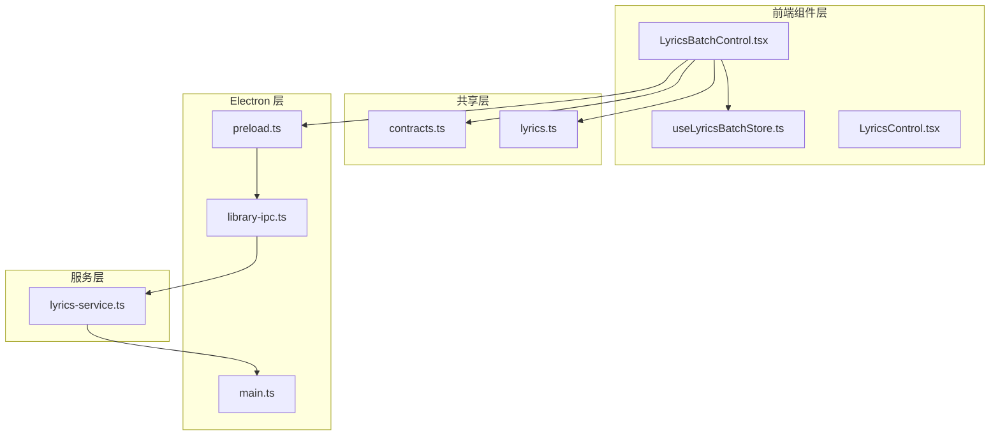
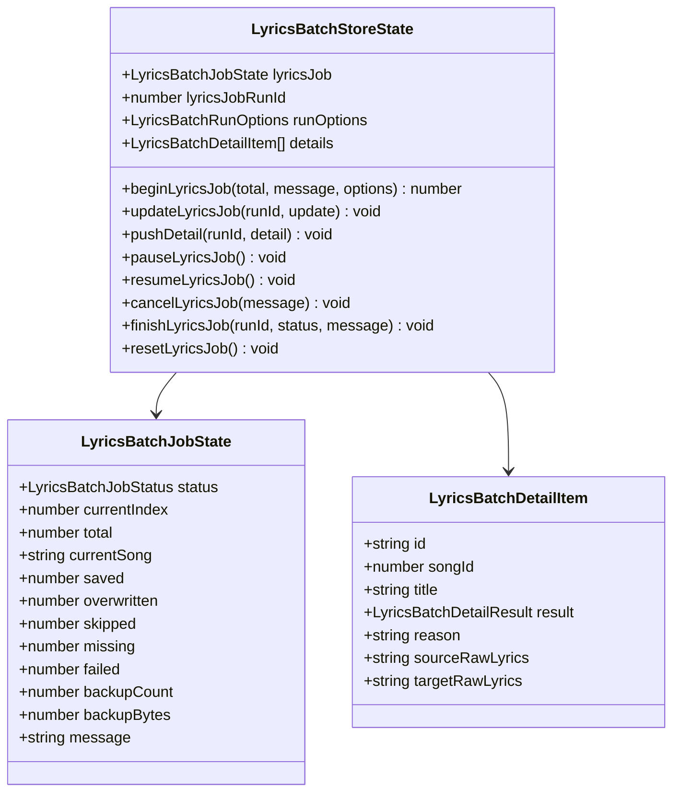
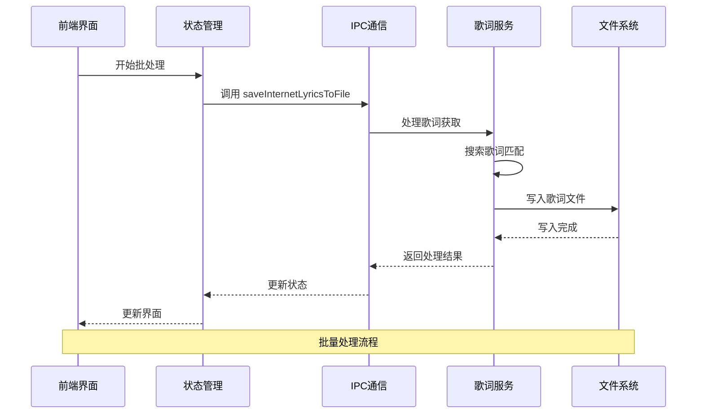
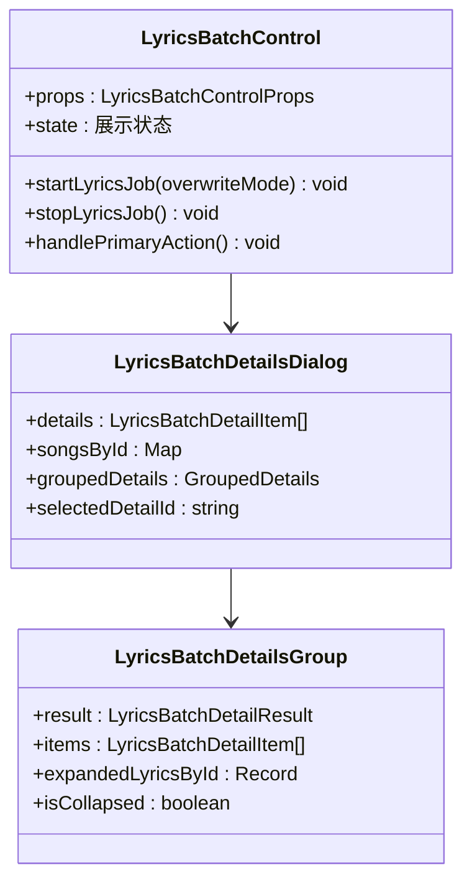
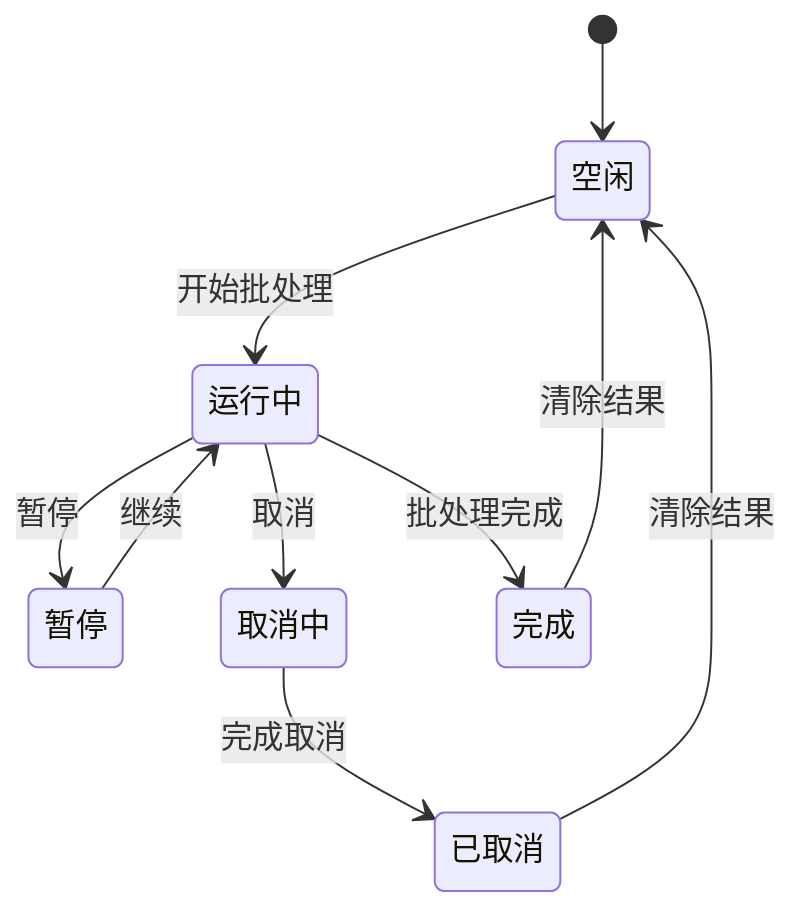
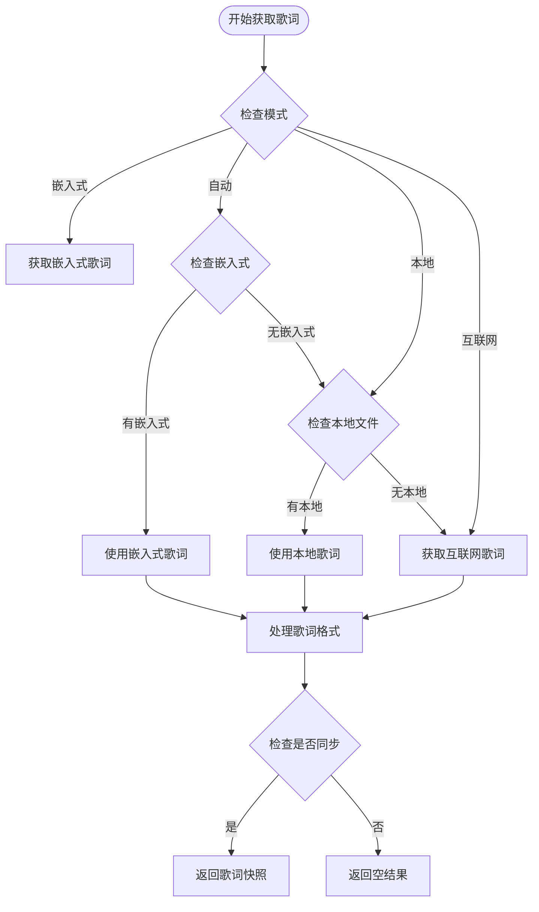
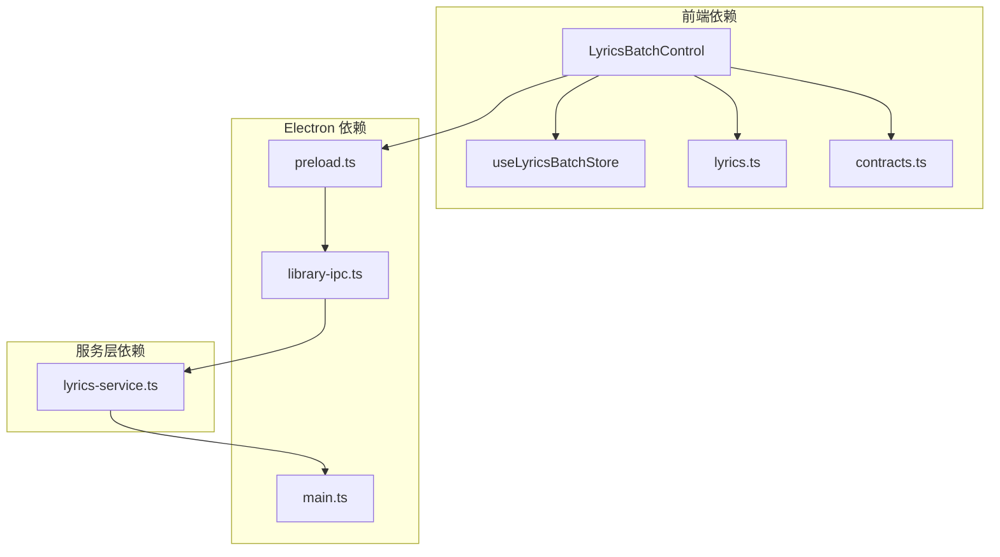

# 批处理歌词控制组件

<cite>
**本文档引用的文件**
- [LyricsBatchControl.tsx](file://src/components/LyricsBatchControl.tsx)
- [useLyricsBatchStore.ts](file://src/state/useLyricsBatchStore.ts)
- [lyrics-service.ts](file://electron/services/lyrics-service.ts)
- [lyrics.ts](file://src/shared/lyrics.ts)
- [contracts.ts](file://src/shared/contracts.ts)
- [preload.ts](file://electron/preload.ts)
- [library-ipc.ts](file://electron/ipc/library-ipc.ts)
- [main.ts](file://electron/main.ts)
</cite>

## 目录
1. [简介](#简介)
2. [项目结构](#项目结构)
3. [核心组件](#核心组件)
4. [架构概览](#架构概览)
5. [详细组件分析](#详细组件分析)
6. [依赖关系分析](#依赖关系分析)
7. [性能考虑](#性能考虑)
8. [故障排除指南](#故障排除指南)
9. [结论](#结论)

## 简介

批处理歌词控制组件是 SMPlayer 音乐播放器中一个重要的功能模块，允许用户批量处理音乐文件的歌词信息。该组件提供了完整的歌词管理功能，包括从互联网获取歌词、保存到本地文件、覆盖现有歌词以及详细的处理结果跟踪。

该组件采用 React 组件化设计，结合 Electron 的 IPC 通信机制，在前端提供用户友好的界面，同时在后端通过服务层处理复杂的歌词获取和存储逻辑。

## 项目结构

批处理歌词控制组件位于项目的前端组件目录中，与相关的状态管理和服务层紧密配合：

**图表来源**
- [LyricsBatchControl.tsx:1-50](file://src/components/LyricsBatchControl.tsx#L1-L50)
- [useLyricsBatchStore.ts:1-50](file://src/state/useLyricsBatchStore.ts#L1-L50)
- [lyrics-service.ts:1-50](file://electron/services/lyrics-service.ts#L1-L50)

**章节来源**
- [LyricsBatchControl.tsx:1-100](file://src/components/LyricsBatchControl.tsx#L1-L100)
- [useLyricsBatchStore.ts:1-80](file://src/state/useLyricsBatchStore.ts#L1-L80)

## 核心组件

### LyricsBatchControl 主组件

LyricsBatchControl 是整个批处理歌词功能的核心组件，负责：

- **用户界面管理**：提供开始、暂停、继续、取消等操作按钮
- **进度跟踪**：实时显示处理进度和统计信息
- **详细结果展示**：提供详细的处理结果对话框
- **配置选项**：支持不同的歌词源选择和写入策略

### 状态管理

使用 Zustand 状态管理库创建专门的批处理状态存储：

**图表来源**
- [useLyricsBatchStore.ts:35-48](file://src/state/useLyricsBatchStore.ts#L35-L48)

### 歌词服务层

歌词服务层处理所有实际的歌词获取和存储逻辑：

- **多源支持**：支持互联网、本地文件、嵌入式歌词等多种来源
- **智能匹配**：自动搜索最佳歌词匹配
- **格式转换**：处理不同格式的歌词数据
- **文件写入**：将歌词保存到合适的文件位置

**章节来源**
- [LyricsBatchControl.tsx:122-506](file://src/components/LyricsBatchControl.tsx#L122-L506)
- [useLyricsBatchStore.ts:67-187](file://src/state/useLyricsBatchStore.ts#L67-L187)

## 架构概览

批处理歌词控制组件采用分层架构设计，确保前后端分离和职责明确：

**图表来源**
- [LyricsBatchControl.tsx:160-333](file://src/components/LyricsBatchControl.tsx#L160-L333)
- [preload.ts:64-68](file://electron/preload.ts#L64-L68)
- [library-ipc.ts:183-184](file://electron/ipc/library-ipc.ts#L183-L184)

**章节来源**
- [lyrics-service.ts:105-126](file://electron/services/lyrics-service.ts#L105-L126)
- [main.ts:160-170](file://electron/main.ts#L160-L170)

## 详细组件分析

### 用户界面组件

LyricsBatchControl 提供了丰富的用户交互功能：

#### 主要功能特性

1. **操作控制面板**
   - 开始/暂停/继续/取消按钮
   - 进度条显示
   - 实时统计信息

2. **配置选项**
   - 歌词源选择（自动、互联网、本地、嵌入式）
   - 自动歌词设置
   - 时间戳保留选项

3. **详细结果展示**
   - 分类显示处理结果
   - 支持展开查看详细信息
   - 备份记录跟踪

#### 界面组件结构

**图表来源**
- [LyricsBatchControl.tsx:508-780](file://src/components/LyricsBatchControl.tsx#L508-L780)

### 状态管理系统

状态管理采用函数式编程模式，提供完整的批处理生命周期管理：

#### 状态流转图

**图表来源**
- [useLyricsBatchStore.ts:3-48](file://src/state/useLyricsBatchStore.ts#L3-L48)

### 歌词服务处理逻辑

歌词服务层实现了复杂的歌词处理算法：

#### 歌词获取流程

**图表来源**
- [lyrics-service.ts:50-93](file://electron/services/lyrics-service.ts#L50-L93)

**章节来源**
- [lyrics-service.ts:385-409](file://electron/services/lyrics-service.ts#L385-L409)
- [lyrics.ts:63-76](file://src/shared/lyrics.ts#L63-L76)

## 依赖关系分析

### 组件间依赖关系

**图表来源**
- [LyricsBatchControl.tsx:1-15](file://src/components/LyricsBatchControl.tsx#L1-L15)
- [preload.ts:64-68](file://electron/preload.ts#L64-L68)

### 外部依赖

组件依赖于以下外部库和服务：

1. **React 生态系统**：用于构建用户界面
2. **Zustand**：轻量级状态管理
3. **Electron IPC**：前后端通信
4. **music-metadata**：音频文件元数据解析
5. **第三方歌词服务**：QQ音乐歌词接口

**章节来源**
- [lyrics-service.ts:1-25](file://electron/services/lyrics-service.ts#L1-L25)
- [contracts.ts:195-197](file://src/shared/contracts.ts#L195-L197)

## 性能考虑

### 并发处理优化

批处理歌词组件采用了多项性能优化措施：

1. **请求节流**：每个请求间隔至少200毫秒，避免过度请求
2. **异步处理**：使用 Promise 和 async/await 确保非阻塞操作
3. **状态更新优化**：批量更新状态，减少不必要的重渲染
4. **内存管理**：及时清理事件监听器和定时器

### 存储优化

1. **增量更新**：只更新变化的状态字段
2. **缓存机制**：对已获取的歌词进行缓存
3. **文件系统优化**：智能检测文件存在性，避免重复读取

## 故障排除指南

### 常见问题及解决方案

#### 歌词获取失败

**症状**：批处理过程中出现大量 "missing" 结果

**可能原因**：
1. 网络连接问题
2. 歌词服务不可用
3. 歌曲信息不完整

**解决方法**：
1. 检查网络连接
2. 验证歌曲标题和艺术家信息
3. 尝试手动搜索歌词

#### 文件写入错误

**症状**：部分歌曲无法保存歌词文件

**可能原因**：
1. 文件权限不足
2. 磁盘空间不足
3. 文件被其他程序占用

**解决方法**：
1. 检查文件权限
2. 确保磁盘有足够的可用空间
3. 关闭占用文件的程序

#### 性能问题

**症状**：批处理速度过慢

**优化建议**：
1. 减少同时运行的进程数量
2. 检查磁盘性能
3. 关闭不必要的应用程序

**章节来源**
- [LyricsBatchControl.tsx:192-333](file://src/components/LyricsBatchControl.tsx#L192-L333)
- [lyrics-service.ts:231-238](file://electron/services/lyrics-service.ts#L231-L238)

## 结论

批处理歌词控制组件是一个功能完整、架构清晰的音乐播放器功能模块。它成功地将复杂的歌词处理逻辑封装在简洁易用的用户界面背后，为用户提供了强大的批量歌词管理能力。

该组件的主要优势包括：

1. **用户友好**：直观的操作界面和详细的进度反馈
2. **功能全面**：支持多种歌词源和处理策略
3. **性能优化**：合理的并发控制和资源管理
4. **可扩展性**：清晰的架构设计便于功能扩展

通过合理的状态管理和服务层抽象，该组件为 SMPlayer 提供了可靠的歌词处理能力，显著提升了用户体验。