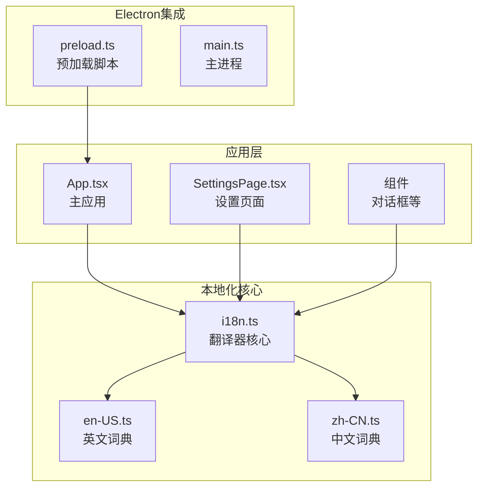
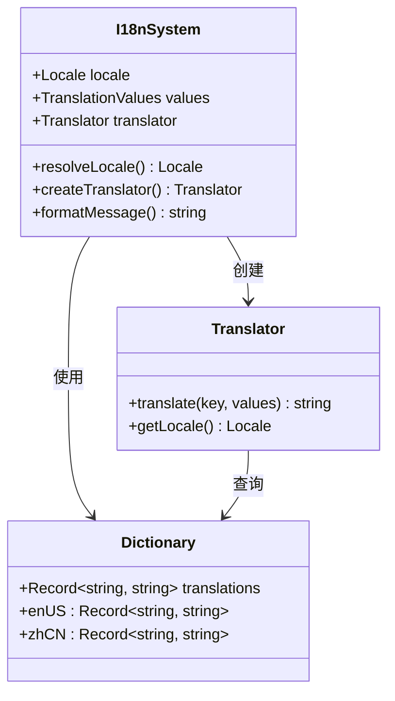
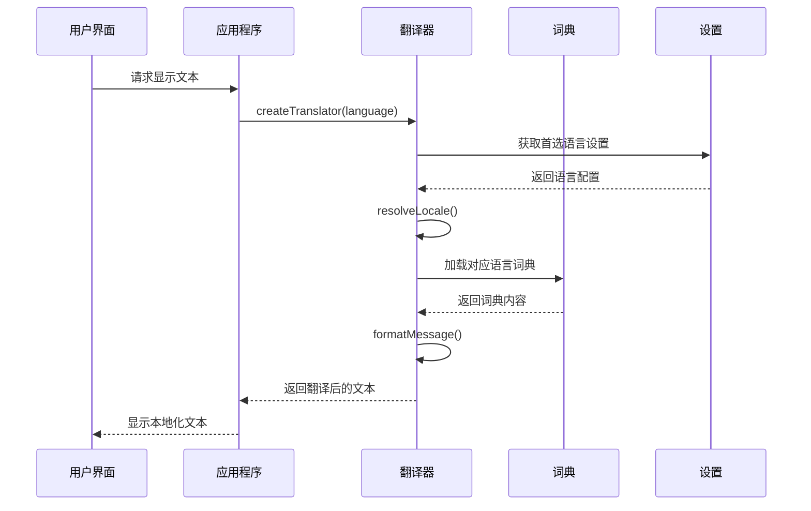
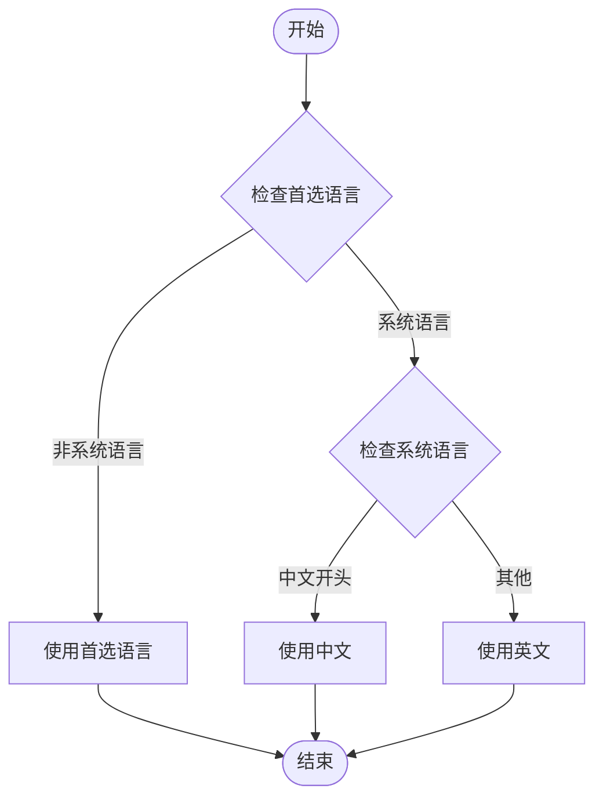
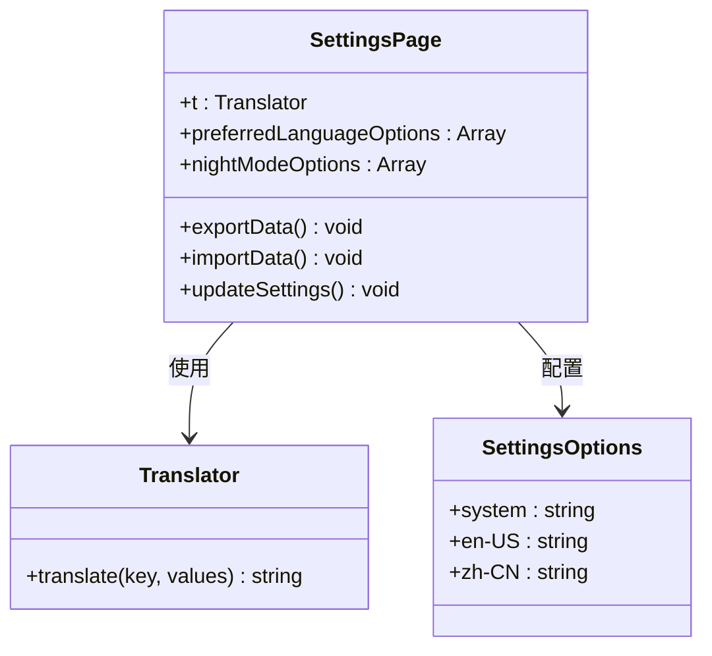
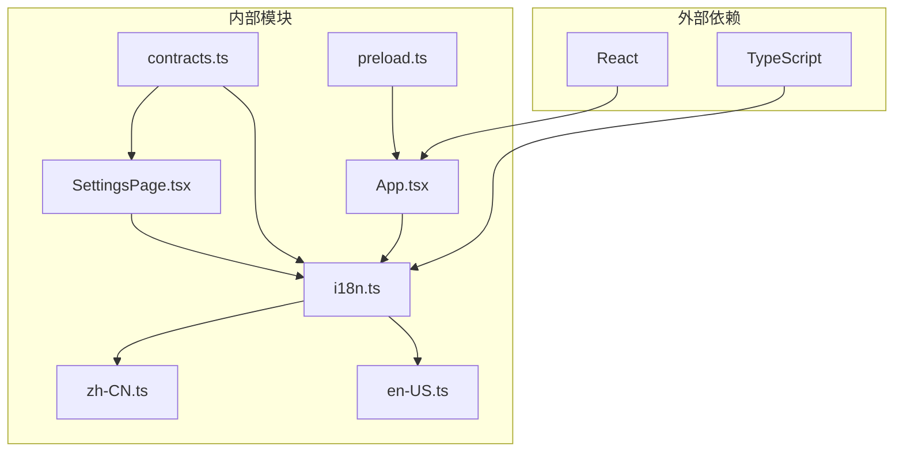

# 本地化支持

<cite>
**本文档引用的文件**
- [i18n.ts](file://src/shared/i18n.ts)
- [en-US.ts](file://src/shared/locales/en-US.ts)
- [zh-CN.ts](file://src/shared/locales/zh-CN.ts)
- [SettingsPage.tsx](file://src/pages/SettingsPage.tsx)
- [contracts.ts](file://src/shared/contracts.ts)
- [App.tsx](file://src/App.tsx)
- [preload.ts](file://electron/preload.ts)
- [package.json](file://package.json)
</cite>

## 目录
1. [简介](#简介)
2. [项目结构](#项目结构)
3. [核心组件](#核心组件)
4. [架构概览](#架构概览)
5. [详细组件分析](#详细组件分析)
6. [依赖关系分析](#依赖关系分析)
7. [性能考虑](#性能考虑)
8. [故障排除指南](#故障排除指南)
9. [结论](#结论)

## 简介

本项目实现了完整的多语言本地化支持系统，支持英语（美国）和中文（简体）两种语言。本地化系统采用键值对映射的方式，通过统一的翻译器接口提供国际化功能，涵盖了应用程序的所有用户界面文本。

## 项目结构

本地化功能主要分布在以下目录和文件中：

**图表来源**
- [i18n.ts:1-48](file://src/shared/i18n.ts#L1-L48)
- [en-US.ts:1-770](file://src/shared/locales/en-US.ts#L1-L770)
- [zh-CN.ts:1-770](file://src/shared/locales/zh-CN.ts#L1-L770)

**章节来源**
- [i18n.ts:1-48](file://src/shared/i18n.ts#L1-L48)
- [en-US.ts:1-770](file://src/shared/locales/en-US.ts#L1-L770)
- [zh-CN.ts:1-770](file://src/shared/locales/zh-CN.ts#L1-L770)

## 核心组件

### 翻译器系统

翻译器系统由三个核心部分组成：

1. **语言解析器** - 根据用户首选语言和系统语言确定实际使用的语言
2. **翻译器工厂** - 创建特定语言的翻译函数
3. **消息格式化器** - 处理带参数的动态文本

**图表来源**
- [i18n.ts:14-48](file://src/shared/i18n.ts#L14-L48)

### 语言词典

系统提供了两个完整的语言词典，每个词典包含约770个翻译键值对：

- **英文词典 (en-US)**: 覆盖应用程序的所有界面文本
- **中文词典 (zh-CN)**: 提供对应的中文翻译

**章节来源**
- [en-US.ts:1-770](file://src/shared/locales/en-US.ts#L1-L770)
- [zh-CN.ts:1-770](file://src/shared/locales/zh-CN.ts#L1-L770)

## 架构概览

本地化系统的整体架构采用分层设计：

**图表来源**
- [App.tsx:426-429](file://src/App.tsx#L426-L429)
- [i18n.ts:29-37](file://src/shared/i18n.ts#L29-L37)

## 详细组件分析

### 翻译器实现

翻译器系统的核心功能包括：

#### 语言解析逻辑

**图表来源**
- [i18n.ts:14-27](file://src/shared/i18n.ts#L14-L27)

#### 动态参数替换
翻译器支持在文本中使用占位符进行动态参数替换：

**章节来源**
- [i18n.ts:39-48](file://src/shared/i18n.ts#L39-L48)

### 设置页面集成

设置页面提供了完整的语言选择功能：

**图表来源**
- [SettingsPage.tsx:364-371](file://src/pages/SettingsPage.tsx#L364-L371)
- [SettingsPage.tsx:548-555](file://src/pages/SettingsPage.tsx#L548-L555)

**章节来源**
- [SettingsPage.tsx:346-737](file://src/pages/SettingsPage.tsx#L346-L737)

### 主应用集成

主应用在启动时初始化翻译器：

**章节来源**
- [App.tsx:426-429](file://src/App.tsx#L426-L429)

### 组件使用模式

各种UI组件都遵循统一的使用模式：

**章节来源**
- [App.tsx:450-453](file://src/App.tsx#L450-L453)
- [App.tsx:808-809](file://src/App.tsx#L808-L809)

## 依赖关系分析

本地化系统与其他模块的依赖关系：

**图表来源**
- [contracts.ts:197-357](file://src/shared/contracts.ts#L197-L357)
- [App.tsx:37-37](file://src/App.tsx#L37-L37)

**章节来源**
- [contracts.ts:1-664](file://src/shared/contracts.ts#L1-L664)

## 性能考虑

本地化系统在性能方面的优化措施：

1. **懒加载词典** - 仅在需要时加载对应语言的词典
2. **内存缓存** - 翻译器实例在应用生命周期内复用
3. **字符串查找优化** - 使用对象属性访问而非数组遍历
4. **参数替换优化** - 仅在需要时进行字符串替换操作

## 故障排除指南

### 常见问题及解决方案

#### 语言切换不生效
- 检查设置页面的语言选项是否正确保存
- 确认应用重启后设置仍然有效
- 验证 `preferredLanguage` 设置值

#### 翻译文本显示异常
- 检查翻译键是否存在
- 验证动态参数是否正确传递
- 确认词典文件完整性

#### 中文显示乱码
- 检查文件编码设置
- 验证字体支持情况
- 确认系统语言设置

**章节来源**
- [i18n.ts:14-27](file://src/shared/i18n.ts#L14-L27)
- [SettingsPage.tsx:548-555](file://src/pages/SettingsPage.tsx#L548-L555)

## 结论

本项目的本地化系统设计合理，实现了完整的多语言支持功能。系统具有以下特点：

1. **模块化设计** - 翻译器、词典和应用层分离，便于维护和扩展
2. **灵活的语言选择** - 支持用户自定义语言和系统语言检测
3. **完整的文本覆盖** - 词典包含应用程序的所有界面文本
4. **性能优化** - 采用懒加载和缓存机制提高运行效率
5. **易于扩展** - 新增语言只需添加相应的词典文件

该系统为用户提供了良好的国际化体验，支持全球用户的本地化需求。