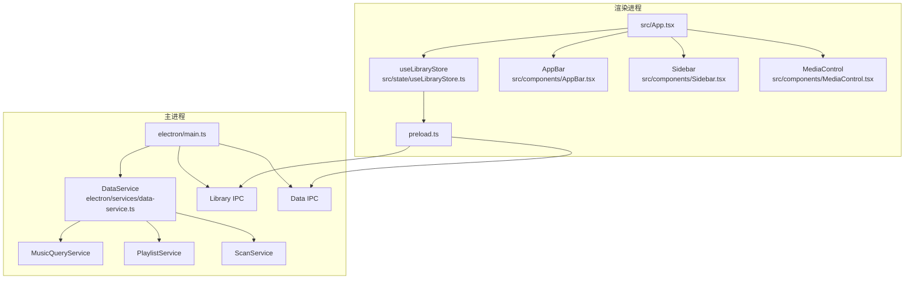
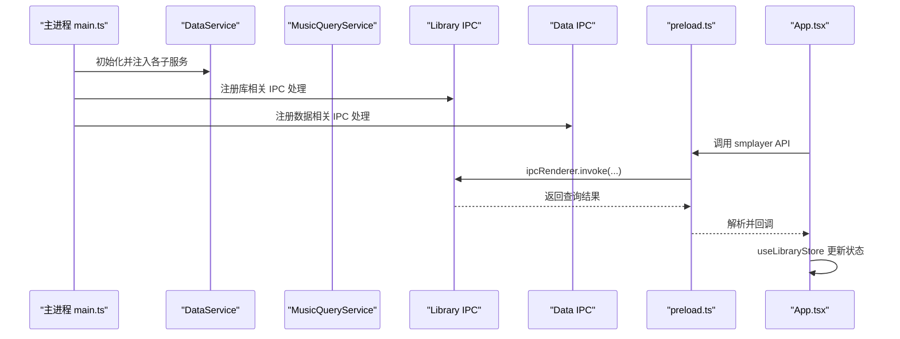
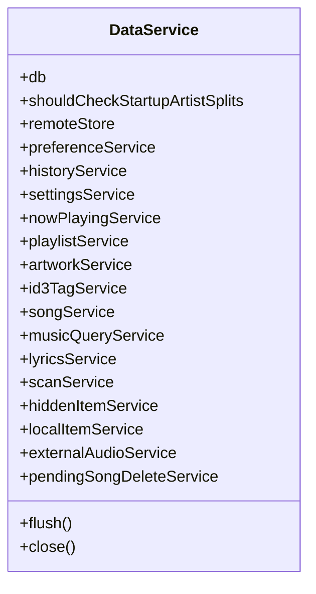
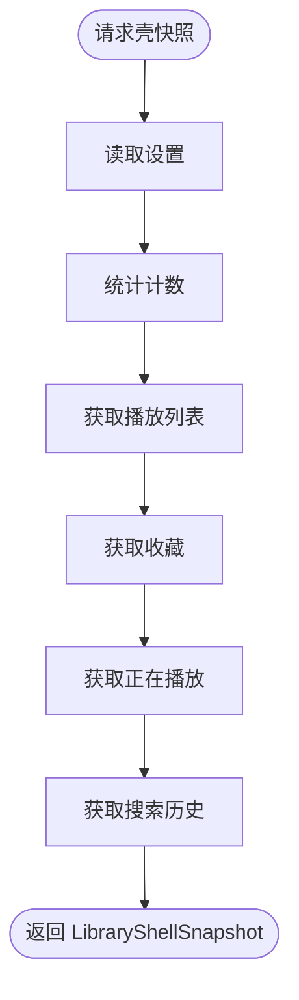
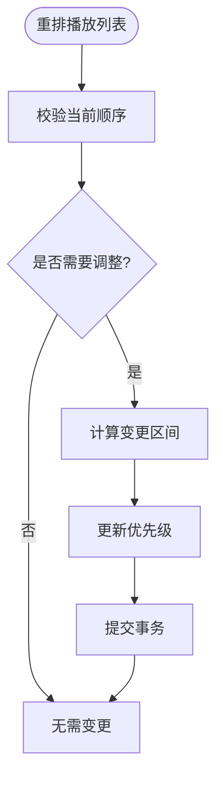
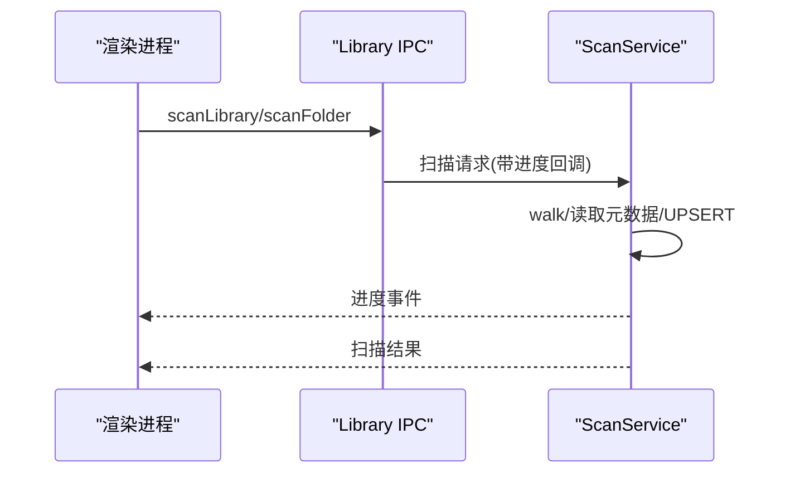
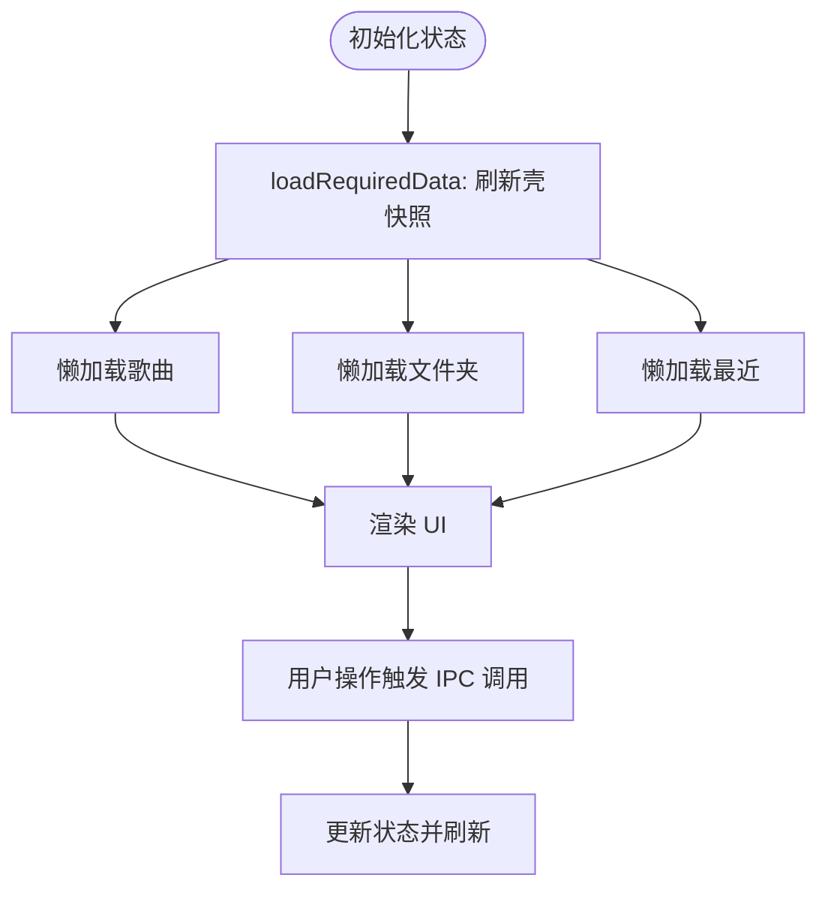
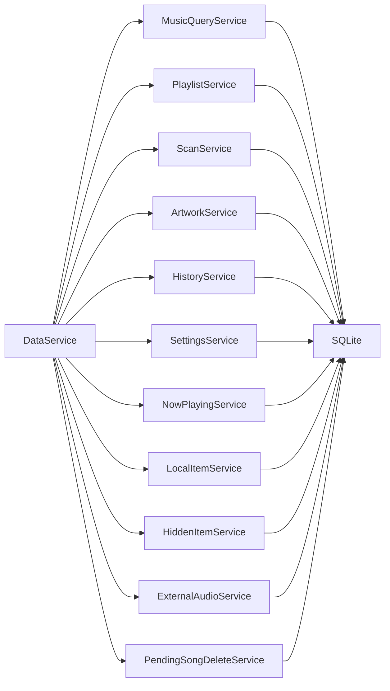

# 核心模块

<cite>
**本文引用的文件**
- [electron/main.ts](file://electron/main.ts)
- [electron/preload.ts](file://electron/preload.ts)
- [src/App.tsx](file://src/App.tsx)
- [src/appModel.ts](file://src/appModel.ts)
- [src/state/libraryStoreModel.ts](file://src/state/libraryStoreModel.ts)
- [src/state/useLibraryStore.ts](file://src/state/useLibraryStore.ts)
- [src/components/AppBar.tsx](file://src/components/AppBar.tsx)
- [src/components/Sidebar.tsx](file://src/components/Sidebar.tsx)
- [src/components/MediaControl.tsx](file://src/components/MediaControl.tsx)
- [electron/services/data-service.ts](file://electron/services/data-service.ts)
- [electron/services/music-query-service.ts](file://electron/services/music-query-service.ts)
- [electron/services/playlist-service.ts](file://electron/services/playlist-service.ts)
- [electron/services/scan-service.ts](file://electron/services/scan-service.ts)
- [electron/ipc/data-ipc.ts](file://electron/ipc/data-ipc.ts)
- [electron/ipc/library-ipc.ts](file://electron/ipc/library-ipc.ts)
</cite>

## 目录
1. [简介](#简介)
2. [项目结构](#项目结构)
3. [核心组件](#核心组件)
4. [架构总览](#架构总览)
5. [详细组件分析](#详细组件分析)
6. [依赖关系分析](#依赖关系分析)
7. [性能考量](#性能考量)
8. [故障排除指南](#故障排除指南)
9. [结论](#结论)
10. [附录](#附录)

## 简介
本文件系统性梳理 SMPlayer 的核心模块，覆盖主进程服务层（数据服务、音乐查询服务、播放列表服务、扫描服务等）、前端组件层（应用栏、侧边栏、媒体控制等）、状态管理层与 IPC 通信层。文档解释各模块职责、实现原理、协作关系与扩展点，并提供接口说明、使用示例与最佳实践，帮助开发者理解与修改核心功能。

## 项目结构
SMPlayer 采用 Electron + React 架构，主进程负责媒体库数据与系统集成，渲染进程负责 UI 与用户交互，二者通过 IPC 桥接。核心目录与职责如下：
- electron 主进程：服务注册、数据库与业务逻辑、窗口与托盘控制、协议与语音识别集成
- src 渲染进程：UI 组件、路由与页面、状态管理（Zustand）、国际化与工具函数
- electron/ipc：主进程到渲染进程的 IPC 注册与处理
- electron/services：数据服务与各子服务（查询、播放列表、扫描、歌词、专辑封面等）

图表来源
- [electron/main.ts:141-209](file://electron/main.ts#L141-L209)
- [electron/services/data-service.ts:39-145](file://electron/services/data-service.ts#L39-L145)
- [electron/ipc/library-ipc.ts:28-302](file://electron/ipc/library-ipc.ts#L28-L302)
- [electron/ipc/data-ipc.ts:20-151](file://electron/ipc/data-ipc.ts#L20-L151)
- [src/App.tsx:71-525](file://src/App.tsx#L71-L525)
- [src/state/useLibraryStore.ts:111-411](file://src/state/useLibraryStore.ts#L111-L411)
- [electron/preload.ts:45-287](file://electron/preload.ts#L45-L287)

章节来源
- [electron/main.ts:141-209](file://electron/main.ts#L141-L209)
- [src/App.tsx:71-525](file://src/App.tsx#L71-L525)

## 核心组件
- 数据服务层（主进程）
  - DataService：聚合所有子服务（设置、历史、播放列表、歌曲、查询、歌词、扫描、隐藏项、外部音频、待删歌曲等），统一初始化与清理
  - MusicQueryService：从数据库读取壳快照（设置、计数、播放列表、收藏、正在播放、搜索）与各类实体集合
  - PlaylistService：播放列表 CRUD、排序、歌曲增删改
  - ScanService：全库/指定目录扫描、元数据读取、艺术家拆分与合并建议、缩略图缓存维护
- 前端状态与组件
  - useLibraryStore：Zustand 状态容器，封装 IPC 调用与状态更新
  - AppBar/Sidebar/MediaControl：应用栏、导航侧边栏、媒体控制条 UI 组件
- IPC 层
  - Library IPC：媒体库查询、封面、歌曲属性、扫描、歌词导入导出、本地文件操作、隐藏项恢复等
  - Data IPC：播放列表、队列、搜索历史、设置、偏好、播放器运行时设置等

章节来源
- [electron/services/data-service.ts:39-145](file://electron/services/data-service.ts#L39-L145)
- [electron/services/music-query-service.ts:50-180](file://electron/services/music-query-service.ts#L50-L180)
- [electron/services/playlist-service.ts:9-145](file://electron/services/playlist-service.ts#L9-L145)
- [electron/services/scan-service.ts:65-129](file://electron/services/scan-service.ts#L65-L129)
- [src/state/useLibraryStore.ts:111-411](file://src/state/useLibraryStore.ts#L111-L411)
- [src/components/AppBar.tsx:18-44](file://src/components/AppBar.tsx#L18-L44)
- [src/components/Sidebar.tsx:67-120](file://src/components/Sidebar.tsx#L67-L120)
- [src/components/MediaControl.tsx:38-105](file://src/components/MediaControl.tsx#L38-L105)
- [electron/ipc/library-ipc.ts:28-302](file://electron/ipc/library-ipc.ts#L28-L302)
- [electron/ipc/data-ipc.ts:20-151](file://electron/ipc/data-ipc.ts#L20-L151)

## 架构总览
主进程启动后创建窗口、初始化 DataService 并注册 IPC；渲染进程通过 preload 暴露的 smplayer API 与主进程通信，useLibraryStore 将 IPC 结果映射为应用状态，驱动 UI 组件渲染与交互。

图表来源
- [electron/main.ts:141-209](file://electron/main.ts#L141-L209)
- [electron/ipc/library-ipc.ts:40-52](file://electron/ipc/library-ipc.ts#L40-L52)
- [electron/ipc/data-ipc.ts:28-36](file://electron/ipc/data-ipc.ts#L28-L36)
- [electron/preload.ts:45-287](file://electron/preload.ts#L45-L287)
- [src/App.tsx:134-167](file://src/App.tsx#L134-L167)

## 详细组件分析

### 主进程服务模块

#### DataService（数据服务）
- 职责：聚合所有业务服务，初始化数据库与表结构，提供统一访问入口
- 关键依赖：SettingsService、HistoryService、NowPlayingService、PlaylistService、ArtworkService、SongService、MusicQueryService、LyricsService、ScanService、HiddenItemService、LocalItemService、ExternalAudioService、PendingSongDeleteService
- 生命周期：构造时初始化 schema，提供 flush/close 钩子

图表来源
- [electron/services/data-service.ts:39-145](file://electron/services/data-service.ts#L39-L145)

章节来源
- [electron/services/data-service.ts:39-198](file://electron/services/data-service.ts#L39-L198)

#### MusicQueryService（音乐查询服务）
- 职责：提供壳快照与各类实体查询（歌曲、播放列表、收藏、最近、计数、搜索）
- 查询优化：预编译 SQL 语句，按需返回实体字段，艺术家归并与规范化
- 输出格式：标准化日期、媒体/封面 URL、收藏标记

图表来源
- [electron/services/music-query-service.ts:171-180](file://electron/services/music-query-service.ts#L171-L180)
- [electron/services/music-query-service.ts:182-288](file://electron/services/music-query-service.ts#L182-L288)

章节来源
- [electron/services/music-query-service.ts:50-418](file://electron/services/music-query-service.ts#L50-L418)

#### PlaylistService（播放列表服务）
- 职责：播放列表 CRUD、重排、歌曲增删改、内置/自定义区分、优先级管理
- 并发安全：事务包裹，失败回滚
- 排序策略：支持标题/艺术家/专辑等排序准则映射

图表来源
- [electron/services/playlist-service.ts:288-332](file://electron/services/playlist-service.ts#L288-L332)

章节来源
- [electron/services/playlist-service.ts:9-508](file://electron/services/playlist-service.ts#L9-L508)

#### ScanService（扫描服务）
- 职责：全库/目录扫描、元数据批量读取、艺术家智能拆分/合并建议、缩略图缓存维护
- 进度上报：检查目录、读取元数据、写入数据库三阶段进度
- 取消机制：基于 operationId 的取消集合

图表来源
- [electron/ipc/library-ipc.ts:205-250](file://electron/ipc/library-ipc.ts#L205-L250)
- [electron/services/scan-service.ts:131-306](file://electron/services/scan-service.ts#L131-L306)

章节来源
- [electron/services/scan-service.ts:65-800](file://electron/services/scan-service.ts#L65-L800)
- [electron/ipc/library-ipc.ts:205-250](file://electron/ipc/library-ipc.ts#L205-L250)

### 前端组件模块

#### AppBar（应用栏）
- 职责：标题区、菜单按钮、页面动作区布局
- 交互：菜单点击回调、可选 actions 区域

章节来源
- [src/components/AppBar.tsx:18-44](file://src/components/AppBar.tsx#L18-L44)

#### Sidebar（侧边栏）
- 职责：主/播放/播放列表导航、搜索输入与历史、播放列表拖拽重排、右键菜单与重命名对话框
- 交互：折叠/展开、回到上一页、创建/删除/重命名播放列表、随机播放

章节来源
- [src/components/Sidebar.tsx:67-120](file://src/components/Sidebar.tsx#L67-L120)
- [src/components/Sidebar.tsx:340-440](file://src/components/Sidebar.tsx#L340-L440)

#### MediaControl（媒体控制）
- 职责：播放/暂停、上一首/下一首、进度拖动、音量调节、重复/随机模式切换、收藏、更多菜单、语音助手
- 状态：播放进度、音量、静音、模式、加载状态

章节来源
- [src/components/MediaControl.tsx:38-105](file://src/components/MediaControl.tsx#L38-L105)
- [src/components/MediaControl.tsx:709-756](file://src/components/MediaControl.tsx#L709-L756)

### 状态管理模块

#### useLibraryStore（Zustand 状态）
- 职责：集中管理音乐库状态（壳快照、计数、歌曲、播放列表、收藏、最近、设置、视图状态等），封装 IPC 调用与错误处理
- 加载策略：懒加载歌曲/文件夹/最近数据，批量刷新与增量更新
- 扫描流程：生成 operationId、监听进度、后台刷新

图表来源
- [src/state/useLibraryStore.ts:124-319](file://src/state/useLibraryStore.ts#L124-L319)
- [src/state/useLibraryStore.ts:339-470](file://src/state/useLibraryStore.ts#L339-L470)

章节来源
- [src/state/useLibraryStore.ts:111-800](file://src/state/useLibraryStore.ts#L111-L800)
- [src/state/libraryStoreModel.ts:12-120](file://src/state/libraryStoreModel.ts#L12-L120)

### IPC 通信模块

#### Library IPC（库相关）
- 查询：壳快照、设置、计数、歌曲、文件夹、最近、播放列表、收藏、正在播放、搜索
- 封面：单/多封面快照、选择/保存/删除封面
- 歌曲：属性读写、播放次数更新、歌词导入/保存/搜索/下载
- 扫描：全库/目录扫描、准备扫描、取消扫描、分析艺术家拆分
- 本地文件：移动/删除/隐藏、根目录选择、导入/导出数据库

章节来源
- [electron/ipc/library-ipc.ts:28-302](file://electron/ipc/library-ipc.ts#L28-L302)

#### Data IPC（数据相关）
- 播放列表：创建/删除/恢复/重命名/重排、歌曲增删改
- 队列：替换/移除/清空
- 搜索历史：保存/添加/移除/恢复/清空
- 最近播放：记录/移除/恢复/清空
- 设置与偏好：更新设置、保存视图状态、播放器运行时设置

章节来源
- [electron/ipc/data-ipc.ts:20-151](file://electron/ipc/data-ipc.ts#L20-L151)

## 依赖关系分析

图表来源
- [electron/services/data-service.ts:73-142](file://electron/services/data-service.ts#L73-L142)

章节来源
- [electron/services/data-service.ts:39-198](file://electron/services/data-service.ts#L39-L198)

## 性能考量
- 数据库事务批处理：扫描与播放列表重排均在事务中执行，减少磁盘写入次数
- 懒加载与并发：useLibraryStore 对歌曲/文件夹/最近数据进行并发加载与去重请求
- 进度上报与异步刷新：扫描进度通过事件异步推送，完成后后台刷新避免阻塞 UI
- 缓存与清理：缩略图缓存定期清理，封面变更后清理会话缓存
- IPC 同步/异步：即时设置通过同步通道，耗时操作通过异步 invoke 并监听进度

章节来源
- [electron/services/playlist-service.ts:175-201](file://electron/services/playlist-service.ts#L175-L201)
- [electron/services/scan-service.ts:289-293](file://electron/services/scan-service.ts#L289-L293)
- [electron/ipc/library-ipc.ts:210-224](file://electron/ipc/library-ipc.ts#L210-L224)
- [src/state/useLibraryStore.ts:145-169](file://src/state/useLibraryStore.ts#L145-L169)

## 故障排除指南
- 扫描取消：调用取消接口后，服务端会检查 operationId 并停止后续写入
- 扫描异常：捕获错误并返回统一错误消息，UI 根据消息提示或隐藏进度
- 删除确认：删除歌曲/本地项采用“待删”机制，支持撤销与最终提交
- 导入/导出：导入前关闭数据库连接并复制文件，完成后重建服务实例并更新跳转列表
- 托盘/跳转列表：设置变更后及时更新托盘菜单与 Windows 跳转列表

章节来源
- [electron/ipc/library-ipc.ts:248-250](file://electron/ipc/library-ipc.ts#L248-L250)
- [src/state/useLibraryStore.ts:471-476](file://src/state/useLibraryStore.ts#L471-L476)
- [electron/ipc/library-ipc.ts:290-301](file://electron/ipc/library-ipc.ts#L290-L301)
- [electron/main.ts:221-232](file://electron/main.ts#L221-L232)

## 结论
SMPlayer 的核心以“服务层 + 组件化 + 状态管理 + IPC”为主线，主进程聚焦数据与系统能力，渲染进程专注 UI 与交互体验。模块间通过清晰的职责边界与 IPC 协议协作，具备良好的可扩展性与可维护性。建议在新增功能时遵循现有模式：在主进程新增服务并在 DataService 中聚合，在 Library/Data IPC 中暴露接口，最后在渲染进程通过 useLibraryStore 与 UI 组件对接。

## 附录

### 模块扩展与自定义要点
- 新增播放列表排序准则：在设置服务中映射排序值，PlaylistService 读取并应用
- 新增扫描阶段：在 ScanService 中扩展阶段枚举与进度字段，保持与 UI 进度条一致
- 新增封面来源：在 Library IPC 中扩展选择/保存/删除封面的处理逻辑
- 新增搜索类型：在 MusicQueryService 中扩展查询维度与历史类型映射

章节来源
- [electron/services/playlist-service.ts:366-406](file://electron/services/playlist-service.ts#L366-L406)
- [electron/services/scan-service.ts:151-173](file://electron/services/scan-service.ts#L151-L173)
- [electron/ipc/library-ipc.ts:304-350](file://electron/ipc/library-ipc.ts#L304-L350)
- [electron/services/music-query-service.ts:286-288](file://electron/services/music-query-service.ts#L286-L288)