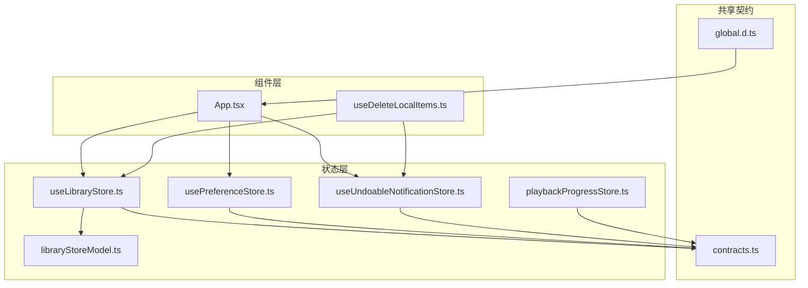
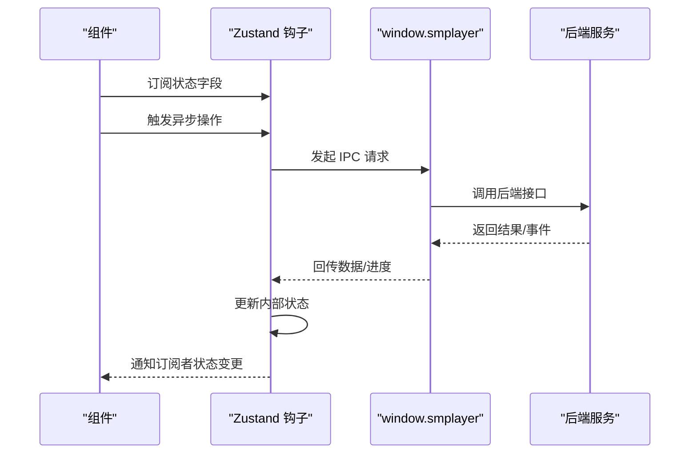
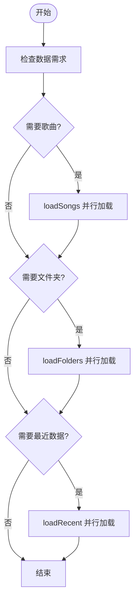
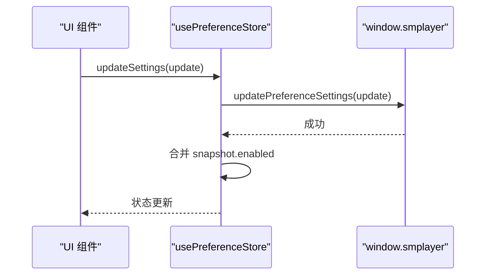
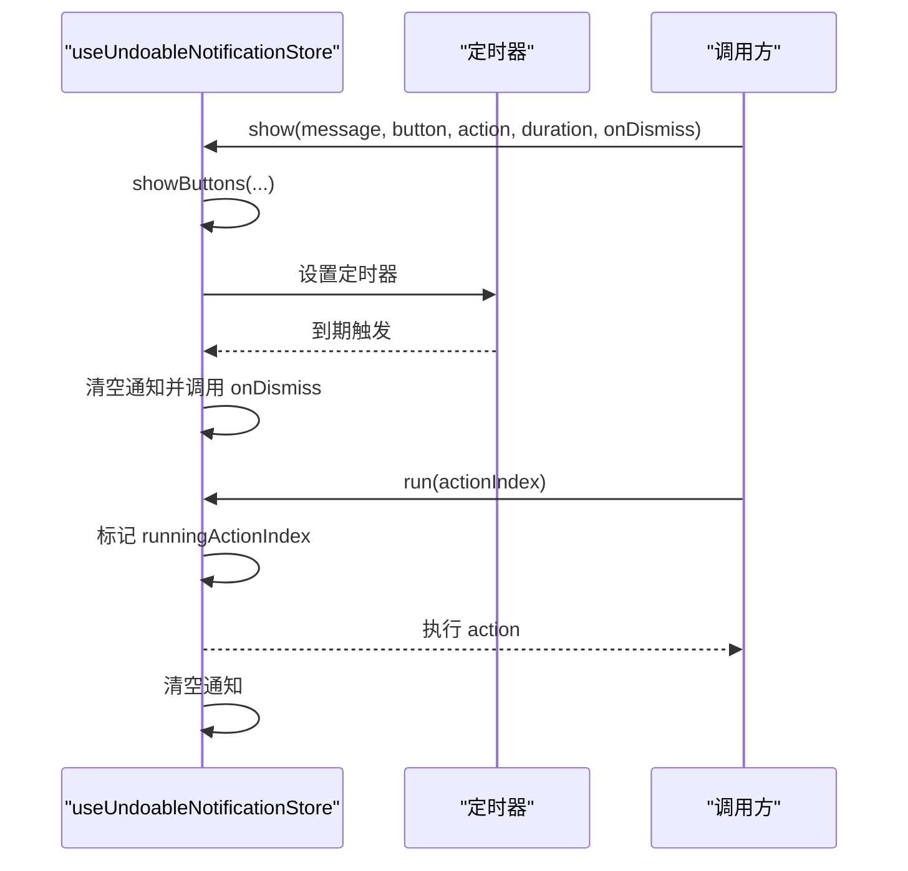
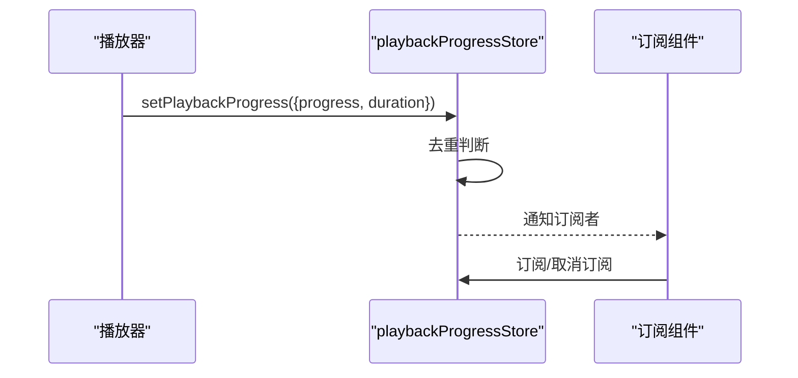
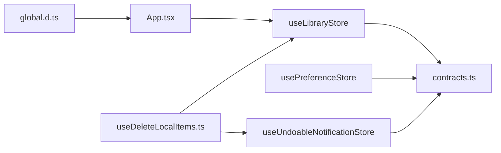

# 状态管理模块

<cite>
**本文引用的文件**
- [useLibraryStore.ts](file://src/state/useLibraryStore.ts)
- [libraryStoreModel.ts](file://src/state/libraryStoreModel.ts)
- [usePreferenceStore.ts](file://src/state/usePreferenceStore.ts)
- [useUndoableNotificationStore.ts](file://src/state/useUndoableNotificationStore.ts)
- [playbackProgressStore.ts](file://src/state/playbackProgressStore.ts)
- [contracts.ts](file://src/shared/contracts.ts)
- [global.d.ts](file://src/types/global.d.ts)
- [App.tsx](file://src/App.tsx)
- [useDeleteLocalItems.ts](file://src/hooks/useDeleteLocalItems.ts)
</cite>

## 目录
1. [简介](#简介)
2. [项目结构](#项目结构)
3. [核心组件](#核心组件)
4. [架构总览](#架构总览)
5. [详细组件分析](#详细组件分析)
6. [依赖关系分析](#依赖关系分析)
7. [性能考量](#性能考量)
8. [故障排除指南](#故障排除指南)
9. [结论](#结论)
10. [附录](#附录)

## 简介
本文件系统性梳理 SMPlayer 基于 Zustand 的状态管理架构，重点覆盖以下方面：
- 状态模型定义：MusicData、SettingsSnapshot、LibraryPlaylist 等核心数据结构
- 状态钩子设计与实现：useLibraryStore、usePreferenceStore、useUndoableNotificationStore
- 状态更新机制：同步/异步更新、批量更新、错误回滚
- 状态持久化策略：通过 IPC 调用后端服务进行持久化
- 订阅模式与组件集成：React 组件如何订阅状态变化
- 全局状态与组件状态的关系：状态隔离、同步与恢复
- 最佳实践：状态结构设计、更新优化、调试技巧
- 扩展方法：新增状态模块、修改现有结构、处理复杂逻辑
- 性能与故障排除：并发加载、进度监听、错误处理

## 项目结构
状态管理相关代码集中在 src/state 目录，并通过 src/shared/contracts.ts 定义跨层的数据契约。全局 API 通过 window.smplayer 暴露，供状态钩子调用。

**图表来源**
- [useLibraryStore.ts:1-1339](file://src/state/useLibraryStore.ts#L1-L1339)
- [libraryStoreModel.ts:1-225](file://src/state/libraryStoreModel.ts#L1-L225)
- [usePreferenceStore.ts:1-160](file://src/state/usePreferenceStore.ts#L1-L160)
- [useUndoableNotificationStore.ts:1-113](file://src/state/useUndoableNotificationStore.ts#L1-L113)
- [playbackProgressStore.ts:1-52](file://src/state/playbackProgressStore.ts#L1-L52)
- [contracts.ts:1-664](file://src/shared/contracts.ts#L1-L664)
- [global.d.ts:1-10](file://src/types/global.d.ts#L1-L10)
- [App.tsx:120-319](file://src/App.tsx#L120-L319)
- [useDeleteLocalItems.ts:1-26](file://src/hooks/useDeleteLocalItems.ts#L1-L26)

**章节来源**
- [useLibraryStore.ts:1-1339](file://src/state/useLibraryStore.ts#L1-L1339)
- [libraryStoreModel.ts:1-225](file://src/state/libraryStoreModel.ts#L1-L225)
- [usePreferenceStore.ts:1-160](file://src/state/usePreferenceStore.ts#L1-L160)
- [useUndoableNotificationStore.ts:1-113](file://src/state/useUndoableNotificationStore.ts#L1-L113)
- [playbackProgressStore.ts:1-52](file://src/state/playbackProgressStore.ts#L1-L52)
- [contracts.ts:1-664](file://src/shared/contracts.ts#L1-L664)
- [global.d.ts:1-10](file://src/types/global.d.ts#L1-L10)
- [App.tsx:120-319](file://src/App.tsx#L120-L319)
- [useDeleteLocalItems.ts:1-26](file://src/hooks/useDeleteLocalItems.ts#L1-L26)

## 核心组件
- useLibraryStore：音乐库全局状态，负责歌曲、播放列表、最近播放、文件夹、设置等的增删改查与刷新
- usePreferenceStore：偏好设置状态，负责启用/禁用实体、调整优先级、清理无效项
- useUndoableNotificationStore：可撤销通知状态，支持按钮式通知、自动消失、动作执行与回滚
- playbackProgressStore：播放进度外部存储（非 Zustand），用于高效订阅播放进度
- libraryStoreModel：状态模型工具集，包含空快照、设置补丁函数、排序转换、收藏/播放列表补丁等

**章节来源**
- [useLibraryStore.ts:42-109](file://src/state/useLibraryStore.ts#L42-L109)
- [usePreferenceStore.ts:14-24](file://src/state/usePreferenceStore.ts#L14-L24)
- [useUndoableNotificationStore.ts:16-23](file://src/state/useUndoableNotificationStore.ts#L16-L23)
- [playbackProgressStore.ts:3-6](file://src/state/playbackProgressStore.ts#L3-L6)
- [libraryStoreModel.ts:12-79](file://src/state/libraryStoreModel.ts#L12-L79)

## 架构总览
Zustand 钩子通过 window.smplayer IPC 接口与后端交互，完成数据持久化与状态同步。组件通过选择器订阅所需字段，避免不必要重渲染。

**图表来源**
- [useLibraryStore.ts:124-144](file://src/state/useLibraryStore.ts#L124-L144)
- [usePreferenceStore.ts:55-71](file://src/state/usePreferenceStore.ts#L55-L71)
- [useUndoableNotificationStore.ts:46-66](file://src/state/useUndoableNotificationStore.ts#L46-L66)
- [contracts.ts:527-663](file://src/shared/contracts.ts#L527-L663)

## 详细组件分析

### useLibraryStore：音乐库状态管理
- 状态模型
  - 快照：snapshot（包含 settings、counts、songs、folders、recent*、playlists、favorites、nowPlaying、search）
  - 加载标志：loading、songsLoaded、foldersLoaded、recentLoaded、scanning
  - 进度：scanProgress、moveProgress
  - 错误：error
- 主要职责
  - 数据加载：loadSongs、loadFolders、loadRecent、loadRequiredData
  - 刷新：refresh（支持静默刷新）、refreshShell
  - 库扫描：scanLibrary、scanLocalFolder、cancelLocalFolderScan、applyArtistSplits
  - 歌曲/播放列表操作：setSongFavorite、setSongsFavorite、create/delete/rename/reorder、add/remove/reorder songs
  - 播放队列：replaceNowPlaying、removeSongFromNowPlaying、clearNowPlaying
  - 文件夹与本地项目：移动、重命名、删除、隐藏、恢复
  - 搜索历史：保存查询、添加/移除/清空最近搜索、恢复
  - 最近播放记录：记录/移除/恢复/清空
  - 设置与视图：updateSettings、saveViewState
- 并发与去重
  - 使用请求级变量防止重复发起相同请求（如 songsLoadRequest、foldersLoadRequest、recentLoadRequest）
  - Promise.all 并行加载多个片段
- 错误处理
  - 统一错误消息提取与设置
  - 对取消扫描等特殊错误进行区分
- 状态补丁
  - patchSnapshotSettings：合并设置更新
  - patchPlaylistSongs：同时更新播放列表与收藏列表
  - insertRecent*：插入最近播放/搜索记录，避免重复

**图表来源**
- [useLibraryStore.ts:228-254](file://src/state/useLibraryStore.ts#L228-L254)
- [useLibraryStore.ts:145-227](file://src/state/useLibraryStore.ts#L145-L227)

**章节来源**
- [useLibraryStore.ts:42-109](file://src/state/useLibraryStore.ts#L42-L109)
- [useLibraryStore.ts:111-1339](file://src/state/useLibraryStore.ts#L111-L1339)
- [libraryStoreModel.ts:109-225](file://src/state/libraryStoreModel.ts#L109-L225)

### usePreferenceStore：偏好设置状态管理
- 状态模型
  - snapshot：PreferenceSettingsSnapshot 或 null
  - loading、error
- 主要职责
  - 刷新：refresh 获取完整快照
  - 更新设置：updateSettings 合并启用项
  - 管理实体项：addItem、updateItem、removeItem
  - 清理无效项：clearInvalidItems
- 分区映射
  - 根据实体类型映射到 songs/artists/albums/playlists/folders/others 区域

**图表来源**
- [usePreferenceStore.ts:72-88](file://src/state/usePreferenceStore.ts#L72-L88)
- [usePreferenceStore.ts:109-118](file://src/state/usePreferenceStore.ts#L109-L118)

**章节来源**
- [usePreferenceStore.ts:14-24](file://src/state/usePreferenceStore.ts#L14-L24)
- [usePreferenceStore.ts:51-159](file://src/state/usePreferenceStore.ts#L51-L159)

### useUndoableNotificationStore：可撤销通知
- 状态模型
  - notification：当前通知或 null
- 主要职责
  - 显示单按钮通知：show
  - 显示多按钮通知：showButtons
  - 仅显示消息：showMessage
  - 关闭：dismiss
  - 执行动作：run（支持索引）
- 行为特性
  - 自动定时关闭
  - 执行前标记 runningActionIndex
  - 支持 onDismiss 回调

**图表来源**
- [useUndoableNotificationStore.ts:41-113](file://src/state/useUndoableNotificationStore.ts#L41-L113)

**章节来源**
- [useUndoableNotificationStore.ts:16-23](file://src/state/useUndoableNotificationStore.ts#L16-L23)
- [useUndoableNotificationStore.ts:41-113](file://src/state/useUndoableNotificationStore.ts#L41-L113)

### playbackProgressStore：播放进度外部存储
- 设计要点
  - 使用 useSyncExternalStore 订阅外部快照
  - setPlaybackProgress 去重更新并广播给所有订阅者
  - 适合高频更新场景（如播放进度）

**图表来源**
- [playbackProgressStore.ts:15-51](file://src/state/playbackProgressStore.ts#L15-L51)

**章节来源**
- [playbackProgressStore.ts:3-6](file://src/state/playbackProgressStore.ts#L3-L6)
- [playbackProgressStore.ts:15-51](file://src/state/playbackProgressStore.ts#L15-L51)

### libraryStoreModel：状态模型工具
- emptySnapshot：初始化 MusicData 快照
- 工具函数
  - toLocalFolderSortValue：本地文件夹排序值转换
  - getErrorMessage：统一错误消息提取
  - getLocalFolderPath：拼接本地路径
  - patchSnapshotSettings：设置补丁
  - insertRecent*：最近播放/搜索插入
  - patchPlaylistSongs：播放列表与收藏联动更新
  - insertCustomPlaylistFirst、insertPlaylistAtIndex：播放列表插入/重排
  - getFavoritePlaylistId：获取收藏播放列表 ID

**章节来源**
- [libraryStoreModel.ts:12-79](file://src/state/libraryStoreModel.ts#L12-L79)
- [libraryStoreModel.ts:83-225](file://src/state/libraryStoreModel.ts#L83-L225)

## 依赖关系分析
- 组件与状态钩子
  - App.tsx 大量订阅 useLibraryStore 字段，集中控制页面状态
  - useDeleteLocalItems.ts 组合 useLibraryStore 与 useUndoableNotificationStore
- 状态钩子与共享契约
  - contracts.ts 定义 MusicData、SettingsSnapshot、LibraryPlaylist 等类型
  - global.d.ts 将 window.smplayer 注入全局类型
- 状态钩子与 IPC
  - 所有异步操作均通过 window.smplayer.* 接口与后端通信

**图表来源**
- [App.tsx:120-319](file://src/App.tsx#L120-L319)
- [useDeleteLocalItems.ts:1-26](file://src/hooks/useDeleteLocalItems.ts#L1-L26)
- [contracts.ts:359-372](file://src/shared/contracts.ts#L359-L372)
- [global.d.ts:1-10](file://src/types/global.d.ts#L1-L10)

**章节来源**
- [App.tsx:120-319](file://src/App.tsx#L120-L319)
- [useDeleteLocalItems.ts:1-26](file://src/hooks/useDeleteLocalItems.ts#L1-L26)
- [contracts.ts:359-372](file://src/shared/contracts.ts#L359-L372)
- [global.d.ts:1-10](file://src/types/global.d.ts#L1-L10)

## 性能考量
- 并发加载
  - loadRequiredData 内部对多个数据源使用 Promise.all 并行加载
  - songs/folders/recent 各自维护请求级去重变量，避免重复请求
- 高频更新
  - playbackProgressStore 使用外部快照与去重判断，减少订阅者重渲染
- 状态补丁
  - patchPlaylistSongs 与 patchSnapshotSettings 采用浅拷贝+局部更新，降低深拷贝成本
- 进度监听
  - 扫描与移动操作通过 onScanLocalFolderProgress/onMoveLocalItemsProgress 实时更新 UI，避免全量刷新

**章节来源**
- [useLibraryStore.ts:204-226](file://src/state/useLibraryStore.ts#L204-L226)
- [useLibraryStore.ts:377-409](file://src/state/useLibraryStore.ts#L377-L409)
- [playbackProgressStore.ts:15-32](file://src/state/playbackProgressStore.ts#L15-L32)
- [libraryStoreModel.ts:143-170](file://src/state/libraryStoreModel.ts#L143-L170)

## 故障排除指南
- 常见错误来源
  - IPC 调用失败：统一通过 getErrorMessage 提取错误消息并设置到 error 字段
  - 扫描取消：SCAN_CANCELED_ERROR_MESSAGE 特殊处理，避免错误提示
- 排查步骤
  - 检查 window.smplayer 是否存在
  - 查看 error 字段与 loading 状态
  - 对于扫描/移动操作，确认进度监听是否正确注册与清理
- 恢复机制
  - 设置更新失败时，调用 refresh 回滚至后端最新状态
  - 删除/隐藏操作提供撤销与提交流程

**章节来源**
- [libraryStoreModel.ts:92-98](file://src/state/libraryStoreModel.ts#L92-L98)
- [useLibraryStore.ts:339-411](file://src/state/useLibraryStore.ts#L339-L411)
- [useLibraryStore.ts:1312-1325](file://src/state/useLibraryStore.ts#L1312-L1325)

## 结论
SMPlayer 的状态管理以 Zustand 为核心，结合 IPC 与共享契约，实现了清晰的全局状态模型与高效的组件订阅机制。通过并发加载、去重请求、状态补丁与外部存储等手段，在保证用户体验的同时兼顾了性能与可维护性。建议在扩展新功能时遵循现有模式：定义类型、编写工具函数、封装 IPC 调用、提供撤销与错误处理。

## 附录

### 状态模型定义（节选）
- MusicData：settings、counts、songs、folders、recent*、playlists、favorites、nowPlaying、search
- SettingsSnapshot：主题、夜间模式、通知、语言、排序、播放设置等
- LibraryPlaylist：内置/自定义、歌曲集合、排序准则
- PreferenceSettingsSnapshot：启用开关与各类实体项

**章节来源**
- [contracts.ts:359-372](file://src/shared/contracts.ts#L359-L372)
- [contracts.ts:318-357](file://src/shared/contracts.ts#L318-L357)
- [contracts.ts:83-91](file://src/shared/contracts.ts#L83-L91)
- [contracts.ts:393-407](file://src/shared/contracts.ts#L393-L407)

### 组件与状态订阅示例
- App.tsx：订阅 snapshot、loading、scanning、scanProgress、moveProgress、error 等
- useDeleteLocalItems.ts：组合 useLibraryStore 与 useUndoableNotificationStore，提供撤销通知

**章节来源**
- [App.tsx:134-166](file://src/App.tsx#L134-L166)
- [useDeleteLocalItems.ts:5-24](file://src/hooks/useDeleteLocalItems.ts#L5-L24)