# 艺术家元数据处理

<cite>
**本文档引用的文件**
- [song-artist-sync.ts](file://electron/services/song-artist-sync.ts)
- [audio-metadata-reader.ts](file://electron/services/audio-metadata-reader.ts)
- [id3-tag-service.ts](file://electron/services/id3-tag-service.ts)
- [artists.ts](file://src/shared/artists.ts)
- [tag-text.ts](file://electron/services/tag-text.ts)
- [data-service.ts](file://electron/services/data-service.ts)
- [scan-service.ts](file://electron/services/scan-service.ts)
- [artistsPageModel.ts](file://src/pages/artistsPageModel.ts)
- [constants.ts](file://electron/services/constants.ts)
- [sync-artists-from-files.mjs](file://scripts/sync-artists-from-files.mjs)
- [music-query-service.ts](file://electron/services/music-query-service.ts)
- [schema.ts](file://electron/services/schema.ts)
- [row-mappers.ts](file://electron/services/row-mappers.ts)
</cite>

## 目录
1. [简介](#简介)
2. [项目结构](#项目结构)
3. [核心组件](#核心组件)
4. [架构概览](#架构概览)
5. [详细组件分析](#详细组件分析)
6. [依赖关系分析](#依赖关系分析)
7. [性能考虑](#性能考虑)
8. [故障排除指南](#故障排除指南)
9. [结论](#结论)

## 简介

SMPlayer 是一个基于 Electron 的音乐播放器应用，专门设计用于处理和管理音乐库中的艺术家元数据。该系统通过智能的艺术家分割算法、标签规范化和数据库同步机制，确保音乐库中艺术家信息的准确性和一致性。

本系统的核心功能包括：
- 智能艺术家分割和合并算法
- 多格式音频文件的元数据读取
- ID3 标签的写入和管理
- 数据库层面的艺术家关系维护
- 用户界面中的艺术家展示和组织

## 项目结构

该项目采用模块化架构，主要分为以下几个层次：

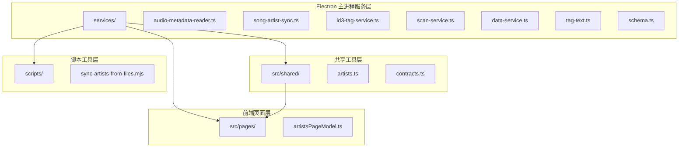

**图表来源**
- [data-service.ts:64-145](file://electron/services/data-service.ts#L64-L145)
- [scan-service.ts:83-133](file://electron/services/scan-service.ts#L83-L133)
- [artists.ts:1-57](file://src/shared/artists.ts#L1-L57)

**章节来源**
- [data-service.ts:39-198](file://electron/services/data-service.ts#L39-L198)
- [scan-service.ts:65-133](file://electron/services/scan-service.ts#L65-L133)

## 核心组件

### 艺术家元数据处理管道

系统通过以下核心组件协同工作来处理艺术家元数据：

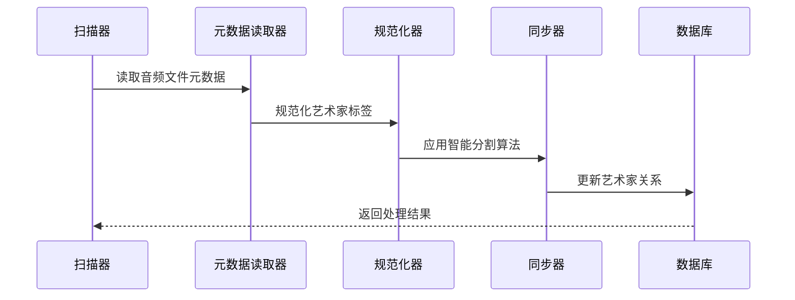

**图表来源**
- [audio-metadata-reader.ts:32-75](file://electron/services/audio-metadata-reader.ts#L32-L75)
- [song-artist-sync.ts:26-31](file://electron/services/song-artist-sync.ts#L26-L31)
- [tag-text.ts:16-55](file://electron/services/tag-text.ts#L16-L55)

### 数据库架构

系统使用 SQLite 作为主要存储引擎，包含以下关键表：

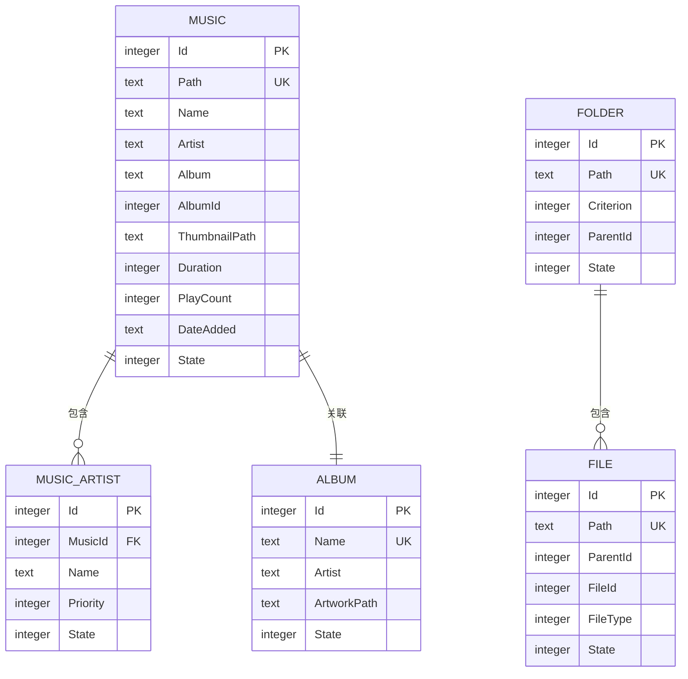

**图表来源**
- [schema.ts:85-131](file://electron/services/schema.ts#L85-L131)
- [schema.ts:238-260](file://electron/services/schema.ts#L238-L260)

**章节来源**
- [schema.ts:33-364](file://electron/services/schema.ts#L33-L364)
- [constants.ts:22-28](file://electron/services/constants.ts#L22-L28)

## 架构概览

### 整体系统架构

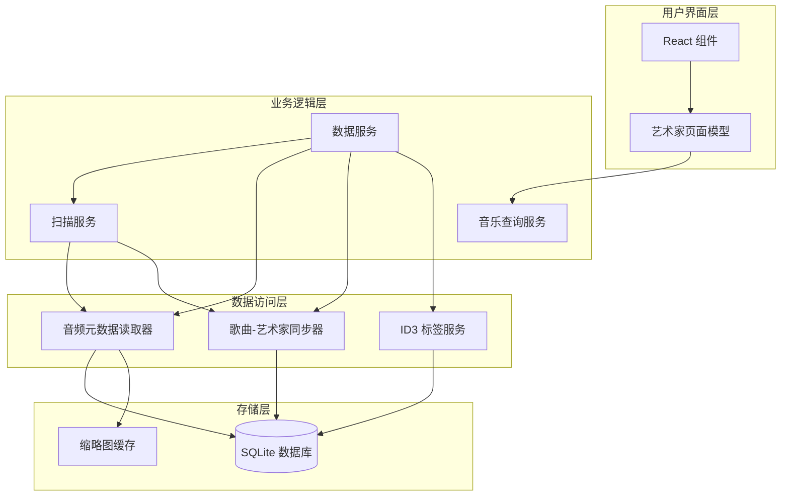

**图表来源**
- [data-service.ts:39-198](file://electron/services/data-service.ts#L39-L198)
- [scan-service.ts:65-133](file://electron/services/scan-service.ts#L65-L133)
- [music-query-service.ts:50-165](file://electron/services/music-query-service.ts#L50-L165)

### 艺术家分割算法流程

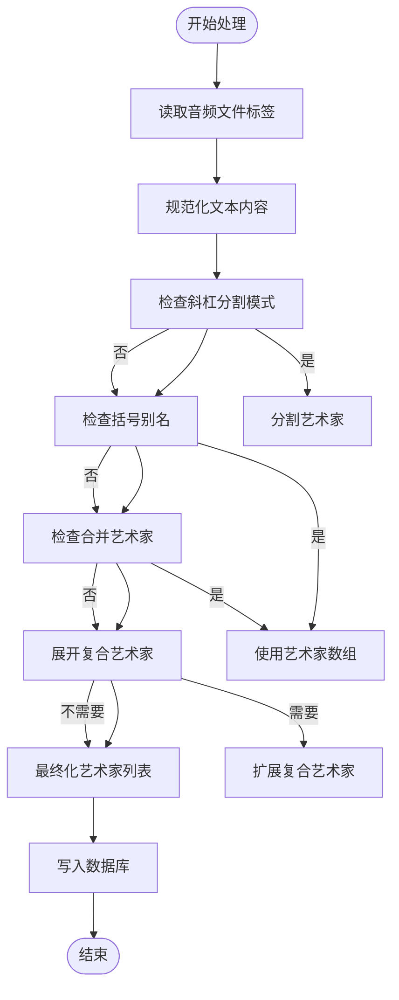

**图表来源**
- [tag-text.ts:16-108](file://electron/services/tag-text.ts#L16-L108)
- [audio-metadata-reader.ts:48-51](file://electron/services/audio-metadata-reader.ts#L48-L51)

**章节来源**
- [tag-text.ts:16-200](file://electron/services/tag-text.ts#L16-L200)
- [song-artist-sync.ts:7-39](file://electron/services/song-artist-sync.ts#L7-L39)

## 详细组件分析

### 音频元数据读取器

音频元数据读取器负责从各种音频格式中提取艺术家信息，并进行必要的规范化处理。

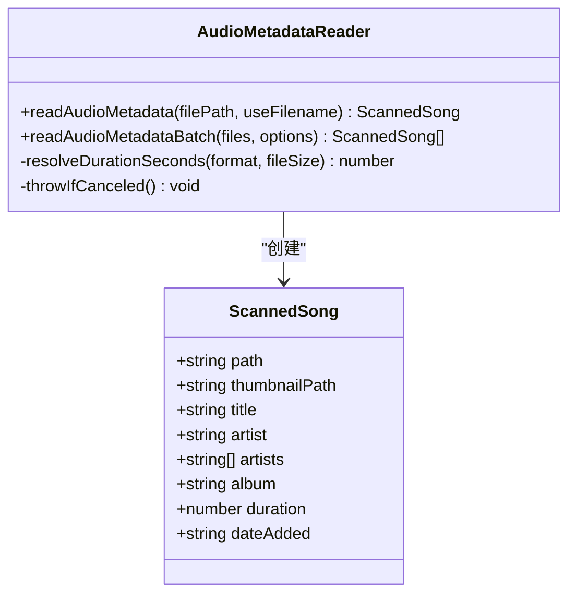

**图表来源**
- [audio-metadata-reader.ts:14-75](file://electron/services/audio-metadata-reader.ts#L14-L75)
- [audio-metadata-reader.ts:32-128](file://electron/services/audio-metadata-reader.ts#L32-L128)

#### 关键特性

1. **多格式支持**: 支持 AAC、AIFF、ALAC、APE、FLAC、M4A、MP3、OGG、Opus、WAV、WMA 等多种音频格式
2. **并发处理**: 使用 Promise.all 实现多线程并发处理，提高扫描效率
3. **错误处理**: 对无法解析的文件提供降级处理方案
4. **缩略图生成**: 自动提取嵌入式封面或生成系统缩略图

**章节来源**
- [audio-metadata-reader.ts:1-128](file://electron/services/audio-metadata-reader.ts#L1-L128)
- [constants.ts:3-15](file://electron/services/constants.ts#L3-L15)

### 歌曲-艺术家同步器

歌曲-艺术家同步器负责维护 Music 和 MusicArtist 表之间的关系，确保艺术家信息的一致性。

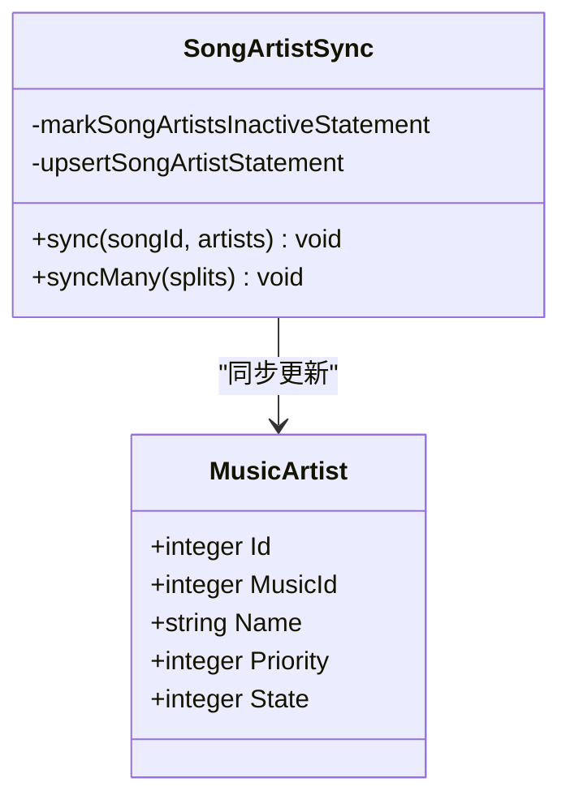

**图表来源**
- [song-artist-sync.ts:7-39](file://electron/services/song-artist-sync.ts#L7-L39)

#### 同步机制

1. **状态管理**: 首先将现有艺术家标记为非活跃状态
2. **智能插入**: 使用 UPSERT 语句插入新的艺术家记录
3. **优先级设置**: 基于艺术家在源文件中的出现顺序设置优先级
4. **冲突解决**: 通过 ON CONFLICT 子句处理重复记录

**章节来源**
- [song-artist-sync.ts:11-39](file://electron/services/song-artist-sync.ts#L11-L39)

### ID3 标签服务

ID3 标签服务专门处理 MP3 文件的标签读写操作，支持完整的 ID3v2.3/v2.4 标准。

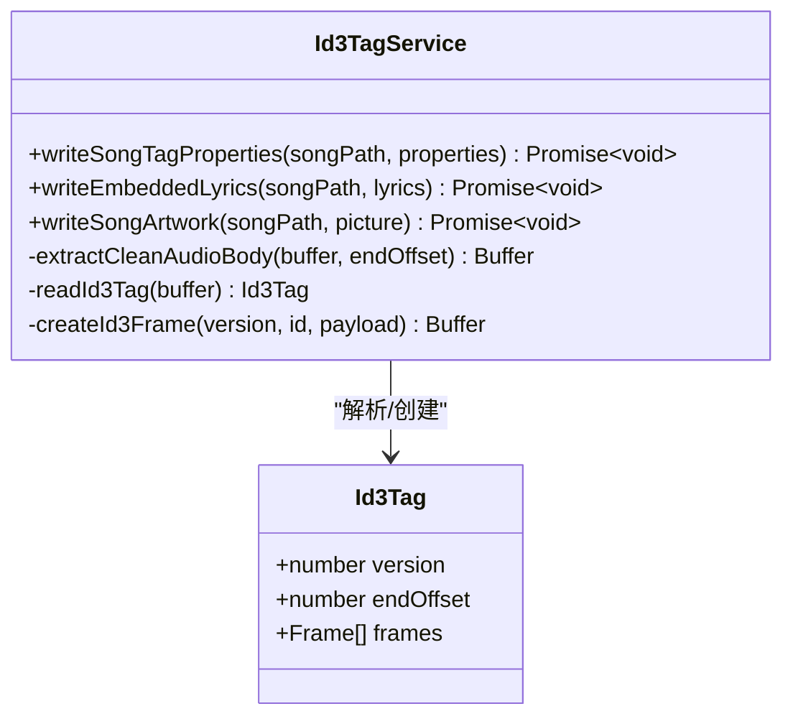

**图表来源**
- [id3-tag-service.ts:4-283](file://electron/services/id3-tag-service.ts#L4-L283)

#### 标签处理特性

1. **版本兼容**: 支持 ID3v2.3 和 ID3v2.4 格式
2. **帧管理**: 精确控制各种 ID3 帧（TIT2、TPE1、APIC 等）
3. **清理机制**: 自动移除过时的 ID3v1 和 APEv2 标签
4. **艺术作品**: 支持嵌入式封面图片的读写

**章节来源**
- [id3-tag-service.ts:1-283](file://electron/services/id3-tag-service.ts#L1-L283)

### 艺术家规范化器

艺术家规范化器提供智能的艺术家名称处理和分割算法。

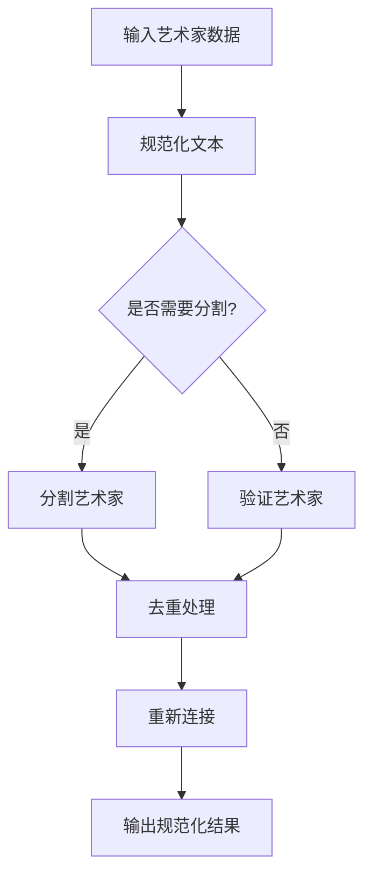

**图表来源**
- [artists.ts:6-24](file://src/shared/artists.ts#L6-L24)

#### 规范化算法

1. **多分隔符支持**: 支持中文顿号、英文逗号、分号等多种分隔符
2. **智能分割**: 使用正则表达式识别不同的分隔符模式
3. **去重机制**: 通过大小写不敏感的方式去除重复艺术家
4. **优先级保持**: 保持艺术家在原始数据中的相对顺序

**章节来源**
- [artists.ts:1-57](file://src/shared/artists.ts#L1-L57)

### 扫描服务

扫描服务是整个艺术家元数据处理的核心协调器，负责管理完整的扫描流程。

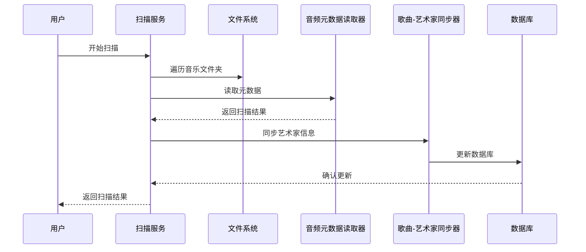

**图表来源**
- [scan-service.ts:135-310](file://electron/services/scan-service.ts#L135-L310)

#### 扫描流程

1. **文件发现**: 遍历指定目录下的所有音频文件
2. **元数据提取**: 并发读取每个文件的元数据
3. **智能分割**: 应用艺术家分割算法
4. **数据库更新**: 批量更新数据库记录
5. **结果报告**: 提供详细的扫描统计信息

**章节来源**
- [scan-service.ts:65-800](file://electron/services/scan-service.ts#L65-L800)

### 数据服务

数据服务作为系统的入口点，协调各个服务组件的工作。

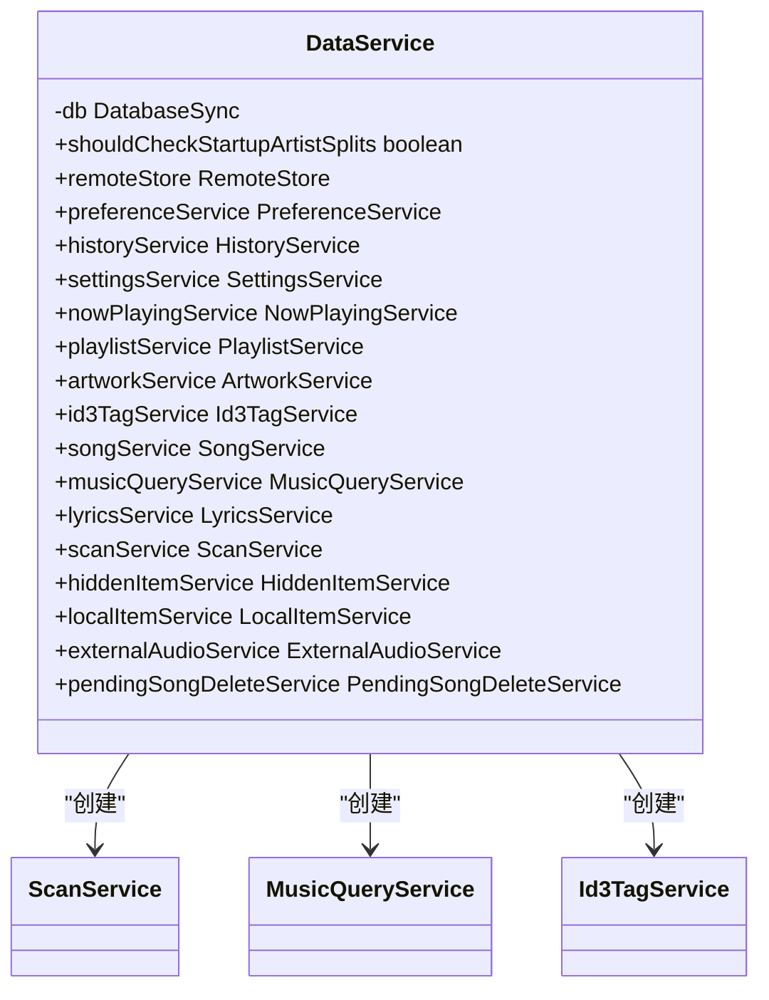

**图表来源**
- [data-service.ts:39-198](file://electron/services/data-service.ts#L39-L198)

**章节来源**
- [data-service.ts:1-198](file://electron/services/data-service.ts#L1-L198)

## 依赖关系分析

### 组件依赖图

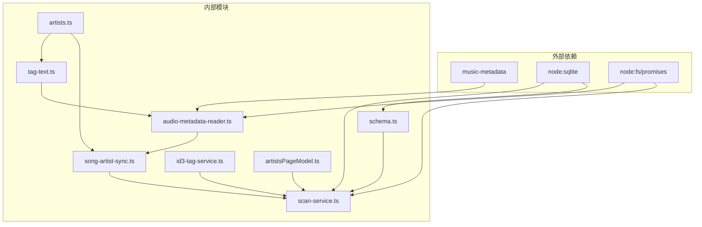

**图表来源**
- [audio-metadata-reader.ts:1-12](file://electron/services/audio-metadata-reader.ts#L1-L12)
- [scan-service.ts:1-12](file://electron/services/scan-service.ts#L1-L12)

### 数据流依赖

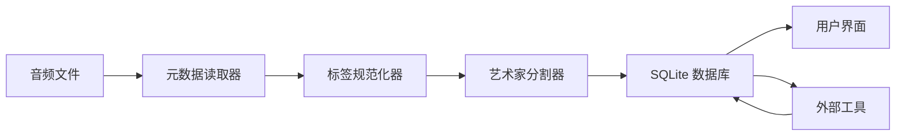

**图表来源**
- [sync-artists-from-files.mjs:29-103](file://scripts/sync-artists-from-files.mjs#L29-L103)

**章节来源**
- [scan-service.ts:135-310](file://electron/services/scan-service.ts#L135-L310)
- [sync-artists-from-files.mjs:1-319](file://scripts/sync-artists-from-files.mjs#L1-L319)

## 性能考虑

### 并发处理策略

系统采用了多层次的并发处理机制来优化性能：

1. **文件扫描并发**: 使用 Promise.all 并行处理多个文件扫描任务
2. **数据库操作批处理**: 将多个数据库操作合并到单个事务中执行
3. **内存管理**: 及时释放不再使用的缓冲区和临时对象

### 内存优化技术

1. **流式处理**: 对大型文件采用流式读取方式，避免一次性加载到内存
2. **对象池**: 复用常用的字符串和缓冲区对象
3. **延迟加载**: 按需加载艺术家数据，减少初始内存占用

### 缓存机制

1. **缩略图缓存**: 缓存生成的缩略图以避免重复计算
2. **元数据缓存**: 在同一扫描会话中缓存已读取的元数据
3. **查询结果缓存**: 缓存常用的数据库查询结果

## 故障排除指南

### 常见问题及解决方案

#### 艺术家分割不正确

**症状**: 艺术家名称显示异常或分割错误

**可能原因**:
1. 标签格式不符合标准
2. 分隔符识别错误
3. 编码问题导致的字符乱码

**解决方案**:
1. 检查音频文件的 ID3 标签格式
2. 使用外部工具验证标签完整性
3. 手动编辑艺术家字段

#### 扫描速度慢

**症状**: 音乐库扫描时间过长

**优化建议**:
1. 增加并发扫描线程数
2. 减少不必要的文件遍历
3. 清理损坏的音频文件

#### 数据库锁定问题

**症状**: 扫描过程中出现数据库锁定错误

**解决方法**:
1. 确保没有其他进程访问数据库文件
2. 适当增加数据库超时设置
3. 重启应用程序以释放锁

**章节来源**
- [scan-service.ts:108-112](file://electron/services/scan-service.ts#L108-L112)
- [audio-metadata-reader.ts:62-75](file://electron/services/audio-metadata-reader.ts#L62-L75)

## 结论

SMPlayer 的艺术家元数据处理系统通过精心设计的架构和算法，实现了高效、准确的音乐库管理。系统的主要优势包括：

1. **智能算法**: 先进的艺术家分割和合并算法确保数据准确性
2. **高性能设计**: 多层次并发处理和优化的内存管理
3. **完整生态**: 从文件扫描到数据库同步的完整解决方案
4. **用户友好**: 直观的界面和灵活的配置选项

该系统为音乐播放器应用提供了可靠的艺术家元数据管理基础，能够有效提升用户体验和音乐库的组织效率。