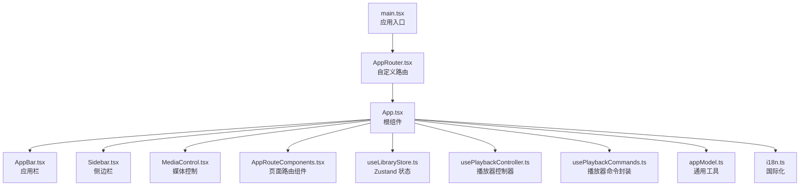
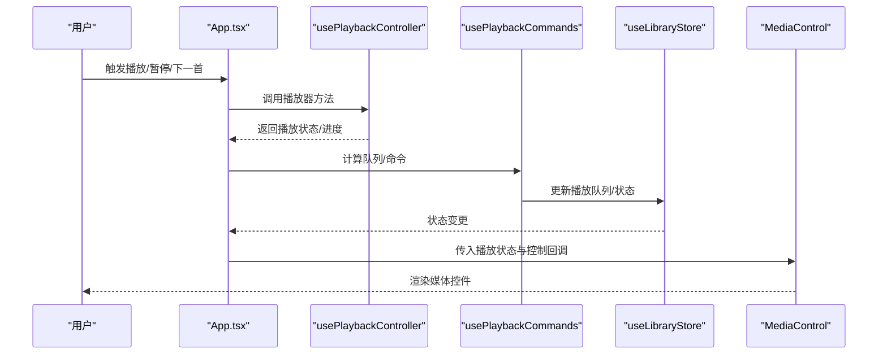
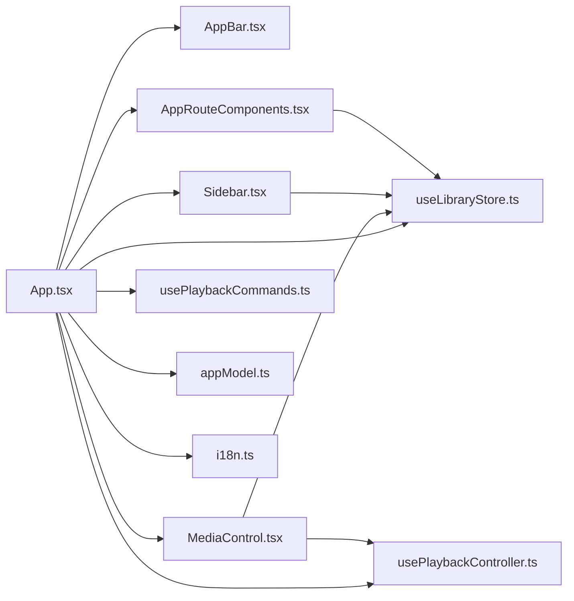

# React组件体系

<cite>
**本文档引用的文件**
- [src/App.tsx](file://src/App.tsx)
- [src/main.tsx](file://src/main.tsx)
- [src/AppRouter.tsx](file://src/AppRouter.tsx)
- [src/AppRouteComponents.tsx](file://src/AppRouteComponents.tsx)
- [src/appModel.ts](file://src/appModel.ts)
- [src/components/AppBar.tsx](file://src/components/AppBar.tsx)
- [src/components/Sidebar.tsx](file://src/components/Sidebar.tsx)
- [src/components/MediaControl.tsx](file://src/components/MediaControl.tsx)
- [src/hooks/usePlaybackController.ts](file://src/hooks/usePlaybackController.ts)
- [src/hooks/usePlaybackCommands.ts](file://src/hooks/usePlaybackCommands.ts)
- [src/state/useLibraryStore.ts](file://src/state/useLibraryStore.ts)
- [src/shared/i18n.ts](file://src/shared/i18n.ts)
- [src/components/mediaControlModel.ts](file://src/components/mediaControlModel.ts)
</cite>

## 目录
1. [简介](#简介)
2. [项目结构](#项目结构)
3. [核心组件](#核心组件)
4. [架构总览](#架构总览)
5. [详细组件分析](#详细组件分析)
6. [依赖关系分析](#依赖关系分析)
7. [性能考虑](#性能考虑)
8. [故障排除指南](#故障排除指南)
9. [结论](#结论)

## 简介
本文件系统化梳理 SMPlayer 的 React 组件体系，重点围绕根组件 App.tsx 的架构设计与状态管理展开，覆盖组件树结构、状态提升策略、事件处理机制；同时深入解析核心 UI 组件（AppBar 应用栏、Sidebar 侧边栏导航、MediaControl 媒体控制）的实现细节、props 接口设计、事件回调机制与样式定制选项，并总结组件间通信模式（父子、兄弟、跨层级）、复用策略与组合模式最佳实践。最后提供性能优化建议（memoization、懒加载、虚拟滚动）与可访问性、国际化支持说明。

## 项目结构
SMPlayer 采用“页面路由 + 根组件 + 多个功能域组件”的组织方式：
- 入口：main.tsx 创建根节点，包裹在自定义 AppRouter 中，渲染 App 根组件。
- 路由：AppRouter 提供基于 hash 的自定义路由器，适配 Electron 环境。
- 根组件：App.tsx 负责全局状态聚合、播放器控制、导航与工作区布局、对话框与通知等。
- 功能组件：AppBar、Sidebar、MediaControl 等作为可复用 UI 组件，通过 props 与上下文交互。
- 状态层：useLibraryStore（Zustand）集中管理音乐库数据与操作；usePlaybackController/usePlaybackCommands 提供播放器状态机与命令封装。
- 工具与模型：appModel 提供滚动恢复、主题色、标题计算等通用逻辑；i18n 提供多语言翻译。

图表来源
- [src/main.tsx:1-15](file://src/main.tsx#L1-L15)
- [src/AppRouter.tsx:1-82](file://src/AppRouter.tsx#L1-L82)
- [src/App.tsx:1-1258](file://src/App.tsx#L1-L1258)
- [src/components/AppBar.tsx:1-45](file://src/components/AppBar.tsx#L1-L45)
- [src/components/Sidebar.tsx:1-538](file://src/components/Sidebar.tsx#L1-L538)
- [src/components/MediaControl.tsx:1-1322](file://src/components/MediaControl.tsx#L1-L1322)
- [src/state/useLibraryStore.ts:1-1339](file://src/state/useLibraryStore.ts#L1-L1339)
- [src/hooks/usePlaybackController.ts:1-958](file://src/hooks/usePlaybackController.ts#L1-L958)
- [src/hooks/usePlaybackCommands.ts:1-148](file://src/hooks/usePlaybackCommands.ts#L1-L148)
- [src/appModel.ts:1-395](file://src/appModel.ts#L1-L395)
- [src/shared/i18n.ts:1-49](file://src/shared/i18n.ts#L1-L49)

章节来源
- [src/main.tsx:1-15](file://src/main.tsx#L1-L15)
- [src/AppRouter.tsx:1-82](file://src/AppRouter.tsx#L1-L82)
- [src/App.tsx:1-1258](file://src/App.tsx#L1-L1258)

## 核心组件
本节聚焦根组件 App.tsx 的架构与状态管理，涵盖以下要点：
- 组件树结构：根容器负责布局（导航、工作区、媒体控制、对话框），内部按需渲染迷你模式或完整界面。
- 状态提升策略：将播放器状态、搜索输入、滚动位置、夜间模式、播放列表等从子组件提升至 App 层统一管理，并通过 hooks 与 Zustand store 解耦。
- 事件处理机制：通过 usePlaybackController/usePlaybackCommands 将用户交互映射为播放器动作；通过 useLibraryStore 执行库操作；通过 useSearchController 管理搜索。
- 国际化与主题：使用 createTranslator 与 resolveLocale 实现语言切换；通过 applyThemeColor 设置主题色变量。
- 可访问性：大量按钮设置 aria-label/title；最小化标题栏拖拽区域避免误触；滚动条悬停类名用于样式控制。

章节来源
- [src/App.tsx:71-1224](file://src/App.tsx#L71-L1224)
- [src/hooks/usePlaybackController.ts:68-583](file://src/hooks/usePlaybackController.ts#L68-L583)
- [src/hooks/usePlaybackCommands.ts:35-147](file://src/hooks/usePlaybackCommands.ts#L35-L147)
- [src/state/useLibraryStore.ts:111-800](file://src/state/useLibraryStore.ts#L111-L800)
- [src/appModel.ts:136-150](file://src/appModel.ts#L136-L150)
- [src/shared/i18n.ts:29-48](file://src/shared/i18n.ts#L29-L48)

## 架构总览
App.tsx 作为应用壳层，承担以下职责：
- 全局状态聚合：订阅 useLibraryStore 的快照与状态，驱动 UI 更新。
- 播放器控制：usePlaybackController 提供播放状态机，usePlaybackCommands 提供队列与播放命令。
- 导航与布局：根据窗口尺寸与用户行为动态切换导航模式（折叠/覆盖/宽屏），并维护滚动位置记忆。
- 对话框与通知：按需渲染重命名、发布说明、扫描进度、智能艺术家修复等对话框。
- 媒体控制：向 MediaControl 传递播放状态、音量、重复/随机模式、歌词与封面颜色等。

图表来源
- [src/App.tsx:312-318](file://src/App.tsx#L312-L318)
- [src/hooks/usePlaybackController.ts:68-583](file://src/hooks/usePlaybackController.ts#L68-L583)
- [src/hooks/usePlaybackCommands.ts:35-147](file://src/hooks/usePlaybackCommands.ts#L35-L147)
- [src/state/useLibraryStore.ts:111-800](file://src/state/useLibraryStore.ts#L111-L800)
- [src/components/MediaControl.tsx:834-1147](file://src/components/MediaControl.tsx#L834-L1147)

## 详细组件分析

### 根组件 App.tsx 架构与状态管理
- 组件树结构
  - 最外层容器根据导航模式与路由状态添加类名，控制布局与样式。
  - 在迷你模式下直接渲染 MiniModePage；否则渲染 Sidebar、工作区、MediaControl 与对话框。
- 状态提升策略
  - 播放器状态：usePlaybackController 返回当前曲目、播放状态、音量、模式等；usePlaybackCommands 提供队列操作命令。
  - 库状态：useLibraryStore 返回歌曲、播放列表、最近项、设置等快照与操作方法。
  - 用户交互：useSearchController 管理搜索输入与提交；useCustomScrollbar 管理自定义滚动条。
- 事件处理机制
  - 播放器事件绑定：将播放器方法绑定到 playerControlBindings，传递给 AppBar、Sidebar、MediaControl。
  - 导航事件：切换导航折叠/展开、最小化标题栏拖拽、返回上一页。
  - 对话框事件：创建播放列表、显示发布说明、智能艺术家修复确认等。
- 国际化与主题
  - 使用 createTranslator 与 resolveLocale 生成翻译函数；applyThemeColor 设置 CSS 变量。
- 可访问性
  - 大量按钮设置 aria-label/title；最小化标题栏拖拽区域避免误触；滚动条悬停类名用于样式控制。

章节来源
- [src/App.tsx:71-1224](file://src/App.tsx#L71-L1224)
- [src/appModel.ts:136-150](file://src/appModel.ts#L136-L150)
- [src/shared/i18n.ts:29-48](file://src/shared/i18n.ts#L29-L48)

### AppBar 应用栏组件
- 设计目标：提供统一的应用栏，支持菜单按钮、标题内容与操作区。
- Props 接口
  - menuLabel/menuTitle：菜单按钮标签与提示。
  - onMenuClick：菜单点击回调。
  - children/actions：标题区与操作区内容。
  - className：额外样式类。
- 事件回调机制
  - 菜单按钮触发 onMenuClick，用于切换导航折叠/展开。
- 样式定制选项
  - 通过 className 扩展样式；内部使用固定 ID 注入页面级操作区与底部区域。

章节来源
- [src/components/AppBar.tsx:9-44](file://src/components/AppBar.tsx#L9-L44)

### Sidebar 侧边栏导航
- 设计目标：提供库导航、播放列表、搜索与设置入口，支持折叠/展开与拖拽排序。
- Props 接口
  - t：翻译函数。
  - collapsed：是否折叠。
  - appName：应用名称。
  - playlists：播放列表数组。
  - canGoBack：是否可返回。
  - searchQuery/recentSearches：搜索相关状态。
  - 各种回调：onSearchChange/onSearchCommit/onSearchClear、onRecentSearchRemove/onRecentSearchesClear、onToggleCollapsed、onGoBack/onNavigate、播放列表 CRUD 与随机播放等。
- 事件回调机制
  - 折叠/展开：onToggleCollapsed 切换导航宽度。
  - 搜索：commitSearch 提交搜索并关闭面板。
  - 播放列表：右键菜单、重命名、删除、拖拽排序 reorderDraggedPlaylist。
  - 导航：NavItem 点击后 onNavigate 再 navigate，确保 flushSync 同步更新。
- 样式定制选项
  - 折叠时显示悬浮提示；展开时显示播放列表子项与展开/收起按钮。
- 可访问性
  - 键盘支持：回车/空格打开播放列表项。
  - 焦点与悬停：showCollapsedTooltip/hideCollapsedTooltip 控制提示显示。

章节来源
- [src/components/Sidebar.tsx:42-538](file://src/components/Sidebar.tsx#L42-L538)

### MediaControl 媒体控制组件
- 设计目标：提供播放/暂停、上一首/下一首、进度条、音量、收藏、播放模式、更多菜单等功能。
- Props 接口
  - track/currentSong/playlists/queueSongIds/disabled/isPlaying/volume/mode/t/onTogglePlayPause/onPrevious/onNext/onSeek/onBeginSeek/onEndSeek/onVolumeChange/onToggleMute/onToggleShuffle/onToggleRepeat/onToggleRepeatOne/onToggleFavorite/onQuickPlay/onPlayTrack/onVoiceCommand/getVoiceHint/voiceLanguage/onOpenNowPlaying/isWindowFullScreen/onToggleWindowFullScreen/onEnterMiniMode/onArtworkResolved/onSaved。
- 事件回调机制
  - 进度条：beginSeek/commitProgressSeek 控制 seeking 状态与最终跳转。
  - 音量：水平/垂直滑块支持鼠标拖动与指针事件；紧凑模式下支持悬浮提示。
  - 更多菜单：打开更多菜单，动态加载偏好项与歌词、专辑封面等。
  - 语音助手：条件渲染并支持打开/关闭。
- 样式定制选项
  - 根据封面提取主色设置 CSS 变量；根据窗口尺寸切换紧凑/完整模式。
- 可访问性
  - 进度条与音量滑块设置 aria-label/aria-valuetext；按钮设置 title/aria-label。

章节来源
- [src/components/MediaControl.tsx:38-1322](file://src/components/MediaControl.tsx#L38-L1322)
- [src/components/mediaControlModel.ts:1-18](file://src/components/mediaControlModel.ts#L1-L18)

### 播放器状态与命令封装
- usePlaybackController
  - 提供播放器状态机：idle/loading/buffering/playing/paused/seeking 等状态转换。
  - 管理当前曲目、队列索引、音量、静音、播放模式（一次/随机/循环/单曲循环）。
  - 处理音频元素生命周期、缓冲停滞检测、进度同步、持久化保存。
- usePlaybackCommands
  - 基于当前队列与模式，计算下一首、加到下一首、移动到下一首、设置播放队列等命令。
  - 通过 useLibraryStore 替换播放队列并结合 usePlaybackController 执行播放。

章节来源
- [src/hooks/usePlaybackController.ts:28-583](file://src/hooks/usePlaybackController.ts#L28-L583)
- [src/hooks/usePlaybackCommands.ts:21-147](file://src/hooks/usePlaybackCommands.ts#L21-L147)

### 状态存储与库操作
- useLibraryStore（Zustand）
  - 管理 MusicData 快照、加载状态、扫描进度、错误信息等。
  - 提供加载歌曲/文件夹/最近项、刷新库、扫描本地文件夹、播放列表 CRUD、队列操作、设置更新、视图状态保存等方法。
  - 通过 window.smplayer IPC 与 Electron 主进程交互，异步更新快照。

章节来源
- [src/state/useLibraryStore.ts:42-800](file://src/state/useLibraryStore.ts#L42-L800)

### 路由与页面组件
- AppRouter
  - 自定义基于 hash 的路由器，监听 hashchange/popstate，提供 push/replace/go 等方法。
- AppRouteComponents
  - 专辑详情页路由组件，根据路由参数与歌曲数据渲染 AlbumDetailPage，并注入播放控制回调。

章节来源
- [src/AppRouter.tsx:25-82](file://src/AppRouter.tsx#L25-L82)
- [src/AppRouteComponents.tsx:13-106](file://src/AppRouteComponents.tsx#L13-L106)

## 依赖关系分析
- 组件间依赖
  - App.tsx 依赖 AppBar、Sidebar、MediaControl、AppRoutes、useLibraryStore、usePlaybackController、usePlaybackCommands、useSearchController、useCustomScrollbar 等。
  - MediaControl 依赖 usePlaybackProgress、useSongArtwork、MenuFlyout、MusicDialog 等。
  - Sidebar 依赖 MenuFlyout、SearchHistoryPanel、RenameDialog 等。
- 状态依赖
  - useLibraryStore 为全局状态源，被多个组件订阅；usePlaybackController/usePlaybackCommands 与之配合提供播放器能力。
- 工具与模型
  - appModel 提供滚动恢复、主题色、标题计算等通用逻辑；i18n 提供翻译与语言解析。

图表来源
- [src/App.tsx:1-1258](file://src/App.tsx#L1-L1258)
- [src/components/MediaControl.tsx:1-1322](file://src/components/MediaControl.tsx#L1-L1322)
- [src/components/Sidebar.tsx:1-538](file://src/components/Sidebar.tsx#L1-L538)
- [src/state/useLibraryStore.ts:1-1339](file://src/state/useLibraryStore.ts#L1-L1339)
- [src/hooks/usePlaybackController.ts:1-958](file://src/hooks/usePlaybackController.ts#L1-L958)
- [src/hooks/usePlaybackCommands.ts:1-148](file://src/hooks/usePlaybackCommands.ts#L1-L148)
- [src/appModel.ts:1-395](file://src/appModel.ts#L1-L395)
- [src/shared/i18n.ts:1-49](file://src/shared/i18n.ts#L1-L49)

章节来源
- [src/App.tsx:1-1258](file://src/App.tsx#L1-L1258)
- [src/components/MediaControl.tsx:1-1322](file://src/components/MediaControl.tsx#L1-L1322)
- [src/components/Sidebar.tsx:1-538](file://src/components/Sidebar.tsx#L1-L538)
- [src/state/useLibraryStore.ts:1-1339](file://src/state/useLibraryStore.ts#L1-L1339)
- [src/hooks/usePlaybackController.ts:1-958](file://src/hooks/usePlaybackController.ts#L1-L958)
- [src/hooks/usePlaybackCommands.ts:1-148](file://src/hooks/usePlaybackCommands.ts#L1-L148)
- [src/appModel.ts:1-395](file://src/appModel.ts#L1-L395)
- [src/shared/i18n.ts:1-49](file://src/shared/i18n.ts#L1-L49)

## 性能考虑
- memoization
  - App.tsx 中广泛使用 useMemo 缓存派生数据（如歌曲映射、播放队列、标题计算），减少不必要的重渲染。
  - usePlaybackCommands 使用 useMemo 包裹命令对象，避免每次渲染都产生新函数。
- 懒加载
  - 页面路由组件按需渲染，结合 AppRoutes 的上下文传递，仅在需要时加载对应页面。
- 虚拟滚动
  - 自定义滚动条与滚动位置记忆（appModel.SCROLLBAR_HOST_SELECTOR/RESTORABLE_SCROLL_SELECTORS）提升长列表滚动体验。
- 事件节流与去抖
  - 播放器进度同步使用定时器与阈值判断，避免频繁更新。
- 状态分片
  - 将播放器状态与库状态分离，避免无关状态变化导致的 UI 重绘。

章节来源
- [src/App.tsx:426-444](file://src/App.tsx#L426-L444)
- [src/hooks/usePlaybackCommands.ts:41-147](file://src/hooks/usePlaybackCommands.ts#L41-L147)
- [src/appModel.ts:15-56](file://src/appModel.ts#L15-L56)
- [src/hooks/usePlaybackController.ts:270-305](file://src/hooks/usePlaybackController.ts#L270-L305)

## 故障排除指南
- 播放卡顿与停滞
  - 播放器内置停滞检测与恢复流程，自动提示并尝试重新加载或切换下一首。
- IPC 异常
  - useLibraryStore 在调用 window.smplayer 方法时捕获错误并设置 error 字段，可通过 clearError 清除。
- 滚动位置丢失
  - 使用 appModel 的滚动恢复逻辑（getScrollElementKey/restoreScrollSnapshot/saveScrollSnapshot）确保路由切换后恢复滚动位置。
- 语言与主题
  - 若翻译不生效，检查 preferredLanguage 与 resolveLocale；若主题色不正确，检查 applyThemeColor 的调用时机。

章节来源
- [src/hooks/usePlaybackController.ts:292-305](file://src/hooks/usePlaybackController.ts#L292-L305)
- [src/state/useLibraryStore.ts:121-123](file://src/state/useLibraryStore.ts#L121-L123)
- [src/appModel.ts:120-134](file://src/appModel.ts#L120-L134)
- [src/appModel.ts:136-150](file://src/appModel.ts#L136-L150)

## 结论
SMPlayer 的 React 组件体系以 App.tsx 为核心，通过 hooks 与 Zustand store 实现状态提升与解耦，结合自定义路由与通用工具模块，构建了清晰的组件树与稳定的播放器控制链路。AppBar、Sidebar、MediaControl 等核心 UI 组件具备良好的可扩展性与可访问性，配合 memoization、懒加载与滚动恢复等性能优化手段，能够满足桌面端音乐播放器的复杂需求。未来可在以下方面持续改进：进一步抽象通用容器组件、完善单元测试覆盖、探索组件懒加载与代码分割策略。