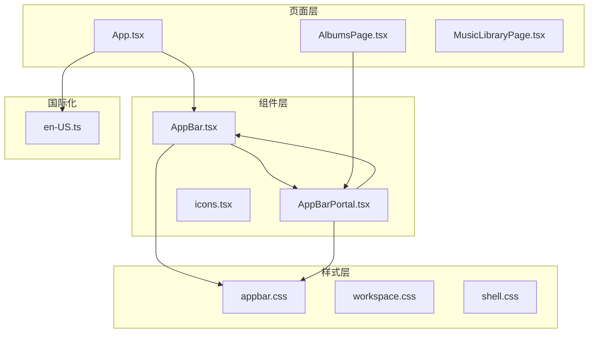
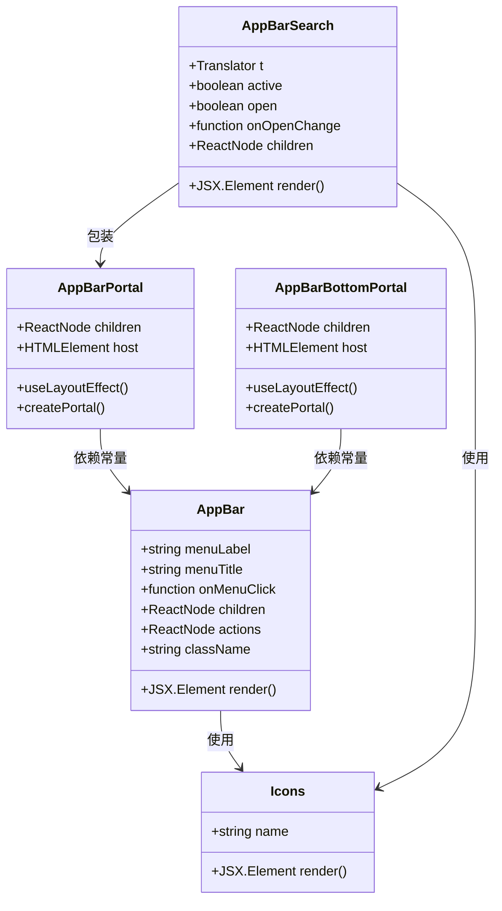
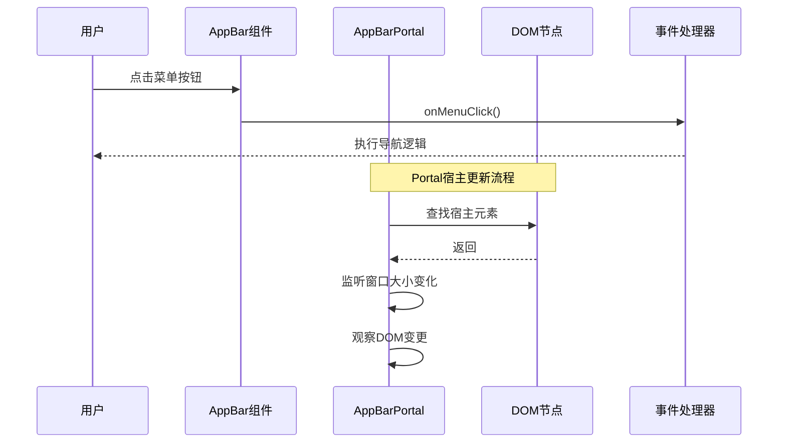
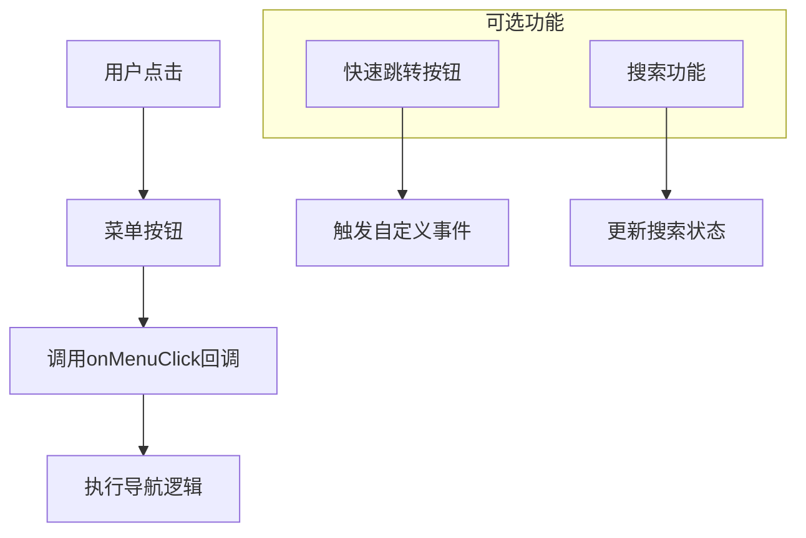
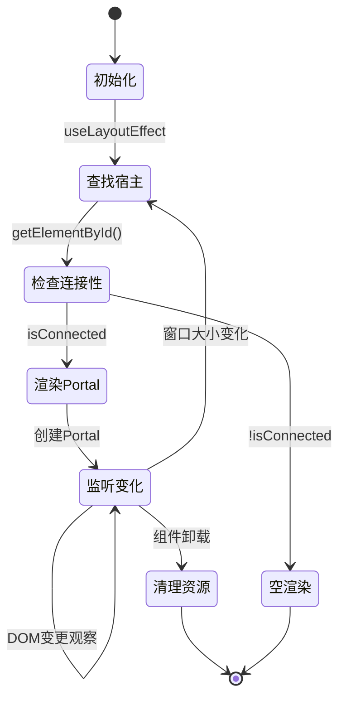
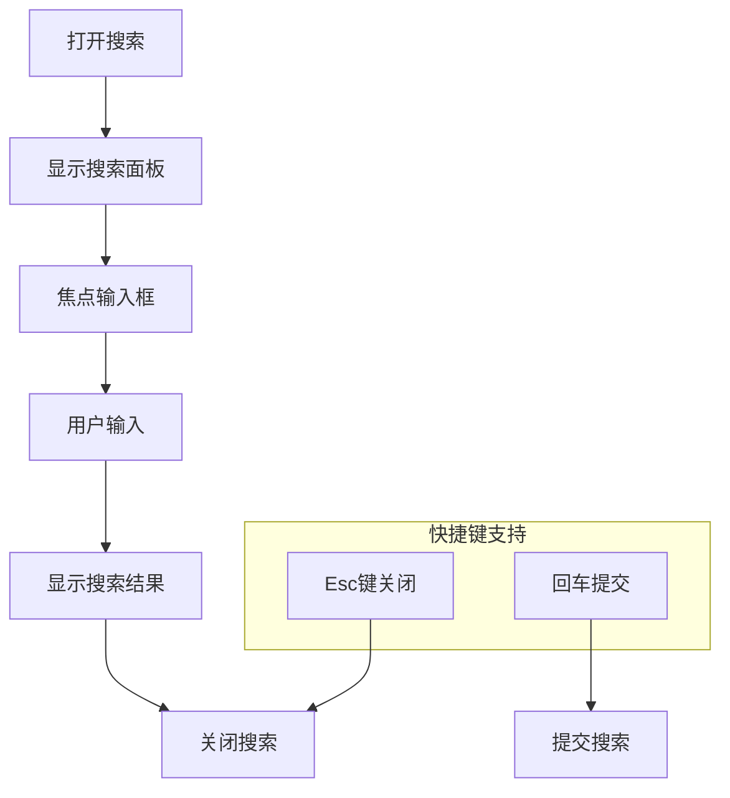
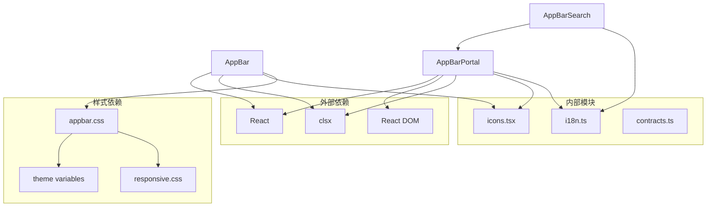
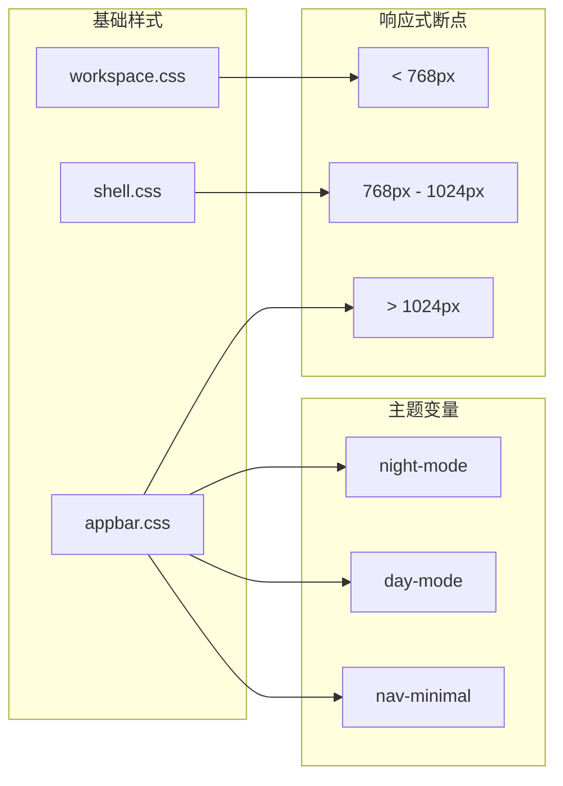

# AppBar应用栏组件

<cite>
**本文档引用的文件**
- [AppBar.tsx](file://src/components/AppBar.tsx)
- [AppBarPortal.tsx](file://src/components/AppBarPortal.tsx)
- [appbar.css](file://src/styles/appbar.css)
- [App.tsx](file://src/App.tsx)
- [AlbumsPage.tsx](file://src/pages/AlbumsPage.tsx)
- [en-US.ts](file://src/shared/locales/en-US.ts)
</cite>

## 目录
1. [简介](#简介)
2. [项目结构](#项目结构)
3. [核心组件](#核心组件)
4. [架构概览](#架构概览)
5. [详细组件分析](#详细组件分析)
6. [依赖关系分析](#依赖关系分析)
7. [性能考虑](#性能考虑)
8. [故障排除指南](#故障排除指南)
9. [结论](#结论)

## 简介

AppBar应用栏组件是SMPlayer音乐播放器的核心UI组件之一，负责提供应用程序的顶部导航栏功能。该组件实现了现代化的响应式设计，支持多种显示模式（标准模式和极简模式），并集成了搜索功能、快速跳转按钮等高级特性。

AppBar组件采用React函数式组件设计，结合CSS变量和媒体查询实现主题化和响应式布局。它通过Portal技术实现了灵活的DOM结构组织，确保在不同页面和路由下都能保持一致的用户体验。

## 项目结构

AppBar组件位于项目的组件目录中，与相关的样式文件和页面组件协同工作：



**图表来源**
- [AppBar.tsx:1-45](file://src/components/AppBar.tsx#L1-L45)
- [AppBarPortal.tsx:1-115](file://src/components/AppBarPortal.tsx#L1-L115)
- [appbar.css:1-688](file://src/styles/appbar.css#L1-L688)

**章节来源**
- [AppBar.tsx:1-45](file://src/components/AppBar.tsx#L1-L45)
- [AppBarPortal.tsx:1-115](file://src/components/AppBarPortal.tsx#L1-L115)
- [appbar.css:1-688](file://src/styles/appbar.css#L1-L688)

## 核心组件

### AppBar组件

AppBar组件是应用栏的核心实现，提供了以下主要功能：

#### Props接口设计

| 属性名 | 类型 | 必需 | 默认值 | 描述 |
|--------|------|------|--------|------|
| menuLabel | string | 是 | - | 菜单按钮的无障碍标签文本 |
| menuTitle | string | 否 | menuLabel | 菜单按钮的title属性 |
| onMenuClick | () => void | 是 | - | 菜单按钮点击事件处理器 |
| children | ReactNode | 否 | undefined | 应用栏标题区域的内容 |
| actions | ReactNode | 否 | undefined | 应用栏右侧操作按钮区域 |
| className | string | 否 | undefined | 自定义CSS类名 |

#### 布局结构

```mermaid
flowchart TD
Header[header.workspace-header] --> TitleGroup[div.appbar-title-group]
Header --> Actions[div.appbar-actions]
Header --> Bottom[div.appbar-bottom]
TitleGroup --> MenuButton[button.appbar-menu-button]
TitleGroup --> Children[children content]
Actions --> PageActions[div#smplayer-page-appbar-actions]
Bottom --> BottomContent[用于底部内容的Portal宿主]
MenuButton --> Icon[Icon name="menu"]
```

**图表来源**
- [AppBar.tsx:26-42](file://src/components/AppBar.tsx#L26-L42)

#### 样式系统

AppBar组件使用了基于CSS变量的主题系统，支持明暗模式切换：

- 主题变量：`--accent-rgb`, `--accent-strong`, `--minimal-toolbar-background`
- 响应式断点：针对不同屏幕尺寸的布局调整
- 动画过渡：140ms的平滑过渡效果

**章节来源**
- [AppBar.tsx:9-16](file://src/components/AppBar.tsx#L9-L16)
- [AppBar.tsx:26-42](file://src/components/AppBar.tsx#L26-L42)
- [appbar.css:1-688](file://src/styles/appbar.css#L1-L688)

## 架构概览

### 组件关系图



**图表来源**
- [AppBar.tsx:18-44](file://src/components/AppBar.tsx#L18-L44)
- [AppBarPortal.tsx:9-33](file://src/components/AppBarPortal.tsx#L9-L33)
- [AppBarPortal.tsx:35-59](file://src/components/AppBarPortal.tsx#L35-L59)
- [AppBarPortal.tsx:61-114](file://src/components/AppBarPortal.tsx#L61-L114)

### 数据流图



**图表来源**
- [AppBar.tsx:29-37](file://src/components/AppBar.tsx#L29-L37)
- [AppBarPortal.tsx:12-26](file://src/components/AppBarPortal.tsx#L12-L26)

## 详细组件分析

### AppBar组件实现

#### 核心渲染逻辑

AppBar组件采用简洁的结构设计，主要包含三个部分：
1. **标题组**：包含菜单按钮和页面标题内容
2. **操作区**：右侧的功能按钮区域
3. **底部区域**：用于Portal内容的宿主

#### 可访问性支持

组件实现了完整的可访问性特性：
- `aria-label`属性：为屏幕阅读器提供语义化描述
- `title`属性：提供工具提示文本
- 键盘导航支持：Tab键顺序访问所有交互元素
- 焦点管理：自动聚焦到可交互元素

#### 事件处理机制



**图表来源**
- [App.tsx:894-963](file://src/App.tsx#L894-L963)

**章节来源**
- [AppBar.tsx:18-44](file://src/components/AppBar.tsx#L18-L44)
- [App.tsx:894-963](file://src/App.tsx#L894-L963)

### AppBarPortal组件

#### Portal宿主管理

AppBarPortal组件负责动态管理Portal的宿主元素：



**图表来源**
- [AppBarPortal.tsx:9-33](file://src/components/AppBarPortal.tsx#L9-L33)

#### 多种Portal变体

组件提供了三种Portal变体以适应不同的布局需求：

| Portal类型 | 宿主ID | 使用场景 | 特殊功能 |
|------------|--------|----------|----------|
| AppBarPortal | smplayer-page-appbar-actions | 页面标题右侧操作区 | 支持搜索面板 |
| AppBarBottomPortal | smplayer-page-appbar-bottom | 应用栏底部区域 | 支持折叠展开 |
| AppBarSearch | 内置搜索功能 | 集成搜索界面 | 状态管理 |

**章节来源**
- [AppBarPortal.tsx:35-59](file://src/components/AppBarPortal.tsx#L35-L59)
- [AppBarPortal.tsx:61-114](file://src/components/AppBarPortal.tsx#L61-L114)

### AppBarSearch组件

#### 搜索功能实现

AppBarSearch组件是一个专门的搜索界面组件，具有以下特性：



**图表来源**
- [AppBarPortal.tsx:74-114](file://src/components/AppBarPortal.tsx#L74-L114)

#### 国际化集成

搜索组件完全集成到i18n系统中，支持多语言环境：

- 搜索按钮标签：根据当前状态显示"搜索"或"关闭"
- 提示文本：动态显示当前操作的说明
- 错误消息：本地化的错误提示信息

**章节来源**
- [AppBarPortal.tsx:61-114](file://src/components/AppBarPortal.tsx#L61-L114)
- [en-US.ts:50-75](file://src/shared/locales/en-US.ts#L50-L75)

## 依赖关系分析

### 组件依赖图



**图表来源**
- [AppBar.tsx:1-5](file://src/components/AppBar.tsx#L1-L5)
- [AppBarPortal.tsx:1-7](file://src/components/AppBarPortal.tsx#L1-L7)

### 样式依赖关系

AppBar组件的样式系统采用了模块化设计：



**图表来源**
- [appbar.css:581-688](file://src/styles/appbar.css#L581-L688)

**章节来源**
- [appbar.css:1-688](file://src/styles/appbar.css#L1-L688)

## 性能考虑

### 渲染优化策略

1. **条件渲染**：只有在需要时才渲染操作按钮和搜索面板
2. **Portal复用**：避免重复创建Portal实例
3. **事件节流**：监听窗口大小变化时使用防抖处理
4. **内存管理**：组件卸载时清理事件监听器和观察器

### 样式性能优化

- CSS变量缓存：减少重绘和回流
- 媒体查询优化：针对不同设备使用预设样式
- 过渡动画：使用硬件加速的transform属性

## 故障排除指南

### 常见问题及解决方案

#### Portal内容不显示

**问题症状**：AppBarPortal中的内容无法显示

**可能原因**：
1. 宿主元素未正确创建
2. DOM结构发生变化导致宿主丢失
3. Portal被其他元素覆盖

**解决步骤**：
1. 检查宿主元素ID是否正确
2. 验证DOM结构中是否存在对应元素
3. 确认Portal的z-index层级设置

#### 响应式布局异常

**问题症状**：应用栏在不同屏幕尺寸下显示异常

**可能原因**：
1. CSS媒体查询配置错误
2. 主题变量未正确设置
3. Flexbox布局计算问题

**解决步骤**：
1. 检查CSS变量定义
2. 验证媒体查询断点设置
3. 测试不同屏幕尺寸下的表现

#### 可访问性问题

**问题症状**：屏幕阅读器无法正确读取组件信息

**可能原因**：
1. 缺少aria-label属性
2. title属性与内容不匹配
3. 焦点管理不当

**解决步骤**：
1. 确保所有交互元素都有适当的aria标签
2. 验证title属性的本地化
3. 测试键盘导航流程

**章节来源**
- [AppBarPortal.tsx:28-32](file://src/components/AppBarPortal.tsx#L28-L32)
- [appbar.css:13-20](file://src/styles/appbar.css#L13-L20)

## 结论

AppBar应用栏组件展现了现代React应用的最佳实践，通过精心设计的架构实现了高度的模块化、可维护性和可扩展性。组件不仅提供了丰富的功能特性，还充分考虑了用户体验、可访问性和性能优化。

该组件的成功之处在于：

1. **清晰的职责分离**：核心AppBar负责基础布局，Portal组件处理复杂DOM管理
2. **灵活的扩展性**：通过props接口和Portal机制支持各种使用场景
3. **完善的可访问性**：全面的ARIA支持和键盘导航
4. **优秀的性能表现**：优化的渲染策略和样式系统
5. **强大的主题系统**：基于CSS变量的主题适配能力

对于开发者而言，AppBar组件提供了一个优秀的参考实现，展示了如何在复杂的桌面应用中构建高质量的UI组件。