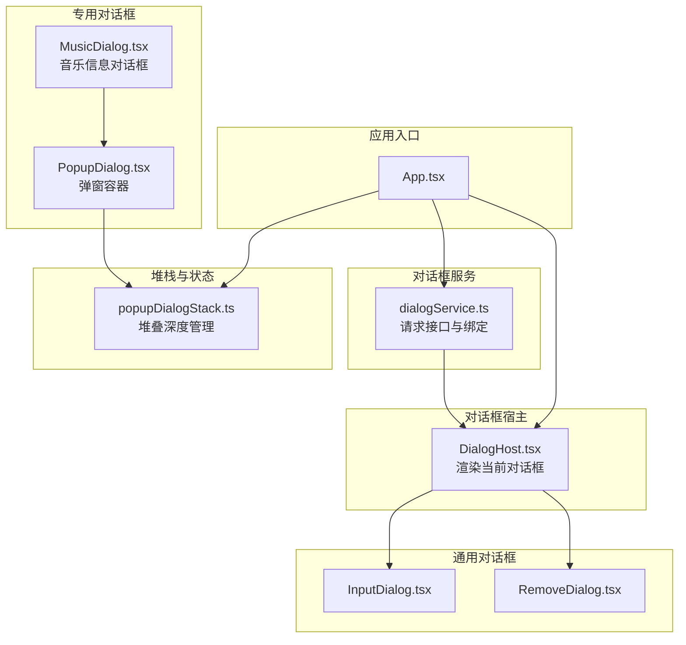
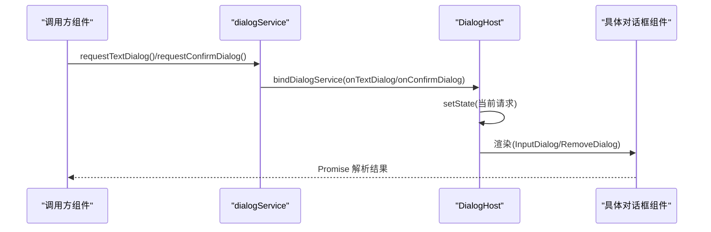
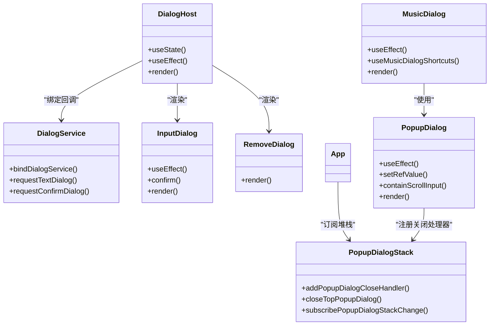
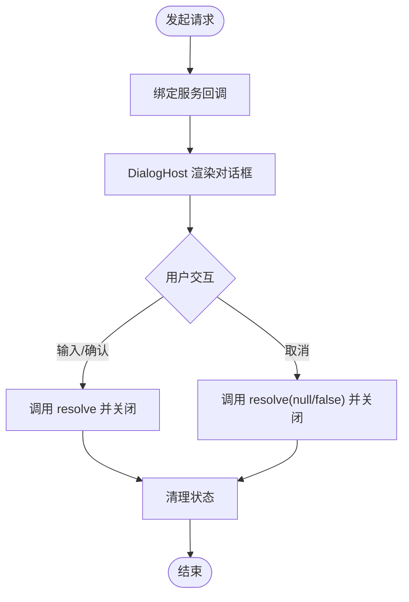
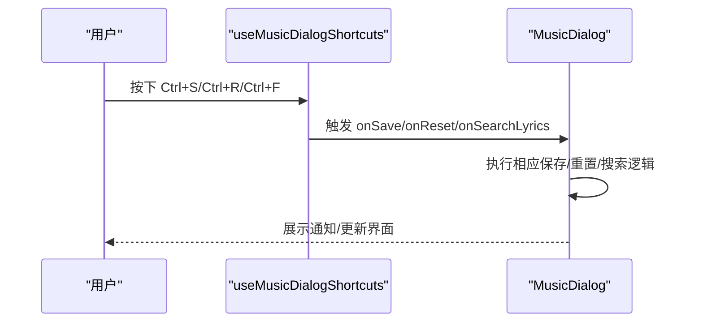

# 对话框系统

<cite>
**本文档引用的文件**
- [DialogHost.tsx](file://src/components/DialogHost.tsx)
- [dialogService.ts](file://src/components/dialogService.ts)
- [MusicDialog.tsx](file://src/components/MusicDialog.tsx)
- [PopupDialog.tsx](file://src/components/PopupDialog.tsx)
- [popupDialogStack.ts](file://src/components/popupDialogStack.ts)
- [InputDialog.tsx](file://src/components/InputDialog.tsx)
- [RemoveDialog.tsx](file://src/components/RemoveDialog.tsx)
- [useMusicDialogShortcuts.ts](file://src/hooks/useMusicDialogShortcuts.ts)
- [NowPlayingFullPage.tsx](file://src/pages/NowPlayingFullPage.tsx)
- [HeaderedPlaylistControl.tsx](file://src/components/HeaderedPlaylistControl.tsx)
- [App.tsx](file://src/App.tsx)
- [song-dialog.css](file://src/styles/song-dialog.css)
</cite>

## 目录
1. [简介](#简介)
2. [项目结构](#项目结构)
3. [核心组件](#核心组件)
4. [架构总览](#架构总览)
5. [详细组件分析](#详细组件分析)
6. [依赖关系分析](#依赖关系分析)
7. [性能考量](#性能考量)
8. [故障排查指南](#故障排查指南)
9. [结论](#结论)
10. [附录](#附录)

## 简介
本文件系统性阐述 SMPlayer 的对话框系统，重点覆盖 DialogHost 宿主组件、dialogService 服务、通用输入与确认对话框，以及 MusicDialog、PopupDialog 等专用对话框的协作机制。文档从架构设计、生命周期管理、模态控制、焦点与键盘交互、滚动行为、样式定制到扩展与自定义实践进行深入解析，并提供可视化图示帮助理解。

## 项目结构
对话框系统主要由以下层次构成：
- 服务层：dialogService 提供统一的请求接口，支持文本输入与确认对话框。
- 宿主层：DialogHost 将服务层与具体对话框组件解耦，负责渲染当前激活的对话框。
- 通用对话框：InputDialog、RemoveDialog 提供基础的输入与确认能力。
- 专用对话框：PopupDialog 作为弹窗容器，MusicDialog 作为音乐信息编辑对话框。
- 堆栈与状态：popupDialogStack 维护弹窗堆叠深度，App.tsx 订阅并响应堆栈变化。
- 样式层：song-dialog.css 定义对话框外观与交互细节。

图表来源
- [App.tsx:16](file://src/App.tsx#L16)
- [App.tsx:130](file://src/App.tsx#L130)
- [dialogService.ts:20-41](file://src/components/dialogService.ts#L20-L41)
- [DialogHost.tsx:8-55](file://src/components/DialogHost.tsx#L8-L55)
- [InputDialog.tsx:5-104](file://src/components/InputDialog.tsx#L5-L104)
- [RemoveDialog.tsx:3-48](file://src/components/RemoveDialog.tsx#L3-L48)
- [PopupDialog.tsx:83-281](file://src/components/PopupDialog.tsx#L83-L281)
- [MusicDialog.tsx:78-777](file://src/components/MusicDialog.tsx#L78-L777)
- [popupDialogStack.ts:13-47](file://src/components/popupDialogStack.ts#L13-L47)

章节来源
- [App.tsx:16](file://src/App.tsx#L16)
- [App.tsx:130](file://src/App.tsx#L130)
- [dialogService.ts:20-41](file://src/components/dialogService.ts#L20-L41)
- [DialogHost.tsx:8-55](file://src/components/DialogHost.tsx#L8-L55)
- [InputDialog.tsx:5-104](file://src/components/InputDialog.tsx#L5-L104)
- [RemoveDialog.tsx:3-48](file://src/components/RemoveDialog.tsx#L3-L48)
- [PopupDialog.tsx:83-281](file://src/components/PopupDialog.tsx#L83-L281)
- [MusicDialog.tsx:78-777](file://src/components/MusicDialog.tsx#L78-L777)
- [popupDialogStack.ts:13-47](file://src/components/popupDialogStack.ts#L13-L47)

## 核心组件
- dialogService：定义 TextDialogRequest/ConfirmDialogRequest 请求类型，提供 bindDialogService 绑定回调与 requestTextDialog/requestConfirmDialog 异步请求方法。
- DialogHost：订阅 dialogService，维护当前显示的文本/确认对话框状态，并将其渲染为 InputDialog 或 RemoveDialog。
- PopupDialog：通用弹窗容器，提供拖拽标题栏、滚动穿透控制、无障碍属性、可选背景关闭等能力。
- MusicDialog：音乐信息编辑对话框，包含属性、歌词、专辑封面三个模式页，集成快捷键、保存/重置、歌词搜索导入等功能。
- popupDialogStack：维护弹窗堆叠深度，通过自定义事件通知全局状态，支持关闭顶部弹窗与订阅堆栈变化。

章节来源
- [dialogService.ts:1-42](file://src/components/dialogService.ts#L1-L42)
- [DialogHost.tsx:8-55](file://src/components/DialogHost.tsx#L8-L55)
- [PopupDialog.tsx:83-281](file://src/components/PopupDialog.tsx#L83-L281)
- [MusicDialog.tsx:65-777](file://src/components/MusicDialog.tsx#L65-L777)
- [popupDialogStack.ts:1-48](file://src/components/popupDialogStack.ts#L1-L48)

## 架构总览
对话框系统采用“服务-宿主-组件”三层协作：
- 服务层负责请求封装与异步返回（Promise），避免直接在业务组件中处理 UI 状态。
- 宿主层集中渲染当前对话框，确保同一时刻仅有一个对话框处于活跃状态。
- 通用与专用对话框分别承担基础交互与领域功能，通过 PopupDialog 实现一致的弹窗体验。

图表来源
- [dialogService.ts:20-41](file://src/components/dialogService.ts#L20-L41)
- [DialogHost.tsx:12-27](file://src/components/DialogHost.tsx#L12-L27)
- [InputDialog.tsx:39-59](file://src/components/InputDialog.tsx#L39-L59)
- [RemoveDialog.tsx:31-43](file://src/components/RemoveDialog.tsx#L31-L43)

## 详细组件分析

### DialogHost 宿主组件
职责
- 绑定 dialogService 回调，接收文本与确认对话框请求。
- 维护当前对话框状态，渲染对应组件并传递翻译器与回调。
- 在用户操作后调用请求 resolve 并清理状态。

关键点
- 使用 useState/ useEffect 管理请求状态与绑定时机。
- 关闭时调用请求对象的 resolve，确保 Promise 正常返回。

章节来源
- [DialogHost.tsx:8-55](file://src/components/DialogHost.tsx#L8-L55)

### dialogService 服务
职责
- 定义请求接口类型，暴露 bindDialogService 与两个请求函数。
- 以 Promise 形式返回用户输入或确认结果，隐藏 UI 状态细节。

关键点
- 请求对象包含 resolve 函数，用于在对话框关闭时回传值。
- 通过 onTextDialog/onConfirmDialog 回调与宿主通信。

章节来源
- [dialogService.ts:1-42](file://src/components/dialogService.ts#L1-L42)

### 通用对话框：InputDialog 与 RemoveDialog
职责
- InputDialog：文本输入、校验、回车确认、Esc 取消。
- RemoveDialog：确认删除/清空等危险操作，支持禁用与加载态。

关键点
- InputDialog 内部管理输入值、错误提示与提交状态，聚焦焦点与选择文本。
- RemoveDialog 通过无障碍属性与按钮状态反馈当前操作状态。

章节来源
- [InputDialog.tsx:5-104](file://src/components/InputDialog.tsx#L5-L104)
- [RemoveDialog.tsx:3-48](file://src/components/RemoveDialog.tsx#L3-L48)

### 专用对话框：PopupDialog
职责
- 作为弹窗容器，提供拖拽标题栏、滚动穿透控制、可选背景关闭、无障碍属性。
- 通过 createPortal 挂载到 document.body，保证层级与遮罩效果。

关键点
- 滚动穿透控制：检测内部可滚动元素，阻止事件冒泡到外部容器。
- 背景关闭：可配置点击遮罩关闭。
- 无障碍：设置 role="dialog"、aria-modal、aria-labelledby 等。

章节来源
- [PopupDialog.tsx:83-281](file://src/components/PopupDialog.tsx#L83-L281)

### 专用对话框：MusicDialog
职责
- 音乐信息编辑对话框，支持属性、歌词、专辑封面三模式。
- 集成快捷键（Ctrl+S 保存、Ctrl+R 重置、Ctrl+F 搜索歌词）、保存/撤销、歌词时间戳切换、专辑封面推荐与库内选择等。

关键点
- 模式切换与脏检查：根据当前模式执行相应保存逻辑。
- 快捷键钩子：useMusicDialogShortcuts 统一处理键盘事件。
- 与 PopupDialog 协作：通过 PopupDialog 提供一致的弹窗体验与拖拽能力。

章节来源
- [MusicDialog.tsx:65-777](file://src/components/MusicDialog.tsx#L65-L777)
- [useMusicDialogShortcuts.ts:10-44](file://src/hooks/useMusicDialogShortcuts.ts#L10-L44)

### 弹窗堆栈与状态：popupDialogStack
职责
- 维护弹窗关闭处理器列表，提供添加/移除顶部弹窗关闭处理器的能力。
- 通过自定义事件广播当前弹窗深度，供 App.tsx 订阅并更新 UI。

关键点
- addPopupDialogCloseHandler 返回取消函数，便于在组件卸载时清理。
- closeTopPopupDialog 支持通过键盘或外部调用关闭最上层弹窗。

章节来源
- [popupDialogStack.ts:1-48](file://src/components/popupDialogStack.ts#L1-L48)

### 应用集成：App.tsx
职责
- 订阅弹窗堆栈变化，维护 popupDialogDepth 状态。
- 在需要时调用 closeTopPopupDialog 关闭顶层弹窗。

关键点
- 通过 subscribePopupDialogStackChange 获取实时堆栈深度。
- 与 DialogHost 协同，确保对话框与弹窗的统一管理。

章节来源
- [App.tsx:16](file://src/App.tsx#L16)
- [App.tsx:130](file://src/App.tsx#L130)

### 使用示例：NowPlayingFullPage 与 HeaderedPlaylistControl
职责
- 在播放队列与歌单操作中触发文本输入与确认对话框。
- 通过 requestTextDialog/requestConfirmDialog 获取用户输入或确认结果。

关键点
- 文本输入用于创建播放列表名称。
- 确认对话框用于清空/删除等危险操作。

章节来源
- [NowPlayingFullPage.tsx:594-605](file://src/pages/NowPlayingFullPage.tsx#L594-L605)
- [HeaderedPlaylistControl.tsx:474-510](file://src/components/HeaderedPlaylistControl.tsx#L474-L510)

## 依赖关系分析

图表来源
- [DialogHost.tsx:8-55](file://src/components/DialogHost.tsx#L8-L55)
- [dialogService.ts:20-41](file://src/components/dialogService.ts#L20-L41)
- [InputDialog.tsx:30-59](file://src/components/InputDialog.tsx#L30-L59)
- [RemoveDialog.tsx:24-48](file://src/components/RemoveDialog.tsx#L24-L48)
- [PopupDialog.tsx:104-159](file://src/components/PopupDialog.tsx#L104-L159)
- [MusicDialog.tsx:772-777](file://src/components/MusicDialog.tsx#L772-L777)
- [popupDialogStack.ts:13-47](file://src/components/popupDialogStack.ts#L13-L47)
- [App.tsx:130](file://src/App.tsx#L130)

## 性能考量
- 对话框渲染最小化：DialogHost 仅渲染当前活跃对话框，避免不必要的组件树更新。
- 弹窗堆栈监听：通过自定义事件广播堆栈深度，减少全局状态同步成本。
- 滚动穿透优化：PopupDialog 在事件捕获阶段判断可滚动元素，降低滚动冲突带来的重排开销。
- 长任务异步化：MusicDialog 中的歌词搜索/导入、专辑封面变更等操作均以异步方式执行，避免阻塞 UI。

## 故障排查指南
常见问题与定位建议
- 对话框无法关闭
  - 检查 DialogHost 是否正确调用请求 resolve。
  - 确认 PopupDialog 的 onClose 回调是否被触发。
- 输入验证无效
  - 确认 InputDialog 的 validate 回调返回错误信息。
  - 检查输入框是否在挂载后获得焦点与全选。
- 弹窗堆栈异常
  - 确认 addPopupDialogCloseHandler 的返回取消函数是否在组件卸载时调用。
  - 检查 subscribePopupDialogStackChange 的订阅与移除是否成对出现。
- 滚动穿透导致页面滚动
  - 检查 PopupDialog 的 containScrollInput 判断逻辑与事件监听是否正确。
- 键盘快捷键不生效
  - 确认 useMusicDialogShortcuts 的事件监听是否在正确上下文中注册。

章节来源
- [DialogHost.tsx:19-27](file://src/components/DialogHost.tsx#L19-L27)
- [InputDialog.tsx:30-59](file://src/components/InputDialog.tsx#L30-L59)
- [PopupDialog.tsx:116-159](file://src/components/PopupDialog.tsx#L116-L159)
- [useMusicDialogShortcuts.ts:16-42](file://src/hooks/useMusicDialogShortcuts.ts#L16-L42)

## 结论
SMPlayer 的对话框系统通过服务-宿主-组件分层实现了高内聚低耦合的架构：dialogService 抽象了请求与返回，DialogHost 统一渲染，PopupDialog 提供一致的弹窗体验，MusicDialog 承载领域功能。配合 popupDialogStack 的堆栈管理与 App.tsx 的全局订阅，系统在可用性、可维护性与可扩展性方面表现良好。

## 附录

### 生命周期管理
- 请求发起：调用 requestTextDialog/requestConfirmDialog，返回 Promise。
- 宿主渲染：DialogHost 接收回调并渲染对应对话框。
- 用户交互：对话框组件处理输入/确认，调用 resolve。
- 状态清理：resolve 后 DialogHost 清理状态，释放内存。

图表来源
- [dialogService.ts:31-41](file://src/components/dialogService.ts#L31-L41)
- [DialogHost.tsx:19-27](file://src/components/DialogHost.tsx#L19-L27)
- [InputDialog.tsx:39-59](file://src/components/InputDialog.tsx#L39-L59)
- [RemoveDialog.tsx:31-43](file://src/components/RemoveDialog.tsx#L31-L43)

### 模态控制与焦点管理
- 模态控制：PopupDialog 设置 aria-modal="true"，确保屏幕阅读器与辅助技术识别为模态。
- 焦点管理：InputDialog 在挂载时自动聚焦并全选输入框；确认后等待异步完成再释放焦点。
- 键盘交互：MusicDialog 通过 useMusicDialogShortcuts 统一处理 Ctrl+S/Ctrl+R/Ctrl+F 快捷键。

章节来源
- [PopupDialog.tsx:234-236](file://src/components/PopupDialog.tsx#L234-L236)
- [InputDialog.tsx:30-37](file://src/components/InputDialog.tsx#L30-L37)
- [useMusicDialogShortcuts.ts:16-36](file://src/hooks/useMusicDialogShortcuts.ts#L16-L36)

### 键盘交互流程（MusicDialog）

图表来源
- [useMusicDialogShortcuts.ts:16-36](file://src/hooks/useMusicDialogShortcuts.ts#L16-L36)
- [MusicDialog.tsx:772-777](file://src/components/MusicDialog.tsx#L772-L777)

### 样式定制指南
- 全局样式：song-dialog.css 定义对话框尺寸、边框、阴影、按钮样式与网格布局。
- 弹窗容器：PopupDialog 通过 createPortal 挂载至 body，确保层级与遮罩。
- 拖拽区域：标题栏设置 app-region: drag，支持窗口拖拽。
- 移动端适配：PopupDialog 提供移动端标题栏与返回按钮，提升移动端可用性。

章节来源
- [song-dialog.css:1-800](file://src/styles/song-dialog.css#L1-L800)
- [PopupDialog.tsx:17-281](file://src/components/PopupDialog.tsx#L17-L281)

### 扩展与自定义实践
- 新增通用对话框
  - 参考 InputDialog/RemoveDialog 的结构，定义 props 与回调。
  - 在 DialogHost 中新增分支渲染新组件。
  - 通过 dialogService 的 bindDialogService 注入回调。
- 新增专用对话框
  - 基于 PopupDialog 创建，复用拖拽、滚动与无障碍能力。
  - 在 App.tsx 中订阅 popupDialogStack，确保与全局弹窗生态一致。
- 自定义样式
  - 在 song-dialog.css 中新增类名或调整现有规则，注意与现有网格与按钮体系兼容。
  - 通过 className/overlayClassName 参数向 PopupDialog 传入自定义样式。

章节来源
- [DialogHost.tsx:29-54](file://src/components/DialogHost.tsx#L29-L54)
- [PopupDialog.tsx:83-281](file://src/components/PopupDialog.tsx#L83-L281)
- [song-dialog.css:1-800](file://src/styles/song-dialog.css#L1-L800)