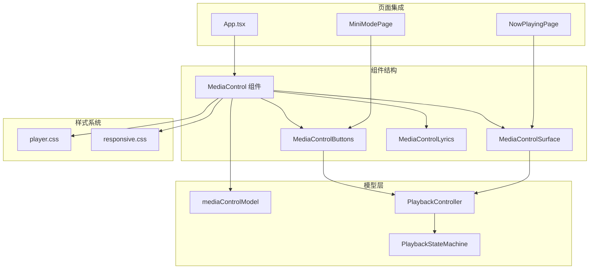
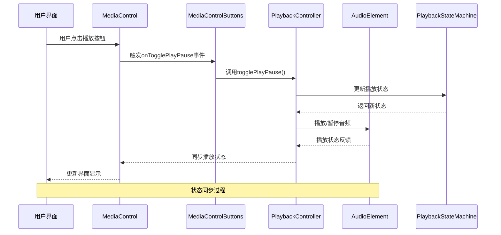
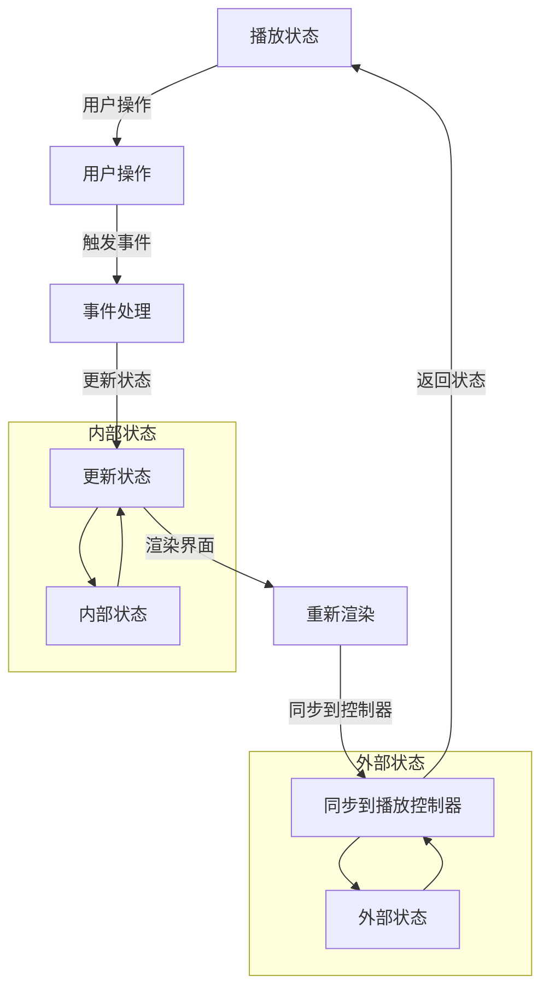
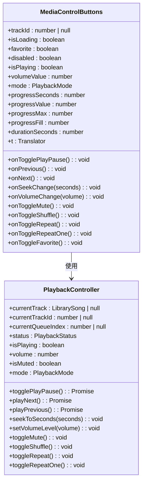
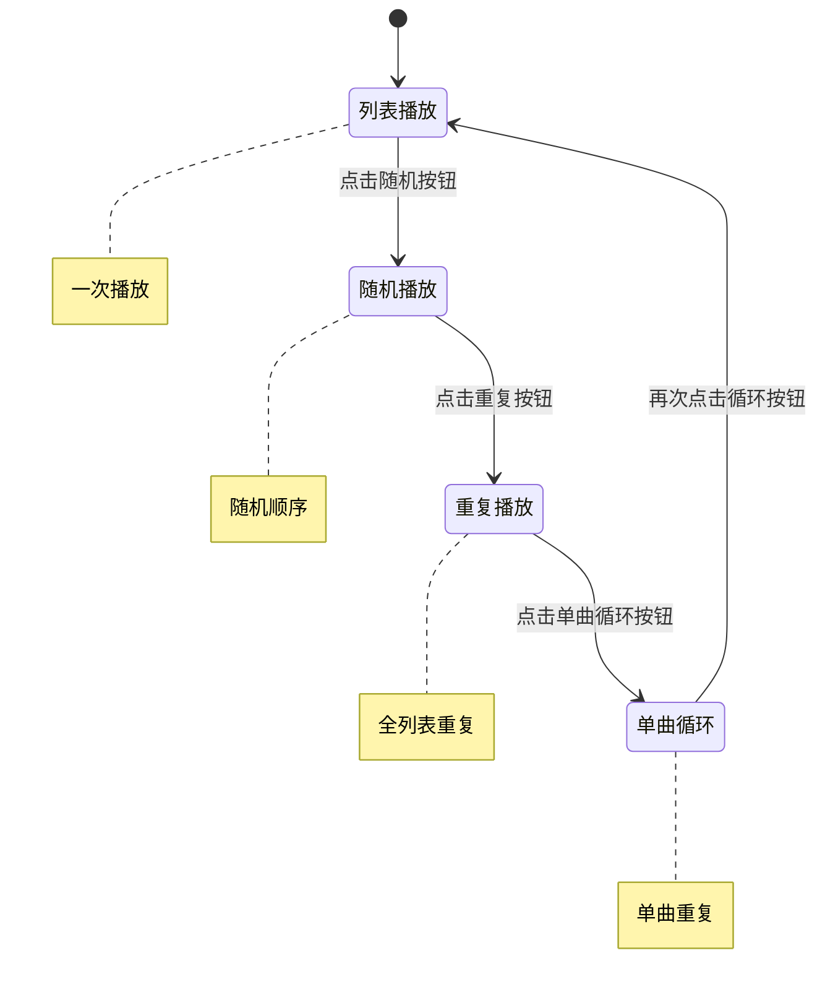
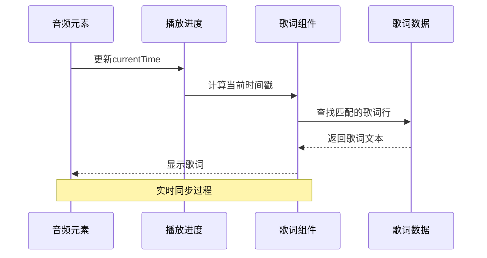
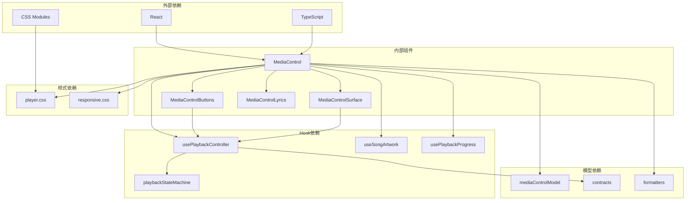
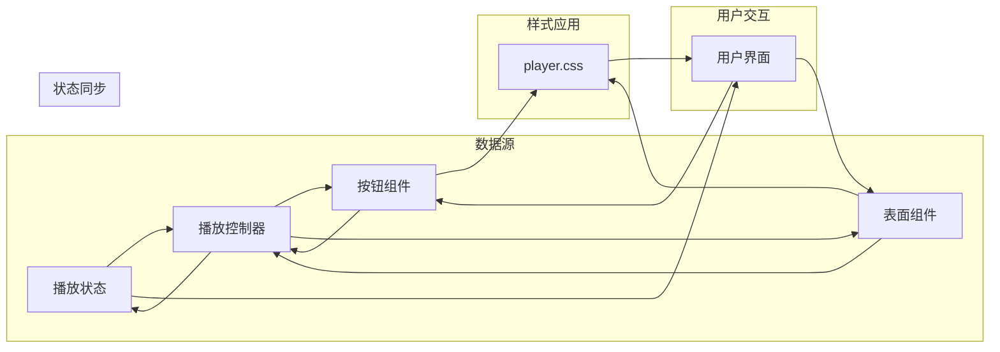

# MediaControl媒体控制组件

<cite>
**本文档引用的文件**
- [MediaControl.tsx](file://src/components/MediaControl.tsx)
- [mediaControlModel.ts](file://src/components/mediaControlModel.ts)
- [usePlaybackController.ts](file://src/hooks/usePlaybackController.ts)
- [playbackStateMachine.ts](file://src/hooks/playbackStateMachine.ts)
- [player.css](file://src/styles/player.css)
- [responsive.css](file://src/styles/responsive.css)
- [MiniModePage.tsx](file://src/pages/MiniModePage.tsx)
- [App.tsx](file://src/App.tsx)
</cite>

## 目录
1. [简介](#简介)
2. [项目结构](#项目结构)
3. [核心组件](#核心组件)
4. [架构概览](#架构概览)
5. [详细组件分析](#详细组件分析)
6. [依赖关系分析](#依赖关系分析)
7. [性能考虑](#性能考虑)
8. [故障排除指南](#故障排除指南)
9. [结论](#结论)

## 简介

SMPlayer的MediaControl媒体控制组件是一个高度集成的音频播放控制界面，提供了完整的音乐播放体验。该组件集成了播放控制按钮、进度条、音量控制、播放状态显示等功能，并与播放控制器深度集成，实现了实时的状态同步和事件处理。

MediaControl组件采用模块化设计，包含三个主要子组件：MediaControlButtons（按钮控件）、MediaControlSurface（表面控件）和主MediaControl（完整控件）。它支持响应式设计，在不同屏幕尺寸下提供优化的用户体验。

## 项目结构

MediaControl组件位于src/components目录下，与相关样式文件和页面组件共同构成了完整的播放控制体系：

**图表来源**
- [MediaControl.tsx:1-1322](file://src/components/MediaControl.tsx#L1-L1322)
- [mediaControlModel.ts:1-18](file://src/components/mediaControlModel.ts#L1-L18)
- [usePlaybackController.ts:1-958](file://src/hooks/usePlaybackController.ts#L1-L958)

**章节来源**
- [MediaControl.tsx:1-1322](file://src/components/MediaControl.tsx#L1-L1322)
- [mediaControlModel.ts:1-18](file://src/components/mediaControlModel.ts#L1-L18)

## 核心组件

### MediaControl 主组件

MediaControl是整个播放控制系统的入口点，负责协调所有子组件并管理全局状态。它接收来自播放控制器的数据，包括当前播放歌曲、播放状态、音量设置等。

主要功能特性：
- **状态管理**：整合播放器的各种状态信息
- **事件处理**：处理用户交互事件并调用相应的播放控制方法
- **样式应用**：根据主题和状态动态应用CSS样式
- **响应式布局**：自适应不同屏幕尺寸的布局调整

### MediaControlButtons 子组件

MediaControlButtons专注于提供核心的播放控制按钮和滑块控件：

- **播放控制按钮**：上一首、播放/暂停、下一首
- **进度控制滑块**：可拖拽的进度条
- **音量控制**：水平和垂直音量滑块
- **播放模式切换**：随机播放、重复播放、单曲循环
- **收藏功能**：喜欢/取消喜欢当前歌曲

### MediaControlSurface 子组件

MediaControlSurface提供更丰富的播放控制界面，包含额外的功能控件：

- **歌词显示**：实时显示当前播放的歌词行
- **更多选项菜单**：访问高级播放功能
- **专辑封面显示**：显示当前歌曲的专辑封面
- **窗口控制**：全屏切换、迷你模式进入等

**章节来源**
- [MediaControl.tsx:223-832](file://src/components/MediaControl.tsx#L223-L832)

## 架构概览

MediaControl组件采用了清晰的分层架构，确保了良好的可维护性和扩展性：

**图表来源**
- [MediaControl.tsx:709-832](file://src/components/MediaControl.tsx#L709-L832)
- [usePlaybackController.ts:68-958](file://src/hooks/usePlaybackController.ts#L68-L958)

### 状态管理模式

组件使用React的状态管理模式来管理播放器状态：

**图表来源**
- [playbackStateMachine.ts:1-51](file://src/hooks/playbackStateMachine.ts#L1-L51)
- [usePlaybackController.ts:68-173](file://src/hooks/usePlaybackController.ts#L68-L173)

**章节来源**
- [usePlaybackController.ts:68-583](file://src/hooks/usePlaybackController.ts#L68-L583)
- [playbackStateMachine.ts:16-50](file://src/hooks/playbackStateMachine.ts#L16-L50)

## 详细组件分析

### 媒体控制按钮组件

MediaControlButtons组件提供了最基础的播放控制功能：

#### 按钮控件设计

**图表来源**
- [MediaControl.tsx:223-254](file://src/components/MediaControl.tsx#L223-L254)
- [usePlaybackController.ts:28-53](file://src/hooks/usePlaybackController.ts#L28-L53)

#### 音量控制机制

音量控制通过两种方式实现：

1. **水平音量滑块**：用于桌面端的直观音量调节
2. **垂直音量滑块**：用于移动端的紧凑设计

音量控制具有以下特性：
- 实时预览功能
- 悬停显示数值
- 自动隐藏机制
- 键盘导航支持

**章节来源**
- [MediaControl.tsx:436-684](file://src/components/MediaControl.tsx#L436-L684)

### 播放模式控制系统

MediaControl组件支持多种播放模式的切换：

**图表来源**
- [MediaControl.tsx:162-176](file://src/components/MediaControl.tsx#L162-L176)
- [mediaControlModel.ts:7-17](file://src/components/mediaControlModel.ts#L7-L17)

### 歌词显示系统

MediaControl组件集成了实时歌词显示功能：

#### 歌词同步机制

**图表来源**
- [MediaControl.tsx:699-707](file://src/components/MediaControl.tsx#L699-L707)
- [App.tsx:1118-1151](file://src/App.tsx#L1118-L1151)

**章节来源**
- [MediaControl.tsx:910-913](file://src/components/MediaControl.tsx#L910-L913)
- [MiniModePage.tsx:101-104](file://src/pages/MiniModePage.tsx#L101-L104)

## 依赖关系分析

### 组件间依赖关系

**图表来源**
- [MediaControl.tsx:1-25](file://src/components/MediaControl.tsx#L1-L25)
- [usePlaybackController.ts:1-27](file://src/hooks/usePlaybackController.ts#L1-L27)

### 数据流分析

组件间的数据流向体现了清晰的单向数据流原则：

**图表来源**
- [usePlaybackController.ts:94-173](file://src/hooks/usePlaybackController.ts#L94-L173)
- [MediaControl.tsx:878-880](file://src/components/MediaControl.tsx#L878-L880)

**章节来源**
- [MediaControl.tsx:834-1148](file://src/components/MediaControl.tsx#L834-L1148)
- [usePlaybackController.ts:175-583](file://src/hooks/usePlaybackController.ts#L175-L583)

## 性能考虑

### 渲染优化策略

MediaControl组件采用了多种性能优化技术：

1. **状态分离**：将不同的状态管理逻辑分离到独立的组件中
2. **记忆化计算**：使用useMemo避免不必要的重新计算
3. **条件渲染**：根据状态动态决定组件的渲染内容
4. **事件节流**：对频繁触发的事件进行节流处理

### 内存管理

组件实现了完善的内存清理机制：

- **定时器清理**：确保所有setTimeout和setInterval都被正确清理
- **事件监听器移除**：在组件卸载时移除所有事件监听器
- **引用清理**：使用ref对象存储引用并在需要时清理

### 响应式性能

为了确保在不同设备上的流畅体验：

- **媒体查询优化**：使用CSS媒体查询适配不同屏幕尺寸
- **触摸事件优化**：针对移动设备优化触摸交互
- **动画性能**：使用transform属性而非改变布局属性

## 故障排除指南

### 常见问题诊断

#### 播放状态不同步

**症状**：界面显示的播放状态与实际播放状态不一致

**可能原因**：
1. 状态更新延迟
2. 事件处理函数未正确绑定
3. 组件重新渲染时机问题

**解决方案**：
- 检查usePlaybackController的状态同步逻辑
- 确保事件处理函数的依赖数组正确配置
- 验证状态更新的时机和顺序

#### 音量控制异常

**症状**：音量滑块无法正常工作或显示错误

**可能原因**：
1. 鼠标事件处理冲突
2. CSS样式覆盖问题
3. 浏览器兼容性问题

**解决方案**：
- 检查pointer事件的处理逻辑
- 验证CSS样式的优先级
- 测试不同浏览器的兼容性

#### 歌词显示问题

**症状**：歌词不显示或显示不正确

**可能原因**：
1. 歌词数据获取失败
2. 时间戳计算错误
3. 歌词格式解析问题

**解决方案**：
- 检查歌词数据的获取和缓存机制
- 验证时间戳计算的准确性
- 确认歌词格式的正确解析

**章节来源**
- [usePlaybackController.ts:219-305](file://src/hooks/usePlaybackController.ts#L219-L305)
- [MediaControl.tsx:932-955](file://src/components/MediaControl.tsx#L932-L955)

## 结论

SMPlayer的MediaControl媒体控制组件展现了现代前端开发的最佳实践。通过清晰的架构设计、完善的状态管理和优雅的用户界面，该组件为用户提供了流畅的音乐播放体验。

组件的主要优势包括：

1. **模块化设计**：清晰的组件分离和职责划分
2. **状态管理**：可靠的播放状态同步机制
3. **响应式设计**：适配多种设备和屏幕尺寸
4. **性能优化**：高效的渲染和内存管理
5. **可扩展性**：易于添加新功能和自定义选项

未来可以考虑的改进方向：
- 增加更多的键盘快捷键支持
- 扩展自定义主题和样式选项
- 添加更多播放列表管理功能
- 优化离线播放和缓存机制

通过持续的优化和改进，MediaControl组件将继续为SMPlayer用户提供优秀的音频播放体验。