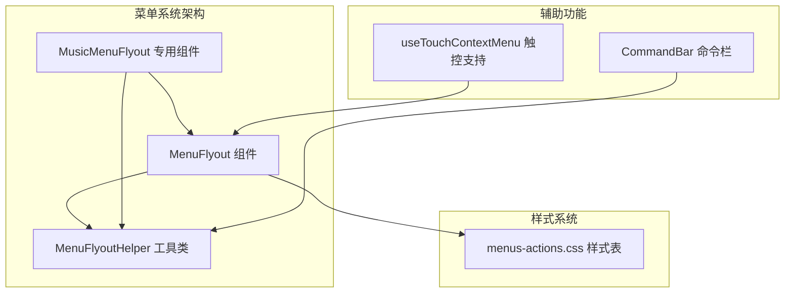
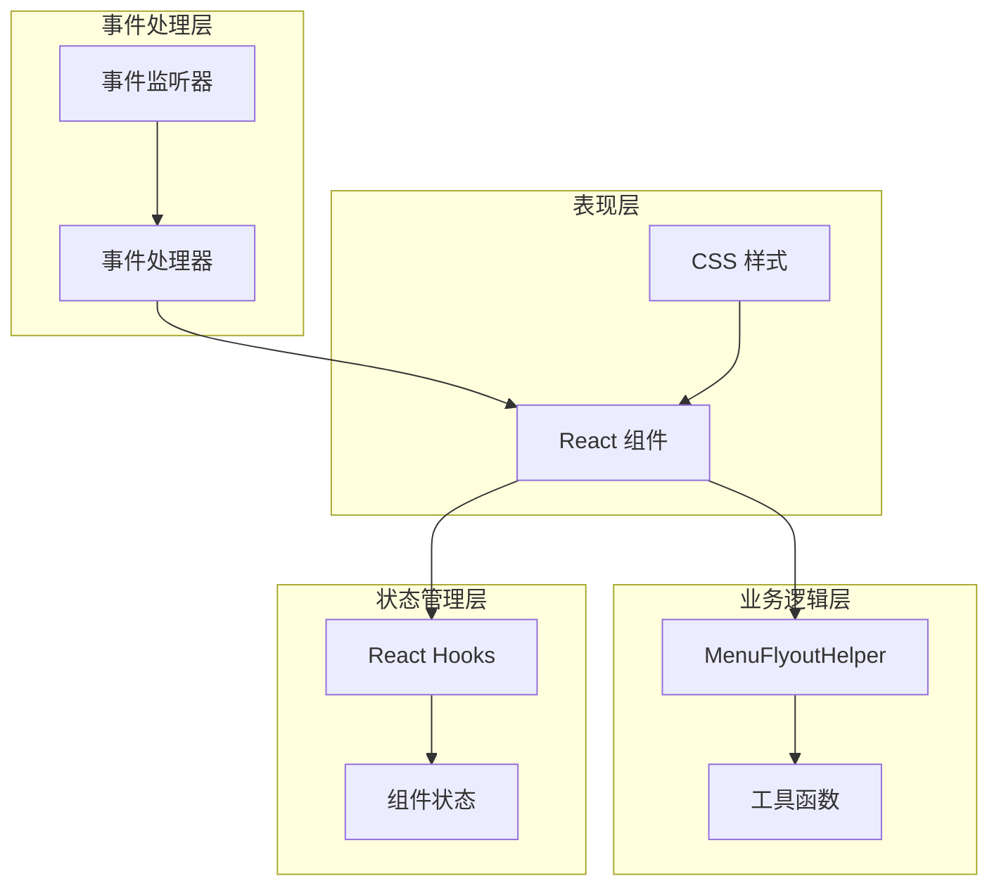
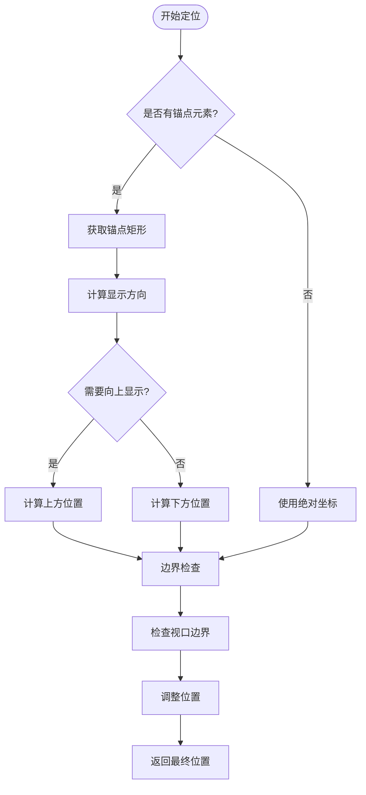
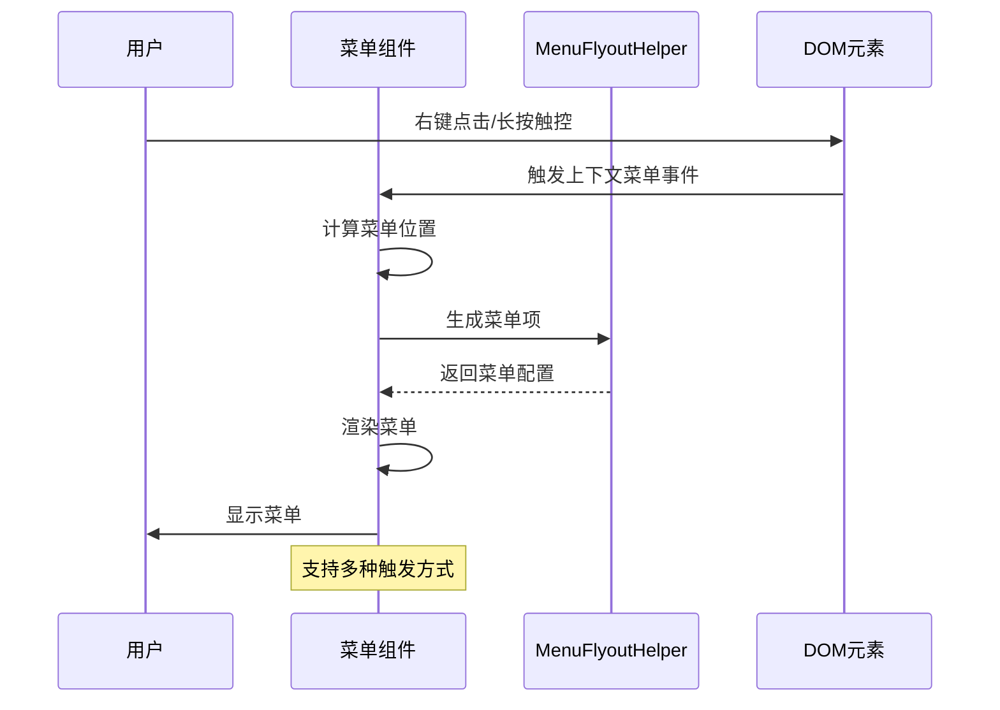
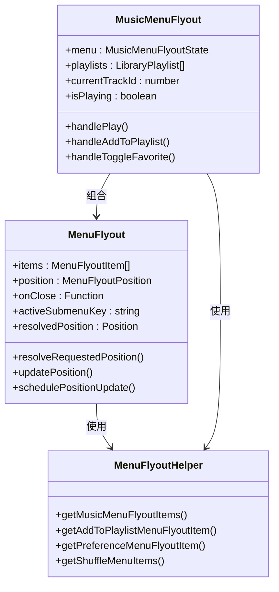
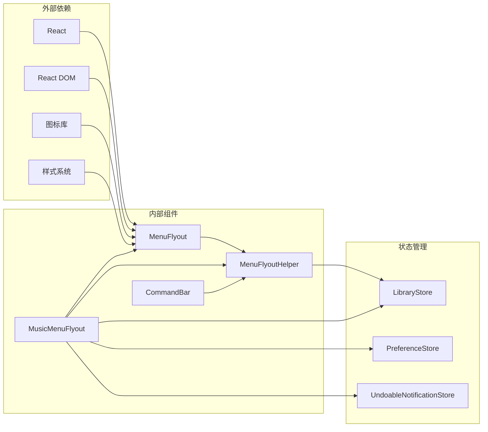
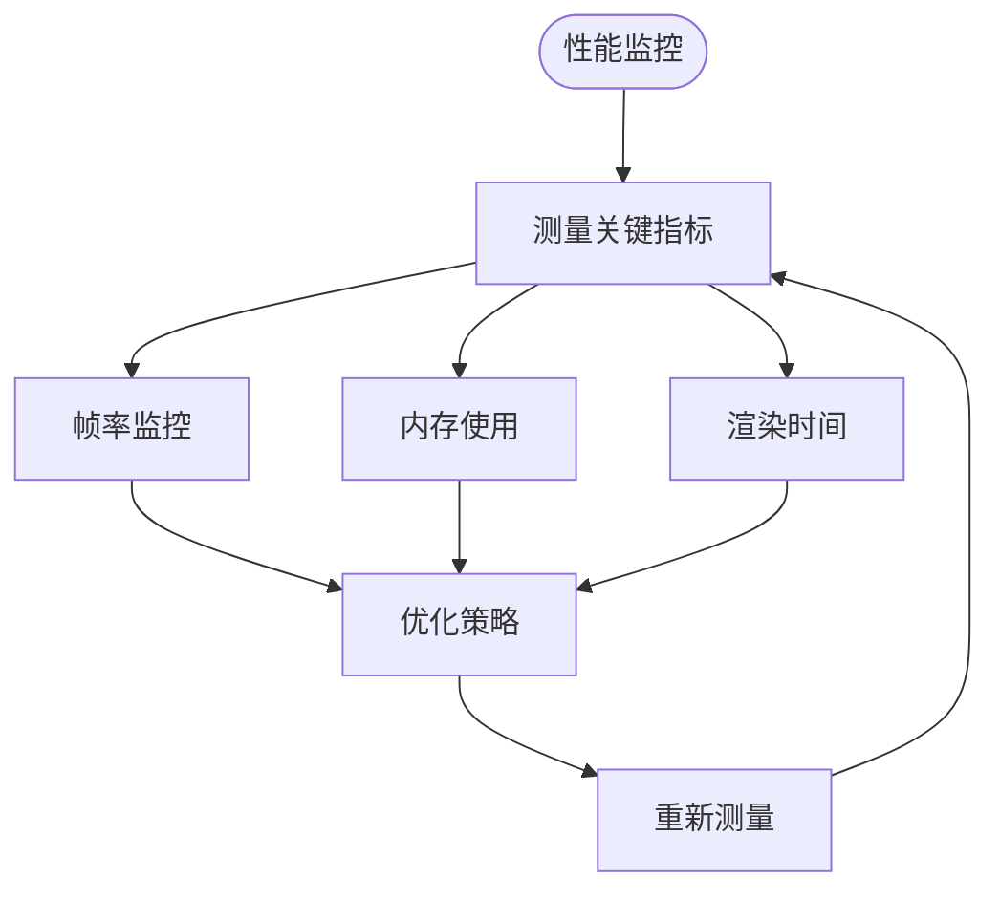

# 菜单飞出系统

<cite>
**本文档引用的文件**
- [MenuFlyout.tsx](file://src/components/MenuFlyout.tsx)
- [MenuFlyoutHelper.ts](file://src/components/MenuFlyoutHelper.ts)
- [MusicMenuFlyout.tsx](file://src/components/MusicMenuFlyout.tsx)
- [menus-actions.css](file://src/styles/menus-actions.css)
- [useTouchContextMenu.ts](file://src/hooks/useTouchContextMenu.ts)
- [CommandBar.tsx](file://src/components/CommandBar.tsx)
</cite>

## 目录
1. [简介](#简介)
2. [项目结构](#项目结构)
3. [核心组件](#核心组件)
4. [架构概览](#架构概览)
5. [详细组件分析](#详细组件分析)
6. [依赖关系分析](#依赖关系分析)
7. [性能考虑](#性能考虑)
8. [故障排除指南](#故障排除指南)
9. [结论](#结论)

## 简介

SMPlayer的MenuFlyout菜单系统是一个高度可定制的上下文菜单解决方案，专为音乐播放器应用设计。该系统提供了完整的菜单飞出功能，包括智能定位算法、触控支持、动画效果和无障碍访问。

系统的核心设计理念是提供一个灵活、可扩展的菜单框架，支持多种菜单类型（普通菜单项、子菜单、音量控制）和丰富的交互模式。通过模块化设计，开发者可以轻松创建各种场景下的上下文菜单。

## 项目结构

菜单系统主要由三个核心文件组成：



**图表来源**
- [MenuFlyout.tsx:1-466](file://src/components/MenuFlyout.tsx#L1-L466)
- [MenuFlyoutHelper.ts:1-608](file://src/components/MenuFlyoutHelper.ts#L1-L608)
- [MusicMenuFlyout.tsx:1-247](file://src/components/MusicMenuFlyout.tsx#L1-L247)

**章节来源**
- [MenuFlyout.tsx:1-466](file://src/components/MenuFlyout.tsx#L1-L466)
- [MenuFlyoutHelper.ts:1-608](file://src/components/MenuFlyoutHelper.ts#L1-L608)
- [MusicMenuFlyout.tsx:1-247](file://src/components/MusicMenuFlyout.tsx#L1-L247)

## 核心组件

### MenuFlyout 主组件

MenuFlyout是整个菜单系统的核心组件，负责渲染和管理菜单的显示与隐藏。

**关键特性：**
- 智能定位算法，自动适应屏幕边界
- 支持锚点元素定位和绝对坐标定位
- 动态子菜单布局计算
- 触控和鼠标事件处理
- 键盘导航支持

**主要接口：**
```typescript
interface MenuFlyoutProps {
  items: MenuFlyoutItem[]
  position: MenuFlyoutPosition
  onClose: () => void
  layer?: 'default' | 'dialog'
}
```

### MenuFlyoutHelper 工具类

提供菜单项生成和管理的工具函数集合。

**核心功能：**
- 音乐菜单项生成
- 添加到播放列表菜单构建
- 偏好设置菜单创建
- 随机播放菜单生成
- 文件夹移动菜单构建

**数据结构：**
```typescript
interface MenuFlyoutItem {
  key: string
  text: string
  icon?: IconName
  kind?: 'button' | 'volume'
  submenu?: MenuFlyoutItem[]
  onClick?: () => void | Promise<void>
  // ... 其他属性
}
```

### MusicMenuFlyout 专用组件

针对音乐播放场景的专用菜单组件，集成了完整的音乐播放器功能。

**特有功能：**
- 播放控制集成
- 播放列表管理
- 偏好设置管理
- 文件操作支持
- 对话框集成

**章节来源**
- [MenuFlyout.tsx:10-149](file://src/components/MenuFlyout.tsx#L10-L149)
- [MenuFlyoutHelper.ts:34-51](file://src/components/MenuFlyoutHelper.ts#L34-L51)
- [MusicMenuFlyout.tsx:46-241](file://src/components/MusicMenuFlyout.tsx#L46-L241)

## 架构概览

菜单系统采用分层架构设计，确保了高内聚低耦合：



**图表来源**
- [MenuFlyout.tsx:1-466](file://src/components/MenuFlyout.tsx#L1-L466)
- [MenuFlyoutHelper.ts:1-608](file://src/components/MenuFlyoutHelper.ts#L1-L608)
- [MusicMenuFlyout.tsx:1-247](file://src/components/MusicMenuFlyout.tsx#L1-L247)

## 详细组件分析

### 定位算法实现

MenuFlyout实现了复杂的定位算法来确保菜单在各种屏幕尺寸和布局下都能正确显示：



**图表来源**
- [MenuFlyout.tsx:27-77](file://src/components/MenuFlyout.tsx#L27-L77)
- [MenuFlyout.tsx:48-77](file://src/components/MenuFlyout.tsx#L48-L77)

### 触发机制分析

系统支持多种触发方式，包括鼠标右键、长按触控等：



**图表来源**
- [useTouchContextMenu.ts:23-152](file://src/hooks/useTouchContextMenu.ts#L23-L152)
- [MenuFlyout.tsx:101-126](file://src/components/MenuFlyout.tsx#L101-L126)

### 动画效果实现

菜单系统提供了流畅的动画过渡效果：

**CSS 动画特性：**
- 滑入滑出动画
- 子菜单展开收起
- 悬停状态切换
- 键盘导航焦点指示

**样式系统：**
- 使用 CSS 变量控制动画参数
- 支持深色模式主题切换
- 响应式布局适配
- 性能优化的 GPU 加速

### 事件处理机制

系统实现了完整的事件处理链路：



**图表来源**
- [MenuFlyout.tsx:10-149](file://src/components/MenuFlyout.tsx#L10-L149)
- [MenuFlyoutHelper.ts:232-433](file://src/components/MenuFlyoutHelper.ts#L232-L433)
- [MusicMenuFlyout.tsx:46-241](file://src/components/MusicMenuFlyout.tsx#L46-L241)

**章节来源**
- [MenuFlyout.tsx:1-466](file://src/components/MenuFlyout.tsx#L1-L466)
- [MenuFlyoutHelper.ts:1-608](file://src/components/MenuFlyoutHelper.ts#L1-L608)
- [MusicMenuFlyout.tsx:1-247](file://src/components/MusicMenuFlyout.tsx#L1-L247)

## 依赖关系分析

菜单系统与其他组件的依赖关系如下：



**图表来源**
- [MenuFlyout.tsx:1-7](file://src/components/MenuFlyout.tsx#L1-L7)
- [MusicMenuFlyout.tsx:1-14](file://src/components/MusicMenuFlyout.tsx#L1-L14)
- [CommandBar.tsx:18-21](file://src/components/CommandBar.tsx#L18-L21)

**章节来源**
- [MenuFlyout.tsx:1-466](file://src/components/MenuFlyout.tsx#L1-L466)
- [MusicMenuFlyout.tsx:1-247](file://src/components/MusicMenuFlyout.tsx#L1-L247)
- [CommandBar.tsx:1-250](file://src/components/CommandBar.tsx#L1-L250)

## 性能考虑

### 优化策略

1. **请求动画帧优化**
   - 使用 `requestAnimationFrame` 进行位置更新
   - 避免频繁的 DOM 查询
   - 批量更新状态变化

2. **内存管理**
   - 合理清理事件监听器
   - 及时释放定时器资源
   - 避免内存泄漏

3. **渲染优化**
   - 使用 React Portal 减少 DOM 层级
   - 条件渲染子菜单
   - 避免不必要的重新渲染

### 性能监控



## 故障排除指南

### 常见问题及解决方案

**菜单不显示问题：**
1. 检查 `position` 参数是否正确设置
2. 确认锚点元素是否存在且可访问
3. 验证 `onClose` 回调函数是否正常工作

**定位错误问题：**
1. 检查 CSS 样式是否影响了定位计算
2. 确认容器元素的 `position` 属性
3. 验证 `window` 尺寸变化监听器

**事件冲突问题：**
1. 检查事件冒泡和捕获机制
2. 确认 `stopPropagation` 的使用
3. 验证事件监听器的移除

**章节来源**
- [MenuFlyout.tsx:101-126](file://src/components/MenuFlyout.tsx#L101-L126)
- [MenuFlyout.tsx:48-99](file://src/components/MenuFlyout.tsx#L48-L99)

## 结论

SMPlayer的MenuFlyout菜单系统展现了现代前端开发的最佳实践，通过精心设计的架构和实现，提供了强大而灵活的菜单解决方案。系统的主要优势包括：

1. **高度可定制性** - 通过工具类和配置选项支持各种场景
2. **优秀的用户体验** - 智能定位、流畅动画和完整键盘支持
3. **良好的性能表现** - 优化的渲染和事件处理机制
4. **完善的无障碍支持** - 符合 WCAG 标准的可访问性设计

该系统为音乐播放器应用提供了坚实的菜单基础设施，开发者可以根据具体需求进行扩展和定制，以满足更复杂的功能要求。