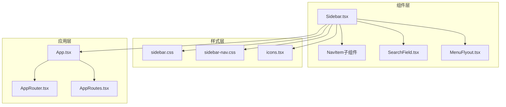
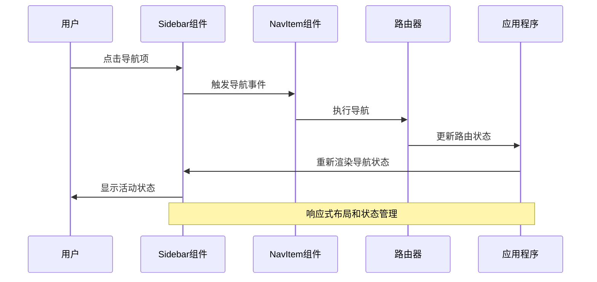
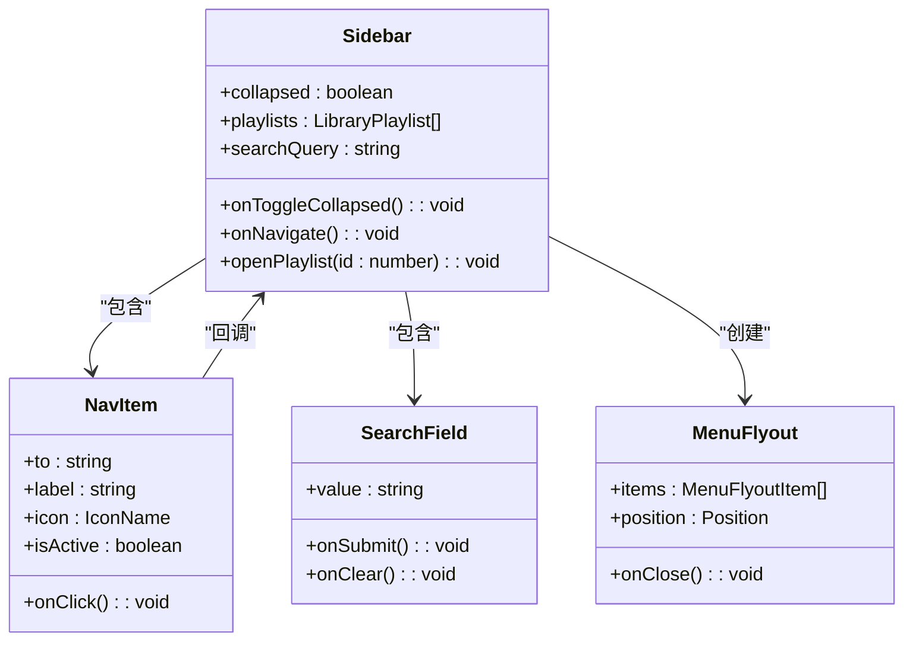
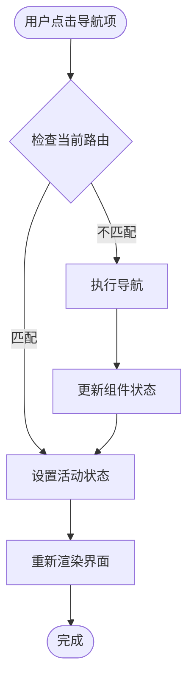
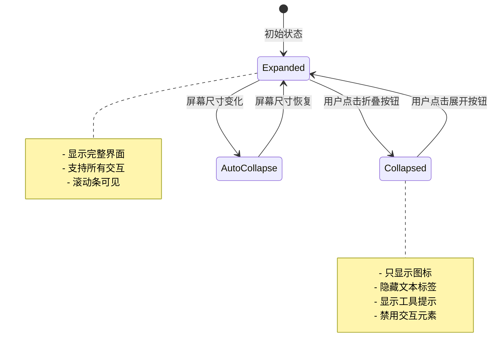
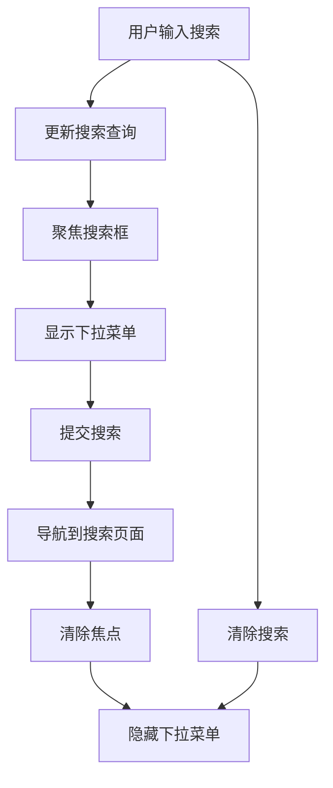
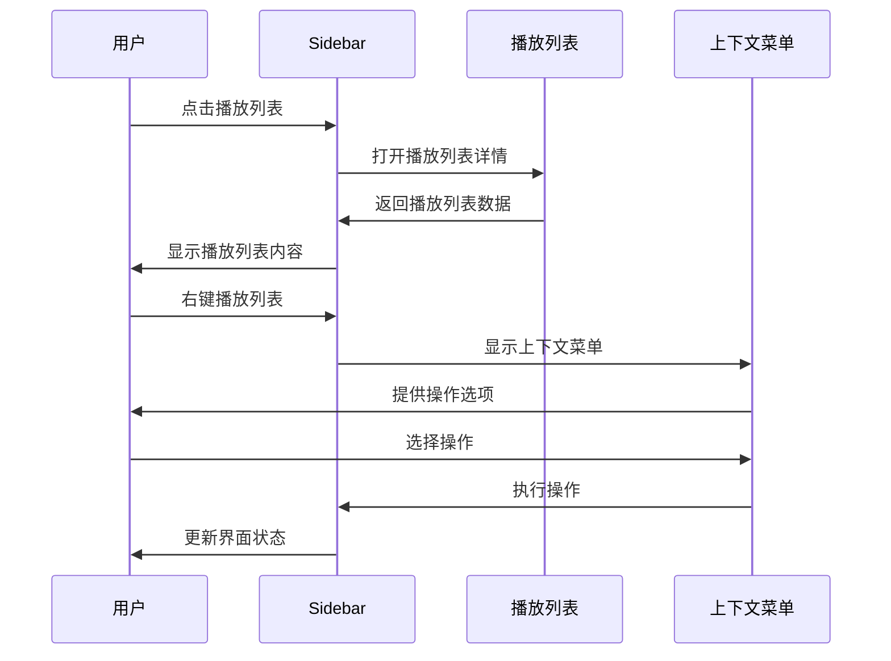
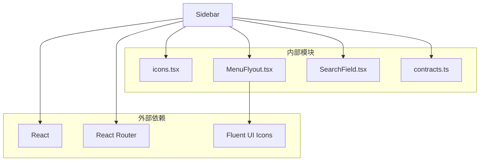

# Sidebar侧边栏导航

<cite>
**本文档引用的文件**
- [Sidebar.tsx](file://src/components/Sidebar.tsx)
- [sidebar.css](file://src/styles/sidebar.css)
- [sidebar-nav.css](file://src/styles/sidebar-nav.css)
- [icons.tsx](file://src/components/icons.tsx)
- [MenuFlyout.tsx](file://src/components/MenuFlyout.tsx)
- [SearchField.tsx](file://src/components/SearchField.tsx)
- [PlaylistMenuItems.ts](file://src/components/PlaylistMenuItems.ts)
- [App.tsx](file://src/App.tsx)
- [AppRouter.tsx](file://src/AppRouter.tsx)
- [AppRoutes.tsx](file://src/AppRoutes.tsx)
- [PlaylistsPage.tsx](file://src/pages/PlaylistsPage.tsx)
- [contracts.ts](file://src/shared/contracts.ts)
</cite>

## 目录
1. [简介](#简介)
2. [项目结构](#项目结构)
3. [核心组件](#核心组件)
4. [架构概览](#架构概览)
5. [详细组件分析](#详细组件分析)
6. [依赖关系分析](#依赖关系分析)
7. [性能考虑](#性能考虑)
8. [故障排除指南](#故障排除指南)
9. [结论](#结论)

## 简介

SMPlayer的Sidebar侧边栏导航组件是一个功能丰富的导航系统，负责应用程序的主要导航功能。该组件实现了现代化的UI设计，支持响应式布局、动态菜单生成、活动状态管理、键盘导航等功能。Sidebar不仅提供基础的页面导航，还集成了播放列表管理、搜索功能、上下文菜单等高级特性。

## 项目结构

Sidebar组件位于src/components目录下，与相关的样式文件、图标系统、菜单组件共同构成了完整的导航解决方案：



**图表来源**
- [Sidebar.tsx:1-538](file://src/components/Sidebar.tsx#L1-L538)
- [sidebar.css:1-300](file://src/styles/sidebar.css#L1-L300)
- [sidebar-nav.css:1-619](file://src/styles/sidebar-nav.css#L1-L619)

**章节来源**
- [Sidebar.tsx:1-538](file://src/components/Sidebar.tsx#L1-L538)
- [App.tsx:71-800](file://src/App.tsx#L71-L800)

## 核心组件

### Sidebar主组件

Sidebar是整个导航系统的核心，负责管理所有导航元素的状态和交互逻辑。它采用函数式组件设计，使用React Hooks进行状态管理。

**主要功能特性：**
- 动态菜单项生成（音乐库、播放列表、设置等）
- 折叠/展开机制
- 活动状态管理
- 搜索功能集成
- 上下文菜单支持
- 键盘导航支持

**章节来源**
- [Sidebar.tsx:67-497](file://src/components/Sidebar.tsx#L67-L497)

### NavItem子组件

NavItem是Sidebar内部使用的导航项组件，负责单个导航链接的渲染和交互。

**关键特性：**
- 活动状态检测
- 图标显示
- 点击事件处理
- 键盘可访问性

**章节来源**
- [Sidebar.tsx:499-537](file://src/components/Sidebar.tsx#L499-L537)

### 菜单数据结构

Sidebar使用标准化的数据结构来定义导航项：

```typescript
interface NavLinkItem {
  to: string
  labelKey: string
  label: string
  icon: IconName
}
```

**预定义导航项：**
- 主要导航：音乐库、艺术家、专辑
- 播放导航：本地、最近、正在播放、我的收藏
- 设置导航：设置页面

**章节来源**
- [Sidebar.tsx:15-40](file://src/components/Sidebar.tsx#L15-L40)

## 架构概览

Sidebar组件采用了模块化的设计模式，将不同的功能职责分离到独立的组件中：



**图表来源**
- [Sidebar.tsx:508-537](file://src/components/Sidebar.tsx#L508-L537)
- [App.tsx:687-706](file://src/App.tsx#L687-L706)

### 组件关系图



**图表来源**
- [Sidebar.tsx:67-497](file://src/components/Sidebar.tsx#L67-L497)
- [MenuFlyout.tsx:10-149](file://src/components/MenuFlyout.tsx#L10-L149)

## 详细组件分析

### 导航逻辑实现

Sidebar的导航逻辑基于React Router实现，支持多种导航场景：

#### 活动状态管理



**图表来源**
- [Sidebar.tsx:508-537](file://src/components/Sidebar.tsx#L508-L537)

#### 菜单项动态生成

Sidebar使用预定义的导航项配置来动态生成菜单：

**主要导航项配置：**
- 音乐库导航：`/songs` - 音乐库页面
- 艺术家导航：`/artists` - 艺术家页面  
- 专辑导航：`/albums` - 专辑页面
- 播放导航：`/local`, `/recent`, `/now-playing`, `/favorites`
- 设置导航：`/settings` - 设置页面

**章节来源**
- [Sidebar.tsx:22-33](file://src/components/Sidebar.tsx#L22-L33)

### 折叠展开机制

Sidebar实现了智能的折叠展开机制，支持不同屏幕尺寸下的自适应布局：

#### 折叠状态管理



**图表来源**
- [Sidebar.tsx:90-136](file://src/components/Sidebar.tsx#L90-L136)

#### 响应式布局适配

Sidebar根据屏幕宽度自动调整布局模式：

**布局模式：**
- 宽屏模式：完整导航栏
- 中等屏模式：覆盖式导航
- 小屏模式：最小化导航

**章节来源**
- [App.tsx:560-588](file://src/App.tsx#L560-L588)

### 搜索功能集成

Sidebar集成了完整的搜索功能，支持实时搜索和历史记录：

#### 搜索状态管理



**图表来源**
- [Sidebar.tsx:143-148](file://src/components/Sidebar.tsx#L143-L148)

#### 搜索历史管理

Sidebar维护搜索历史记录，支持快速访问：

**搜索历史类型：**
- `sidebar` - 侧边栏搜索历史
- `artists` - 艺术家页面搜索历史
- `albums` - 专辑页面搜索历史
- `songs` - 歌曲页面搜索历史
- `playlists` - 播放列表页面搜索历史
- `folders` - 文件夹页面搜索历史

**章节来源**
- [Sidebar.tsx:104-109](file://src/components/Sidebar.tsx#L104-L109)

### 播放列表导航

Sidebar提供了完整的播放列表管理功能：

#### 播放列表状态管理



**图表来源**
- [Sidebar.tsx:370-439](file://src/components/Sidebar.tsx#L370-L439)

#### 播放列表拖拽重排

Sidebar支持播放列表的拖拽重排功能：

**拖拽状态：**
- `draggingPlaylistId` - 当前拖拽的播放列表ID
- `dropIndicator` - 拖拽指示器位置
- `previewPlaylistIds` - 预览的播放列表顺序

**章节来源**
- [Sidebar.tsx:150-168](file://src/components/Sidebar.tsx#L150-L168)

### 键盘导航支持

Sidebar完全支持键盘导航，提供良好的可访问性：

#### 键盘事件处理

**支持的键盘快捷键：**
- `Enter` - 打开播放列表
- `Space` - 打开播放列表
- `Tab` - 导航到下一个元素
- `Shift+Tab` - 导航到上一个元素
- `Escape` - 关闭菜单

**章节来源**
- [Sidebar.tsx:177-186](file://src/components/Sidebar.tsx#L177-L186)

### 与MenuFlyout菜单组件的协作

Sidebar与MenuFlyout组件紧密协作，提供上下文菜单功能：

#### 菜单项定义

```typescript
const playlistMenuItems = [
  { key: 'rename-playlist', text: '重命名播放列表', icon: 'rename' },
  { key: 'duplicate-playlist', text: '复制播放列表', icon: 'copy' },
  { key: 'delete-playlist', text: '删除播放列表', icon: 'trash' }
]
```

**章节来源**
- [PlaylistMenuItems.ts:21-46](file://src/components/PlaylistMenuItems.ts#L21-L46)

## 依赖关系分析

### 外部依赖

Sidebar组件依赖于多个外部库和内部模块：



**图表来源**
- [Sidebar.tsx:1-14](file://src/components/Sidebar.tsx#L1-L14)

### 内部依赖关系

Sidebar组件之间的依赖关系：

**直接依赖：**
- `icons.tsx` - 图标系统
- `MenuFlyout.tsx` - 上下文菜单
- `SearchField.tsx` - 搜索输入框
- `PlaylistMenuItems.ts` - 播放列表菜单项

**间接依赖：**
- `contracts.ts` - 数据契约定义
- `App.tsx` - 应用程序状态管理
- `AppRouter.tsx` - 路由配置

**章节来源**
- [Sidebar.tsx:6-12](file://src/components/Sidebar.tsx#L6-L12)

## 性能考虑

### 渲染优化

Sidebar组件采用了多种性能优化策略：

**记忆化优化：**
- 使用`useMemo`缓存计算结果
- 使用`useCallback`优化回调函数
- 避免不必要的重新渲染

**懒加载策略：**
- 条件渲染播放列表内容
- 搜索历史的延迟加载
- 折叠状态下的最小化渲染

### 内存管理

**事件监听器清理：**
- 自动清理滚动事件监听器
- 清理窗口大小变化监听器
- 清理键盘事件监听器

**内存泄漏防护：**
- 使用`useEffect`返回清理函数
- 确保异步操作的正确取消
- 合理管理DOM引用

## 故障排除指南

### 常见问题及解决方案

#### 导航状态异常

**问题描述：** 导航项显示错误的活动状态

**可能原因：**
- 路由路径匹配规则不正确
- 活动状态计算逻辑错误
- 缓存状态未及时更新

**解决方案：**
1. 检查`exactActive`属性设置
2. 验证路由路径配置
3. 确认状态同步机制

#### 折叠状态问题

**问题描述：** 折叠/展开功能失效

**可能原因：**
- 本地存储访问失败
- 窗口尺寸监听器异常
- 样式类名冲突

**解决方案：**
1. 检查localStorage权限
2. 验证窗口尺寸监听器
3. 检查CSS样式冲突

#### 搜索功能异常

**问题描述：** 搜索功能无法正常工作

**可能原因：**
- 搜索查询状态管理错误
- 下拉菜单显示逻辑问题
- 搜索历史数据格式错误

**解决方案：**
1. 检查搜索状态更新逻辑
2. 验证下拉菜单触发条件
3. 确认搜索历史数据结构

**章节来源**
- [Sidebar.tsx:111-136](file://src/components/Sidebar.tsx#L111-L136)

## 结论

SMPlayer的Sidebar侧边栏导航组件是一个设计精良、功能完整的导航系统。它成功地将现代UI设计原则与实用的功能需求相结合，提供了优秀的用户体验。

**主要优势：**
- 模块化设计，职责清晰
- 响应式布局，适配多种设备
- 完善的键盘导航支持
- 高度可定制的样式系统
- 丰富的交互功能

**扩展建议：**
- 添加更多自定义导航项的支持
- 实现更灵活的主题定制方案
- 增强无障碍访问功能
- 优化移动端触摸体验

Sidebar组件为SMPlayer提供了坚实的基础导航框架，为后续的功能扩展和改进奠定了良好的基础。