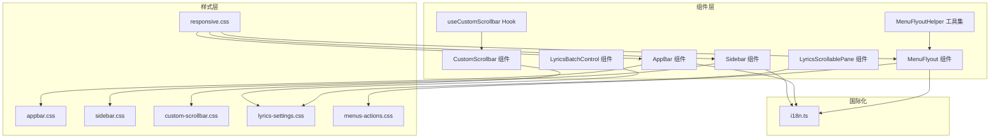
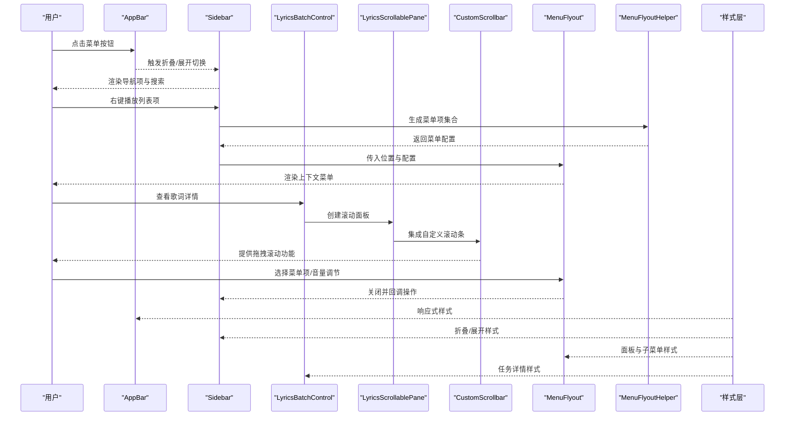
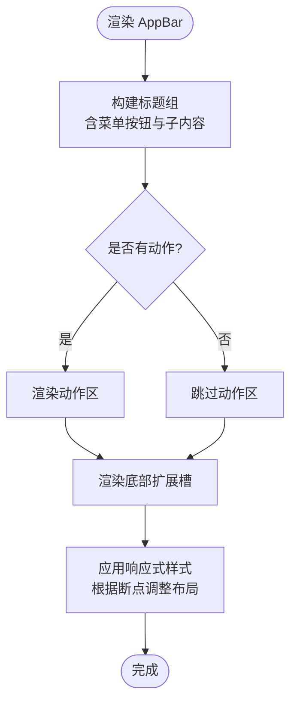
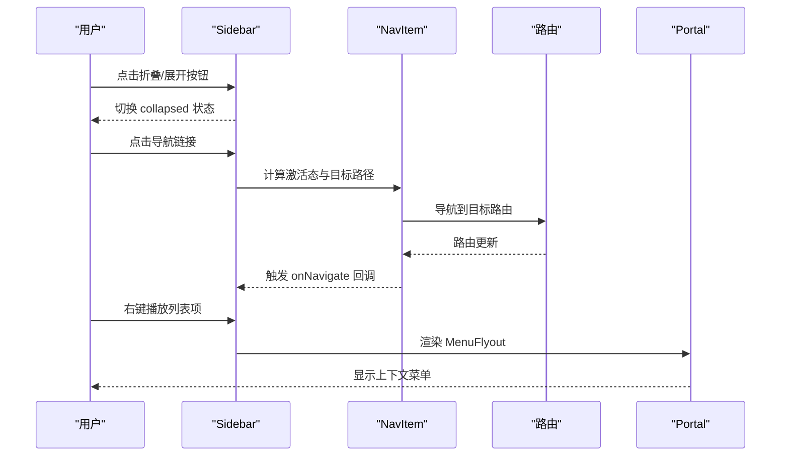
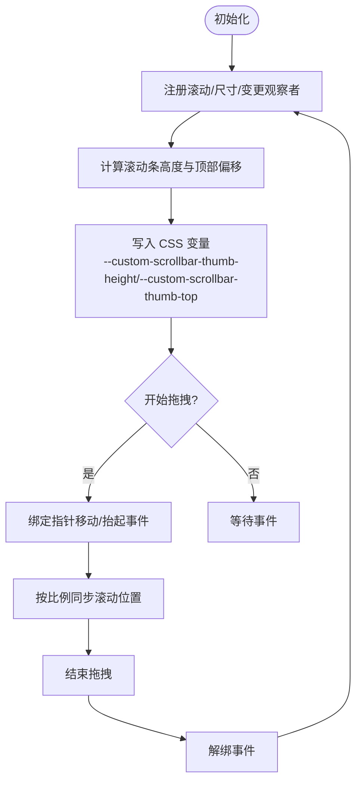
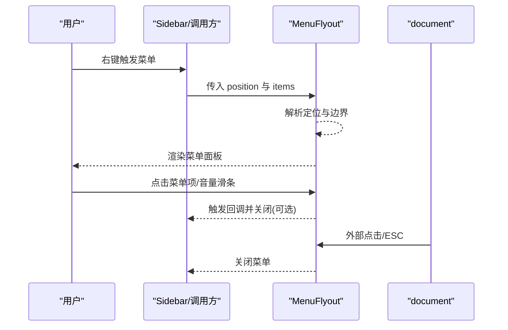
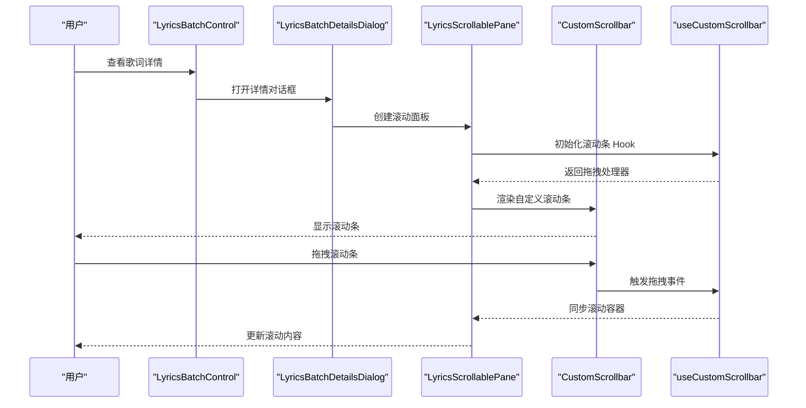
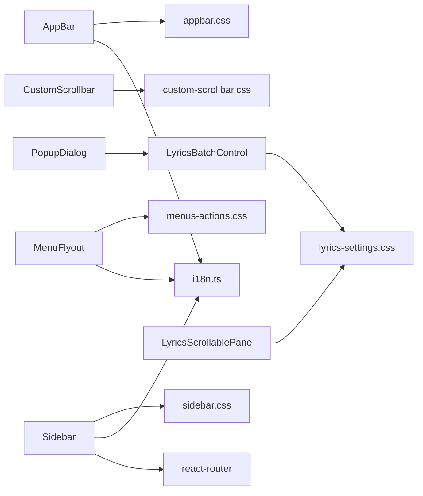

# UI基础组件

<cite>
**本文档引用的文件**
- [AppBar.tsx](file://src/components/AppBar.tsx)
- [Sidebar.tsx](file://src/components/Sidebar.tsx)
- [CustomScrollbar.tsx](file://src/components/CustomScrollbar.tsx)
- [MenuFlyout.tsx](file://src/components/MenuFlyout.tsx)
- [MenuFlyoutHelper.ts](file://src/components/MenuFlyoutHelper.ts)
- [useCustomScrollbar.ts](file://src/hooks/useCustomScrollbar.ts)
- [LyricsBatchControl.tsx](file://src/components/LyricsBatchControl.tsx)
- [appbar.css](file://src/styles/appbar.css)
- [sidebar.css](file://src/styles/sidebar.css)
- [custom-scrollbar.css](file://src/styles/custom-scrollbar.css)
- [lyrics-settings.css](file://src/styles/lyrics-settings.css)
- [menus-actions.css](file://src/styles/menus-actions.css)
- [responsive.css](file://src/styles/responsive.css)
- [i18n.ts](file://src/shared/i18n.ts)
</cite>

## 更新摘要
**变更内容**
- 新增 LyricsBatchControl 中 CustomScrollbar 的具体应用场景和实现细节
- 补充 LyricsScrollablePane 组件的集成模式和样式定制
- 增加歌词详情对话框中滚动条的响应式设计和夜间模式适配
- 完善 CustomScrollbar 在复杂布局中的使用模式和最佳实践

## 目录
1. [简介](#简介)
2. [项目结构](#项目结构)
3. [核心组件](#核心组件)
4. [架构总览](#架构总览)
5. [详细组件分析](#详细组件分析)
6. [依赖关系分析](#依赖关系分析)
7. [性能考量](#性能考量)
8. [故障排查指南](#故障排查指南)
9. [结论](#结论)
10. [附录](#附录)

## 简介
本文件系统化梳理 SMPlayer 的 UI 基础组件，重点覆盖以下方面：
- AppBar 应用栏：布局结构、交互行为与响应式设计
- Sidebar 侧边栏导航：组件架构、菜单项管理、路由集成、折叠展开逻辑
- CustomScrollbar 自定义滚动条：实现原理、样式定制、性能优化、复杂场景集成
- MenuFlyout 菜单飞出：触发机制、定位算法、动画效果
- 可复用性设计、属性接口规范、事件处理模式
- 可访问性支持、国际化适配、主题定制

## 项目结构
UI 基础组件主要分布在 src/components 与 src/hooks 目录，并通过对应的样式文件（src/styles）进行主题与响应式控制。

**图表来源**
- [AppBar.tsx:1-45](file://src/components/AppBar.tsx#L1-L45)
- [Sidebar.tsx:1-538](file://src/components/Sidebar.tsx#L1-L538)
- [CustomScrollbar.tsx:1-16](file://src/components/CustomScrollbar.tsx#L1-L16)
- [MenuFlyout.tsx:1-466](file://src/components/MenuFlyout.tsx#L1-L466)
- [MenuFlyoutHelper.ts:1-608](file://src/components/MenuFlyoutHelper.ts#L1-L608)
- [useCustomScrollbar.ts:1-96](file://src/hooks/useCustomScrollbar.ts#L1-L96)
- [LyricsBatchControl.tsx:1-1008](file://src/components/LyricsBatchControl.tsx#L1-L1008)
- [appbar.css:1-688](file://src/styles/appbar.css#L1-L688)
- [sidebar.css:1-300](file://src/styles/sidebar.css#L1-L300)
- [custom-scrollbar.css:1-63](file://src/styles/custom-scrollbar.css#L1-L63)
- [lyrics-settings.css:1-1427](file://src/styles/lyrics-settings.css#L1-L1427)
- [menus-actions.css:1-433](file://src/styles/menus-actions.css#L1-L433)
- [responsive.css:1-560](file://src/styles/responsive.css#L1-L560)
- [i18n.ts:1-49](file://src/shared/i18n.ts#L1-L49)

**章节来源**
- [AppBar.tsx:1-45](file://src/components/AppBar.tsx#L1-L45)
- [Sidebar.tsx:1-538](file://src/components/Sidebar.tsx#L1-L538)
- [CustomScrollbar.tsx:1-16](file://src/components/CustomScrollbar.tsx#L1-L16)
- [MenuFlyout.tsx:1-466](file://src/components/MenuFlyout.tsx#L1-L466)
- [MenuFlyoutHelper.ts:1-608](file://src/components/MenuFlyoutHelper.ts#L1-L608)
- [useCustomScrollbar.ts:1-96](file://src/hooks/useCustomScrollbar.ts#L1-L96)
- [LyricsBatchControl.tsx:1-1008](file://src/components/LyricsBatchControl.tsx#L1-L1008)
- [appbar.css:1-688](file://src/styles/appbar.css#L1-L688)
- [sidebar.css:1-300](file://src/styles/sidebar.css#L1-L300)
- [custom-scrollbar.css:1-63](file://src/styles/custom-scrollbar.css#L1-L63)
- [lyrics-settings.css:1-1427](file://src/styles/lyrics-settings.css#L1-L1427)
- [menus-actions.css:1-433](file://src/styles/menus-actions.css#L1-L433)
- [responsive.css:1-560](file://src/styles/responsive.css#L1-L560)
- [i18n.ts:1-49](file://src/shared/i18n.ts#L1-L49)

## 核心组件
- AppBar：提供统一的应用栏容器，支持标题区、动作区与底部扩展槽位，内置菜单按钮与可插拔的动作区域。
- Sidebar：侧边导航容器，包含搜索、主/播放列表导航、折叠展开、上下文菜单与重命名对话框等能力。
- CustomScrollbar：轻量级自定义滚动条，提供轨道与拇指的渲染与拖拽滚动逻辑，支持复杂布局集成。
- MenuFlyout：上下文菜单/飞出面板，支持子菜单、音量滑条、键盘与外部点击关闭、边界检测与定位。
- MenuFlyoutHelper：菜单项构建工具集，提供偏好设置、添加到播放列表、随机播放等常用菜单生成器。
- useCustomScrollbar：自定义滚动条 Hook，负责计算滚动条尺寸、位置与拖拽同步滚动，支持多种使用模式。
- LyricsBatchControl：歌词批量处理组件，集成 CustomScrollbar 实现详细的任务结果展示。
- LyricsScrollablePane：歌词滚动面板组件，封装 CustomScrollbar 的使用模式和样式定制。

**章节来源**
- [AppBar.tsx:9-44](file://src/components/AppBar.tsx#L9-L44)
- [Sidebar.tsx:42-537](file://src/components/Sidebar.tsx#L42-L537)
- [CustomScrollbar.tsx:3-15](file://src/components/CustomScrollbar.tsx#L3-L15)
- [MenuFlyout.tsx:10-149](file://src/components/MenuFlyout.tsx#L10-L149)
- [MenuFlyoutHelper.ts:21-608](file://src/components/MenuFlyoutHelper.ts#L21-L608)
- [useCustomScrollbar.ts:11-96](file://src/hooks/useCustomScrollbar.ts#L11-L96)
- [LyricsBatchControl.tsx:197-581](file://src/components/LyricsBatchControl.tsx#L197-L581)
- [LyricsScrollablePane:897-925](file://src/components/LyricsBatchControl.tsx#L897-L925)

## 架构总览
组件间协作关系如下：

**图表来源**
- [AppBar.tsx:18-44](file://src/components/AppBar.tsx#L18-L44)
- [Sidebar.tsx:446-496](file://src/components/Sidebar.tsx#L446-L496)
- [LyricsBatchControl.tsx:583-757](file://src/components/LyricsBatchControl.tsx#L583-L757)
- [LyricsScrollablePane:897-925](file://src/components/LyricsBatchControl.tsx#L897-L925)
- [MenuFlyout.tsx:128-149](file://src/components/MenuFlyout.tsx#L128-L149)
- [MenuFlyoutHelper.ts:232-433](file://src/components/MenuFlyoutHelper.ts#L232-L433)
- [appbar.css:13-28](file://src/styles/appbar.css#L13-L28)
- [sidebar.css:36-81](file://src/styles/sidebar.css#L36-L81)
- [lyrics-settings.css:136-151](file://src/styles/lyrics-settings.css#L136-L151)
- [menus-actions.css:24-41](file://src/styles/menus-actions.css#L24-L41)

## 详细组件分析

### AppBar 应用栏组件
- 设计理念
  - 以"标题组 + 动作区 + 底部扩展槽"三段式布局，满足多页面场景下的统一导航体验。
  - 使用可访问性属性（aria-label/title）与拖拽区域控制（-webkit-app-region），确保跨平台一致性。
- 布局结构
  - 标题组：包含菜单按钮与子内容区，菜单按钮具备无障碍标签与提示。
  - 动作区：右侧可选区域，用于放置命令按钮或状态控件。
  - 底部扩展槽：预留 id，便于页面在底部插入次级工具条。
- 交互行为
  - 菜单按钮点击回调由父组件注入，实现与 Sidebar 的联动。
  - 支持通过 className 扩展样式，配合响应式样式在不同断点下调整布局。
- 响应式设计
  - 在 nav-minimal 模式下，AppBar 缩减高度、隐藏部分元素、使用更小的图标与按钮尺寸。
  - 与页面搜索、沉浸式头部等特性协同，实现紧凑与展开两种模式。

**图表来源**
- [AppBar.tsx:26-44](file://src/components/AppBar.tsx#L26-L44)
- [appbar.css:13-28](file://src/styles/appbar.css#L13-L28)
- [responsive.css:298-311](file://src/styles/responsive.css#L298-L311)

**章节来源**
- [AppBar.tsx:9-44](file://src/components/AppBar.tsx#L9-L44)
- [appbar.css:1-688](file://src/styles/appbar.css#L1-L688)
- [responsive.css:1-560](file://src/styles/responsive.css#L1-L560)

### Sidebar 侧边栏导航
- 组件架构
  - 外层 aside 容器承载标题栏、折叠按钮、搜索、导航区与页脚。
  - 内部通过 NavItem 子组件实现导航链接，支持激活态与精确匹配。
  - 播放列表导航支持展开/折叠、创建、随机播放、拖拽重排与右键菜单。
- 菜单项管理
  - 主要导航与播放列表导航分别维护固定集合，支持国际化文本与图标。
  - 播放列表项支持拖拽排序，通过拖拽状态与指示器反馈视觉结果。
- 路由集成
  - 使用 react-router 的 useNavigate/useLocation，结合 flushSync 确保导航与 UI 同步。
  - 支持恢复目标路径（getRestoredNavTarget），保证折叠后也能正确跳转。
- 折叠展开逻辑
  - collapsed 状态控制整体宽度、文本显示与滚动条行为。
  - 折叠时通过 Portal 渲染浮动提示，避免遮挡内容。
  - 展开后自动聚焦搜索输入框，提升可用性。

**图表来源**
- [Sidebar.tsx:216-496](file://src/components/Sidebar.tsx#L216-L496)
- [Sidebar.tsx:499-537](file://src/components/Sidebar.tsx#L499-L537)
- [sidebar.css:36-81](file://src/styles/sidebar.css#L36-L81)

**章节来源**
- [Sidebar.tsx:1-538](file://src/components/Sidebar.tsx#L1-L538)
- [sidebar.css:1-300](file://src/styles/sidebar.css#L1-L300)

### CustomScrollbar 自定义滚动条
- 实现原理
  - 通过 useCustomScrollbar Hook 计算滚动条高度与顶部偏移，动态更新 CSS 变量。
  - 拖拽时监听指针移动，按比例换算滚动位置，实现平滑滚动。
- 样式定制
  - 采用绝对定位的轨道与拇指，悬停/聚焦/拖拽时显示与高亮。
  - 支持夜间模式颜色变量，确保在深色主题下可见性良好。
- 性能优化
  - 使用 requestAnimationFrame 与 ResizeObserver/MutationObserver 降低重绘频率。
  - 滚动事件使用 passive 监听，减少主线程阻塞。
- 复杂场景集成
  - 在 LyricsBatchControl 中作为独立组件使用，提供精确的拖拽控制。
  - 支持多种容器组合模式，包括对话框、列表视图、对比面板等。
  - 通过 className 属性实现样式扩展，适应不同的布局需求。

**图表来源**
- [useCustomScrollbar.ts:18-62](file://src/hooks/useCustomScrollbar.ts#L18-L62)
- [useCustomScrollbar.ts:64-95](file://src/hooks/useCustomScrollbar.ts#L64-L95)
- [custom-scrollbar.css:16-63](file://src/styles/custom-scrollbar.css#L16-L63)

**章节来源**
- [CustomScrollbar.tsx:1-16](file://src/components/CustomScrollbar.tsx#L1-L16)
- [useCustomScrollbar.ts:1-96](file://src/hooks/useCustomScrollbar.ts#L1-L96)
- [custom-scrollbar.css:1-63](file://src/styles/custom-scrollbar.css#L1-L63)

### MenuFlyout 菜单飞出
- 触发机制
  - 通过 position 参数（坐标或锚点元素）决定初始位置；支持锚点失效时自动关闭。
  - 支持外部点击与 ESC 键关闭，确保无挂起状态。
- 定位算法
  - 先按请求坐标定位，再根据可视边界（含播放器区域）微调，避免溢出。
  - 子菜单按触发元素右侧/左侧优先策略布局，必要时回退到另一侧。
- 动画效果
  - 使用 requestAnimationFrame 调度更新，保证定位与滚动事件的流畅性。
  - 子菜单面板在 hover/focus 时渐显，支持可滚动面板与滚动条样式。
- 事件处理
  - 菜单项点击后可选择保持打开或自动关闭；异步操作会显示忙态。
  - 音量滑条支持按下/移动/抬起的完整生命周期，带延迟提示与进度指示。

**图表来源**
- [MenuFlyout.tsx:10-149](file://src/components/MenuFlyout.tsx#L10-L149)
- [MenuFlyout.tsx:151-266](file://src/components/MenuFlyout.tsx#L151-L266)
- [MenuFlyout.tsx:420-454](file://src/components/MenuFlyout.tsx#L420-L454)
- [menus-actions.css:24-41](file://src/styles/menus-actions.css#L24-L41)

**章节来源**
- [MenuFlyout.tsx:1-466](file://src/components/MenuFlyout.tsx#L1-L466)
- [MenuFlyoutHelper.ts:1-608](file://src/components/MenuFlyoutHelper.ts#L1-L608)
- [menus-actions.css:1-433](file://src/styles/menus-actions.css#L1-L433)

### LyricsBatchControl 中的 CustomScrollbar 集成
- 应用场景概述
  - 在歌词批量处理任务的详情对话框中，为长列表提供自定义滚动条。
  - 支持不同分组的展开/折叠，每个分组内部都有独立的滚动条。
  - 实现歌词对比面板的左右滚动同步，提升用户体验。
- LyricsScrollablePane 组件
  - 封装了 CustomScrollbar 的完整使用模式，提供统一的滚动面板接口。
  - 支持 className 参数，允许在不同上下文中应用不同的样式变体。
  - 内部使用 useCustomScrollbar Hook，自动处理滚动容器与轨道的关联。
- 详细对话框集成
  - 在 LyricsBatchDetailsDialog 中，使用三层嵌套结构：外层框架 -> 滚动容器 -> 自定义滚动条。
  - 通过 useRef 引用管理三个关键元素：scrollFrameRef、scrollContainerRef、scrollbarTrackRef。
  - 使用 refreshDependencies 依赖数组，确保当分组详情变化时滚动条能够重新计算。
- 样式定制与响应式设计
  - lyrics-detail-dialog-scrollbar 类提供精确的位置和尺寸控制。
  - 支持响应式布局，在移动端自动调整滚动条位置和尺寸。
  - 夜间模式下提供完整的颜色适配，确保在深色主题下的可读性。
- 性能优化策略
  - 使用 requestAnimationFrame 调度滚动条更新，避免频繁重绘。
  - 通过 ResizeObserver 和 MutationObserver 监听容器变化，智能更新滚动条状态。
  - 支持被动事件监听，减少主线程阻塞。

**图表来源**
- [LyricsBatchControl.tsx:583-757](file://src/components/LyricsBatchControl.tsx#L583-L757)
- [LyricsBatchControl.tsx:897-925](file://src/components/LyricsBatchControl.tsx#L897-L925)
- [LyricsBatchControl.tsx:613-618](file://src/components/LyricsBatchControl.tsx#L613-L618)
- [lyrics-settings.css:136-151](file://src/styles/lyrics-settings.css#L136-L151)

**章节来源**
- [LyricsBatchControl.tsx:1-1008](file://src/components/LyricsBatchControl.tsx#L1-L1008)
- [lyrics-settings.css:1-1427](file://src/styles/lyrics-settings.css#L1-L1427)

## 依赖关系分析
- 组件内聚与耦合
  - AppBar 与 Sidebar 通过 AppBar 的菜单按钮建立弱耦合，Sidebar 控制折叠状态。
  - MenuFlyout 与 MenuFlyoutHelper 解耦，前者专注渲染与定位，后者专注数据生成。
  - CustomScrollbar 与 useCustomScrollbar 形成"展示组件 + 行为 Hook"的清晰分层。
  - LyricsBatchControl 通过 LyricsScrollablePane 间接使用 CustomScrollbar，实现松耦合集成。
- 外部依赖
  - 国际化：i18n.ts 提供翻译函数，组件通过 t 或 createTranslator 获取本地化文本。
  - 样式：各组件样式独立且受 responsive.css 影响，形成一致的主题与断点行为。
  - 路由：Sidebar 依赖 react-router 进行导航与状态同步。
  - 对话框：LyricsBatchControl 依赖 PopupDialog 实现模态对话框功能。

**图表来源**
- [i18n.ts:29-37](file://src/shared/i18n.ts#L29-L37)
- [responsive.css:1-560](file://src/styles/responsive.css#L1-L560)

**章节来源**
- [i18n.ts:1-49](file://src/shared/i18n.ts#L1-L49)
- [responsive.css:1-560](file://src/styles/responsive.css#L1-L560)

## 性能考量
- 指针与滚动事件
  - useCustomScrollbar 对滚动事件使用被动监听，拖拽时仅在窗口级别绑定移动/抬起事件，避免频繁重排。
  - LyricsBatchControl 中的滚动条使用 refreshDependencies 优化更新频率，只在必要时重新计算。
- 定位与布局
  - MenuFlyout 使用 requestAnimationFrame 调度定位更新，减少布局抖动。
  - 子菜单面板按需渲染，hover/focus 时才显示，降低 DOM 负担。
- 样式与主题
  - CSS 变量驱动滚动条尺寸与位置，减少 JS 计算成本。
  - 夜间模式通过 CSS 变量切换，避免运行时样式重算。
  - LyricsBatchControl 中的滚动条使用 CSS 变量实现动态尺寸计算。

## 故障排查指南
- 菜单无法关闭
  - 检查是否正确传入 onClose 并在点击菜单项后调用；确认外部点击与 ESC 监听是否生效。
- 滚动条不显示或不滚动
  - 确认 useCustomScrollbar 的容器与滚动容器引用正确；检查 CSS 变量是否被覆盖。
  - 在 LyricsBatchControl 中，检查 refreshDependencies 是否包含必要的依赖项。
- 折叠状态下搜索不可用
  - 确认 collapsed 状态切换后是否触发了搜索输入框的聚焦逻辑。
- 国际化文本未生效
  - 检查 createTranslator 的语言解析与字典加载；确认 key 是否存在于字典中。
- 歌词详情对话框滚动异常
  - 检查 LyricsScrollablePane 的 className 设置是否正确。
  - 确认 useRef 引用的三个元素（frame、container、track）都已正确初始化。
  - 验证 useCustomScrollbar Hook 的依赖数组是否包含所有必要的状态变化。

**章节来源**
- [MenuFlyout.tsx:101-126](file://src/components/MenuFlyout.tsx#L101-L126)
- [useCustomScrollbar.ts:18-62](file://src/hooks/useCustomScrollbar.ts#L18-L62)
- [Sidebar.tsx:111-120](file://src/components/Sidebar.tsx#L111-L120)
- [i18n.ts:29-37](file://src/shared/i18n.ts#L29-L37)
- [LyricsBatchControl.tsx:613-618](file://src/components/LyricsBatchControl.tsx#L613-L618)

## 结论
SMPlayer 的 UI 基础组件围绕"可复用、可扩展、可访问、可主题化"的目标设计，通过清晰的职责划分与样式/Hook 分离，实现了良好的开发体验与用户体验。AppBar、Sidebar、CustomScrollbar、MenuFlyout 及其配套工具共同构成了稳定的基础层，为上层页面与功能模块提供了可靠支撑。

LyricsBatchControl 中 CustomScrollbar 的集成展示了该组件在复杂场景下的强大适应性，通过 LyricsScrollablePane 的封装，实现了从简单到复杂的多种使用模式。这种设计既保持了组件的可复用性，又提供了足够的灵活性来满足特定场景的需求。

## 附录
- 可复用性设计要点
  - 将 UI 与行为分离（如 CustomScrollbar 与 useCustomScrollbar），便于在不同容器中复用。
  - 通过 props 接口传递行为（如 onMenuClick/onSearchCommit），降低对具体业务的耦合。
  - LyricsScrollablePane 展示了如何通过封装实现更高级别的组件复用。
- 属性接口规范（示例）
  - AppBar：menuLabel/menuTitle/onMenuClick/actions/children/className
  - Sidebar：t/collapsed/appName/playlists/searchQuery/recentSearches/各类回调
  - MenuFlyout：items/position/onClose/layer
  - CustomScrollbar：className/scrollbarTrackRef/onThumbPointerDown
  - LyricsScrollablePane：className/children
  - LyricsBatchControl：t/snapshot/onUpdateSettings
- 事件处理模式
  - 统一使用 onXxx 回调与 Portal 渲染，确保事件冒泡与边界处理一致。
  - LyricsBatchControl 中的滚动条事件通过 useCustomScrollbar Hook 统一管理。
- 可访问性与国际化
  - 使用 aria-* 属性与 title 文本；通过 i18n.ts 提供翻译函数，确保多语言环境一致体验。
  - CustomScrollbar 使用 aria-hidden="true" 标记，避免影响屏幕阅读器。
- 主题与响应式
  - 通过 CSS 变量与媒体查询实现主题切换与断点适配，保证在不同设备与模式下的一致表现。
  - LyricsBatchControl 中的滚动条支持夜间模式，提供完整的颜色适配方案。
- 复杂场景集成最佳实践
  - 使用 useRef 管理 DOM 引用，确保在多个组件间共享状态。
  - 通过 refreshDependencies 优化性能，避免不必要的重新计算。
  - 采用 CSS 变量实现动态样式，减少 JavaScript 的样式计算负担。