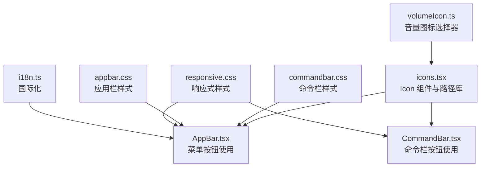
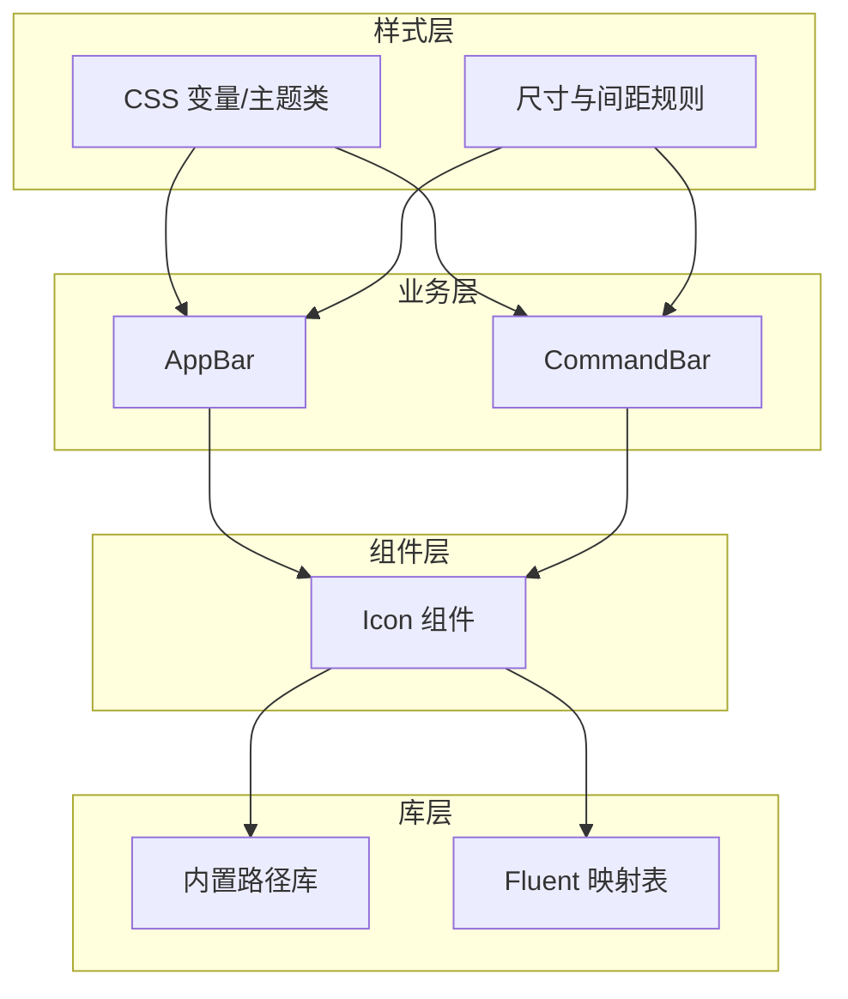
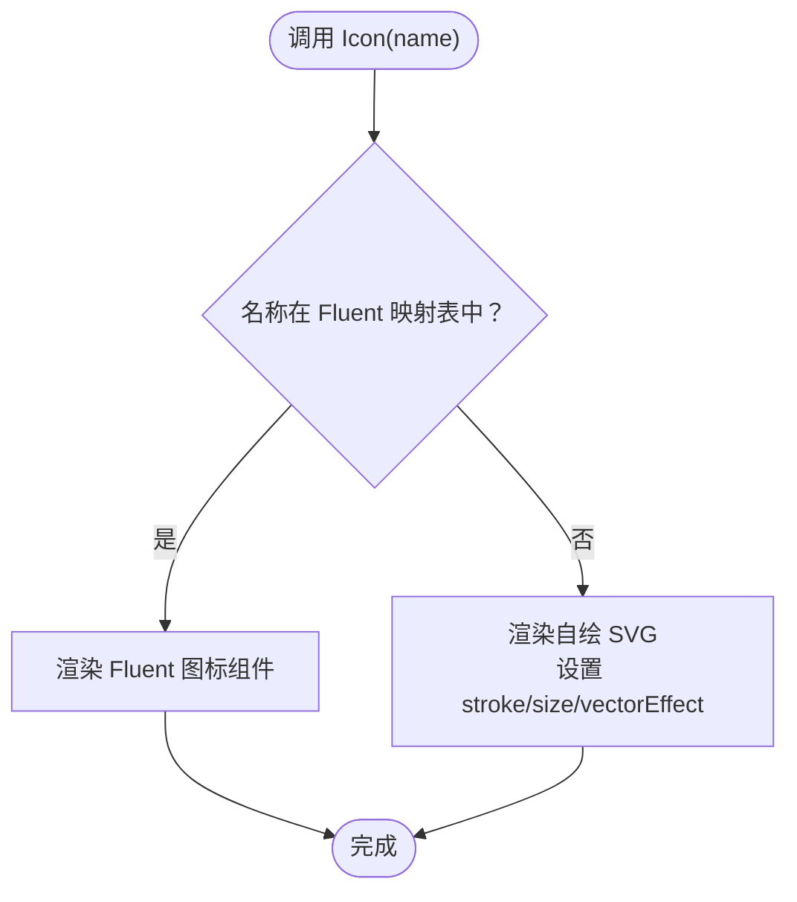
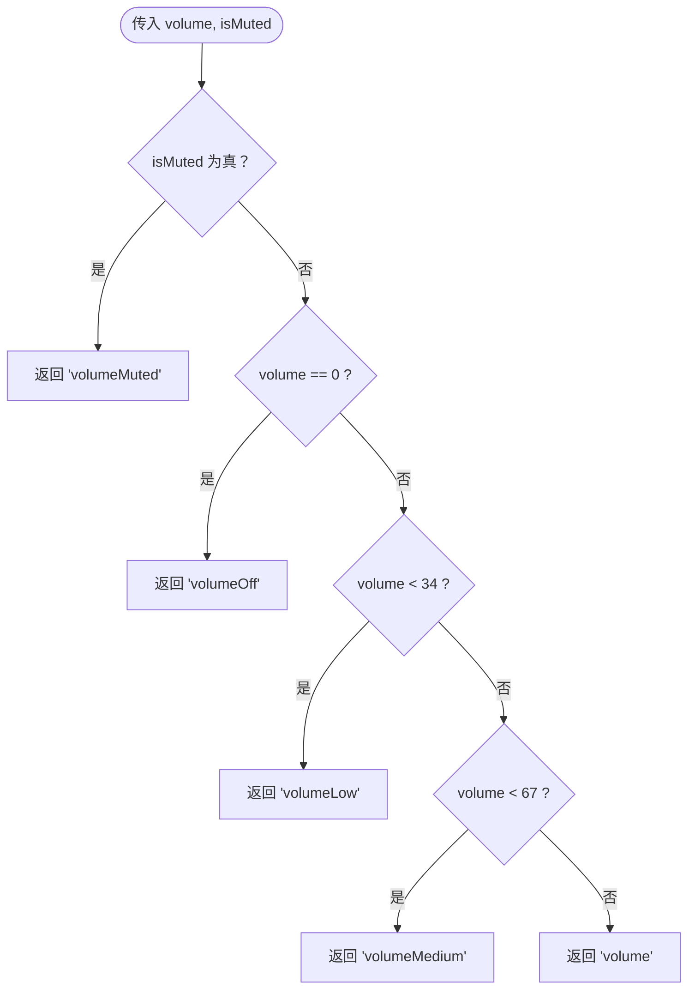
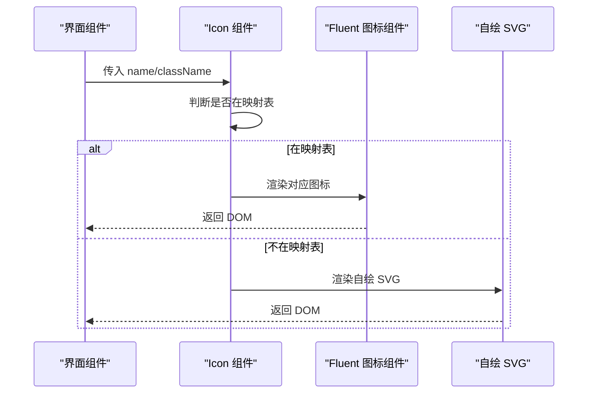
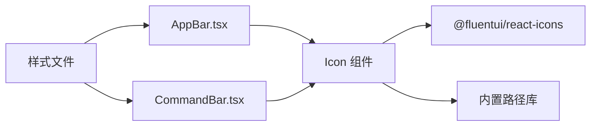

# 图标系统

<cite>
**本文档引用的文件**
- [icons.tsx](file://src/components/icons.tsx)
- [volumeIcon.ts](file://src/components/volumeIcon.ts)
- [AppBar.tsx](file://src/components/AppBar.tsx)
- [CommandBar.tsx](file://src/components/CommandBar.tsx)
- [commandbar.css](file://src/styles/commandbar.css)
- [appbar.css](file://src/styles/appbar.css)
- [responsive.css](file://src/styles/responsive.css)
- [i18n.ts](file://src/shared/i18n.ts)
</cite>

## 目录
1. [简介](#简介)
2. [项目结构](#项目结构)
3. [核心组件](#核心组件)
4. [架构总览](#架构总览)
5. [详细组件分析](#详细组件分析)
6. [依赖关系分析](#依赖关系分析)
7. [性能考虑](#性能考虑)
8. [可访问性指南](#可访问性指南)
9. [国际化与响应式适配](#国际化与响应式适配)
10. [结论](#结论)

## 简介
本文件系统性梳理 SMPlayer 的图标系统，围绕 src/components/icons.tsx 中的 Icon 组件展开，解释其架构设计（图标库组织、按需加载、SVG 优化）、使用方式（内联图标、外部图标资源、动态图标生成）、样式定制（颜色主题、尺寸调整、动画效果）、性能优化（SVG 压缩、缓存机制、懒加载）、可访问性支持（ARIA 标签、替代文本、键盘导航），以及国际化、响应式设计与主题切换的最佳实践。

## 项目结构
图标系统主要由以下部分组成：
- 图标组件与库：src/components/icons.tsx 提供 Icon 组件与内置 SVG 路径库，并映射到 Fluent UI 图标库。
- 动态图标选择：src/components/volumeIcon.ts 提供根据状态动态选择图标的逻辑。
- 使用示例：src/components/AppBar.tsx 与 src/components/CommandBar.tsx 展示如何在界面中使用 Icon。
- 样式与主题：src/styles/commandbar.css、src/styles/appbar.css、src/styles/responsive.css 定义图标按钮的尺寸、颜色与响应式行为。
- 国际化：src/shared/i18n.ts 提供翻译能力，用于图标按钮的标题与标签文案。

**图表来源**
- [icons.tsx:446-486](file://src/components/icons.tsx#L446-L486)
- [volumeIcon.ts:1-22](file://src/components/volumeIcon.ts#L1-L22)
- [AppBar.tsx:18-44](file://src/components/AppBar.tsx#L18-L44)
- [CommandBar.tsx:1-200](file://src/components/CommandBar.tsx#L1-L200)
- [commandbar.css:1-219](file://src/styles/commandbar.css#L1-L219)
- [appbar.css:1-688](file://src/styles/appbar.css#L1-L688)
- [responsive.css:1-560](file://src/styles/responsive.css#L1-L560)
- [i18n.ts:1-49](file://src/shared/i18n.ts#L1-L49)

**章节来源**
- [icons.tsx:1-487](file://src/components/icons.tsx#L1-L487)
- [volumeIcon.ts:1-22](file://src/components/volumeIcon.ts#L1-L22)
- [AppBar.tsx:1-45](file://src/components/AppBar.tsx#L1-L45)
- [CommandBar.tsx:1-200](file://src/components/CommandBar.tsx#L1-L200)
- [commandbar.css:1-219](file://src/styles/commandbar.css#L1-L219)
- [appbar.css:1-688](file://src/styles/appbar.css#L1-L688)
- [responsive.css:1-560](file://src/styles/responsive.css#L1-L560)
- [i18n.ts:1-49](file://src/shared/i18n.ts#L1-L49)

## 核心组件
- Icon 组件：统一入口，负责根据名称选择使用 Fluent UI 内置图标或自绘 SVG。
- 内置路径库：以键值对形式存储自绘 SVG 路径集合，覆盖播放控制、媒体操作、界面交互等常用图标。
- Fluent 映射表：将内置名称映射到 @fluentui/react-icons 的具体图标组件，实现按需加载与一致风格。
- 动态图标选择器：根据运行时状态（如音量级别、静音状态）选择合适的图标名称。

**章节来源**
- [icons.tsx:59-386](file://src/components/icons.tsx#L59-L386)
- [icons.tsx:390-444](file://src/components/icons.tsx#L390-L444)
- [icons.tsx:446-486](file://src/components/icons.tsx#L446-L486)
- [volumeIcon.ts:1-22](file://src/components/volumeIcon.ts#L1-L22)

## 架构总览
图标系统采用“组件 + 库 + 映射 + 样式”的分层架构：
- 组件层：Icon 接收名称与类名，内部判断是否使用 Fluent 图标或自绘 SVG。
- 库层：内置路径库集中管理所有自绘 SVG；Fluent 映射表集中管理外部图标资源。
- 样式层：通过 CSS 变量与主题类控制颜色、尺寸、悬停与焦点状态。
- 业务层：CommandBar、AppBar 等组件通过 Icon 渲染图标按钮，结合 i18n 提供可读性更强的标题与标签。

**图表来源**
- [icons.tsx:446-486](file://src/components/icons.tsx#L446-L486)
- [icons.tsx:59-386](file://src/components/icons.tsx#L59-L386)
- [icons.tsx:390-444](file://src/components/icons.tsx#L390-L444)
- [appbar.css:94-125](file://src/styles/appbar.css#L94-L125)
- [commandbar.css:134-147](file://src/styles/commandbar.css#L134-L147)
- [AppBar.tsx:18-44](file://src/components/AppBar.tsx#L18-L44)
- [CommandBar.tsx:1-200](file://src/components/CommandBar.tsx#L1-L200)

## 详细组件分析

### Icon 组件与图标库
- 按需加载机制：当名称存在于 Fluent 映射表时，直接渲染对应 Fluent 图标组件；否则回退到自绘 SVG。
- 自绘 SVG 优化：统一设置 viewBox、stroke、strokeLinecap、strokeLinejoin、vectorEffect 等属性，确保缩放与渲染一致性。
- 名称到组件映射：通过映射表将语义化名称（如 "play"、"pause"、"menu"）映射到 Fluent UI 对应图标组件，便于维护与替换。
- 内置路径库：以键值对形式存储 SVG 路径数组，覆盖播放控制、媒体操作、界面交互、用户反馈等场景。

**图表来源**
- [icons.tsx:446-486](file://src/components/icons.tsx#L446-L486)
- [icons.tsx:390-444](file://src/components/icons.tsx#L390-L444)
- [icons.tsx:59-386](file://src/components/icons.tsx#L59-L386)

**章节来源**
- [icons.tsx:446-486](file://src/components/icons.tsx#L446-L486)
- [icons.tsx:390-444](file://src/components/icons.tsx#L390-L444)
- [icons.tsx:59-386](file://src/components/icons.tsx#L59-L386)

### 动态图标生成（音量图标）
- getVolumeIconName：根据音量阈值与静音状态返回对应的图标名称，实现音量变化的可视化反馈。
- 典型用法：在媒体控制区域根据当前音量状态动态选择图标，提升交互直观性。

**图表来源**
- [volumeIcon.ts:1-22](file://src/components/volumeIcon.ts#L1-L22)

**章节来源**
- [volumeIcon.ts:1-22](file://src/components/volumeIcon.ts#L1-L22)

### 使用方式与集成点
- 内联图标：在 AppBar 中使用 Icon 渲染菜单按钮，配合 aria-label/title 提升可访问性。
- 外部图标资源：通过 Fluent 映射表引入 @fluentui/react-icons，保持一致的视觉风格与体积控制。
- 动态图标生成：在 CommandBar 或媒体控制区根据状态选择图标名称，减少重复定义。

**图表来源**
- [icons.tsx:446-486](file://src/components/icons.tsx#L446-L486)
- [AppBar.tsx:18-44](file://src/components/AppBar.tsx#L18-L44)
- [CommandBar.tsx:1-200](file://src/components/CommandBar.tsx#L1-L200)

**章节来源**
- [AppBar.tsx:18-44](file://src/components/AppBar.tsx#L18-L44)
- [CommandBar.tsx:1-200](file://src/components/CommandBar.tsx#L1-L200)
- [icons.tsx:446-486](file://src/components/icons.tsx#L446-L486)

## 依赖关系分析
- 组件耦合：AppBar 与 CommandBar 仅依赖 Icon 类型与名称，不直接依赖具体图标实现，降低耦合度。
- 外部依赖：@fluentui/react-icons 作为图标资源库，通过映射表集中管理，便于升级与替换。
- 样式依赖：图标按钮的尺寸、颜色、状态通过 CSS 控制，与业务组件解耦。

**图表来源**
- [icons.tsx:446-486](file://src/components/icons.tsx#L446-L486)
- [AppBar.tsx:18-44](file://src/components/AppBar.tsx#L18-L44)
- [CommandBar.tsx:1-200](file://src/components/CommandBar.tsx#L1-L200)
- [commandbar.css:134-147](file://src/styles/commandbar.css#L134-L147)
- [appbar.css:94-125](file://src/styles/appbar.css#L94-L125)

**章节来源**
- [icons.tsx:446-486](file://src/components/icons.tsx#L446-L486)
- [AppBar.tsx:18-44](file://src/components/AppBar.tsx#L18-L44)
- [CommandBar.tsx:1-200](file://src/components/CommandBar.tsx#L1-L200)
- [commandbar.css:134-147](file://src/styles/commandbar.css#L134-L147)
- [appbar.css:94-125](file://src/styles/appbar.css#L94-L125)

## 性能考虑
- SVG 压缩与渲染优化：统一设置 vectorEffect="non-scaling-stroke"、strokeLinecap/Join 等，减少重排与重绘开销。
- 按需加载：通过 Fluent 映射表按名称加载图标组件，避免一次性引入全部图标资源。
- 缓存机制：Icon 组件复用同一实例，减少重复创建；Fluent 图标组件由框架缓存。
- 懒加载：在需要时才渲染图标，避免首屏阻塞。
- 尺寸控制：通过 CSS 控制图标尺寸，避免在 SVG 层面进行复杂变换。

**章节来源**
- [icons.tsx:446-486](file://src/components/icons.tsx#L446-L486)
- [icons.tsx:390-444](file://src/components/icons.tsx#L390-L444)
- [icons.tsx:59-386](file://src/components/icons.tsx#L59-L386)

## 可访问性指南
- ARIA 标签：Icon 默认设置 aria-hidden="true"、focusable="false"，避免屏幕阅读器误读。
- 替代文本：在按钮容器上使用 aria-label/title 提供可读性更强的描述（例如 AppBar 中的菜单按钮）。
- 键盘导航：按钮组件具备 tabindex 与 :focus-visible 样式，确保键盘可达性。
- 状态表达：通过 aria-expanded 等属性表达下拉菜单或溢出菜单的展开状态。

**章节来源**
- [icons.tsx:446-486](file://src/components/icons.tsx#L446-L486)
- [AppBar.tsx:29-36](file://src/components/AppBar.tsx#L29-L36)
- [commandbar.css:107-122](file://src/styles/commandbar.css#L107-L122)
- [appbar.css:111-120](file://src/styles/appbar.css#L111-L120)

## 国际化与响应式适配
- 国际化：通过 i18n.ts 提供翻译函数，可在图标按钮的 title/aria-label 中使用翻译结果，实现多语言支持。
- 响应式设计：responsive.css 针对不同断点调整命令栏与应用栏的布局、按钮尺寸与间距，保证在小屏设备上的可用性。
- 主题切换：night-mode 等主题类通过 CSS 变量控制图标颜色与背景，确保在深色模式下的对比度与可读性。

**章节来源**
- [i18n.ts:1-49](file://src/shared/i18n.ts#L1-L49)
- [responsive.css:1-560](file://src/styles/responsive.css#L1-L560)
- [appbar.css:190-219](file://src/styles/appbar.css#L190-L219)
- [commandbar.css:190-219](file://src/styles/commandbar.css#L190-L219)

## 结论
SMPlayer 的图标系统通过 Icon 组件实现了“内置 SVG + Fluent 图标”的双轨方案，既保证了自定义能力，又借助 Fluent UI 实现了高质量与一致性。配合样式层的主题与响应式规则，图标在不同设备与主题下均能保持良好的可访问性与性能表现。建议在新增图标时遵循现有命名规范与映射策略，确保可维护性与扩展性。