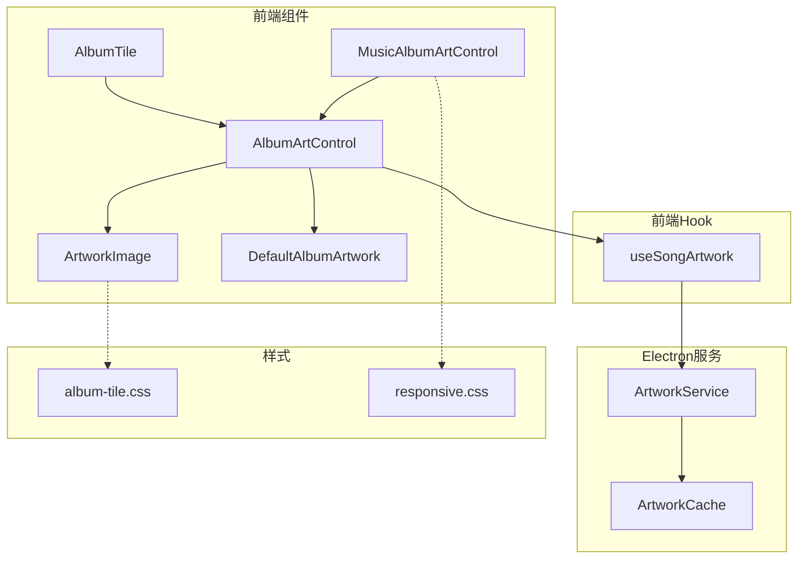
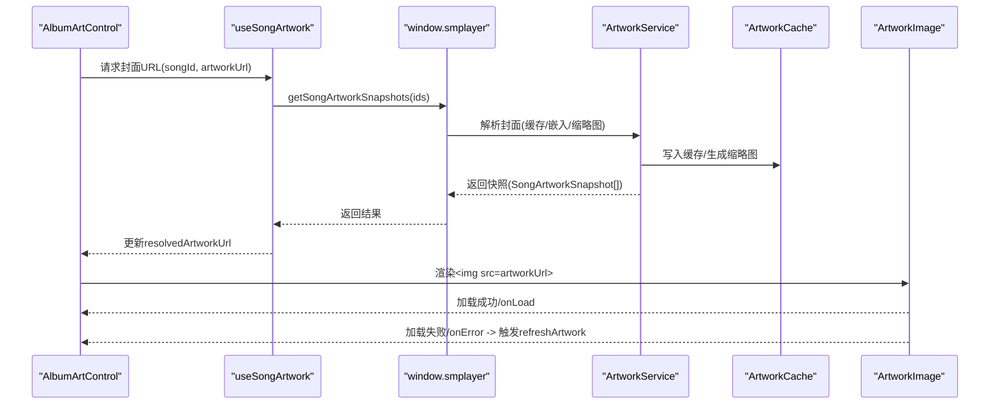
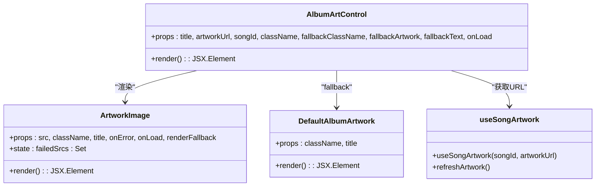
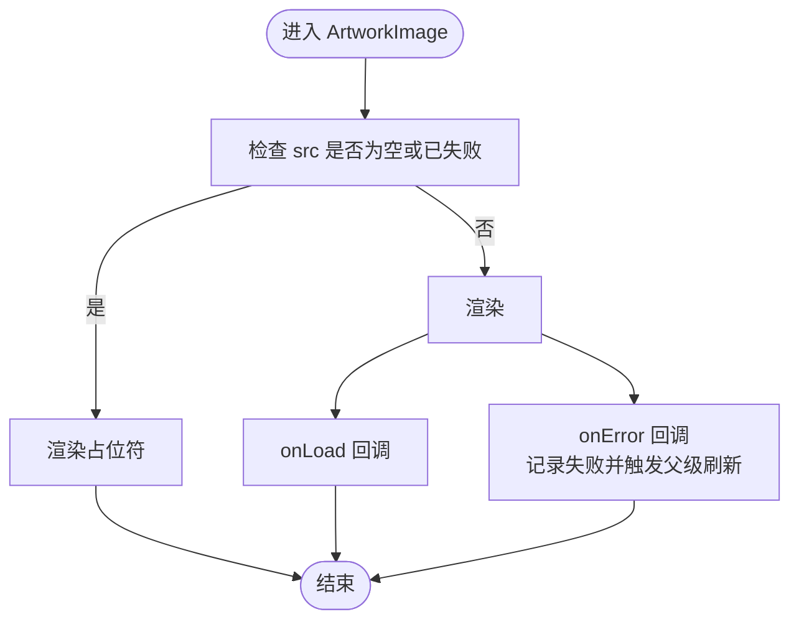
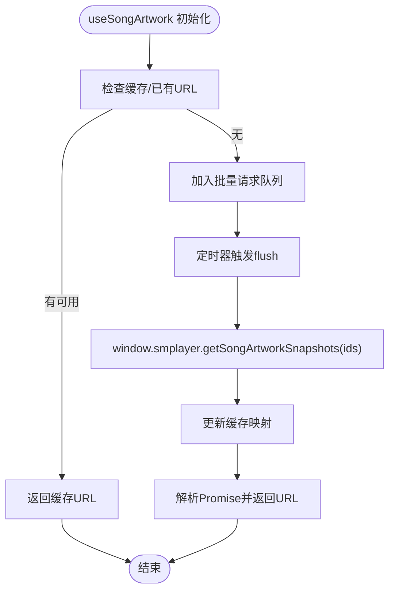
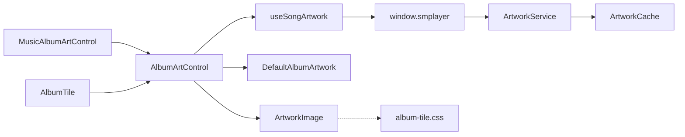

# 专辑封面组件

<cite>
**本文档引用的文件**
- [AlbumArtControl.tsx](file://src/components/AlbumArtControl.tsx)
- [ArtworkImage.tsx](file://src/components/ArtworkImage.tsx)
- [DefaultAlbumArtwork.tsx](file://src/components/DefaultAlbumArtwork.tsx)
- [useSongArtwork.ts](file://src/hooks/useSongArtwork.ts)
- [artwork-service.ts](file://electron/services/artwork-service.ts)
- [artwork-cache.ts](file://electron/services/artwork-cache.ts)
- [contracts.ts](file://src/shared/contracts.ts)
- [album-tile.css](file://src/styles/album-tile.css)
- [responsive.css](file://src/styles/responsive.css)
- [MusicAlbumArtControl.tsx](file://src/components/MusicAlbumArtControl.tsx)
- [AlbumTile.tsx](file://src/components/AlbumTile.tsx)
- [staticAssets.ts](file://src/shared/staticAssets.ts)
</cite>

## 目录
1. [简介](#简介)
2. [项目结构](#项目结构)
3. [核心组件](#核心组件)
4. [架构总览](#架构总览)
5. [详细组件分析](#详细组件分析)
6. [依赖关系分析](#依赖关系分析)
7. [性能考量](#性能考量)
8. [故障排除指南](#故障排除指南)
9. [结论](#结论)
10. [附录](#附录)

## 简介
本文件针对 SMPlayer 的专辑封面组件进行系统化文档化，重点覆盖以下方面：
- 组件架构与职责划分：AlbumArtControl、ArtworkImage、DefaultAlbumArtwork 及其协作关系
- 图片加载与缓存策略：前端 Hook 缓存、批量请求、Electron 后端缓存与格式转换
- 占位符与错误边界：失败回退、推荐占位、加载状态管理
- 尺寸适配与响应式设计：CSS 布局、媒体查询、对象填充策略
- 性能优化：懒加载、并发控制、内存与磁盘缓存清理
- 图片格式支持与压缩：扩展名识别、格式推断、缩略图生成

## 项目结构
专辑封面相关代码主要分布在以下位置：
- 前端组件层：AlbumArtControl、ArtworkImage、DefaultAlbumArtwork、MusicAlbumArtControl、AlbumTile
- 前端 Hook 层：useSongArtwork（缓存、批量请求、刷新）
- Electron 服务层：artwork-service（封面解析、来源选择）、artwork-cache（写入缓存、清理）
- 样式层：album-tile.css、responsive.css
- 类型契约：contracts.ts 中的 SongArtworkSnapshot、SongArtworkSource

图表来源
- [AlbumArtControl.tsx:18-36](file://src/components/AlbumArtControl.tsx#L18-L36)
- [ArtworkImage.tsx:13-32](file://src/components/ArtworkImage.tsx#L13-L32)
- [DefaultAlbumArtwork.tsx:9-15](file://src/components/DefaultAlbumArtwork.tsx#L9-L15)
- [useSongArtwork.ts:164-203](file://src/hooks/useSongArtwork.ts#L164-L203)
- [artwork-service.ts:25-34](file://electron/services/artwork-service.ts#L25-L34)
- [artwork-cache.ts:10-27](file://electron/services/artwork-cache.ts#L10-L27)
- [album-tile.css:129-152](file://src/styles/album-tile.css#L129-L152)
- [responsive.css:1-560](file://src/styles/responsive.css#L1-L560)

章节来源
- [AlbumArtControl.tsx:1-37](file://src/components/AlbumArtControl.tsx#L1-L37)
- [ArtworkImage.tsx:1-33](file://src/components/ArtworkImage.tsx#L1-L33)
- [DefaultAlbumArtwork.tsx:1-16](file://src/components/DefaultAlbumArtwork.tsx#L1-L16)
- [useSongArtwork.ts:1-204](file://src/hooks/useSongArtwork.ts#L1-L204)
- [artwork-service.ts:1-340](file://electron/services/artwork-service.ts#L1-L340)
- [artwork-cache.ts:1-125](file://electron/services/artwork-cache.ts#L1-L125)
- [contracts.ts:51-59](file://src/shared/contracts.ts#L51-L59)
- [album-tile.css:129-152](file://src/styles/album-tile.css#L129-L152)
- [responsive.css:1-560](file://src/styles/responsive.css#L1-L560)

## 核心组件
- AlbumArtControl：组合型组件，负责接收标题、封面 URL、歌曲 ID，并通过 useSongArtwork 获取有效封面 URL，再交由 ArtworkImage 渲染。支持错误时自动刷新、自定义类名、占位符渲染。
- ArtworkImage：基础图片组件，维护失败源集合，避免重复尝试；在 onError 时记录失败并触发父级刷新；支持自定义占位符渲染。
- DefaultAlbumArtwork：默认专辑封面图标组件，从静态资源中读取默认图标 URL 并渲染。
- useSongArtwork：前端缓存与批量请求 Hook，包含：
  - 内存缓存：Map 存储已解析的封面 URL
  - 批量请求：定时合并多个请求，减少 IPC 调用
  - 刷新机制：支持强制刷新以重建缓存
- Electron ArtworkService：后端服务，负责：
  - 解析音乐元数据中的嵌入封面
  - 生成系统缩略图作为后备
  - 写入缓存并更新数据库
  - 提供批量封面快照查询
- Electron ArtworkCache：缓存写入与清理工具，支持：
  - 按内容哈希生成缓存文件名
  - PNG/WebP/JPG 格式选择
  - 缓存修剪（按活动路径集合清理）

章节来源
- [AlbumArtControl.tsx:18-36](file://src/components/AlbumArtControl.tsx#L18-L36)
- [ArtworkImage.tsx:13-32](file://src/components/ArtworkImage.tsx#L13-L32)
- [DefaultAlbumArtwork.tsx:9-15](file://src/components/DefaultAlbumArtwork.tsx#L9-L15)
- [useSongArtwork.ts:3-109](file://src/hooks/useSongArtwork.ts#L3-L109)
- [artwork-service.ts:36-77](file://electron/services/artwork-service.ts#L36-L77)
- [artwork-cache.ts:10-27](file://electron/services/artwork-cache.ts#L10-L27)

## 架构总览
专辑封面的加载流程如下：
- 前端组件传入歌曲 ID 或直接传入 artworkUrl
- useSongArtwork 优先返回可用缓存或批量请求结果
- 若为生成型 URL（smplayer-artwork://），则通过 IPC 请求后端服务获取实际文件 URL
- 后端 ArtworkService 依次尝试：缓存命中、嵌入封面、系统缩略图，最终写入缓存并返回
- ArtworkImage 负责渲染 img 标签，失败时触发 onError 回调（AlbumArtControl 传入 refreshArtwork）
- 默认占位符由 DefaultAlbumArtwork 提供

图表来源
- [useSongArtwork.ts:59-82](file://src/hooks/useSongArtwork.ts#L59-L82)
- [artwork-service.ts:36-77](file://electron/services/artwork-service.ts#L36-L77)
- [artwork-cache.ts:10-27](file://electron/services/artwork-cache.ts#L10-L27)
- [AlbumArtControl.tsx:18-36](file://src/components/AlbumArtControl.tsx#L18-L36)
- [ArtworkImage.tsx:13-32](file://src/components/ArtworkImage.tsx#L13-L32)

## 详细组件分析

### AlbumArtControl 组件
- 职责：组合 ArtworkImage 与 DefaultAlbumArtwork，提供错误回退、可选文本提示、自定义类名注入
- 关键点：
  - 使用 useSongArtwork 获取 effectiveArtworkUrl
  - onError 传递 refreshArtwork，实现失败重试
  - renderFallback 支持显示默认图标与可选文本
  - 支持 onLoad 回调用于上层加载完成通知

图表来源
- [AlbumArtControl.tsx:7-36](file://src/components/AlbumArtControl.tsx#L7-L36)
- [ArtworkImage.tsx:4-32](file://src/components/ArtworkImage.tsx#L4-L32)
- [DefaultAlbumArtwork.tsx:4-15](file://src/components/DefaultAlbumArtwork.tsx#L4-L15)
- [useSongArtwork.ts:164-203](file://src/hooks/useSongArtwork.ts#L164-L203)

章节来源
- [AlbumArtControl.tsx:18-36](file://src/components/AlbumArtControl.tsx#L18-L36)

### ArtworkImage 子组件
- 职责：承载图片渲染与错误处理
- 错误边界与加载状态：
  - 失败源集合 failedSrcs 避免重复尝试
  - onError 记录失败并调用父级回调（通常触发刷新）
  - onLoad 回调用于上层进度反馈
- 占位符：当 src 为空或已失败时，渲染父级提供的 renderFallback

图表来源
- [ArtworkImage.tsx:13-32](file://src/components/ArtworkImage.tsx#L13-L32)

章节来源
- [ArtworkImage.tsx:13-32](file://src/components/ArtworkImage.tsx#L13-L32)

### DefaultAlbumArtwork 默认封面
- 职责：渲染默认专辑封面图标
- 来源：从静态资源 staticAssets 导出的默认图标 URL
- 可访问性：根据 title 设置 aria-label，无标题时隐藏可访问信息

章节来源
- [DefaultAlbumArtwork.tsx:9-15](file://src/components/DefaultAlbumArtwork.tsx#L9-L15)
- [staticAssets.ts](file://src/shared/staticAssets.ts#L1)

### useSongArtwork Hook（图片处理与缓存）
- 缓存策略：
  - artworkUrlCache：按 songId 缓存解析后的 URL
  - artworkRequestCache：按 songId 缓存正在处理的 Promise
  - 批量请求：通过定时器合并多个请求，减少 IPC 调用
- 刷新机制：支持 force=true 强制重新解析
- 返回值：resolvedArtworkUrl、baseArtworkUrl、refreshArtwork

图表来源
- [useSongArtwork.ts:36-83](file://src/hooks/useSongArtwork.ts#L36-L83)
- [useSongArtwork.ts:91-109](file://src/hooks/useSongArtwork.ts#L91-L109)
- [useSongArtwork.ts:111-155](file://src/hooks/useSongArtwork.ts#L111-L155)

章节来源
- [useSongArtwork.ts:3-204](file://src/hooks/useSongArtwork.ts#L3-L204)

### Electron ArtworkService（图片解析与来源选择）
- 解析顺序：
  - 先检查缓存文件是否存在且有效（含版本校验）
  - 若无效或缺失，解析音乐文件嵌入封面
  - 若仍无，生成系统缩略图作为后备
- 写入缓存与数据库更新：解析成功后写入缓存并更新 ThumbnailPath
- 批量查询：mapWithConcurrency 控制并发，提升批量性能

章节来源
- [artwork-service.ts:259-310](file://electron/services/artwork-service.ts#L259-L310)
- [artwork-service.ts:317-339](file://electron/services/artwork-service.ts#L317-L339)

### Electron ArtworkCache（缓存写入与清理）
- 写入缓存：
  - 基于内容 SHA1 生成文件名，避免重复
  - 自动推断格式（PNG/WebP/GIF/JPG），写入磁盘
- 缩略图缓存：
  - 生成固定尺寸缩略图（1024x1024）
  - 版本化命名，支持重建旧版缓存
- 缓存修剪：
  - 基于活动缩略图路径集合清理无效文件
  - 失败不中断扫描过程

章节来源
- [artwork-cache.ts:10-27](file://electron/services/artwork-cache.ts#L10-L27)
- [artwork-cache.ts:29-49](file://electron/services/artwork-cache.ts#L29-L49)
- [artwork-cache.ts:56-83](file://electron/services/artwork-cache.ts#L56-L83)
- [artwork-cache.ts:85-114](file://electron/services/artwork-cache.ts#L85-L114)

### 类型契约与来源标识
- SongArtworkSnapshot：包含 songId、artworkUrl、sourceUrl、sourcePath、source
- SongArtworkSource：'cached' | 'embedded' | 'shell' | 'none'

章节来源
- [contracts.ts:51-59](file://src/shared/contracts.ts#L51-L59)

## 依赖关系分析

图表来源
- [AlbumArtControl.tsx:3-5](file://src/components/AlbumArtControl.tsx#L3-L5)
- [ArtworkImage.tsx:1-2](file://src/components/ArtworkImage.tsx#L1-L2)
- [DefaultAlbumArtwork.tsx:1-2](file://src/components/DefaultAlbumArtwork.tsx#L1-L2)
- [useSongArtwork.ts:1-1](file://src/hooks/useSongArtwork.ts#L1-L1)
- [artwork-service.ts:1-15](file://electron/services/artwork-service.ts#L1-L15)
- [artwork-cache.ts:1-5](file://electron/services/artwork-cache.ts#L1-L5)
- [album-tile.css:129-152](file://src/styles/album-tile.css#L129-L152)
- [MusicAlbumArtControl.tsx:5-6](file://src/components/MusicAlbumArtControl.tsx#L5-L6)
- [AlbumTile.tsx](file://src/components/AlbumTile.tsx#L3)

章节来源
- [MusicAlbumArtControl.tsx:1-251](file://src/components/MusicAlbumArtControl.tsx#L1-L251)
- [AlbumTile.tsx:1-96](file://src/components/AlbumTile.tsx#L1-L96)

## 性能考量
- 懒加载与占位符：ArtworkImage 在 src 无效或失败时立即渲染占位符，避免空白闪烁
- 批量请求与并发控制：useSongArtwork 合并请求，ArtworkService 使用 mapWithConcurrency 控制并发度，降低数据库与文件系统压力
- 缓存策略：
  - 前端缓存：按 songId 缓存解析结果，避免重复 IPC
  - 后端缓存：基于内容哈希的磁盘缓存，支持格式推断与缩略图生成
  - 缓存修剪：定期清理无效缓存文件，释放磁盘空间
- 响应式与对象填充：CSS 使用 object-fit: cover 保证图片在容器内完整显示，媒体查询适配不同屏幕尺寸
- 内存优化：失败源集合仅在当前组件实例内维护，避免全局泄漏

章节来源
- [ArtworkImage.tsx:13-32](file://src/components/ArtworkImage.tsx#L13-L32)
- [useSongArtwork.ts:36-83](file://src/hooks/useSongArtwork.ts#L36-L83)
- [artwork-service.ts:317-339](file://electron/services/artwork-service.ts#L317-L339)
- [artwork-cache.ts:56-83](file://electron/services/artwork-cache.ts#L56-L83)
- [album-tile.css:129-152](file://src/styles/album-tile.css#L129-L152)
- [responsive.css:1-560](file://src/styles/responsive.css#L1-L560)

## 故障排除指南
- 图片无法加载：
  - 检查 useSongArtwork 是否正确返回 URL；若为生成型 URL，确认后端服务是否成功解析
  - 确认 ArtworkImage 的 onError 是否被触发并调用 refreshArtwork
  - 查看 Electron 缓存目录是否存在对应文件，必要时执行缓存修剪
- 缓存异常：
  - 检查缓存文件是否过期或格式不匹配；必要时重建缓存
  - 确认缩略图版本命名是否一致，避免旧版缓存导致的显示问题
- 性能问题：
  - 减少不必要的批量请求，合并 UI 渲染
  - 控制并发度，避免大量并发文件读取造成卡顿

章节来源
- [useSongArtwork.ts:189-202](file://src/hooks/useSongArtwork.ts#L189-L202)
- [artwork-service.ts:259-310](file://electron/services/artwork-service.ts#L259-L310)
- [artwork-cache.ts:56-83](file://electron/services/artwork-cache.ts#L56-L83)

## 结论
该专辑封面组件体系通过“前端缓存 + 批量请求 + 后端多源解析 + 磁盘缓存”的组合，实现了高可靠、高性能的封面加载体验。ArtworkImage 提供了简洁的错误边界与占位符渲染，AlbumArtControl 将其与默认图标与文本提示无缝集成。Electron 层面的 ArtworkService 与 ArtworkCache 则确保了跨平台、跨格式的封面解析与持久化能力。配合 CSS 的响应式布局与对象填充策略，组件在不同设备与场景下均能保持良好的视觉与交互表现。

## 附录
- 使用建议：
  - 在列表渲染中尽量传入 songId，以便利用批量请求与缓存
  - 对于编辑场景，结合 MusicAlbumArtControl 的加载状态与占位符，提升用户感知
  - 定期清理缓存，避免磁盘占用过高
- 最佳实践：
  - 图片格式：优先使用 PNG/WebP 以获得更好的压缩效果
  - 缩略图尺寸：统一使用 1024x1024，兼顾清晰度与性能
  - 错误恢复：在 onError 中触发 refreshArtwork，确保失败后可自动重试