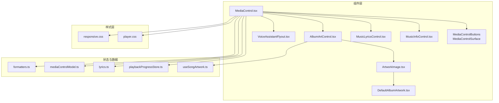
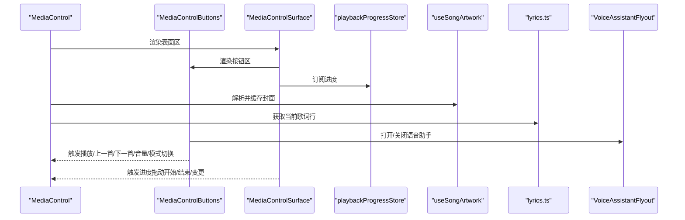
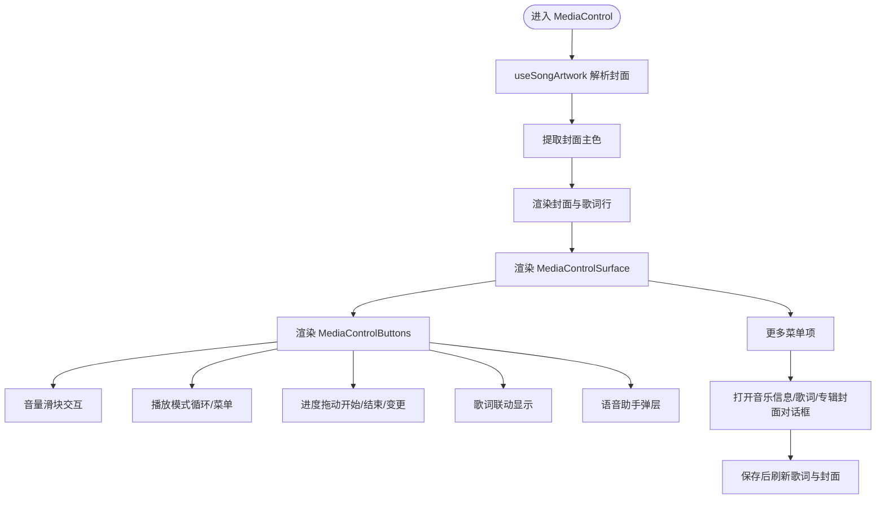
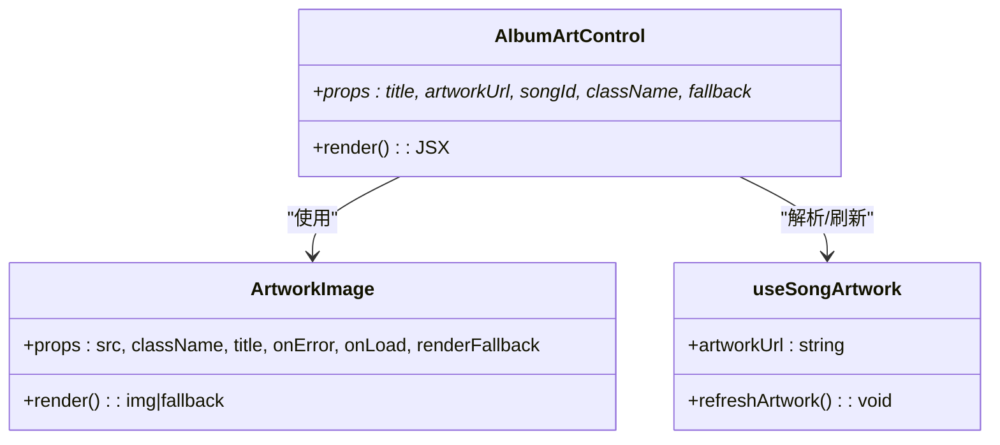
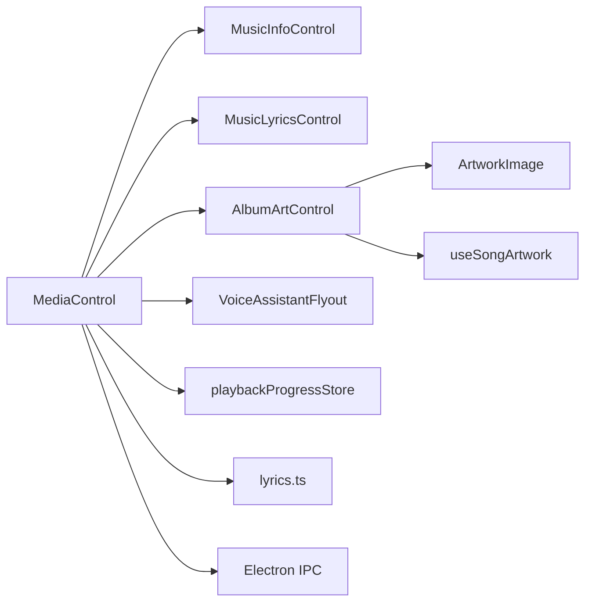

# 媒体交互组件

<cite>
**本文引用的文件**
- [MediaControl.tsx](file://src/components/MediaControl.tsx)
- [mediaControlModel.ts](file://src/components/mediaControlModel.ts)
- [MusicInfoControl.tsx](file://src/components/MusicInfoControl.tsx)
- [MusicLyricsControl.tsx](file://src/components/MusicLyricsControl.tsx)
- [AlbumArtControl.tsx](file://src/components/AlbumArtControl.tsx)
- [ArtworkImage.tsx](file://src/components/ArtworkImage.tsx)
- [DefaultAlbumArtwork.tsx](file://src/components/DefaultAlbumArtwork.tsx)
- [player.css](file://src/styles/player.css)
- [responsive.css](file://src/styles/responsive.css)
- [useSongArtwork.ts](file://src/hooks/useSongArtwork.ts)
- [lyrics.ts](file://src/shared/lyrics.ts)
- [playbackProgressStore.ts](file://src/state/playbackProgressStore.ts)
- [VoiceAssistantFlyout.tsx](file://src/components/VoiceAssistantFlyout.tsx)
- [usePlaybackShortcuts.ts](file://src/hooks/usePlaybackShortcuts.ts)
- [formatters.ts](file://src/shared/formatters.ts)
</cite>

## 目录
1. [简介](#简介)
2. [项目结构](#项目结构)
3. [核心组件](#核心组件)
4. [架构总览](#架构总览)
5. [详细组件分析](#详细组件分析)
6. [依赖关系分析](#依赖关系分析)
7. [性能考量](#性能考量)
8. [故障排查指南](#故障排查指南)
9. [结论](#结论)
10. [附录](#附录)

## 简介
本文件系统化梳理 SMPlayer 的媒体交互组件，重点覆盖以下方面：
- MediaControl 媒体控制组件：播放控制按钮、进度条、音量控制、播放模式切换、歌词联动、语音助手集成、全屏/迷你模式等。
- MediaControlModel 媒体控制模型：播放模式标题与图标、默认封面常量等。
- MusicInfoControl 音乐信息展示组件：属性编辑、艺术家网格、保存/重置、路径定位等。
- MusicLyricsControl 歌词显示组件：歌词搜索/导入/保存、时间戳开关、文本编辑等。
- AlbumArtControl 专辑封面组件：图片加载、错误回退、占位符、动态刷新等。
- 响应式设计与交互体验：断点适配、触摸手势、键盘快捷键、无障碍标签等。

## 项目结构
媒体交互相关代码主要分布在以下位置：
- 组件层：src/components 下的 MediaControl、MusicInfoControl、MusicLyricsControl、AlbumArtControl、ArtworkImage、DefaultAlbumArtwork、VoiceAssistantFlyout 等。
- 样式层：src/styles 下的 player.css、responsive.css 等。
- 数据与状态：src/state 下的 playbackProgressStore.ts；src/hooks 下的 useSongArtwork.ts、usePlaybackShortcuts.ts；src/shared 下的 lyrics.ts、formatters.ts。
- 模型与工具：src/components 下的 mediaControlModel.ts。

**图表来源**
- [MediaControl.tsx:834-1148](file://src/components/MediaControl.tsx#L834-L1148)
- [MusicInfoControl.tsx:31-155](file://src/components/MusicInfoControl.tsx#L31-L155)
- [MusicLyricsControl.tsx:7-74](file://src/components/MusicLyricsControl.tsx#L7-L74)
- [AlbumArtControl.tsx:18-37](file://src/components/AlbumArtControl.tsx#L18-L37)
- [ArtworkImage.tsx:13-33](file://src/components/ArtworkImage.tsx#L13-L33)
- [DefaultAlbumArtwork.tsx:9-16](file://src/components/DefaultAlbumArtwork.tsx#L9-L16)
- [playbackProgressStore.ts:45-52](file://src/state/playbackProgressStore.ts#L45-L52)
- [useSongArtwork.ts:157-197](file://src/hooks/useSongArtwork.ts#L157-L197)
- [lyrics.ts:6-35](file://src/shared/lyrics.ts#L6-L35)
- [mediaControlModel.ts:1-18](file://src/components/mediaControlModel.ts#L1-L18)
- [player.css:1-1120](file://src/styles/player.css#L1-L1120)
- [responsive.css:1-560](file://src/styles/responsive.css#L1-L560)

**章节来源**
- [MediaControl.tsx:834-1148](file://src/components/MediaControl.tsx#L834-L1148)
- [player.css:1-1120](file://src/styles/player.css#L1-L1120)
- [responsive.css:1-560](file://src/styles/responsive.css#L1-L560)

## 核心组件
- MediaControl：聚合播放控制、歌词显示、更多菜单、对话框、语音助手等，负责与播放器状态同步与事件分发。
- MediaControlButtons/MediaControlSurface：拆分出按钮区与表面区，分别处理交互与布局。
- MusicInfoControl：音乐属性编辑与保存，支持多艺术家网格、播放计数清零、路径在资源管理器中定位。
- MusicLyricsControl：歌词编辑、时间戳开关、搜索/导入/保存、重置。
- AlbumArtControl：专辑封面加载与回退，支持自定义占位符与回调。
- ArtworkImage/DefaultAlbumArtwork：通用图片组件与默认封面渲染。
- mediaControlModel：播放模式标题与图标、默认封面常量。
- playbackProgressStore：播放进度外部状态订阅。
- useSongArtwork：封面批量请求、缓存、失效重试。
- lyrics.ts：歌词行选择、时间戳剥离与合并。
- VoiceAssistantFlyout：语音识别弹层、状态机、帮助页。
- usePlaybackShortcuts：全局键盘快捷键（空格、方向键、组合键）。
- formatters：时长与字节格式化。

**章节来源**
- [MediaControl.tsx:223-832](file://src/components/MediaControl.tsx#L223-L832)
- [MusicInfoControl.tsx:31-155](file://src/components/MusicInfoControl.tsx#L31-L155)
- [MusicLyricsControl.tsx:7-74](file://src/components/MusicLyricsControl.tsx#L7-L74)
- [AlbumArtControl.tsx:18-37](file://src/components/AlbumArtControl.tsx#L18-L37)
- [mediaControlModel.ts:1-18](file://src/components/mediaControlModel.ts#L1-L18)
- [playbackProgressStore.ts:1-52](file://src/state/playbackProgressStore.ts#L1-L52)
- [useSongArtwork.ts:1-197](file://src/hooks/useSongArtwork.ts#L1-L197)
- [lyrics.ts:1-89](file://src/shared/lyrics.ts#L1-L89)
- [VoiceAssistantFlyout.tsx:1-304](file://src/components/VoiceAssistantFlyout.tsx#L1-L304)
- [usePlaybackShortcuts.ts:1-97](file://src/hooks/usePlaybackShortcuts.ts#L1-L97)
- [formatters.ts:1-28](file://src/shared/formatters.ts#L1-L28)

## 架构总览
MediaControl 作为顶层容器，协调各子组件与外部服务（播放器、偏好设置、歌词服务、语音识别）。其内部通过 hooks 与 stores 订阅播放进度与封面数据，并根据窗口尺寸切换紧凑模式菜单项。

**图表来源**
- [MediaControl.tsx:834-1148](file://src/components/MediaControl.tsx#L834-L1148)
- [MediaControl.tsx:709-832](file://src/components/MediaControl.tsx#L709-L832)
- [playbackProgressStore.ts:45-52](file://src/state/playbackProgressStore.ts#L45-L52)
- [useSongArtwork.ts:157-197](file://src/hooks/useSongArtwork.ts#L157-L197)
- [lyrics.ts:6-35](file://src/shared/lyrics.ts#L6-L35)
- [VoiceAssistantFlyout.tsx:165-177](file://src/components/VoiceAssistantFlyout.tsx#L165-L177)

## 详细组件分析

### MediaControl 媒体控制组件
- 结构与职责
  - 聚合轨道信息、播放状态、音量、模式、歌词等。
  - 提供“更多”菜单：快速播放、添加到播放列表/收藏、查看艺术家/专辑、全屏/迷你模式等。
  - 对话框：音乐信息、歌词、专辑封面详情。
  - 语音助手：条件可用性检测、弹层控制、状态提示。
- 关键流程
  - 进度拖动：按下捕获指针，拖动过程中仅更新草稿值，松开后提交实际 seek。
  - 播放模式循环：点击紧凑模式按钮循环切换，长按右键打开菜单。
  - 封面颜色提取：从可用封面提取主色用于背景渐变。
  - 歌词联动：基于进度计算当前歌词行并滚动显示。
- 事件与回调
  - 播放/暂停、上一首/下一首、seek 开始/结束/变更、音量变更/静音、模式切换、收藏切换、更多菜单、全屏/迷你模式、封面解析完成等。

**图表来源**
- [MediaControl.tsx:834-1148](file://src/components/MediaControl.tsx#L834-L1148)
- [MediaControl.tsx:709-832](file://src/components/MediaControl.tsx#L709-L832)
- [useSongArtwork.ts:157-197](file://src/hooks/useSongArtwork.ts#L157-L197)
- [lyrics.ts:6-35](file://src/shared/lyrics.ts#L6-L35)
- [VoiceAssistantFlyout.tsx:165-177](file://src/components/VoiceAssistantFlyout.tsx#L165-L177)

**章节来源**
- [MediaControl.tsx:834-1148](file://src/components/MediaControl.tsx#L834-L1148)
- [MediaControl.tsx:709-832](file://src/components/MediaControl.tsx#L709-L832)
- [MediaControl.tsx:223-697](file://src/components/MediaControl.tsx#L223-L697)

### MediaControlModel 媒体控制模型
- 功能
  - 默认封面常量：统一默认封面 URL。
  - 播放模式标题与图标：根据当前模式返回本地化标题与图标名。
- 设计要点
  - 将 UI 层与业务逻辑解耦，便于多处复用。

**章节来源**
- [mediaControlModel.ts:1-18](file://src/components/mediaControlModel.ts#L1-L18)

### MusicInfoControl 音乐信息展示组件
- 数据绑定与动态更新
  - 使用受控输入绑定歌曲属性，支持标题、副标题、专辑、专辑艺人、作曲者、发行商、流派、年份、曲号等。
  - 多艺术家网格：最多 N 列，支持增删单元格，实时校验数量上限。
  - 播放计数：可清零；文件元信息只读展示。
- 交互与样式
  - 命令栏：播放/保存/重置/保存进度指示。
  - 滚动视图：属性网格自适应布局。
  - 路径定位：在资源管理器中显示文件所在位置。

**章节来源**
- [MusicInfoControl.tsx:31-155](file://src/components/MusicInfoControl.tsx#L31-L155)

### MusicLyricsControl 歌词显示组件
- 功能
  - 歌词文本编辑：支持启用/禁用、忙碌态、占位提示。
  - 时间戳开关：可切换是否显示时间戳。
  - 操作：搜索、导入、保存、重置。
- 与歌词模块协作
  - 依赖 lyrics.ts 的歌词解析与时间戳处理能力。

**章节来源**
- [MusicLyricsControl.tsx:7-74](file://src/components/MusicLyricsControl.tsx#L7-L74)
- [lyrics.ts:37-89](file://src/shared/lyrics.ts#L37-L89)

### AlbumArtControl 专辑封面组件
- 图片加载与缓存
  - 使用 useSongArtwork 获取解析后的封面 URL，并进行缓存与批量请求。
  - 加载失败时触发刷新，尝试获取新快照。
- 回退策略
  - 自定义回退渲染：可选默认封面与自定义文本。
- 与通用组件协作
  - 内部使用 ArtworkImage，后者维护失败源集合并在错误时调用回退。

**图表来源**
- [AlbumArtControl.tsx:18-37](file://src/components/AlbumArtControl.tsx#L18-L37)
- [ArtworkImage.tsx:13-33](file://src/components/ArtworkImage.tsx#L13-L33)
- [useSongArtwork.ts:157-197](file://src/hooks/useSongArtwork.ts#L157-L197)

**章节来源**
- [AlbumArtControl.tsx:18-37](file://src/components/AlbumArtControl.tsx#L18-L37)
- [ArtworkImage.tsx:13-33](file://src/components/ArtworkImage.tsx#L13-L33)
- [useSongArtwork.ts:1-197](file://src/hooks/useSongArtwork.ts#L1-L197)

### 响应式设计与交互体验
- 断点适配
  - 在不同宽度下自动切换紧凑模式菜单项与布局，隐藏体积较大的控件，保留核心功能。
- 触摸与指针交互
  - 进度/音量滑块使用 setPointerCapture 捕获指针，支持拖动过程中的持续更新与释放时提交。
- 键盘快捷键
  - 支持空格播放/暂停、左右方向键跳转、组合键切换随机/重复/单曲循环等。
- 无障碍与标签
  - 所有交互元素均提供 aria-label/title，确保屏幕阅读器友好。

**章节来源**
- [player.css:1-1120](file://src/styles/player.css#L1-L1120)
- [responsive.css:1-560](file://src/styles/responsive.css#L1-L560)
- [MediaControl.tsx:757-801](file://src/components/MediaControl.tsx#L757-L801)
- [usePlaybackShortcuts.ts:1-97](file://src/hooks/usePlaybackShortcuts.ts#L1-L97)

## 依赖关系分析
- 组件间依赖
  - MediaControl 依赖 MusicInfoControl、MusicLyricsControl、AlbumArtControl、VoiceAssistantFlyout。
  - AlbumArtControl 依赖 ArtworkImage 与 useSongArtwork。
  - MediaControl 依赖 playbackProgressStore 与 lyrics.ts。
- 外部接口
  - Electron IPC：封面解析、歌词查询、语音识别、全屏切换、迷你模式等。
- 状态与缓存
  - useSongArtwork 提供封面缓存与批量请求，避免重复网络请求。
  - playbackProgressStore 提供播放进度的外部状态订阅。

**图表来源**
- [MediaControl.tsx:834-1148](file://src/components/MediaControl.tsx#L834-L1148)
- [AlbumArtControl.tsx:18-37](file://src/components/AlbumArtControl.tsx#L18-L37)
- [useSongArtwork.ts:1-197](file://src/hooks/useSongArtwork.ts#L1-L197)
- [playbackProgressStore.ts:1-52](file://src/state/playbackProgressStore.ts#L1-L52)
- [lyrics.ts:1-89](file://src/shared/lyrics.ts#L1-L89)

**章节来源**
- [MediaControl.tsx:834-1148](file://src/components/MediaControl.tsx#L834-L1148)
- [useSongArtwork.ts:1-197](file://src/hooks/useSongArtwork.ts#L1-L197)
- [playbackProgressStore.ts:1-52](file://src/state/playbackProgressStore.ts#L1-L52)

## 性能考量
- 封面加载与缓存
  - useSongArtwork 实现批量请求与缓存，减少重复请求；对生成型封面 URL 进行严格校验，避免无效缓存污染。
- 进度与歌词更新
  - 使用外部状态订阅播放进度，避免不必要的重渲染；歌词行计算基于当前进度与比例，避免全量扫描。
- 滑块交互
  - 拖动过程仅更新草稿值，释放指针时才提交，降低频繁调用带来的性能压力。
- 样式与动画
  - 进度与音量滑块采用 CSS 变量驱动，减少 JS 计算；歌词滚动使用轻量动画。

**章节来源**
- [useSongArtwork.ts:36-83](file://src/hooks/useSongArtwork.ts#L36-L83)
- [playbackProgressStore.ts:15-32](file://src/state/playbackProgressStore.ts#L15-L32)
- [lyrics.ts:6-35](file://src/shared/lyrics.ts#L6-L35)
- [MediaControl.tsx:757-801](file://src/components/MediaControl.tsx#L757-L801)

## 故障排查指南
- 封面不显示或闪烁
  - 检查 useSongArtwork 是否正确解析并缓存；确认 onError 回调是否触发刷新。
  - 若使用生成型封面 URL，需确保与缓存一致。
- 歌词未显示或错位
  - 确认歌词服务返回的行与时间戳；检查进度比例与秒级转换。
- 音量/进度滑块无响应
  - 确认 setPointerCapture 是否成功；检查 disabled 状态与事件链路。
- 语音助手不可用
  - 检查平台判断与弹层状态；确认识别会话 ID 未过期。
- 键盘快捷键无效
  - 确认当前焦点不在可编辑元素；检查组合键冲突。

**章节来源**
- [useSongArtwork.ts:182-197](file://src/hooks/useSongArtwork.ts#L182-L197)
- [lyrics.ts:6-35](file://src/shared/lyrics.ts#L6-L35)
- [MediaControl.tsx:757-801](file://src/components/MediaControl.tsx#L757-L801)
- [VoiceAssistantFlyout.tsx:97-177](file://src/components/VoiceAssistantFlyout.tsx#L97-L177)
- [usePlaybackShortcuts.ts:22-95](file://src/hooks/usePlaybackShortcuts.ts#L22-L95)

## 结论
SMPlayer 的媒体交互组件以 MediaControl 为核心，围绕播放控制、封面加载、歌词联动、信息编辑与语音助手构建了完整的用户界面体系。通过 hooks 与 stores 的状态管理、合理的缓存与批处理策略、以及完善的响应式与无障碍设计，实现了高性能与良好用户体验。建议在后续迭代中进一步增强错误恢复与日志上报能力，提升稳定性与可观测性。

## 附录
- 术语
  - 播放模式：列表播放、随机、单曲循环、整张循环。
  - 紧凑模式：在小屏设备上隐藏部分控件，保留核心交互。
- 参考样式
  - player.css：播放器条整体样式、按钮、滑块、歌词滚动等。
  - responsive.css：断点与紧凑模式布局切换。