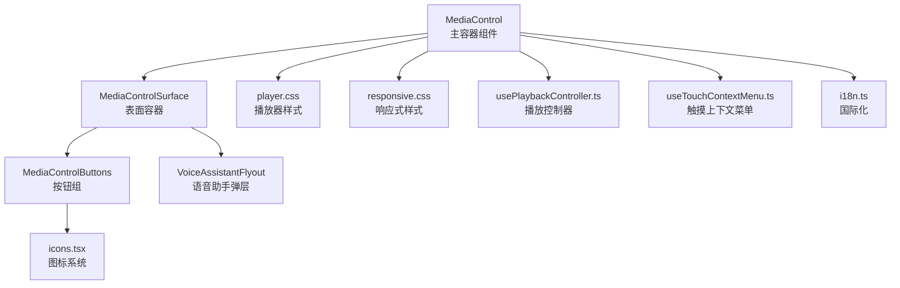
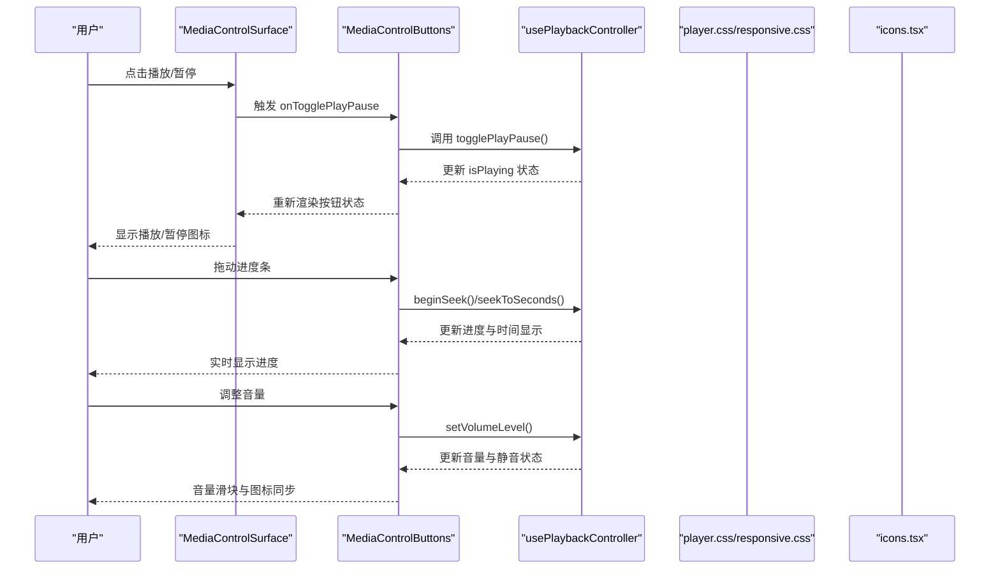
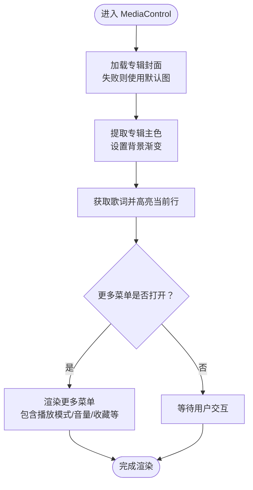
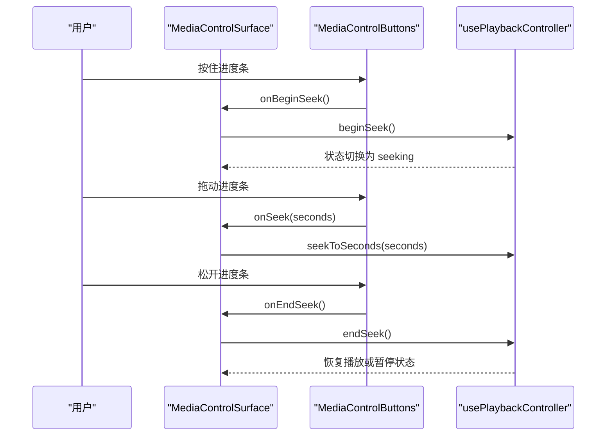
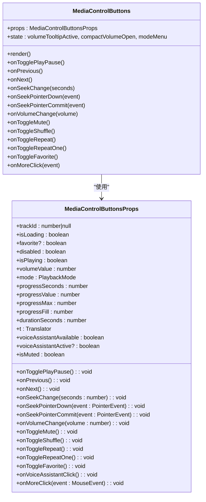
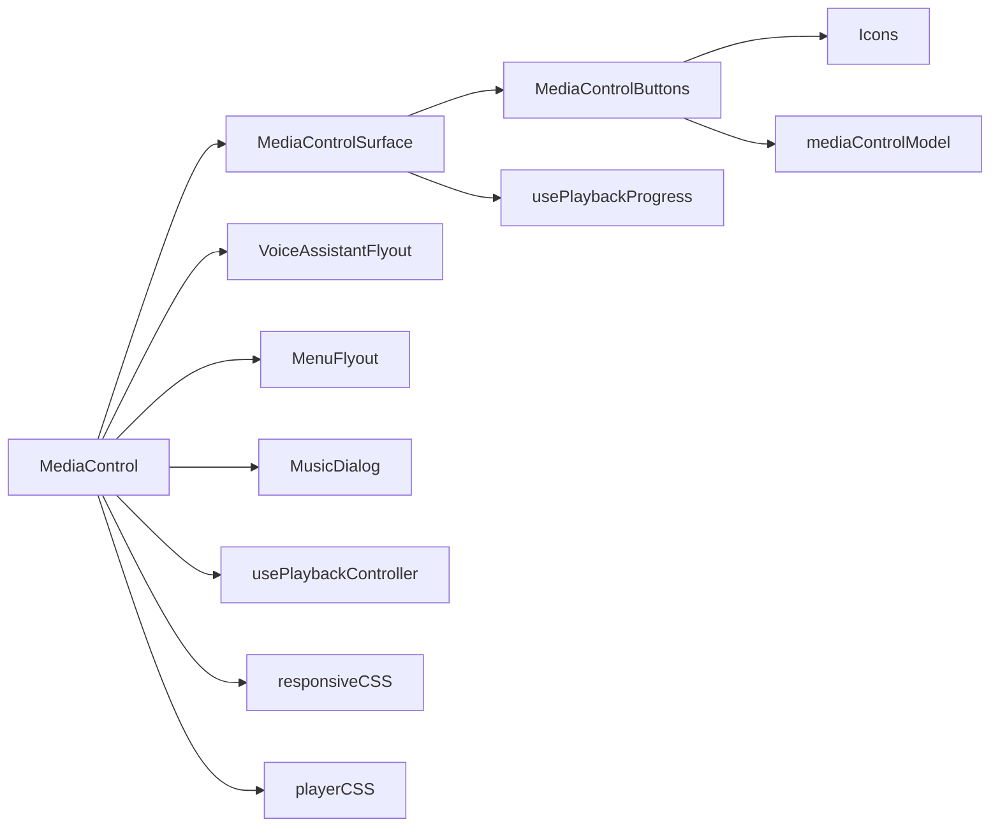

# 媒体控制组件

<cite>
**本文档引用的文件**
- [MediaControl.tsx](file://src/components/MediaControl.tsx)
- [mediaControlModel.ts](file://src/components/mediaControlModel.ts)
- [player.css](file://src/styles/player.css)
- [responsive.css](file://src/styles/responsive.css)
- [icons.tsx](file://src/components/icons.tsx)
- [usePlaybackController.ts](file://src/hooks/usePlaybackController.ts)
- [useTouchContextMenu.ts](file://src/hooks/useTouchContextMenu.ts)
- [i18n.ts](file://src/shared/i18n.ts)
</cite>

## 目录
1. [简介](#简介)
2. [项目结构](#项目结构)
3. [核心组件](#核心组件)
4. [架构总览](#架构总览)
5. [详细组件分析](#详细组件分析)
6. [依赖关系分析](#依赖关系分析)
7. [性能考虑](#性能考虑)
8. [故障排除指南](#故障排除指南)
9. [结论](#结论)

## 简介
本文件为 SMPlayer 的 MediaControl 媒体控制组件提供全面的技术文档。该组件负责在应用底部固定区域展示播放控制界面，包含播放/暂停、上一首/下一首导航、进度条拖拽、音量控制、播放模式切换、收藏按钮、更多菜单以及语音助手等功能。文档将从架构设计、组件关系、数据流与处理逻辑、集成点与错误处理、性能特征等方面进行深入解析，并提供可访问性、键盘导航与触摸手势等用户体验优化建议及使用模式。

## 项目结构
MediaControl 组件位于 src/components 目录下，配合样式文件 src/styles 下的 player.css 和 responsive.css 实现响应式布局与主题适配；图标系统由 src/components/icons.tsx 提供；播放控制逻辑由 src/hooks/usePlaybackController.ts 提供；触摸上下文菜单支持来自 src/hooks/useTouchContextMenu.ts；国际化翻译器来自 src/shared/i18n.ts。

图表来源
- [MediaControl.tsx:834-1148](file://src/components/MediaControl.tsx#L834-L1148)
- [player.css:1-1120](file://src/styles/player.css#L1-L1120)
- [responsive.css:1-560](file://src/styles/responsive.css#L1-L560)
- [icons.tsx:446-487](file://src/components/icons.tsx#L446-L487)
- [usePlaybackController.ts:28-53](file://src/hooks/usePlaybackController.ts#L28-L53)
- [useTouchContextMenu.ts:23-92](file://src/hooks/useTouchContextMenu.ts#L23-L92)
- [i18n.ts:29-37](file://src/shared/i18n.ts#L29-L37)

章节来源
- [MediaControl.tsx:834-1148](file://src/components/MediaControl.tsx#L834-L1148)

## 核心组件
- MediaControl：顶层容器，负责渲染封面、轨道信息、播放控制表面与更多菜单，同时管理歌词显示与专辑颜色提取。
- MediaControlSurface：播放控制表面容器，封装按钮组、进度条、音量控制与播放模式切换，处理拖拽进度与音量变化。
- MediaControlButtons：具体按钮组，包含播放/暂停、上一首/下一首、进度条、音量滑块、收藏、播放模式按钮、更多按钮等。
- mediaControlModel：提供播放模式标题与图标辅助函数，统一播放模式文案与图标映射。
- 响应式样式：player.css 与 responsive.css 负责不同屏幕尺寸下的布局调整与视觉表现。
- 图标系统：icons.tsx 提供统一的图标渲染与无障碍属性设置。
- 播放控制器：usePlaybackController.ts 提供播放状态、音量、进度、模式切换等核心播放逻辑。
- 触摸上下文菜单：useTouchContextMenu.ts 提供长按触发上下文菜单的触摸交互支持。
- 国际化：i18n.ts 提供多语言翻译能力。

章节来源
- [MediaControl.tsx:223-832](file://src/components/MediaControl.tsx#L223-L832)
- [mediaControlModel.ts:1-18](file://src/components/mediaControlModel.ts#L1-L18)
- [player.css:1-1120](file://src/styles/player.css#L1-L1120)
- [responsive.css:1-560](file://src/styles/responsive.css#L1-L560)
- [icons.tsx:446-487](file://src/components/icons.tsx#L446-L487)
- [usePlaybackController.ts:28-53](file://src/hooks/usePlaybackController.ts#L28-L53)
- [useTouchContextMenu.ts:23-92](file://src/hooks/useTouchContextMenu.ts#L23-L92)
- [i18n.ts:29-37](file://src/shared/i18n.ts#L29-L37)

## 架构总览
MediaControl 采用分层设计：
- 表面层（MediaControlSurface）：负责用户交互与状态更新，向上游回调传递事件。
- 按钮层（MediaControlButtons）：封装具体控件，处理按钮点击、长按菜单、音量滑块拖拽等。
- 容器层（MediaControl）：整合封面、歌词、更多菜单与播放器样式，协调各子组件。
- 控制层（usePlaybackController）：提供播放状态、音量、进度、模式切换等业务逻辑。
- 支撑层（样式、图标、国际化、触摸上下文菜单）：提供视觉、交互与本地化支持。

图表来源
- [MediaControl.tsx:709-832](file://src/components/MediaControl.tsx#L709-L832)
- [usePlaybackController.ts:646-798](file://src/hooks/usePlaybackController.ts#L646-L798)
- [player.css:405-449](file://src/styles/player.css#L405-L449)
- [icons.tsx:446-487](file://src/components/icons.tsx#L446-L487)

## 详细组件分析

### MediaControl 主容器组件
- 职责：渲染封面与轨道信息、播放控制表面、更多菜单、歌词显示、专辑颜色提取与背景渐变。
- 关键特性：
  - 封面加载失败回退到默认专辑图，并尝试刷新。
  - 动态提取专辑主色用于背景渐变，提升视觉一致性。
  - 歌词实时获取并根据播放进度高亮当前行。
  - 更多菜单根据窗口宽度动态切换紧凑模式与完整模式。
- 事件与状态：
  - 打开“正在播放”页面、全屏切换、迷你模式入口。
  - 与 usePlaybackController 协作，接收播放状态、音量、进度等。

图表来源
- [MediaControl.tsx:834-1148](file://src/components/MediaControl.tsx#L834-L1148)

章节来源
- [MediaControl.tsx:834-1148](file://src/components/MediaControl.tsx#L834-L1148)

### MediaControlSurface 表面容器
- 职责：承载按钮组与交互逻辑，处理进度拖拽开始/结束、音量变更、播放模式切换等。
- 关键特性：
  - 进度拖拽采用 beginSeek/endSeek 包裹，避免频繁重绘。
  - 音量值范围限制在 0-100，禁用状态下返回 0。
  - 通过 usePlaybackProgress 获取播放进度与总时长，支持歌词滚动。
- 事件处理：
  - onSeek/onBeginSeek/onEndSeek：进度拖拽事件。
  - onVolumeChange：音量变更事件。
  - onToggleShuffle/onToggleRepeat/onToggleRepeatOne：播放模式切换事件。

图表来源
- [MediaControl.tsx:709-832](file://src/components/MediaControl.tsx#L709-L832)
- [usePlaybackController.ts:722-755](file://src/hooks/usePlaybackController.ts#L722-L755)

章节来源
- [MediaControl.tsx:709-832](file://src/components/MediaControl.tsx#L709-L832)

### MediaControlButtons 按钮组
- 职责：实现播放控制按钮、进度条、音量控制、播放模式切换、收藏与更多菜单。
- 核心功能：
  - 播放/暂停：根据 isPlaying 切换图标与 aria-label。
  - 上一首/下一首：触发播放控制器的 prev/next。
  - 进度条：支持水平拖拽与垂直音量滑块拖拽，实时更新进度。
  - 音量控制：支持紧凑音量面板与普通音量滑块，支持静音切换与 tooltip。
  - 播放模式：循环模式循环切换，支持长按右键打开菜单选择具体模式。
  - 收藏：根据 favorite 状态切换爱心图标与按钮激活态。
  - 更多：触发更多菜单，包含快速播放、添加到播放列表、视图选项等。
- 事件与状态：
  - onTogglePlayPause/onPrevious/onNext/onSeekChange/onSeekPointerDown/onSeekPointerCommit/onVolumeChange/onToggleMute/onToggleShuffle/onToggleRepeat/onToggleRepeatOne/onToggleFavorite/onMoreClick。
  - 内部维护音量 tooltip 显示、紧凑音量面板开关、播放模式菜单位置等状态。

图表来源
- [MediaControl.tsx:74-268](file://src/components/MediaControl.tsx#L74-L268)

章节来源
- [MediaControl.tsx:223-832](file://src/components/MediaControl.tsx#L223-L832)

### mediaControlModel 模型
- 职责：提供播放模式标题与图标辅助函数，统一播放模式文案与图标映射。
- 功能：
  - getShuffleTitle/getRepeatTitle/getRepeatOneTitle：根据当前模式返回启用/禁用状态的标题文本。
  - DEFAULT_ARTWORK_URL：默认专辑图资源常量。

章节来源
- [mediaControlModel.ts:1-18](file://src/components/mediaControlModel.ts#L1-L18)

### 响应式设计与布局
- player.css：定义播放器基础网格布局、按钮样式、进度条与音量滑块样式、歌词滚动动画等。
- responsive.css：针对不同断点（如 800px、520px）调整播放器布局、按钮尺寸、显示内容与紧凑模式。
- 关键断点：
  - 1200px：隐藏紧凑音量面板与模式按钮，显示完整音量滑块与模式按钮。
  - 800px：nav-minimal 模式下播放器网格布局与尺寸调整，隐藏部分按钮。
  - 520px：进一步缩小尺寸，适配移动端窄屏。

章节来源
- [player.css:1-1120](file://src/styles/player.css#L1-L1120)
- [responsive.css:1-560](file://src/styles/responsive.css#L1-L560)

### 可访问性与键盘导航
- 无障碍属性：
  - 所有按钮均设置 aria-label 与 title，确保屏幕阅读器可读。
  - 图标组件设置 aria-hidden="true" 与 focusable="false"，避免重复读取。
- 键盘导航：
  - 按钮使用原生 button，支持 Tab 导航与 Enter/Space 触发。
  - 进度条与音量滑块使用原生 input[type=range]，支持方向键与拖拽。
- 触摸手势：
  - 使用 TouchContextMenu 机制，长按触发上下文菜单，避免误触。
  - 进度条与音量滑块支持指针事件，提供平滑拖拽体验。

章节来源
- [MediaControl.tsx:255-696](file://src/components/MediaControl.tsx#L255-L696)
- [icons.tsx:446-487](file://src/components/icons.tsx#L446-L487)
- [useTouchContextMenu.ts:23-92](file://src/hooks/useTouchContextMenu.ts#L23-L92)

### 状态管理与播放控制
- 播放控制器：
  - 提供 playTrack/togglePlayPause/playNext/playPrevious/seekToSeconds/beginSeek/endSeek/setVolumeLevel/toggleMute/cycleRepeatMode 等方法。
  - 管理播放状态、音量、静音、播放模式、队列索引等。
- 进度同步：
  - 使用定时器同步音频 currentTime 与 UI 进度，避免卡顿与抖动。
  - 支持缓冲停滞检测与自动恢复策略。
- 持久化：
  - 播放设置与进度持久化，支持断电恢复与自动播放。

章节来源
- [usePlaybackController.ts:28-958](file://src/hooks/usePlaybackController.ts#L28-L958)

## 依赖关系分析
- 组件依赖：
  - MediaControl 依赖 MediaControlSurface、MenuFlyout、VoiceAssistantFlyout、MusicDialog 等。
  - MediaControlSurface 依赖 MediaControlButtons 与 usePlaybackProgress。
  - MediaControlButtons 依赖 icons.tsx、mediaControlModel.ts、MenuFlyoutHelper。
- 外部依赖：
  - Electron IPC 通过 window.smplayer 访问底层能力（如获取歌词、应用信息）。
  - FluentUI 图标库用于部分图标渲染。
- 样式依赖：
  - player.css 与 responsive.css 提供播放器整体外观与响应式布局。

图表来源
- [MediaControl.tsx:834-1148](file://src/components/MediaControl.tsx#L834-L1148)
- [player.css:1-1120](file://src/styles/player.css#L1-L1120)
- [responsive.css:1-560](file://src/styles/responsive.css#L1-L560)
- [icons.tsx:446-487](file://src/components/icons.tsx#L446-L487)
- [mediaControlModel.ts:1-18](file://src/components/mediaControlModel.ts#L1-L18)

章节来源
- [MediaControl.tsx:834-1148](file://src/components/MediaControl.tsx#L834-L1148)

## 性能考虑
- 渲染优化：
  - 使用 useMemo 缓存歌词高亮结果，减少不必要的重渲染。
  - 进度条与音量滑块采用节流/防抖策略，避免高频更新。
- 进度同步：
  - 使用定时器同步播放进度，阈值判断减少无效更新。
  - 缓冲停滞检测与自动恢复，避免长时间无响应。
- 资源加载：
  - 封面加载失败回退默认图，避免阻塞主流程。
  - 专辑主色提取异步执行，失败时回退默认色。

## 故障排除指南
- 播放无响应：
  - 检查 beginSeek/endSeek 是否正确包裹拖拽事件。
  - 确认 isUserSeekingRef 状态未被意外置位。
- 进度不更新：
  - 确认 usePlaybackProgress 返回的 progressSeconds/durationSeconds 正确。
  - 检查定时器是否被清理或未启动。
- 音量无效：
  - 确认音量值在 0-100 范围内，静音状态会解除静音再设置音量。
  - 检查音频元素的 muted/volume 属性是否同步。
- 触摸菜单不出现：
  - 确认长按时间与移动容差配置合理。
  - 检查指针事件是否被其他元素拦截。

章节来源
- [usePlaybackController.ts:270-305](file://src/hooks/usePlaybackController.ts#L270-L305)
- [MediaControl.tsx:757-801](file://src/components/MediaControl.tsx#L757-L801)

## 结论
MediaControl 组件通过清晰的分层设计与完善的交互支持，实现了稳定、可访问且响应式的媒体播放控制体验。其与播放控制器、样式系统、图标系统与国际化模块的协同工作，确保了跨平台与多语言场景下的良好表现。未来可在以下方面持续优化：进一步细化状态管理与事件流、增强错误边界与降级策略、扩展键盘快捷键与无障碍能力。