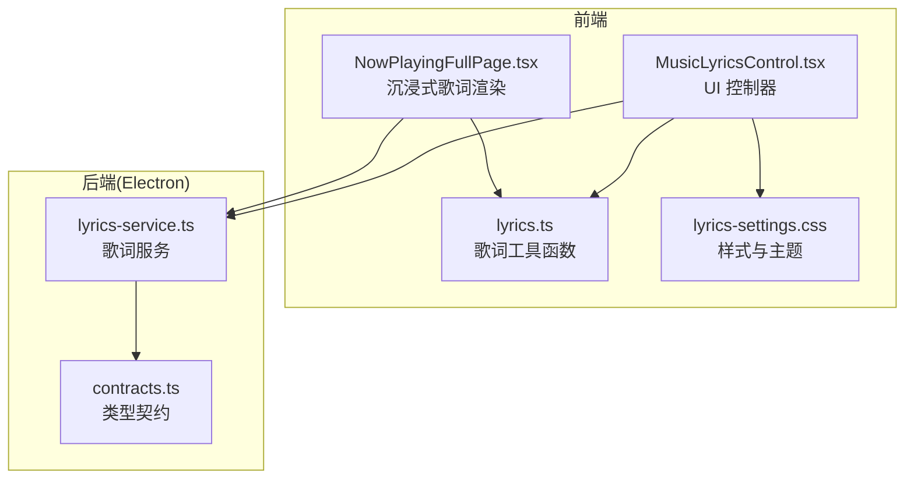
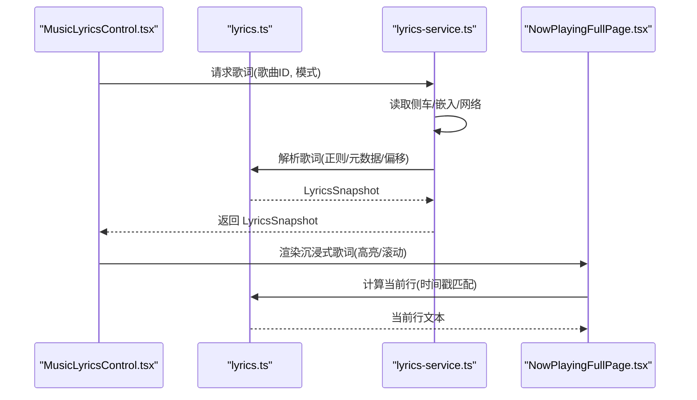
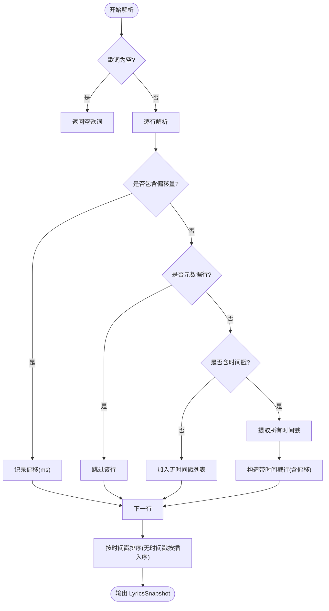
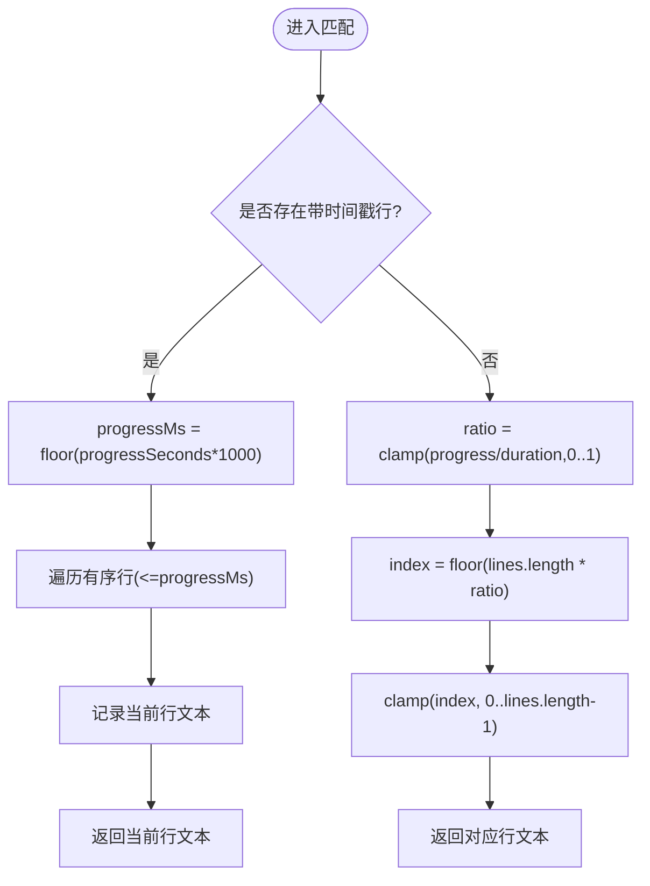
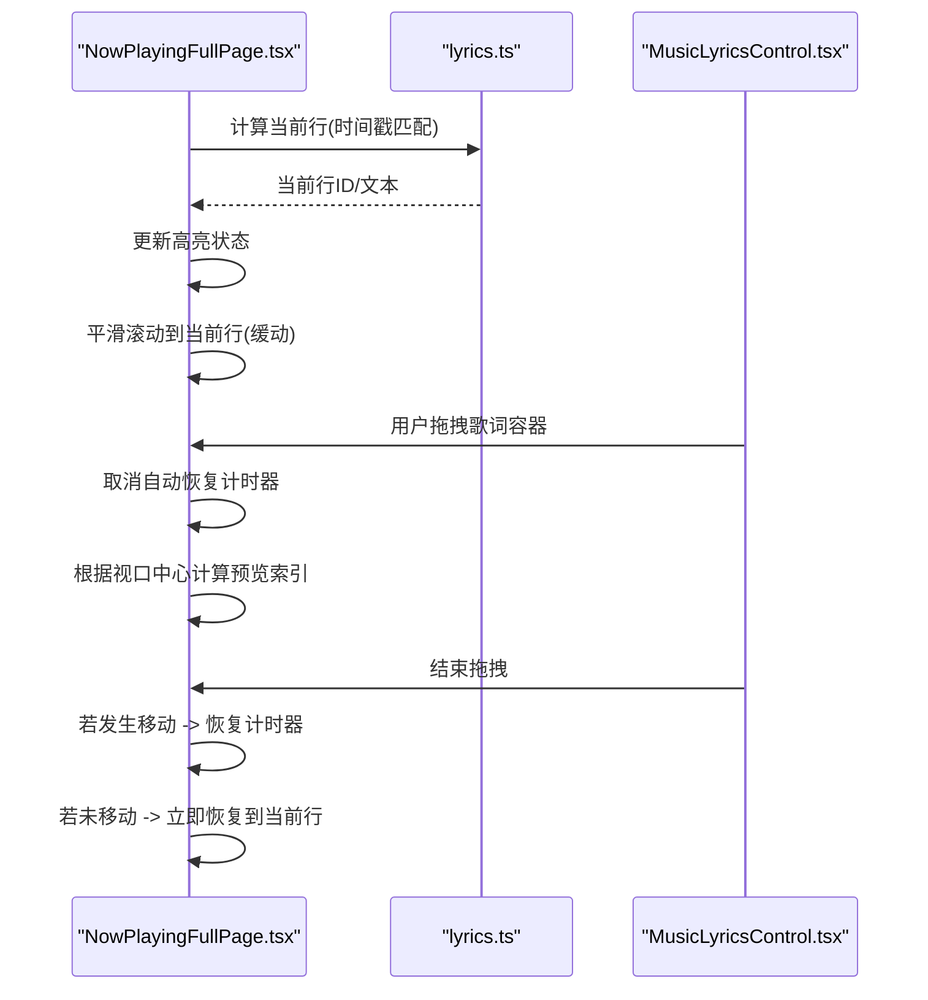
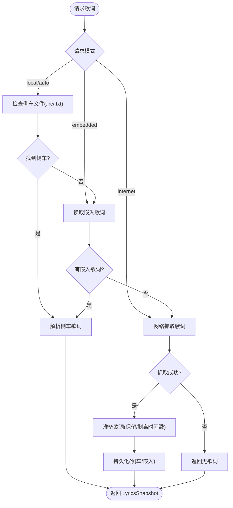
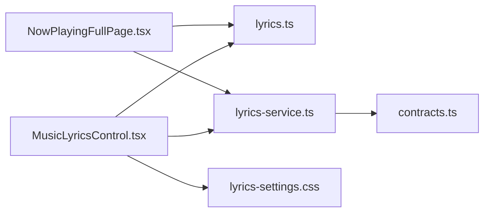

# 歌词显示组件

<cite>
**本文档引用的文件**
- [MusicLyricsControl.tsx](file://src/components/MusicLyricsControl.tsx)
- [lyrics.ts](file://src/shared/lyrics.ts)
- [lyrics-service.ts](file://electron/services/lyrics-service.ts)
- [contracts.ts](file://src/shared/contracts.ts)
- [NowPlayingFullPage.tsx](file://src/pages/NowPlayingFullPage.tsx)
- [lyrics-settings.css](file://src/styles/lyrics-settings.css)
</cite>

## 目录
1. [简介](#简介)
2. [项目结构](#项目结构)
3. [核心组件](#核心组件)
4. [架构总览](#架构总览)
5. [详细组件分析](#详细组件分析)
6. [依赖关系分析](#依赖关系分析)
7. [性能考虑](#性能考虑)
8. [故障排除指南](#故障排除指南)
9. [结论](#结论)

## 简介
本文件针对 SMPlayer 的歌词显示组件进行系统化技术文档编写，重点覆盖以下方面：
- 歌词解析与时间轴同步：解析 LRC/文本歌词，提取时间戳，构建有序时间线
- 时间戳匹配与高亮：基于播放进度计算当前应高亮的歌词行
- 滚动定位与动画：平滑滚动至当前歌词，支持拖拽预览与自动恢复
- 样式与主题：深浅色主题适配，进度条与状态展示
- 数据流与缓存：本地侧车文件、嵌入标签、网络抓取与持久化策略
- 错误处理与健壮性：空歌词、解析失败、网络超时、写入失败等场景
- 性能优化与精度：时间戳解析精度、滚动动画性能、批量任务节流

## 项目结构
歌词显示组件由前端 UI 组件、共享工具函数、Electron 后端服务以及页面级沉浸式歌词渲染共同组成。核心文件如下：
- 前端 UI 控制器：MusicLyricsControl.tsx
- 共享歌词工具：lyrics.ts（解析、时间戳处理）
- Electron 歌词服务：lyrics-service.ts（来源选择、解析、网络抓取、持久化）
- 类型契约：contracts.ts（LyricsSnapshot/LyricsLine 等）
- 页面级沉浸式歌词：NowPlayingFullPage.tsx（滚动、高亮、拖拽）
- 样式：lyrics-settings.css（主题适配）

图表来源
- [MusicLyricsControl.tsx:1-74](file://src/components/MusicLyricsControl.tsx#L1-L74)
- [lyrics.ts:1-89](file://src/shared/lyrics.ts#L1-L89)
- [lyrics-service.ts:1-572](file://electron/services/lyrics-service.ts#L1-L572)
- [contracts.ts:195-232](file://src/shared/contracts.ts#L195-L232)
- [NowPlayingFullPage.tsx:100-200](file://src/pages/NowPlayingFullPage.tsx#L100-L200)
- [lyrics-settings.css:1-496](file://src/styles/lyrics-settings.css#L1-L496)

章节来源
- [MusicLyricsControl.tsx:1-74](file://src/components/MusicLyricsControl.tsx#L1-L74)
- [lyrics.ts:1-89](file://src/shared/lyrics.ts#L1-L89)
- [lyrics-service.ts:1-572](file://electron/services/lyrics-service.ts#L1-L572)
- [contracts.ts:195-232](file://src/shared/contracts.ts#L195-L232)
- [NowPlayingFullPage.tsx:100-200](file://src/pages/NowPlayingFullPage.tsx#L100-L200)
- [lyrics-settings.css:1-496](file://src/styles/lyrics-settings.css#L1-L496)

## 核心组件
- 歌词 UI 控制器：提供搜索、导入、保存、重置、时间戳开关等操作入口，并承载歌词编辑区域
- 歌词解析与时间戳处理：统一解析 LRC 文本，支持元数据过滤、偏移量处理、时间戳剥离与合并
- 歌词服务：负责多源歌词获取（侧车文件、嵌入标签、网络）、解析、持久化与错误兜底
- 沉浸式歌词页面：根据播放进度计算当前高亮行，提供平滑滚动与拖拽预览
- 样式与主题：深浅色模式下的 UI 适配，进度条与状态展示

章节来源
- [MusicLyricsControl.tsx:7-73](file://src/components/MusicLyricsControl.tsx#L7-L73)
- [lyrics.ts:6-88](file://src/shared/lyrics.ts#L6-L88)
- [lyrics-service.ts:50-78](file://electron/services/lyrics-service.ts#L50-L78)
- [NowPlayingFullPage.tsx:194-200](file://src/pages/NowPlayingFullPage.tsx#L194-L200)
- [lyrics-settings.css:401-496](file://src/styles/lyrics-settings.css#L401-L496)

## 架构总览
歌词显示组件采用“前端 UI + 共享工具 + Electron 服务”的分层架构：
- 前端 UI 层：MusicLyricsControl 负责用户交互与状态展示
- 共享工具层：lyrics.ts 提供跨层通用的歌词解析与时间戳处理
- 服务层：lyrics-service.ts 实现歌词来源选择、解析、网络抓取与持久化
- 页面层：NowPlayingFullPage.tsx 将歌词与播放进度联动，实现高亮与滚动

图表来源
- [MusicLyricsControl.tsx:17-22](file://src/components/MusicLyricsControl.tsx#L17-L22)
- [lyrics-service.ts:50-78](file://electron/services/lyrics-service.ts#L50-L78)
- [lyrics.ts:6-35](file://src/shared/lyrics.ts#L6-L35)
- [NowPlayingFullPage.tsx:194-200](file://src/pages/NowPlayingFullPage.tsx#L194-L200)

## 详细组件分析

### 歌词解析与时间轴同步
- 时间戳解析：支持分钟:秒.毫秒或分钟:秒:百分之一秒格式，解析为毫秒时间戳；支持 [offset:+/-N] 偏移量
- 元数据过滤：忽略 [ti|ar|al|by|offset]: 开头的元数据行
- 行排序：按时间戳升序排序，无时间戳行按插入顺序排列
- 时间戳匹配：根据当前播放进度（秒）转换为毫秒，遍历有序行找到小于等于当前时间的最大行作为当前高亮行；若无时间戳，则按比例映射到行索引

图表来源
- [lyrics-service.ts:241-316](file://electron/services/lyrics-service.ts#L241-L316)
- [lyrics.ts:6-35](file://src/shared/lyrics.ts#L6-L35)

章节来源
- [lyrics-service.ts:241-316](file://electron/services/lyrics-service.ts#L241-L316)
- [lyrics.ts:6-35](file://src/shared/lyrics.ts#L6-L35)

### 时间戳匹配算法
- 有时间戳：将播放进度转换为毫秒，遍历有序行，取最后一个不超过当前时间的行作为当前行
- 无时间戳：按比例 progressRatio 映射到行索引，取整后限制在有效范围内

图表来源
- [lyrics.ts:6-35](file://src/shared/lyrics.ts#L6-L35)

章节来源
- [lyrics.ts:6-35](file://src/shared/lyrics.ts#L6-L35)

### 歌词行的动态更新机制
- 播放进度变化时，页面层重新计算当前高亮行并触发滚动
- 支持平滑滚动动画，使用 requestAnimationFrame 驱动缓动曲线
- 支持拖拽预览：拖拽时取消自动恢复计时器，移动时实时更新预览索引
- 自动恢复：停止拖拽或静止一段时间后，自动滚动回当前播放位置

图表来源
- [NowPlayingFullPage.tsx:365-401](file://src/pages/NowPlayingFullPage.tsx#L365-L401)
- [NowPlayingFullPage.tsx:418-524](file://src/pages/NowPlayingFullPage.tsx#L418-L524)
- [lyrics.ts:6-35](file://src/shared/lyrics.ts#L6-L35)

章节来源
- [NowPlayingFullPage.tsx:365-401](file://src/pages/NowPlayingFullPage.tsx#L365-L401)
- [NowPlayingFullPage.tsx:418-524](file://src/pages/NowPlayingFullPage.tsx#L418-L524)
- [lyrics.ts:6-35](file://src/shared/lyrics.ts#L6-L35)

### 歌词数据的获取与处理流程
- 来源优先级：侧车文件(.lrc/.txt) > 嵌入标签 > 网络抓取 > 无歌词
- 侧车文件：优先读取同目录 .lrc，其次 .txt；若音频为 mp3，同时尝试写入嵌入标签
- 嵌入标签：从音乐文件元数据读取歌词，必要时将同步文本转换为 LRC 格式
- 网络抓取：通过 QQ 音乐接口查询歌词，支持多种关键词组合与匹配评分
- 持久化：成功抓取的歌词可写入侧车文件或嵌入标签，失败不阻塞播放

图表来源
- [lyrics-service.ts:50-78](file://electron/services/lyrics-service.ts#L50-L78)
- [lyrics-service.ts:328-341](file://electron/services/lyrics-service.ts#L328-L341)
- [lyrics-service.ts:343-372](file://electron/services/lyrics-service.ts#L343-L372)
- [lyrics-service.ts:374-394](file://electron/services/lyrics-service.ts#L374-L394)
- [lyrics-service.ts:161-174](file://electron/services/lyrics-service.ts#L161-L174)

章节来源
- [lyrics-service.ts:50-78](file://electron/services/lyrics-service.ts#L50-L78)
- [lyrics-service.ts:328-341](file://electron/services/lyrics-service.ts#L328-L341)
- [lyrics-service.ts:343-372](file://electron/services/lyrics-service.ts#L343-L372)
- [lyrics-service.ts:374-394](file://electron/services/lyrics-service.ts#L374-L394)
- [lyrics-service.ts:161-174](file://electron/services/lyrics-service.ts#L161-L174)

### 歌词样式设计与主题适配
- 进度面板：包含当前时间、总时长、进度条与统计信息
- 主题适配：深色模式下调整边框、背景、文字颜色，确保对比度与可读性
- 开关与控件：时间选择器、下拉菜单、开关按钮等控件在不同主题下保持一致风格

章节来源
- [lyrics-settings.css:8-61](file://src/styles/lyrics-settings.css#L8-L61)
- [lyrics-settings.css:401-496](file://src/styles/lyrics-settings.css#L401-L496)

### 歌词滚动与交互
- 平滑滚动：使用缓动函数与 requestAnimationFrame 实现平滑滚动
- 自动定位：播放进度变化时自动滚动到当前行
- 用户交互：支持拖拽歌词容器进行预览，松开后自动恢复到当前播放位置

章节来源
- [NowPlayingFullPage.tsx:365-401](file://src/pages/NowPlayingFullPage.tsx#L365-L401)
- [NowPlayingFullPage.tsx:418-524](file://src/pages/NowPlayingFullPage.tsx#L418-L524)

### 歌词缓存策略与错误处理
- 缓存策略：侧车文件优先；mp3 文件同时写入嵌入标签；网络抓取成功后持久化
- 错误处理：网络请求超时与失败、文件读写异常、解析失败均被吞并以保证播放不中断
- 空歌词处理：当无歌词来源时返回空歌词快照，UI 层显示占位提示

章节来源
- [lyrics-service.ts:161-174](file://electron/services/lyrics-service.ts#L161-L174)
- [lyrics-service.ts:374-394](file://electron/services/lyrics-service.ts#L374-L394)
- [lyrics-service.ts:220-227](file://electron/services/lyrics-service.ts#L220-L227)
- [MusicLyricsControl.tsx:66-68](file://src/components/MusicLyricsControl.tsx#L66-L68)

### 歌词格式支持与同步精度
- 支持格式：LRC、纯文本歌词；支持 [offset:+/-N] 偏移修正
- 同步精度：时间戳解析支持毫秒级，滚动与高亮计算精确到毫秒
- 合并与剥离：支持将纯文本歌词与带时间戳的原始文本合并，或剥离时间戳生成纯文本

章节来源
- [lyrics-service.ts:246-248](file://electron/services/lyrics-service.ts#L246-L248)
- [lyrics.ts:37-55](file://src/shared/lyrics.ts#L37-L55)
- [lyrics.ts:57-88](file://src/shared/lyrics.ts#L57-L88)

## 依赖关系分析
- MusicLyricsControl.tsx 依赖 lyrics.ts 的时间戳处理与 UI 交互回调
- NowPlayingFullPage.tsx 依赖 lyrics.ts 的当前行计算与滚动逻辑
- lyrics-service.ts 依赖 contracts.ts 的类型定义，负责歌词来源与持久化
- lyrics-settings.css 为歌词相关 UI 提供主题样式

图表来源
- [MusicLyricsControl.tsx:1-5](file://src/components/MusicLyricsControl.tsx#L1-L5)
- [lyrics.ts:1-1](file://src/shared/lyrics.ts#L1-L1)
- [lyrics-service.ts:7-21](file://electron/services/lyrics-service.ts#L7-L21)
- [contracts.ts:195-232](file://src/shared/contracts.ts#L195-L232)
- [lyrics-settings.css:1-1](file://src/styles/lyrics-settings.css#L1-L1)

章节来源
- [MusicLyricsControl.tsx:1-5](file://src/components/MusicLyricsControl.tsx#L1-L5)
- [lyrics.ts:1-1](file://src/shared/lyrics.ts#L1-L1)
- [lyrics-service.ts:7-21](file://electron/services/lyrics-service.ts#L7-L21)
- [contracts.ts:195-232](file://src/shared/contracts.ts#L195-L232)
- [lyrics-settings.css:1-1](file://src/styles/lyrics-settings.css#L1-L1)

## 性能考虑
- 时间复杂度：歌词解析为 O(n)（逐行），排序为 O(n log n)，时间戳匹配为 O(n)
- 滚动动画：使用 requestAnimationFrame 与缓动函数，避免主线程阻塞
- 批量任务节流：网络抓取时对请求间隔进行节流，避免频繁请求导致限流
- 内存占用：仅维护当前播放歌曲的歌词快照，避免长期累积

## 故障排除指南
- 无歌词显示：检查侧车文件是否存在且可读；确认嵌入标签中存在歌词；尝试网络抓取
- 歌词错位：检查 [offset] 偏移设置；确认时间戳格式正确；验证播放进度是否异常
- 拖拽无效：确认容器具备指针事件监听；检查是否处于拖拽状态
- 网络抓取失败：检查网络连通性；查看超时与错误日志；尝试更换关键词组合

章节来源
- [lyrics-service.ts:374-394](file://electron/services/lyrics-service.ts#L374-L394)
- [lyrics-service.ts:475-501](file://electron/services/lyrics-service.ts#L475-L501)
- [NowPlayingFullPage.tsx:418-524](file://src/pages/NowPlayingFullPage.tsx#L418-L524)

## 结论
SMPlayer 的歌词显示组件通过清晰的分层架构实现了歌词解析、时间轴同步、高亮与滚动的完整闭环。前端 UI 与页面级沉浸式渲染提供了良好的用户体验，后端服务保障了多源歌词获取与持久化能力。配合主题适配与性能优化，组件在可用性与稳定性之间取得了良好平衡。