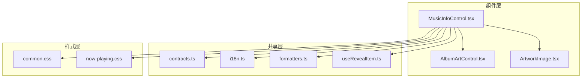
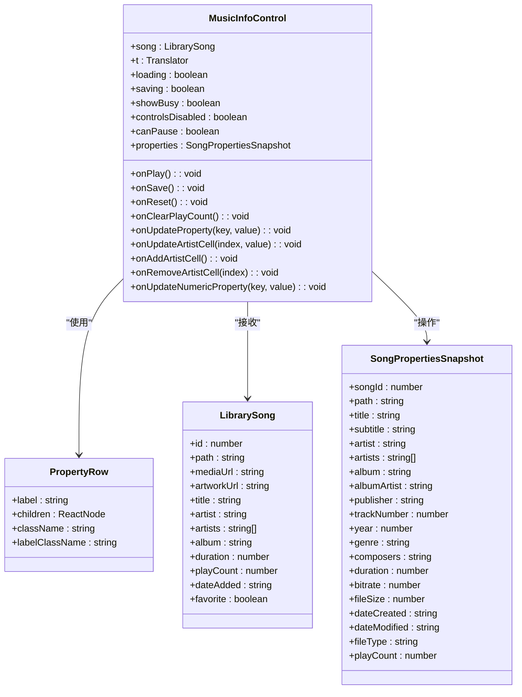
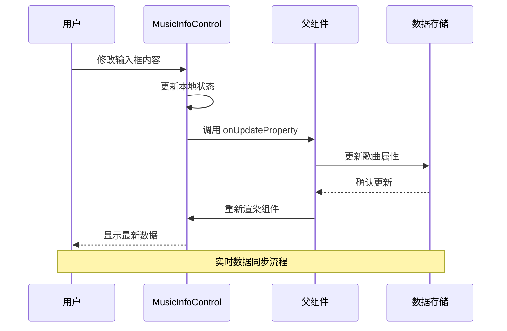
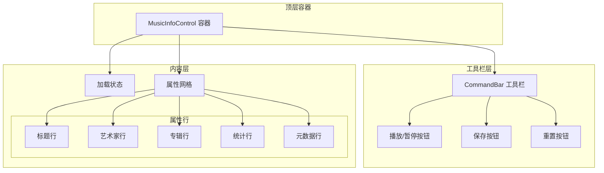
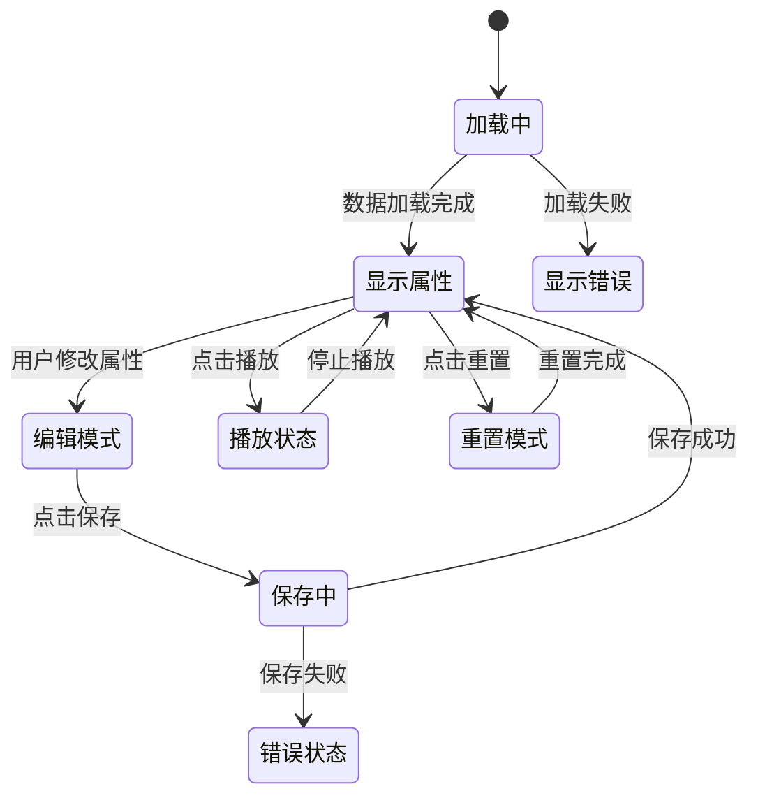
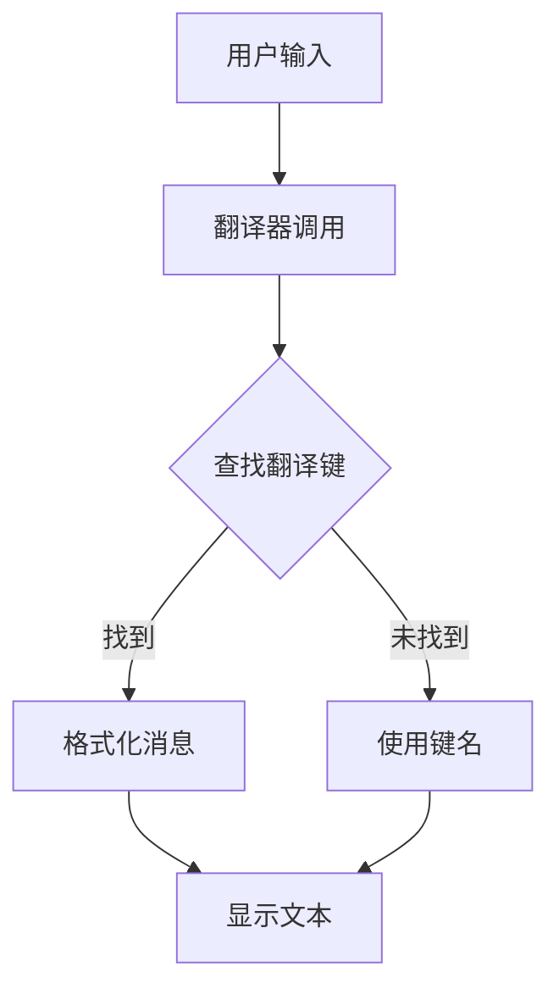
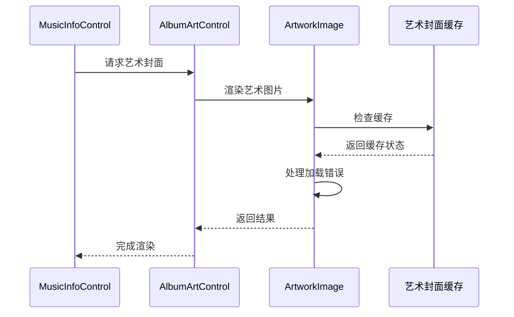
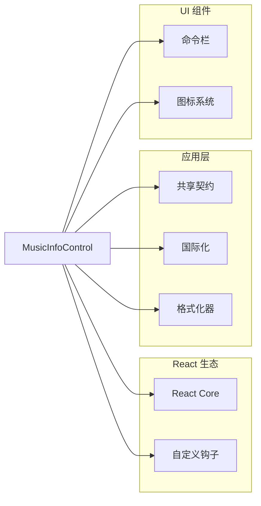
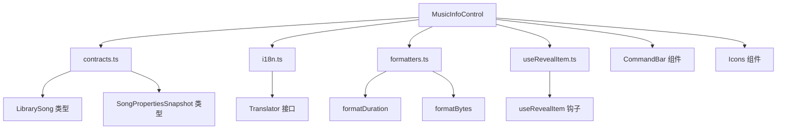
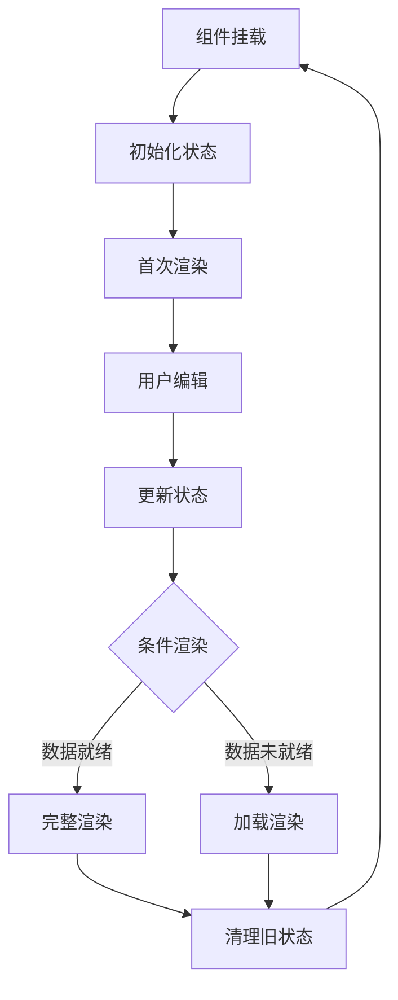

# 音乐信息展示组件

<cite>
**本文档引用的文件**
- [MusicInfoControl.tsx](file://src/components/MusicInfoControl.tsx)
- [contracts.ts](file://src/shared/contracts.ts)
- [i18n.ts](file://src/shared/i18n.ts)
- [formatters.ts](file://src/shared/formatters.ts)
- [useRevealItem.ts](file://src/hooks/useRevealItem.ts)
- [ArtworkImage.tsx](file://src/components/ArtworkImage.tsx)
- [AlbumArtControl.tsx](file://src/components/AlbumArtControl.tsx)
- [common.css](file://src/styles/common.css)
- [now-playing.css](file://src/styles/now-playing.css)
</cite>

## 目录
1. [简介](#简介)
2. [项目结构](#项目结构)
3. [核心组件](#核心组件)
4. [架构概览](#架构概览)
5. [详细组件分析](#详细组件分析)
6. [依赖关系分析](#依赖关系分析)
7. [性能考虑](#性能考虑)
8. [故障排除指南](#故障排除指南)
9. [结论](#结论)
10. [附录](#附录)

## 简介

MusicInfoControl 是 SMPlayer 中用于展示和编辑音乐元数据的核心组件。该组件提供了完整的音乐信息管理功能，包括歌曲标题、艺术家名称、专辑信息、播放统计等属性的动态显示和实时编辑。

该组件采用现代化的 React 架构设计，集成了国际化支持、响应式布局、主题切换等功能，为用户提供了直观且高效的音乐信息管理体验。

## 项目结构

MusicInfoControl 组件在项目中的位置和相关文件组织如下：



**图表来源**
- [MusicInfoControl.tsx:1-155](file://src/components/MusicInfoControl.tsx#L1-L155)
- [contracts.ts:253-274](file://src/shared/contracts.ts#L253-L274)
- [i18n.ts:1-49](file://src/shared/i18n.ts#L1-L49)

**章节来源**
- [MusicInfoControl.tsx:1-155](file://src/components/MusicInfoControl.tsx#L1-L155)
- [contracts.ts:1-664](file://src/shared/contracts.ts#L1-L664)

## 核心组件

### 组件架构设计

MusicInfoControl 采用函数式组件设计，通过 props 接口实现清晰的组件边界：



**图表来源**
- [MusicInfoControl.tsx:31-67](file://src/components/MusicInfoControl.tsx#L31-L67)
- [contracts.ts:36-49](file://src/shared/contracts.ts#L36-L49)
- [contracts.ts:253-274](file://src/shared/contracts.ts#L253-L274)

### 数据绑定机制

组件实现了双向数据绑定，通过回调函数实现数据流控制：



**图表来源**
- [MusicInfoControl.tsx:87-150](file://src/components/MusicInfoControl.tsx#L87-L150)

**章节来源**
- [MusicInfoControl.tsx:31-155](file://src/components/MusicInfoControl.tsx#L31-L155)
- [contracts.ts:253-274](file://src/shared/contracts.ts#L253-L274)

## 架构概览

### 组件层次结构



**图表来源**
- [MusicInfoControl.tsx:71-155](file://src/components/MusicInfoControl.tsx#L71-L155)

### 状态管理流程



**图表来源**
- [MusicInfoControl.tsx:31-155](file://src/components/MusicInfoControl.tsx#L31-L155)

## 详细组件分析

### 属性编辑系统

组件支持多种类型的属性编辑，包括文本、数字和标签列表：

| 属性类型 | 控制器 | 格式化 | 验证 |
|---------|--------|--------|------|
| 文本属性 | 输入框 | 直接显示 | 字符串验证 |
| 数字属性 | 数字输入框 | 格式化显示 | 数值范围检查 |
| 标签列表 | 分隔符 | 国际化分隔符 | 逗号分隔 |
| 艺术家列表 | 动态网格 | 最大6个单元格 | 重复值检查 |

### 国际化支持

组件完全支持多语言环境，通过翻译器接口实现：



**图表来源**
- [i18n.ts:29-48](file://src/shared/i18n.ts#L29-L48)
- [MusicInfoControl.tsx:68](file://src/components/MusicInfoControl.tsx#L68)

### 艺术封面集成

组件与艺术封面系统深度集成，支持动态加载和错误处理：



**图表来源**
- [AlbumArtControl.tsx:18-36](file://src/components/AlbumArtControl.tsx#L18-L36)
- [ArtworkImage.tsx:13-32](file://src/components/ArtworkImage.tsx#L13-L32)

**章节来源**
- [MusicInfoControl.tsx:12-155](file://src/components/MusicInfoControl.tsx#L12-L155)
- [i18n.ts:1-49](file://src/shared/i18n.ts#L1-49)
- [ArtworkImage.tsx:1-32](file://src/components/ArtworkImage.tsx#L1-L32)
- [AlbumArtControl.tsx:1-36](file://src/components/AlbumArtControl.tsx#L1-L36)

## 依赖关系分析

### 外部依赖

组件依赖于以下外部模块：



**图表来源**
- [MusicInfoControl.tsx:1-8](file://src/components/MusicInfoControl.tsx#L1-L8)

### 内部依赖关系



**图表来源**
- [MusicInfoControl.tsx:31-67](file://src/components/MusicInfoControl.tsx#L31-L67)
- [contracts.ts:36-274](file://src/shared/contracts.ts#L36-L274)

**章节来源**
- [MusicInfoControl.tsx:1-155](file://src/components/MusicInfoControl.tsx#L1-L155)
- [contracts.ts:1-664](file://src/shared/contracts.ts#L1-L664)

## 性能考虑

### 渲染优化

组件采用了多项性能优化策略：

1. **条件渲染**: 使用 `loading` 和 `!properties` 条件判断避免不必要的渲染
2. **状态分离**: 将艺术家列表分割为最多6个单元格，限制渲染复杂度
3. **懒加载**: 艺术封面采用懒加载机制，减少初始渲染时间

### 内存管理



**图表来源**
- [MusicInfoControl.tsx:80-84](file://src/components/MusicInfoControl.tsx#L80-L84)

### 缓存机制

组件利用了浏览器的自动缓存机制和应用层的缓存策略：

- **艺术封面缓存**: 通过 `ArtworkImage` 组件实现错误处理和缓存失效
- **翻译缓存**: `createTranslator` 函数返回的翻译器实例可重复使用
- **格式化缓存**: `formatDuration` 和 `formatBytes` 函数使用纯函数设计

**章节来源**
- [ArtworkImage.tsx:13-32](file://src/components/ArtworkImage.tsx#L13-L32)
- [i18n.ts:29-37](file://src/shared/i18n.ts#L29-L37)
- [formatters.ts:1-28](file://src/shared/formatters.ts#L1-L28)

## 故障排除指南

### 常见问题诊断

| 问题类型 | 症状 | 可能原因 | 解决方案 |
|---------|------|----------|----------|
| 加载失败 | 显示加载状态 | 网络连接问题 | 检查网络连接，重试加载 |
| 保存失败 | 保存按钮禁用 | 数据验证失败 | 检查输入数据格式 |
| 艺术封面不显示 | 默认封面显示 | 图片加载错误 | 检查图片路径，清除缓存 |
| 国际化文本异常 | 显示键名而非翻译 | 翻译文件缺失 | 检查翻译配置，重启应用 |

### 调试技巧

1. **开发者工具**: 使用 React DevTools 检查组件状态
2. **日志输出**: 在关键函数中添加 console.log 输出
3. **状态检查**: 验证 `SongPropertiesSnapshot` 数据完整性
4. **网络监控**: 检查 API 调用和响应时间

**章节来源**
- [MusicInfoControl.tsx:80-84](file://src/components/MusicInfoControl.tsx#L80-L84)
- [ArtworkImage.tsx:25-28](file://src/components/ArtworkImage.tsx#L25-L28)

## 结论

MusicInfoControl 组件展现了现代 React 应用的最佳实践，通过清晰的架构设计、完善的国际化支持和优秀的性能优化，为用户提供了出色的音乐信息管理体验。

该组件的主要优势包括：
- **模块化设计**: 清晰的职责分离和接口定义
- **国际化支持**: 完整的多语言解决方案
- **性能优化**: 多层次的渲染和内存优化策略
- **用户体验**: 直观的界面和流畅的交互

## 附录

### 使用示例

```typescript
// 基本使用示例
<MusicInfoControl
  song={currentSong}
  t={translator}
  loading={isLoading}
  saving={isSaving}
  showBusy={showProgress}
  controlsDisabled={disableControls}
  canPause={canPause}
  properties={songProperties}
  onPlay={handlePlay}
  onSave={handleSave}
  onReset={handleReset}
  onClearPlayCount={handleClearPlayCount}
  onUpdateProperty={handleUpdateProperty}
  onUpdateArtistCell={handleUpdateArtistCell}
  onAddArtistCell={handleAddArtistCell}
  onRemoveArtistCell={handleRemoveArtistCell}
  onUpdateNumericProperty={handleUpdateNumericProperty}
/>
```

### 最佳实践

1. **状态管理**: 使用受控组件模式管理表单状态
2. **错误处理**: 实现全面的错误捕获和用户反馈
3. **性能监控**: 定期检查渲染性能和内存使用
4. **测试覆盖**: 为关键功能编写单元测试和集成测试