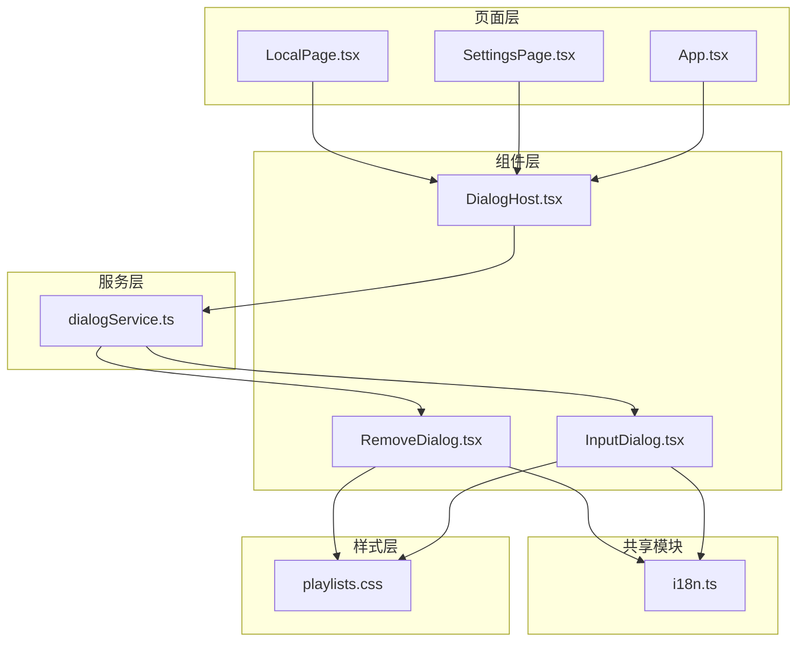
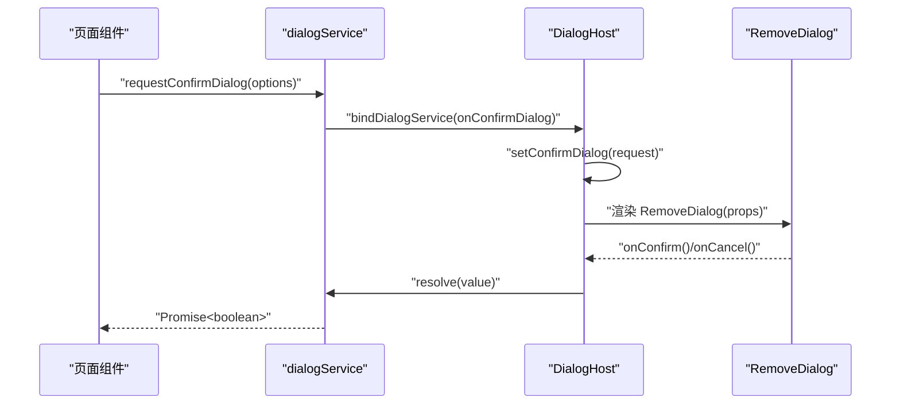
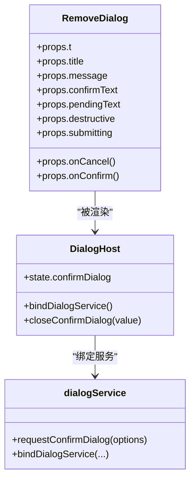
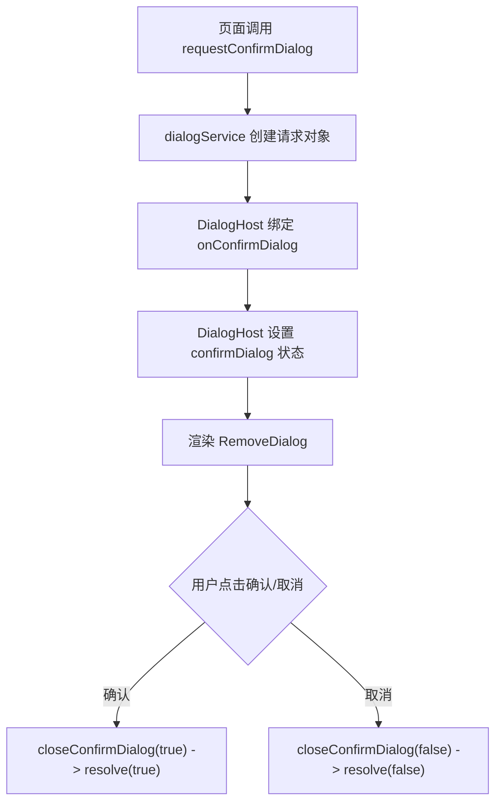
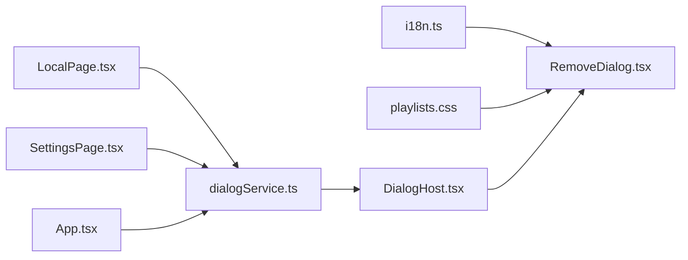

# 删除确认对话框

<cite>
**本文档引用的文件**
- [RemoveDialog.tsx](file://src/components/RemoveDialog.tsx)
- [dialogService.ts](file://src/components/dialogService.ts)
- [DialogHost.tsx](file://src/components/DialogHost.tsx)
- [i18n.ts](file://src/shared/i18n.ts)
- [playlists.css](file://src/styles/playlists.css)
- [InputDialog.tsx](file://src/components/InputDialog.tsx)
- [useDeleteLocalItems.ts](file://src/hooks/useDeleteLocalItems.ts)
- [useDeleteSongFromDisk.ts](file://src/hooks/useDeleteSongFromDisk.ts)
- [LocalPage.tsx](file://src/pages/LocalPage.tsx)
- [SettingsPage.tsx](file://src/pages/SettingsPage.tsx)
- [App.tsx](file://src/App.tsx)
</cite>

## 目录
1. [简介](#简介)
2. [项目结构](#项目结构)
3. [核心组件](#核心组件)
4. [架构总览](#架构总览)
5. [详细组件分析](#详细组件分析)
6. [依赖关系分析](#依赖关系分析)
7. [性能考量](#性能考量)
8. [故障排除指南](#故障排除指南)
9. [结论](#结论)
10. [附录](#附录)

## 简介
本文件针对 SMPlayer 中的删除确认对话框组件 RemoveDialog 进行系统化技术文档编写，覆盖其实现原理、设计考虑、配置选项、安全机制、交互行为以及与应用其他模块的集成方式。RemoveDialog 是一个通用的确认型对话框，用于在执行不可逆或高风险操作（如删除本地歌曲、导入数据等）前进行用户确认，确保操作的安全性与可撤销性。

## 项目结构
RemoveDialog 组件位于前端组件层，配合全局对话框服务与国际化模块共同工作，并通过样式文件实现一致的视觉与无障碍体验。其典型使用路径如下：
- 全局对话框服务：负责接收来自各页面的确认请求并统一渲染对应对话框
- 对话框宿主：根据当前状态渲染具体对话框（如 RemoveDialog）
- 组件层：RemoveDialog 提供确认对话框的 UI 与交互逻辑
- 国际化：通过 Translator 提供多语言支持
- 样式层：统一的输入对话框样式与删除类按钮样式

**图表来源**
- [DialogHost.tsx:1-55](file://src/components/DialogHost.tsx#L1-L55)
- [dialogService.ts:1-42](file://src/components/dialogService.ts#L1-L42)
- [RemoveDialog.tsx:1-49](file://src/components/RemoveDialog.tsx#L1-L49)
- [InputDialog.tsx:1-105](file://src/components/InputDialog.tsx#L1-L105)
- [i18n.ts:1-49](file://src/shared/i18n.ts#L1-L49)
- [playlists.css:40-208](file://src/styles/playlists.css#L40-L208)

**章节来源**
- [DialogHost.tsx:1-55](file://src/components/DialogHost.tsx#L1-L55)
- [dialogService.ts:1-42](file://src/components/dialogService.ts#L1-L42)
- [RemoveDialog.tsx:1-49](file://src/components/RemoveDialog.tsx#L1-L49)
- [InputDialog.tsx:1-105](file://src/components/InputDialog.tsx#L1-L105)
- [i18n.ts:1-49](file://src/shared/i18n.ts#L1-L49)
- [playlists.css:40-208](file://src/styles/playlists.css#L40-L208)

## 核心组件
- RemoveDialog：提供删除类确认对话框的 UI 与交互，支持破坏性操作样式、提交态与文案切换、禁用态与无障碍属性等
- dialogService：提供请求型对话框的统一入口，包含文本对话框与确认对话框两类请求类型
- DialogHost：作为对话框宿主，绑定服务并根据当前请求渲染对应对话框
- i18n：提供多语言翻译能力，确保标题、消息、确认/取消文案的本地化
- playlists.css：定义输入对话框与删除对话框的样式规范，包括删除按钮的危险色与夜间模式适配

关键特性
- 破坏性操作样式：通过 destructive 参数控制是否应用删除类按钮样式
- 提交态反馈：submitting 控制按钮禁用与加载动画，pendingText 可在提交时替换显示文案
- 无障碍支持：对话框角色、模态属性、标题与消息的语义化标签
- 国际化集成：confirmText 默认从翻译器解析，cancel 文案同样来自翻译器

**章节来源**
- [RemoveDialog.tsx:3-48](file://src/components/RemoveDialog.tsx#L3-L48)
- [dialogService.ts:10-15](file://src/components/dialogService.ts#L10-L15)
- [DialogHost.tsx:4-52](file://src/components/DialogHost.tsx#L4-L52)
- [i18n.ts:29-37](file://src/shared/i18n.ts#L29-L37)
- [playlists.css:148-162](file://src/styles/playlists.css#L148-L162)

## 架构总览
RemoveDialog 的调用链路遵循“请求-宿主-渲染”的模式，所有确认型对话框由 DialogHost 统一管理，通过 dialogService 的请求接口触发。

**图表来源**
- [dialogService.ts:20-41](file://src/components/dialogService.ts#L20-L41)
- [DialogHost.tsx:8-27](file://src/components/DialogHost.tsx#L8-L27)
- [RemoveDialog.tsx:24-47](file://src/components/RemoveDialog.tsx#L24-L47)

**章节来源**
- [dialogService.ts:1-42](file://src/components/dialogService.ts#L1-L42)
- [DialogHost.tsx:1-55](file://src/components/DialogHost.tsx#L1-L55)
- [RemoveDialog.tsx:1-49](file://src/components/RemoveDialog.tsx#L1-L49)

## 详细组件分析

### RemoveDialog 组件
- 职责：渲染删除确认对话框，提供确认与取消按钮，支持破坏性样式、提交态与无障碍属性
- 关键 props
  - t：翻译器函数，用于本地化文案
  - title：对话框标题
  - message：提示消息
  - confirmText：确认按钮文案，默认从翻译器解析
  - pendingText：提交态下的按钮文案，未提供时回退到 confirmText
  - destructive：是否应用破坏性样式（红色按钮）
  - submitting：是否处于提交态（禁用按钮、显示加载动画）
  - onCancel/onConfirm：回调函数
- 无障碍与交互
  - 对话框容器具备 role="dialog"、aria-modal、aria-labelledby 等属性
  - 确认按钮在提交态禁用并显示加载动画，同时设置 aria-busy
  - 取消按钮在提交态同样禁用
- 样式要点
  - 删除类按钮样式通过 .remove-dialog-primary 应用
  - 夜间模式下删除按钮颜色适配

**图表来源**
- [RemoveDialog.tsx:3-23](file://src/components/RemoveDialog.tsx#L3-L23)
- [DialogHost.tsx:8-27](file://src/components/DialogHost.tsx#L8-L27)
- [dialogService.ts:20-41](file://src/components/dialogService.ts#L20-L41)

**章节来源**
- [RemoveDialog.tsx:1-49](file://src/components/RemoveDialog.tsx#L1-L49)
- [playlists.css:148-162](file://src/styles/playlists.css#L148-L162)

### 对话框服务与宿主
- dialogService
  - 定义 ConfirmDialogRequest 接口，包含 title、message、confirmText 与 resolve
  - 提供 requestConfirmDialog 方法返回 Promise<boolean>
  - 通过 bindDialogService 将 onConfirmDialog 绑定到全局
- DialogHost
  - 初始化时绑定服务，维护 confirmDialog 状态
  - 渲染 RemoveDialog 并传递回调，最终 resolve 布尔值

**图表来源**
- [dialogService.ts:31-41](file://src/components/dialogService.ts#L31-L41)
- [DialogHost.tsx:12-27](file://src/components/DialogHost.tsx#L12-L27)

**章节来源**
- [dialogService.ts:1-42](file://src/components/dialogService.ts#L1-L42)
- [DialogHost.tsx:1-55](file://src/components/DialogHost.tsx#L1-L55)

### 国际化与样式
- 国际化
  - 使用 Translator 解析 confirm/cancel 等文案
  - 支持英文与中文两种语言环境
- 样式
  - 输入对话框统一样式，删除类按钮采用 .remove-dialog-primary
  - 夜间模式下删除按钮颜色适配

**章节来源**
- [i18n.ts:29-37](file://src/shared/i18n.ts#L29-L37)
- [playlists.css:148-162](file://src/styles/playlists.css#L148-L162)

### 与删除钩子的协作
- useDeleteLocalItems/useDeleteSongFromDisk
  - 在删除操作完成后，通过可撤销通知展示删除结果，并提供撤销与提交操作
  - 与 RemoveDialog 的“二次确认”形成闭环：先弹出 RemoveDialog 确认，再通过通知提供撤销机会

**章节来源**
- [useDeleteLocalItems.ts:1-26](file://src/hooks/useDeleteLocalItems.ts#L1-L26)
- [useDeleteSongFromDisk.ts:1-27](file://src/hooks/useDeleteSongFromDisk.ts#L1-L27)

## 依赖关系分析
- RemoveDialog 依赖
  - i18n：用于本地化文案
  - 样式：playlists.css 提供统一的输入对话框与删除按钮样式
- DialogHost 依赖
  - dialogService：统一管理对话框请求
  - RemoveDialog：作为渲染目标之一
- 页面层依赖
  - LocalPage、SettingsPage、App 等页面通过 requestConfirmDialog 触发 RemoveDialog

**图表来源**
- [i18n.ts:1-49](file://src/shared/i18n.ts#L1-L49)
- [playlists.css:40-208](file://src/styles/playlists.css#L40-L208)
- [dialogService.ts:1-42](file://src/components/dialogService.ts#L1-L42)
- [DialogHost.tsx:1-55](file://src/components/DialogHost.tsx#L1-L55)
- [RemoveDialog.tsx:1-49](file://src/components/RemoveDialog.tsx#L1-L49)
- [LocalPage.tsx:1551-1561](file://src/pages/LocalPage.tsx#L1551-L1561)
- [SettingsPage.tsx:922-934](file://src/pages/SettingsPage.tsx#L922-L934)
- [App.tsx:1177-1193](file://src/App.tsx#L1177-L1193)

**章节来源**
- [LocalPage.tsx:1551-1561](file://src/pages/LocalPage.tsx#L1551-L1561)
- [SettingsPage.tsx:922-934](file://src/pages/SettingsPage.tsx#L922-L934)
- [App.tsx:1177-1193](file://src/App.tsx#L1177-L1193)

## 性能考量
- 渲染开销
  - RemoveDialog 结构简单，仅包含少量 DOM 节点，渲染成本低
  - DialogHost 仅在存在请求时渲染对应对话框，避免常驻内存
- 交互响应
  - 提交态通过禁用按钮与加载动画提升用户体验，避免重复提交
- 样式影响
  - 删除按钮样式与夜间模式适配由 CSS 控制，无额外 JS 计算开销

[本节为通用性能建议，不直接分析具体文件]

## 故障排除指南
- 确认对话框未出现
  - 检查是否正确调用 requestConfirmDialog 并传入 title 与 message
  - 确认 DialogHost 已挂载且已绑定服务
- 确认按钮无法点击
  - 若 submitting 为 true，按钮会被禁用；检查调用方是否正确处理异步流程
- 文案未本地化
  - 确保 t 函数正确传入，且 i18n 字典包含对应键
- 删除按钮样式异常
  - 检查是否正确传入 destructive；夜间模式下样式由 CSS 自动适配

**章节来源**
- [dialogService.ts:31-41](file://src/components/dialogService.ts#L31-L41)
- [DialogHost.tsx:12-27](file://src/components/DialogHost.tsx#L12-L27)
- [RemoveDialog.tsx:33-43](file://src/components/RemoveDialog.tsx#L33-L43)
- [i18n.ts:29-37](file://src/shared/i18n.ts#L29-L37)
- [playlists.css:148-162](file://src/styles/playlists.css#L148-L162)

## 结论
RemoveDialog 通过简洁的组件设计、完善的无障碍支持与统一的服务化调用，为 SMPlayer 提供了安全可靠的删除确认体验。结合 dialogService 与 DialogHost 的统一管理，以及 i18n 与样式系统的协同，该组件在功能与可用性上均达到较高水准。对于不可逆或高风险操作，建议始终使用 RemoveDialog 进行二次确认，并在成功后提供可撤销的通知机制，以进一步增强安全性与用户体验。

[本节为总结性内容，不直接分析具体文件]

## 附录

### 配置选项与参数说明
- t：Translator，用于本地化标题、消息与按钮文案
- title：string，对话框标题
- message：string，提示消息
- confirmText：string，确认按钮文案，默认从翻译器解析
- pendingText：string，提交态下的按钮文案，未提供时回退到 confirmText
- destructive：boolean，是否应用破坏性样式（红色按钮）
- submitting：boolean，是否处于提交态（禁用按钮、显示加载动画）
- onCancel：() => void，取消回调
- onConfirm：() => void，确认回调

**章节来源**
- [RemoveDialog.tsx:3-23](file://src/components/RemoveDialog.tsx#L3-L23)

### 安全机制与最佳实践
- 二次确认：通过 RemoveDialog 弹窗进行二次确认，降低误操作风险
- 不可恢复操作警告：在 message 中明确提示操作后果
- 批量删除处理：结合 useDeleteLocalItems/useDeleteSongFromDisk，在删除后提供可撤销通知
- 提交态保护：通过 submitting 防止重复提交

**章节来源**
- [useDeleteLocalItems.ts:11-24](file://src/hooks/useDeleteLocalItems.ts#L11-L24)
- [useDeleteSongFromDisk.ts:12-24](file://src/hooks/useDeleteSongFromDisk.ts#L12-L24)
- [RemoveDialog.tsx:33-43](file://src/components/RemoveDialog.tsx#L33-L43)

### 交互设计与无障碍
- 键盘快捷键：与输入对话框类似，可通过 Enter 确认、Esc 取消（确认对话框的键盘行为需在业务层配合）
- 视觉反馈：加载动画、禁用态、破坏性样式
- 无障碍属性：role="dialog"、aria-modal、aria-labelledby、aria-busy

**章节来源**
- [InputDialog.tsx:76-82](file://src/components/InputDialog.tsx#L76-L82)
- [RemoveDialog.tsx:27-43](file://src/components/RemoveDialog.tsx#L27-L43)

### 使用示例与集成方法
- 在页面中触发确认对话框
  - LocalPage：在需要删除时渲染 RemoveDialog
  - SettingsPage：导入数据前弹出确认
  - App：智能艺术家修复等场景
- 与服务集成
  - 通过 requestConfirmDialog 发起请求，DialogHost 统一渲染
- 处理删除失败
  - 在 onConfirm 中执行删除逻辑，若失败则保持对话框打开或显示错误提示
  - 成功后通过可撤销通知提供撤销与提交操作

**章节来源**
- [LocalPage.tsx:1551-1561](file://src/pages/LocalPage.tsx#L1551-L1561)
- [SettingsPage.tsx:922-934](file://src/pages/SettingsPage.tsx#L922-L934)
- [App.tsx:1177-1193](file://src/App.tsx#L1177-L1193)
- [dialogService.ts:31-41](file://src/components/dialogService.ts#L31-L41)
- [DialogHost.tsx:43-52](file://src/components/DialogHost.tsx#L43-L52)