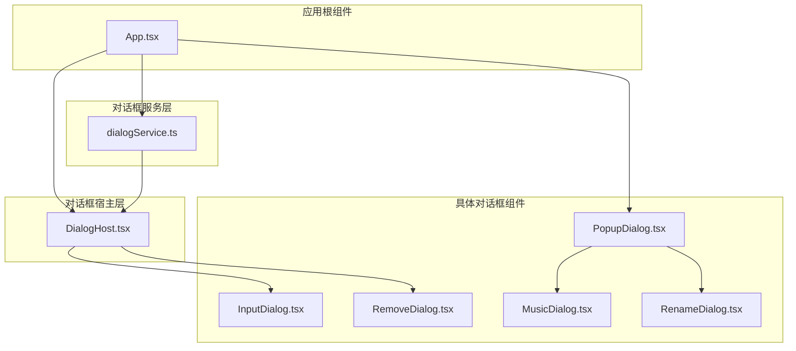
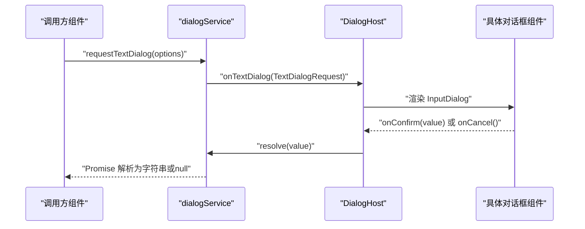
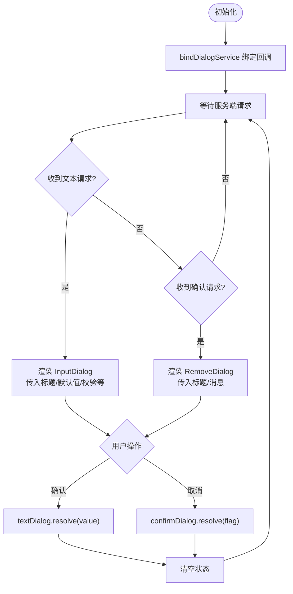
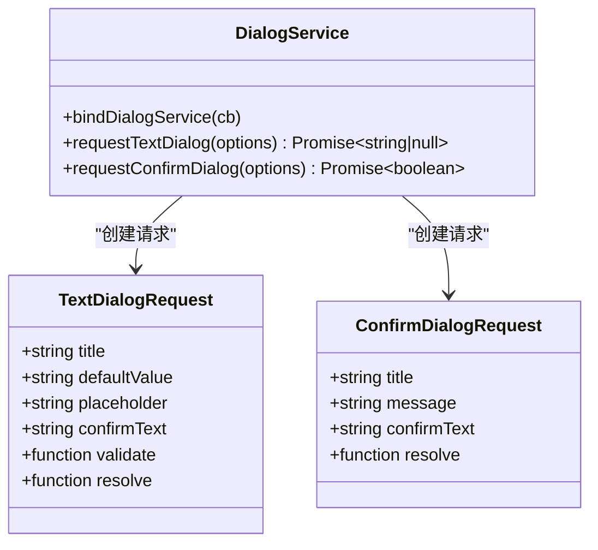
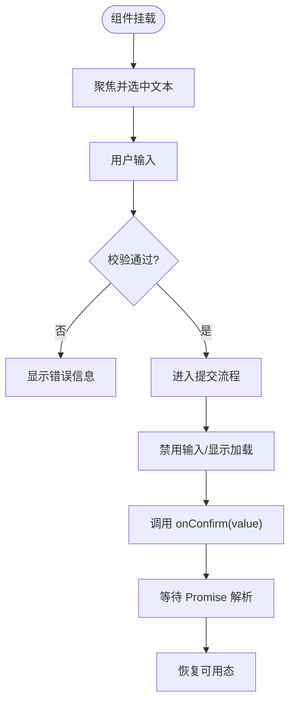
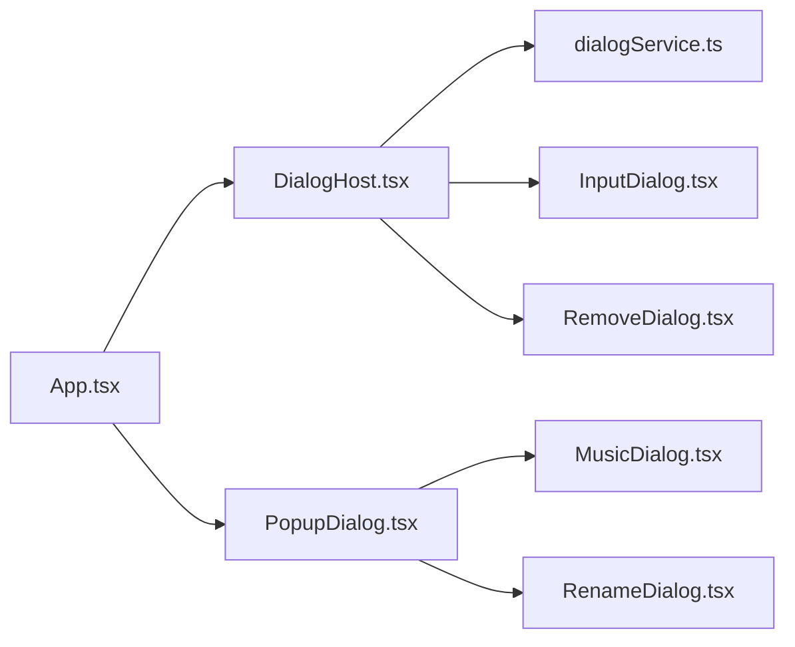
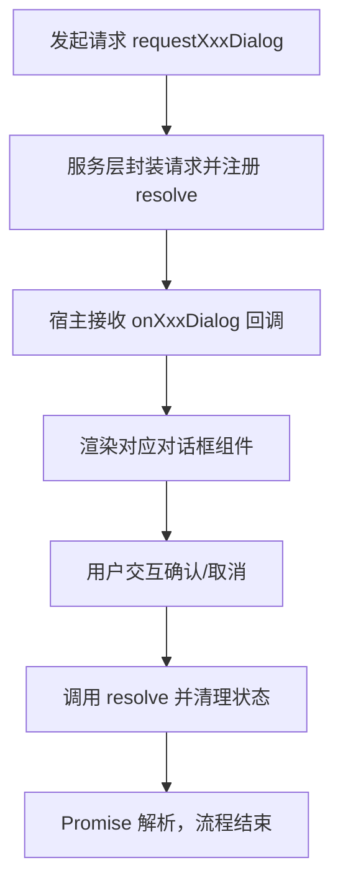

# 对话框宿主组件

<cite>
**本文引用的文件**
- [DialogHost.tsx](file://src/components/DialogHost.tsx)
- [dialogService.ts](file://src/components/dialogService.ts)
- [InputDialog.tsx](file://src/components/InputDialog.tsx)
- [RemoveDialog.tsx](file://src/components/RemoveDialog.tsx)
- [popupDialogStack.ts](file://src/components/popupDialogStack.ts)
- [PopupDialog.tsx](file://src/components/PopupDialog.tsx)
- [MusicDialog.tsx](file://src/components/MusicDialog.tsx)
- [RenameDialog.tsx](file://src/components/RenameDialog.tsx)
- [HeaderedPlaylistControl.tsx](file://src/components/HeaderedPlaylistControl.tsx)
- [App.tsx](file://src/App.tsx)
- [FolderUpdateResultDialog.tsx](file://src/pages/FolderUpdateResultDialog.tsx)
</cite>

## 目录
1. [简介](#简介)
2. [项目结构](#项目结构)
3. [核心组件](#核心组件)
4. [架构总览](#架构总览)
5. [详细组件分析](#详细组件分析)
6. [依赖关系分析](#依赖关系分析)
7. [性能考量](#性能考量)
8. [故障排查指南](#故障排查指南)
9. [结论](#结论)
10. [附录](#附录)

## 简介
本文件系统性阐述 SMPlayer 中“对话框宿主组件”的架构与实现，重点覆盖以下方面：
- 对话框容器的作用与渲染策略
- 模态遮罩与层级管理机制
- dialogService 对话框服务的 API 设计与使用方式
- 对话框生命周期管理（创建、显示、关闭、销毁）
- 数据传递与回调处理（Promise 异步模型、参数与结果）
- 实际使用示例与最佳实践

## 项目结构
对话框体系由“服务层 + 宿主层 + 具体对话框组件”三层构成：
- 服务层：dialogService 提供统一的请求入口与 Promise 化的异步交互
- 宿主层：DialogHost 将服务层请求映射到具体 UI 组件，负责状态与生命周期
- UI 层：InputDialog、RemoveDialog 等具体对话框组件，负责交互与验证

图表来源
- [App.tsx:1-200](file://src/App.tsx#L1-L200)
- [DialogHost.tsx:1-56](file://src/components/DialogHost.tsx#L1-L56)
- [dialogService.ts:1-42](file://src/components/dialogService.ts#L1-L42)
- [InputDialog.tsx:1-105](file://src/components/InputDialog.tsx#L1-L105)
- [RemoveDialog.tsx:1-49](file://src/components/RemoveDialog.tsx#L1-L49)
- [PopupDialog.tsx:1-282](file://src/components/PopupDialog.tsx#L1-L282)
- [MusicDialog.tsx:1-800](file://src/components/MusicDialog.tsx#L1-L800)
- [RenameDialog.tsx:1-55](file://src/components/RenameDialog.tsx#L1-L55)

章节来源
- [App.tsx:1-200](file://src/App.tsx#L1-L200)
- [DialogHost.tsx:1-56](file://src/components/DialogHost.tsx#L1-L56)
- [dialogService.ts:1-42](file://src/components/dialogService.ts#L1-L42)

## 核心组件
- DialogHost：对话框宿主，负责订阅 dialogService 的请求事件，维护当前显示的对话框状态，并在 UI 上渲染对应组件；同时负责在用户确认或取消时通过 Promise resolve 回调。
- dialogService：对话框服务，定义请求接口（文本输入、确认对话框），提供 bindDialogService 绑定方法与 requestXxxDialog Promise 化请求方法。
- InputDialog：文本输入对话框，支持默认值、占位符、校验函数、回车提交、Esc 取消等。
- RemoveDialog：删除/确认类对话框，支持危险操作样式、禁用态、加载态等。
- PopupDialog：通用弹窗容器，提供拖拽、滚动穿透控制、遮罩点击关闭、无障碍属性等能力。
- MusicDialog：音乐信息编辑对话框，内部组合 dialogService 进行二次确认等交互。
- RenameDialog：重命名对话框，基于 InputDialog 并内置名称合法性校验。

章节来源
- [DialogHost.tsx:1-56](file://src/components/DialogHost.tsx#L1-L56)
- [dialogService.ts:1-42](file://src/components/dialogService.ts#L1-L42)
- [InputDialog.tsx:1-105](file://src/components/InputDialog.tsx#L1-L105)
- [RemoveDialog.tsx:1-49](file://src/components/RemoveDialog.tsx#L1-L49)
- [PopupDialog.tsx:1-282](file://src/components/PopupDialog.tsx#L1-L282)
- [MusicDialog.tsx:1-800](file://src/components/MusicDialog.tsx#L1-L800)
- [RenameDialog.tsx:1-55](file://src/components/RenameDialog.tsx#L1-L55)

## 架构总览
对话框系统采用“服务驱动 + 宿主渲染”的模式：
- 业务组件通过 dialogService 发起请求，得到 Promise
- DialogHost 订阅服务，接收请求后设置状态，渲染对应对话框
- 用户交互触发回调，调用 resolve 并清理状态，完成一次完整的生命周期

图表来源
- [dialogService.ts:31-41](file://src/components/dialogService.ts#L31-L41)
- [DialogHost.tsx:12-27](file://src/components/DialogHost.tsx#L12-L27)
- [InputDialog.tsx:39-59](file://src/components/InputDialog.tsx#L39-L59)

## 详细组件分析

### DialogHost 组件
职责与行为
- 初始化阶段通过 bindDialogService 接收 onTextDialog/onConfirmDialog 回调
- 维护 textDialog/confirmDialog 两个状态，分别对应不同类型的对话框
- 渲染 InputDialog 或 RemoveDialog，并在用户确认/取消时调用 resolve，随后清空状态
- 作为全局对话框容器，确保同一时刻仅展示一个对话框

图表来源
- [DialogHost.tsx:8-55](file://src/components/DialogHost.tsx#L8-L55)

章节来源
- [DialogHost.tsx:1-56](file://src/components/DialogHost.tsx#L1-L56)

### dialogService 对话框服务
API 一览
- bindDialogService({ onTextDialog, onConfirmDialog })：注册宿主层回调
- requestTextDialog(options)：返回 Promise<string | null>
- requestConfirmDialog(options)：返回 Promise<boolean>

数据结构
- TextDialogRequest：包含标题、默认值、可选占位符、确认文案、校验函数、Promise resolve
- ConfirmDialogRequest：包含标题、消息、可选确认文案、Promise resolve

Promise 模式
- 调用 requestXxxDialog 后立即返回 Promise
- 服务内部通过 showXxxDialog 将 options 与 resolve 组合后交给宿主
- 宿主在 UI 交互完成后调用 resolve，Promise 随之解析

图表来源
- [dialogService.ts:1-42](file://src/components/dialogService.ts#L1-L42)

章节来源
- [dialogService.ts:1-42](file://src/components/dialogService.ts#L1-L42)

### InputDialog 文本对话框
功能要点
- 自动聚焦与全选
- 输入变更实时校验，错误信息展示
- 支持 Enter 提交、Esc 取消
- 提交过程中禁用输入并显示加载态
- 通过 onConfirm/onCancel 回调与宿主通信

图表来源
- [InputDialog.tsx:30-59](file://src/components/InputDialog.tsx#L30-L59)

章节来源
- [InputDialog.tsx:1-105](file://src/components/InputDialog.tsx#L1-L105)

### RemoveDialog 确认对话框
功能要点
- 展示标题与消息
- 危险操作样式（可配置）
- 支持提交中禁用与加载态
- 通过 onConfirm/onCancel 回调与宿主通信

章节来源
- [RemoveDialog.tsx:1-49](file://src/components/RemoveDialog.tsx#L1-L49)

### PopupDialog 通用弹窗容器
功能要点
- 使用 Portal 渲染至 document.body，保证层级与遮罩效果
- 拖拽支持：工具栏区域可拖动窗口
- 滚动穿透控制：在对话框内滚动时阻止外层滚动
- 遮罩点击关闭：可配置点击遮罩是否关闭
- 无障碍属性：aria-modal、aria-labelledby 等

章节来源
- [PopupDialog.tsx:1-282](file://src/components/PopupDialog.tsx#L1-L282)

### MusicDialog 内部对话框集成
- 在保存歌词等场景，使用 requestConfirmDialog 进行二次确认
- 通过 PopupDialog 容器承载，具备导航、工具栏、关闭按钮等

章节来源
- [MusicDialog.tsx:465-474](file://src/components/MusicDialog.tsx#L465-L474)
- [PopupDialog.tsx:1-282](file://src/components/PopupDialog.tsx#L1-L282)

### RenameDialog 基于 InputDialog 的重命名对话框
- 复用 InputDialog 的输入体验
- 内置播放列表名称合法性校验逻辑

章节来源
- [RenameDialog.tsx:1-55](file://src/components/RenameDialog.tsx#L1-L55)
- [InputDialog.tsx:1-105](file://src/components/InputDialog.tsx#L1-L105)

## 依赖关系分析
- App.tsx 作为根组件，引入 DialogHost 并订阅弹窗栈深度变化，用于控制页面样式与交互
- DialogHost 依赖 dialogService 的 bindDialogService 与具体对话框组件
- 具体对话框组件（InputDialog、RemoveDialog）依赖 dialogService 的 Promise 回调
- PopupDialog 作为通用容器被 MusicDialog、RenameDialog 等复用

图表来源
- [App.tsx:1-200](file://src/App.tsx#L1-L200)
- [DialogHost.tsx:1-56](file://src/components/DialogHost.tsx#L1-L56)
- [dialogService.ts:1-42](file://src/components/dialogService.ts#L1-L42)
- [InputDialog.tsx:1-105](file://src/components/InputDialog.tsx#L1-L105)
- [RemoveDialog.tsx:1-49](file://src/components/RemoveDialog.tsx#L1-L49)
- [PopupDialog.tsx:1-282](file://src/components/PopupDialog.tsx#L1-L282)
- [MusicDialog.tsx:1-800](file://src/components/MusicDialog.tsx#L1-L800)
- [RenameDialog.tsx:1-55](file://src/components/RenameDialog.tsx#L1-L55)

章节来源
- [App.tsx:1-200](file://src/App.tsx#L1-L200)
- [DialogHost.tsx:1-56](file://src/components/DialogHost.tsx#L1-L56)
- [dialogService.ts:1-42](file://src/components/dialogService.ts#L1-L42)

## 性能考量
- 对话框渲染采用条件渲染，仅在有请求时才挂载对应组件，避免不必要的开销
- InputDialog 在提交过程中禁用输入并显示加载态，减少重复提交与无效计算
- PopupDialog 的滚动穿透控制通过精确的事件捕获与 preventDefault，降低滚动抖动
- DialogHost 通过 useState/useState 管理少量状态，避免深层重渲染

## 故障排查指南
常见问题与定位建议
- 对话框不显示
  - 检查 App.tsx 是否已引入 DialogHost
  - 确认 bindDialogService 已在 DialogHost 初始化时调用
- 用户确认无响应
  - 检查宿主 closeXxxDialog 是否调用了 resolve
  - 确认 onConfirm/onCancel 回调链路未被中断
- 输入校验无效
  - 确认 validate 函数返回空字符串表示通过
  - 检查 InputDialog 的错误信息展示逻辑
- 遮罩无法关闭或滚动穿透
  - 检查 PopupDialog 的遮罩点击与滚动事件监听
  - 确认 addPopupDialogCloseHandler 的注册与移除逻辑

章节来源
- [DialogHost.tsx:12-27](file://src/components/DialogHost.tsx#L12-L27)
- [InputDialog.tsx:39-59](file://src/components/InputDialog.tsx#L39-L59)
- [PopupDialog.tsx:104-159](file://src/components/PopupDialog.tsx#L104-L159)
- [popupDialogStack.ts:13-24](file://src/components/popupDialogStack.ts#L13-L24)

## 结论
SMPlayer 的对话框系统以 dialogService 为核心，通过 DialogHost 将请求与 UI 解耦，实现了清晰的生命周期管理与良好的用户体验。该架构易于扩展新的对话框类型，且通过 Promise 模式简化了异步交互的处理。

## 附录

### 对话框服务 API 速查
- bindDialogService({ onTextDialog, onConfirmDialog })
  - 用途：向宿主注册回调，使服务层能够触发 UI 渲染
- requestTextDialog(options)
  - 参数：标题、默认值、占位符、确认文案、校验函数
  - 返回：Promise<string | null>
- requestConfirmDialog(options)
  - 参数：标题、消息、确认文案
  - 返回：Promise<boolean>

章节来源
- [dialogService.ts:20-41](file://src/components/dialogService.ts#L20-L41)

### 生命周期流程图（从请求到结束）

图表来源
- [dialogService.ts:31-41](file://src/components/dialogService.ts#L31-L41)
- [DialogHost.tsx:19-27](file://src/components/DialogHost.tsx#L19-L27)

### 使用示例与最佳实践
- 在业务组件中发起对话框请求
  - 文本输入：参考 HeaderedPlaylistControl 中的重命名流程
  - 确认对话框：参考 MusicDialog、HeaderedPlaylistControl 等组件中的二次确认
- 正确处理 Promise 结果
  - 使用 .then 获取用户选择或输入值
  - 注意在提交过程中禁用交互，避免重复提交
- 自定义对话框
  - 基于 InputDialog/RemoveDialog 扩展
  - 若需复杂交互，可使用 PopupDialog 作为容器
- 层级与遮罩
  - 通过 App.tsx 订阅弹窗栈深度，控制页面样式
  - 使用 addPopupDialogCloseHandler 管理多层弹窗的关闭顺序

章节来源
- [HeaderedPlaylistControl.tsx:474-510](file://src/components/HeaderedPlaylistControl.tsx#L474-L510)
- [MusicDialog.tsx:465-474](file://src/components/MusicDialog.tsx#L465-L474)
- [App.tsx:130-130](file://src/App.tsx#L130-L130)
- [popupDialogStack.ts:13-24](file://src/components/popupDialogStack.ts#L13-L24)
- [InputDialog.tsx:39-59](file://src/components/InputDialog.tsx#L39-L59)
- [PopupDialog.tsx:182-280](file://src/components/PopupDialog.tsx#L182-L280)