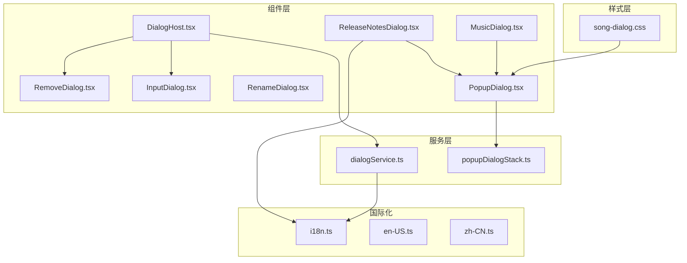
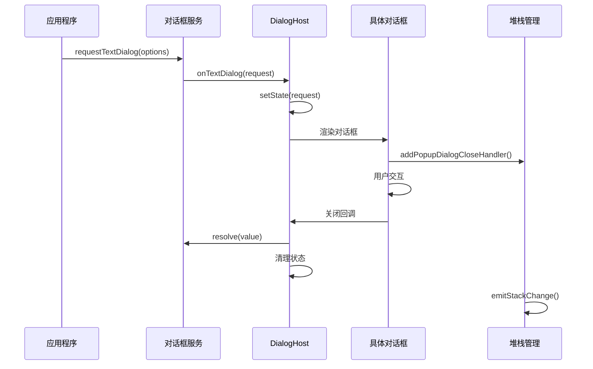
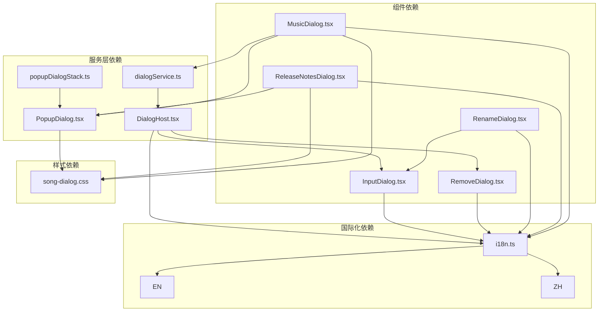

# 对话框系统

<cite>
**本文档引用的文件**
- [DialogHost.tsx](file://src/components/DialogHost.tsx)
- [dialogService.ts](file://src/components/dialogService.ts)
- [popupDialogStack.ts](file://src/components/popupDialogStack.ts)
- [InputDialog.tsx](file://src/components/InputDialog.tsx)
- [RemoveDialog.tsx](file://src/components/RemoveDialog.tsx)
- [RenameDialog.tsx](file://src/components/RenameDialog.tsx)
- [PopupDialog.tsx](file://src/components/PopupDialog.tsx)
- [ReleaseNotesDialog.tsx](file://src/components/ReleaseNotesDialog.tsx)
- [MusicDialog.tsx](file://src/components/MusicDialog.tsx)
- [i18n.ts](file://src/shared/i18n.ts)
- [en-US.ts](file://src/shared/locales/en-US.ts)
- [zh-CN.ts](file://src/shared/locales/zh-CN.ts)
- [song-dialog.css](file://src/styles/song-dialog.css)
</cite>

## 目录
1. [简介](#简介)
2. [项目结构](#项目结构)
3. [核心组件](#核心组件)
4. [架构概览](#架构概览)
5. [详细组件分析](#详细组件分析)
6. [依赖关系分析](#依赖关系分析)
7. [性能考虑](#性能考虑)
8. [故障排除指南](#故障排除指南)
9. [结论](#结论)

## 简介

SMPlayer的对话框系统是一个高度模块化和可扩展的UI组件架构，专门用于处理应用程序中的各种用户交互场景。该系统采用React组件设计，结合服务层模式和堆栈管理机制，提供了从简单输入验证到复杂多步骤操作的完整解决方案。

系统的核心设计理念包括：
- **声明式对话框管理**：通过服务层统一管理对话框的创建、显示和销毁
- **层级化堆栈控制**：支持多层对话框的有序管理和焦点控制
- **国际化支持**：完整的多语言本地化机制
- **可访问性优先**：严格遵循ARIA标准和无障碍访问规范
- **响应式设计**：适配不同屏幕尺寸和设备类型

## 项目结构

对话框系统主要分布在以下目录结构中：

**图表来源**
- [DialogHost.tsx:1-55](file://src/components/DialogHost.tsx#L1-L55)
- [dialogService.ts:1-42](file://src/components/dialogService.ts#L1-L42)
- [popupDialogStack.ts:1-48](file://src/components/popupDialogStack.ts#L1-L48)

**章节来源**
- [DialogHost.tsx:1-55](file://src/components/DialogHost.tsx#L1-L55)
- [dialogService.ts:1-42](file://src/components/dialogService.ts#L1-L42)
- [popupDialogStack.ts:1-48](file://src/components/popupDialogStack.ts#L1-L48)

## 核心组件

### DialogHost - 对话框宿主组件

DialogHost是整个对话框系统的入口点和协调中心，负责监听服务层的对话框请求并渲染相应的对话框组件。

**核心功能特性：**
- **服务绑定**：通过`bindDialogService`方法接收对话框服务回调
- **状态管理**：维护文本对话框和确认对话框的状态
- **Promise集成**：与对话框服务的Promise模式无缝对接
- **条件渲染**：根据状态动态渲染对应的对话框组件

**实现机制：**
- 使用React的useState和useEffect管理对话框状态
- 通过resolve函数处理用户交互结果
- 支持对话框的异步关闭和清理

**章节来源**
- [DialogHost.tsx:8-55](file://src/components/DialogHost.tsx#L8-L55)

### dialogService - 对话框服务

dialogService提供了统一的对话框调用接口，实现了服务层模式，使得任何组件都可以通过简单的API调用来显示对话框。

**核心接口：**
- `TextDialogRequest`：文本输入对话框请求接口
- `ConfirmDialogRequest`：确认对话框请求接口
- `bindDialogService`：服务绑定函数
- `requestTextDialog`：文本对话框请求函数
- `requestConfirmDialog`：确认对话框请求函数

**设计模式：**
- **Promise模式**：所有对话框操作都返回Promise对象
- **回调注入**：通过bindDialogService注入具体的显示逻辑
- **解耦设计**：调用方无需了解具体的对话框实现细节

**章节来源**
- [dialogService.ts:1-42](file://src/components/dialogService.ts#L1-L42)

### popupDialogStack - 弹窗堆栈管理

popupDialogStack实现了对话框的层级管理机制，确保多个对话框能够正确地堆叠和管理。

**核心功能：**
- **堆栈管理**：维护对话框关闭处理器的数组
- **事件广播**：通过自定义事件通知堆栈深度变化
- **焦点控制**：管理页面焦点和键盘事件
- **DOM类管理**：动态添加和移除body类名

**技术实现：**
- 使用闭包封装私有状态
- 通过window.dispatchEvent广播状态变化
- 支持唯一性检查和清理机制

**章节来源**
- [popupDialogStack.ts:1-48](file://src/components/popupDialogStack.ts#L1-L48)

## 架构概览

对话框系统的整体架构采用了分层设计，确保了良好的可维护性和扩展性：

**图表来源**
- [DialogHost.tsx:12-27](file://src/components/DialogHost.tsx#L12-L27)
- [dialogService.ts:31-41](file://src/components/dialogService.ts#L31-L41)
- [popupDialogStack.ts:6-11](file://src/components/popupDialogStack.ts#L6-L11)

**架构特点：**
- **单向数据流**：数据流向从服务层到UI层
- **事件驱动**：通过事件和回调实现组件间通信
- **状态隔离**：每个对话框组件维护自己的状态
- **生命周期管理**：完整的对话框生命周期控制

## 详细组件分析

### InputDialog - 输入对话框

InputDialog是最基础的对话框组件，提供了通用的输入验证和提交机制。

**核心功能：**
- **自动聚焦**：组件挂载时自动聚焦到输入框
- **实时验证**：输入时即时进行验证并显示错误信息
- **防重复提交**：通过submitting状态防止重复点击
- **键盘快捷键**：支持Enter确认和Escape取消

**验证机制：**
- 支持自定义验证函数
- 实时错误提示显示
- 验证失败时自动滚动到错误区域

**章节来源**
- [InputDialog.tsx:1-105](file://src/components/InputDialog.tsx#L1-L105)

### RemoveDialog - 删除确认对话框

RemoveDialog专门用于处理删除操作的确认流程，提供了明确的视觉反馈和安全保护。

**设计特色：**
- **破坏性操作标识**：通过destructive属性标识危险操作
- **加载状态显示**：submitting状态下显示加载指示器
- **禁用状态管理**：防止在操作过程中重复提交
- **语义化按钮**：使用button元素而非input实现

**可访问性支持：**
- 完整的ARIA属性设置
- 键盘导航支持
- 屏幕阅读器友好

**章节来源**
- [RemoveDialog.tsx:1-49](file://src/components/RemoveDialog.tsx#L1-L49)

### RenameDialog - 重命名对话框

RenameDialog继承自InputDialog，专门为播放列表重命名场景定制了特定的验证规则。

**业务逻辑：**
- **播放列表名称验证**：检查名称是否已存在
- **特殊字符过滤**：禁止使用特定的特殊字符组合
- **长度限制**：最大50个字符
- **国际化错误消息**：提供多语言的错误提示

**验证规则：**
- 必须非空且不为空白字符
- 长度不超过50个字符
- 不能与现有播放列表名称冲突
- 不允许包含"+++++"或"{0}"/"{1}"模板

**章节来源**
- [RenameDialog.tsx:1-55](file://src/components/RenameDialog.tsx#L1-L55)

### PopupDialog - 弹窗容器

PopupDialog是所有复杂对话框的基础容器，提供了丰富的交互特性和可定制选项。

**高级功能：**
- **拖拽支持**：支持窗口拖拽和工具栏拖拽
- **滚动控制**：智能处理内部滚动和外部滚动
- **触摸手势**：支持触摸设备的手势操作
- **门户渲染**：使用React Portal渲染到body末尾

**交互特性：**
- **滚轮穿透**：在对话框边界处正确处理滚轮事件
- **触摸滑动**：支持触摸滑动进行滚动
- **回退点击**：可配置的背景点击关闭
- **焦点管理**：自动管理对话框内的焦点

**章节来源**
- [PopupDialog.tsx:1-282](file://src/components/PopupDialog.tsx#L1-L282)

### ReleaseNotesDialog - 版本发布对话框

ReleaseNotesDialog展示了如何使用PopupDialog构建复杂的多段落对话框。

**实现要点：**
- **动态语言检测**：根据用户首选语言选择合适的版本
- **结构化数据展示**：使用有序列表展示版本更新内容
- **响应式布局**：适配不同屏幕尺寸的显示需求
- **国际化支持**：完整的多语言版本更新内容

**数据处理：**
- 动态加载对应语言的版本更新数据
- 条件渲染不同的标题格式
- 支持历史版本和当前版本的区分显示

**章节来源**
- [ReleaseNotesDialog.tsx:1-56](file://src/components/ReleaseNotesDialog.tsx#L1-L56)

### MusicDialog - 复杂音乐信息对话框

MusicDialog是对话框系统的综合示例，展示了如何在一个对话框中集成多种功能。

**核心功能：**
- **多模式切换**：属性、歌词、专辑封面三个视图模式
- **实时数据同步**：与后端服务保持数据同步
- **撤销通知系统**：集成撤销操作的通知机制
- **快捷键支持**：提供键盘快捷键操作

**技术实现：**
- **状态管理**：复杂的多状态管理机制
- **副作用处理**：使用useEffect处理各种副作用
- **性能优化**：使用useMemo和useCallback优化性能
- **错误处理**：完善的错误处理和用户反馈

**章节来源**
- [MusicDialog.tsx:1-800](file://src/components/MusicDialog.tsx#L1-L800)

## 依赖关系分析

对话框系统各组件之间的依赖关系如下：

**图表来源**
- [DialogHost.tsx:3-6](file://src/components/DialogHost.tsx#L3-L6)
- [PopupDialog.tsx:4-6](file://src/components/PopupDialog.tsx#L4-L6)
- [i18n.ts:1-49](file://src/shared/i18n.ts#L1-L49)

**依赖特点：**
- **单向依赖**：从服务层到UI层的单向依赖关系
- **松耦合**：组件间通过接口而非具体实现耦合
- **可测试性**：清晰的依赖关系便于单元测试
- **可扩展性**：易于添加新的对话框类型

**章节来源**
- [DialogHost.tsx:1-55](file://src/components/DialogHost.tsx#L1-L55)
- [PopupDialog.tsx:1-282](file://src/components/PopupDialog.tsx#L1-L282)

## 性能考虑

对话框系统的性能优化策略包括：

### 内存管理
- **及时清理**：对话框关闭时及时清理事件监听器和定时器
- **引用管理**：使用useRef避免不必要的重渲染
- **状态优化**：合理分割状态，避免大对象的频繁更新

### 渲染优化
- **条件渲染**：只在需要时渲染对话框组件
- **懒加载**：复杂对话框按需加载相关资源
- **虚拟化**：大量数据时使用虚拟化技术

### 事件处理
- **事件委托**：使用事件委托减少事件监听器数量
- **防抖节流**：对高频事件进行防抖节流处理
- **内存泄漏防护**：确保事件监听器在组件卸载时正确移除

## 故障排除指南

### 常见问题及解决方案

**对话框无法显示**
- 检查DialogHost是否正确渲染
- 确认dialogService已正确绑定
- 验证Promise链是否正确处理

**键盘事件不响应**
- 检查preventDefault和stopPropagation的使用
- 确认事件监听器的绑定时机
- 验证焦点管理逻辑

**堆栈管理异常**
- 检查addPopupDialogCloseHandler的调用频率
- 确认closeHandlers数组的状态
- 验证emitStackChange的触发条件

**国际化问题**
- 检查translator函数的正确性
- 确认语言包的加载状态
- 验证翻译键值的存在性

**章节来源**
- [DialogHost.tsx:19-27](file://src/components/DialogHost.tsx#L19-L27)
- [popupDialogStack.ts:13-24](file://src/components/popupDialogStack.ts#L13-L24)

## 结论

SMPlayer的对话框系统展现了现代前端应用对话框架构的最佳实践。通过服务层模式、堆栈管理机制和模块化设计，系统实现了高度的可维护性和扩展性。

**系统优势：**
- **架构清晰**：层次分明的设计便于理解和维护
- **功能完整**：覆盖了从简单输入到复杂多步骤操作的各种场景
- **用户体验优秀**：注重可访问性和响应式设计
- **国际化完善**：支持多语言环境的本地化需求

**未来改进方向：**
- 可以考虑引入对话框路由机制
- 增加对话框动画系统的统一管理
- 扩展对话框的自定义主题能力
- 加强对话框间的通信和数据共享机制

该对话框系统为SMPlayer提供了坚实的基础，支持了应用丰富的用户交互需求，并为未来的功能扩展奠定了良好的技术基础。