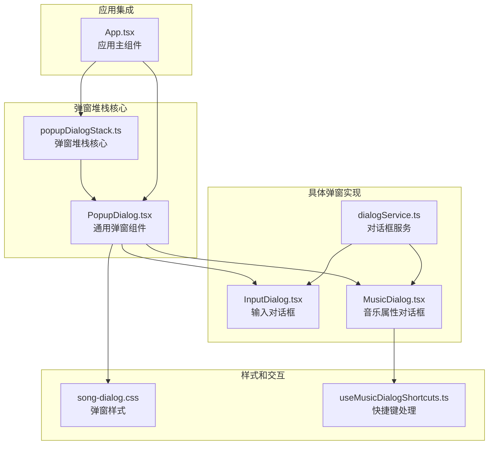
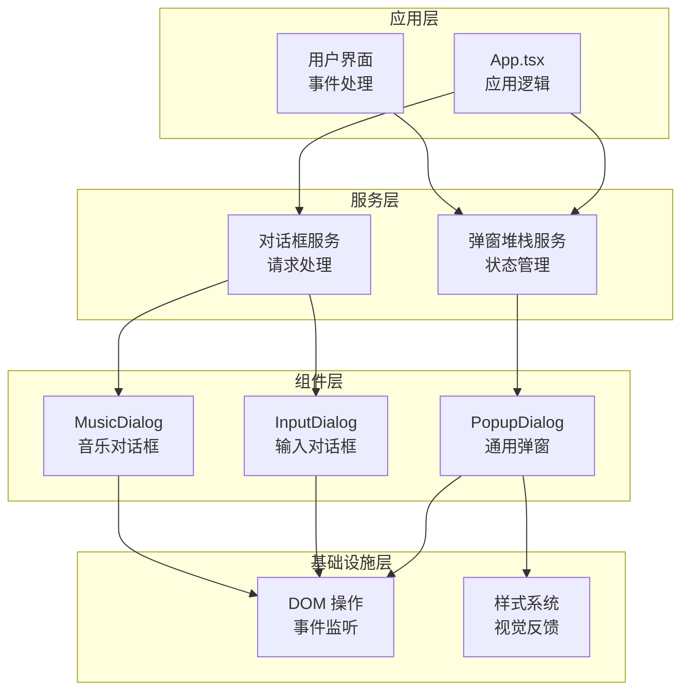
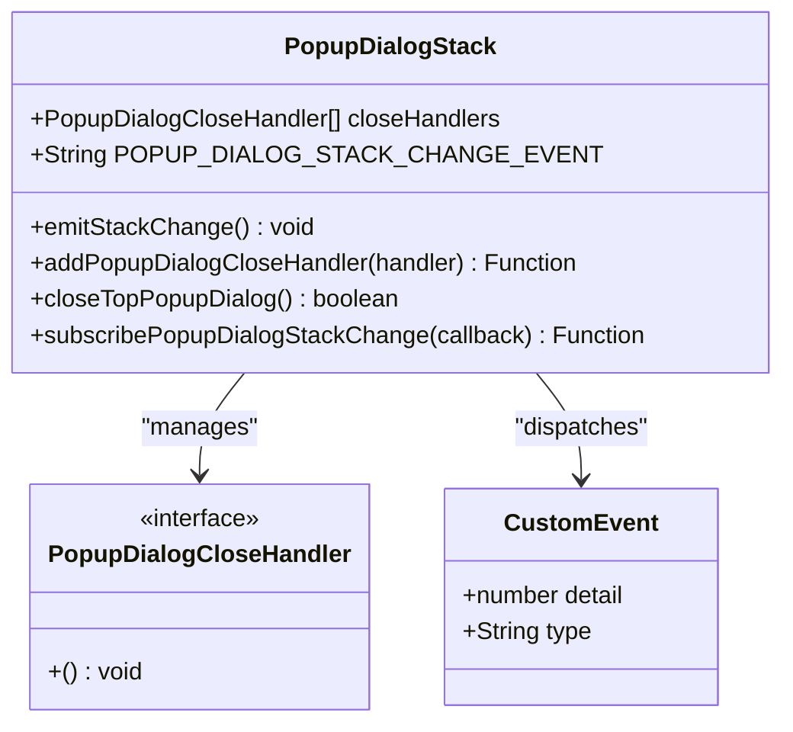
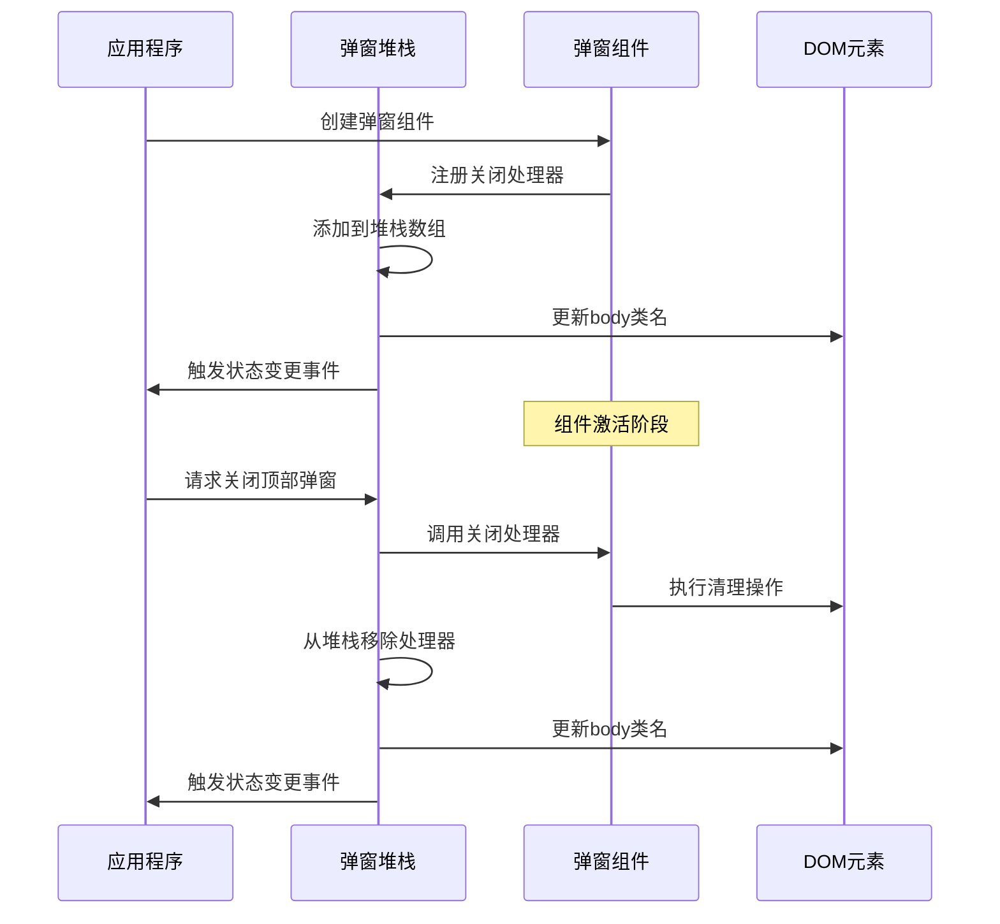
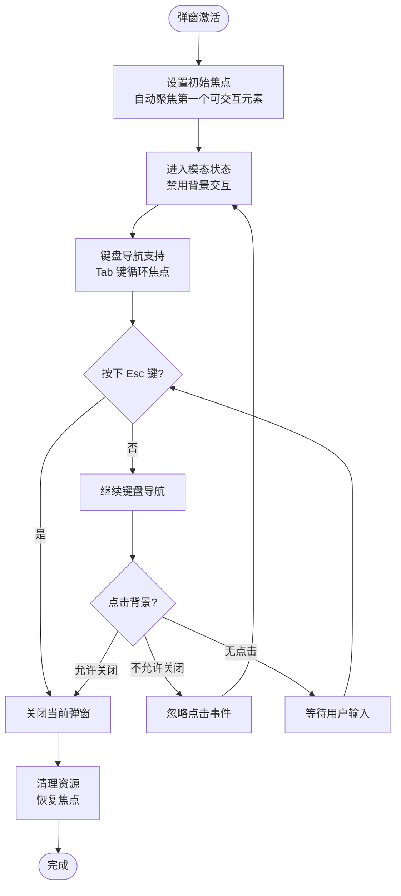
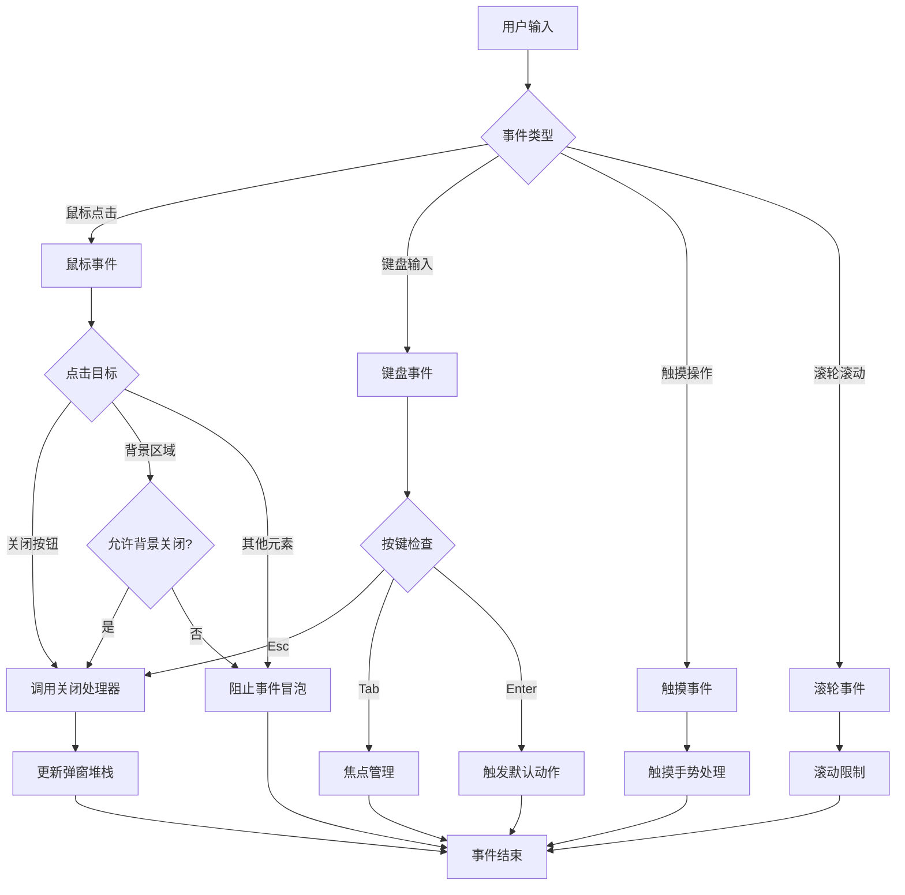
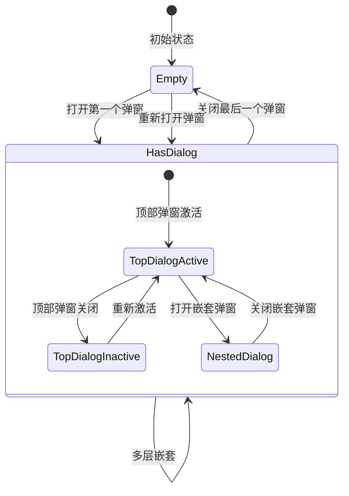
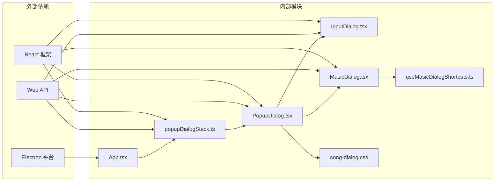

# 弹窗堆栈管理

<cite>
**本文档引用的文件**
- [popupDialogStack.ts](file://src/components/popupDialogStack.ts)
- [PopupDialog.tsx](file://src/components/PopupDialog.tsx)
- [App.tsx](file://src/App.tsx)
- [InputDialog.tsx](file://src/components/InputDialog.tsx)
- [MusicDialog.tsx](file://src/components/MusicDialog.tsx)
- [song-dialog.css](file://src/styles/song-dialog.css)
- [useMusicDialogShortcuts.ts](file://src/hooks/useMusicDialogShortcuts.ts)
- [dialogService.ts](file://src/components/dialogService.ts)
</cite>

## 目录
1. [简介](#简介)
2. [项目结构](#项目结构)
3. [核心组件](#核心组件)
4. [架构概览](#架构概览)
5. [详细组件分析](#详细组件分析)
6. [依赖关系分析](#依赖关系分析)
7. [性能考虑](#性能考虑)
8. [故障排除指南](#故障排除指南)
9. [结论](#结论)
10. [附录](#附录)

## 简介

SMPlayer 的弹窗堆栈管理系统是一个精心设计的对话框管理解决方案，它提供了多层弹窗的有序管理和状态控制。该系统通过一个全局的弹窗堆栈来跟踪所有打开的对话框，确保用户界面的一致性和可预测性。

弹窗堆栈系统的核心价值在于其简单而强大的设计模式，它将复杂的弹窗管理逻辑封装在一个单一的模块中，同时为开发者提供了清晰的 API 接口。系统支持多种弹窗类型，从简单的确认对话框到复杂的音乐属性编辑器，都能得到一致的用户体验。

## 项目结构

弹窗堆栈管理系统主要由以下关键文件组成：



**图表来源**
- [popupDialogStack.ts:1-48](file://src/components/popupDialogStack.ts#L1-L48)
- [PopupDialog.tsx:1-282](file://src/components/PopupDialog.tsx#L1-L282)
- [App.tsx:359](file://src/App.tsx#L359)

**章节来源**
- [popupDialogStack.ts:1-48](file://src/components/popupDialogStack.ts#L1-L48)
- [PopupDialog.tsx:1-282](file://src/components/PopupDialog.tsx#L1-L282)

## 核心组件

弹窗堆栈系统的核心由三个主要组件构成：

### 1. 弹窗堆栈控制器 (popupDialogStack.ts)

这是系统的核心，负责管理所有弹窗实例的生命周期。它提供了一个简洁的 API 来添加、移除和查询弹窗状态。

### 2. 通用弹窗组件 (PopupDialog.tsx)

这是一个高度可配置的弹窗容器，为所有具体的弹窗实现提供统一的基础功能，包括模态行为、焦点管理和事件处理。

### 3. 应用集成层 (App.tsx)

应用程序的入口点，负责处理系统级的弹窗操作，如键盘快捷键和导航控制。

**章节来源**
- [popupDialogStack.ts:13-47](file://src/components/popupDialogStack.ts#L13-L47)
- [PopupDialog.tsx:83-282](file://src/components/PopupDialog.tsx#L83-L282)
- [App.tsx:359](file://src/App.tsx#L359)

## 架构概览

弹窗堆栈系统采用分层架构设计，每层都有明确的职责分工：



**图表来源**
- [popupDialogStack.ts:6-11](file://src/components/popupDialogStack.ts#L6-L11)
- [PopupDialog.tsx:104-109](file://src/components/PopupDialog.tsx#L104-L109)
- [App.tsx:359](file://src/App.tsx#L359)

## 详细组件分析

### 弹窗堆栈数据结构

弹窗堆栈使用一个简单的数组来维护所有打开的弹窗处理器：



**图表来源**
- [popupDialogStack.ts:1-48](file://src/components/popupDialogStack.ts#L1-L48)

弹窗堆栈的核心特性包括：

1. **后进先出 (LIFO) 原则**：最新的弹窗总是位于数组末尾
2. **事件驱动更新**：通过自定义事件通知状态变化
3. **DOM 状态同步**：自动更新 body 类名以反映弹窗状态

**章节来源**
- [popupDialogStack.ts:3-11](file://src/components/popupDialogStack.ts#L3-L11)
- [popupDialogStack.ts:13-24](file://src/components/popupDialogStack.ts#L13-L24)

### 弹窗组件生命周期管理

每个弹窗组件都遵循严格的生命周期管理：



**图表来源**
- [PopupDialog.tsx:104-109](file://src/components/PopupDialog.tsx#L104-L109)
- [popupDialogStack.ts:13-24](file://src/components/popupDialogStack.ts#L13-L24)

**章节来源**
- [PopupDialog.tsx:104-109](file://src/components/PopupDialog.tsx#L104-L109)
- [popupDialogStack.ts:13-24](file://src/components/popupDialogStack.ts#L13-L24)

### 焦点管理机制

弹窗系统实现了完整的焦点管理策略：



**图表来源**
- [PopupDialog.tsx:187-191](file://src/components/PopupDialog.tsx#L187-L191)
- [PopupDialog.tsx:256-267](file://src/components/PopupDialog.tsx#L256-L267)

**章节来源**
- [PopupDialog.tsx:187-191](file://src/components/PopupDialog.tsx#L187-L191)
- [PopupDialog.tsx:256-267](file://src/components/PopupDialog.tsx#L256-L267)

### 事件处理机制

弹窗系统的事件处理遵循严格的安全原则：



**图表来源**
- [PopupDialog.tsx:116-159](file://src/components/PopupDialog.tsx#L116-L159)
- [PopupDialog.tsx:187-191](file://src/components/PopupDialog.tsx#L187-L191)

**章节来源**
- [PopupDialog.tsx:116-159](file://src/components/PopupDialog.tsx#L116-L159)
- [PopupDialog.tsx:187-191](file://src/components/PopupDialog.tsx#L187-L191)

### 状态管理

弹窗堆栈的状态管理包括多个维度：



**图表来源**
- [popupDialogStack.ts:26-34](file://src/components/popupDialogStack.ts#L26-L34)
- [popupDialogStack.ts:36-47](file://src/components/popupDialogStack.ts#L36-L47)

**章节来源**
- [popupDialogStack.ts:26-34](file://src/components/popupDialogStack.ts#L26-L34)
- [popupDialogStack.ts:36-47](file://src/components/popupDialogStack.ts#L36-L47)

## 依赖关系分析

弹窗堆栈系统的依赖关系清晰且层次分明：



**图表来源**
- [popupDialogStack.ts:6](file://src/components/popupDialogStack.ts#L6)
- [PopupDialog.tsx:104-109](file://src/components/PopupDialog.tsx#L104-L109)

**章节来源**
- [popupDialogStack.ts:6](file://src/components/popupDialogStack.ts#L6)
- [PopupDialog.tsx:104-109](file://src/components/PopupDialog.tsx#L104-L109)

## 性能考虑

弹窗堆栈系统在设计时充分考虑了性能优化：

### 内存管理
- 使用弱引用避免内存泄漏
- 及时清理事件监听器
- 合理的组件卸载时机

### 渲染优化
- 避免不必要的重渲染
- 使用 React.memo 优化组件
- 按需加载弹窗内容

### 事件处理优化
- 使用事件委托减少监听器数量
- 实现事件节流和防抖
- 智能的事件冒泡控制

## 故障排除指南

### 常见问题及解决方案

**问题1：弹窗无法关闭**
- 检查是否正确注册了关闭处理器
- 确认事件监听器是否被正确移除
- 验证 DOM 元素是否正确清理

**问题2：焦点丢失**
- 确保初始焦点设置正确
- 检查 Tab 键导航逻辑
- 验证模态状态是否正确

**问题3：嵌套弹窗冲突**
- 检查弹窗堆栈的 LIFO 原则
- 确认事件冒泡控制
- 验证 z-index 层级管理

**章节来源**
- [popupDialogStack.ts:17-23](file://src/components/popupDialogStack.ts#L17-L23)
- [PopupDialog.tsx:104-109](file://src/components/PopupDialog.tsx#L104-L109)

## 结论

SMPlayer 的弹窗堆栈管理系统展现了优秀的软件架构设计原则。通过将复杂的状态管理逻辑封装在单一模块中，系统提供了简洁而强大的 API，同时保持了高度的可扩展性和可维护性。

系统的关键优势包括：
- **简单性**：清晰的 API 设计，易于理解和使用
- **可靠性**：完善的错误处理和资源清理机制
- **可扩展性**：灵活的架构支持各种类型的弹窗
- **性能**：优化的渲染和事件处理策略

这个系统为现代 Web 应用程序的弹窗管理提供了一个优秀的参考实现，展示了如何在保持代码简洁的同时实现复杂的功能需求。

## 附录

### 使用示例

#### 基本弹窗使用
```typescript
// 在组件中使用弹窗堆栈
import { addPopupDialogCloseHandler } from './popupDialogStack'

function MyComponent() {
  const handleClose = useCallback(() => {
    // 弹窗关闭逻辑
  }, [])

  useEffect(() => {
    const unregister = addPopupDialogCloseHandler(handleClose)
    return unregister
  }, [handleClose])

  return <div>我的组件</div>
}
```

#### 复杂对话框集成
```typescript
// 集成音乐对话框
import { MusicDialog } from './MusicDialog'

function MusicLibrary() {
  const [selectedSong, setSelectedSong] = useState<LibrarySong | null>(null)

  const openSongDialog = () => {
    if (!selectedSong) return
    
    return createPortal(
      <MusicDialog 
        song={selectedSong}
        mode="properties"
        t={translate}
        onClose={() => setSelectedSong(null)}
      />,
      document.body
    )
  }

  return (
    <div>
      {selectedSong && openSongDialog()}
      {/* 其他内容 */}
    </div>
  )
}
```

### 最佳实践

1. **始终清理资源**：确保在组件卸载时移除所有事件监听器
2. **合理使用模态**：只在必要时启用模态模式
3. **优化焦点管理**：提供清晰的键盘导航体验
4. **处理嵌套场景**：正确管理多层弹窗的生命周期
5. **性能监控**：定期检查弹窗对应用性能的影响