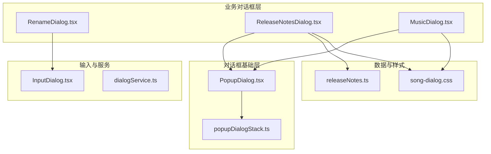
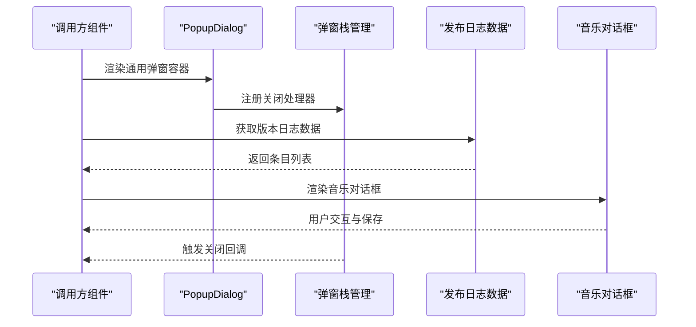
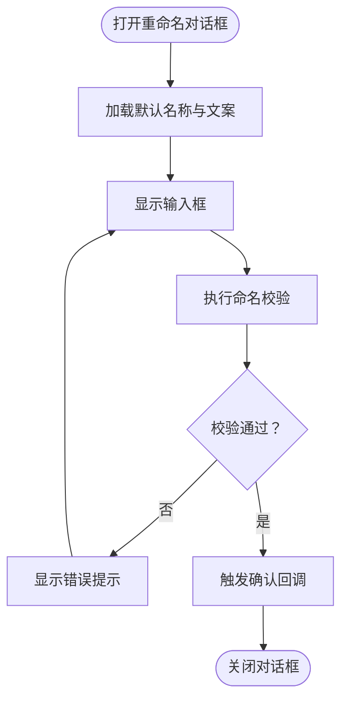
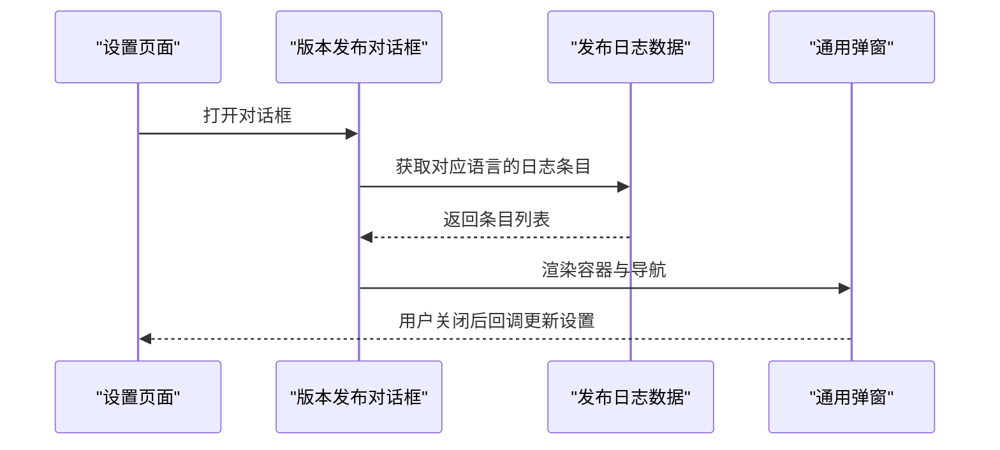
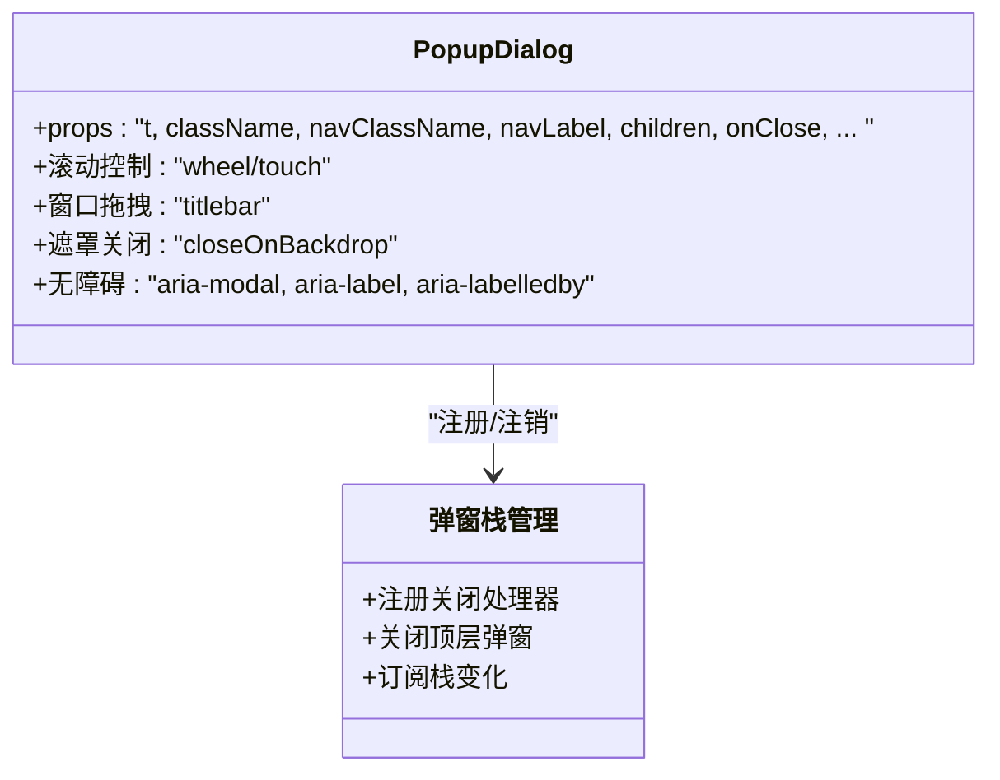
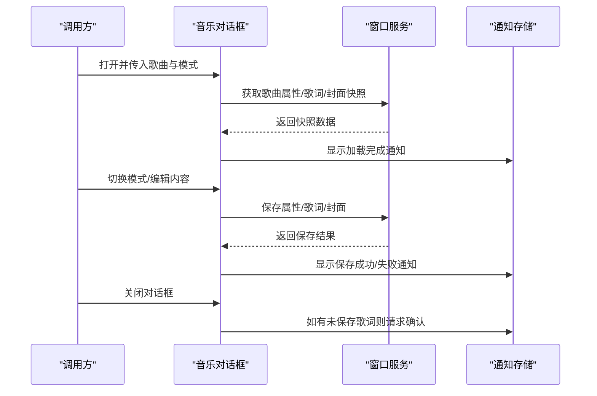
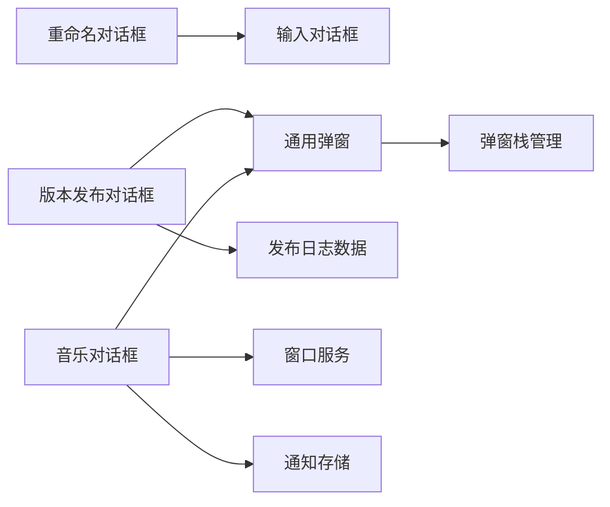

# 特殊对话框组件

<cite>
**本文档引用的文件**
- [RenameDialog.tsx](file://src/components/RenameDialog.tsx)
- [ReleaseNotesDialog.tsx](file://src/components/ReleaseNotesDialog.tsx)
- [PopupDialog.tsx](file://src/components/PopupDialog.tsx)
- [MusicDialog.tsx](file://src/components/MusicDialog.tsx)
- [InputDialog.tsx](file://src/components/InputDialog.tsx)
- [popupDialogStack.ts](file://src/components/popupDialogStack.ts)
- [dialogService.ts](file://src/components/dialogService.ts)
- [releaseNotes.ts](file://src/shared/releaseNotes.ts)
- [App.tsx](file://src/App.tsx)
- [HeaderedPlaylistControl.tsx](file://src/components/HeaderedPlaylistControl.tsx)
- [MediaControl.tsx](file://src/components/MediaControl.tsx)
- [song-dialog.css](file://src/styles/song-dialog.css)
</cite>

## 目录
1. [简介](#简介)
2. [项目结构](#项目结构)
3. [核心组件](#核心组件)
4. [架构总览](#架构总览)
5. [详细组件分析](#详细组件分析)
6. [依赖关系分析](#依赖关系分析)
7. [性能考量](#性能考量)
8. [故障排查指南](#故障排查指南)
9. [结论](#结论)
10. [附录](#附录)

## 简介
本文件系统性梳理 SMPlayer 中的特殊对话框组件体系，重点覆盖以下组件与能力：
- 重命名对话框：基于通用输入对话框封装，用于创建/重命名播放列表等场景
- 版本发布对话框：展示应用更新日志，支持中英双语切换
- 通用弹窗：作为所有特殊对话框的基础容器，提供统一的导航栏、标题栏、滚动与拖拽行为
- 音乐信息对话框：综合展示与编辑歌曲属性、歌词、专辑封面的复杂对话框

文档将从架构、数据流、处理逻辑、集成方式、定制化能力、最佳实践与扩展方法等方面进行深入说明。

## 项目结构
特殊对话框组件主要位于 src/components 目录，配合样式文件与共享资源实现统一外观与行为：
- 对话框基础层：PopupDialog.tsx 提供通用弹窗容器与交互行为
- 业务对话框层：RenameDialog.tsx、ReleaseNotesDialog.tsx、MusicDialog.tsx 等
- 输入与确认服务：InputDialog.tsx、dialogService.ts 提供文本输入与确认对话框的服务化接口
- 弹窗栈管理：popupDialogStack.ts 统一管理弹窗层级与关闭事件
- 发布日志数据：releaseNotes.ts 提供版本变更条目数据源

**图表来源**
- [PopupDialog.tsx:83-282](file://src/components/PopupDialog.tsx#L83-L282)
- [popupDialogStack.ts:1-48](file://src/components/popupDialogStack.ts#L1-L48)
- [RenameDialog.tsx:5-34](file://src/components/RenameDialog.tsx#L5-L34)
- [InputDialog.tsx:5-105](file://src/components/InputDialog.tsx#L5-L105)
- [ReleaseNotesDialog.tsx:6-55](file://src/components/ReleaseNotesDialog.tsx#L6-L55)
- [MusicDialog.tsx:78-100](file://src/components/MusicDialog.tsx#L78-L100)
- [releaseNotes.ts:384-390](file://src/shared/releaseNotes.ts#L384-L390)
- [song-dialog.css:1-800](file://src/styles/song-dialog.css#L1-L800)

**章节来源**
- [PopupDialog.tsx:83-282](file://src/components/PopupDialog.tsx#L83-L282)
- [popupDialogStack.ts:1-48](file://src/components/popupDialogStack.ts#L1-L48)
- [InputDialog.tsx:5-105](file://src/components/InputDialog.tsx#L5-L105)
- [dialogService.ts:1-42](file://src/components/dialogService.ts#L1-L42)
- [releaseNotes.ts:384-390](file://src/shared/releaseNotes.ts#L384-L390)
- [song-dialog.css:1-800](file://src/styles/song-dialog.css#L1-L800)

## 核心组件
本节概述四类特殊对话框的核心职责与关键特性：

- 重命名对话框（RenameDialog）
  - 基于通用输入对话框封装，提供播放列表名称校验与确认回调
  - 支持国际化文案、默认名称生成、确认/取消回调
  - 关键校验规则：非空、长度限制、名称唯一性、特殊字符过滤

- 版本发布对话框（ReleaseNotesDialog）
  - 展示应用版本更新日志，支持根据首选语言自动选择中/英内容
  - 使用 PopupDialog 作为容器，渲染版本号与变更条目列表
  - 通过 releaseNotes 数据模块提供条目文本

- 通用弹窗（PopupDialog）
  - 作为所有特殊对话框的根容器，提供统一的导航栏、标题栏、关闭按钮
  - 实现滚轮/触摸惯性滚动控制、窗口拖拽、移动端返回栏、可选点击遮罩关闭
  - 通过弹窗栈管理器统一处理键盘 ESC 关闭与层级状态

- 音乐信息对话框（MusicDialog）
  - 展示与编辑歌曲属性、歌词、专辑封面的综合对话框
  - 支持三种模式：属性、歌词、专辑封面
  - 内置艺术家识别、歌词搜索/导入、专辑封面推荐与保存流程
  - 提供撤销/重置、快捷键绑定、通知提示等增强体验

**章节来源**
- [RenameDialog.tsx:5-55](file://src/components/RenameDialog.tsx#L5-L55)
- [ReleaseNotesDialog.tsx:6-55](file://src/components/ReleaseNotesDialog.tsx#L6-L55)
- [PopupDialog.tsx:83-282](file://src/components/PopupDialog.tsx#L83-L282)
- [MusicDialog.tsx:65-100](file://src/components/MusicDialog.tsx#L65-L100)

## 架构总览
特殊对话框的运行时架构由“容器层 + 业务层 + 服务层 + 数据层”构成，通过弹窗栈与全局状态协同工作。

**图表来源**
- [PopupDialog.tsx:108-109](file://src/components/PopupDialog.tsx#L108-L109)
- [popupDialogStack.ts:13-24](file://src/components/popupDialogStack.ts#L13-L24)
- [releaseNotes.ts:384-390](file://src/shared/releaseNotes.ts#L384-L390)
- [MusicDialog.tsx:210-295](file://src/components/MusicDialog.tsx#L210-L295)

**章节来源**
- [PopupDialog.tsx:98-282](file://src/components/PopupDialog.tsx#L98-L282)
- [popupDialogStack.ts:1-48](file://src/components/popupDialogStack.ts#L1-L48)
- [releaseNotes.ts:384-390](file://src/shared/releaseNotes.ts#L384-L390)
- [MusicDialog.tsx:210-295](file://src/components/MusicDialog.tsx#L210-L295)

## 详细组件分析

### 重命名对话框（RenameDialog）
- 设计要点
  - 复用 InputDialog 的输入与校验能力，专注于播放列表命名场景
  - 校验函数 validatePlaylistName 覆盖空值、长度、唯一性与特殊字符
  - 国际化文案通过 t 参数传入，支持多语言占位符与确认文本

- 典型使用场景
  - 创建新播放列表时的命名确认
  - 对已有播放列表进行重命名

- 定制化能力
  - 标题、默认名称、确认文本均可外部传入
  - 自定义校验函数以适配不同命名规则
  - 回调函数 onConfirm/onCancel 与业务逻辑解耦

**图表来源**
- [RenameDialog.tsx:36-54](file://src/components/RenameDialog.tsx#L36-L54)
- [InputDialog.tsx:39-59](file://src/components/InputDialog.tsx#L39-L59)

**章节来源**
- [RenameDialog.tsx:5-55](file://src/components/RenameDialog.tsx#L5-L55)
- [InputDialog.tsx:5-105](file://src/components/InputDialog.tsx#L5-L105)

### 版本发布对话框（ReleaseNotesDialog）
- 设计要点
  - 根据首选语言与系统语言自动选择中/英版本日志
  - 使用 PopupDialog 作为容器，渲染标题与版本条目列表
  - 通过 releaseNotes 模块动态生成条目文本

- 典型使用场景
  - 设置页面查看更新日志
  - 首次启动或版本升级后提示查看日志

- 定制化能力
  - 可自定义容器样式类名与导航标签
  - 导航栏标题与无障碍标签可配置
  - 关闭回调可联动设置项更新

**图表来源**
- [ReleaseNotesDialog.tsx:15-54](file://src/components/ReleaseNotesDialog.tsx#L15-L54)
- [releaseNotes.ts:384-390](file://src/shared/releaseNotes.ts#L384-L390)
- [PopupDialog.tsx:23-53](file://src/components/PopupDialog.tsx#L23-L53)

**章节来源**
- [ReleaseNotesDialog.tsx:6-55](file://src/components/ReleaseNotesDialog.tsx#L6-L55)
- [releaseNotes.ts:384-390](file://src/shared/releaseNotes.ts#L384-L390)

### 通用弹窗（PopupDialog）
- 设计要点
  - 通过 Portal 渲染到 document.body，确保层级与遮罩一致性
  - 提供导航栏、标题栏、关闭按钮、移动端返回栏与窗口拖拽条
  - 实现滚轮/触摸惯性滚动控制，防止滚动穿透到背景页面
  - 支持点击遮罩关闭、无障碍标签、ref 透传与自定义样式类名

- 行为特性
  - 滚动控制：仅在对话框内部可滚动时允许滚动，否则阻止事件
  - 窗口拖拽：在标题栏区域启用窗口拖拽（桌面端）
  - 弹窗栈：注册/注销关闭处理器，维护全局弹窗深度

**图表来源**
- [PopupDialog.tsx:83-282](file://src/components/PopupDialog.tsx#L83-L282)
- [popupDialogStack.ts:13-47](file://src/components/popupDialogStack.ts#L13-L47)

**章节来源**
- [PopupDialog.tsx:83-282](file://src/components/PopupDialog.tsx#L83-L282)
- [popupDialogStack.ts:1-48](file://src/components/popupDialogStack.ts#L1-L48)

### 音乐信息对话框（MusicDialog）
- 设计要点
  - 三模式切换：属性、歌词、专辑封面
  - 属性编辑：标题、副标题、艺术家、专辑、年份、播放次数等
  - 歌词编辑：支持纯文本与带时间戳歌词互转、搜索/导入、保存与刷新
  - 专辑封面：封面缺失时提供智能推荐、库内选择、删除与保存

- 关键流程
  - 初始化：异步加载歌曲属性、歌词与封面快照
  - 推荐：根据相似标题/同艺人/同专辑匹配候选并获取封面
  - 保存：属性、歌词、封面分别保存并通知用户
  - 关闭：歌词未保存时弹出确认对话框

**图表来源**
- [MusicDialog.tsx:210-295](file://src/components/MusicDialog.tsx#L210-L295)
- [MusicDialog.tsx:491-536](file://src/components/MusicDialog.tsx#L491-L536)
- [MusicDialog.tsx:563-571](file://src/components/MusicDialog.tsx#L563-L571)
- [MusicDialog.tsx:638-694](file://src/components/MusicDialog.tsx#L638-L694)
- [MusicDialog.tsx:460-474](file://src/components/MusicDialog.tsx#L460-L474)

**章节来源**
- [MusicDialog.tsx:65-100](file://src/components/MusicDialog.tsx#L65-L100)
- [MusicDialog.tsx:210-295](file://src/components/MusicDialog.tsx#L210-L295)
- [MusicDialog.tsx:491-536](file://src/components/MusicDialog.tsx#L491-L536)
- [MusicDialog.tsx:563-571](file://src/components/MusicDialog.tsx#L563-L571)
- [MusicDialog.tsx:638-694](file://src/components/MusicDialog.tsx#L638-L694)
- [MusicDialog.tsx:460-474](file://src/components/MusicDialog.tsx#L460-L474)

## 依赖关系分析
- 组件耦合
  - RenameDialog 依赖 InputDialog 与国际化翻译器
  - ReleaseNotesDialog 依赖 PopupDialog 与 releaseNotes 数据模块
  - MusicDialog 依赖 PopupDialog、多个子组件与窗口服务
  - PopupDialog 依赖弹窗栈管理器与图标组件

- 外部依赖
  - 窗口服务（window.smplayer）提供歌曲属性、歌词、封面等数据访问
  - 通知存储（useUndoableNotificationStore）用于保存结果提示

**图表来源**
- [RenameDialog.tsx:3-33](file://src/components/RenameDialog.tsx#L3-L33)
- [ReleaseNotesDialog.tsx:1-30](file://src/components/ReleaseNotesDialog.tsx#L1-L30)
- [PopupDialog.tsx:1-10](file://src/components/PopupDialog.tsx#L1-L10)
- [popupDialogStack.ts:1-4](file://src/components/popupDialogStack.ts#L1-L4)
- [MusicDialog.tsx:1-16](file://src/components/MusicDialog.tsx#L1-L16)

**章节来源**
- [RenameDialog.tsx:1-34](file://src/components/RenameDialog.tsx#L1-L34)
- [ReleaseNotesDialog.tsx:1-30](file://src/components/ReleaseNotesDialog.tsx#L1-L30)
- [PopupDialog.tsx:1-10](file://src/components/PopupDialog.tsx#L1-L10)
- [popupDialogStack.ts:1-4](file://src/components/popupDialogStack.ts#L1-L4)
- [MusicDialog.tsx:1-16](file://src/components/MusicDialog.tsx#L1-L16)

## 性能考量
- 渲染性能
  - PopupDialog 使用 Portal 渲染，减少 DOM 层级嵌套对父容器的影响
  - MusicDialog 在滚动容器中动态计算滚动条位置，避免不必要的重排

- 交互性能
  - 滚动控制采用事件捕获与 preventDefault，降低滚动穿透带来的重绘
  - 弹窗栈通过事件总线通知全局状态，避免深层传递导致的重复渲染

- 数据加载
  - MusicDialog 分别加载属性、歌词与封面，使用取消标记避免竞态
  - 推荐算法在封面缺失时才触发候选查询，减少无谓请求

[本节为通用指导，无需特定文件来源]

## 故障排查指南
- 对话框无法关闭
  - 检查是否正确注册弹窗栈关闭处理器
  - 确认 onClose 回调是否被正确触发

- 滚动穿透问题
  - 确保对话框内部元素具备可滚动条件
  - 检查 canScrollElement 与 canScrollWithinDialog 的判断逻辑

- 歌词保存失败
  - 查看保存流程中的异常分支与通知提示
  - 确认窗口服务返回的保存结果与回调时机

- 版本日志为空
  - 检查首选语言与系统语言的判定逻辑
  - 确认 releaseNotes 数据模块的条目映射

**章节来源**
- [popupDialogStack.ts:6-24](file://src/components/popupDialogStack.ts#L6-L24)
- [PopupDialog.tsx:38-81](file://src/components/PopupDialog.tsx#L38-L81)
- [MusicDialog.tsx:531-536](file://src/components/MusicDialog.tsx#L531-L536)
- [ReleaseNotesDialog.tsx:15-20](file://src/components/ReleaseNotesDialog.tsx#L15-L20)

## 结论
SMPlayer 的特殊对话框组件通过“通用容器 + 业务封装 + 服务化接口”的架构实现了高度复用与一致体验。通用弹窗提供统一的交互与视觉规范，业务对话框在各自领域内承担复杂的数据加载、编辑与保存逻辑。结合弹窗栈管理与通知机制，整体具备良好的可维护性与扩展性。

[本节为总结性内容，无需特定文件来源]

## 附录

### 集成方式与最佳实践
- 在页面中通过条件渲染挂载对话框组件，确保生命周期与状态同步
- 使用国际化翻译器 t 传入，保证文案一致性
- 对于需要用户确认的操作，优先使用 dialogService 的确认对话框
- 避免在对话框中执行耗时操作，必要时使用异步加载与进度提示

**章节来源**
- [App.tsx:1152-1176](file://src/App.tsx#L1152-L1176)
- [HeaderedPlaylistControl.tsx:1078-1094](file://src/components/HeaderedPlaylistControl.tsx#L1078-L1094)
- [MediaControl.tsx:1127-1145](file://src/components/MediaControl.tsx#L1127-L1145)
- [dialogService.ts:20-41](file://src/components/dialogService.ts#L20-L41)

### 使用示例与扩展方法
- 创建新的特殊对话框
  - 以 PopupDialog 为基础容器，定义导航标签与内容区域
  - 通过 props 透传 t、onClose、样式类名等参数
  - 如需输入校验，可复用 InputDialog 或自定义校验函数

- 复用现有对话框
  - 重命名对话框适用于任何需要命名输入的场景
  - 版本发布对话框可直接复用日志数据模块
  - 音乐对话框可作为复杂编辑场景的参考模板

**章节来源**
- [PopupDialog.tsx:83-282](file://src/components/PopupDialog.tsx#L83-L282)
- [InputDialog.tsx:5-105](file://src/components/InputDialog.tsx#L5-L105)
- [RenameDialog.tsx:5-34](file://src/components/RenameDialog.tsx#L5-L34)
- [ReleaseNotesDialog.tsx:6-55](file://src/components/ReleaseNotesDialog.tsx#L6-L55)
- [MusicDialog.tsx:78-100](file://src/components/MusicDialog.tsx#L78-L100)