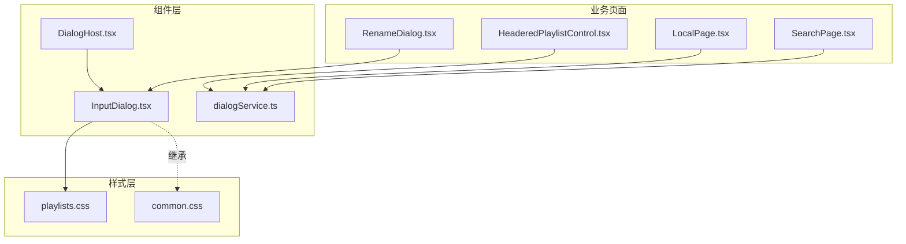
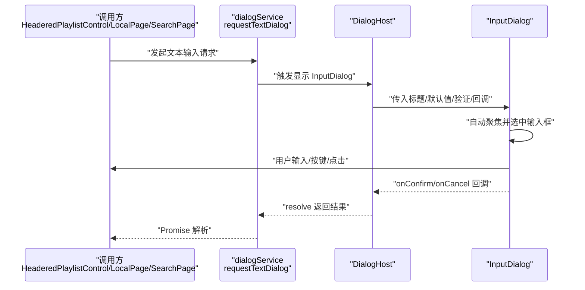
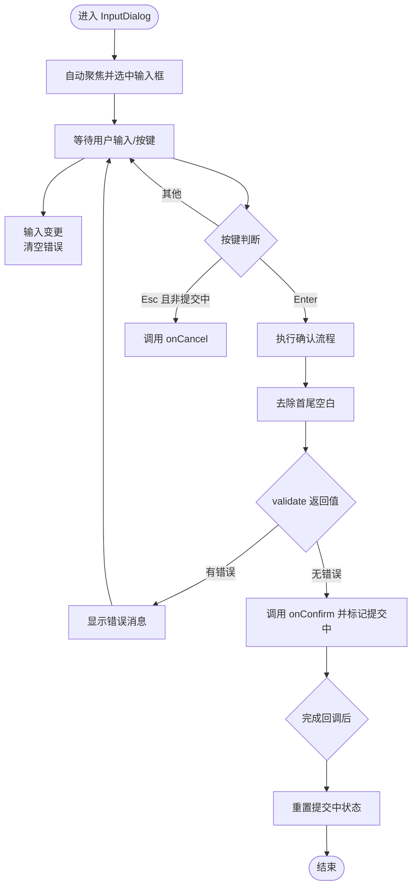
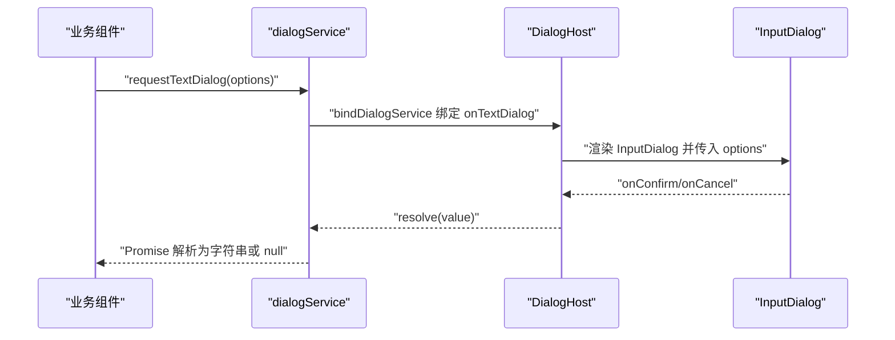
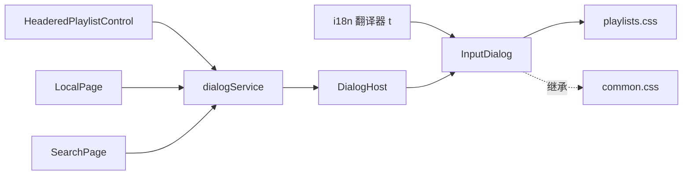

# 输入对话框

<cite>
**本文引用的文件**
- [InputDialog.tsx](file://src/components/InputDialog.tsx)
- [dialogService.ts](file://src/components/dialogService.ts)
- [DialogHost.tsx](file://src/components/DialogHost.tsx)
- [RenameDialog.tsx](file://src/components/RenameDialog.tsx)
- [HeaderedPlaylistControl.tsx](file://src/components/HeaderedPlaylistControl.tsx)
- [LocalPage.tsx](file://src/pages/LocalPage.tsx)
- [SearchPage.tsx](file://src/pages/SearchPage.tsx)
- [playlists.css](file://src/styles/playlists.css)
- [common.css](file://src/styles/common.css)
</cite>

## 目录
1. [简介](#简介)
2. [项目结构](#项目结构)
3. [核心组件](#核心组件)
4. [架构总览](#架构总览)
5. [组件详细分析](#组件详细分析)
6. [依赖关系分析](#依赖关系分析)
7. [性能考量](#性能考量)
8. [故障排查指南](#故障排查指南)
9. [结论](#结论)
10. [附录](#附录)

## 简介
本文件系统性地解析 SMPlayer 中的输入对话框组件（InputDialog），覆盖其 UI 设计、输入验证机制、用户交互处理与事件回调，并给出属性配置、使用示例与最佳实践。InputDialog 是一个可复用的文本输入弹窗，通过统一的服务层进行请求与展示，支持国际化文案、实时校验与加载态反馈。

## 项目结构
与输入对话框相关的核心文件组织如下：
- 组件层：InputDialog、DialogHost、dialogService
- 使用示例：RenameDialog、HeaderedPlaylistControl、LocalPage、SearchPage
- 样式层：playlists.css（定义输入对话框专属样式）、common.css（通用样式）

图表来源
- [InputDialog.tsx:1-105](file://src/components/InputDialog.tsx#L1-L105)
- [DialogHost.tsx:1-55](file://src/components/DialogHost.tsx#L1-L55)
- [dialogService.ts:1-42](file://src/components/dialogService.ts#L1-L42)
- [RenameDialog.tsx:1-55](file://src/components/RenameDialog.tsx#L1-L55)
- [HeaderedPlaylistControl.tsx:474-486](file://src/components/HeaderedPlaylistControl.tsx#L474-L486)
- [LocalPage.tsx:512-524](file://src/pages/LocalPage.tsx#L512-L524)
- [SearchPage.tsx:844-853](file://src/pages/SearchPage.tsx#L844-L853)
- [playlists.css:39-197](file://src/styles/playlists.css#L39-L197)
- [common.css:41-50](file://src/styles/common.css#L41-L50)

章节来源
- [InputDialog.tsx:1-105](file://src/components/InputDialog.tsx#L1-L105)
- [DialogHost.tsx:1-55](file://src/components/DialogHost.tsx#L1-L55)
- [dialogService.ts:1-42](file://src/components/dialogService.ts#L1-L42)
- [playlists.css:39-197](file://src/styles/playlists.css#L39-L197)
- [common.css:41-50](file://src/styles/common.css#L41-L50)

## 核心组件
- InputDialog：负责渲染输入对话框 UI、处理输入变更、键盘事件、调用外部验证函数与回调。
- DialogHost：作为全局对话框宿主，绑定 dialogService 并根据状态渲染 InputDialog 或其他对话框。
- dialogService：提供 requestTextDialog 请求接口，将文本输入对话框以 Promise 形式暴露给业务代码。

章节来源
- [InputDialog.tsx:5-23](file://src/components/InputDialog.tsx#L5-L23)
- [DialogHost.tsx:8-54](file://src/components/DialogHost.tsx#L8-L54)
- [dialogService.ts:17-41](file://src/components/dialogService.ts#L17-L41)

## 架构总览
InputDialog 的调用链路采用“服务请求 -> 宿主渲染 -> 组件交互”的分层设计，确保 UI 与业务解耦、可复用且易于测试。

图表来源
- [HeaderedPlaylistControl.tsx:474-486](file://src/components/HeaderedPlaylistControl.tsx#L474-L486)
- [LocalPage.tsx:512-524](file://src/pages/LocalPage.tsx#L512-L524)
- [SearchPage.tsx:844-853](file://src/pages/SearchPage.tsx#L844-L853)
- [dialogService.ts:31-41](file://src/components/dialogService.ts#L31-L41)
- [DialogHost.tsx:29-42](file://src/components/DialogHost.tsx#L29-L42)
- [InputDialog.tsx:30-37](file://src/components/InputDialog.tsx#L30-L37)

## 组件详细分析

### InputDialog 组件
- 职责与行为
  - 渲染标题、输入框、错误提示与操作按钮。
  - 自动聚焦并全选输入框，提升可用性。
  - 支持 Enter 提交、Esc 取消（在非提交中）。
  - 支持禁用态与加载态（提交中）。
  - 将 trim 后的值传入验证函数；验证失败时显示错误信息；成功则调用 onConfirm 并在完成后恢复状态。
- 关键属性
  - t: 国际化翻译器
  - title: 对话框标题
  - defaultValue: 默认值
  - placeholder: 占位符
  - confirmText: 确认按钮文案，默认使用 t('common.confirm')
  - validate: 验证函数，返回空字符串表示通过，否则返回错误消息
  - onCancel: 取消回调
  - onConfirm: 确认回调，接收去空白后的输入值
- 状态管理
  - value: 当前输入值
  - error: 错误消息
  - submitting: 提交中状态，用于防止重复提交与禁用交互
- 交互细节
  - 输入变更时清除错误，避免旧错误干扰新输入
  - 禁用态下 Esc 不触发取消，避免误操作
  - 加载态下确认按钮显示旋转指示器

图表来源
- [InputDialog.tsx:30-37](file://src/components/InputDialog.tsx#L30-L37)
- [InputDialog.tsx:72-82](file://src/components/InputDialog.tsx#L72-L82)
- [InputDialog.tsx:39-59](file://src/components/InputDialog.tsx#L39-L59)

章节来源
- [InputDialog.tsx:5-23](file://src/components/InputDialog.tsx#L5-L23)
- [InputDialog.tsx:30-37](file://src/components/InputDialog.tsx#L30-L37)
- [InputDialog.tsx:39-59](file://src/components/InputDialog.tsx#L39-L59)
- [InputDialog.tsx:61-104](file://src/components/InputDialog.tsx#L61-L104)

### DialogHost 与 dialogService
- DialogHost
  - 绑定 dialogService 的回调，维护文本/确认对话框的状态。
  - 根据状态渲染 InputDialog 或其他对话框，并在关闭时 resolve Promise。
- dialogService
  - 提供 requestTextDialog 与 requestConfirmDialog 两个入口，分别返回 Promise。
  - TextDialogRequest 包含标题、默认值、占位符、确认文案、验证函数与 resolve 回调。

图表来源
- [DialogHost.tsx:12-27](file://src/components/DialogHost.tsx#L12-L27)
- [DialogHost.tsx:29-42](file://src/components/DialogHost.tsx#L29-L42)
- [dialogService.ts:20-41](file://src/components/dialogService.ts#L20-L41)

章节来源
- [DialogHost.tsx:8-54](file://src/components/DialogHost.tsx#L8-L54)
- [dialogService.ts:1-42](file://src/components/dialogService.ts#L1-L42)

### UI 样式与无障碍
- InputDialog 使用独立的样式类，保证主题一致性与夜间模式适配。
- 无障碍属性：对话框容器 role="dialog"、aria-modal="true"、标题 id 对应 aria-labelledby。
- 按钮加载态：确认按钮在提交中添加 is-loading 类，同时显示旋转指示器。

章节来源
- [playlists.css:39-197](file://src/styles/playlists.css#L39-L197)
- [InputDialog.tsx:64-65](file://src/components/InputDialog.tsx#L64-L65)
- [InputDialog.tsx:94-96](file://src/components/InputDialog.tsx#L94-L96)

### 验证机制与错误处理
- validate 函数签名：接收去空白后的字符串，返回空字符串表示通过，否则返回错误消息字符串。
- 错误显示：当 validate 返回非空字符串时，显示错误提示并阻止提交。
- 常见验证策略
  - 必填校验：空值返回错误消息
  - 长度限制：超过阈值返回错误消息
  - 冲突检测：与现有资源比较，如重名
  - 特殊字符过滤：包含非法片段时返回错误消息
- 实战示例
  - 重命名播放列表：结合当前名称与现有列表集合进行校验
  - 文件夹名称：检查空值、长度、同级目录冲突

章节来源
- [InputDialog.tsx:44-49](file://src/components/InputDialog.tsx#L44-L49)
- [InputDialog.tsx:84](file://src/components/InputDialog.tsx#L84)
- [RenameDialog.tsx:36-54](file://src/components/RenameDialog.tsx#L36-L54)
- [LocalPage.tsx:498-510](file://src/pages/LocalPage.tsx#L498-L510)

### 事件处理与键盘交互
- Enter：触发确认流程（调用 confirm）
- Escape：在非提交中触发取消
- 输入变更：清空错误消息，避免残留提示
- 禁用态：在提交中禁用输入与按钮，防止重复提交

章节来源
- [InputDialog.tsx:76-82](file://src/components/InputDialog.tsx#L76-L82)
- [InputDialog.tsx:72-75](file://src/components/InputDialog.tsx#L72-L75)
- [InputDialog.tsx:40-42](file://src/components/InputDialog.tsx#L40-L42)

### 属性配置与使用示例
- 基本属性
  - title：对话框标题
  - defaultValue：默认值
  - placeholder：占位符
  - confirmText：确认按钮文案（默认使用 t('common.confirm)）
  - validate：验证函数
  - onCancel/onConfirm：回调
- 典型使用场景
  - 重命名播放列表：通过 RenameDialog 封装 InputDialog，传入 validatePlaylistName
  - 创建/重命名文件夹：在 LocalPage 中直接使用 setInputDialog 配置 validate 与 onConfirm
  - 搜索目录：通过 requestTextDialog 获取查询词并触发后续动作
- 最佳实践
  - 在 validate 中统一处理 trim、长度、冲突与特殊字符
  - onConfirm 中异步处理（如网络请求），并在 finally 中恢复状态
  - 使用 confirmText 明确用户意图，避免歧义
  - 在提交中禁用交互，提供视觉反馈（加载态）

章节来源
- [InputDialog.tsx:10-22](file://src/components/InputDialog.tsx#L10-L22)
- [RenameDialog.tsx:22-33](file://src/components/RenameDialog.tsx#L22-L33)
- [LocalPage.tsx:512-524](file://src/pages/LocalPage.tsx#L512-L524)
- [SearchPage.tsx:844-853](file://src/pages/SearchPage.tsx#L844-L853)

## 依赖关系分析
- InputDialog 依赖 i18n 翻译器 t，用于默认确认文案与错误消息
- DialogHost 依赖 dialogService，负责请求与状态管理
- 业务页面通过 dialogService 发起请求，间接依赖 InputDialog 的 UI 与行为
- 样式层通过 playlists.css 与 common.css 提供一致的外观与主题支持

图表来源
- [InputDialog.tsx:3](file://src/components/InputDialog.tsx#L3)
- [DialogHost.tsx:4](file://src/components/DialogHost.tsx#L4)
- [HeaderedPlaylistControl.tsx:15](file://src/components/HeaderedPlaylistControl.tsx#L15)
- [LocalPage.tsx:6](file://src/pages/LocalPage.tsx#L6)
- [SearchPage.tsx:5](file://src/pages/SearchPage.tsx#L5)
- [playlists.css:39-197](file://src/styles/playlists.css#L39-L197)
- [common.css:41-50](file://src/styles/common.css#L41-L50)

章节来源
- [InputDialog.tsx:3](file://src/components/InputDialog.tsx#L3)
- [DialogHost.tsx:4](file://src/components/DialogHost.tsx#L4)
- [dialogService.ts:17-29](file://src/components/dialogService.ts#L17-L29)

## 性能考量
- 防抖与重复提交：通过 submitting 状态避免重复提交，减少无效计算与副作用
- 渲染最小化：仅在状态变化时更新错误消息与按钮状态
- 异步处理：onConfirm 中的耗时操作应在 finally 中恢复状态，避免阻塞 UI
- 样式开销：输入框样式简单，主要成本在 validate 与 onConfirm 的业务逻辑

## 故障排查指南
- 验证未生效
  - 检查 validate 是否正确返回空字符串或错误消息
  - 确认输入值已 trim，避免因空白字符导致误判
- 提交按钮无响应
  - 检查 submitting 是否被意外置为 true
  - 确认 onConfirm 是否抛出异常导致 finally 未执行
- 键盘事件不生效
  - 确认输入框处于可编辑状态
  - 检查是否在提交中按 Esc 导致未触发取消
- 错误消息不显示
  - 确认 validate 返回非空字符串
  - 检查 DOM 中是否存在对应错误元素

章节来源
- [InputDialog.tsx:44-49](file://src/components/InputDialog.tsx#L44-L49)
- [InputDialog.tsx:51-58](file://src/components/InputDialog.tsx#L51-L58)
- [InputDialog.tsx:76-82](file://src/components/InputDialog.tsx#L76-L82)
- [InputDialog.tsx:84](file://src/components/InputDialog.tsx#L84)

## 结论
InputDialog 通过清晰的职责划分与简洁的 API，提供了高可用的文本输入对话能力。配合 dialogService 与 DialogHost，实现了跨页面的统一调用体验；通过 validate 与错误消息机制，保障了输入质量与用户体验。建议在实际使用中遵循“先校验再提交”的原则，并在 onConfirm 中妥善处理异步与回滚逻辑。

## 附录
- 相关文件路径参考
  - [InputDialog.tsx](file://src/components/InputDialog.tsx)
  - [DialogHost.tsx](file://src/components/DialogHost.tsx)
  - [dialogService.ts](file://src/components/dialogService.ts)
  - [RenameDialog.tsx](file://src/components/RenameDialog.tsx)
  - [HeaderedPlaylistControl.tsx](file://src/components/HeaderedPlaylistControl.tsx)
  - [LocalPage.tsx](file://src/pages/LocalPage.tsx)
  - [SearchPage.tsx](file://src/pages/SearchPage.tsx)
  - [playlists.css](file://src/styles/playlists.css)
  - [common.css](file://src/styles/common.css)