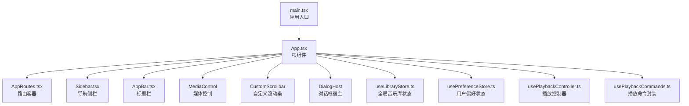
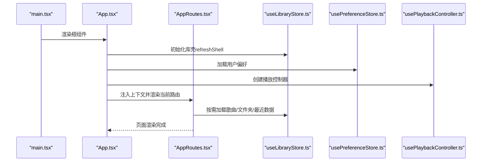
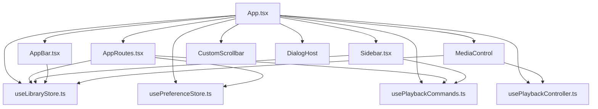

# 根组件App

<cite>
**本文档引用的文件**
- [App.tsx](file://src/App.tsx)
- [main.tsx](file://src/main.tsx)
- [appModel.ts](file://src/appModel.ts)
- [useLibraryStore.ts](file://src/state/useLibraryStore.ts)
- [usePreferenceStore.ts](file://src/state/usePreferenceStore.ts)
- [usePlaybackController.ts](file://src/hooks/usePlaybackController.ts)
- [usePlaybackCommands.ts](file://src/hooks/usePlaybackCommands.ts)
- [AppRoutes.tsx](file://src/AppRoutes.tsx)
- [LocalPage.tsx](file://src/pages/LocalPage.tsx)
- [AppBar.tsx](file://src/components/AppBar.tsx)
- [Sidebar.tsx](file://src/components/Sidebar.tsx)
- [appbar.css](file://src/styles/appbar.css)
- [sidebar.css](file://src/styles/sidebar.css)
</cite>

## 目录
1. [简介](#简介)
2. [项目结构](#项目结构)
3. [核心组件](#核心组件)
4. [架构总览](#架构总览)
5. [详细组件分析](#详细组件分析)
6. [依赖关系分析](#依赖关系分析)
7. [性能考虑](#性能考虑)
8. [故障排除指南](#故障排除指南)
9. [结论](#结论)

## 简介
本文件为 SMPlayer 根组件 App 的深度技术文档，聚焦于 App.tsx 作为应用入口点的架构设计与实现细节。内容涵盖组件树结构、状态管理模式、生命周期处理、整体布局系统（导航栏折叠机制、响应式布局适配、主题切换逻辑）、状态提升策略（全局状态管理、组件间通信模式、事件处理机制）、应用初始化流程（音乐库加载、设置恢复、播放状态同步）、性能优化技巧（懒加载、记忆化、条件渲染）以及错误边界处理、加载状态管理与用户体验优化。

## 项目结构
App.tsx 位于应用根目录，作为 React 应用的顶层容器，负责：
- 组合应用外壳（侧边栏、工作区、媒体控制）
- 管理全局状态（音乐库、播放器、用户偏好）
- 处理路由与页面上下文传递
- 实现响应式布局与导航行为
- 集成播放控制与搜索功能

图表来源
- [main.tsx:1-15](file://src/main.tsx#L1-L15)
- [App.tsx:1-1258](file://src/App.tsx#L1-L1258)
- [AppRoutes.tsx:1-1108](file://src/AppRoutes.tsx#L1-L1108)
- [Sidebar.tsx:1-538](file://src/components/Sidebar.tsx#L1-L538)
- [AppBar.tsx:1-45](file://src/components/AppBar.tsx#L1-L45)

章节来源
- [main.tsx:1-15](file://src/main.tsx#L1-L15)
- [App.tsx:1-1258](file://src/App.tsx#L1-L1258)

## 核心组件
- 根组件 App：负责应用外壳、布局、状态聚合与生命周期管理
- 路由容器 AppRoutes：按需加载页面数据、处理启动重定向与扫描结果提示
- 导航侧栏 Sidebar：支持折叠、搜索、播放列表管理与快捷操作
- 标题栏 AppBar：在最小化模式下提供拖拽区域与动作按钮
- 媒体控制：悬浮或固定媒体控制面板，提供播放控制与队列管理
- 自定义滚动条：统一滚动体验，支持多容器同步
- 对话框宿主：集中管理模态对话框与进度覆盖层

章节来源
- [App.tsx:71-1224](file://src/App.tsx#L71-L1224)
- [AppRoutes.tsx:176-327](file://src/AppRoutes.tsx#L176-L327)
- [Sidebar.tsx:67-496](file://src/components/Sidebar.tsx#L67-L496)
- [AppBar.tsx:18-44](file://src/components/AppBar.tsx#L18-L44)

## 架构总览
App.tsx 采用“状态提升 + Hook 封装”的架构模式：
- 全局状态通过 Zustand store 管理（音乐库、用户偏好）
- 播放控制通过独立 Hook 提供可复用能力
- 路由层负责数据惰性加载与页面上下文注入
- 视图层通过 props 下发与事件回调完成组件间通信

图表来源
- [main.tsx:8-14](file://src/main.tsx#L8-L14)
- [App.tsx:480-525](file://src/App.tsx#L480-L525)
- [AppRoutes.tsx:74-82](file://src/AppRoutes.tsx#L74-L82)
- [useLibraryStore.ts:124-144](file://src/state/useLibraryStore.ts#L124-L144)
- [usePreferenceStore.ts:55-71](file://src/state/usePreferenceStore.ts#L55-L71)
- [usePlaybackController.ts:68-583](file://src/hooks/usePlaybackController.ts#L68-L583)

## 详细组件分析

### 根组件 App：应用入口与外壳
- 组件树结构
  - 最小化标题栏（仅在最小化模式显示）
  - 侧边栏（支持折叠/展开、搜索、播放列表管理）
  - 工作区（标题栏 + 内容 + 自定义滚动条）
  - 媒体控制（悬浮或隐藏）
  - 对话框宿主（扫描进度、发布说明、艺术家拆分确认等）

- 状态管理策略
  - 全局音乐库状态：useLibraryStore（快照、加载状态、扫描进度、错误）
  - 用户偏好状态：usePreferenceStore（设置快照、更新）
  - 播放控制：usePlaybackController（播放状态、音量、重复/随机模式）
  - 播放命令：usePlaybackCommands（队列操作、播放下一首、添加到队列等）

- 生命周期处理
  - 初始加载：refreshShell 后标记初始加载完成
  - 主题切换：根据设置自动切换夜间模式与窗口控件颜色
  - 夜间模式定时：基于时间段自动切换夜间模式
  - 路由恢复：保存/恢复滚动位置、页面目标
  - 导航模式：根据窗口宽度动态切换最小化/覆盖/宽屏模式

- 响应式布局与导航
  - 断点：最小化（<720px）、覆盖（720-1200px）、宽屏（≥1200px）
  - 折叠机制：窄屏默认折叠；宽屏可展开；最小化时支持抽屉式导航
  - 标题栏拖拽：在最小化模式下支持标题栏拖拽移动窗口

- 主题切换逻辑
  - 通过 CSS 变量与类名切换实现主题色与夜间模式
  - 支持自动模式（基于时间段）与手动模式

- 组件间通信
  - 通过上下文对象向路由层传递播放器、搜索、通知等能力
  - 通过事件监听（自定义事件）处理沉浸式标题、快速跳转等交互

- 初始化流程
  - 刷新库壳（获取基础快照）
  - 加载用户偏好
  - 恢复上次页面与滚动位置
  - 启动播放器并恢复播放状态

章节来源
- [App.tsx:71-1224](file://src/App.tsx#L71-L1224)
- [appModel.ts:58-110](file://src/appModel.ts#L58-L110)
- [appModel.ts:136-150](file://src/appModel.ts#L136-L150)
- [useLibraryStore.ts:124-144](file://src/state/useLibraryStore.ts#L124-L144)
- [usePreferenceStore.ts:55-71](file://src/state/usePreferenceStore.ts#L55-L71)

### 路由容器 AppRoutes：页面上下文与数据加载
- 启动重定向：根据上次页面恢复首页导航
- 数据惰性加载：RequireLibraryData 按需加载歌曲/文件夹/最近数据
- 扫描结果提示：扫描完成后弹出结果对话框或通知
- 页面上下文：向各页面注入播放器、搜索、通知、本地路径等能力

章节来源
- [AppRoutes.tsx:43-53](file://src/AppRoutes.tsx#L43-L53)
- [AppRoutes.tsx:74-82](file://src/AppRoutes.tsx#L74-L82)
- [AppRoutes.tsx:273-295](file://src/AppRoutes.tsx#L273-L295)
- [AppRoutes.tsx:326-327](file://src/AppRoutes.tsx#L326-L327)

### 导航侧栏 Sidebar：折叠与搜索
- 折叠/展开：支持图标模式与展开模式，图标模式下显示工具提示
- 搜索：支持最近搜索历史、清空、提交与移除
- 播放列表：支持创建、重命名、删除、排序、随机播放
- 快捷操作：设置入口、返回按钮、折叠按钮

章节来源
- [Sidebar.tsx:67-496](file://src/components/Sidebar.tsx#L67-L496)
- [sidebar.css:36-77](file://src/styles/sidebar.css#L36-L77)

### 标题栏 AppBar：最小化与沉浸式
- 最小化模式：提供拖拽区域与后退按钮
- 沉浸式标题：支持专辑详情等场景下的沉浸式标题展示
- 动作区：页面级操作按钮挂载点

章节来源
- [AppBar.tsx:18-44](file://src/components/AppBar.tsx#L18-L44)
- [appbar.css:140-240](file://src/styles/appbar.css#L140-L240)

### 媒体控制与播放器集成
- 播放控制：播放/暂停、上一首/下一首、音量、重复/随机模式切换
- 队列管理：替换队列、移除歌曲、清空队列
- 通知与反馈：播放卡顿提示、撤销操作

章节来源
- [usePlaybackController.ts:68-583](file://src/hooks/usePlaybackController.ts#L68-L583)
- [usePlaybackCommands.ts:35-147](file://src/hooks/usePlaybackCommands.ts#L35-L147)

### 布局系统与样式
- 标题栏样式：最小化模式下的紧凑布局与沉浸式背景
- 侧边栏样式：折叠模式下的图标尺寸与动画过渡
- 响应式断点：通过 CSS 类名与媒体查询实现不同屏幕尺寸下的布局调整

章节来源
- [appbar.css:1-688](file://src/styles/appbar.css#L1-L688)
- [sidebar.css:1-300](file://src/styles/sidebar.css#L1-L300)

## 依赖关系分析
App.tsx 的关键依赖链如下：

图表来源
- [App.tsx:1-1258](file://src/App.tsx#L1-L1258)
- [AppRoutes.tsx:1-1108](file://src/AppRoutes.tsx#L1-L1108)
- [Sidebar.tsx:1-538](file://src/components/Sidebar.tsx#L1-L538)
- [AppBar.tsx:1-45](file://src/components/AppBar.tsx#L1-L45)
- [useLibraryStore.ts:1-1339](file://src/state/useLibraryStore.ts#L1-L1339)
- [usePreferenceStore.ts:1-160](file://src/state/usePreferenceStore.ts#L1-L160)
- [usePlaybackController.ts:1-958](file://src/hooks/usePlaybackController.ts#L1-L958)
- [usePlaybackCommands.ts:1-148](file://src/hooks/usePlaybackCommands.ts#L1-L148)

章节来源
- [App.tsx:1-1258](file://src/App.tsx#L1-L1258)
- [AppRoutes.tsx:1-1108](file://src/AppRoutes.tsx#L1-L1108)

## 性能考虑
- 惰性加载与记忆化
  - 使用 useMemo 缓存计算结果（如歌曲映射、播放队列、页面标题）
  - 使用 useCallback 包裹回调以减少子组件重渲染
  - 路由层按需加载数据，避免一次性加载全部资源

- 条件渲染与虚拟滚动
  - 在大型列表中使用条件渲染与分页/虚拟滚动（在具体页面组件中实现）
  - 仅在需要时渲染全功能播放器面板

- 滚动位置恢复
  - 通过 Map 结构记录并恢复滚动位置，减少页面切换抖动
  - 使用 requestAnimationFrame 两次恢复以确保 DOM 更新完成

- 主题与夜间模式
  - 通过 CSS 变量与类名切换，避免频繁重排
  - 夜间模式定时切换使用定时器，及时清理避免内存泄漏

- 播放器性能
  - 使用音频元素与状态机管理播放状态，避免不必要的重渲染
  - 卡顿检测与自动恢复，提升用户体验

章节来源
- [App.tsx:426-444](file://src/App.tsx#L426-L444)
- [App.tsx:517-525](file://src/App.tsx#L517-L525)
- [usePlaybackController.ts:270-305](file://src/hooks/usePlaybackController.ts#L270-L305)

## 故障排除指南
- 初始化失败
  - 检查库壳刷新是否成功，查看错误状态并提示用户重试
  - 确认用户偏好加载成功，避免因设置缺失导致异常

- 播放异常
  - 播放卡顿时会触发通知，并尝试自动恢复
  - 检查音频元素状态与播放队列一致性

- 导航与滚动问题
  - 确认滚动位置恢复逻辑在路由切换后执行
  - 检查最小化模式下的导航遮挡与点击事件

- 夜间模式不生效
  - 检查时间范围设置与类名切换逻辑
  - 确认 CSS 变量已正确应用

章节来源
- [useLibraryStore.ts:124-144](file://src/state/useLibraryStore.ts#L124-L144)
- [usePlaybackController.ts:294-303](file://src/hooks/usePlaybackController.ts#L294-L303)
- [App.tsx:217-244](file://src/App.tsx#L217-L244)

## 结论
App.tsx 作为 SMPlayer 的根组件，承担了应用外壳、状态聚合、路由与布局的核心职责。通过 Zustand 全局状态、Hook 封装的播放控制与命令、以及完善的响应式与主题系统，实现了高性能、可维护且用户体验良好的桌面音乐播放器前端架构。建议在后续迭代中进一步引入虚拟滚动、模块懒加载与更细粒度的错误边界，持续优化大库场景下的性能与稳定性。