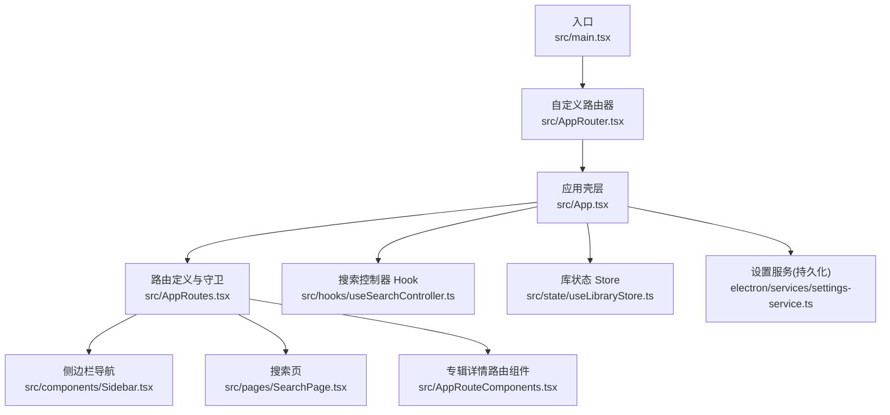
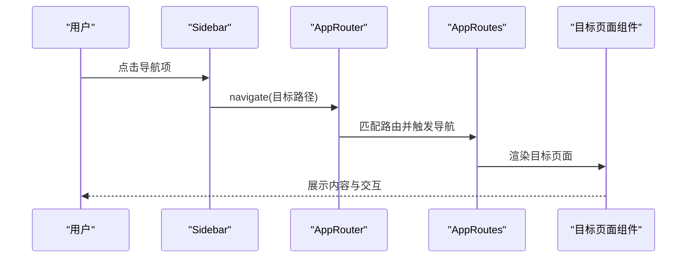
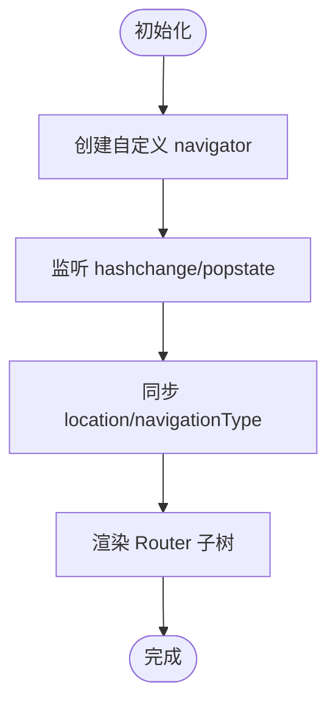
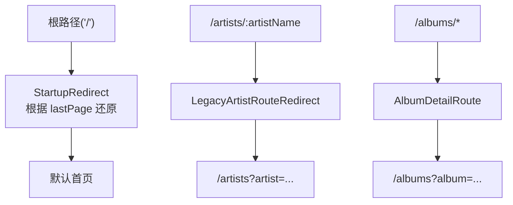
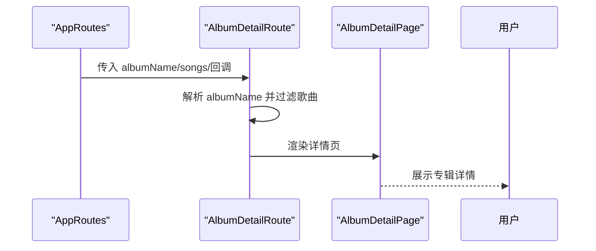
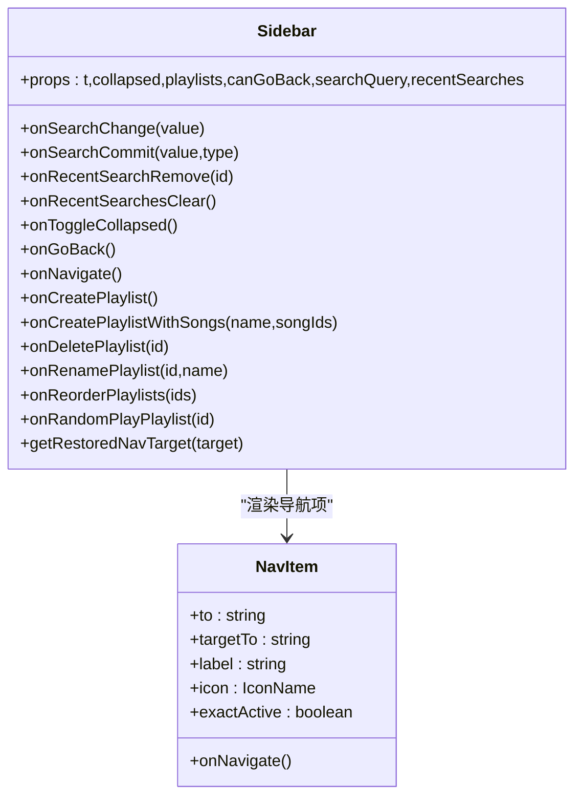
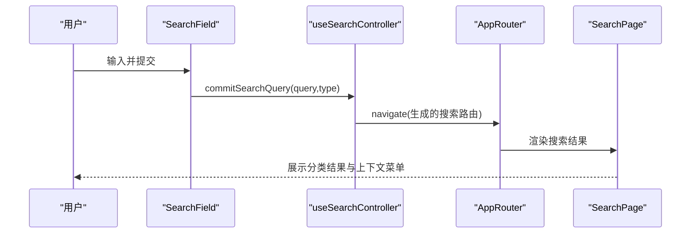
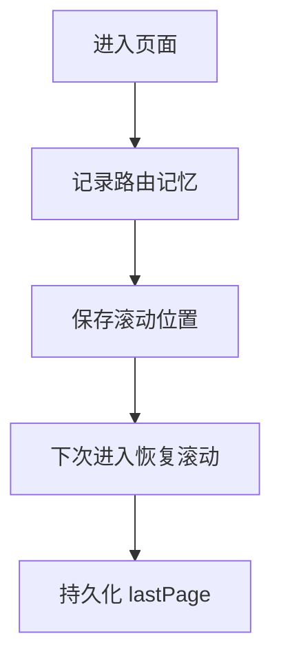
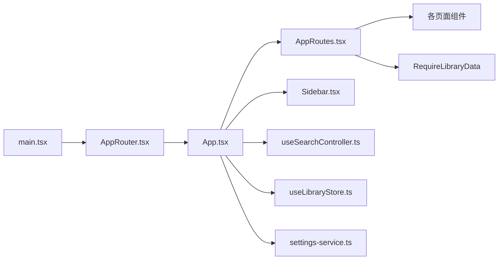

# 导航与路由

<cite>
**本文引用的文件**
- [src/main.tsx](file://src/main.tsx)
- [src/AppRouter.tsx](file://src/AppRouter.tsx)
- [src/AppRoutes.tsx](file://src/AppRoutes.tsx)
- [src/AppRouteComponents.tsx](file://src/AppRouteComponents.tsx)
- [src/App.tsx](file://src/App.tsx)
- [src/components/Sidebar.tsx](file://src/components/Sidebar.tsx)
- [src/pages/SearchPage.tsx](file://src/pages/SearchPage.tsx)
- [src/hooks/useSearchController.ts](file://src/hooks/useSearchController.ts)
- [src/appModel.ts](file://src/appModel.ts)
- [src/state/useLibraryStore.ts](file://src/state/useLibraryStore.ts)
- [electron/services/settings-service.ts](file://electron/services/settings-service.ts)
</cite>

## 目录
1. [简介](#简介)
2. [项目结构](#项目结构)
3. [核心组件](#核心组件)
4. [架构总览](#架构总览)
5. [详细组件分析](#详细组件分析)
6. [依赖关系分析](#依赖关系分析)
7. [性能考量](#性能考量)
8. [故障排查指南](#故障排查指南)
9. [结论](#结论)
10. [附录](#附录)

## 简介
本章节面向 SMPlayer 的导航与路由系统，围绕 React Router 的定制实现、路由定义与嵌套、动态路由与参数传递、导航结构（侧边栏、面包屑式导航）、路由守卫与权限控制、页面间导航逻辑（前进/后退、页面记忆与滚动状态恢复）、搜索功能的路由集成、导航性能优化策略、可访问性与键盘导航支持，以及路由与状态管理的集成进行系统化说明。

## 项目结构
SMPlayer 在前端入口通过自定义的 AppRouter 包裹应用，内部使用 React Router DOM 的 Router 组件与自定义的 navigator 实现，以 hash 形式的 URL 实现 SPA 路由；AppRoutes 定义了主要页面路由与数据加载守卫；Sidebar 提供侧边栏导航与键盘交互；SearchPage 与 useSearchController 集成搜索参数与历史记录；App.tsx 负责页面标题、滚动状态恢复、页面记忆等横切关注点。

图示来源
- [src/main.tsx:8-14](file://src/main.tsx#L8-L14)
- [src/AppRouter.tsx:25-81](file://src/AppRouter.tsx#L25-L81)
- [src/App.tsx:40-41](file://src/App.tsx#L40-L41)
- [src/AppRoutes.tsx:326-327](file://src/AppRoutes.tsx#L326-L327)
- [src/components/Sidebar.tsx:22-44](file://src/components/Sidebar.tsx#L22-L44)
- [src/pages/SearchPage.tsx:105-135](file://src/pages/SearchPage.tsx#L105-L135)
- [src/AppRouteComponents.tsx:13-106](file://src/AppRouteComponents.tsx#L13-L106)
- [src/hooks/useSearchController.ts:24-91](file://src/hooks/useSearchController.ts#L24-L91)
- [src/state/useLibraryStore.ts](file://src/state/useLibraryStore.ts)
- [electron/services/settings-service.ts:271-293](file://electron/services/settings-service.ts#L271-L293)

章节来源
- [src/main.tsx:8-14](file://src/main.tsx#L8-L14)
- [src/AppRouter.tsx:25-81](file://src/AppRouter.tsx#L25-L81)
- [src/AppRoutes.tsx:326-327](file://src/AppRoutes.tsx#L326-L327)

## 核心组件
- 自定义路由器 AppRouter：基于 hash 的浏览器历史 API 实现 push/replace/go，提供 createHref、push、replace、go 方法，监听 hashchange/popstate 同步 location 与 navigationType。
- 路由定义与守卫 AppRoutes：集中声明路由路径、页面组件、数据加载守卫 RequireLibraryData、启动重定向 StartupRedirect、遗留路由重定向 LegacyArtistRouteRedirect。
- 专辑详情路由组件 AlbumDetailRoute：从 URL 或路由参数解析专辑名，筛选歌曲并渲染详情页。
- 侧边栏导航 Sidebar：提供主/播放区/播放列表导航、折叠展开、键盘导航、搜索历史下拉、右键菜单等。
- 搜索控制器 useSearchController：封装搜索输入、提交、路由跳转、最近搜索写入、目录内搜索等。
- 页面记忆与滚动恢复 App.tsx：维护路由记忆表、滚动位置映射、页面标题生成、导航深度计算、最小/覆盖布局切换。
- 设置服务 settings-service：负责保存视图状态（最后页面）与播放设置，配合 App.tsx 的持久化逻辑。

章节来源
- [src/AppRouter.tsx:25-81](file://src/AppRouter.tsx#L25-L81)
- [src/AppRoutes.tsx:38-82](file://src/AppRoutes.tsx#L38-L82)
- [src/AppRouteComponents.tsx:13-106](file://src/AppRouteComponents.tsx#L13-L106)
- [src/components/Sidebar.tsx:22-44](file://src/components/Sidebar.tsx#L22-L44)
- [src/hooks/useSearchController.ts:24-91](file://src/hooks/useSearchController.ts#L24-L91)
- [src/App.tsx:341-525](file://src/App.tsx#L341-L525)
- [electron/services/settings-service.ts:271-293](file://electron/services/settings-service.ts#L271-L293)

## 架构总览
SMPlayer 的导航体系采用“自定义路由器 + 声明式路由 + 数据守卫 + 侧边栏导航 + 搜索集成”的组合模式。自定义路由器确保在 Electron 渲染进程中使用 hash 路由，避免与主进程协议冲突；AppRoutes 将页面与数据加载需求解耦；Sidebar 作为统一入口承载导航、搜索与快捷操作；App.tsx 处理页面标题、滚动与页面记忆；搜索通过 useSearchController 将查询参数注入路由并更新最近搜索。

图示来源
- [src/components/Sidebar.tsx:508-537](file://src/components/Sidebar.tsx#L508-L537)
- [src/AppRouter.tsx:31-54](file://src/AppRouter.tsx#L31-L54)
- [src/AppRoutes.tsx:326-327](file://src/AppRoutes.tsx#L326-L327)

## 详细组件分析

### 自定义路由器 AppRouter
- 功能要点
  - 使用 window.history.pushState/replaceState 与 hash 字符串维护 location。
  - 提供 createHref、push、replace、go 方法，兼容 React Router 的导航接口。
  - 监听 hashchange 与 popstate 事件，同步 Router 的 location 与 navigationType。
- 关键行为
  - getLocationFromHash 解析当前 hash 为 pathname/search/hash/state/key。
  - normalizeRoutePath 与 getPathFromTarget 规范化路径格式。
- 适用场景
  - Electron 渲染进程中的 SPA 路由，避免与主进程协议冲突。

图示来源
- [src/AppRouter.tsx:12-23](file://src/AppRouter.tsx#L12-L23)
- [src/AppRouter.tsx:31-54](file://src/AppRouter.tsx#L31-L54)
- [src/AppRouter.tsx:56-70](file://src/AppRouter.tsx#L56-L70)

章节来源
- [src/AppRouter.tsx:25-81](file://src/AppRouter.tsx#L25-L81)

### 路由定义与守卫 AppRoutes
- 路由结构
  - 根路径 "/" -> StartupRedirect，启动时根据 lastPage 还原。
  - "/songs"、"/artists"、"/albums"、"/now-playing"、"/recent"、"/local"、"/settings" 等常规页面。
  - "/artists/:artistName" -> LegacyArtistRouteRedirect，重定向到带查询参数的艺术家页。
  - "/albums/*" -> AlbumDetailRoute，支持从路径或查询参数解析专辑名。
- 数据守卫
  - RequireLibraryData：按需加载歌曲/文件夹/最近数据，保证页面渲染前的数据可用。
- 权限与引导
  - 缺省根目录时显示 MissingLibraryRootPage 引导选择根目录。
  - 旧版艺术家路由自动重定向至新查询参数形式。

图示来源
- [src/AppRoutes.tsx:38-82](file://src/AppRoutes.tsx#L38-L82)
- [src/AppRoutes.tsx:55-65](file://src/AppRoutes.tsx#L55-L65)
- [src/AppRoutes.tsx:544-594](file://src/AppRoutes.tsx#L544-L594)
- [src/AppRouteComponents.tsx:13-106](file://src/AppRouteComponents.tsx#L13-L106)

章节来源
- [src/AppRoutes.tsx:326-824](file://src/AppRoutes.tsx#L326-L824)

### 专辑详情路由组件 AlbumDetailRoute
- 功能要点
  - 从 URL 路径或查询参数解析 albumName。
  - 过滤匹配歌曲并排序，渲染 AlbumDetailPage。
  - 支持跳转到艺术家/专辑详情页。
- 参数与导航
  - 通过 navigate 传入编码后的查询参数，保持 URL 语义清晰。

图示来源
- [src/AppRouteComponents.tsx:52-104](file://src/AppRouteComponents.tsx#L52-L104)

章节来源
- [src/AppRouteComponents.tsx:13-106](file://src/AppRouteComponents.tsx#L13-L106)

### 侧边栏导航 Sidebar
- 导航结构
  - 主要区域：音乐库、专辑、艺术家。
  - 播放区域：本地、最近、正在播放、我的收藏。
  - 播放列表：可展开/折叠、拖拽重排、随机播放、右键菜单。
- 键盘与可访问性
  - NavItem 支持 Enter/Space 键激活。
  - 折叠状态下悬浮提示文本。
- 搜索与历史
  - 内嵌 SearchField，支持最近搜索下拉与清空。
- 返回按钮
  - 结合 App.tsx 的 goBackFromSidebar 与导航深度，处理返回逻辑。

图示来源
- [src/components/Sidebar.tsx:67-90](file://src/components/Sidebar.tsx#L67-L90)
- [src/components/Sidebar.tsx:508-537](file://src/components/Sidebar.tsx#L508-L537)

章节来源
- [src/components/Sidebar.tsx:22-44](file://src/components/Sidebar.tsx#L22-L44)
- [src/components/Sidebar.tsx:508-537](file://src/components/Sidebar.tsx#L508-L537)

### 搜索功能与路由集成
- useSearchController
  - 提交搜索时根据类型（sidebar/artists/albums/songs/playlists/folders）生成对应路由。
  - 对目录内搜索，通过 folder 查询参数定位范围。
  - 控制搜索结果延迟展示与最近搜索写入。
- SearchPage
  - 读取 location.search 中的 type、folder 等参数，决定筛选与排序。
  - 支持在卡片上下文菜单中跳转到艺术家/专辑详情页，保持 URL 一致性。

图示来源
- [src/hooks/useSearchController.ts:42-79](file://src/hooks/useSearchController.ts#L42-L79)
- [src/pages/SearchPage.tsx:253-269](file://src/pages/SearchPage.tsx#L253-L269)

章节来源
- [src/hooks/useSearchController.ts:24-91](file://src/hooks/useSearchController.ts#L24-L91)
- [src/pages/SearchPage.tsx:105-135](file://src/pages/SearchPage.tsx#L105-L135)

### 页面记忆与滚动状态恢复
- 页面记忆
  - App.tsx 维护 routeMemoryRef 映射，记录 /artists、/albums、/playlists 等分段目标。
  - getRestoredNavTarget 优先从记忆表恢复目标，否则回退到默认值。
- 滚动状态恢复
  - 通过 RESTORABLE_SCROLL_SELECTORS 与 getScrollElementKey 标识可恢复滚动容器。
  - 保存/恢复 routeScrollPositionsRef 中的 top/left 偏移，结合 requestAnimationFrame 两次刷新确保稳定。
- 最后页面持久化
  - settings-service.saveViewState 记录 lastPage，App.tsx 在非根路径时写入。

图示来源
- [src/App.tsx:341-357](file://src/App.tsx#L341-L357)
- [src/App.tsx:377-424](file://src/App.tsx#L377-L424)
- [src/App.tsx:506-525](file://src/App.tsx#L506-L525)
- [src/appModel.ts:4-13](file://src/appModel.ts#L4-L13)
- [src/appModel.ts:120-134](file://src/appModel.ts#L120-L134)
- [electron/services/settings-service.ts:271-279](file://electron/services/settings-service.ts#L271-L279)

章节来源
- [src/App.tsx:341-525](file://src/App.tsx#L341-L525)
- [src/appModel.ts:4-13](file://src/appModel.ts#L4-L13)
- [electron/services/settings-service.ts:271-279](file://electron/services/settings-service.ts#L271-L279)

### 路由守卫与权限控制
- 数据守卫
  - RequireLibraryData：在渲染页面前按需加载歌曲/文件夹/最近数据，避免白屏与空数据。
- 库根目录引导
  - 当未设置根目录且不在 /settings 与远程路由时，显示 MissingLibraryRootPage 并引导选择根目录。
- 遗留路由重定向
  - /artists/:artistName 重定向到 /artists?artist=...，保证查询参数一致性。

章节来源
- [src/AppRoutes.tsx:74-82](file://src/AppRoutes.tsx#L74-L82)
- [src/AppRoutes.tsx:316-324](file://src/AppRoutes.tsx#L316-L324)
- [src/AppRoutes.tsx:55-65](file://src/AppRoutes.tsx#L55-L65)

### 页面标题与面包屑导航
- 页面标题
  - App.tsx 根据当前路径、计数、搜索词、播放队列长度等生成标题，支持紧凑艺术家标题与沉浸式标题覆盖。
- 面包屑导航
  - 侧边栏 NavItem 通过 exactActive 与 startsWith 判断激活态，形成“面包屑式”导航反馈。
  - 搜索页通过 SearchResultTabs 展示当前筛选类型，辅助导航理解。

章节来源
- [src/App.tsx:672-686](file://src/App.tsx#L672-L686)
- [src/components/Sidebar.tsx:508-511](file://src/components/Sidebar.tsx#L508-L511)
- [src/pages/SearchPage.tsx:374-383](file://src/pages/SearchPage.tsx#L374-L383)

### 可访问性与键盘导航
- Sidebar
  - NavItem 支持键盘激活（Enter/Space），折叠状态悬浮提示，焦点/悬停事件统一处理。
  - 播放列表项支持拖拽、右键菜单、随机播放等交互。
- CommandBar/按钮
  - CommandBarButton 提供 aria-* 属性与禁用/忙碌状态，提升可访问性。
- 滚动与对话框
  - PopupDialog 对滚轮/触摸滚动进行边界判断，避免穿透到背景。

章节来源
- [src/components/Sidebar.tsx:508-537](file://src/components/Sidebar.tsx#L508-L537)
- [src/components/PopupDialog.tsx:62-81](file://src/components/PopupDialog.tsx#L62-L81)

### 路由与状态管理集成
- URL 同步
  - useSearchController 将搜索词写入 location.search，SearchPage 读取并渲染结果。
  - AlbumDetailRoute 通过 navigate 传递编码后的查询参数，保持 URL 一致性。
- 页面状态恢复
  - App.tsx 通过 routeScrollPositionsRef 与 getScrollElementKey 恢复滚动位置。
  - settings-service.saveViewState 持久化 lastPage，AppRoutes.StartupRedirect 用于启动恢复。
- 数据加载与页面渲染
  - RequireLibraryData 在 AppRoutes 中包裹页面组件，确保数据就绪后再渲染。

章节来源
- [src/hooks/useSearchController.ts:56](file://src/hooks/useSearchController.ts#L56)
- [src/pages/SearchPage.tsx:253-269](file://src/pages/SearchPage.tsx#L253-L269)
- [src/AppRouteComponents.tsx:97-102](file://src/AppRouteComponents.tsx#L97-L102)
- [src/AppRoutes.tsx:74-82](file://src/AppRoutes.tsx#L74-L82)
- [electron/services/settings-service.ts:271-279](file://electron/services/settings-service.ts#L271-L279)

## 依赖关系分析
- 入口依赖
  - main.tsx 依赖 AppRouter 与 App。
- 路由依赖
  - AppRouter 依赖 react-router-dom 的 Router 与 createPath，自定义 navigator。
  - AppRoutes 依赖各页面组件与数据守卫。
- 侧边栏依赖
  - Sidebar 依赖 useLocation/useNavigate，NavItems 通过 flushSync 与 navigate 协同。
- 搜索依赖
  - useSearchController 依赖 navigate/saveSearchQuery/addRecentSearch。
- 状态与持久化
  - App.tsx 依赖 useLibraryStore 与 settings-service 保存 lastPage。

图示来源
- [src/main.tsx:8-14](file://src/main.tsx#L8-L14)
- [src/AppRouter.tsx:25-81](file://src/AppRouter.tsx#L25-L81)
- [src/App.tsx:40-41](file://src/App.tsx#L40-L41)
- [src/AppRoutes.tsx:326-327](file://src/AppRoutes.tsx#L326-L327)
- [src/components/Sidebar.tsx:508-537](file://src/components/Sidebar.tsx#L508-L537)
- [src/hooks/useSearchController.ts:24-91](file://src/hooks/useSearchController.ts#L24-L91)
- [src/state/useLibraryStore.ts](file://src/state/useLibraryStore.ts)
- [electron/services/settings-service.ts:271-293](file://electron/services/settings-service.ts#L271-L293)

章节来源
- [src/main.tsx:8-14](file://src/main.tsx#L8-L14)
- [src/AppRoutes.tsx:326-327](file://src/AppRoutes.tsx#L326-L327)

## 性能考量
- 路由懒加载
  - 建议对大型页面组件（如搜索页、专辑详情页）采用 React.lazy 与 Suspense，减少首屏体积。
- 预加载
  - 在用户可能导航的方向上（如专辑详情页）预取相关数据，降低感知延迟。
- 滚动恢复优化
  - 使用 requestAnimationFrame 双次刷新确保容器尺寸稳定后再恢复滚动。
- 数据守卫
  - RequireLibraryData 按需加载，避免一次性加载全部数据导致卡顿。
- 路由参数编码
  - 使用 encodeURIComponent 保证查询参数安全，避免重复请求与错误匹配。

[本节为通用建议，无需特定文件引用]

## 故障排查指南
- Hash 路由不生效
  - 检查 AppRouter 是否正确监听 hashchange/popstate，确认 createHref 与 push/replace 行为一致。
- 页面空白或数据缺失
  - 确认 RequireLibraryData 已包裹页面组件，检查 loadRequiredData 的调用时机。
- 搜索无结果或参数丢失
  - 核对 useSearchController 的 navigate 调用与 SearchPage 的 location.search 解析。
- 滚动位置未恢复
  - 检查 RESTORABLE_SCROLL_SELECTORS 与 getScrollElementKey 的匹配规则，确认 routeScrollPositionsRef 的保存/恢复流程。
- 最后页面未恢复
  - 确认 settings-service.saveViewState 已写入 lastPage，AppRoutes.StartupRedirect 正常执行。

章节来源
- [src/AppRouter.tsx:56-70](file://src/AppRouter.tsx#L56-L70)
- [src/AppRoutes.tsx:74-82](file://src/AppRoutes.tsx#L74-L82)
- [src/hooks/useSearchController.ts:56](file://src/hooks/useSearchController.ts#L56)
- [src/App.tsx:377-424](file://src/App.tsx#L377-L424)
- [electron/services/settings-service.ts:271-279](file://electron/services/settings-service.ts#L271-L279)

## 结论
SMPlayer 的导航与路由系统通过自定义路由器、声明式路由与数据守卫、侧边栏导航与搜索集成，构建了稳定、可扩展且具备良好可访问性的 SPA 导航体验。页面记忆与滚动恢复提升了用户体验，而路由与状态管理的紧密集成则确保了 URL 与页面状态的一致性。后续可在大型页面上引入懒加载与预加载策略，进一步优化性能。

[本节为总结性内容，无需特定文件引用]

## 附录
- 关键常量与工具
  - RESTORABLE_ROUTES：可恢复路由集合。
  - SCROLLBAR_HOST_SELECTOR/RESTORABLE_SCROLL_SELECTORS：滚动容器选择器集合。
  - getScrollElementKey：滚动元素键生成。
  - getRouteSection/isAlbumDetailRoute/isPlaylistDetailRoute：路由分段与类型判定。

章节来源
- [src/appModel.ts:4-13](file://src/appModel.ts#L4-L13)
- [src/appModel.ts:15-56](file://src/appModel.ts#L15-L56)
- [src/appModel.ts:120-134](file://src/appModel.ts#L120-L134)
- [src/appModel.ts:88-118](file://src/appModel.ts#L88-L118)