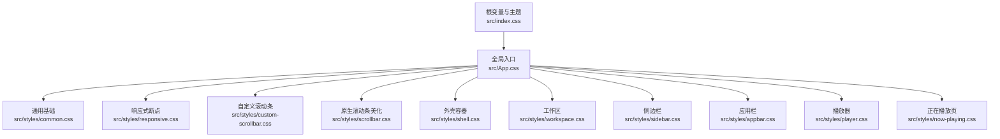
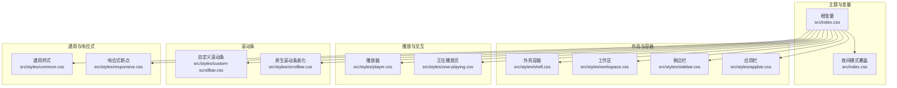
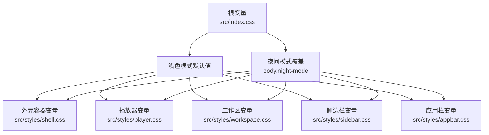
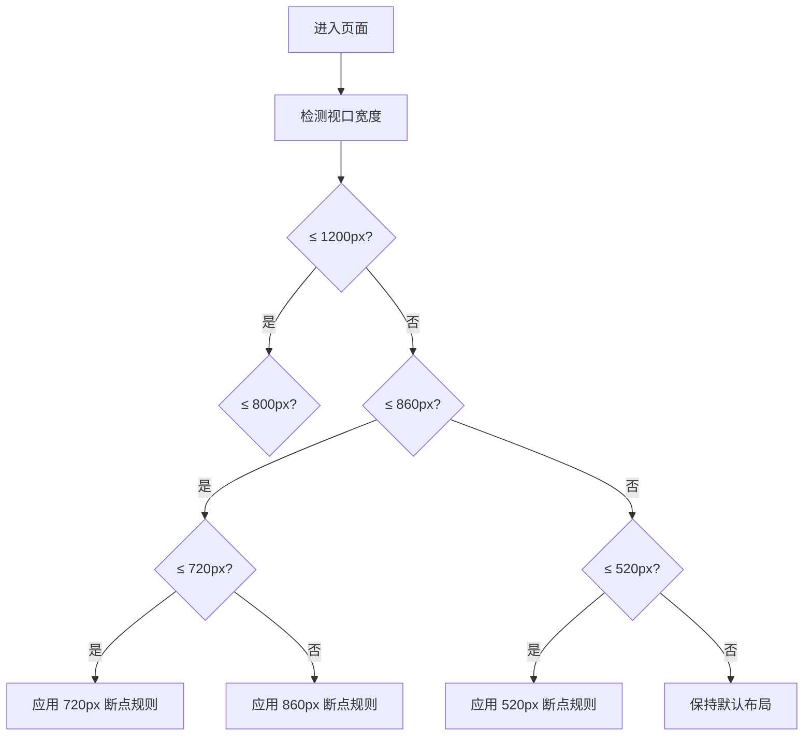
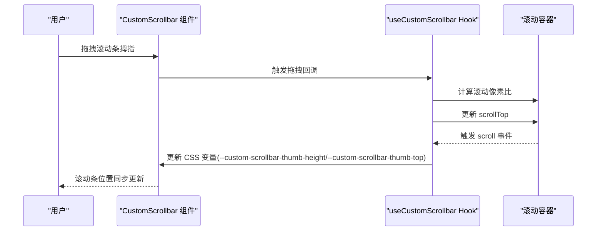
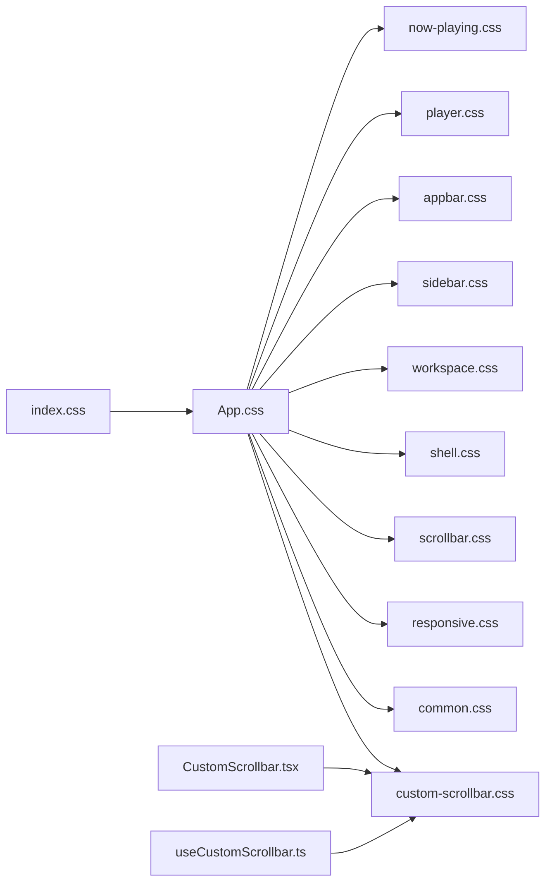

# 样式系统与主题

<cite>
**本文档引用的文件**
- [src/index.css](file://src/index.css)
- [src/App.css](file://src/App.css)
- [src/styles/common.css](file://src/styles/common.css)
- [src/styles/responsive.css](file://src/styles/responsive.css)
- [src/styles/custom-scrollbar.css](file://src/styles/custom-scrollbar.css)
- [src/styles/scrollbar.css](file://src/styles/scrollbar.css)
- [src/styles/shell.css](file://src/styles/shell.css)
- [src/styles/workspace.css](file://src/styles/workspace.css)
- [src/styles/sidebar.css](file://src/styles/sidebar.css)
- [src/styles/appbar.css](file://src/styles/appbar.css)
- [src/styles/player.css](file://src/styles/player.css)
- [src/styles/now-playing.css](file://src/styles/now-playing.css)
- [src/components/CustomScrollbar.tsx](file://src/components/CustomScrollbar.tsx)
- [src/hooks/useCustomScrollbar.ts](file://src/hooks/useCustomScrollbar.ts)
</cite>

## 目录
1. [简介](#简介)
2. [项目结构](#项目结构)
3. [核心组件](#核心组件)
4. [架构总览](#架构总览)
5. [详细组件分析](#详细组件分析)
6. [依赖关系分析](#依赖关系分析)
7. [性能考量](#性能考量)
8. [故障排查指南](#故障排查指南)
9. [结论](#结论)
10. [附录](#附录)

## 简介
本文件系统性梳理 SMPlayer 的样式系统与主题系统，重点覆盖以下方面：
- CSS 架构设计：模块化组织、BEM 风格类名、CSS 变量体系
- 主题系统：浅色/深色模式切换、夜间模式变量覆盖、组件级主题适配
- 响应式设计：断点策略、网格与弹性布局、移动端适配
- 自定义滚动条：原生滚动条与自绘滚动条并存的设计与实现
- 动画与过渡：关键动效与交互反馈
- 性能优化：CSS 变量、按需加载、媒体查询优化
- 调试与维护：最佳实践与常见问题定位

## 项目结构
SMPlayer 的样式采用“模块化 CSS + 全局入口”的组织方式：
- 入口样式通过全局样式文件聚合各模块样式
- 每个功能页面或组件区域拥有独立的样式文件，便于维护与复用
- 使用 CSS 变量统一管理色彩与层级，配合媒体查询实现响应式布局

图表来源
- [src/App.css:1-34](file://src/App.css#L1-L34)
- [src/index.css:1-203](file://src/index.css#L1-L203)

章节来源
- [src/App.css:1-34](file://src/App.css#L1-L34)
- [src/index.css:1-203](file://src/index.css#L1-L203)

## 核心组件
- CSS 变量与主题
  - 在根层集中声明主题变量，支持浅色/深色模式切换
  - 深色模式通过 `body.night-mode` 作用域覆盖变量值，确保全局一致性
- 模块化样式
  - 按功能拆分样式文件，如 shell、workspace、sidebar、appbar、player、now-playing 等
  - 通过入口文件统一导入，避免重复引入与顺序问题
- 响应式体系
  - 基于媒体查询在不同宽度下调整布局与控件尺寸
  - 结合 CSS Grid 与 Flex 布局实现灵活的页面结构
- 自定义滚动条
  - 提供两套方案：原生滚动条美化（兼容性好）与自绘滚动条（可定制性强）
  - 自绘滚动条通过 React Hook 计算滚动状态并更新 CSS 变量驱动样式

章节来源
- [src/index.css:1-203](file://src/index.css#L1-L203)
- [src/styles/shell.css:1-378](file://src/styles/shell.css#L1-L378)
- [src/styles/workspace.css:1-101](file://src/styles/workspace.css#L1-L101)
- [src/styles/sidebar.css:1-300](file://src/styles/sidebar.css#L1-L300)
- [src/styles/appbar.css:1-688](file://src/styles/appbar.css#L1-L688)
- [src/styles/player.css:1-800](file://src/styles/player.css#L1-L800)
- [src/styles/now-playing.css:1-800](file://src/styles/now-playing.css#L1-L800)
- [src/styles/custom-scrollbar.css:1-63](file://src/styles/custom-scrollbar.css#L1-L63)
- [src/styles/scrollbar.css:1-289](file://src/styles/scrollbar.css#L1-L289)

## 架构总览
整体架构以“变量驱动 + 模块化 + 响应式”为核心：
- 变量驱动：所有颜色、阴影、边框、文字等通过 CSS 变量统一管理，深色模式仅覆盖必要变量
- 模块化：每个功能区域独立样式文件，入口文件集中导入，便于按需加载与维护
- 响应式：在多个断点下对布局、控件尺寸、显示密度进行调整，兼顾桌面端与移动端体验

图表来源
- [src/index.css:1-203](file://src/index.css#L1-L203)
- [src/styles/shell.css:1-378](file://src/styles/shell.css#L1-L378)
- [src/styles/workspace.css:1-101](file://src/styles/workspace.css#L1-L101)
- [src/styles/sidebar.css:1-300](file://src/styles/sidebar.css#L1-L300)
- [src/styles/appbar.css:1-688](file://src/styles/appbar.css#L1-L688)
- [src/styles/player.css:1-800](file://src/styles/player.css#L1-L800)
- [src/styles/now-playing.css:1-800](file://src/styles/now-playing.css#L1-L800)
- [src/styles/custom-scrollbar.css:1-63](file://src/styles/custom-scrollbar.css#L1-L63)
- [src/styles/scrollbar.css:1-289](file://src/styles/scrollbar.css#L1-L289)
- [src/styles/common.css:1-303](file://src/styles/common.css#L1-L303)
- [src/styles/responsive.css:1-560](file://src/styles/responsive.css#L1-L560)

## 详细组件分析

### CSS 架构与模块化
- 模块划分清晰：shell、workspace、sidebar、appbar、player、now-playing、common、responsive、scrollbar、custom-scrollbar 等
- 统一的导入入口：通过 App.css 将各模块样式按需引入，避免重复与顺序问题
- 类名风格：采用语义化与上下文结合的方式，配合 BEM 风格提升可读性与可维护性

章节来源
- [src/App.css:1-34](file://src/App.css#L1-L34)
- [src/styles/common.css:1-303](file://src/styles/common.css#L1-L303)
- [src/styles/responsive.css:1-560](file://src/styles/responsive.css#L1-L560)

### CSS 变量系统与主题
- 根变量集中管理：颜色、表面、阴影、边框、焦点等变量在根层定义
- 夜间模式覆盖：通过 `body.night-mode` 作用域重写关键变量，保证组件在深色背景下的可读性与对比度
- 组件级变量：如播放器、工作区、侧边栏等容器使用局部变量控制外观细节

图表来源
- [src/index.css:1-203](file://src/index.css#L1-L203)
- [src/styles/shell.css:1-378](file://src/styles/shell.css#L1-L378)
- [src/styles/player.css:1-800](file://src/styles/player.css#L1-L800)
- [src/styles/workspace.css:1-101](file://src/styles/workspace.css#L1-L101)
- [src/styles/sidebar.css:1-300](file://src/styles/sidebar.css#L1-L300)
- [src/styles/appbar.css:1-688](file://src/styles/appbar.css#L1-L688)

章节来源
- [src/index.css:1-203](file://src/index.css#L1-L203)

### 深色模式支持与动态切换
- 切换机制：通过在 `body` 上添加/移除 `night-mode` 类实现主题切换
- 变量覆盖：仅覆盖必要的变量，减少覆盖范围，提高维护效率
- 组件适配：各模块样式中针对夜间模式进行针对性覆盖，确保视觉一致性

章节来源
- [src/index.css:67-101](file://src/index.css#L67-L101)
- [src/styles/common.css:246-297](file://src/styles/common.css#L246-L297)
- [src/styles/appbar.css:581-687](file://src/styles/appbar.css#L581-L687)

### 响应式设计与断点策略
- 断点分布：以 1200px、860px、800px、720px、520px 等为主要断点
- 网格与弹性布局：在不同断点下调整 CSS Grid 列数、Flex 排列与控件尺寸
- 移动端适配：在窄屏下隐藏次要元素、缩小控件、简化布局，保证可用性

图表来源
- [src/styles/responsive.css:1-560](file://src/styles/responsive.css#L1-L560)
- [src/styles/player.css:778-800](file://src/styles/player.css#L778-L800)

章节来源
- [src/styles/responsive.css:1-560](file://src/styles/responsive.css#L1-L560)
- [src/styles/player.css:649-797](file://src/styles/player.css#L649-L797)

### 自定义滚动条设计与实现
- 设计目标：在保留原生滚动惯性的前提下，提供更一致的视觉与交互体验
- 实现方案：
  - 原生滚动条美化：通过 `scrollbar-width`、`scrollbar-color` 与 WebKit 伪元素统一滚动条外观
  - 自绘滚动条：通过 React Hook 计算滚动状态，动态更新 CSS 变量驱动滚动条位置与高度
- 组件与 Hook：
  - 组件：CustomScrollbar.tsx 提供滚动条 UI 结构
  - Hook：useCustomScrollbar.ts 计算滚动条尺寸与位置，并处理拖拽交互

图表来源
- [src/components/CustomScrollbar.tsx:1-16](file://src/components/CustomScrollbar.tsx#L1-L16)
- [src/hooks/useCustomScrollbar.ts:1-96](file://src/hooks/useCustomScrollbar.ts#L1-L96)
- [src/styles/custom-scrollbar.css:1-63](file://src/styles/custom-scrollbar.css#L1-L63)
- [src/styles/scrollbar.css:1-289](file://src/styles/scrollbar.css#L1-L289)

章节来源
- [src/components/CustomScrollbar.tsx:1-16](file://src/components/CustomScrollbar.tsx#L1-L16)
- [src/hooks/useCustomScrollbar.ts:1-96](file://src/hooks/useCustomScrollbar.ts#L1-L96)
- [src/styles/custom-scrollbar.css:1-63](file://src/styles/custom-scrollbar.css#L1-L63)
- [src/styles/scrollbar.css:1-289](file://src/styles/scrollbar.css#L1-L289)

### 动画与过渡效果
- 加载动画：统一使用旋转动画表示加载状态，确保在不同主题下可见性良好
- 播放器动效：播放器歌词滚动、进度加载波纹、按钮悬停与激活态过渡
- 滚动条动效：滚动条出现/隐藏的透明度过渡，拇指悬停高亮

章节来源
- [src/styles/common.css:193-197](file://src/styles/common.css#L193-L197)
- [src/styles/player.css:223-231](file://src/styles/player.css#L223-L231)
- [src/styles/player.css:478-486](file://src/styles/player.css#L478-L486)
- [src/styles/custom-scrollbar.css:26-35](file://src/styles/custom-scrollbar.css#L26-L35)

### 样式定制指南
- 修改主题颜色
  - 在根变量中调整主色、文本色、表面色等关键变量
  - 夜间模式下仅覆盖必要变量，避免全量替换
- 修改字体与字号
  - 在根层调整字体族与字号基准，影响全局文本渲染
- 修改间距与圆角
  - 通过局部变量或类名中的尺寸属性进行微调
- 滚动条定制
  - 原生滚动条：调整 `scrollbar-color` 与伪元素样式
  - 自绘滚动条：通过 CSS 变量与组件属性控制外观与行为

章节来源
- [src/index.css:1-203](file://src/index.css#L1-L203)
- [src/styles/custom-scrollbar.css:16-62](file://src/styles/custom-scrollbar.css#L16-L62)
- [src/styles/scrollbar.css:14-173](file://src/styles/scrollbar.css#L14-L173)

## 依赖关系分析
- 入口依赖：App.css 作为样式聚合入口，依赖所有模块样式文件
- 变量依赖：各模块样式依赖根变量与夜间模式覆盖
- 组件依赖：自绘滚动条依赖 CustomScrollbar 组件与 useCustomScrollbar Hook

图表来源
- [src/App.css:1-34](file://src/App.css#L1-L34)
- [src/index.css:1-203](file://src/index.css#L1-L203)
- [src/styles/custom-scrollbar.css:1-63](file://src/styles/custom-scrollbar.css#L1-L63)
- [src/components/CustomScrollbar.tsx:1-16](file://src/components/CustomScrollbar.tsx#L1-L16)
- [src/hooks/useCustomScrollbar.ts:1-96](file://src/hooks/useCustomScrollbar.ts#L1-L96)

章节来源
- [src/App.css:1-34](file://src/App.css#L1-L34)
- [src/index.css:1-203](file://src/index.css#L1-L203)

## 性能考量
- CSS 变量：集中管理颜色与层级，减少重复计算与多处修改成本
- 媒体查询优化：合理设置断点，避免过多条件判断；在窄屏下减少复杂阴影与滤镜
- 滚动性能：自绘滚动条使用 `requestAnimationFrame` 与 `ResizeObserver`，降低主线程压力
- 按需加载：通过模块化样式与入口聚合，避免一次性加载全部样式

## 故障排查指南
- 夜间模式不生效
  - 检查 `body` 是否正确添加/移除 `night-mode` 类
  - 确认夜间模式变量覆盖是否正确
- 滚动条异常
  - 自绘滚动条：检查 Hook 中的计算逻辑与事件绑定
  - 原生滚动条：确认浏览器兼容性与伪元素样式
- 响应式布局错乱
  - 检查断点设置与媒体查询优先级
  - 确保网格与弹性布局在窄屏下的回退规则

章节来源
- [src/index.css:67-101](file://src/index.css#L67-L101)
- [src/hooks/useCustomScrollbar.ts:18-62](file://src/hooks/useCustomScrollbar.ts#L18-L62)
- [src/styles/responsive.css:1-560](file://src/styles/responsive.css#L1-L560)

## 结论
SMPlayer 的样式系统以 CSS 变量为核心，结合模块化与响应式设计，实现了统一、可扩展且高性能的主题与界面体验。通过原生滚动条美化与自绘滚动条并存的策略，兼顾了兼容性与定制能力。建议在后续迭代中持续优化媒体查询与动画性能，完善主题变量的文档与示例，以便团队协作与外部贡献。

## 附录
- 关键变量参考路径
  - [根变量与夜间模式变量:1-203](file://src/index.css#L1-L203)
- 模块样式参考路径
  - [通用样式:1-303](file://src/styles/common.css#L1-L303)
  - [响应式断点:1-560](file://src/styles/responsive.css#L1-L560)
  - [自定义滚动条:1-63](file://src/styles/custom-scrollbar.css#L1-L63)
  - [原生滚动条美化:1-289](file://src/styles/scrollbar.css#L1-L289)
  - [外壳容器:1-378](file://src/styles/shell.css#L1-L378)
  - [工作区:1-101](file://src/styles/workspace.css#L1-L101)
  - [侧边栏:1-300](file://src/styles/sidebar.css#L1-L300)
  - [应用栏:1-688](file://src/styles/appbar.css#L1-L688)
  - [播放器:1-800](file://src/styles/player.css#L1-L800)
  - [正在播放页:1-800](file://src/styles/now-playing.css#L1-L800)
- 组件与 Hook 参考路径
  - [自定义滚动条组件:1-16](file://src/components/CustomScrollbar.tsx#L1-L16)
  - [自定义滚动条 Hook:1-96](file://src/hooks/useCustomScrollbar.ts#L1-L96)