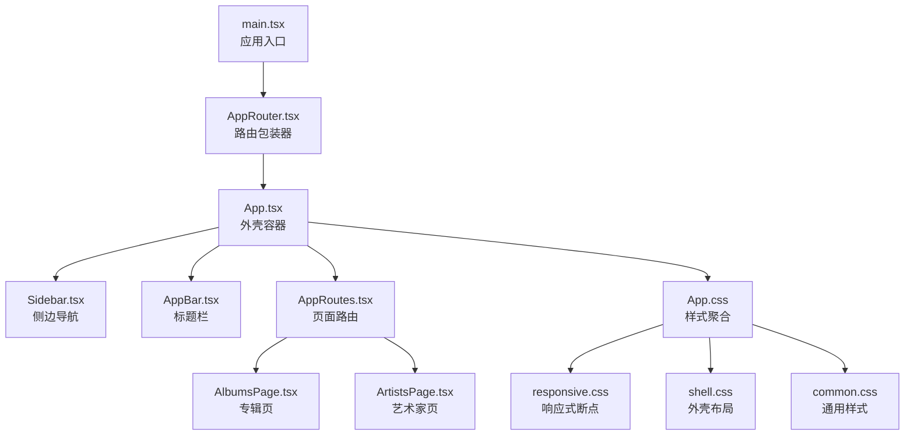
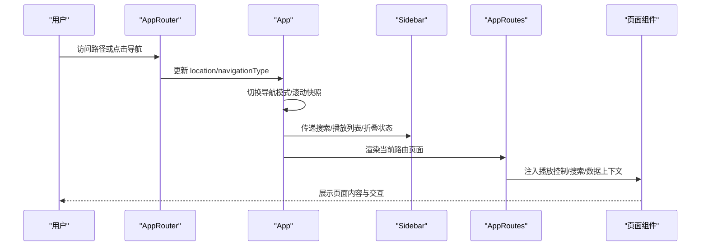
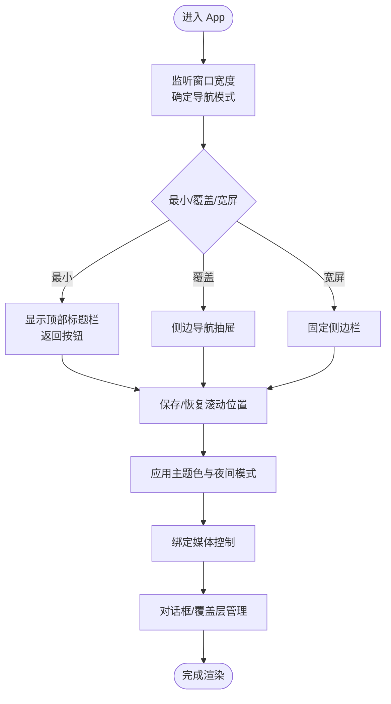
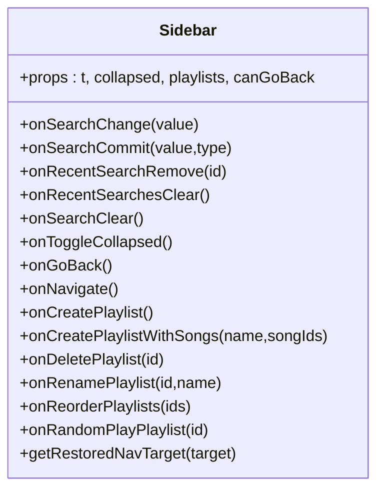
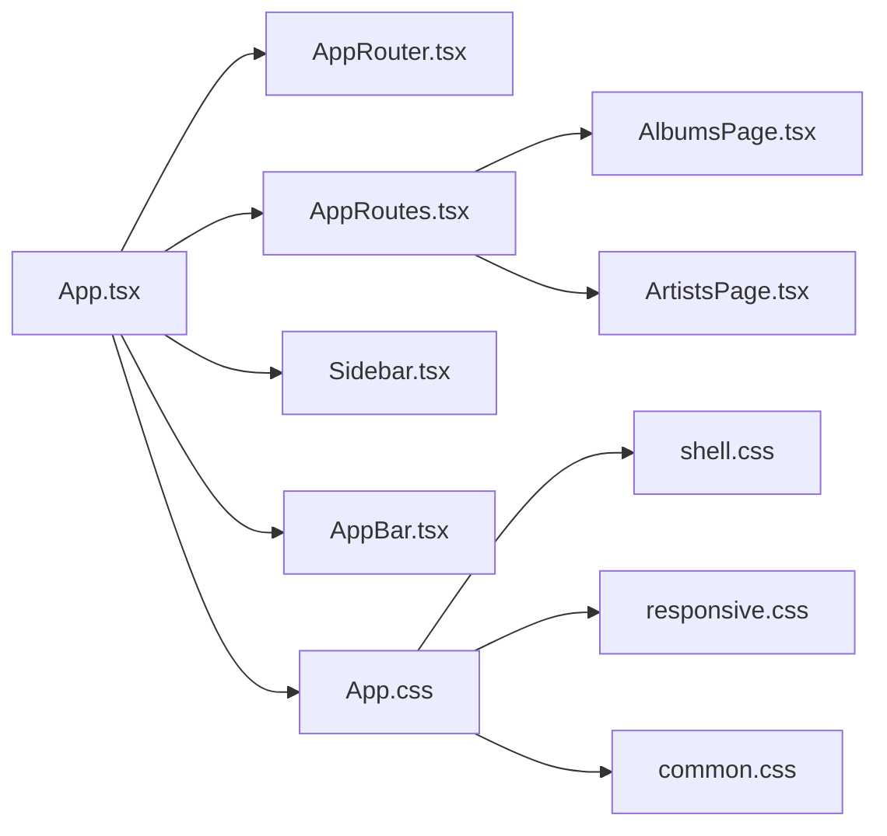

# 用户界面

<cite>
**本文引用的文件**
- [src/App.tsx](file://src/App.tsx)
- [src/main.tsx](file://src/main.tsx)
- [src/AppRouter.tsx](file://src/AppRouter.tsx)
- [src/AppRoutes.tsx](file://src/AppRoutes.tsx)
- [src/App.css](file://src/App.css)
- [src/components/AppBar.tsx](file://src/components/AppBar.tsx)
- [src/components/Sidebar.tsx](file://src/components/Sidebar.tsx)
- [src/styles/responsive.css](file://src/styles/responsive.css)
- [src/styles/common.css](file://src/styles/common.css)
- [src/styles/shell.css](file://src/styles/shell.css)
- [src/hooks/useCustomScrollbar.ts](file://src/hooks/useCustomScrollbar.ts)
- [src/pages/AlbumsPage.tsx](file://src/pages/AlbumsPage.tsx)
- [src/pages/ArtistsPage.tsx](file://src/pages/ArtistsPage.tsx)
- [src/appModel.ts](file://src/appModel.ts)
</cite>

## 目录
1. [简介](#简介)
2. [项目结构](#项目结构)
3. [核心组件](#核心组件)
4. [架构总览](#架构总览)
5. [详细组件分析](#详细组件分析)
6. [依赖关系分析](#依赖关系分析)
7. [性能考量](#性能考量)
8. [故障排查指南](#故障排查指南)
9. [结论](#结论)
10. [附录](#附录)

## 简介
本文件面向 SMPlayer 的用户界面系统，系统基于 React + Electron 架构，采用模块化组件与样式体系，结合响应式设计与主题系统，覆盖音乐库、专辑详情、艺术家、播放列表等页面，并通过自定义滚动条与可访问性设计提升体验。本文档从架构、组件、样式、导航与路由、性能与可用性等维度进行深入解析。

## 项目结构
- 应用入口与外壳
  - 入口文件负责挂载 React 根节点与应用外壳容器。
  - 外壳容器 App.tsx 负责全局状态、主题、夜间模式、导航模式、媒体控制、对话框与滚动位置记忆等。
- 路由与页面
  - AppRouter.tsx 提供基于哈希的历史 API 的路由器封装。
  - AppRoutes.tsx 定义所有页面级路由与页面上下文，按需加载数据与权限控制。
- 组件层
  - AppBar.tsx、Sidebar.tsx 等为通用 UI 组件，提供标题栏、侧边导航、命令栏、菜单等。
- 样式层
  - App.css 汇总引入各功能样式；responsive.css 提供断点与布局调整；shell.css 定义外壳网格布局与导航模式切换；common.css 提供通用卡片、表单、占位等基础样式。

图表来源
- [src/main.tsx:1-15](file://src/main.tsx#L1-L15)
- [src/AppRouter.tsx:1-82](file://src/AppRouter.tsx#L1-L82)
- [src/App.tsx:1-1258](file://src/App.tsx#L1-L1258)
- [src/AppRoutes.tsx:1-1108](file://src/AppRoutes.tsx#L1-L1108)
- [src/components/Sidebar.tsx:1-538](file://src/components/Sidebar.tsx#L1-L538)
- [src/components/AppBar.tsx:1-45](file://src/components/AppBar.tsx#L1-L45)
- [src/App.css:1-34](file://src/App.css#L1-L34)
- [src/styles/responsive.css:1-560](file://src/styles/responsive.css#L1-L560)
- [src/styles/shell.css:1-378](file://src/styles/shell.css#L1-L378)
- [src/styles/common.css:1-303](file://src/styles/common.css#L1-L303)

章节来源
- [src/main.tsx:1-15](file://src/main.tsx#L1-L15)
- [src/App.tsx:1-1258](file://src/App.tsx#L1-L1258)
- [src/AppRouter.tsx:1-82](file://src/AppRouter.tsx#L1-L82)
- [src/AppRoutes.tsx:1-1108](file://src/AppRoutes.tsx#L1-L1108)
- [src/App.css:1-34](file://src/App.css#L1-L34)

## 核心组件
- App.tsx（外壳容器）
  - 职责：全局状态与副作用、主题色与夜间模式、导航模式（最小/覆盖/宽屏）、滚动位置记忆、媒体控制绑定、对话框与进度覆盖层、快捷播放与语音助手集成。
  - 关键机制：断点监听与导航模式切换、滚动快照保存/恢复、主题色 CSS 变量注入、窗口控制按钮浅色模式切换。
- Sidebar.tsx（侧边导航）
  - 职责：主/播放区导航、播放列表管理、搜索历史、折叠/展开、拖拽重排、右键菜单、折叠提示气泡。
- AppBar.tsx（标题栏）
  - 职责：菜单按钮、页面动作区挂载点、标题渲染。
- AppRoutes.tsx（页面路由）
  - 职责：按需加载数据、页面上下文注入、页面级交互（播放、收藏、添加到歌单、删除歌曲等）。
- 响应式与外壳样式
  - shell.css 定义网格布局与导航模式切换；responsive.css 提供断点与紧凑布局；common.css 提供通用视觉元素。

章节来源
- [src/App.tsx:71-1224](file://src/App.tsx#L71-L1224)
- [src/components/Sidebar.tsx:67-496](file://src/components/Sidebar.tsx#L67-L496)
- [src/components/AppBar.tsx:18-44](file://src/components/AppBar.tsx#L18-L44)
- [src/AppRoutes.tsx:176-1052](file://src/AppRoutes.tsx#L176-L1052)
- [src/styles/shell.css:11-378](file://src/styles/shell.css#L11-L378)
- [src/styles/responsive.css:1-560](file://src/styles/responsive.css#L1-L560)
- [src/styles/common.css:1-303](file://src/styles/common.css#L1-L303)

## 架构总览
- 路由与导航
  - 使用自定义 AppRouter 将浏览器历史 API 包装为哈希路由，支持 push/replace/go 与 location/state 同步。
  - AppRoutes 定义页面级路由，注入播放控制、搜索、本地文件操作等上下文。
- 外壳与布局
  - shell.css 以网格布局承载 Sidebar 与 Workspace，配合断点切换导航模式（最小/覆盖/宽屏），并支持沉浸式标题栏。
- 主题与样式
  - appModel.ts 提供主题色注入逻辑；responsive.css 与 shell.css 协作实现断点布局；common.css 提供通用视觉基元。
- 自定义滚动条
  - useCustomScrollbar 钩子统一计算滚动条尺寸与拖动映射，支持多容器联动更新。

图表来源
- [src/AppRouter.tsx:25-81](file://src/AppRouter.tsx#L25-L81)
- [src/App.tsx:546-588](file://src/App.tsx#L546-L588)
- [src/AppRoutes.tsx:176-1052](file://src/AppRoutes.tsx#L176-L1052)

章节来源
- [src/AppRouter.tsx:1-82](file://src/AppRouter.tsx#L1-L82)
- [src/App.tsx:546-588](file://src/App.tsx#L546-L588)
- [src/AppRoutes.tsx:1-1108](file://src/AppRoutes.tsx#L1-L1108)

## 详细组件分析

### 外壳容器 App.tsx
- 导航模式与断点
  - 基于窗口宽度在最小/覆盖/宽屏间切换；最小模式下提供顶部标题栏与返回按钮；覆盖模式下侧边导航作为抽屉弹出。
- 滚动位置记忆
  - 通过路由键与选择器集合保存/恢复滚动位置，确保页面切换不丢失阅读位置。
- 主题与夜间模式
  - 主题色注入 CSS 变量；根据时间范围自动切换夜间模式；窗口控制按钮颜色随模式变化。
- 媒体控制与全屏播放
  - 绑定播放控制、音量、重复/随机、歌词源等；支持打开“全队列”沉浸式播放页。
- 对话框与覆盖层
  - 扫描进度、移动进度、创建播放列表、发布说明、智能多艺人修复建议等。

图表来源
- [src/App.tsx:559-588](file://src/App.tsx#L559-L588)
- [src/appModel.ts:58-61](file://src/appModel.ts#L58-L61)
- [src/appModel.ts:136-150](file://src/appModel.ts#L136-L150)

章节来源
- [src/App.tsx:71-1224](file://src/App.tsx#L71-L1224)
- [src/appModel.ts:1-395](file://src/appModel.ts#L1-L395)

### 侧边导航 Sidebar.tsx
- 结构
  - 搜索输入与最近搜索面板、主/播放区导航链接、播放列表区域（可折叠/展开/拖拽重排）、设置入口。
- 交互
  - 折叠时仅显示图标，悬停显示工具提示；播放列表支持右键菜单、随机播放、拖拽排序。
- 路由与目标恢复
  - 支持“恢复上次访问的同类型页面目标”，保证导航一致性。

图表来源
- [src/components/Sidebar.tsx:42-90](file://src/components/Sidebar.tsx#L42-L90)

章节来源
- [src/components/Sidebar.tsx:1-538](file://src/components/Sidebar.tsx#L1-L538)
- [src/AppRoutes.tsx:347-350](file://src/AppRoutes.tsx#L347-L350)

### 标题栏 AppBar.tsx
- 功能
  - 提供菜单按钮、页面动作区挂载点、标题渲染；与工作区头部协作形成一致的标题栏体验。
- 用途
  - 在最小导航模式下提供返回按钮与标题；在宽屏模式下作为工作区头部的一部分。

章节来源
- [src/components/AppBar.tsx:1-45](file://src/components/AppBar.tsx#L1-L45)
- [src/App.tsx:894-963](file://src/App.tsx#L894-L963)

### 页面路由与上下文 AppRoutes.tsx
- 数据加载
  - RequireLibraryData 条件加载歌曲/文件夹/最近数据，确保页面渲染前具备必要数据。
- 上下文注入
  - 为各页面注入播放控制、搜索、本地文件操作、设置更新、撤销通知等上下文。
- 页面级交互
  - 播放、收藏、添加到歌单、删除歌曲、清空最近、记录播放历史等。

章节来源
- [src/AppRoutes.tsx:67-82](file://src/AppRoutes.tsx#L67-L82)
- [src/AppRoutes.tsx:176-1052](file://src/AppRoutes.tsx#L176-L1052)

### 专辑页 AlbumsPage.tsx
- 视图与交互
  - 支持搜索、排序（默认/名称/艺人/反向）、快速跳转、多选命令栏、右键菜单、专辑封面预览。
- 性能
  - 虚拟滚动窗口化渲染，按视口估算行数与可视区间，减少 DOM 节点数量。
- 无障碍
  - 搜索建议与历史面板支持键盘导航与焦点管理。

章节来源
- [src/pages/AlbumsPage.tsx:64-738](file://src/pages/AlbumsPage.tsx#L64-L738)

### 艺术家页 ArtistsPage.tsx
- 视图与交互
  - 左右分栏布局（艺术家列表与详情），支持艺术家/专辑/歌曲分组菜单、随机播放、多选命令栏。
- 性能
  - 虚拟滚动与专辑分组窗口化渲染，减少大列表渲染压力。
- 无障碍
  - 快速跳转、搜索建议、键盘导航与焦点管理。

章节来源
- [src/pages/ArtistsPage.tsx:82-800](file://src/pages/ArtistsPage.tsx#L82-L800)

### 响应式设计与样式架构
- 断点与布局
  - 最小导航模式（≤720px）、覆盖模式（721–1200px）、宽屏模式（>1200px）；不同断点下播放器布局、按钮显隐、网格列数等动态调整。
- 外壳网格
  - shell.css 定义 Sidebar 与 Workspace 的网格布局与过渡；最小/覆盖模式下的定位与遮罩。
- 通用样式
  - common.css 提供卡片、表单控件、占位与加载动画等通用视觉元素；夜间模式下统一变体。

章节来源
- [src/styles/responsive.css:1-560](file://src/styles/responsive.css#L1-L560)
- [src/styles/shell.css:1-378](file://src/styles/shell.css#L1-L378)
- [src/styles/common.css:1-303](file://src/styles/common.css#L1-L303)

### 自定义滚动条 useCustomScrollbar.ts
- 机制
  - 计算滚动容器高度/滚动最大值，动态设置滚动条拇指高度与位置；支持拖动同步滚动。
- 适用场景
  - 专辑/艺术家/表格等长列表的自定义滚动条，提升一致性与可访问性。

章节来源
- [src/hooks/useCustomScrollbar.ts:1-96](file://src/hooks/useCustomScrollbar.ts#L1-L96)

## 依赖关系分析
- 组件耦合
  - App.tsx 作为顶层容器，向下注入播放控制、搜索、本地文件操作等上下文给 AppRoutes 与页面组件。
  - Sidebar 与 AppBar 作为通用 UI 组件被 App.tsx 组合使用，职责清晰、内聚度高。
- 样式依赖
  - App.css 汇总引入 shell、sidebar、workspace、responsive 等样式，形成统一的样式管线。
- 路由依赖
  - AppRouter 为 AppRoutes 提供哈希路由能力；AppRoutes 决定页面渲染与上下文注入。

图表来源
- [src/App.tsx:1-1258](file://src/App.tsx#L1-L1258)
- [src/AppRouter.tsx:1-82](file://src/AppRouter.tsx#L1-L82)
- [src/AppRoutes.tsx:1-1108](file://src/AppRoutes.tsx#L1-L1108)
- [src/components/Sidebar.tsx:1-538](file://src/components/Sidebar.tsx#L1-L538)
- [src/components/AppBar.tsx:1-45](file://src/components/AppBar.tsx#L1-L45)
- [src/pages/AlbumsPage.tsx:1-979](file://src/pages/AlbumsPage.tsx#L1-L979)
- [src/pages/ArtistsPage.tsx:1-1201](file://src/pages/ArtistsPage.tsx#L1-L1201)
- [src/App.css:1-34](file://src/App.css#L1-L34)
- [src/styles/shell.css:1-378](file://src/styles/shell.css#L1-L378)
- [src/styles/responsive.css:1-560](file://src/styles/responsive.css#L1-L560)
- [src/styles/common.css:1-303](file://src/styles/common.css#L1-L303)

章节来源
- [src/App.tsx:1-1258](file://src/App.tsx#L1-L1258)
- [src/AppRoutes.tsx:1-1108](file://src/AppRoutes.tsx#L1-L1108)
- [src/App.css:1-34](file://src/App.css#L1-L34)

## 性能考量
- 虚拟滚动
  - 专辑/艺术家页面均采用虚拟滚动窗口化渲染，按视口估算行数与可视区间，显著降低 DOM 节点数量。
- 滚动位置记忆
  - 通过路由键与选择器集合保存/恢复滚动位置，避免频繁滚动导致的重新渲染。
- 自定义滚动条
  - useCustomScrollbar 通过 ResizeObserver/MutationObserver 与 requestAnimationFrame 优化更新频率。
- 主题与夜间模式
  - 通过 CSS 变量与类名切换实现，避免重排与重绘开销。

章节来源
- [src/pages/AlbumsPage.tsx:100-161](file://src/pages/AlbumsPage.tsx#L100-L161)
- [src/pages/ArtistsPage.tsx:124-180](file://src/pages/ArtistsPage.tsx#L124-L180)
- [src/hooks/useCustomScrollbar.ts:11-62](file://src/hooks/useCustomScrollbar.ts#L11-L62)
- [src/appModel.ts:136-150](file://src/appModel.ts#L136-L150)

## 故障排查指南
- 路由无法跳转或历史记录异常
  - 检查 AppRouter 的哈希同步与 push/replace/go 实现是否正确触发；确认 location 与 navigationType 是否同步。
- 滚动位置未恢复
  - 确认路由键生成与选择器集合匹配；检查保存/恢复函数是否在路由切换后执行。
- 夜间模式未生效
  - 检查主题色注入逻辑与时间范围判断；确认夜间模式类名是否正确添加到根节点。
- 自定义滚动条不显示或拖动无效
  - 检查容器高度/滚动高度计算；确认滚动条跟踪元素引用与事件绑定。

章节来源
- [src/AppRouter.tsx:25-81](file://src/AppRouter.tsx#L25-L81)
- [src/App.tsx:335-424](file://src/App.tsx#L335-L424)
- [src/appModel.ts:136-150](file://src/appModel.ts#L136-L150)
- [src/hooks/useCustomScrollbar.ts:11-96](file://src/hooks/useCustomScrollbar.ts#L11-L96)

## 结论
SMPlayer 的 UI 系统以 App.tsx 为核心容器，结合 Sidebar/AppBar 等通用组件与 AppRoutes 页面路由，形成清晰的层次化架构。通过响应式断点、自定义滚动条与主题系统，兼顾了桌面端与移动端体验；页面级虚拟滚动与滚动位置记忆进一步提升了性能与可用性。整体设计强调模块化、可维护性与可扩展性，适合持续演进。

## 附录
- 使用指南与自定义
  - 组件属性与事件
    - Sidebar：支持搜索、播放列表增删改、随机播放、拖拽重排、右键菜单等。
    - AppBar：提供菜单按钮与页面动作区挂载点。
    - AlbumsPage/ArtistsPage：支持搜索、排序、快速跳转、多选命令栏、右键菜单、虚拟滚动。
  - 样式定制
    - 通过 CSS 变量（如 --accent、--accent-rgb）与夜间模式类名切换实现主题定制；断点规则可在 responsive.css 中调整。
  - 无障碍与体验
    - 键盘导航、焦点管理、语义化标签与屏幕阅读器友好提示贯穿组件与页面。

章节来源
- [src/components/Sidebar.tsx:42-90](file://src/components/Sidebar.tsx#L42-L90)
- [src/components/AppBar.tsx:18-44](file://src/components/AppBar.tsx#L18-L44)
- [src/pages/AlbumsPage.tsx:357-462](file://src/pages/AlbumsPage.tsx#L357-L462)
- [src/pages/ArtistsPage.tsx:341-437](file://src/pages/ArtistsPage.tsx#L341-L437)
- [src/styles/responsive.css:1-560](file://src/styles/responsive.css#L1-L560)
- [src/styles/shell.css:1-378](file://src/styles/shell.css#L1-L378)
- [src/styles/common.css:1-303](file://src/styles/common.css#L1-L303)