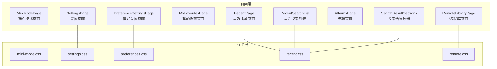
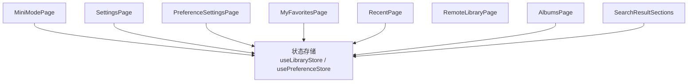
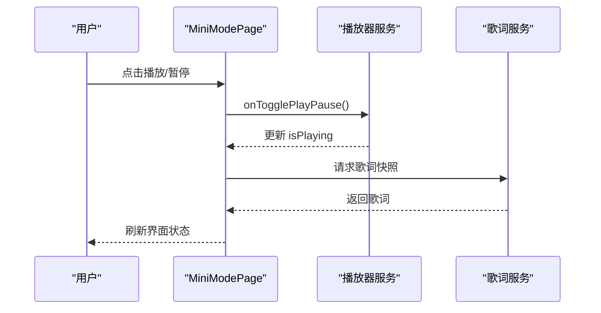
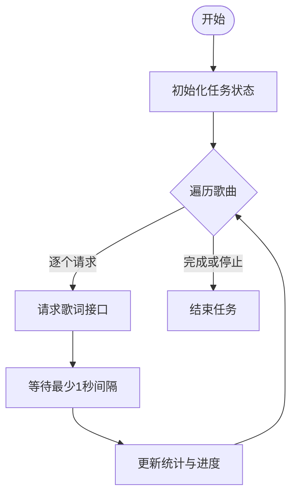
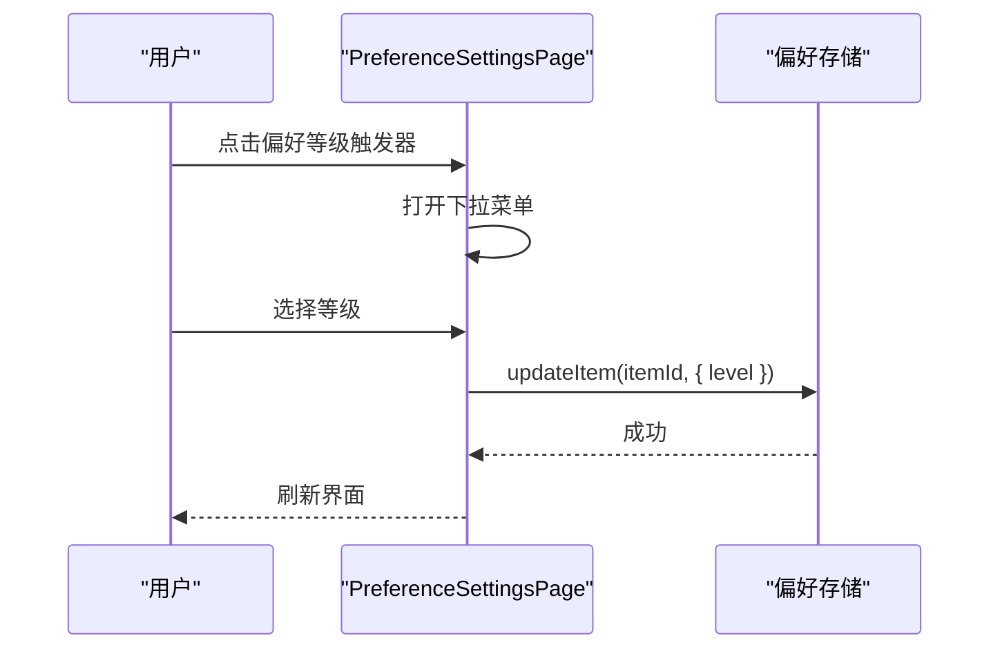
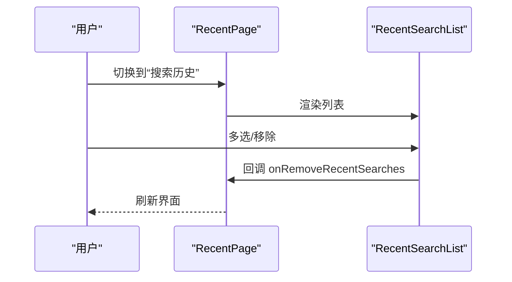
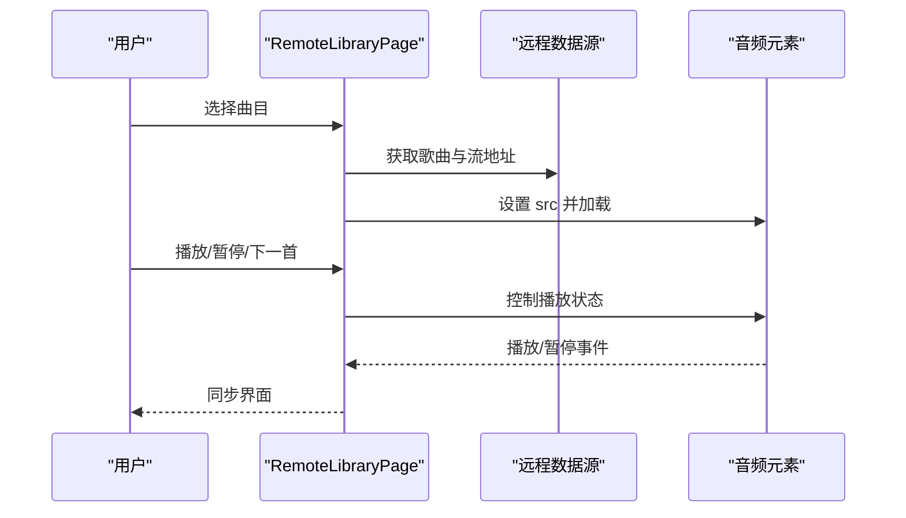
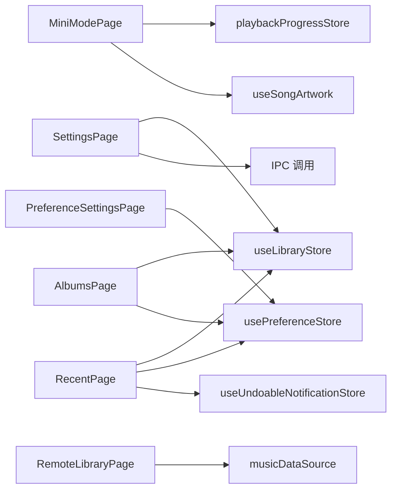

# 专用页面组件

<cite>
**本文档引用的文件**
- [MiniModePage.tsx](file://src/pages/MiniModePage.tsx)
- [SettingsPage.tsx](file://src/pages/SettingsPage.tsx)
- [PreferenceSettingsPage.tsx](file://src/pages/PreferenceSettingsPage.tsx)
- [MyFavoritesPage.tsx](file://src/pages/MyFavoritesPage.tsx)
- [RecentPage.tsx](file://src/pages/RecentPage.tsx)
- [RemoteLibraryPage.tsx](file://src/pages/RemoteLibraryPage.tsx)
- [AlbumsPage.tsx](file://src/pages/AlbumsPage.tsx)
- [RecentSearchList.tsx](file://src/pages/RecentSearchList.tsx)
- [SearchResultSections.tsx](file://src/pages/SearchResultSections.tsx)
- [mini-mode.css](file://src/styles/mini-mode.css)
- [settings.css](file://src/styles/settings.css)
- [preferences.css](file://src/styles/preferences.css)
- [recent.css](file://src/styles/recent.css)
- [remote.css](file://src/styles/remote.css)
</cite>

## 目录
1. [简介](#简介)
2. [项目结构](#项目结构)
3. [核心组件](#核心组件)
4. [架构总览](#架构总览)
5. [详细组件分析](#详细组件分析)
6. [依赖关系分析](#依赖关系分析)
7. [性能考虑](#性能考虑)
8. [故障排除指南](#故障排除指南)
9. [结论](#结论)

## 简介
本文件系统性梳理 SMPlayer 的专用页面组件，覆盖迷你模式页面、设置与偏好设置页面、我的收藏、最近播放、远程库、专辑浏览以及搜索结果分组等模块。文档从架构、数据流、交互逻辑、状态管理到样式与可访问性进行深入解析，并提供可视化图示帮助理解。

## 项目结构
SMPlayer 的页面组件主要位于 src/pages 目录，配合对应的样式文件（src/styles）实现一致的视觉与交互体验。页面间通过路由与状态管理（如 useLibraryStore、usePreferenceStore）协同工作，形成完整的音乐播放与管理体验。

**图表来源**
- [MiniModePage.tsx:1-510](file://src/pages/MiniModePage.tsx#L1-L510)
- [SettingsPage.tsx:1-947](file://src/pages/SettingsPage.tsx#L1-L947)
- [PreferenceSettingsPage.tsx:1-530](file://src/pages/PreferenceSettingsPage.tsx#L1-L530)
- [MyFavoritesPage.tsx:1-102](file://src/pages/MyFavoritesPage.tsx#L1-L102)
- [RecentPage.tsx:1-1760](file://src/pages/RecentPage.tsx#L1-L1760)
- [RemoteLibraryPage.tsx:1-198](file://src/pages/RemoteLibraryPage.tsx#L1-L198)
- [AlbumsPage.tsx:1-979](file://src/pages/AlbumsPage.tsx#L1-L979)
- [RecentSearchList.tsx:1-168](file://src/pages/RecentSearchList.tsx#L1-L168)
- [SearchResultSections.tsx:1-648](file://src/pages/SearchResultSections.tsx#L1-L648)
- [mini-mode.css:1-528](file://src/styles/mini-mode.css#L1-L528)
- [settings.css:1-512](file://src/styles/settings.css#L1-L512)
- [preferences.css:1-554](file://src/styles/preferences.css#L1-L554)
- [recent.css:1-1083](file://src/styles/recent.css#L1-L1083)
- [remote.css:1-231](file://src/styles/remote.css#L1-L231)

**章节来源**
- [MiniModePage.tsx:1-510](file://src/pages/MiniModePage.tsx#L1-L510)
- [SettingsPage.tsx:1-947](file://src/pages/SettingsPage.tsx#L1-L947)
- [PreferenceSettingsPage.tsx:1-530](file://src/pages/PreferenceSettingsPage.tsx#L1-L530)
- [MyFavoritesPage.tsx:1-102](file://src/pages/MyFavoritesPage.tsx#L1-L102)
- [RecentPage.tsx:1-1760](file://src/pages/RecentPage.tsx#L1-L1760)
- [RemoteLibraryPage.tsx:1-198](file://src/pages/RemoteLibraryPage.tsx#L1-L198)
- [AlbumsPage.tsx:1-979](file://src/pages/AlbumsPage.tsx#L1-L979)
- [RecentSearchList.tsx:1-168](file://src/pages/RecentSearchList.tsx#L1-L168)
- [SearchResultSections.tsx:1-648](file://src/pages/SearchResultSections.tsx#L1-L648)

## 核心组件
- 迷你模式页面：提供悬浮式紧凑播放控件，支持进度拖动、音量调节、歌词显示与语音助手。
- 设置页面：集中管理应用配置、显示与语言、夜间模式、歌词源、数据导入导出等。
- 偏好设置页面：高级配置入口，按实体类型（歌曲/艺术家/专辑/歌单/文件夹）管理偏好等级与启用状态。
- 我的收藏页面：收藏歌曲的展示与管理，支持排序、移除、设为首选等。
- 最近播放页面：播放历史、搜索历史的可视化面板，支持多选、批量操作与快速访问。
- 远程库页面：连接并播放其他设备上的音乐库，提供远程播放控制。
- 专辑页面：专辑浏览与排序、搜索建议、快速跳转与上下文菜单。
- 搜索结果分组：按类型分组展示搜索卡片，支持预览与展开、排序与选择模式。

**章节来源**
- [MiniModePage.tsx:15-67](file://src/pages/MiniModePage.tsx#L15-L67)
- [SettingsPage.tsx:19-30](file://src/pages/SettingsPage.tsx#L19-L30)
- [PreferenceSettingsPage.tsx:13-16](file://src/pages/PreferenceSettingsPage.tsx#L13-L16)
- [MyFavoritesPage.tsx:8-27](file://src/pages/MyFavoritesPage.tsx#L8-L27)
- [RecentPage.tsx:39-73](file://src/pages/RecentPage.tsx#L39-L73)
- [RemoteLibraryPage.tsx:11-16](file://src/pages/RemoteLibraryPage.tsx#L11-L16)
- [AlbumsPage.tsx:44-62](file://src/pages/AlbumsPage.tsx#L44-L62)
- [SearchResultSections.tsx:73-113](file://src/pages/SearchResultSections.tsx#L73-L113)

## 架构总览
页面组件通过 props 接收外部状态与回调，内部使用本地状态与 hooks 管理 UI 行为；样式文件以模块化方式定义页面特定的视觉与交互细节。组件之间通过共享状态（store）与事件回调协作，形成松耦合的页面体系。

**图表来源**
- [MiniModePage.tsx:83-88](file://src/pages/MiniModePage.tsx#L83-L88)
- [SettingsPage.tsx:317-326](file://src/pages/SettingsPage.tsx#L317-L326)
- [PreferenceSettingsPage.tsx:37-44](file://src/pages/PreferenceSettingsPage.tsx#L37-L44)
- [MyFavoritesPage.tsx:29-48](file://src/pages/MyFavoritesPage.tsx#L29-L48)
- [RecentPage.tsx:190-206](file://src/pages/RecentPage.tsx#L190-L206)
- [RemoteLibraryPage.tsx:16-18](file://src/pages/RemoteLibraryPage.tsx#L16-L18)
- [AlbumsPage.tsx:82-82](file://src/pages/AlbumsPage.tsx#L82-L82)
- [SearchResultSections.tsx:1-648](file://src/pages/SearchResultSections.tsx#L1-L648)

## 详细组件分析

### 迷你模式页面（MiniModePage）
- 设计目标：在悬浮窗口中提供紧凑、直观的播放控制，减少空间占用，提升操作效率。
- 关键特性：
  - 自动隐藏与悬停显示控制条，避免遮挡内容。
  - 进度拖动与音量滑条，支持拖拽时的 tooltip 提示与离开时的自动隐藏。
  - 歌词滚动展示与标题/艺术家信息显示。
  - 语音助手集成（仅 Windows 平台可用），支持快捷指令。
  - 支持循环模式切换、收藏切换、随机播放等常用操作。
- 数据与状态：
  - 使用 playbackProgressStore 获取播放进度，结合 props 中的当前曲目与播放状态。
  - 通过 hooks 获取封面图与歌词快照，失败时自动回退默认封面。
- 交互流程（播放控制）：

**图表来源**
- [MiniModePage.tsx:30-67](file://src/pages/MiniModePage.tsx#L30-L67)
- [MiniModePage.tsx:116-123](file://src/pages/MiniModePage.tsx#L116-L123)
- [MiniModePage.tsx:231-247](file://src/pages/MiniModePage.tsx#L231-L247)

- 样式要点（迷你模式）：
  - 背景图层与遮罩层叠加，营造沉浸式背景。
  - 控制条与歌词条在可见状态下渐显，增强可用性。
  - 音量面板与语音面板采用毛玻璃效果与定位布局。

**章节来源**
- [MiniModePage.tsx:1-510](file://src/pages/MiniModePage.tsx#L1-L510)
- [mini-mode.css:1-528](file://src/styles/mini-mode.css#L1-L528)

### 设置页面（SettingsPage）
- 功能概览：
  - 音乐库根目录选择与扫描控制。
  - 歌词来源与自动歌词、时间戳保留策略。
  - 显示语言、夜间模式及其时间段设置。
  - 批量下载歌词任务的启动、停止与进度反馈。
  - 数据导入/导出与版本信息展示。
- 组件化设置项：
  - 开关行（ToggleSettingRow）、下拉选择（SelectSettingRow）、时间范围（TimeSettingRow）等复用组件。
  - 反馈菜单与释放说明对话框。
- 流程图（批量歌词处理）：

**图表来源**
- [SettingsPage.tsx:450-550](file://src/pages/SettingsPage.tsx#L450-L550)

**章节来源**
- [SettingsPage.tsx:1-947](file://src/pages/SettingsPage.tsx#L1-L947)
- [settings.css:1-512](file://src/styles/settings.css#L1-L512)

### 偏好设置页面（PreferenceSettingsPage）
- 功能概览：
  - 按实体类型（歌曲、艺术家、专辑、歌单、文件夹）管理偏好等级与启用状态。
  - 支持展开/折叠、清理由无效项、移除条目、批量操作等。
  - 自定义滚动条与键盘导航支持。
- 数据模型：
  - 使用 usePreferenceStore 获取快照与更新方法，支持刷新、更新、删除与清理无效项。
- 交互流程（偏好等级选择）：

**图表来源**
- [PreferenceSettingsPage.tsx:437-516](file://src/pages/PreferenceSettingsPage.tsx#L437-L516)

**章节来源**
- [PreferenceSettingsPage.tsx:1-530](file://src/pages/PreferenceSettingsPage.tsx#L1-L530)
- [preferences.css:1-554](file://src/styles/preferences.css#L1-L554)

### 我的收藏页面（MyFavoritesPage）
- 功能概览：
  - 展示收藏歌曲列表，支持播放、添加到队列、下一首播放、移除收藏等。
  - 支持按不同标准排序、设置首选等级、清空收藏等。
- 交互要点：
  - HeaderedPlaylistControl 封装了播放列表的通用行为与上下文菜单。
  - 导航至艺术家/专辑详情页。

**章节来源**
- [MyFavoritesPage.tsx:1-102](file://src/pages/MyFavoritesPage.tsx#L1-L102)

### 最近播放页面（RecentPage）
- 功能概览：
  - 分标签页展示“新增”、“播放过”、“搜索历史”，支持筛选与排序。
  - 支持多选、批量操作（清空历史、移除所选）。
  - 虚拟化网格与自定义滚动条，优化大数据集渲染性能。
- 子组件：
  - RecentSearchList：最近搜索列表，支持选择与移除。
  - SearchResultSections：搜索结果分组，支持预览与展开。
- 交互流程（最近搜索列表）：

**图表来源**
- [RecentPage.tsx:482-499](file://src/pages/RecentPage.tsx#L482-L499)
- [RecentSearchList.tsx:15-35](file://src/pages/RecentSearchList.tsx#L15-L35)

**章节来源**
- [RecentPage.tsx:1-1760](file://src/pages/RecentPage.tsx#L1-L1760)
- [RecentSearchList.tsx:1-168](file://src/pages/RecentSearchList.tsx#L1-L168)
- [recent.css:1-1083](file://src/styles/recent.css#L1-L1083)

### 远程库页面（RemoteLibraryPage）
- 功能概览：
  - 连接远程主机的音乐库，按路由切换到艺术家、专辑、歌单或歌曲视图。
  - 内置音频元素用于远程播放控制（播放/暂停/下一首）。
- 交互流程（远程播放）：

**图表来源**
- [RemoteLibraryPage.tsx:26-62](file://src/pages/RemoteLibraryPage.tsx#L26-L62)
- [RemoteLibraryPage.tsx:185-194](file://src/pages/RemoteLibraryPage.tsx#L185-L194)

**章节来源**
- [RemoteLibraryPage.tsx:1-198](file://src/pages/RemoteLibraryPage.tsx#L1-L198)
- [remote.css:1-231](file://src/styles/remote.css#L1-L231)

### 专辑页面（AlbumsPage）
- 功能概览：
  - 专辑网格浏览，支持搜索、排序、快速跳转与上下文菜单。
  - 支持多选、批量添加到播放列表或“正在播放”。
  - 专辑封面预览与偏好设置集成。
- 性能优化：
  - 虚拟化网格与自定义滚动条，按视口高度动态计算渲染行数。
  - 响应式布局适配窄屏设备。

**章节来源**
- [AlbumsPage.tsx:1-979](file://src/pages/AlbumsPage.tsx#L1-L979)

### 搜索结果分组（SearchResultSections）
- 功能概览：
  - 将搜索结果按类型（艺术家、专辑、歌曲、歌单、文件夹）分组展示。
  - 支持预览与展开、排序、选择模式与上下文菜单。
- 组件族：
  - SearchResultSection：通用卡片组。
  - SearchAlbumResultSection：专辑网格。
  - SearchPlaylistResultSection：歌单网格。
  - SearchFolderResultSection：文件夹网格。

**章节来源**
- [SearchResultSections.tsx:1-648](file://src/pages/SearchResultSections.tsx#L1-L648)

## 依赖关系分析
- 页面到状态：
  - MiniModePage 依赖 playbackProgressStore 与 useSongArtwork。
  - SettingsPage 依赖 useLibraryStore 与 IPC 调用（导入/导出、歌词请求）。
  - PreferenceSettingsPage 依赖 usePreferenceStore。
  - RecentPage 依赖 useLibraryStore、usePreferenceStore、useUndoableNotificationStore。
  - RemoteLibraryPage 依赖 musicDataSource 与内置音频元素。
  - AlbumsPage 依赖 useLibraryStore、usePreferenceStore。
- 页面到组件：
  - 各页面广泛使用共享组件（如 CommandBar、MenuFlyout、HeaderedPlaylistControl、AlbumTile 等）。
- 样式到页面：
  - 每个页面对应独立样式文件，确保主题与响应式规则隔离。

**图表来源**
- [MiniModePage.tsx:83-88](file://src/pages/MiniModePage.tsx#L83-L88)
- [SettingsPage.tsx:317-326](file://src/pages/SettingsPage.tsx#L317-L326)
- [PreferenceSettingsPage.tsx:37-44](file://src/pages/PreferenceSettingsPage.tsx#L37-L44)
- [RecentPage.tsx:190-206](file://src/pages/RecentPage.tsx#L190-L206)
- [RemoteLibraryPage.tsx:16-18](file://src/pages/RemoteLibraryPage.tsx#L16-L18)
- [AlbumsPage.tsx:82-82](file://src/pages/AlbumsPage.tsx#L82-L82)

**章节来源**
- [MiniModePage.tsx:1-510](file://src/pages/MiniModePage.tsx#L1-L510)
- [SettingsPage.tsx:1-947](file://src/pages/SettingsPage.tsx#L1-L947)
- [PreferenceSettingsPage.tsx:1-530](file://src/pages/PreferenceSettingsPage.tsx#L1-L530)
- [RecentPage.tsx:1-1760](file://src/pages/RecentPage.tsx#L1-L1760)
- [RemoteLibraryPage.tsx:1-198](file://src/pages/RemoteLibraryPage.tsx#L1-L198)
- [AlbumsPage.tsx:1-979](file://src/pages/AlbumsPage.tsx#L1-L979)

## 性能考虑
- 虚拟化与滚动：
  - RecentSearchList、RecentPage 的网格均采用虚拟滚动，仅渲染可视区域，降低 DOM 负担。
- 自定义滚动条：
  - 偏好设置页面与最近页面使用自定义滚动条，减少浏览器默认滚动条的重绘。
- 图片与歌词：
  - 迷你模式页面对封面图失败进行回退处理，避免阻塞渲染；歌词请求按需触发并节流。
- 响应式布局：
  - 专辑页面与迷你模式页面针对不同屏幕尺寸调整布局与可见元素，保证移动端体验。

[本节为通用指导，无需具体文件分析]

## 故障排除指南
- 迷你模式无法显示控制条：
  - 检查鼠标进入/离开事件是否被遮挡，确认 is-controls-visible 类是否正确切换。
- 歌词不显示或加载慢：
  - 确认歌词服务可用且返回有效快照；检查网络请求与节流逻辑。
- 设置页面导入/导出失败：
  - 查看 IPC 返回的错误消息，确认路径权限与文件格式。
- 偏好设置页面无响应：
  - 确认 usePreferenceStore 已正确初始化与刷新；检查下拉菜单的点击外侧关闭逻辑。
- 远程库无法播放：
  - 检查流地址有效性与音频元素加载状态；确认主机可达与端口开放。

**章节来源**
- [MiniModePage.tsx:207-229](file://src/pages/MiniModePage.tsx#L207-L229)
- [SettingsPage.tsx:552-591](file://src/pages/SettingsPage.tsx#L552-L591)
- [PreferenceSettingsPage.tsx:50-63](file://src/pages/PreferenceSettingsPage.tsx#L50-L63)
- [RemoteLibraryPage.tsx:26-41](file://src/pages/RemoteLibraryPage.tsx#L26-L41)

## 结论
SMPlayer 的专用页面组件围绕“紧凑、高效、可扩展”的设计理念构建：通过模块化的页面与样式、统一的状态管理与共享组件，实现了从播放控制到设置管理的完整闭环。各组件在交互细节、性能优化与可访问性方面均有明确约束，适合在多场景下稳定运行与持续演进。