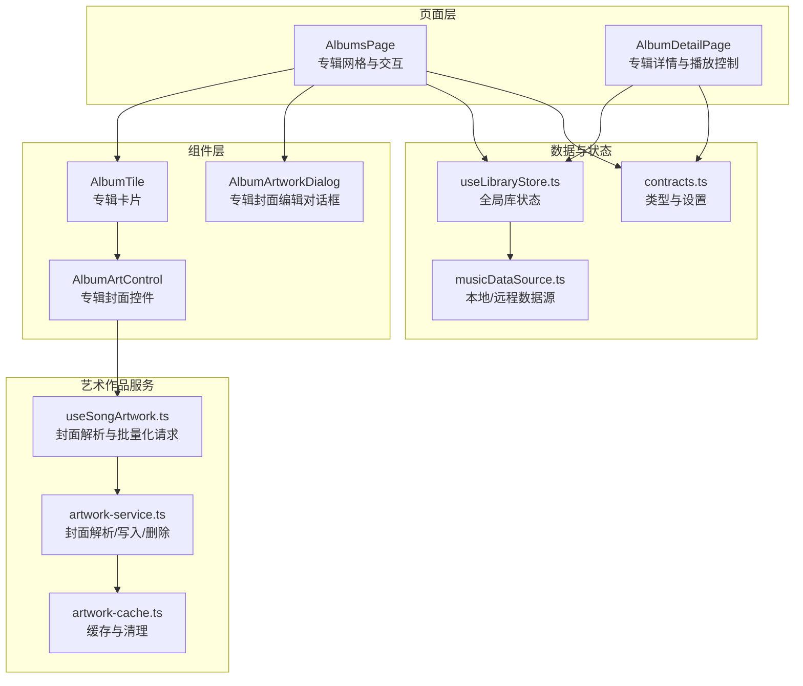
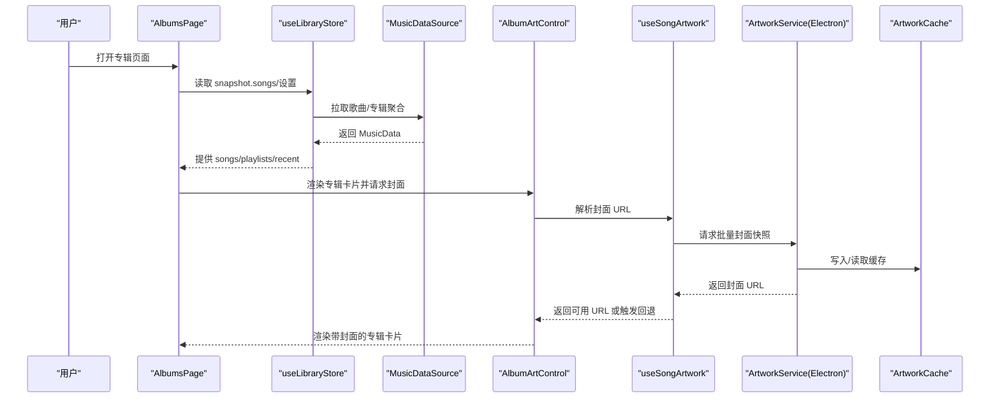
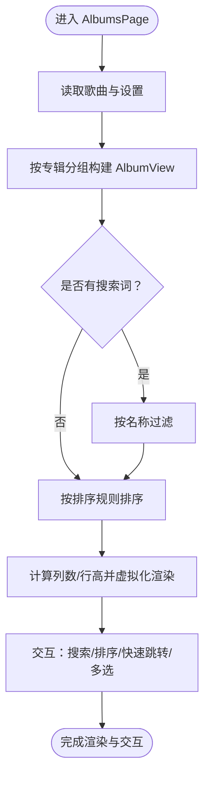
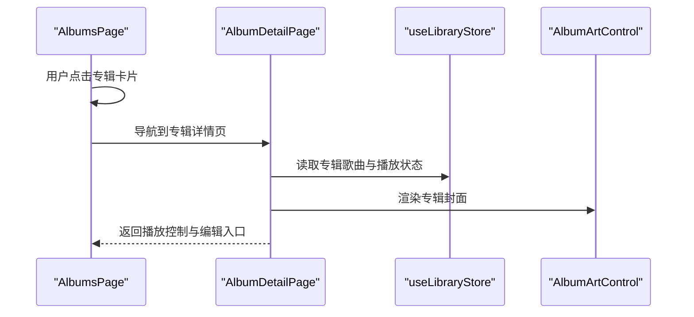
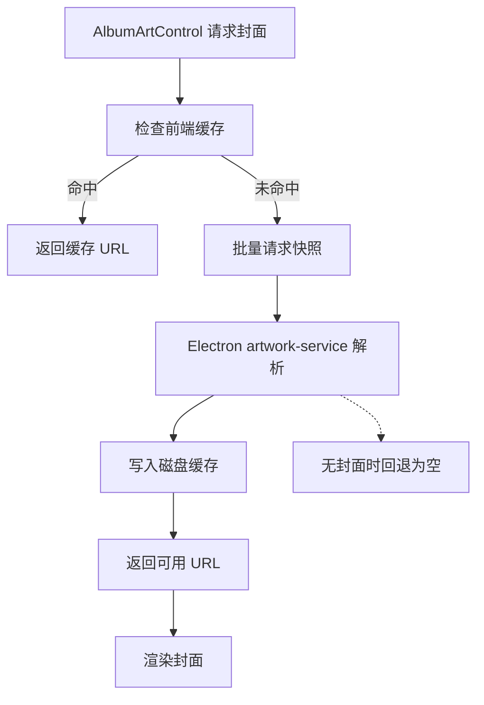
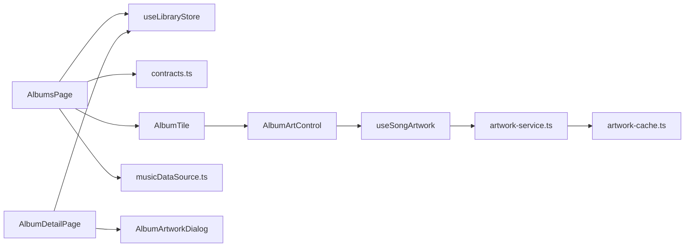

# 专辑页面

<cite>
**本文引用的文件**
- [AlbumsPage.tsx](file://src/pages/AlbumsPage.tsx)
- [AlbumDetailPage.tsx](file://src/pages/AlbumDetailPage.tsx)
- [AlbumTile.tsx](file://src/components/AlbumTile.tsx)
- [AlbumArtControl.tsx](file://src/components/AlbumArtControl.tsx)
- [AlbumArtworkDialog.tsx](file://src/components/AlbumArtworkDialog.tsx)
- [useSongArtwork.ts](file://src/hooks/useSongArtwork.ts)
- [artwork-service.ts](file://electron/services/artwork-service.ts)
- [artwork-cache.ts](file://electron/Services/artwork-cache.ts)
- [musicDataSource.ts](file://src/data/musicDataSource.ts)
- [useLibraryStore.ts](file://src/state/useLibraryStore.ts)
- [contracts.ts](file://src/shared/contracts.ts)
</cite>

## 目录
1. [简介](#简介)
2. [项目结构](#项目结构)
3. [核心组件](#核心组件)
4. [架构总览](#架构总览)
5. [详细组件分析](#详细组件分析)
6. [依赖关系分析](#依赖关系分析)
7. [性能考量](#性能考量)
8. [故障排查指南](#故障排查指南)
9. [结论](#结论)
10. [附录](#附录)

## 简介
本文件面向 SMPlayer 的“专辑页面”，系统性梳理 AlbumsPage 组件的专辑浏览与交互能力，涵盖：
- 专辑的分类展示与排序
- 专辑详情页加载与专辑内歌曲管理
- 专辑数据组织结构与元数据来源
- 艺术作品（专辑封面）的解析、缓存与回退策略
- 交互设计：筛选、排序、快速跳转、多选与批量操作
- 数据更新策略、缓存机制与与其他音乐库页面的数据联动

## 项目结构
专辑页面由“页面容器 + 卡片组件 + 艺术作品子系统 + 数据源与状态”四部分构成：
- 页面容器负责布局、搜索、排序、滚动虚拟化、快速跳转与多选命令栏
- 卡片组件承载单个专辑的封面、标题与操作入口
- 艺术作品子系统负责封面解析、缓存与回退（嵌入封面、系统缩略图）
- 数据源与状态提供本地/远程音乐库数据、设置与刷新能力

图表来源
- [AlbumsPage.tsx:1-738](file://src/pages/AlbumsPage.tsx#L1-L738)
- [AlbumDetailPage.tsx:1-110](file://src/pages/AlbumDetailPage.tsx#L1-L110)
- [AlbumTile.tsx:1-96](file://src/components/AlbumTile.tsx#L1-L96)
- [AlbumArtControl.tsx:1-37](file://src/components/AlbumArtControl.tsx#L1-L37)
- [AlbumArtworkDialog.tsx:1-181](file://src/components/AlbumArtworkDialog.tsx#L1-L181)
- [musicDataSource.ts:1-331](file://src/data/musicDataSource.ts#L1-L331)
- [useLibraryStore.ts:1-800](file://src/state/useLibraryStore.ts#L1-L800)
- [useSongArtwork.ts:1-204](file://src/hooks/useSongArtwork.ts#L1-L204)
- [artwork-service.ts:1-342](file://electron/services/artwork-service.ts#L1-L342)
- [artwork-cache.ts:1-123](file://electron/services/artwork-cache.ts#L1-L123)
- [contracts.ts:1-200](file://src/shared/contracts.ts#L1-L200)

章节来源
- [AlbumsPage.tsx:1-738](file://src/pages/AlbumsPage.tsx#L1-L738)
- [AlbumDetailPage.tsx:1-110](file://src/pages/AlbumDetailPage.tsx#L1-L110)
- [AlbumTile.tsx:1-96](file://src/components/AlbumTile.tsx#L1-L96)
- [AlbumArtControl.tsx:1-37](file://src/components/AlbumArtControl.tsx#L1-L37)
- [AlbumArtworkDialog.tsx:1-181](file://src/components/AlbumArtworkDialog.tsx#L1-L181)
- [musicDataSource.ts:1-331](file://src/data/musicDataSource.ts#L1-L331)
- [useLibraryStore.ts:1-800](file://src/state/useLibraryStore.ts#L1-L800)
- [useSongArtwork.ts:1-204](file://src/hooks/useSongArtwork.ts#L1-L204)
- [artwork-service.ts:1-342](file://electron/services/artwork-service.ts#L1-L342)
- [artwork-cache.ts:1-123](file://electron/services/artwork-cache.ts#L1-L123)
- [contracts.ts:1-200](file://src/shared/contracts.ts#L1-L200)

## 核心组件
- AlbumsPage：专辑网格容器，支持搜索、排序、快速跳转、多选与批量操作；通过虚拟滚动渲染可见区域；提供专辑上下文菜单与“查看封面”预览。
- AlbumDetailPage：专辑详情页，基于 HeaderedPlaylistControl 展示专辑内歌曲列表，支持播放控制、收藏、封面编辑、偏好设置等。
- AlbumTile：单个专辑卡片，显示封面、标题与副标题，提供播放、添加到歌单、右键菜单与选择态。
- AlbumArtControl：专辑封面控件，封装 useSongArtwork 解析与回退逻辑，支持错误时自动刷新。
- AlbumArtworkDialog：专辑封面编辑对话框，支持从文件/库选择封面、保存、重置、删除，并回调刷新。

章节来源
- [AlbumsPage.tsx:64-738](file://src/pages/AlbumsPage.tsx#L64-L738)
- [AlbumDetailPage.tsx:32-110](file://src/pages/AlbumDetailPage.tsx#L32-L110)
- [AlbumTile.tsx:15-96](file://src/components/AlbumTile.tsx#L15-L96)
- [AlbumArtControl.tsx:18-37](file://src/components/AlbumArtControl.tsx#L18-L37)
- [AlbumArtworkDialog.tsx:19-181](file://src/components/AlbumArtworkDialog.tsx#L19-L181)

## 架构总览
专辑页面的端到端流程如下：
- 数据来源：本地或远程 MusicDataSource 提供歌曲、专辑聚合结果与计数等
- 状态管理：useLibraryStore 暴露歌曲、播放列表、最近播放、设置等快照与刷新方法
- 渲染与交互：AlbumsPage 将歌曲按专辑分组构建 AlbumView，支持搜索与排序；AlbumDetailPage 呈现专辑内歌曲并提供播放控制
- 艺术作品：AlbumArtControl 通过 useSongArtwork 获取封面 URL；useSongArtwork 批量请求 Electron 层 artwork-service；artwork-service 优先解析嵌入封面，其次生成系统缩略图缓存，最后回退至空值

图表来源
- [AlbumsPage.tsx:113-121](file://src/pages/AlbumsPage.tsx#L113-L121)
- [useLibraryStore.ts:145-319](file://src/state/useLibraryStore.ts#L145-L319)
- [musicDataSource.ts:136-203](file://src/data/musicDataSource.ts#L136-L203)
- [AlbumArtControl.tsx:18-37](file://src/components/AlbumArtControl.tsx#L18-L37)
- [useSongArtwork.ts:91-155](file://src/hooks/useSongArtwork.ts#L91-L155)
- [artwork-service.ts:50-78](file://electron/services/artwork-service.ts#L50-L78)
- [artwork-cache.ts:10-49](file://electron/services/artwork-cache.ts#L10-L49)

## 详细组件分析

### AlbumsPage：专辑网格与交互
- 数据组织
  - 通过 buildAlbumViews 将 LibrarySong 列表按专辑分组，生成 AlbumView（名称、艺人、歌曲数组、封面 URL、时长、歌曲 ID 集合）
  - 支持搜索过滤与排序（默认/名称/艺人/反向），并根据窗口尺寸计算列数与行高，实现虚拟滚动
- 交互设计
  - 搜索：支持页面与 AppBar 双入口，记录最近搜索历史，提供建议与清空
  - 排序：顶部命令栏与 AppBar 下拉菜单，持久化到设置
  - 快速跳转：根据首字母分组导航，滚动到目标行
  - 多选：进入多选模式后，批量播放、添加到歌单、全选/反选/清空
  - 上下文菜单：播放（随机）、添加到、设为精选、查看封面、偏好设置
- 性能优化
  - 虚拟滚动：仅渲染可视区域前后若干行的专辑卡片
  - 滚动条自定义：独立滚动容器与轨道，提升滚动体验
  - 响应式布局：根据断点切换紧凑/常规行高

图表来源
- [AlbumsPage.tsx:113-161](file://src/pages/AlbumsPage.tsx#L113-L161)
- [AlbumsPage.tsx:291-336](file://src/pages/AlbumsPage.tsx#L291-L336)
- [AlbumsPage.tsx:556-604](file://src/pages/AlbumsPage.tsx#L556-L604)

章节来源
- [AlbumsPage.tsx:64-738](file://src/pages/AlbumsPage.tsx#L64-L738)

### AlbumDetailPage：专辑详情与播放控制
- 功能要点
  - 基于 HeaderedPlaylistControl 展示专辑内歌曲，支持播放/暂停、下一首、加入歌单、设为收藏、编辑封面
  - 专辑封面优先使用有 artworkUrl 的歌曲，否则回退到第一首
  - 支持设置专辑偏好级别、编辑封面并回调刷新
- 与 AlbumsPage 的衔接
  - 通过路由参数传递专辑名，进入详情页后可直接播放该专辑所有歌曲或指定曲目

图表来源
- [AlbumDetailPage.tsx:32-110](file://src/pages/AlbumDetailPage.tsx#L32-L110)
- [AlbumsPage.tsx:576-582](file://src/pages/AlbumsPage.tsx#L576-L582)

章节来源
- [AlbumDetailPage.tsx:1-110](file://src/pages/AlbumDetailPage.tsx#L1-L110)

### AlbumTile：专辑卡片
- 结构与行为
  - 显示封面与标题/副标题
  - 多选模式下支持勾选；普通模式下点击进入详情页
  - 右键打开上下文菜单；悬浮层提供播放与“添加到”按钮
- 与 AlbumArtControl 的协作
  - 使用第一个歌曲 ID 作为封面解析依据，确保封面一致性

章节来源
- [AlbumTile.tsx:15-96](file://src/components/AlbumTile.tsx#L15-L96)
- [AlbumArtControl.tsx:18-37](file://src/components/AlbumArtControl.tsx#L18-L37)

### AlbumArtControl 与 useSongArtwork：封面解析与缓存
- 解析策略
  - 优先使用已知 artworkUrl（若非生成型 URL）
  - 若缓存命中则直接返回
  - 否则批量请求 Electron 层 artwork-service 获取快照
  - 错误时触发 refreshArtwork 自动重试
- 缓存机制
  - 前端缓存 Map 与请求去重
  - Electron 层写入磁盘缓存，支持格式转换与清理
  - 回退策略：嵌入封面 → 系统缩略图 → 空值

图表来源
- [useSongArtwork.ts:91-155](file://src/hooks/useSongArtwork.ts#L91-L155)
- [artwork-service.ts:50-78](file://electron/services/artwork-service.ts#L50-L78)
- [artwork-cache.ts:10-49](file://electron/services/artwork-cache.ts#L10-L49)

章节来源
- [useSongArtwork.ts:1-204](file://src/hooks/useSongArtwork.ts#L1-L204)
- [AlbumArtControl.tsx:18-37](file://src/components/AlbumArtControl.tsx#L18-L37)
- [artwork-service.ts:1-342](file://electron/services/artwork-service.ts#L1-L342)
- [artwork-cache.ts:1-123](file://electron/services/artwork-cache.ts#L1-L123)

### AlbumArtworkDialog：专辑封面编辑
- 能力范围
  - 从文件/库选择封面源，预览并保存
  - 删除专辑封面（同步清除歌曲缩略图与专辑表）
  - 重置为原始封面并反馈状态消息
- 与 Electron 层协作
  - 通过 window.smplayer IPC 调用封面保存/删除接口
  - 保存后刷新封面并回调 onSaved

章节来源
- [AlbumArtworkDialog.tsx:19-181](file://src/components/AlbumArtworkDialog.tsx#L19-L181)
- [artwork-service.ts:95-155](file://electron/services/artwork-service.ts#L95-L155)

## 依赖关系分析
- AlbumsPage 依赖
  - useLibraryStore：读取歌曲、播放列表、最近播放、设置与刷新
  - contracts.ts：AlbumSortCriterion、LibrarySong、LibraryPlaylist 等类型
  - 自定义 Hook：useCustomScrollbar、useSongsAddedUndo、useSongArtwork
- AlbumDetailPage 依赖
  - HeaderedPlaylistControl：统一的歌曲列表与播放控制
  - AlbumArtworkDialog：封面编辑
- 艺术作品链路
  - AlbumArtControl → useSongArtwork → Electron artwork-service → 磁盘缓存
- 数据源
  - musicDataSource.ts：本地/远程数据源工厂，提供 getAlbums/buildAlbumQueryResults

图表来源
- [AlbumsPage.tsx:11-25](file://src/pages/AlbumsPage.tsx#L11-L25)
- [AlbumDetailPage.tsx:3-6](file://src/pages/AlbumDetailPage.tsx#L3-L6)
- [useLibraryStore.ts:1-50](file://src/state/useLibraryStore.ts#L1-L50)
- [musicDataSource.ts:43-63](file://src/data/musicDataSource.ts#L43-L63)
- [useSongArtwork.ts:164-203](file://src/hooks/useSongArtwork.ts#L164-L203)
- [artwork-service.ts:26-35](file://electron/services/artwork-service.ts#L26-L35)
- [artwork-cache.ts:1-123](file://electron/services/artwork-cache.ts#L1-L123)

章节来源
- [AlbumsPage.tsx:1-738](file://src/pages/AlbumsPage.tsx#L1-L738)
- [AlbumDetailPage.tsx:1-110](file://src/pages/AlbumDetailPage.tsx#L1-L110)
- [useLibraryStore.ts:1-800](file://src/state/useLibraryStore.ts#L1-L800)
- [musicDataSource.ts:1-331](file://src/data/musicDataSource.ts#L1-L331)
- [useSongArtwork.ts:1-204](file://src/hooks/useSongArtwork.ts#L1-L204)
- [artwork-service.ts:1-342](file://electron/services/artwork-service.ts#L1-L342)
- [artwork-cache.ts:1-123](file://electron/services/artwork-cache.ts#L1-L123)

## 性能考量
- 虚拟滚动
  - 通过计算可见行区间与窗口偏移，仅渲染当前视口内的专辑卡片，降低 DOM 与重绘压力
- 批量封面请求
  - useSongArtwork 对同一帧内的多个请求进行合并与去重，减少 IPC 调用次数
- 缓存策略
  - 前端 Map 缓存 + Electron 磁盘缓存，命中后避免重复解析
- 响应式布局
  - 根据屏幕宽度动态调整列数与行高，兼顾小屏体验与大屏密度

章节来源
- [AlbumsPage.tsx:140-157](file://src/pages/AlbumsPage.tsx#L140-L157)
- [useSongArtwork.ts:36-83](file://src/hooks/useSongArtwork.ts#L36-L83)
- [artwork-cache.ts:10-49](file://electron/services/artwork-cache.ts#L10-L49)

## 故障排查指南
- 专辑封面不显示
  - 检查歌曲 artworkUrl 是否为空；若为空，确认是否为生成型 URL 且缓存命中
  - 触发 refreshArtwork 重新解析；确认 Electron 层 artwork-service 能正确读取嵌入封面或生成系统缩略图
- 保存/删除专辑封面失败
  - 确认 IPC 调用返回状态；查看 AlbumArtworkDialog 的状态消息提示
  - 检查磁盘缓存路径权限与空间
- 搜索/排序无效
  - 确认搜索输入与最近搜索历史是否被正确记录
  - 检查设置中的 albumsSort 是否成功更新

章节来源
- [AlbumArtControl.tsx:18-37](file://src/components/AlbumArtControl.tsx#L18-L37)
- [useSongArtwork.ts:189-202](file://src/hooks/useSongArtwork.ts#L189-L202)
- [AlbumArtworkDialog.tsx:69-114](file://src/components/AlbumArtworkDialog.tsx#L69-L114)
- [AlbumsPage.tsx:298-336](file://src/pages/AlbumsPage.tsx#L298-L336)

## 结论
AlbumsPage 以清晰的分层架构实现了专辑的高效浏览与交互：通过虚拟滚动与批量封面解析保障性能，借助 Electron 层的缓存与回退策略提升稳定性，结合 AlbumDetailPage 的播放控制与封面编辑，形成完整的专辑体验闭环。配合 useLibraryStore 的数据刷新与 musicDataSource 的本地/远程适配，页面在不同场景下均具备良好的扩展性与一致性。

## 附录
- 关键类型与设置
  - AlbumSortCriterion：专辑排序准则（默认/名称/艺人/反向）
  - LibrarySong/LibraryPlaylist：歌曲与播放列表数据模型
  - MusicDataSource：本地/远程数据源抽象

章节来源
- [contracts.ts:25](file://src/shared/contracts.ts#L25)
- [contracts.ts:36-91](file://src/shared/contracts.ts#L36-L91)
- [musicDataSource.ts:43-63](file://src/data/musicDataSource.ts#L43-L63)