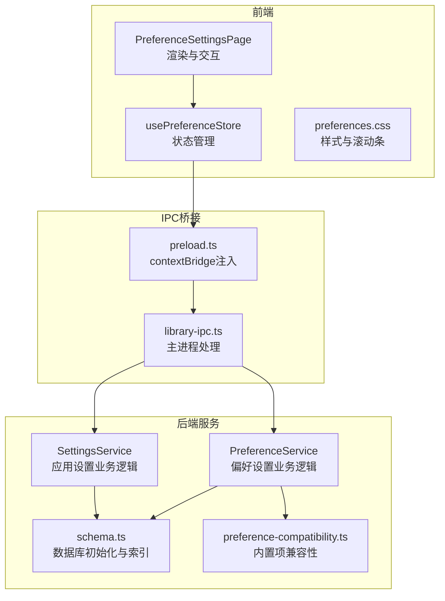
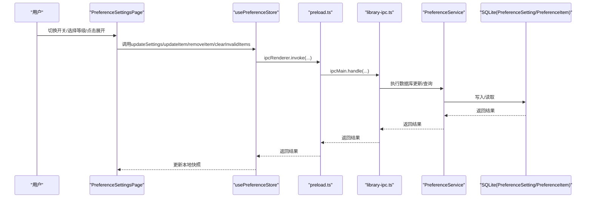
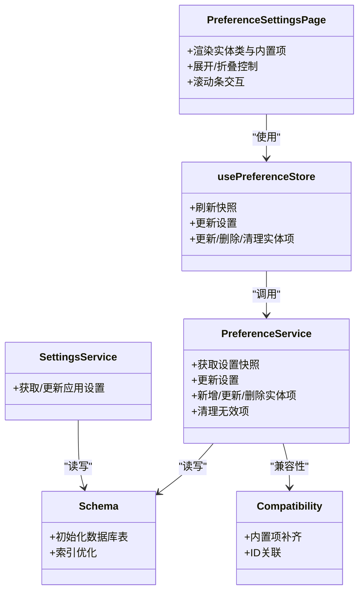

# 偏好设置页面

<cite>
**本文引用的文件**
- [PreferenceSettingsPage.tsx](file://src/pages/PreferenceSettingsPage.tsx)
- [usePreferenceStore.ts](file://src/state/usePreferenceStore.ts)
- [preference-service.ts](file://electron/services/preference-service.ts)
- [preference-compatibility.ts](file://electron/services/preference-compatibility.ts)
- [settings-service.ts](file://electron/services/settings-service.ts)
- [contracts.ts](file://src/shared/contracts.ts)
- [preferences.css](file://src/styles/preferences.css)
- [library-ipc.ts](file://electron/ipc/library-ipc.ts)
- [preload.ts](file://electron/preload.ts)
- [schema.ts](file://electron/services/schema.ts)
</cite>

## 目录
1. [简介](#简介)
2. [项目结构](#项目结构)
3. [核心组件](#核心组件)
4. [架构总览](#架构总览)
5. [详细组件分析](#详细组件分析)
6. [依赖关系分析](#依赖关系分析)
7. [性能考量](#性能考量)
8. [故障排查指南](#故障排查指南)
9. [结论](#结论)
10. [附录](#附录)

## 简介
本文件面向SMPlayer的偏好设置页面（PreferenceSettingsPage），系统性梳理其高级配置能力与实现架构，覆盖以下主题：
- 性能调优：滚动条自定义、虚拟化策略、批量更新优化
- 行为设置：启用/禁用各类实体（歌曲、艺人、专辑、播放列表、文件夹）、优先级等级（从“不出现”到“极高”）
- 高级音频处理参数：与歌词来源、通知策略、语言偏好等相关的设置项
- 文件系统配置：库根目录、扫描进度、视图模式、退出行为等
- 分类管理：按“实体类型”与“其他内置项”两大类组织设置
- 数据结构与默认值：前端快照、后端持久化、兼容性迁移
- 依赖关系与联动：设置项之间的相互影响与校验
- 系统环境适配：夜间模式、通知显示、语音助手语言
- 动态验证与错误处理：无效项清理、状态提示、回滚策略

## 项目结构
偏好设置页面位于前端UI层，通过Zustand状态管理与Electron IPC与后端服务交互；后端由SQLite数据库提供数据持久化，并通过兼容性模块保证跨版本升级时的稳定性。

图表来源
- [PreferenceSettingsPage.tsx:37-293](file://src/pages/PreferenceSettingsPage.tsx#L37-L293)
- [usePreferenceStore.ts:51-159](file://src/state/usePreferenceStore.ts#L51-L159)
- [preferences.css:1-554](file://src/styles/preferences.css#L1-L554)
- [preload.ts:213-219](file://electron/preload.ts#L213-L219)
- [library-ipc.ts:114-128](file://electron/ipc/library-ipc.ts#L114-L128)
- [preference-service.ts:44-401](file://electron/services/preference-service.ts#L44-L401)
- [settings-service.ts:61-293](file://electron/services/settings-service.ts#L61-L293)
- [schema.ts:148-169](file://electron/services/schema.ts#L148-L169)
- [preference-compatibility.ts:10-48](file://electron/services/preference-compatibility.ts#L10-L48)

章节来源
- [PreferenceSettingsPage.tsx:37-293](file://src/pages/PreferenceSettingsPage.tsx#L37-L293)
- [usePreferenceStore.ts:51-159](file://src/state/usePreferenceStore.ts#L51-L159)
- [preferences.css:1-554](file://src/styles/preferences.css#L1-L554)
- [preload.ts:213-219](file://electron/preload.ts#L213-L219)
- [library-ipc.ts:114-128](file://electron/ipc/library-ipc.ts#L114-L128)
- [preference-service.ts:44-401](file://electron/services/preference-service.ts#L44-L401)
- [settings-service.ts:61-293](file://electron/services/settings-service.ts#L61-L293)
- [schema.ts:148-169](file://electron/services/schema.ts#L148-L169)
- [preference-compatibility.ts:10-48](file://electron/services/preference-compatibility.ts#L10-L48)

## 核心组件
- 前端页面组件：负责渲染、交互、滚动条与展开/折叠控制
- 状态管理：集中处理加载、更新、删除、清理无效项等操作
- 后端服务：封装数据库访问、映射与兼容性处理
- IPC桥接：在渲染进程与主进程之间传递请求与响应
- 数据库模式：定义偏好设置表结构与索引

章节来源
- [PreferenceSettingsPage.tsx:37-293](file://src/pages/PreferenceSettingsPage.tsx#L37-L293)
- [usePreferenceStore.ts:51-159](file://src/state/usePreferenceStore.ts#L51-L159)
- [preference-service.ts:44-401](file://electron/services/preference-service.ts#L44-L401)
- [library-ipc.ts:114-128](file://electron/ipc/library-ipc.ts#L114-L128)
- [schema.ts:148-169](file://electron/services/schema.ts#L148-L169)

## 架构总览
偏好设置页面采用“前端渲染 + 状态管理 + IPC桥接 + 后端服务”的分层架构。用户操作触发前端事件，经Zustand状态管理器派发到preload桥接层，再由主进程IPC处理器路由至后端服务，最终写入SQLite数据库。读取时则反向执行。

图表来源
- [PreferenceSettingsPage.tsx:65-79](file://src/pages/PreferenceSettingsPage.tsx#L65-L79)
- [usePreferenceStore.ts:72-158](file://src/state/usePreferenceStore.ts#L72-L158)
- [preload.ts:213-219](file://electron/preload.ts#L213-L219)
- [library-ipc.ts:114-128](file://electron/ipc/library-ipc.ts#L114-L128)
- [preference-service.ts:125-192](file://electron/services/preference-service.ts#L125-L192)

## 详细组件分析

### 前端页面组件（PreferenceSettingsPage）
- 渲染结构：分为“实体类”（歌曲/艺人/专辑/播放列表/文件夹）与“其他内置项”两类区域
- 展开/折叠：每类区域支持展开查看全部或仅显示前N项
- 操作按钮：启用/禁用整类、清空无效项、移除单项、切换单项启用状态、调整优先级等级
- 滚动条：自定义滚动条，支持拖拽定位与自动隐藏
- 错误处理：加载失败时显示错误信息或提示

章节来源
- [PreferenceSettingsPage.tsx:37-293](file://src/pages/PreferenceSettingsPage.tsx#L37-L293)
- [preferences.css:1-554](file://src/styles/preferences.css#L1-L554)

### 状态管理（usePreferenceStore）
- 快照管理：维护完整的PreferenceSettingsSnapshot，包含各实体类启用状态与列表
- 加载流程：首次打开时拉取后端快照，设置loading/error状态
- 更新策略：对设置项进行原子式更新，避免部分字段遗漏导致的状态不一致
- 批量操作：新增、更新、删除、清理无效项均返回最新快照

章节来源
- [usePreferenceStore.ts:51-159](file://src/state/usePreferenceStore.ts#L51-L159)

### 后端服务（PreferenceService）
- 设置快照：一次性查询所有实体项并按类型归类，同时计算有效性（如实体是否仍存在于库中）
- 设置更新：批量更新实体类启用状态
- 实体操作：新增、更新、删除实体项；清理指定类型的无效项
- 兼容性：确保内置项（最近添加、我的收藏、最常播放、最少播放）存在且关联到设置记录

章节来源
- [preference-service.ts:44-401](file://electron/services/preference-service.ts#L44-L401)
- [preference-compatibility.ts:10-48](file://electron/services/preference-compatibility.ts#L10-L48)

### IPC桥接与数据库
- IPC注册：主进程注册preferences相关handle，转发到PreferenceService
- preload注入：在渲染进程中暴露SmplayerApi中的偏好设置方法
- 数据库模式：定义PreferenceSetting与PreferenceItem表，含索引以提升查询性能

章节来源
- [library-ipc.ts:114-128](file://electron/ipc/library-ipc.ts#L114-L128)
- [preload.ts:213-219](file://electron/preload.ts#L213-L219)
- [schema.ts:148-169](file://electron/services/schema.ts#L148-L169)

### 数据模型与默认值
- 偏好设置快照：包含enabled标志与各实体类数组，以及others内置项集合
- 实体项快照：包含id、类型、名称、提示文本、启用状态、优先级、有效性、可否删除
- 优先级枚举：从低到高依次为“不出现”、“不喜欢”、“正常”、“高”、“较高”、“极高”
- 默认值策略：未初始化时插入默认行；内置项缺失时自动补齐

章节来源
- [contracts.ts:393-420](file://src/shared/contracts.ts#L393-L420)
- [preference-service.ts:393-400](file://electron/services/preference-service.ts#L393-L400)

### 类别与限制
- 实体类别：歌曲、艺人、专辑、播放列表、文件夹
- 显示限制：每类最多展示固定数量（如歌曲100、艺人50等），超出时支持展开查看更多
- 其他内置项：最近添加、我的收藏、最常播放、最少播放，不可删除但可启用/禁用

章节来源
- [PreferenceSettingsPage.tsx:18-35](file://src/pages/PreferenceSettingsPage.tsx#L18-L35)
- [PreferenceSettingsPage.tsx:202-271](file://src/pages/PreferenceSettingsPage.tsx#L202-L271)

### 依赖关系与联动
- 设置项有效性：当实体不再存在于库中时，标记为无效，支持一键清理
- 级联更新：更新实体项时同步更新本地快照，保持UI与数据一致
- 清理策略：按类型批量清理无效项，减少冗余数据

章节来源
- [preference-service.ts:194-273](file://electron/services/preference-service.ts#L194-L273)
- [usePreferenceStore.ts:142-158](file://src/state/usePreferenceStore.ts#L142-L158)

### 系统环境适配与高级功能
- 夜间模式：与系统时间/手动模式联动，影响UI主题与通知外观
- 通知策略：可选择“从不”或“音乐变更时”，并控制通知显示风格
- 语言偏好：语音助手首选语言（系统/en-US/zh-CN）
- 视图模式：网格/列表视图切换
- 退出行为：关闭窗口时是否退出应用

章节来源
- [settings-service.ts:61-293](file://electron/services/settings-service.ts#L61-L293)
- [contracts.ts:195-520](file://src/shared/contracts.ts#L195-L520)

### 动态验证与错误处理
- 输入验证：优先级选择、启用状态切换、无效项清理
- 错误捕获：统一错误消息格式，避免抛出异常导致UI崩溃
- 回滚策略：更新失败时保留当前状态，允许用户重试

章节来源
- [usePreferenceStore.ts:26-32](file://src/state/usePreferenceStore.ts#L26-L32)
- [PreferenceSettingsPage.tsx:162-180](file://src/pages/PreferenceSettingsPage.tsx#L162-L180)

## 依赖关系分析

图表来源
- [PreferenceSettingsPage.tsx:37-293](file://src/pages/PreferenceSettingsPage.tsx#L37-L293)
- [usePreferenceStore.ts:51-159](file://src/state/usePreferenceStore.ts#L51-L159)
- [preference-service.ts:44-401](file://electron/services/preference-service.ts#L44-L401)
- [settings-service.ts:61-293](file://electron/services/settings-service.ts#L61-L293)
- [schema.ts:148-169](file://electron/services/schema.ts#L148-L169)
- [preference-compatibility.ts:10-48](file://electron/services/preference-compatibility.ts#L10-L48)

## 性能考量
- 滚动性能：自定义滚动条基于CSS变量与ResizeObserver，避免频繁重排
- 查询优化：数据库为PreferenceItem建立复合索引，提升按类型与ItemId查询效率
- 批量更新：前端状态管理对设置项进行局部更新，减少不必要的重渲染
- 无效项清理：定期清理无效实体项，降低查询与渲染负担

章节来源
- [preferences.css:1-554](file://src/styles/preferences.css#L1-L554)
- [schema.ts:256-256](file://electron/services/schema.ts#L256-L256)
- [usePreferenceStore.ts:72-88](file://src/state/usePreferenceStore.ts#L72-L88)

## 故障排查指南
- 页面空白或加载失败
  - 检查preload桥接是否可用（window.smplayer是否存在）
  - 查看store.error字段，确认后端返回的错误信息
- 设置项无法保存
  - 确认IPC handle已注册（library-ipc.ts）
  - 检查PreferenceService数据库事务是否成功
- 无效项未清理
  - 使用clearInvalidItems接口按类型清理
  - 检查实体是否仍存在于库中（有效性判断逻辑）

章节来源
- [usePreferenceStore.ts:55-70](file://src/state/usePreferenceStore.ts#L55-L70)
- [library-ipc.ts:114-128](file://electron/ipc/library-ipc.ts#L114-L128)
- [preference-service.ts:194-273](file://electron/services/preference-service.ts#L194-L273)

## 结论
PreferenceSettingsPage通过清晰的分层设计与完善的IPC/数据库交互，实现了对SMPlayer偏好的精细化管理。其特性包括：
- 可扩展的实体类与内置项分类
- 灵活的优先级与启用控制
- 强大的兼容性与默认值保障
- 高效的滚动与批量更新体验
- 完备的错误处理与无效项清理机制

这些能力共同构成了一个健壮、易用且可维护的偏好设置体系。

## 附录
- 关键接口路径参考
  - 前端页面：[PreferenceSettingsPage.tsx:37-293](file://src/pages/PreferenceSettingsPage.tsx#L37-L293)
  - 状态管理：[usePreferenceStore.ts:51-159](file://src/state/usePreferenceStore.ts#L51-L159)
  - 后端服务：[preference-service.ts:44-401](file://electron/services/preference-service.ts#L44-L401)
  - 应用设置服务：[settings-service.ts:61-293](file://electron/services/settings-service.ts#L61-L293)
  - IPC桥接：[library-ipc.ts:114-128](file://electron/ipc/library-ipc.ts#L114-L128)、[preload.ts:213-219](file://electron/preload.ts#L213-L219)
  - 数据库模式：[schema.ts:148-169](file://electron/services/schema.ts#L148-L169)
  - 兼容性：[preference-compatibility.ts:10-48](file://electron/services/preference-compatibility.ts#L10-L48)
  - 样式：[preferences.css:1-554](file://src/styles/preferences.css#L1-L554)
  - 类型定义：[contracts.ts:195-420](file://src/shared/contracts.ts#L195-L420)