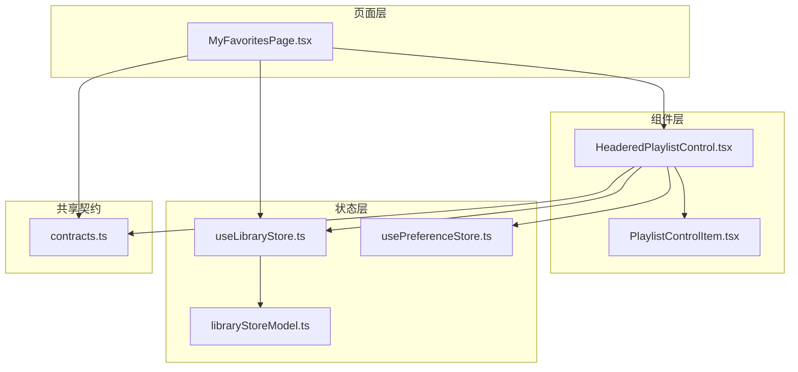
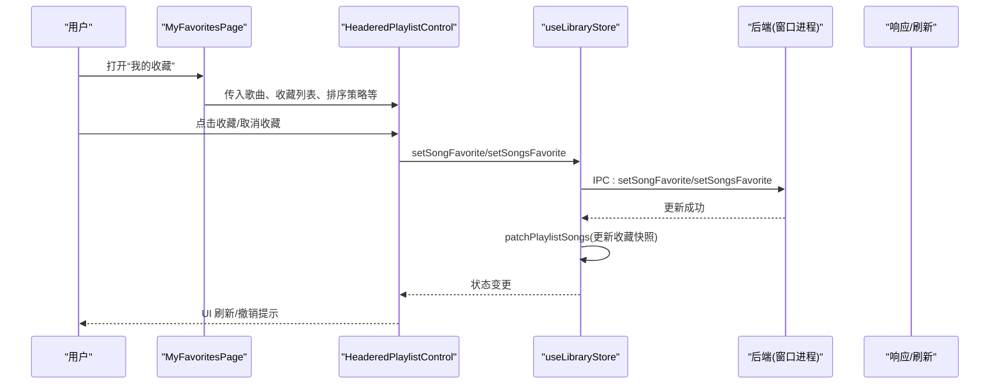
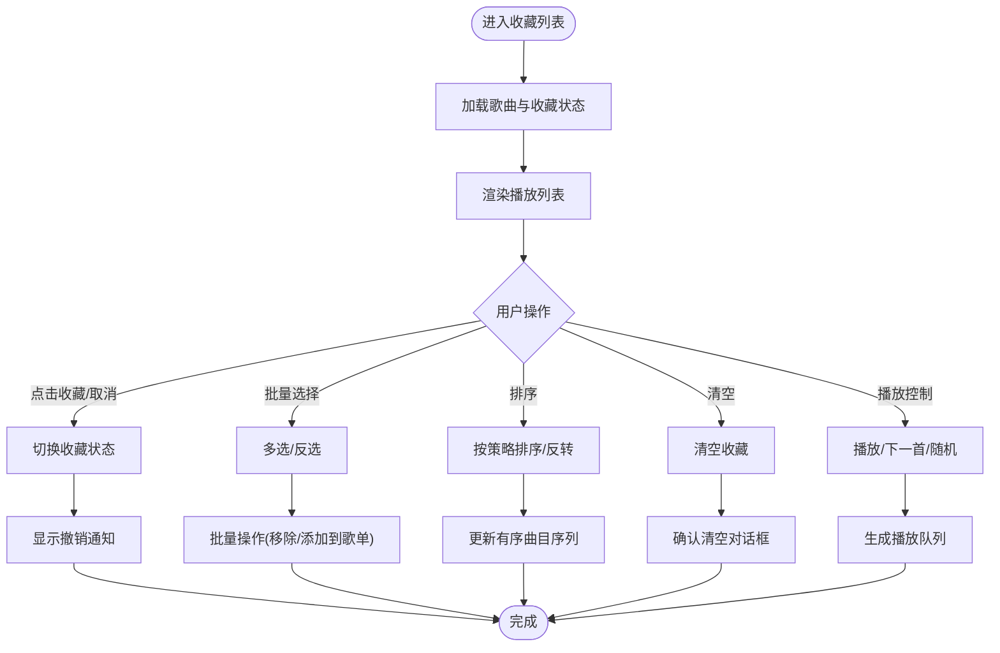
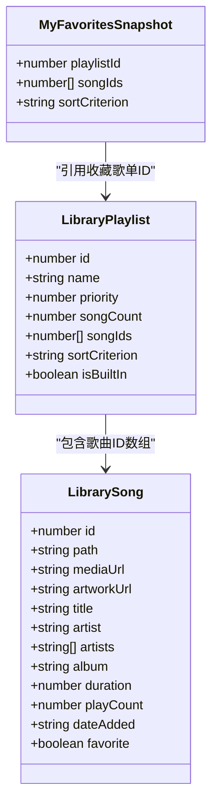
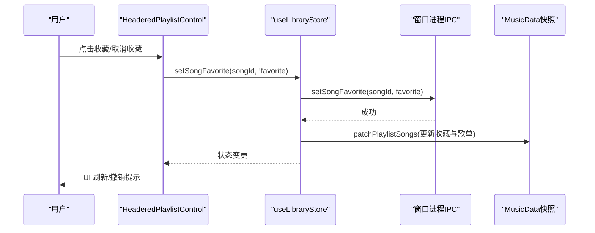
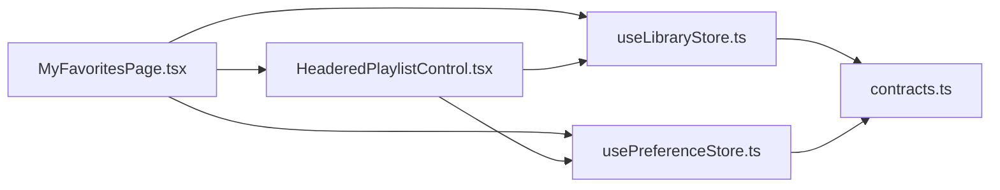

# 我的收藏页面

<cite>
**本文档引用的文件**
- [MyFavoritesPage.tsx](file://src/pages/MyFavoritesPage.tsx)
- [HeaderedPlaylistControl.tsx](file://src/components/HeaderedPlaylistControl.tsx)
- [contracts.ts](file://src/shared/contracts.ts)
- [useLibraryStore.ts](file://src/state/useLibraryStore.ts)
- [usePreferenceStore.ts](file://src/state/usePreferenceStore.ts)
- [libraryStoreModel.ts](file://src/state/libraryStoreModel.ts)
- [headeredPlaylistModel.ts](file://src/components/headeredPlaylistModel.ts)
</cite>

## 目录
1. [简介](#简介)
2. [项目结构](#项目结构)
3. [核心组件](#核心组件)
4. [架构总览](#架构总览)
5. [详细组件分析](#详细组件分析)
6. [依赖关系分析](#依赖关系分析)
7. [性能考虑](#性能考虑)
8. [故障排除指南](#故障排除指南)
9. [结论](#结论)

## 简介
本文件面向 SMPlayer 的“我的收藏”页面，系统性梳理 MyFavoritesPage 组件的收藏管理能力与交互设计，覆盖以下主题：
- 收藏歌曲的展示与播放控制
- 收藏列表的操作：添加、移除、排序
- 收藏分类与偏好设置联动
- 收藏数据的存储结构与同步机制
- 元数据管理与搜索过滤
- 导入导出、统计信息与与其他页面的数据联动

## 项目结构
“我的收藏”页面由页面级组件与通用控件协作完成，关键文件如下：
- 页面组件：src/pages/MyFavoritesPage.tsx
- 通用播放列表控件：src/components/HeaderedPlaylistControl.tsx
- 数据契约与类型定义：src/shared/contracts.ts
- 库状态管理（Zustand）：src/state/useLibraryStore.ts
- 偏好设置状态管理：src/state/usePreferenceStore.ts
- 库状态模型工具：src/state/libraryStoreModel.ts
- 播放列表模型工具：src/components/headeredPlaylistModel.ts

**图表来源**
- [MyFavoritesPage.tsx:1-102](file://src/pages/MyFavoritesPage.tsx#L1-L102)
- [HeaderedPlaylistControl.tsx:1-1368](file://src/components/HeaderedPlaylistControl.tsx#L1-L1368)
- [useLibraryStore.ts:1-1339](file://src/state/useLibraryStore.ts#L1-L1339)
- [usePreferenceStore.ts:1-160](file://src/state/usePreferenceStore.ts#L1-L160)
- [libraryStoreModel.ts:1-225](file://src/state/libraryStoreModel.ts#L1-L225)
- [contracts.ts:1-664](file://src/shared/contracts.ts#L1-L664)

**章节来源**
- [MyFavoritesPage.tsx:1-102](file://src/pages/MyFavoritesPage.tsx#L1-L102)
- [HeaderedPlaylistControl.tsx:1-1368](file://src/components/HeaderedPlaylistControl.tsx#L1-L1368)
- [contracts.ts:1-664](file://src/shared/contracts.ts#L1-L664)

## 核心组件
- MyFavoritesPage：负责渲染收藏页面，接收收藏歌曲、收藏列表、排序策略、播放状态与回调函数，并将参数传递给 HeaderedPlaylistControl。
- HeaderedPlaylistControl：通用播放列表容器，支持多选、排序、偏好设置、清空、收藏切换等操作；在“我的收藏”场景下启用收藏移除与偏好设置入口。
- useLibraryStore：提供收藏状态变更（单曲/多曲设为收藏/取消收藏）、收藏列表重排、播放队列替换等能力，并维护 MusicData 快照。
- usePreferenceStore：提供偏好设置读取与更新，支持对收藏项进行“优先级”标记。
- contracts：定义 LibrarySong、LibraryPlaylist、MyFavoritesSnapshot、PreferenceSettings 等核心数据结构。

**章节来源**
- [MyFavoritesPage.tsx:29-102](file://src/pages/MyFavoritesPage.tsx#L29-L102)
- [HeaderedPlaylistControl.tsx:155-800](file://src/components/HeaderedPlaylistControl.tsx#L155-L800)
- [useLibraryStore.ts:485-720](file://src/state/useLibraryStore.ts#L485-L720)
- [usePreferenceStore.ts:51-160](file://src/state/usePreferenceStore.ts#L51-L160)
- [contracts.ts:36-91](file://src/shared/contracts.ts#L36-L91)

## 架构总览
“我的收藏”页面采用“页面组件 + 通用控件 + 状态管理 + 类型契约”的分层架构：
- 页面组件仅负责参数透传与路由跳转
- 通用控件封装 UI 行为与交互逻辑
- 状态管理通过 IPC 调用后端接口，更新本地快照并触发 UI 刷新
- 类型契约确保前后端一致的数据结构

**图表来源**
- [MyFavoritesPage.tsx:62-98](file://src/pages/MyFavoritesPage.tsx#L62-L98)
- [HeaderedPlaylistControl.tsx:372-407](file://src/components/HeaderedPlaylistControl.tsx#L372-L407)
- [useLibraryStore.ts:485-516](file://src/state/useLibraryStore.ts#L485-L516)
- [contracts.ts:539-621](file://src/shared/contracts.ts#L539-L621)

## 详细组件分析

### MyFavoritesPage 组件
- 责任边界：作为页面入口，负责将收藏数据与播放控制回调传递给通用控件。
- 关键属性：歌曲列表、收藏列表 ID、排序策略、播放状态、翻译器、加载状态等。
- 交互行为：
  - 播放控制：播放指定曲目、下一首播放、切歌、移动到音乐库或直接播放。
  - 收藏操作：添加到歌单、批量添加到歌单、从收藏移除、切换收藏状态。
  - 排序与偏好：按策略排序、设置偏好等级。
  - 路由跳转：点击艺人/专辑名跳转至对应详情页。
- 加载态处理：当处于加载且无歌曲时显示加载状态。

**章节来源**
- [MyFavoritesPage.tsx:8-27](file://src/pages/MyFavoritesPage.tsx#L8-L27)
- [MyFavoritesPage.tsx:29-102](file://src/pages/MyFavoritesPage.tsx#L29-L102)

### HeaderedPlaylistControl 控件（收藏场景）
- 多选与批量操作：支持多选、反选、批量移除、批量添加到歌单。
- 排序：支持多种排序策略（标题、艺术家、专辑、时长、播放次数、添加时间），可反转当前排序。
- 偏好设置：可对收藏项设置“优先级”，并支持菜单打开。
- 清空：一键清空收藏列表。
- 收藏切换：点击歌曲收藏按钮可切换收藏状态，支持撤销。
- 播放控制：支持随机播放、播放当前曲目、下一首播放、右键菜单等。
- 虚拟化：对长列表进行虚拟滚动优化。
- 艺术色提取：根据封面颜色动态调整沉浸式头部配色。

**图表来源**
- [HeaderedPlaylistControl.tsx:155-800](file://src/components/HeaderedPlaylistControl.tsx#L155-L800)
- [headeredPlaylistModel.ts:53-83](file://src/components/headeredPlaylistModel.ts#L53-L83)

**章节来源**
- [HeaderedPlaylistControl.tsx:155-800](file://src/components/HeaderedPlaylistControl.tsx#L155-L800)
- [headeredPlaylistModel.ts:1-143](file://src/components/headeredPlaylistModel.ts#L1-L143)

### 收藏数据结构与同步机制
- 数据结构：
  - LibrarySong：包含 id、路径、媒体 URL、封面 URL、标题、艺术家、专辑、时长、播放次数、添加时间、是否收藏等字段。
  - LibraryPlaylist：包含歌单 ID、名称、优先级、歌曲数量、歌曲 ID 数组、排序策略、是否内置等字段。
  - MyFavoritesSnapshot：包含收藏歌单 ID、收藏歌曲 ID 数组、排序策略。
- 同步机制：
  - 单曲收藏：调用 IPC setSongFavorite，状态管理更新收藏快照与对应歌单。
  - 多曲收藏：调用 IPC setSongsFavorite，批量更新并刷新收藏快照。
  - 排序同步：调用 IPC reorderPlaylistSongs，同时更新收藏与普通歌单的排序。

**图表来源**
- [contracts.ts:36-91](file://src/shared/contracts.ts#L36-L91)
- [contracts.ts:175-179](file://src/shared/contracts.ts#L175-L179)

**章节来源**
- [contracts.ts:36-91](file://src/shared/contracts.ts#L36-L91)
- [contracts.ts:175-179](file://src/shared/contracts.ts#L175-L179)
- [useLibraryStore.ts:485-516](file://src/state/useLibraryStore.ts#L485-L516)
- [useLibraryStore.ts:686-720](file://src/state/useLibraryStore.ts#L686-L720)

### 收藏状态的同步流程
- 用户点击收藏按钮 → 控件内部调用状态管理的收藏切换方法 → 触发 IPC 设置收藏 → 状态管理更新本地快照 → UI 刷新并显示撤销通知。

**图表来源**
- [HeaderedPlaylistControl.tsx:393-407](file://src/components/HeaderedPlaylistControl.tsx#L393-L407)
- [useLibraryStore.ts:485-516](file://src/state/useLibraryStore.ts#L485-L516)
- [libraryStoreModel.ts:143-170](file://src/state/libraryStoreModel.ts#L143-L170)

**章节来源**
- [HeaderedPlaylistControl.tsx:372-407](file://src/components/HeaderedPlaylistControl.tsx#L372-L407)
- [useLibraryStore.ts:485-516](file://src/state/useLibraryStore.ts#L485-L516)
- [libraryStoreModel.ts:143-170](file://src/state/libraryStoreModel.ts#L143-L170)

### 收藏歌曲的元数据管理
- 元数据字段：标题、艺术家、专辑、时长、播放次数、添加时间、封面 URL、媒体 URL 等。
- 元数据来源：通过 IPC 获取歌曲属性与封面快照，用于展示与编辑。
- 展示策略：在收藏列表中显示歌曲标题、艺术家、专辑、时长等信息；支持点击艺人/专辑跳转至对应详情页。

**章节来源**
- [contracts.ts:36-49](file://src/shared/contracts.ts#L36-L49)
- [MyFavoritesPage.tsx:91-96](file://src/pages/MyFavoritesPage.tsx#L91-L96)

### 收藏页面的交互设计
- 播放控制：支持播放当前曲目、下一首播放、随机播放；支持将歌曲加入播放队列或立即播放。
- 批量操作：多选模式下支持批量移除、批量添加到歌单。
- 收藏管理：支持切换收藏状态、清空收藏、设置偏好等级。
- 排序与筛选：支持多种排序策略；列表顶部显示歌曲数量与总时长。
- 搜索与过滤：通过页面上方的搜索输入框进行全局搜索，结合最近搜索历史使用。

**章节来源**
- [HeaderedPlaylistControl.tsx:546-697](file://src/components/HeaderedPlaylistControl.tsx#L546-L697)
- [headeredPlaylistModel.ts:36-44](file://src/components/headeredPlaylistModel.ts#L36-L44)

### 收藏数据的导入导出与统计
- 导入导出：通过 IPC 提供 exportData/importData 接口，可用于备份/迁移收藏数据。
- 统计信息：页面头部显示歌曲数量与总时长；可通过偏好设置对收藏项进行优先级标记以辅助统计与筛选。

**章节来源**
- [contracts.ts:610-611](file://src/shared/contracts.ts#L610-L611)
- [headeredPlaylistModel.ts:36-44](file://src/components/headeredPlaylistModel.ts#L36-L44)
- [usePreferenceStore.ts:51-160](file://src/state/usePreferenceStore.ts#L51-L160)

### 与其他页面的数据联动
- 艺人/专辑跳转：点击艺人或专辑名可跳转至对应详情页，实现跨页面联动。
- 歌单联动：收藏歌曲可添加到任意自定义歌单，实现收藏与歌单的双向联动。
- 偏好设置联动：收藏项可设置偏好等级，影响后续推荐与排序策略。

**章节来源**
- [MyFavoritesPage.tsx:91-96](file://src/pages/MyFavoritesPage.tsx#L91-L96)
- [HeaderedPlaylistControl.tsx:789-798](file://src/components/HeaderedPlaylistControl.tsx#L789-L798)
- [usePreferenceStore.ts:89-96](file://src/state/usePreferenceStore.ts#L89-L96)

## 依赖关系分析
- MyFavoritesPage 依赖 HeaderedPlaylistControl 与状态管理（useLibraryStore、usePreferenceStore）。
- HeaderedPlaylistControl 依赖 useLibraryStore 进行收藏状态变更与歌单操作，依赖 usePreferenceStore 进行偏好设置。
- useLibraryStore 通过 IPC 与后端通信，维护 MusicData 快照并提供更新方法。
- contracts 定义了所有数据契约，是前后端一致性的基础。

**图表来源**
- [MyFavoritesPage.tsx:1-102](file://src/pages/MyFavoritesPage.tsx#L1-L102)
- [HeaderedPlaylistControl.tsx:1-1368](file://src/components/HeaderedPlaylistControl.tsx#L1-L1368)
- [useLibraryStore.ts:1-1339](file://src/state/useLibraryStore.ts#L1-L1339)
- [usePreferenceStore.ts:1-160](file://src/state/usePreferenceStore.ts#L1-L160)
- [contracts.ts:1-664](file://src/shared/contracts.ts#L1-L664)

**章节来源**
- [MyFavoritesPage.tsx:1-102](file://src/pages/MyFavoritesPage.tsx#L1-L102)
- [HeaderedPlaylistControl.tsx:1-1368](file://src/components/HeaderedPlaylistControl.tsx#L1-L1368)
- [useLibraryStore.ts:1-1339](file://src/state/useLibraryStore.ts#L1-L1339)
- [usePreferenceStore.ts:1-160](file://src/state/usePreferenceStore.ts#L1-L160)
- [contracts.ts:1-664](file://src/shared/contracts.ts#L1-L664)

## 性能考虑
- 虚拟滚动：对长列表进行虚拟化渲染，减少 DOM 节点数量，提升滚动性能。
- 批量操作：多曲收藏/移除通过批量 IPC 调用，降低多次往返开销。
- 状态局部更新：通过 patchPlaylistSongs 局部更新收藏与歌单快照，避免全量刷新。
- 色彩计算：封面颜色提取采用并发 Promise 并限制采样数量，避免阻塞主线程。

**章节来源**
- [HeaderedPlaylistControl.tsx:250-251](file://src/components/HeaderedPlaylistControl.tsx#L250-L251)
- [useLibraryStore.ts:501-516](file://src/state/useLibraryStore.ts#L501-L516)
- [libraryStoreModel.ts:143-170](file://src/state/libraryStoreModel.ts#L143-L170)
- [HeaderedPlaylistControl.tsx:99-111](file://src/components/HeaderedPlaylistControl.tsx#L99-L111)

## 故障排除指南
- 收藏状态不同步：检查 IPC 是否返回错误，查看状态管理中的错误字段；必要时重新刷新库数据。
- 撤销操作无效：确认撤销通知是否被正确触发与关闭；检查 onToggleFavorite 回调链路。
- 排序不生效：确认排序策略与可见曲目集合是否匹配；检查 orderedSongIds 是否被正确设置。
- 偏好设置未生效：确认偏好设置快照已刷新，且目标项的级别与启用状态正确。

**章节来源**
- [useLibraryStore.ts:121-144](file://src/state/useLibraryStore.ts#L121-L144)
- [HeaderedPlaylistControl.tsx:351-370](file://src/components/HeaderedPlaylistControl.tsx#L351-L370)
- [usePreferenceStore.ts:55-71](file://src/state/usePreferenceStore.ts#L55-L71)

## 结论
“我的收藏”页面通过页面组件与通用控件的清晰分工，结合状态管理与类型契约，实现了完整的收藏管理能力。其交互设计兼顾易用性与效率，支持播放控制、批量操作、排序与偏好设置，并与歌单、艺人/专辑详情页形成良好的数据联动。通过虚拟化渲染与局部状态更新，保证了在大规模收藏数据下的流畅体验。