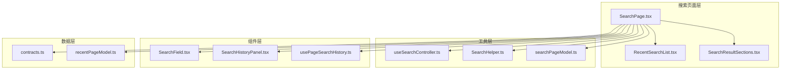
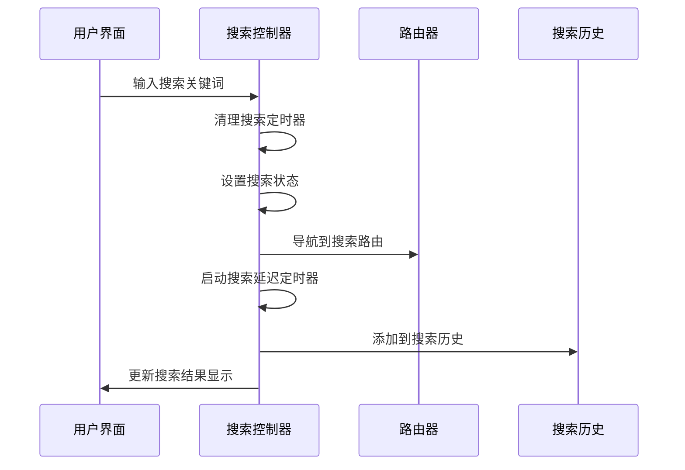
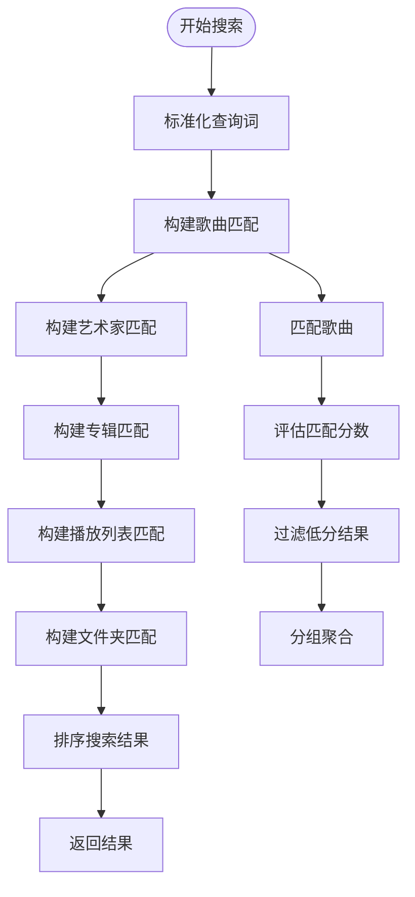
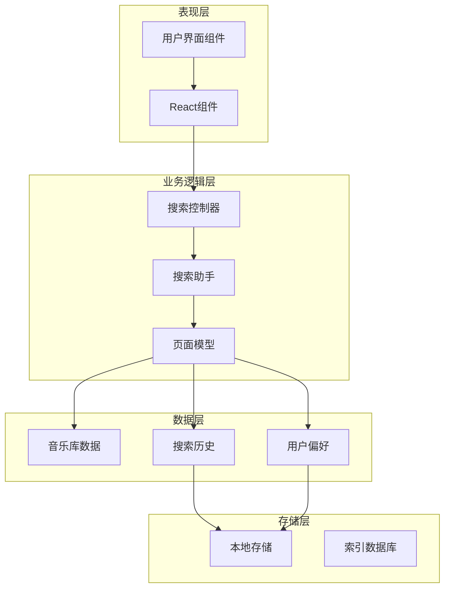
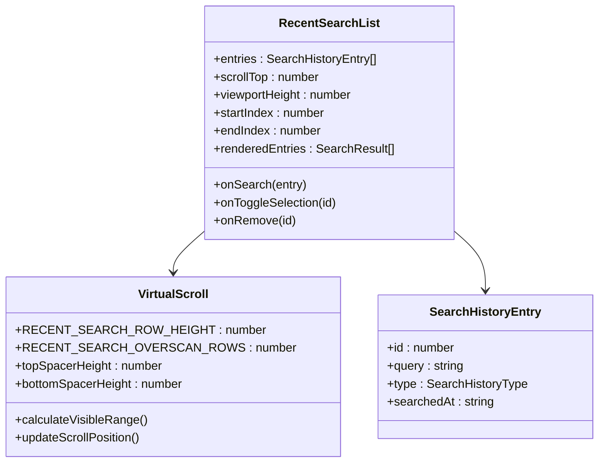
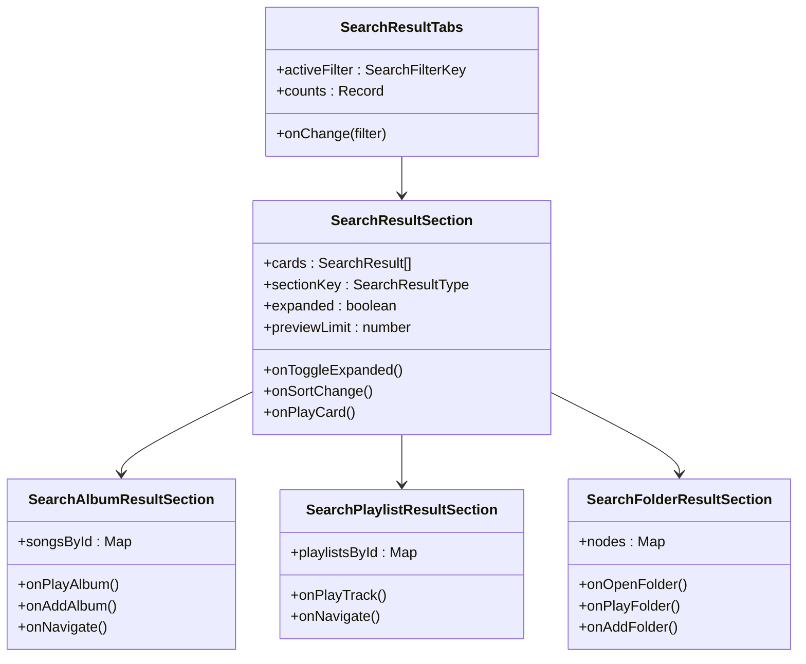
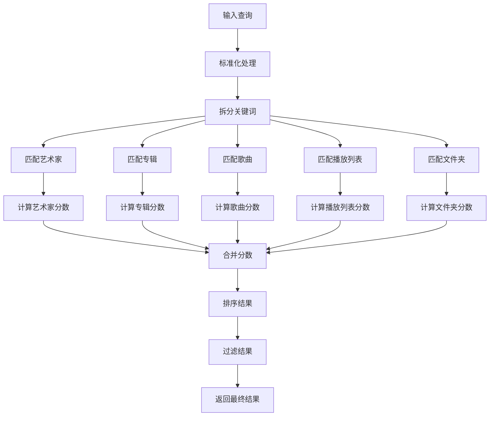
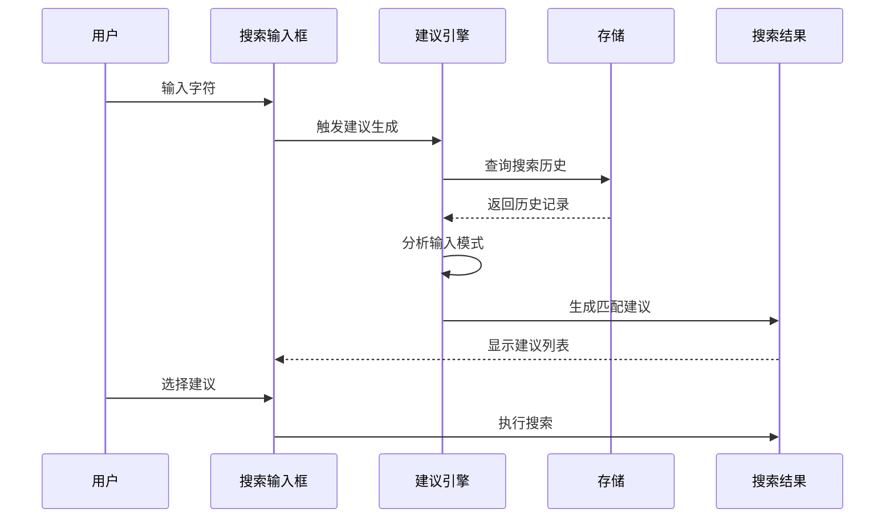
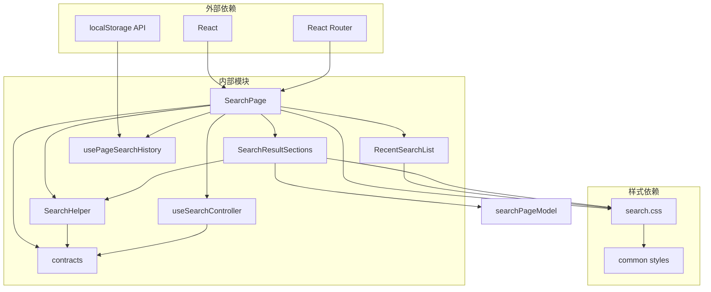

# 搜索结果页面

<cite>
**本文档引用的文件**
- [RecentSearchList.tsx](file://src/pages/RecentSearchList.tsx)
- [SearchResultSections.tsx](file://src/pages/SearchResultSections.tsx)
- [SearchPage.tsx](file://src/pages/SearchPage.tsx)
- [useSearchController.ts](file://src/hooks/useSearchController.ts)
- [SearchHelper.ts](file://src/shared/SearchHelper.ts)
- [searchPageModel.ts](file://src/pages/searchPageModel.ts)
- [SearchField.tsx](file://src/components/SearchField.tsx)
- [SearchHistoryPanel.tsx](file://src/components/SearchHistoryPanel.tsx)
- [usePageSearchHistory.ts](file://src/hooks/usePageSearchHistory.ts)
- [contracts.ts](file://src/shared/contracts.ts)
- [search.css](file://src/styles/search.css)
- [recentPageModel.ts](file://src/pages/recentPageModel.ts)
</cite>

## 目录
1. [简介](#简介)
2. [项目结构](#项目结构)
3. [核心组件](#核心组件)
4. [架构概览](#架构概览)
5. [详细组件分析](#详细组件分析)
6. [依赖关系分析](#依赖关系分析)
7. [性能考虑](#性能考虑)
8. [故障排除指南](#故障排除指南)
9. [结论](#结论)

## 简介

SMPlayer的搜索结果页面是一个高度优化的音乐搜索系统，提供了完整的搜索体验，包括搜索历史管理、多维度搜索结果分类展示、智能搜索建议生成等功能。该系统深度集成了音乐库数据，支持实时搜索、智能排序和丰富的用户交互。

## 项目结构

搜索功能主要分布在以下模块中：

**图表来源**
- [SearchPage.tsx:1-901](file://src/pages/SearchPage.tsx#L1-L901)
- [RecentSearchList.tsx:1-168](file://src/pages/RecentSearchList.tsx#L1-L168)
- [SearchResultSections.tsx:1-648](file://src/pages/SearchResultSections.tsx#L1-L648)

**章节来源**
- [SearchPage.tsx:1-901](file://src/pages/SearchPage.tsx#L1-L901)
- [contracts.ts:181-193](file://src/shared/contracts.ts#L181-L193)

## 核心组件

### 搜索控制器 (useSearchController)

搜索控制器是整个搜索系统的核心协调器，负责处理搜索输入、路由导航和搜索历史管理。

**图表来源**
- [useSearchController.ts:24-89](file://src/hooks/useSearchController.ts#L24-L89)

### 搜索结果构建器 (SearchHelper)

搜索结果构建器实现了复杂的搜索算法，支持多维度匹配和智能排序。

**图表来源**
- [SearchHelper.ts:127-189](file://src/shared/SearchHelper.ts#L127-L189)

**章节来源**
- [useSearchController.ts:1-91](file://src/hooks/useSearchController.ts#L1-L91)
- [SearchHelper.ts:1-486](file://src/shared/SearchHelper.ts#L1-L486)

## 架构概览

搜索系统的整体架构采用分层设计，确保了良好的可维护性和扩展性：

**图表来源**
- [SearchPage.tsx:105-725](file://src/pages/SearchPage.tsx#L105-L725)
- [SearchHelper.ts:127-189](file://src/shared/SearchHelper.ts#L127-L189)

## 详细组件分析

### RecentSearchList 组件

RecentSearchList 组件负责显示用户的搜索历史记录，提供了高效的虚拟滚动和丰富的交互功能。

#### 虚拟滚动实现

组件使用虚拟滚动技术来处理大量搜索历史记录：

**图表来源**
- [RecentSearchList.tsx:15-149](file://src/pages/RecentSearchList.tsx#L15-L149)

#### 搜索历史管理

组件支持多种搜索历史操作：
- 快速搜索：点击历史条目直接执行搜索
- 多选模式：支持批量选择多个历史记录
- 删除功能：单个删除或批量清理
- 类型标识：不同搜索类型的图标区分

**章节来源**
- [RecentSearchList.tsx:1-168](file://src/pages/RecentSearchList.tsx#L1-L168)

### SearchResultSections 组件

SearchResultSections 组件提供了搜索结果的分类展示，支持多种结果类型和交互方式。

#### 结果分类展示

组件针对不同的搜索结果类型提供专门的展示组件：

**图表来源**
- [SearchResultSections.tsx:19-648](file://src/pages/SearchResultSections.tsx#L19-L648)

#### 高级交互功能

每个结果类型都支持丰富的交互操作：
- **艺术家结果**：支持随机播放、查看专辑、添加到播放列表
- **专辑结果**：网格视图展示，支持播放整张专辑
- **歌曲结果**：列表视图，支持播放队列操作
- **播放列表结果**：网格视图，支持播放列表操作
- **文件夹结果**：本地文件夹导航和播放

**章节来源**
- [SearchResultSections.tsx:1-648](file://src/pages/SearchResultSections.tsx#L1-L648)

### 搜索算法实现

SearchHelper 模块实现了复杂的搜索算法，支持多维度匹配和智能排序。

#### 匹配评分系统

搜索算法使用多层次的评分机制：

**图表来源**
- [SearchHelper.ts:365-408](file://src/shared/SearchHelper.ts#L365-L408)

#### 排序和过滤机制

系统支持多种排序策略：

| 排序类型 | 支持字段 | 排序规则 |
|---------|---------|----------|
| 默认 | 所有类型 | 基于匹配分数降序 |
| 名称 | 艺术家、专辑、播放列表 | 字母顺序 |
| 标题 | 歌曲 | 歌曲标题 |
| 演唱者 | 歌曲 | 演唱者名称 |
| 专辑 | 歌曲 | 专辑名称 |
| 播放次数 | 所有类型 | 播放次数降序 |
| 时长 | 所有类型 | 时长降序 |
| 添加时间 | 歌曲 | 添加时间降序 |

**章节来源**
- [SearchHelper.ts:83-121](file://src/shared/SearchHelper.ts#L83-L121)
- [SearchHelper.ts:127-486](file://src/shared/SearchHelper.ts#L127-L486)

### 搜索建议生成

系统提供了智能的搜索建议生成功能：

#### 自动完成机制

**图表来源**
- [usePageSearchHistory.ts:14-52](file://src/hooks/usePageSearchHistory.ts#L14-L52)

#### 建议优先级

建议的生成遵循以下优先级规则：
1. 最近使用的搜索词（最高优先级）
2. 与当前输入前缀匹配的历史记录
3. 高频搜索词
4. 相关的音乐库实体名称

**章节来源**
- [usePageSearchHistory.ts:1-53](file://src/hooks/usePageSearchHistory.ts#L1-L53)

## 依赖关系分析

搜索系统的依赖关系展现了清晰的分层架构：

**图表来源**
- [SearchPage.tsx:1-901](file://src/pages/SearchPage.tsx#L1-L901)
- [SearchHelper.ts:1-486](file://src/shared/SearchHelper.ts#L1-L486)

**章节来源**
- [contracts.ts:181-193](file://src/shared/contracts.ts#L181-L193)

## 性能考虑

### 虚拟滚动优化

RecentSearchList 组件使用虚拟滚动技术来处理大量搜索历史记录：

- **可视区域计算**：只渲染可见范围内的历史记录
- **缓冲区机制**：在可视区域上下各预留8行缓冲
- **动态高度调整**：根据容器大小动态计算视口高度
- **滚动性能**：使用requestAnimationFrame优化滚动性能

### 搜索算法优化

SearchHelper 模块采用了多项性能优化措施：

- **早期过滤**：在匹配过程中及时过滤低分结果
- **缓存机制**：复用中间计算结果，避免重复计算
- **智能排序**：使用原地排序减少内存分配
- **字符串匹配优化**：使用编辑距离算法进行模糊匹配

### 内存管理

系统实现了完善的内存管理策略：

- **组件卸载清理**：自动清理定时器和事件监听器
- **状态重置**：组件销毁时重置所有状态
- **引用清理**：避免循环引用导致的内存泄漏

## 故障排除指南

### 搜索无结果问题

当出现搜索无结果的情况时，可以检查以下方面：

1. **查询词格式**：确保查询词不为空且长度足够
2. **音乐库状态**：确认音乐库已正确扫描和索引
3. **权限问题**：检查文件系统访问权限
4. **缓存问题**：尝试清除浏览器缓存

### 性能问题诊断

如果遇到搜索性能问题：

1. **检查网络连接**：确保数据库连接稳定
2. **监控内存使用**：检查是否有内存泄漏
3. **分析查询时间**：使用浏览器开发者工具分析查询耗时
4. **优化索引**：检查数据库索引是否完整

### 搜索历史异常

搜索历史功能异常时：

1. **检查localStorage**：确认浏览器允许使用localStorage
2. **验证存储格式**：检查存储的数据格式是否正确
3. **清理损坏数据**：手动清理损坏的搜索历史数据
4. **重置设置**：恢复默认的搜索历史设置

**章节来源**
- [usePageSearchHistory.ts:14-52](file://src/hooks/usePageSearchHistory.ts#L14-L52)

## 结论

SMPlayer的搜索结果页面是一个功能完整、性能优异的音乐搜索系统。通过合理的架构设计和优化策略，系统实现了：

- **高效的数据检索**：基于多维度匹配的智能搜索算法
- **优秀的用户体验**：流畅的虚拟滚动和丰富的交互功能
- **强大的扩展性**：模块化的组件设计便于功能扩展
- **可靠的稳定性**：完善的错误处理和性能优化机制

该系统为用户提供了直观、高效的音乐搜索体验，是现代音乐应用搜索功能的优秀范例。