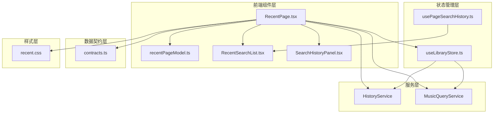
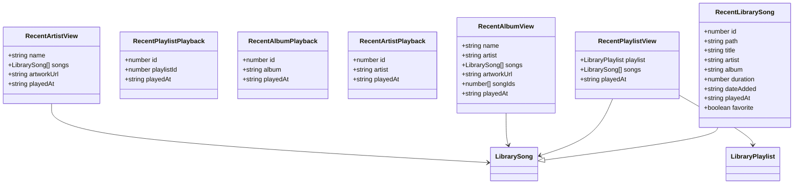
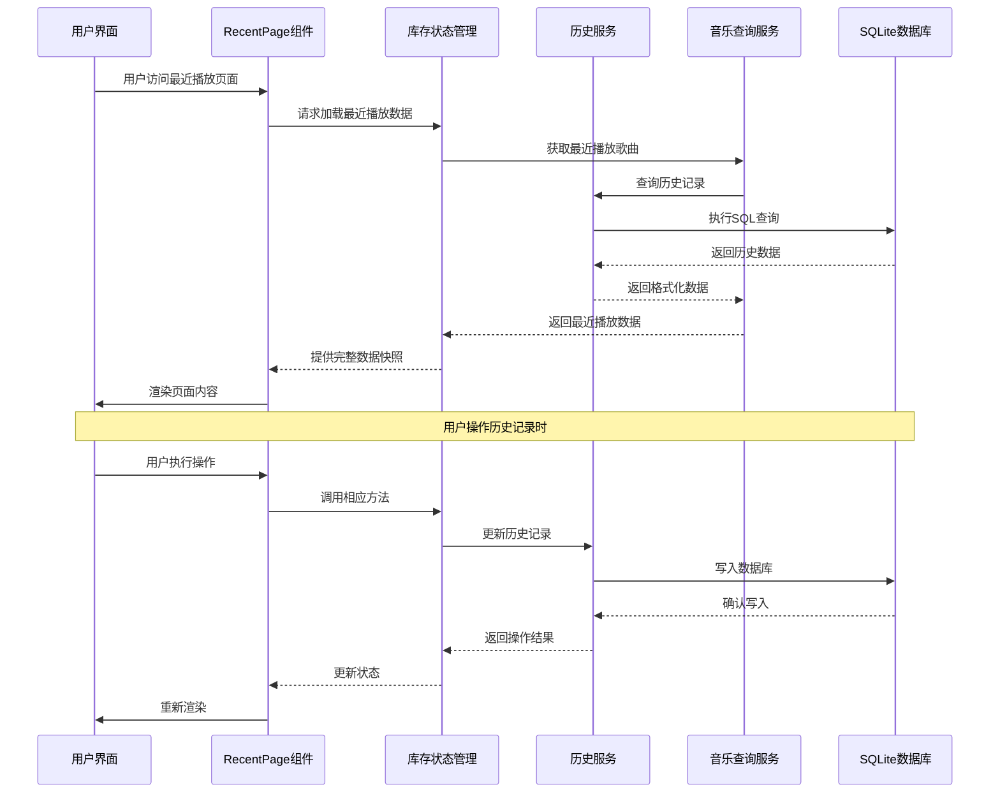
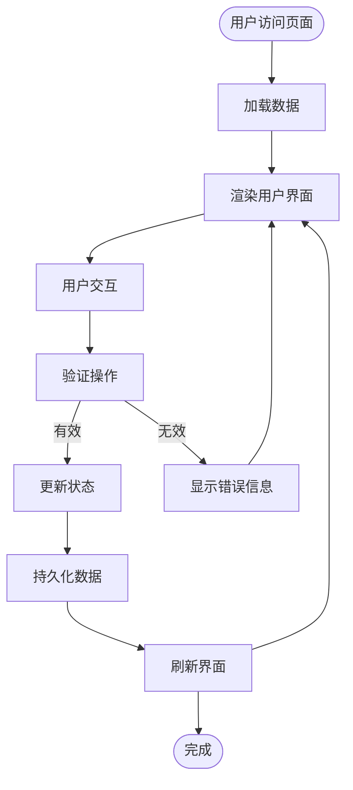
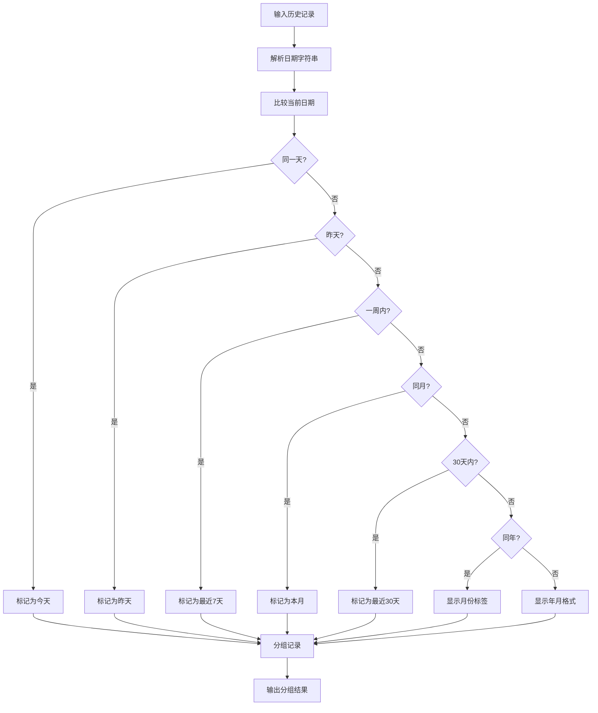
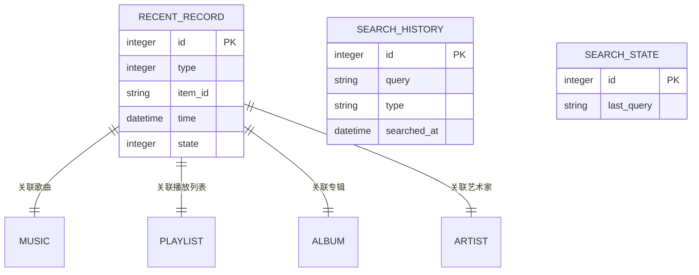
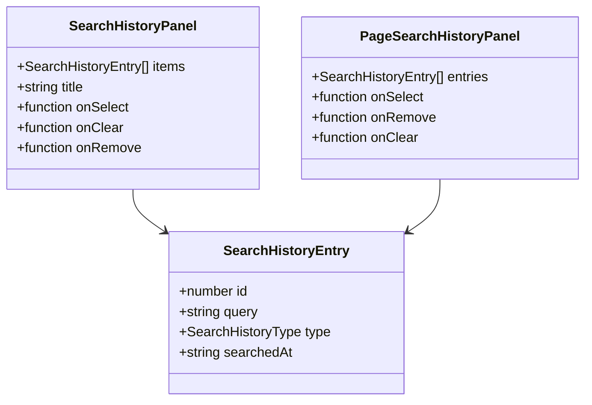
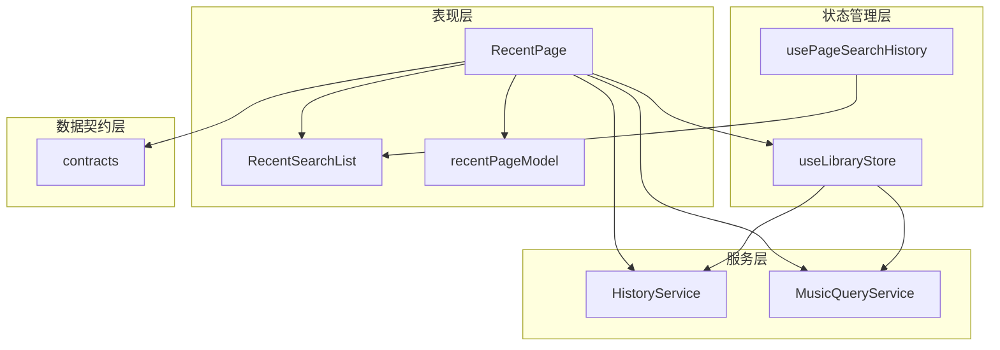
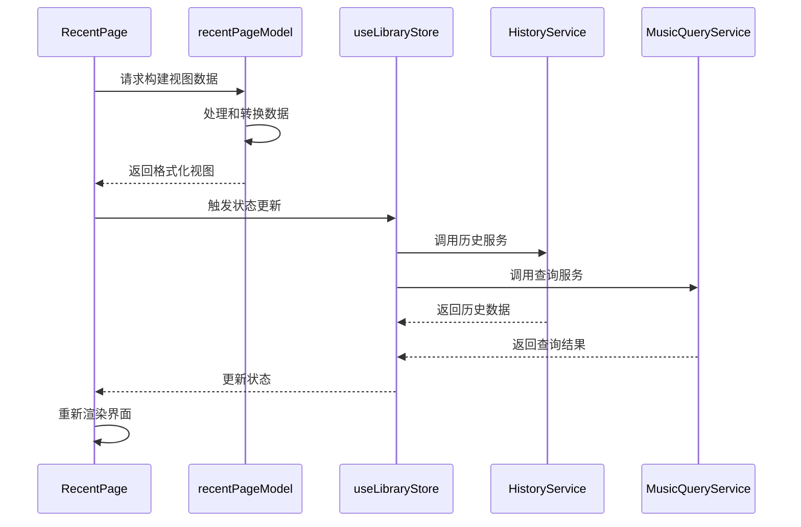

# 最近播放页面

<cite>
**本文档引用的文件**
- [RecentPage.tsx](file://src/pages/RecentPage.tsx)
- [recentPageModel.ts](file://src/pages/recentPageModel.ts)
- [history-service.ts](file://electron/services/history-service.ts)
- [music-query-service.ts](file://electron/services/music-query-service.ts)
- [contracts.ts](file://src/shared/contracts.ts)
- [RecentSearchList.tsx](file://src/pages/RecentSearchList.tsx)
- [SearchHistoryPanel.tsx](file://src/components/SearchHistoryPanel.tsx)
- [usePageSearchHistory.ts](file://src/hooks/usePageSearchHistory.ts)
- [recent.css](file://src/styles/recent.css)
- [useLibraryStore.ts](file://src/state/useLibraryStore.ts)
</cite>

## 目录
1. [简介](#简介)
2. [项目结构](#项目结构)
3. [核心组件](#核心组件)
4. [架构概览](#架构概览)
5. [详细组件分析](#详细组件分析)
6. [依赖关系分析](#依赖关系分析)
7. [性能考虑](#性能考虑)
8. [故障排除指南](#故障排除指南)
9. [结论](#结论)

## 简介

SMPlayer的最近播放页面是一个综合性的媒体播放历史管理界面，提供了用户最近播放的音乐、专辑、艺术家和播放列表的可视化展示。该页面不仅展示了播放历史的存储和检索机制，还提供了丰富的交互功能，包括历史记录的快速访问、搜索过滤、批量操作等。

本文档深入分析了RecentPage组件的播放历史功能，包括最近播放记录的存储、时间排序算法、播放历史的清理机制等。我们将详细说明最近播放数据的结构设计、历史记录的最大数量限制、重复播放的去重处理，并解释最近播放页面的交互功能。

## 项目结构

最近播放页面主要由以下核心文件组成：

**图表来源**
- [RecentPage.tsx:141-848](file://src/pages/RecentPage.tsx#L141-L848)
- [history-service.ts:30-484](file://electron/services/history-service.ts#L30-L484)
- [music-query-service.ts:50-258](file://electron/services/music-query-service.ts#L50-L258)

**章节来源**
- [RecentPage.tsx:1-848](file://src/pages/RecentPage.tsx#L1-L848)
- [history-service.ts:1-484](file://electron/services/history-service.ts#L1-L484)
- [music-query-service.ts:1-258](file://electron/services/music-query-service.ts#L1-L258)

## 核心组件

### RecentPage 主组件

RecentPage是最近播放页面的核心组件，负责管理整个页面的状态和交互逻辑。该组件实现了三个主要标签页：最近添加、最近播放和搜索历史。

**主要功能特性：**
- **多标签页导航**：支持最近添加、最近播放、搜索历史三种视图模式
- **批量选择操作**：支持多选模式下的批量操作功能
- **实时搜索过滤**：提供搜索历史的快速过滤和搜索功能
- **历史记录管理**：支持历史记录的删除、恢复和清空操作

**关键状态管理：**
- `activeTab`: 当前激活的标签页（added/played/searches）
- `activePlayedFilter`: 播放历史的筛选器（songs/artists/albums/playlists）
- `multiSelect`: 多选模式开关
- `selectedSongIds`: 已选择的歌曲ID集合

### 数据模型和结构

最近播放页面使用了多种数据结构来组织不同类型的历史记录：

**图表来源**
- [contracts.ts:61-81](file://src/shared/contracts.ts#L61-L81)
- [recentPageModel.ts:5-25](file://src/pages/recentPageModel.ts#L5-L25)

**章节来源**
- [RecentPage.tsx:133-175](file://src/pages/RecentPage.tsx#L133-L175)
- [contracts.ts:36-81](file://src/shared/contracts.ts#L36-L81)
- [recentPageModel.ts:1-108](file://src/pages/recentPageModel.ts#L1-L108)

## 架构概览

最近播放页面采用了分层架构设计，确保了良好的代码组织和可维护性：

**图表来源**
- [RecentPage.tsx:175-848](file://src/pages/RecentPage.tsx#L175-L848)
- [useLibraryStore.ts:111-109](file://src/state/useLibraryStore.ts#L111-L109)
- [history-service.ts:30-484](file://electron/services/history-service.ts#L30-L484)

### 数据流架构

最近播放页面的数据流遵循单向数据流原则，确保了数据的一致性和可预测性：

**图表来源**
- [RecentPage.tsx:295-401](file://src/pages/RecentPage.tsx#L295-L401)
- [history-service.ts:291-338](file://electron/services/history-service.ts#L291-L338)

## 详细组件分析

### 时间排序和分组算法

最近播放页面实现了智能的时间分组功能，将历史记录按照时间维度进行分类展示：

**图表来源**
- [recentPageModel.ts:114-149](file://src/pages/recentPageModel.ts#L114-L149)

**章节来源**
- [recentPageModel.ts:110-189](file://src/pages/recentPageModel.ts#L110-L189)

### 历史记录存储机制

最近播放页面使用SQLite数据库进行历史记录的持久化存储，实现了高效的数据管理和查询优化：

#### 数据库表结构

**图表来源**
- [history-service.ts:24-28](file://electron/services/history-service.ts#L24-L28)

#### 存储策略

历史记录采用软删除机制，通过状态字段控制记录的可见性：

| 状态值 | 含义 | 描述 |
|--------|------|------|
| 0 | inactive | 记录被标记为非活跃状态，不会在查询中返回 |
| 1 | active | 记录处于活跃状态，正常显示和查询 |

**章节来源**
- [history-service.ts:31-182](file://electron/services/history-service.ts#L31-L182)

### 搜索历史功能

最近播放页面集成了完整的搜索历史功能，提供了便捷的搜索记录管理：

#### 搜索历史数据结构

**图表来源**
- [contracts.ts:181-188](file://src/shared/contracts.ts#L181-L188)
- [SearchHistoryPanel.tsx:3-18](file://src/components/SearchHistoryPanel.tsx#L3-L18)

**章节来源**
- [RecentSearchList.tsx:15-168](file://src/pages/RecentSearchList.tsx#L15-L168)
- [SearchHistoryPanel.tsx:20-82](file://src/components/SearchHistoryPanel.tsx#L20-L82)

### 批量操作功能

最近播放页面提供了强大的批量操作能力，支持用户对多个历史记录进行统一管理：

#### 批量操作类型

| 操作类型 | 功能描述 | 支持的元素 |
|----------|----------|------------|
| 多选模式 | 启用批量选择功能 | 歌曲、播放列表、专辑、艺术家 |
| 全选操作 | 选择所有可见项目 | 歌曲、播放列表、专辑、艺术家 |
| 反选操作 | 切换当前选择状态 | 歌曲、播放列表、专辑、艺术家 |
| 删除操作 | 从历史记录中移除 | 歌曲、搜索历史 |
| 清空操作 | 清空所有历史记录 | 歌曲、搜索历史 |

**章节来源**
- [RecentPage.tsx:314-401](file://src/pages/RecentPage.tsx#L314-L401)
- [RecentPage.tsx:371-378](file://src/pages/RecentPage.tsx#L371-L378)

## 依赖关系分析

最近播放页面的依赖关系体现了清晰的分层架构：

**图表来源**
- [RecentPage.tsx:18-37](file://src/pages/RecentPage.tsx#L18-L37)
- [useLibraryStore.ts:111-109](file://src/state/useLibraryStore.ts#L111-L109)

### 组件间通信

最近播放页面通过props和回调函数实现组件间的通信：

**图表来源**
- [RecentPage.tsx:223-278](file://src/pages/RecentPage.tsx#L223-L278)
- [useLibraryStore.ts:195-206](file://src/state/useLibraryStore.ts#L195-L206)

**章节来源**
- [RecentPage.tsx:141-848](file://src/pages/RecentPage.tsx#L141-L848)
- [useLibraryStore.ts:111-109](file://src/state/useLibraryStore.ts#L111-L109)

## 性能考虑

最近播放页面在设计时充分考虑了性能优化，采用了多种技术手段来提升用户体验：

### 虚拟滚动优化

页面实现了高效的虚拟滚动机制，仅渲染可视区域内的元素：

- **滚动区域高度**：根据内容动态计算
- **可视区域计算**：基于scrollTop和视口高度
- **预渲染区域**：使用overscan参数提前渲染额外元素
- **内存管理**：及时释放不可见元素的DOM节点

### 数据缓存策略

- **本地状态缓存**：使用useMemo和useCallback避免不必要的重渲染
- **查询结果缓存**：对频繁访问的数据进行缓存
- **组件实例缓存**：复用已创建的组件实例

### 异步数据加载

- **懒加载机制**：按需加载数据，减少初始加载时间
- **并发请求**：并行执行多个数据请求
- **错误边界**：提供优雅的错误处理和降级方案

## 故障排除指南

### 常见问题及解决方案

#### 历史记录不显示

**可能原因：**
- 数据库连接异常
- 权限不足
- 数据损坏

**解决步骤：**
1. 检查数据库连接状态
2. 验证用户权限
3. 运行数据库修复程序
4. 重启应用

#### 搜索历史无法保存

**可能原因：**
- 浏览器存储空间不足
- 本地存储权限被拒绝
- 数据格式错误

**解决步骤：**
1. 清理浏览器缓存
2. 检查存储配额
3. 重置本地存储设置
4. 更新应用版本

#### 页面加载缓慢

**可能原因：**
- 历史记录过多
- 网络延迟
- 系统资源不足

**优化建议：**
1. 清理历史记录
2. 关闭不必要的应用
3. 增加系统内存
4. 使用高性能设备

**章节来源**
- [history-service.ts:332-338](file://electron/services/history-service.ts#L332-L338)
- [usePageSearchHistory.ts:14-52](file://src/hooks/usePageSearchHistory.ts#L14-L52)

## 结论

SMPlayer的最近播放页面展现了现代Web应用的最佳实践，通过精心设计的架构和丰富的功能特性，为用户提供了优秀的媒体播放历史管理体验。

该页面的主要优势包括：

1. **模块化设计**：清晰的分层架构便于维护和扩展
2. **性能优化**：虚拟滚动和数据缓存确保流畅的用户体验
3. **功能完整性**：支持多种历史记录类型和丰富的交互操作
4. **数据一致性**：通过事务处理保证数据的完整性和一致性
5. **用户友好**：直观的界面设计和便捷的操作流程

未来可以考虑的功能增强包括：
- 历史记录的导出和导入功能
- 更精细的搜索和过滤选项
- 自定义历史记录分组规则
- 历史记录的统计分析报告

通过持续的优化和改进，最近播放页面将继续为用户提供卓越的媒体播放历史管理体验。