# 设置页面

<cite>
**本文档引用的文件**
- [SettingsPage.tsx](file://src/pages/SettingsPage.tsx)
- [PreferenceSettingsPage.tsx](file://src/pages/PreferenceSettingsPage.tsx)
- [settings-service.ts](file://electron/services/settings-service.ts)
- [usePreferenceStore.ts](file://src/state/usePreferenceStore.ts)
- [settings.css](file://src/styles/settings.css)
- [en-US.ts](file://src/shared/locales/en-US.ts)
- [zh-CN.ts](file://src/shared/locales/zh-CN.ts)
- [contracts.ts](file://src/shared/contracts.ts)
- [preload.ts](file://electron/preload.ts)
- [data-ipc.ts](file://electron/ipc/data-ipc.ts)
</cite>

## 目录
1. [简介](#简介)
2. [项目结构](#项目结构)
3. [核心组件](#核心组件)
4. [架构概览](#架构概览)
5. [详细组件分析](#详细组件分析)
6. [依赖关系分析](#依赖关系分析)
7. [性能考虑](#性能考虑)
8. [故障排除指南](#故障排除指南)
9. [结论](#结论)

## 简介

SMPlayer的设置页面是一个功能完整的配置管理系统，负责管理应用程序的各种配置选项、偏好设置、主题选择和语言设置。该页面提供了用户友好的界面来调整播放器的行为和外观，同时确保设置数据的持久化存储和实时同步。

设置页面采用模块化设计，将不同的设置类别组织成独立的卡片组件，每个卡片包含相关的设置项并提供即时的视觉反馈。页面支持多种设置类型，包括开关设置、下拉选择、时间范围设置等，并通过双向绑定机制确保用户界面与底层数据模型保持同步。

## 项目结构

设置页面的实现分布在多个层次中，形成了清晰的分层架构：

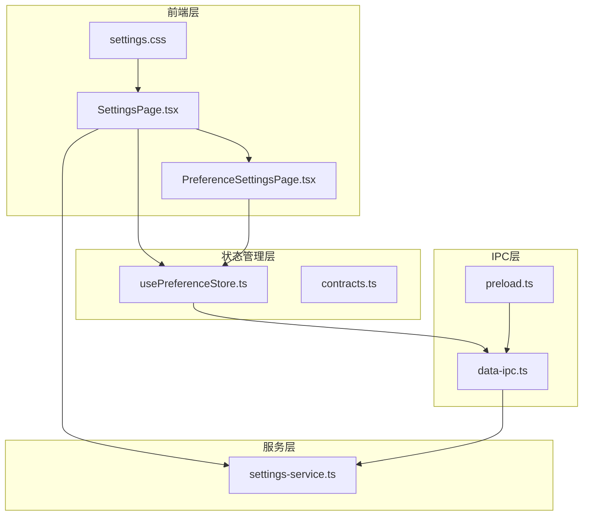

**图表来源**
- [SettingsPage.tsx:1-948](file://src/pages/SettingsPage.tsx#L1-L948)
- [settings-service.ts:1-577](file://electron/services/settings-service.ts#L1-L577)

**章节来源**
- [SettingsPage.tsx:1-948](file://src/pages/SettingsPage.tsx#L1-L948)
- [settings-service.ts:1-577](file://electron/services/settings-service.ts#L1-L577)

## 核心组件

设置页面由多个核心组件构成，每个组件都有特定的功能和职责：

### 主设置页面组件
SettingsPage.tsx 提供了主要的设置界面，包含以下功能区域：
- 音乐库设置：音乐文件夹路径、智能多艺术家识别
- 歌词设置：歌词源选择、自动歌词添加
- 显示设置：界面语言、夜间模式、显示计数
- 播放设置：自动播放、保存播放进度
- 其他设置：退出行为、导入导出、反馈收集

### 偏好设置组件
PreferenceSettingsPage.tsx 专门管理用户的偏好设置，包括：
- 歌手偏好设置
- 专辑偏好设置  
- 播放列表偏好设置
- 文件夹偏好设置
- 自定义偏好项管理

### 设置服务组件
settings-service.ts 负责设置数据的持久化存储，提供：
- SQLite数据库操作
- 设置数据映射和转换
- 默认值处理机制
- 数据验证规则

**章节来源**
- [SettingsPage.tsx:318-948](file://src/pages/SettingsPage.tsx#L318-L948)
- [PreferenceSettingsPage.tsx:37-530](file://src/pages/PreferenceSettingsPage.tsx#L37-L530)
- [settings-service.ts:61-293](file://electron/services/settings-service.ts#L61-L293)

## 架构概览

设置页面采用了分层架构设计，确保了良好的代码组织和可维护性：

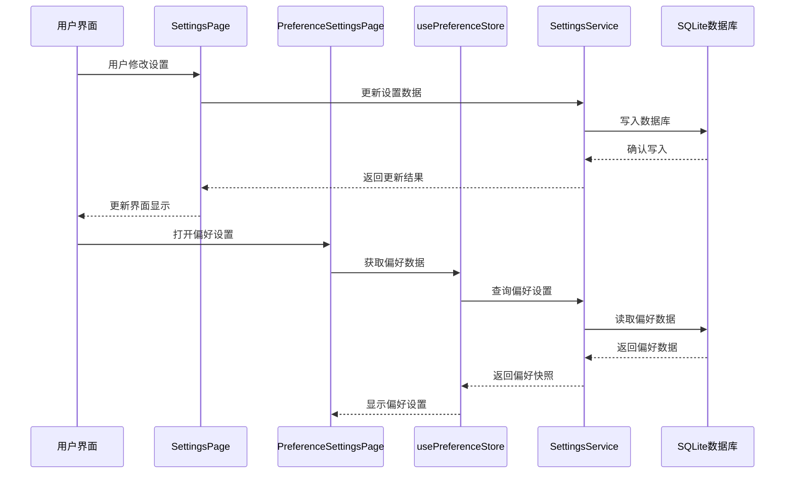

**图表来源**
- [SettingsPage.tsx:318-948](file://src/pages/SettingsPage.tsx#L318-L948)
- [usePreferenceStore.ts:51-160](file://src/state/usePreferenceStore.ts#L51-L160)
- [settings-service.ts:181-293](file://electron/services/settings-service.ts#L181-L293)

**章节来源**
- [preload.ts:45-287](file://electron/preload.ts#L45-L287)
- [data-ipc.ts:108-151](file://electron/ipc/data-ipc.ts#L108-L151)

## 详细组件分析

### 设置页面组织结构

设置页面采用卡片式布局，将相关的设置项分组管理：

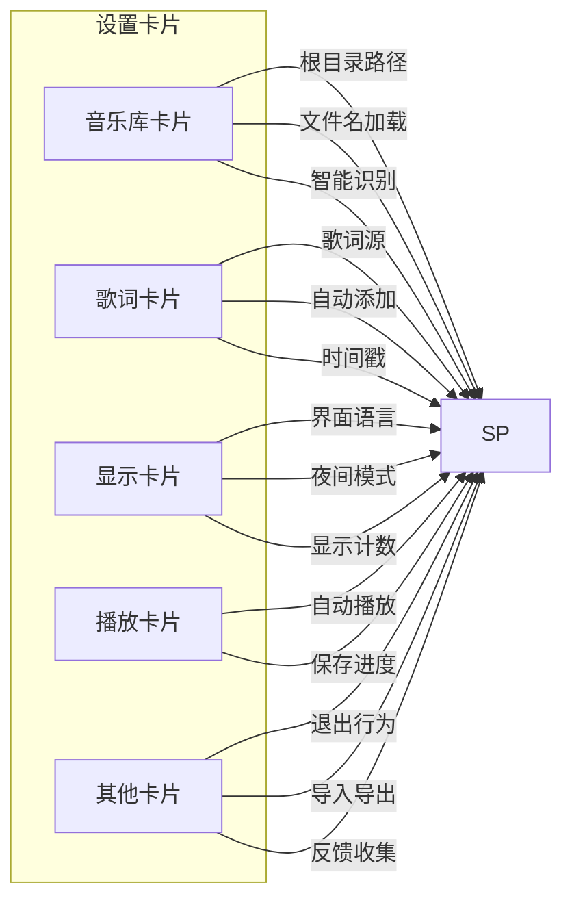

**图表来源**
- [SettingsPage.tsx:616-904](file://src/pages/SettingsPage.tsx#L616-L904)

#### 设置分类详解

**音乐库设置**
- 根目录路径：管理音乐文件夹的根路径
- 文件名加载：控制使用文件名还是音乐名称加载
- 智能多艺术家识别：自动识别多艺术家格式

**歌词设置**
- 歌词源选择：支持本地、网络、嵌入式歌词
- 自动歌词添加：新歌曲自动获取歌词
- 时间戳保留：保持网络歌词的时间戳

**显示设置**
- 界面语言：支持系统、英语、中文
- 夜间模式：自动、开启、关闭三种模式
- 显示计数：控制数量显示

**播放设置**
- 自动播放：启动时自动播放
- 保存进度：退出时保存播放进度

**其他设置**
- 退出行为：关闭窗口时退出应用
- 导入导出：数据备份和恢复
- 反馈收集：用户反馈渠道

**章节来源**
- [SettingsPage.tsx:616-904](file://src/pages/SettingsPage.tsx#L616-L904)

### 设置项分组展示

设置页面使用卡片组件来组织设置项，每个卡片包含标题和内容区域：

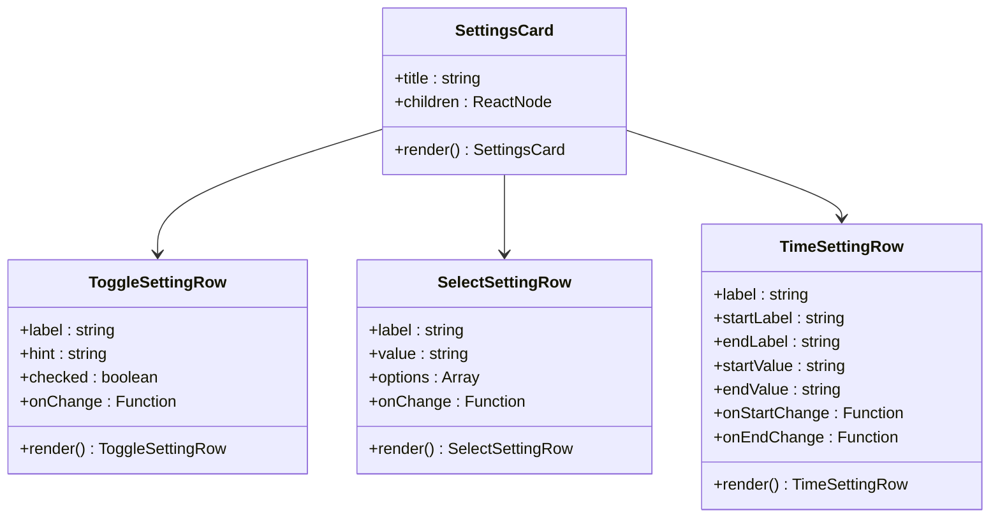

**图表来源**
- [SettingsPage.tsx:283-292](file://src/pages/SettingsPage.tsx#L283-L292)
- [SettingsPage.tsx:62-85](file://src/pages/SettingsPage.tsx#L62-L85)
- [SettingsPage.tsx:211-281](file://src/pages/SettingsPage.tsx#L211-L281)
- [SettingsPage.tsx:183-209](file://src/pages/SettingsPage.tsx#L183-L209)

### 设置值双向绑定机制

设置页面实现了完整的双向数据绑定机制：

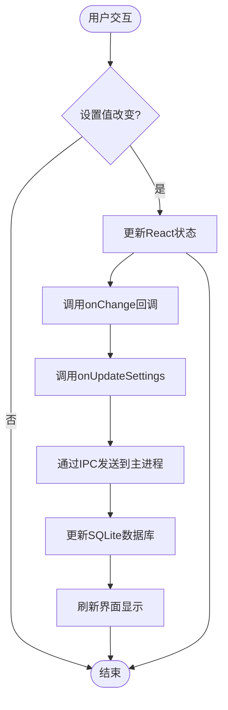

**图表来源**
- [SettingsPage.tsx:629-647](file://src/pages/SettingsPage.tsx#L629-L647)
- [SettingsPage.tsx:664-678](file://src/pages/SettingsPage.tsx#L664-L678)

**章节来源**
- [SettingsPage.tsx:629-647](file://src/pages/SettingsPage.tsx#L629-L647)
- [SettingsPage.tsx:664-678](file://src/pages/SettingsPage.tsx#L664-L678)

### 设置数据持久化存储

设置数据通过SQLite数据库进行持久化存储，确保应用重启后设置仍然有效：

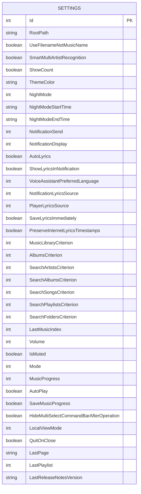

**图表来源**
- [settings-service.ts:18-59](file://electron/services/settings-service.ts#L18-L59)

**章节来源**
- [settings-service.ts:181-293](file://electron/services/settings-service.ts#L181-L293)

### 默认值处理机制

设置系统实现了完善的默认值处理机制：

| 设置项 | 默认值 | 处理逻辑 |
|--------|--------|----------|
| useFilenameNotMusicName | false | 从数据库读取布尔值，不存在时使用false |
| smartMultiArtistRecognition | false | 从数据库读取布尔值，不存在时使用false |
| nightMode | 'never' | 数值映射到枚举值，不存在时使用'never' |
| preferredLanguage | 'system' | 数值映射到枚举值，不存在时使用'system' |
| autoLyrics | false | 从数据库读取布尔值，不存在时使用false |

**章节来源**
- [settings-service.ts:295-336](file://electron/services/settings-service.ts#L295-L336)

### 设置验证规则

设置系统包含多种验证规则来确保数据完整性：

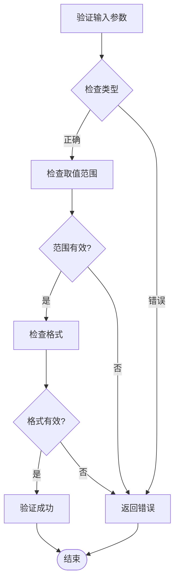

**图表来源**
- [settings-service.ts:208-269](file://electron/services/settings-service.ts#L208-L269)

**章节来源**
- [settings-service.ts:208-269](file://electron/services/settings-service.ts#L208-L269)

### 设置页面与状态管理系统集成

设置页面通过Zustand状态管理库与应用状态集成：

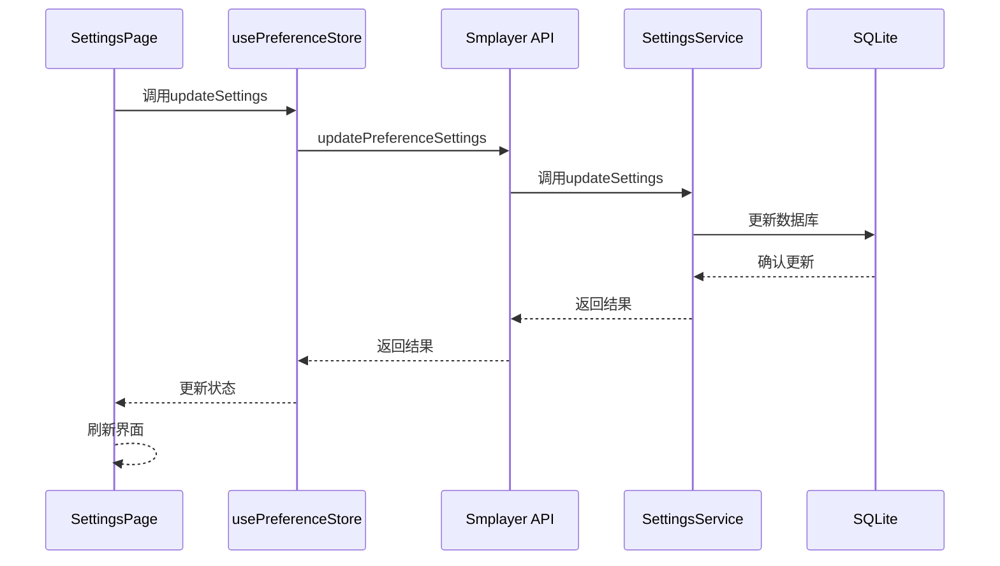

**图表来源**
- [usePreferenceStore.ts:72-88](file://src/state/usePreferenceStore.ts#L72-L88)
- [data-ipc.ts:108-112](file://electron/ipc/data-ipc.ts#L108-L112)

**章节来源**
- [usePreferenceStore.ts:51-160](file://src/state/usePreferenceStore.ts#L51-L160)

### 设置变更通知机制

设置变更通过多种方式通知相关组件：

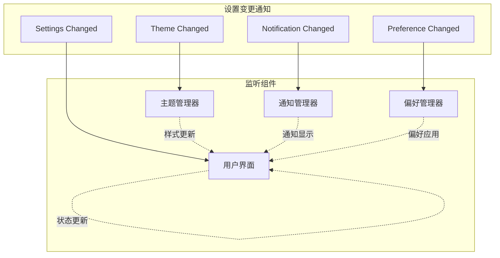

**图表来源**
- [SettingsPage.tsx:318-948](file://src/pages/SettingsPage.tsx#L318-L948)

**章节来源**
- [SettingsPage.tsx:318-948](file://src/pages/SettingsPage.tsx#L318-L948)

### 设置重置功能

设置页面提供了完整的重置功能：

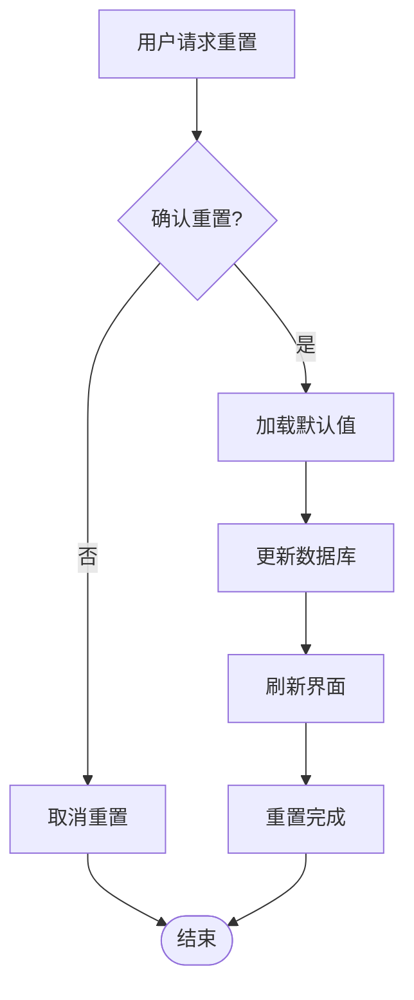

**图表来源**
- [SettingsPage.tsx:821-831](file://src/pages/SettingsPage.tsx#L821-L831)

**章节来源**
- [SettingsPage.tsx:821-831](file://src/pages/SettingsPage.tsx#L821-L831)

### 导入导出功能

设置页面支持数据的导入和导出：

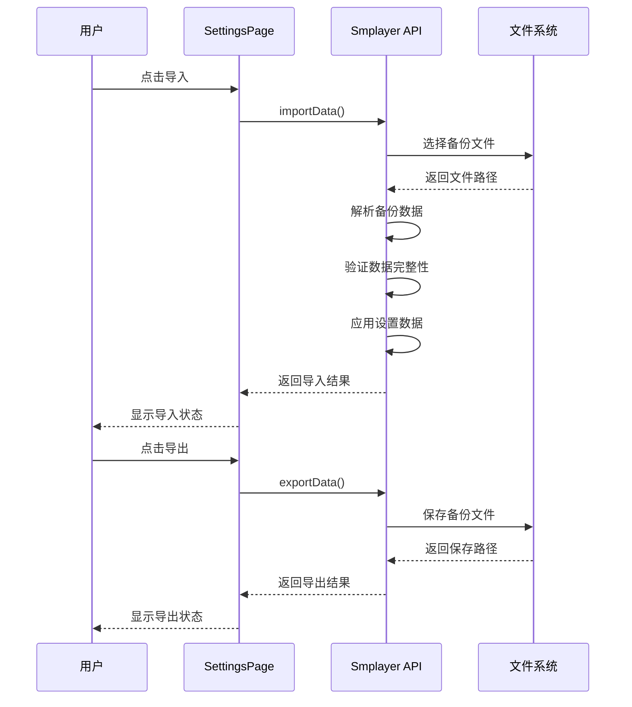

**图表来源**
- [SettingsPage.tsx:553-592](file://src/pages/SettingsPage.tsx#L553-L592)

**章节来源**
- [SettingsPage.tsx:553-592](file://src/pages/SettingsPage.tsx#L553-L592)

## 依赖关系分析

设置页面的依赖关系体现了清晰的分层架构：

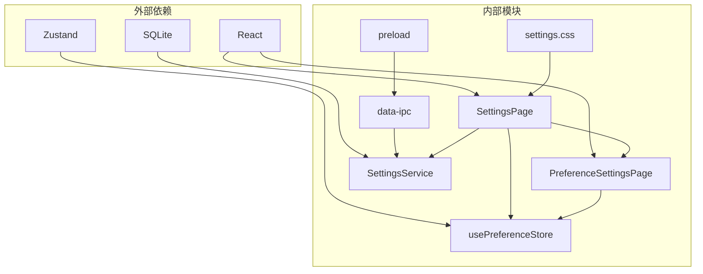

**图表来源**
- [SettingsPage.tsx:1-20](file://src/pages/SettingsPage.tsx#L1-L20)
- [usePreferenceStore.ts:1-11](file://src/state/usePreferenceStore.ts#L1-L11)

**章节来源**
- [contracts.ts:527-664](file://src/shared/contracts.ts#L527-L664)

## 性能考虑

设置页面在设计时充分考虑了性能优化：

### 渲染优化
- 使用React.memo避免不必要的重新渲染
- 实现虚拟滚动处理大量设置项
- 懒加载非关键设置组件

### 数据访问优化
- 批量更新设置减少数据库操作
- 使用事务处理复杂设置变更
- 缓存常用设置值

### 内存管理
- 及时清理事件监听器
- 合理管理组件生命周期
- 避免内存泄漏

## 故障排除指南

### 常见问题及解决方案

**设置无法保存**
- 检查数据库连接状态
- 验证设置值的有效性
- 查看控制台错误信息

**界面显示异常**
- 确认CSS样式加载
- 检查夜间模式配置
- 验证响应式布局

**偏好设置不同步**
- 重启应用确保状态同步
- 检查IPC通信状态
- 验证数据库写入权限

**章节来源**
- [settings-service.ts:181-197](file://electron/services/settings-service.ts#L181-L197)

## 结论

SMPlayer的设置页面是一个功能完善、架构清晰的配置管理系统。它通过模块化的组件设计、完善的双向数据绑定机制、可靠的持久化存储和丰富的用户交互体验，为用户提供了全面的应用程序配置能力。

该系统的主要优势包括：
- **模块化设计**：清晰的组件分离和职责划分
- **数据一致性**：完整的双向绑定和状态管理
- **用户体验**：直观的界面设计和即时反馈
- **可扩展性**：灵活的架构支持未来功能扩展
- **可靠性**：完善的错误处理和数据验证机制

通过持续的优化和改进，设置页面将继续为用户提供优秀的配置管理体验。