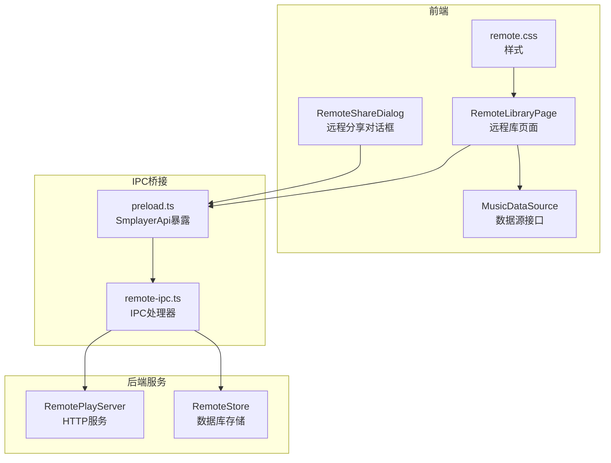
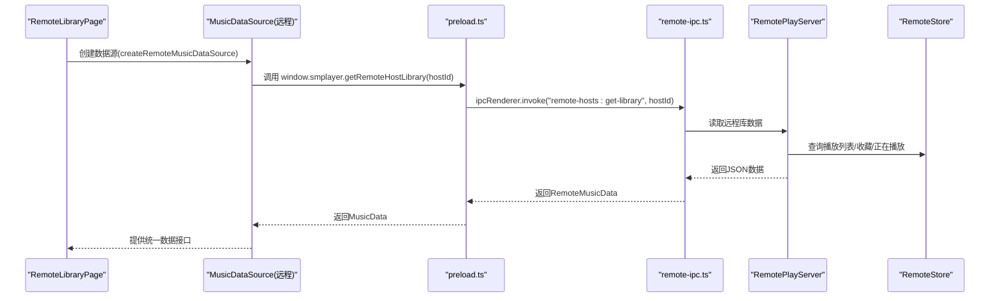
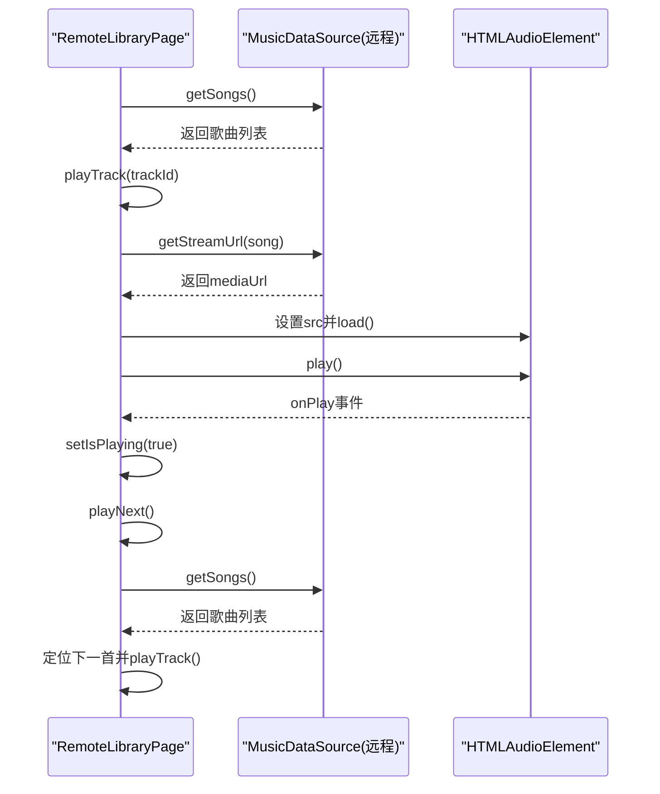
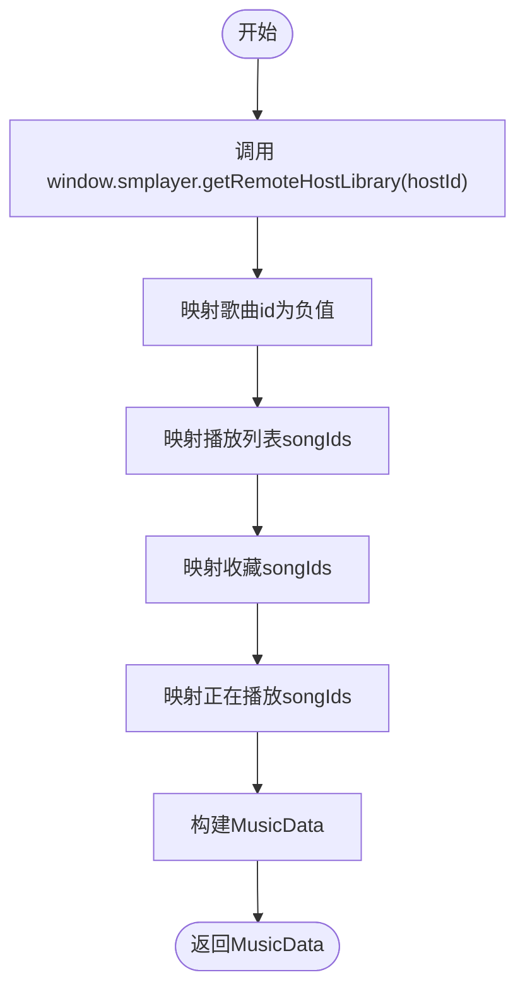
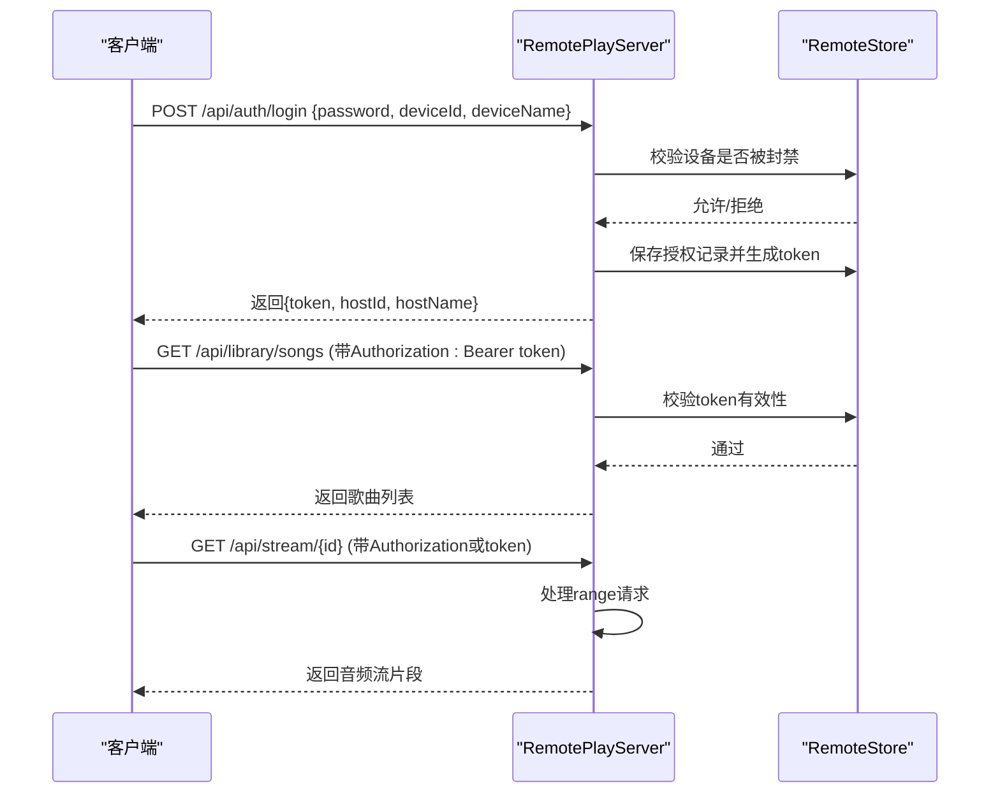
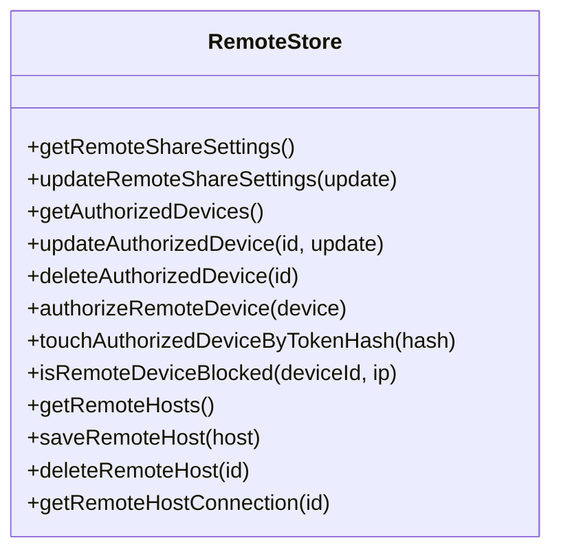
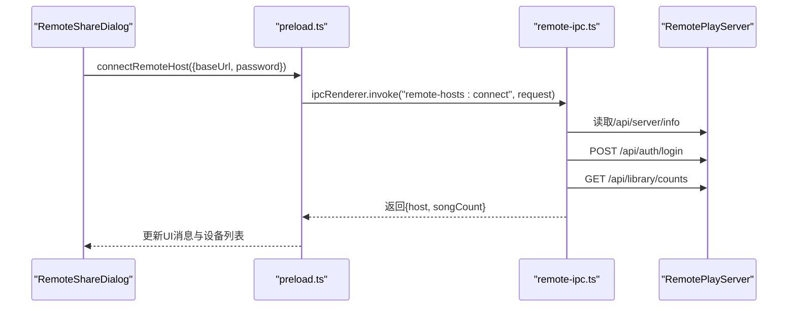
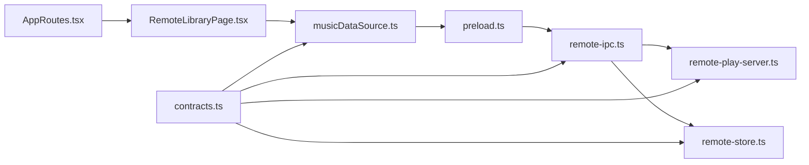

# 远程库页面

<cite>
**本文档引用的文件**
- [RemoteLibraryPage.tsx](file://src/pages/RemoteLibraryPage.tsx)
- [musicDataSource.ts](file://src/data/musicDataSource.ts)
- [remote-ipc.ts](file://electron/ipc/remote-ipc.ts)
- [remote-play-server.ts](file://electron/services/remote-play-server.ts)
- [remote-store.ts](file://electron/services/remote-store.ts)
- [RemoteShareDialog.tsx](file://src/components/RemoteShareDialog.tsx)
- [remote.css](file://src/styles/remote.css)
- [contracts.ts](file://src/shared/contracts.ts)
- [preload.ts](file://electron/preload.ts)
- [AppRoutes.tsx](file://src/AppRoutes.tsx)
</cite>

## 目录
1. [简介](#简介)
2. [项目结构](#项目结构)
3. [核心组件](#核心组件)
4. [架构总览](#架构总览)
5. [详细组件分析](#详细组件分析)
6. [依赖关系分析](#依赖关系分析)
7. [性能考虑](#性能考虑)
8. [故障排除指南](#故障排除指南)
9. [结论](#结论)

## 简介
本文件面向SMPlayer的“远程库页面”，系统性阐述RemoteLibraryPage组件在网络共享音乐库中的作用与实现，涵盖远程音乐库的发现、连接管理、实时播放状态同步、数据传输机制、播放列表的网络共享、远程播放控制、安全认证、网络连接稳定性与断线重连策略、配置管理、播放状态实时同步以及远程库与本地库的数据一致性保障等方面。文档以代码级分析为基础，辅以可视化图示，帮助开发者与使用者全面理解远程库页面的工作原理与最佳实践。

## 项目结构
远程库页面位于前端路由层，通过路由参数hostId绑定到具体的远程主机；后端提供HTTP服务用于远程音乐库的访问与播放流传输；IPC桥接前后端，实现UI与Electron主进程之间的通信；数据源层将远程数据转换为统一的MusicData结构，供页面渲染与播放控制使用。

图表来源
- [RemoteLibraryPage.tsx:11-183](file://src/pages/RemoteLibraryPage.tsx#L11-L183)
- [musicDataSource.ts:205-285](file://src/data/musicDataSource.ts#L205-L285)
- [remote-ipc.ts:19-54](file://electron/ipc/remote-ipc.ts#L19-L54)
- [remote-play-server.ts:77-147](file://electron/services/remote-play-server.ts#L77-L147)
- [remote-store.ts:49-115](file://electron/services/remote-store.ts#L49-L115)
- [RemoteShareDialog.tsx:13-249](file://src/components/RemoteShareDialog.tsx#L13-L249)
- [remote.css:133-231](file://src/styles/remote.css#L133-L231)
- [preload.ts:108-118](file://electron/preload.ts#L108-L118)

章节来源
- [AppRoutes.tsx:831-833](file://src/AppRoutes.tsx#L831-L833)
- [RemoteLibraryPage.tsx:11-183](file://src/pages/RemoteLibraryPage.tsx#L11-L183)

## 核心组件
- RemoteLibraryPage：负责根据hostId创建远程数据源，渲染艺术家/专辑/歌曲/播放列表视图，并提供播放控制（播放/暂停/下一首）。
- MusicDataSource（远程）：将远程服务器返回的歌曲、播放列表、收藏、正在播放等数据转换为统一的MusicData结构，支持排序设置更新。
- RemotePlayServer：提供HTTP服务，暴露/api/server/info、/api/auth/login、/api/library/*、/api/stream/*等接口，支持播放流传输与鉴权。
- RemoteStore：管理远程分享设置、授权设备、远程主机连接信息，维护SQLite数据库。
- RemoteShareDialog：提供远程分享开关、密码修改、连接远程主机、查看已连接设备与授权设备等功能。
- IPC（remote-ipc.ts）：注册IPC处理器，实现远程分享状态查询、设置更新、远程主机连接、获取远程库等。
- preload.ts：在渲染进程中暴露SmplayerApi，将IPC调用封装为可直接使用的函数。
- contracts.ts：定义RemoteShareSettings、RemoteHost、RemoteMusicData、NowPlayingSnapshot等类型契约。

章节来源
- [RemoteLibraryPage.tsx:11-183](file://src/pages/RemoteLibraryPage.tsx#L11-L183)
- [musicDataSource.ts:205-285](file://src/data/musicDataSource.ts#L205-L285)
- [remote-play-server.ts:77-295](file://electron/services/remote-play-server.ts#L77-L295)
- [remote-store.ts:49-525](file://electron/services/remote-store.ts#L49-L525)
- [RemoteShareDialog.tsx:13-249](file://src/components/RemoteShareDialog.tsx#L13-L249)
- [remote-ipc.ts:19-135](file://electron/ipc/remote-ipc.ts#L19-L135)
- [preload.ts:108-118](file://electron/preload.ts#L108-L118)
- [contracts.ts:106-180](file://src/shared/contracts.ts#L106-L180)

## 架构总览
远程库页面采用“前端路由 + 数据源抽象 + IPC桥接 + 后端HTTP服务”的分层架构：
- 前端路由层：AppRoutes将"/remote/:hostId/*"映射到RemoteLibraryPage。
- 数据源层：createRemoteMusicDataSource(hostId)创建远程数据源，首次加载时通过preload.ts调用getRemoteHostLibrary(hostId)获取远程库数据。
- IPC层：remote-ipc.ts注册IPC处理器，转发到RemotePlayServer与RemoteStore。
- 后端服务：RemotePlayServer监听HTTP请求，提供鉴权、库数据查询、播放流传输；RemoteStore持久化远程分享配置与连接信息。

图表来源
- [RemoteLibraryPage.tsx:16-183](file://src/pages/RemoteLibraryPage.tsx#L16-L183)
- [musicDataSource.ts:205-285](file://src/data/musicDataSource.ts#L205-L285)
- [preload.ts:117](file://electron/preload.ts#L117)
- [remote-ipc.ts:48-53](file://electron/ipc/remote-ipc.ts#L48-L53)
- [remote-play-server.ts:149-216](file://electron/services/remote-play-server.ts#L149-L216)
- [remote-store.ts:117-186](file://electron/services/remote-store.ts#L117-L186)

## 详细组件分析

### RemoteLibraryPage 组件
- 功能职责
  - 根据URL参数hostId创建远程数据源createRemoteMusicDataSource(hostId)。
  - 渲染不同子路由（artists/albums/playlists/songs），复用统一的播放控制属性。
  - 内置HTMLAudioElement用于播放远程音频流，支持播放/暂停/下一首控制。
- 播放控制流程
  - playTrack：获取歌曲、构建流URL、设置audio.src并播放。
  - togglePlayPause：切换播放状态。
  - playNext：基于当前播放索引定位下一首并播放。
- 路由解析
  - getRemoteLibraryRoute解析当前路径，识别section（artists/albums/playlists/songs）与目标名称或播放列表ID。

图表来源
- [RemoteLibraryPage.tsx:26-81](file://src/pages/RemoteLibraryPage.tsx#L26-L81)
- [RemoteLibraryPage.tsx:185-194](file://src/pages/RemoteLibraryPage.tsx#L185-L194)
- [musicDataSource.ts:281-283](file://src/data/musicDataSource.ts#L281-L283)

章节来源
- [RemoteLibraryPage.tsx:11-183](file://src/pages/RemoteLibraryPage.tsx#L11-L183)

### MusicDataSource（远程）数据源
- 数据转换
  - 将RemoteMusicData转换为MusicData，生成虚拟负id映射，确保远程与本地id不冲突。
  - 对播放列表与收藏的songIds进行映射，保持播放队列一致性。
- 排序设置
  - 支持更新musicLibrarySort，重新生成MusicData以反映排序变化。
- 流URL
  - getStreamUrl返回远程媒体URL，结合token实现鉴权播放。

图表来源
- [musicDataSource.ts:211-285](file://src/data/musicDataSource.ts#L211-L285)

章节来源
- [musicDataSource.ts:205-285](file://src/data/musicDataSource.ts#L205-L285)

### RemotePlayServer HTTP服务
- 服务启动与停止
  - start：监听默认端口（8023），更新RemoteShareSettings为启用。
  - stop：关闭服务，更新RemoteShareSettings为禁用。
- 鉴权流程
  - /api/auth/login：校验密码与设备黑名单，生成随机token并保存授权记录。
  - /api/server/info：返回设备信息（deviceId/deviceName/platform/protocolVersion）。
  - /api/library/*：返回歌曲、播放列表、收藏、正在播放等数据。
  - /api/stream/{id}：按字节范围提供音频流，支持range请求。
- 授权验证
  - isAuthorized：从Authorization头或token参数提取token，校验是否有效且未被封禁。

图表来源
- [remote-play-server.ts:104-147](file://electron/services/remote-play-server.ts#L104-L147)
- [remote-play-server.ts:169-255](file://electron/services/remote-play-server.ts#L169-L255)
- [remote-play-server.ts:257-293](file://electron/services/remote-play-server.ts#L257-L293)
- [remote-store.ts:289-398](file://electron/services/remote-store.ts#L289-L398)

章节来源
- [remote-play-server.ts:77-295](file://electron/services/remote-play-server.ts#L77-L295)

### RemoteStore 存储与鉴权
- 远程分享设置
  - getRemoteShareSettings：初始化默认设置（deviceId、deviceName、port、password）。
  - updateRemoteShareSettings：更新设置，若密码变更则失效旧授权。
- 授权设备管理
  - getAuthorizedDevices：列出活跃授权设备。
  - updateAuthorizedDevice/deleteAuthorizedDevice：更新或删除授权设备。
  - authorizeRemoteDevice：保存新设备授权，记录ip、平台、浏览器、tokenHash等。
  - touchAuthorizedDeviceByTokenHash：刷新最近活跃时间。
  - isRemoteDeviceBlocked：检查设备或IP是否被封禁。
- 远程主机管理
  - getRemoteHosts/saveRemoteHost/deleteRemoteHost/getRemoteHostConnection：维护远程主机连接信息与token。

图表来源
- [remote-store.ts:49-525](file://electron/services/remote-store.ts#L49-L525)

章节来源
- [remote-store.ts:49-525](file://electron/services/remote-store.ts#L49-L525)

### RemoteShareDialog 连接与管理
- 功能概览
  - 展示远程分享状态、运行地址、密码。
  - 切换远程分享开关、修改密码。
  - 连接远程主机（输入地址与密码）、查看已连接设备、授权设备管理。
- 交互流程
  - connectHost：normalizeRemoteBaseUrl -> /api/server/info -> /api/auth/login -> /api/library/counts -> 保存连接信息 -> 更新UI消息。

图表来源
- [RemoteShareDialog.tsx:73-90](file://src/components/RemoteShareDialog.tsx#L73-L90)
- [remote-ipc.ts:71-111](file://electron/ipc/remote-ipc.ts#L71-L111)

章节来源
- [RemoteShareDialog.tsx:13-249](file://src/components/RemoteShareDialog.tsx#L13-L249)
- [remote-ipc.ts:44-53](file://electron/ipc/remote-ipc.ts#L44-L53)

### IPC与预加载桥接
- IPC注册
  - remote-ipc.ts注册远程分享与主机连接相关IPC处理器。
- 预加载API
  - preload.ts将IPC调用封装为SmplayerApi，暴露给渲染进程，如getRemoteHostLibrary、connectRemoteHost等。

章节来源
- [remote-ipc.ts:19-54](file://electron/ipc/remote-ipc.ts#L19-L54)
- [preload.ts:108-118](file://electron/preload.ts#L108-L118)

## 依赖关系分析
- 路由依赖
  - AppRoutes.tsx将"/remote/:hostId/*"路由到RemoteLibraryPage，确保页面按hostId加载对应远程库。
- 数据源依赖
  - RemoteLibraryPage依赖musicDataSource.ts提供的createRemoteMusicDataSource，后者依赖preload.ts的getRemoteHostLibrary。
- IPC依赖
  - remote-ipc.ts依赖RemotePlayServer与RemoteStore，实现远程库数据与鉴权逻辑。
- 类型契约
  - contracts.ts定义RemoteMusicData、RemoteHost、RemoteShareSettings等类型，确保前后端一致。

图表来源
- [AppRoutes.tsx:831-833](file://src/AppRoutes.tsx#L831-L833)
- [RemoteLibraryPage.tsx:16](file://src/pages/RemoteLibraryPage.tsx#L16)
- [musicDataSource.ts:205-285](file://src/data/musicDataSource.ts#L205-L285)
- [preload.ts:117](file://electron/preload.ts#L117)
- [remote-ipc.ts:48-53](file://electron/ipc/remote-ipc.ts#L48-L53)
- [remote-play-server.ts:149-216](file://electron/services/remote-play-server.ts#L149-L216)
- [remote-store.ts:117-186](file://electron/services/remote-store.ts#L117-L186)
- [contracts.ts:106-180](file://src/shared/contracts.ts#L106-L180)

章节来源
- [AppRoutes.tsx:831-833](file://src/AppRoutes.tsx#L831-L833)
- [contracts.ts:106-180](file://src/shared/contracts.ts#L106-L180)

## 性能考虑
- 播放流优化
  - 服务端支持HTTP Range请求，允许客户端按需下载音频片段，减少首播延迟与带宽占用。
- 数据缓存
  - createRemoteMusicDataSource对远程数据进行缓存，避免重复拉取；仅在排序设置变化时重建MusicData。
- 并发请求
  - 获取远程库时并发请求歌曲、播放列表、收藏、正在播放等数据，缩短首屏加载时间。
- 断线与重试
  - 当前实现未显式提供自动重连机制；建议在UI层增加错误提示与手动重试按钮，必要时在应用层实现指数退避重连策略。

## 故障排除指南
- 连接失败
  - 检查RemoteShareDialog中输入的远程地址与密码是否正确，确认远程主机已开启分享。
  - 查看connectRemoteHost流程中的/api/server/info、/api/auth/login、/api/library/counts请求响应。
- 认证失败
  - 确认密码匹配且设备未被封禁；检查RemoteStore.isRemoteDeviceBlocked与RemotePlayServer.handleLogin逻辑。
- 播放异常
  - 确认getStreamUrl返回的URL包含有效token；检查Range请求头与服务端响应码。
- 断线重连
  - 若网络不稳定导致播放中断，建议在UI层提示用户重试；可在应用层实现断线检测与自动重连（当前代码未内置此机制）。

章节来源
- [RemoteShareDialog.tsx:73-90](file://src/components/RemoteShareDialog.tsx#L73-L90)
- [remote-play-server.ts:218-255](file://electron/services/remote-play-server.ts#L218-L255)
- [remote-store.ts:289-300](file://electron/services/remote-store.ts#L289-L300)

## 结论
RemoteLibraryPage通过统一的数据源抽象与IPC桥接，实现了对远程音乐库的无缝访问与播放控制。后端RemotePlayServer提供完善的鉴权与数据接口，RemoteStore负责持久化配置与连接管理。整体架构清晰、职责分离明确，具备良好的扩展性。后续可在断线重连、播放状态同步与数据一致性方面进一步增强，以提升用户体验与系统稳定性。