# 迷你模式页面

<cite>
**本文档引用的文件**
- [MiniModePage.tsx](file://src/pages/MiniModePage.tsx)
- [mini-mode.css](file://src/styles/mini-mode.css)
- [useSongArtwork.ts](file://src/hooks/useSongArtwork.ts)
- [playbackProgressStore.ts](file://src/state/playbackProgressStore.ts)
- [preload.ts](file://electron/preload.ts)
- [window-controller.ts](file://electron/window-controller.ts)
- [window-ipc.ts](file://electron/ipc/window-ipc.ts)
- [useAppWindowController.ts](file://src/hooks/useAppWindowController.ts)
- [MediaControl.tsx](file://src/components/MediaControl.tsx)
- [VoiceAssistantFlyout.tsx](file://src/components/VoiceAssistantFlyout.tsx)
</cite>

## 目录
1. [简介](#简介)
2. [项目结构](#项目结构)
3. [核心组件](#核心组件)
4. [架构概览](#架构概览)
5. [详细组件分析](#详细组件分析)
6. [依赖关系分析](#依赖关系分析)
7. [性能考虑](#性能考虑)
8. [故障排除指南](#故障排除指南)
9. [结论](#结论)

## 简介

SMPlayer的迷你模式页面是一个高度优化的紧凑型播放界面，专为在系统托盘附近提供快速访问的音乐播放控制而设计。该组件实现了现代化的UI设计理念，通过智能的交互机制和响应式布局，在有限的空间内提供完整的播放控制功能。

迷你模式的核心特点包括：
- **紧凑布局设计**：采用固定尺寸的360x360像素窗口，确保在各种屏幕尺寸下的一致体验
- **智能交互机制**：基于鼠标悬停的控制面板显示和自动隐藏功能
- **完整的播放控制**：支持播放/暂停、上一首、下一首、音量调节、播放进度拖拽等核心功能
- **视觉反馈系统**：通过背景艺术画和渐变效果提供沉浸式的视觉体验
- **跨平台兼容性**：支持Windows平台的语音助手功能

## 项目结构

迷你模式页面位于项目的页面组件目录中，与主播放界面和其他页面组件并列组织：

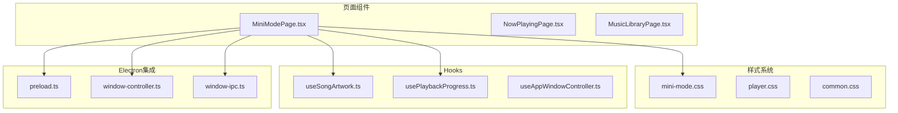

**图表来源**
- [MiniModePage.tsx:1-510](file://src/pages/MiniModePage.tsx#L1-L510)
- [mini-mode.css:1-528](file://src/styles/mini-mode.css#L1-L528)

**章节来源**
- [MiniModePage.tsx:1-50](file://src/pages/MiniModePage.tsx#L1-L50)
- [mini-mode.css:1-50](file://src/styles/mini-mode.css#L1-L50)

## 核心组件

### 组件接口定义

MiniModePage组件通过严格的TypeScript接口定义了所有必需的属性和回调函数：

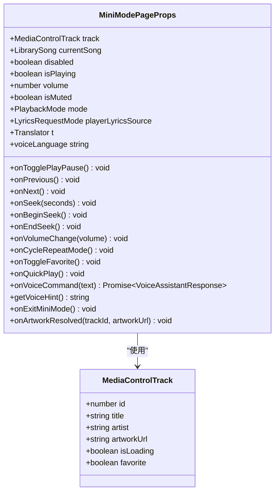

**图表来源**
- [MiniModePage.tsx:15-40](file://src/pages/MiniModePage.tsx#L15-L40)
- [MediaControl.tsx:29-36](file://src/components/MediaControl.tsx#L29-L36)

### 状态管理系统

组件内部维护了多个关键状态变量，用于管理用户交互和界面显示：

| 状态名称 | 类型 | 描述 | 默认值 |
|---------|------|------|--------|
| isProgressSeeking | boolean | 播放进度拖拽状态 | false |
| draftProgressSeconds | number | 进度拖拽过程中的临时值 | 0 |
| failedArtworkUrl | string | 艺术画加载失败的URL | "" |
| volumeOpen | boolean | 音量面板展开状态 | false |
| controlsVisible | boolean | 控制面板可见状态 | false |
| voiceAssistantOpen | boolean | 语音助手面板状态 | false |
| voiceAssistantAvailable | boolean | 语音助手可用性 | false |
| volumeTooltipActive | boolean | 音量提示框激活状态 | false |

**章节来源**
- [MiniModePage.tsx:68-76](file://src/pages/MiniModePage.tsx#L68-L76)
- [MiniModePage.tsx:77-82](file://src/pages/MiniModePage.tsx#L77-L82)

## 架构概览

迷你模式页面采用了分层架构设计，将UI逻辑、状态管理和数据流分离：

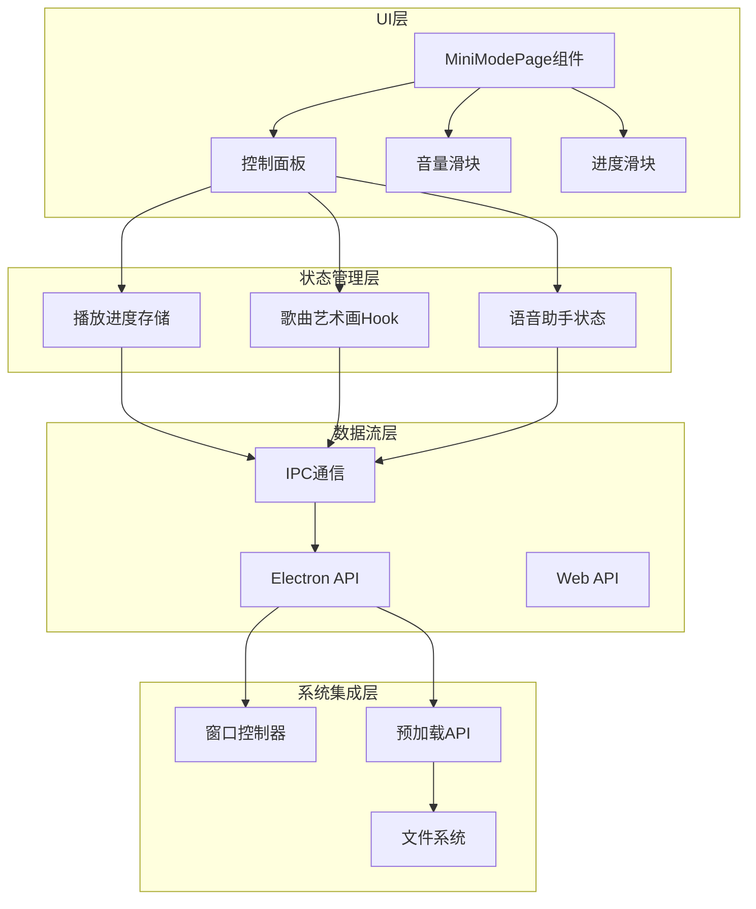

**图表来源**
- [MiniModePage.tsx:42-67](file://src/pages/MiniModePage.tsx#L42-L67)
- [playbackProgressStore.ts:15-32](file://src/state/playbackProgressStore.ts#L15-L32)
- [useSongArtwork.ts:164-203](file://src/hooks/useSongArtwork.ts#L164-L203)

## 详细组件分析

### 设计理念与布局

迷你模式的设计遵循"少即是多"的原则，通过精心设计的布局和视觉层次来传达信息：

#### 响应式设计策略

组件实现了多层次的响应式设计，适应不同屏幕尺寸和设备类型：

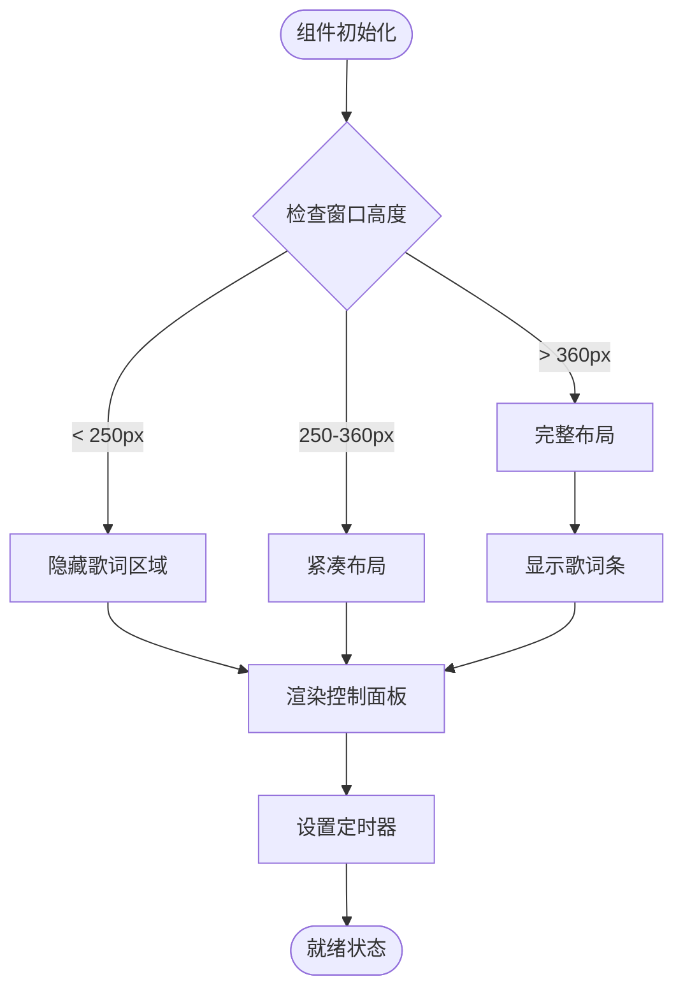

**图表来源**
- [mini-mode.css:513-527](file://src/styles/mini-mode.css#L513-L527)

#### 视觉层次结构

组件采用了多层视觉效果来建立清晰的视觉层次：

1. **背景艺术画层**：使用CSS变量动态设置背景图像
2. **遮罩层**：半透明黑色遮罩增强文字可读性
3. **内容层**：控制面板和交互元素
4. **标题栏层**：可拖拽的标题栏区域

**章节来源**
- [MiniModePage.tsx:271-278](file://src/pages/MiniModePage.tsx#L271-L278)
- [mini-mode.css:21-35](file://src/styles/mini-mode.css#L21-L35)

### 交互逻辑实现

#### 鼠标悬停显示机制

组件实现了智能的鼠标悬停检测和控制面板显示逻辑：

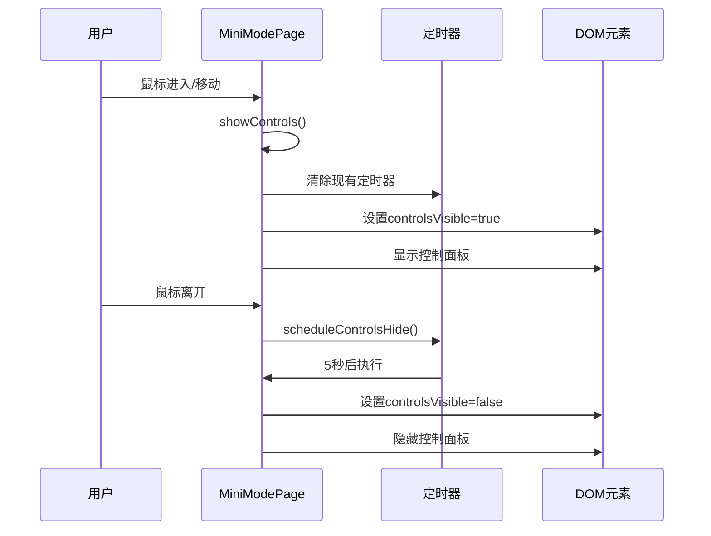

**图表来源**
- [MiniModePage.tsx:149-168](file://src/pages/MiniModePage.tsx#L149-L168)

#### 自动隐藏机制

组件使用定时器实现智能的自动隐藏功能：

| 功能 | 触发条件 | 延迟时间 | 行为 |
|------|----------|----------|------|
| 控制面板隐藏 | 鼠标离开 | 5秒 | 隐藏控制面板和音量面板 |
| 音量提示隐藏 | 鼠标离开 | 900ms | 隐藏音量提示框 |
| 音量提示保持 | 鼠标悬停 | 持续 | 保持音量提示框显示 |

**章节来源**
- [MiniModePage.tsx:161-196](file://src/pages/MiniModePage.tsx#L161-L196)

### 基本播放控制功能

#### 播放/暂停控制

播放/暂停按钮实现了双向状态切换和加载状态指示：

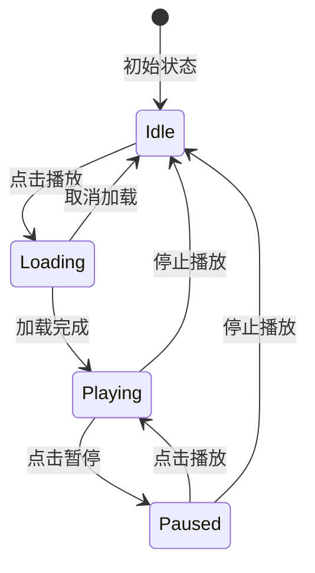

**图表来源**
- [MiniModePage.tsx:313-322](file://src/pages/MiniModePage.tsx#L313-L322)

#### 上一首/下一首控制

上一首和下一首按钮提供了简单的导航功能，支持禁用状态以防止误操作。

#### 音量调节滑块

音量滑块实现了复杂的交互逻辑，包括：

- **拖拽捕获**：使用pointer事件确保拖拽的连续性
- **实时更新**：拖拽过程中实时更新音量值
- **提示框显示**：拖拽时显示音量数值提示
- **外部点击关闭**：点击滑块外部自动关闭面板

**章节来源**
- [MiniModePage.tsx:414-466](file://src/pages/MiniModePage.tsx#L414-L466)

### 播放进度拖拽功能

播放进度拖拽是迷你模式的核心交互功能之一：

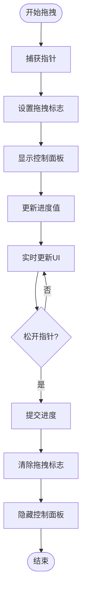

**图表来源**
- [MiniModePage.tsx:125-142](file://src/pages/MiniModePage.tsx#L125-L142)

**章节来源**
- [MiniModePage.tsx:469-494](file://src/pages/MiniModePage.tsx#L469-L494)

### 与主播放界面的切换机制

迷你模式与主播放界面之间的切换通过Electron的窗口控制系统实现：

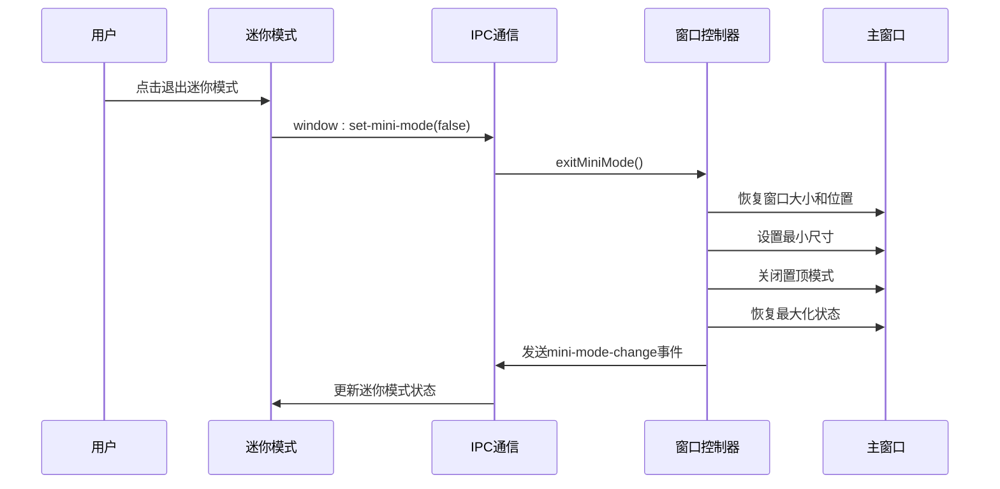

**图表来源**
- [window-ipc.ts:46-54](file://electron/ipc/window-ipc.ts#L46-L54)
- [window-controller.ts:98-116](file://electron/window-controller.ts#L98-L116)

**章节来源**
- [useAppWindowController.ts:20-33](file://src/hooks/useAppWindowController.ts#L20-L33)

### IPC通信实现

迷你模式通过预加载脚本提供的API与主进程进行通信：

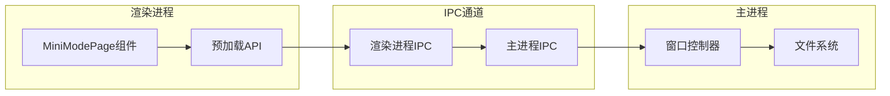

**图表来源**
- [preload.ts:75-76](file://electron/preload.ts#L75-L76)
- [window-ipc.ts:16-58](file://electron/ipc/window-ipc.ts#L16-L58)

**章节来源**
- [preload.ts:45-287](file://electron/preload.ts#L45-L287)

## 依赖关系分析

### 组件依赖图

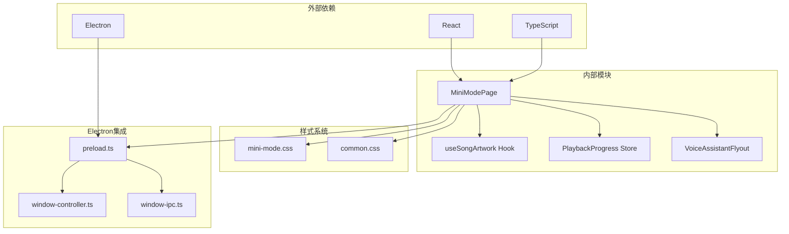

**图表来源**
- [MiniModePage.tsx:1-13](file://src/pages/MiniModePage.tsx#L1-L13)
- [useSongArtwork.ts:1-1](file://src/hooks/useSongArtwork.ts#L1-L1)
- [playbackProgressStore.ts:1-1](file://src/state/playbackProgressStore.ts#L1-L1)

### 数据流依赖

迷你模式的数据流遵循单向数据流原则：

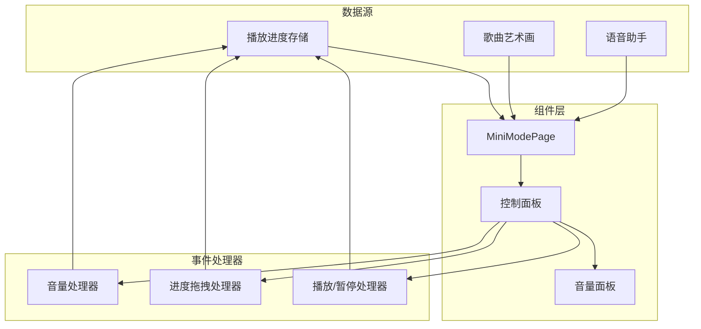

**图表来源**
- [playbackProgressStore.ts:45-51](file://src/state/playbackProgressStore.ts#L45-L51)
- [useSongArtwork.ts:164-203](file://src/hooks/useSongArtwork.ts#L164-L203)

**章节来源**
- [MiniModePage.tsx:83-88](file://src/pages/MiniModePage.tsx#L83-L88)

## 性能考虑

### 内存管理

迷你模式组件实现了完善的内存管理策略：

1. **定时器清理**：在组件卸载时自动清理所有定时器
2. **事件监听器清理**：移除所有添加的事件监听器
3. **引用清理**：使用ref对象避免内存泄漏

### 渲染优化

组件采用了多种渲染优化技术：

1. **状态最小化**：只维护必要的状态变量
2. **计算缓存**：使用useMemo缓存计算结果
3. **条件渲染**：根据状态动态渲染组件
4. **CSS变量**：使用CSS变量减少重排重绘

### 网络请求优化

艺术画加载实现了智能的缓存和批处理机制：

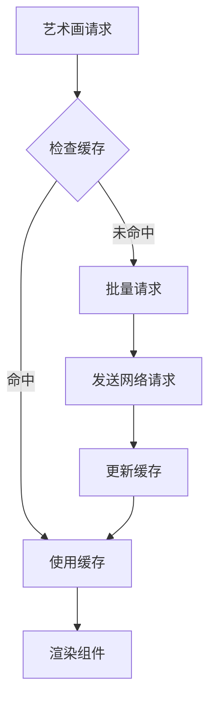

**图表来源**
- [useSongArtwork.ts:36-83](file://src/hooks/useSongArtwork.ts#L36-L83)

**章节来源**
- [useSongArtwork.ts:169-187](file://src/hooks/useSongArtwork.ts#L169-L187)

## 故障排除指南

### 常见问题诊断

#### 控制面板不显示

**可能原因**：
1. 鼠标悬停事件未正确触发
2. controlsVisible状态未正确更新
3. CSS类名拼写错误

**解决方案**：
1. 检查onPointerEnter和onPointerMove事件绑定
2. 验证showControls函数的调用
3. 确认CSS类名"is-controls-visible"的正确性

#### 音量滑块无响应

**可能原因**：
1. pointer事件处理异常
2. 音量值范围超出限制
3. 外部点击事件未正确处理

**解决方案**：
1. 检查pointer事件的捕获和释放
2. 验证音量值的边界检查逻辑
3. 确认document事件监听器的正确移除

#### 艺术画加载失败

**可能原因**：
1. 网络请求超时
2. 图像格式不支持
3. 缓存机制异常

**解决方案**：
1. 实现重试机制和错误处理
2. 检查图像URL的有效性
3. 清理缓存并重新加载

**章节来源**
- [MiniModePage.tsx:296-299](file://src/pages/MiniModePage.tsx#L296-L299)
- [useSongArtwork.ts:54-83](file://src/hooks/useSongArtwork.ts#L54-L83)

### 调试工具和技巧

1. **浏览器开发者工具**：监控DOM变化和事件触发
2. **React DevTools**：检查组件状态和属性
3. **Electron DevTools**：调试IPC通信和窗口状态
4. **网络面板**：监控艺术画加载和API调用

## 结论

SMPlayer的迷你模式页面是一个精心设计的紧凑型播放界面，成功地在有限的空间内实现了完整的播放控制功能。通过智能的交互机制、优雅的视觉设计和高效的性能优化，该组件为用户提供了流畅且直观的音乐播放体验。

主要成就包括：
- **设计理念先进**：符合现代UI设计原则，注重用户体验
- **交互逻辑完善**：实现了复杂的鼠标悬停和自动隐藏机制
- **性能优化到位**：通过多种技术手段确保组件的高效运行
- **可扩展性强**：模块化的架构设计便于功能扩展和维护

该组件为SMPlayer的整体用户体验做出了重要贡献，展现了高质量的前端开发实践。