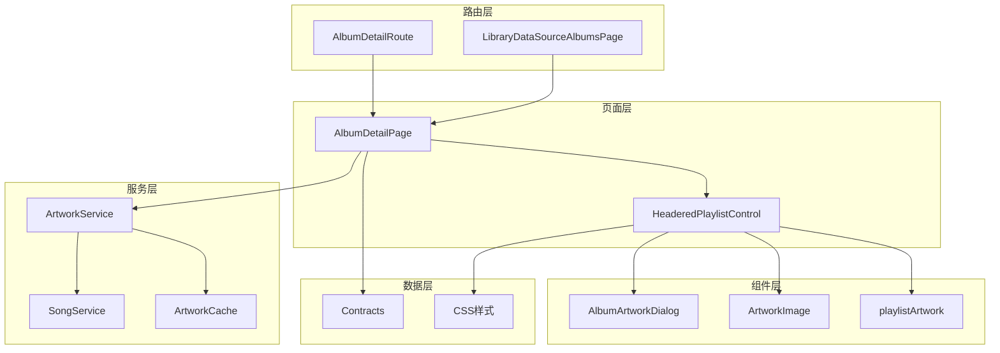
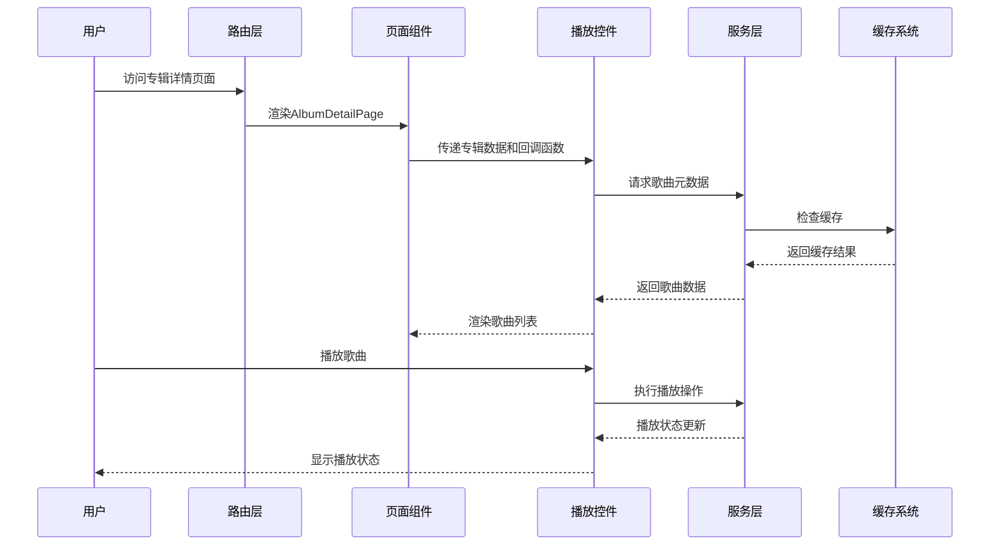
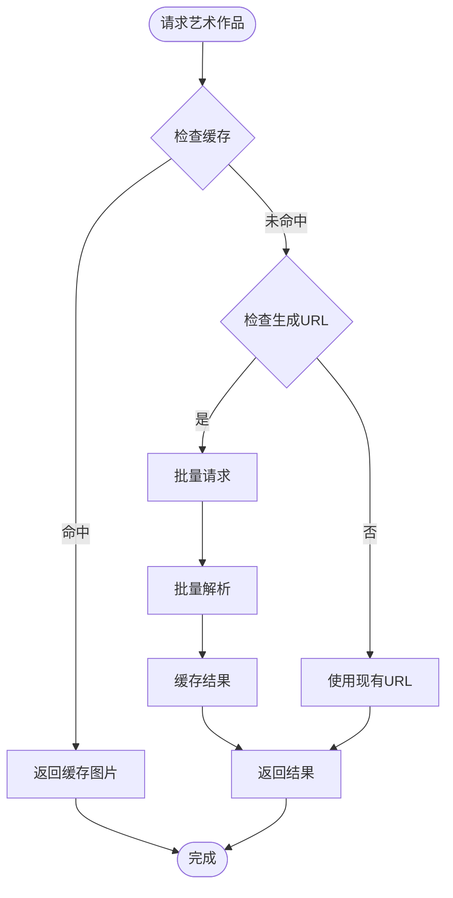
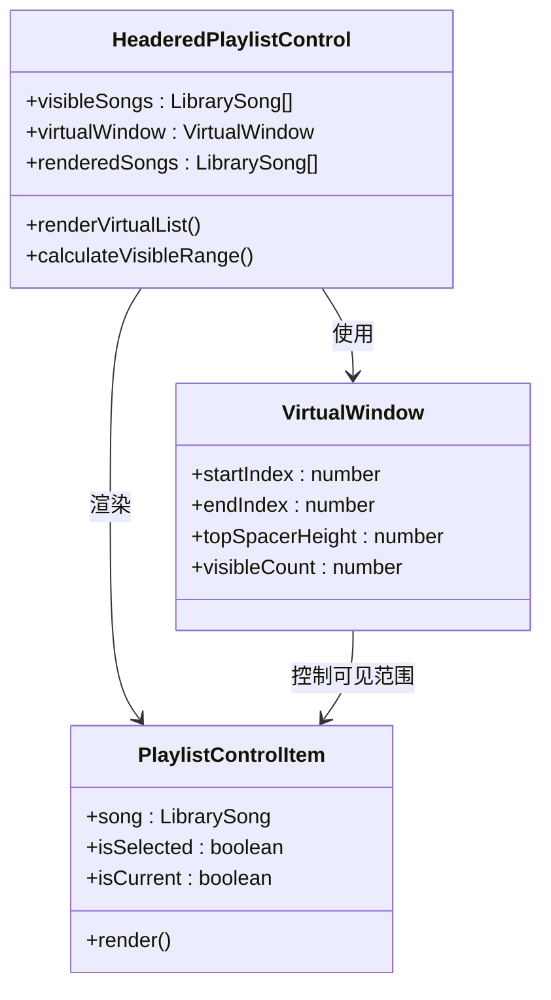
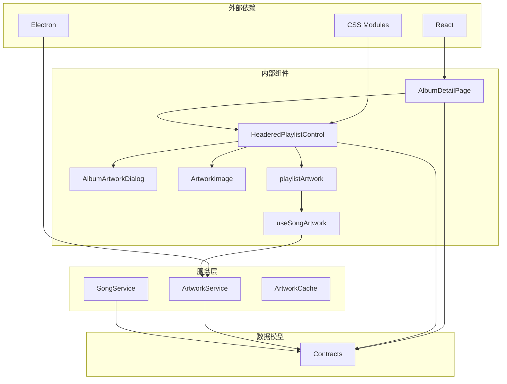
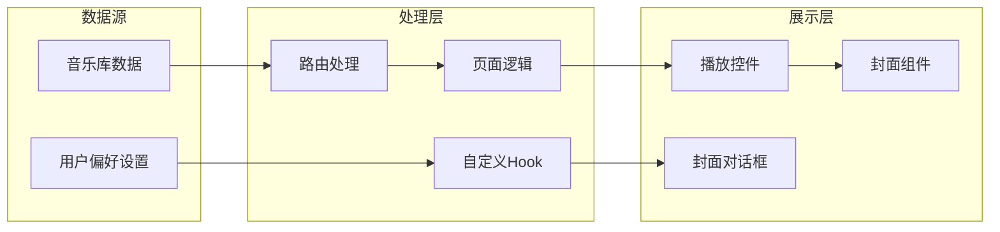
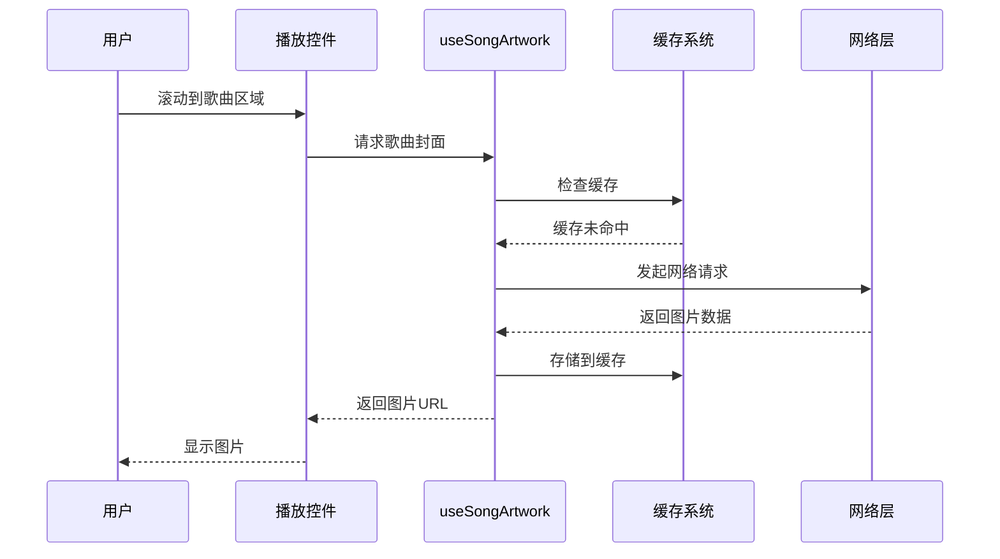

# 专辑详情页面

<cite>
**本文档引用的文件**
- [AlbumDetailPage.tsx](file://src/pages/AlbumDetailPage.tsx)
- [HeaderedPlaylistControl.tsx](file://src/components/HeaderedPlaylistControl.tsx)
- [AlbumArtworkDialog.tsx](file://src/components/AlbumArtworkDialog.tsx)
- [ArtworkImage.tsx](file://src/components/ArtworkImage.tsx)
- [playlistArtwork.ts](file://src/components/playlistArtwork.ts)
- [useSongArtwork.ts](file://src/hooks/useSongArtwork.ts)
- [artwork-service.ts](file://electron/services/artwork-service.ts)
- [artwork-cache.ts](file://electron/services/artwork-cache.ts)
- [song-service.ts](file://electron/services/song-service.ts)
- [contracts.ts](file://src/shared/contracts.ts)
- [albums.css](file://src/styles/albums.css)
- [responsive.css](file://src/styles/responsive.css)
- [AppRouteComponents.tsx](file://src/AppRouteComponents.tsx)
- [LibraryDataSourceAlbumsPage.tsx](file://src/pages/LibraryDataSourceAlbumsPage.tsx)
</cite>

## 目录
1. [简介](#简介)
2. [项目结构](#项目结构)
3. [核心组件](#核心组件)
4. [架构概览](#架构概览)
5. [详细组件分析](#详细组件分析)
6. [依赖关系分析](#依赖关系分析)
7. [性能考虑](#性能考虑)
8. [故障排除指南](#故障排除指南)
9. [结论](#结论)

## 简介

专辑详情页面是SMPlayer音乐库中的核心功能模块，负责展示特定专辑的所有歌曲信息和提供完整的音乐播放体验。该页面实现了现代化的沉浸式设计，支持专辑封面的动态展示、歌曲列表的交互式管理，以及完整的音乐播放控制功能。

本页面采用React组件架构，结合Electron的原生能力，提供了高性能的音乐体验。页面支持多种数据源（本地音乐库、远程音乐库），并具备完善的错误处理和用户体验优化。

## 项目结构

专辑详情页面的实现采用了清晰的分层架构：

**图表来源**
- [AlbumDetailPage.tsx:1-110](file://src/pages/AlbumDetailPage.tsx#L1-L110)
- [HeaderedPlaylistControl.tsx:1-800](file://src/components/HeaderedPlaylistControl.tsx#L1-L800)
- [AppRouteComponents.tsx:13-105](file://src/AppRouteComponents.tsx#L13-L105)

**章节来源**
- [AlbumDetailPage.tsx:1-110](file://src/pages/AlbumDetailPage.tsx#L1-L110)
- [HeaderedPlaylistControl.tsx:155-193](file://src/components/HeaderedPlaylistControl.tsx#L155-L193)
- [AppRouteComponents.tsx:13-105](file://src/AppRouteComponents.tsx#L13-L105)

## 核心组件

### AlbumDetailPage 主组件

AlbumDetailPage是专辑详情页面的核心容器组件，负责协调所有子组件的工作。该组件接收专辑名称、歌曲数据、播放状态等参数，并向下传递给子组件。

主要特性：
- **专辑封面选择**：自动从有封面的歌曲中选择专辑封面
- **对话框管理**：控制专辑封面编辑对话框的显示和隐藏
- **事件处理**：统一处理播放、收藏、添加到播放列表等用户操作

### HeaderedPlaylistControl 核心播放控件

HeaderedPlaylistControl是整个页面的核心组件，实现了以下功能：

**布局特性**：
- 沉浸式头部设计，支持专辑封面的全屏展示
- 虚拟滚动列表，支持大量歌曲的高效渲染
- 响应式设计，适配不同屏幕尺寸

**交互功能**：
- 歌曲播放控制（播放/暂停、下一首）
- 多选操作和批量管理
- 排序和偏好设置
- 收藏和播放列表管理

**章节来源**
- [AlbumDetailPage.tsx:32-110](file://src/pages/AlbumDetailPage.tsx#L32-L110)
- [HeaderedPlaylistControl.tsx:155-800](file://src/components/HeaderedPlaylistControl.tsx#L155-L800)

## 架构概览

专辑详情页面采用了分层架构设计，确保了代码的可维护性和扩展性：

**图表来源**
- [AlbumDetailPage.tsx:55-108](file://src/pages/AlbumDetailPage.tsx#L55-L108)
- [HeaderedPlaylistControl.tsx:754-800](file://src/components/HeaderedPlaylistControl.tsx#L754-L800)
- [useSongArtwork.ts:91-155](file://src/hooks/useSongArtwork.ts#L91-L155)

## 详细组件分析

### 数据获取和缓存策略

#### 艺术作品缓存系统

艺术作品缓存系统实现了多层次的缓存策略，确保高效的图片加载：

**图表来源**
- [useSongArtwork.ts:36-83](file://src/hooks/useSongArtwork.ts#L36-L83)
- [artwork-service.ts:36-77](file://electron/services/artwork-service.ts#L36-L77)

#### 艺术作品解析流程

艺术作品解析采用多源回退策略：

1. **缓存检查**：优先检查本地缓存
2. **嵌入式封面**：从音乐文件中提取封面
3. **系统缩略图**：使用操作系统生成缩略图
4. **网络获取**：最后尝试从网络获取

**章节来源**
- [useSongArtwork.ts:91-204](file://src/hooks/useSongArtwork.ts#L91-L204)
- [artwork-service.ts:259-310](file://electron/services/artwork-service.ts#L259-L310)

### 专辑封面交互设计

#### 封面展示组件

专辑封面采用ArtworkImage组件进行展示，具备以下特性：

**错误处理**：
- 自动检测图片加载失败
- 提供默认封面占位符
- 支持用户自定义错误回调

**性能优化**：
- 懒加载策略
- 内存友好的图片处理
- 缓存机制避免重复加载

**章节来源**
- [ArtworkImage.tsx:13-33](file://src/components/ArtworkImage.tsx#L13-L33)
- [playlistArtwork.ts:43-72](file://src/components/playlistArtwork.ts#L43-L72)

### 歌曲列表组织方式

#### 虚拟滚动实现

HeaderedPlaylistControl实现了高效的虚拟滚动机制：

**图表来源**
- [HeaderedPlaylistControl.tsx:250-251](file://src/components/HeaderedPlaylistControl.tsx#L250-L251)
- [HeaderedPlaylistControl.tsx:754-800](file://src/components/HeaderedPlaylistControl.tsx#L754-L800)

#### 歌曲排序规则

系统支持多种排序方式：
- **默认排序**：基于专辑中的自然顺序
- **标题排序**：按歌曲标题字母顺序
- **艺术家排序**：按艺术家名称排序
- **时长排序**：按歌曲时长排序
- **播放次数排序**：按播放频率排序

**章节来源**
- [HeaderedPlaylistControl.tsx:433-447](file://src/components/HeaderedPlaylistControl.tsx#L433-L447)
- [contracts.ts:23-34](file://src/shared/contracts.ts#L23-L34)

### 交互功能实现

#### 播放控制功能

播放控制功能通过HeaderedPlaylistControl实现：

**单曲播放**：
- 点击歌曲触发播放
- 支持立即播放和队列播放
- 实时显示播放状态

**播放列表管理**：
- 添加到播放列表
- 添加到队列
- 播放下一首

**章节来源**
- [HeaderedPlaylistControl.tsx:773-783](file://src/components/HeaderedPlaylistControl.tsx#L773-L783)
- [HeaderedPlaylistControl.tsx:784-791](file://src/components/HeaderedPlaylistControl.tsx#L784-L791)

#### 专辑封面编辑功能

AlbumArtworkDialog提供了完整的封面编辑功能：

**封面选择**：
- 从音乐文件中提取封面
- 从本地文件系统选择
- 从音乐库中选择

**编辑操作**：
- 预览和应用新封面
- 删除现有封面
- 重置为原始封面

**章节来源**
- [AlbumArtworkDialog.tsx:19-181](file://src/components/AlbumArtworkDialog.tsx#L19-L181)
- [artwork-service.ts:94-128](file://electron/services/artwork-service.ts#L94-L128)

## 依赖关系分析

### 组件依赖图

**图表来源**
- [AlbumDetailPage.tsx:3-29](file://src/pages/AlbumDetailPage.tsx#L3-L29)
- [HeaderedPlaylistControl.tsx:1-24](file://src/components/HeaderedPlaylistControl.tsx#L1-L24)
- [useSongArtwork.ts:1-10](file://src/hooks/useSongArtwork.ts#L1-L10)

### 数据流分析

专辑详情页面的数据流遵循单向数据流原则：

**图表来源**
- [AppRouteComponents.tsx:52-105](file://src/AppRouteComponents.tsx#L52-L105)
- [LibraryDataSourceAlbumsPage.tsx:92-130](file://src/pages/LibraryDataSourceAlbumsPage.tsx#L92-L130)

**章节来源**
- [contracts.ts:36-91](file://src/shared/contracts.ts#L36-L91)
- [albums.css:1-703](file://src/styles/albums.css#L1-L703)

## 性能考虑

### 懒加载策略

系统实现了多层次的懒加载优化：

**图片懒加载**：
- 使用Intersection Observer API
- 只在可视区域内加载图片
- 支持图片加载失败的降级处理

**组件懒加载**：
- 大型组件按需加载
- 减少初始包体积
- 提升首屏加载速度

**数据懒加载**：
- 分页加载大量歌曲
- 虚拟滚动减少DOM节点
- 智能缓存避免重复请求

### 图片预加载机制

**图表来源**
- [useSongArtwork.ts:54-83](file://src/hooks/useSongArtwork.ts#L54-L83)
- [playlistArtwork.ts:47-68](file://src/components/playlistArtwork.ts#L47-L68)

### 内存使用优化

**内存管理策略**：
- 使用WeakMap存储临时数据
- 及时清理事件监听器
- 合理使用React.memo避免不必要的重渲染

**垃圾回收优化**：
- 及时释放大对象引用
- 避免内存泄漏
- 监控内存使用情况

**章节来源**
- [useSongArtwork.ts:1-204](file://src/hooks/useSongArtwork.ts#L1-L204)
- [HeaderedPlaylistControl.tsx:194-312](file://src/components/HeaderedPlaylistControl.tsx#L194-L312)

## 故障排除指南

### 常见问题诊断

**封面加载失败**：
1. 检查网络连接状态
2. 验证音乐文件是否包含嵌入式封面
3. 确认缓存目录权限
4. 查看Electron日志获取详细错误信息

**播放功能异常**：
1. 确认音频格式兼容性
2. 检查音频编解码器状态
3. 验证文件路径有效性
4. 排查权限问题

**性能问题排查**：
1. 监控内存使用情况
2. 检查虚拟滚动配置
3. 分析网络请求频率
4. 评估图片缓存效果

### 调试工具使用

**开发工具**：
- React DevTools用于组件状态检查
- Electron DevTools用于主进程调试
- 网络面板监控图片加载
- 性能面板分析渲染性能

**日志记录**：
- 关键操作添加详细日志
- 错误捕获和上报机制
- 性能指标收集和分析

**章节来源**
- [artwork-service.ts:259-310](file://electron/services/artwork-service.ts#L259-L310)
- [useSongArtwork.ts:91-155](file://src/hooks/useSongArtwork.ts#L91-L155)

## 结论

专辑详情页面展现了现代音乐应用的最佳实践，通过精心设计的架构和优化策略，提供了流畅的用户体验。该页面成功地平衡了功能完整性与性能优化，在保证丰富功能的同时，确保了良好的响应速度和资源使用效率。

主要优势包括：
- **模块化设计**：清晰的组件分离和职责划分
- **性能优化**：多层次的缓存和懒加载策略
- **用户体验**：沉浸式的界面设计和流畅的交互
- **可扩展性**：灵活的架构支持未来功能扩展

通过持续的性能监控和用户体验优化，该页面为SMPlayer的整体质量奠定了坚实基础。