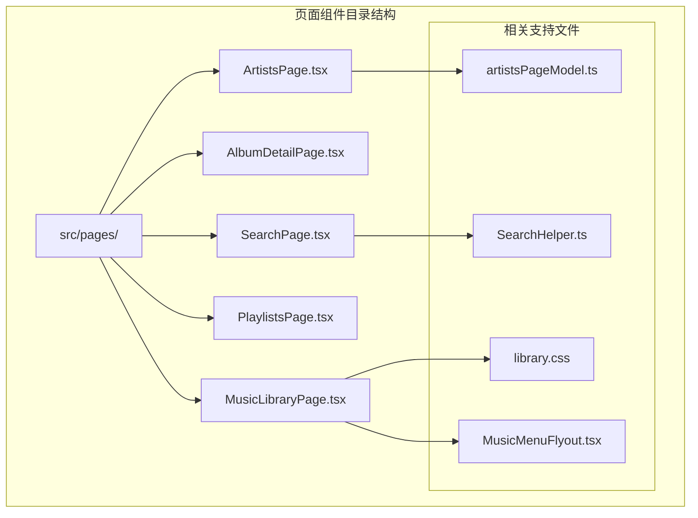
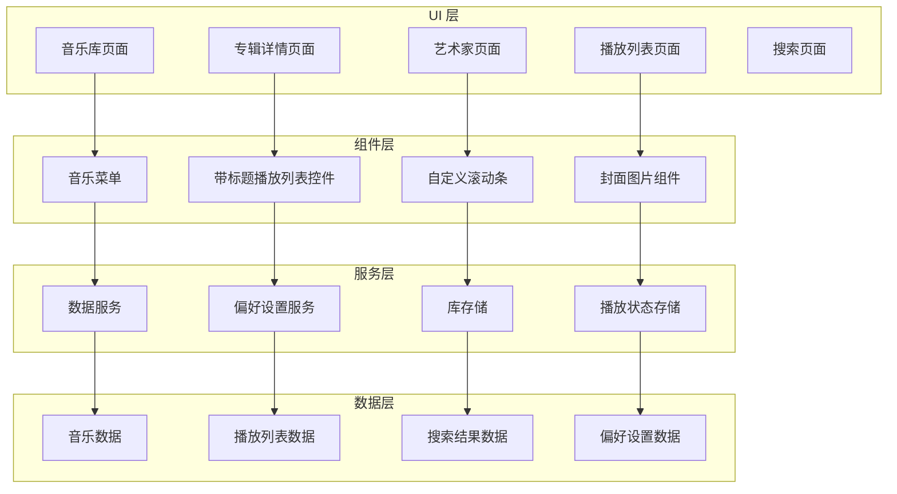
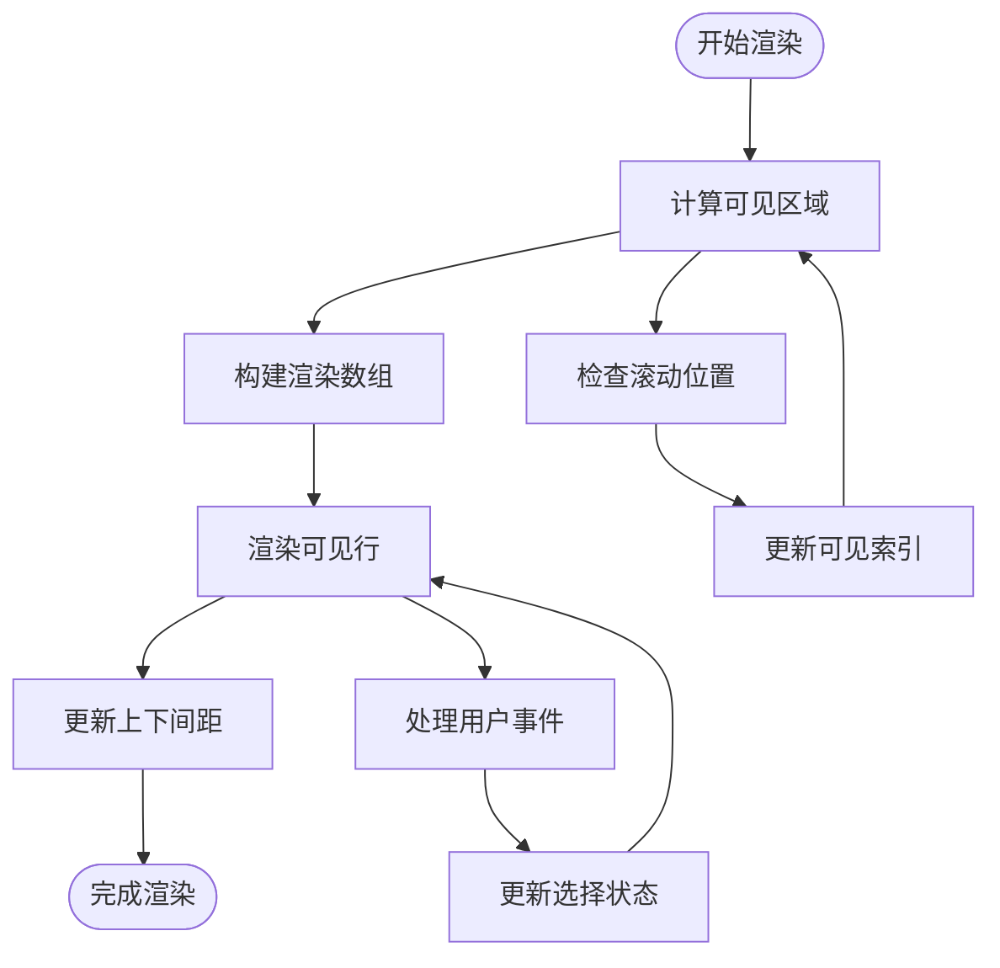
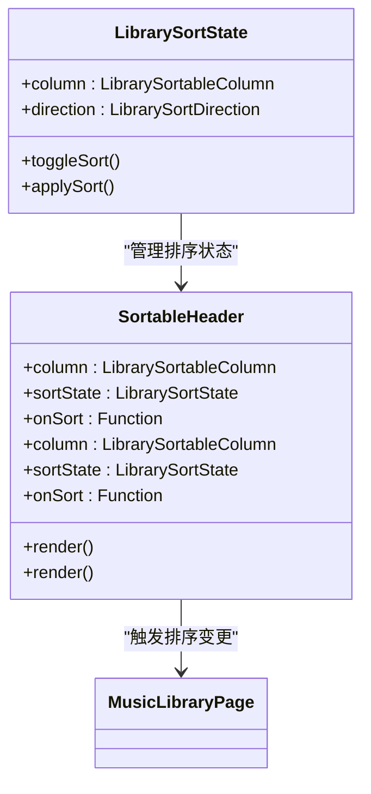
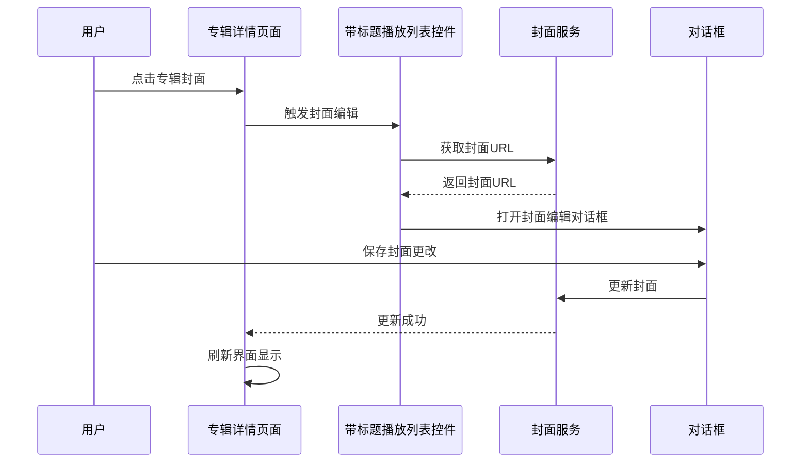
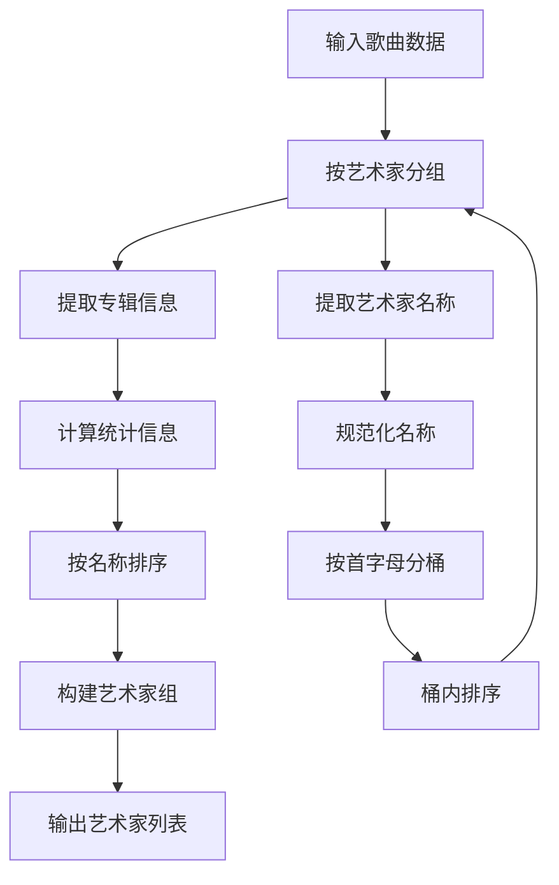
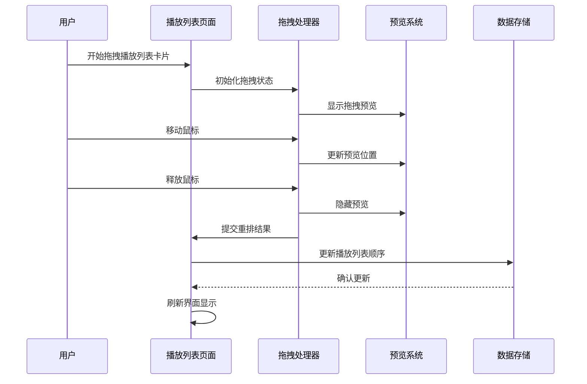
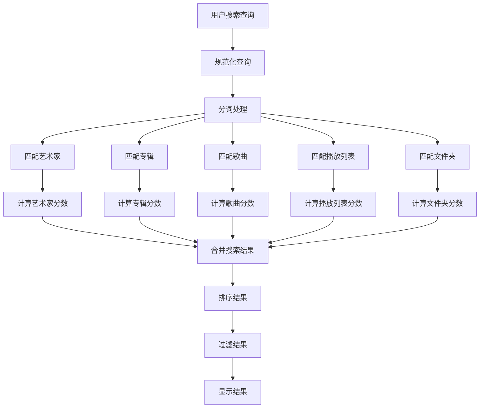
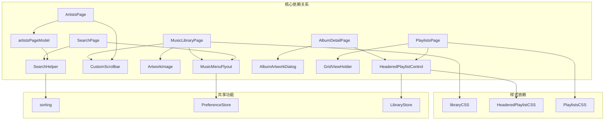

# 主要页面组件

<cite>
**本文档引用的文件**
- [MusicLibraryPage.tsx](file://src/pages/MusicLibraryPage.tsx)
- [AlbumDetailPage.tsx](file://src/pages/AlbumDetailPage.tsx)
- [ArtistsPage.tsx](file://src/pages/ArtistsPage.tsx)
- [PlaylistsPage.tsx](file://src/pages/PlaylistsPage.tsx)
- [SearchPage.tsx](file://src/pages/SearchPage.tsx)
- [artistsPageModel.ts](file://src/pages/artistsPageModel.ts)
- [SearchHelper.ts](file://src/shared/SearchHelper.ts)
- [library.css](file://src/styles/library.css)
- [MusicMenuFlyout.tsx](file://src/components/MusicMenuFlyout.tsx)
- [HeaderedPlaylistControl.tsx](file://src/components/HeaderedPlaylistControl.tsx)
- [searchPageModel.ts](file://src/pages/searchPageModel.ts)
- [sorting.ts](file://src/shared/sorting.ts)
</cite>

## 目录
1. [简介](#简介)
2. [项目结构](#项目结构)
3. [核心组件](#核心组件)
4. [架构概览](#架构概览)
5. [详细组件分析](#详细组件分析)
6. [依赖关系分析](#依赖关系分析)
7. [性能考虑](#性能考虑)
8. [故障排除指南](#故障排除指南)
9. [结论](#结论)

## 简介

SMPlayer 是一个基于 Electron 和 React 的音乐播放器应用，提供了完整的音乐库管理功能。本文档深入分析了主要页面组件的设计和实现，包括音乐库页面、专辑详情页面、艺术家页面、播放列表页面和搜索页面。

这些页面组件采用了现代化的前端架构，实现了高性能的虚拟滚动、智能的快速跳转功能、灵活的多列排序和动态列宽调整等核心功能。每个页面都经过精心设计，确保在处理大量音乐数据时仍能保持流畅的用户体验。

## 项目结构

SMPlayer 的页面组件主要位于 `src/pages/` 目录下，采用按功能模块化的组织方式：

**图表来源**
- [MusicLibraryPage.tsx:1-1001](file://src/pages/MusicLibraryPage.tsx#L1-L1001)
- [ArtistsPage.tsx:1-1201](file://src/pages/ArtistsPage.tsx#L1-L1201)
- [SearchPage.tsx:1-901](file://src/pages/SearchPage.tsx#L1-L901)

**章节来源**
- [MusicLibraryPage.tsx:1-1001](file://src/pages/MusicLibraryPage.tsx#L1-L1001)
- [ArtistsPage.tsx:1-1201](file://src/pages/ArtistsPage.tsx#L1-L1201)
- [PlaylistsPage.tsx:1-566](file://src/pages/PlaylistsPage.tsx#L1-L566)
- [SearchPage.tsx:1-901](file://src/pages/SearchPage.tsx#L1-L901)

## 核心组件

### 音乐库页面 (MusicLibraryPage)

音乐库页面是 SMPlayer 的核心界面，提供了完整的音乐浏览和管理功能。该页面实现了以下关键特性：

- **虚拟滚动表格**：支持数万首歌曲的高效渲染
- **快速跳转功能**：通过字母索引快速定位到特定分组
- **多列排序**：支持标题、艺术家、专辑、时长、播放次数、添加日期等字段排序
- **列宽调整**：用户可自定义列宽以适应不同需求
- **响应式设计**：自动适配桌面和移动设备布局

### 专辑详情页面 (AlbumDetailPage)

专辑详情页面专注于展示单个专辑的完整信息：

- **封面艺术展示**：高质量专辑封面显示和编辑功能
- **歌曲列表管理**：完整的歌曲列表，支持播放控制
- **播放列表集成**：与全局播放列表无缝集成
- **偏好设置**：支持专辑级别的偏好设置

### 艺术家页面 (ArtistsPage)

艺术家页面提供了艺术家维度的音乐浏览体验：

- **艺术家信息展示**：包含艺术家统计信息和作品概览
- **专辑组织**：按专辑分组展示艺术家的作品
- **歌曲管理**：支持对艺术家作品的播放和管理
- **搜索功能**：内置艺术家搜索和快速导航

### 播放列表页面 (PlaylistsPage)

播放列表页面管理用户的个性化播放列表：

- **播放列表创建**：支持创建新的播放列表
- **拖拽重排**：直观的拖拽排序功能
- **批量操作**：支持播放列表的批量编辑和管理
- **集成播放**：与播放器深度集成

### 搜索页面 (SearchPage)

搜索页面提供了强大的音乐搜索和发现功能：

- **多维度搜索**：支持艺术家、专辑、歌曲、播放列表和文件夹搜索
- **智能排序**：根据多种标准对搜索结果进行排序
- **结果过滤**：支持按类型过滤搜索结果
- **搜索历史**：记录和管理用户的搜索历史

**章节来源**
- [MusicLibraryPage.tsx:82-690](file://src/pages/MusicLibraryPage.tsx#L82-L690)
- [AlbumDetailPage.tsx:32-110](file://src/pages/AlbumDetailPage.tsx#L32-L110)
- [ArtistsPage.tsx:82-558](file://src/pages/ArtistsPage.tsx#L82-L558)
- [PlaylistsPage.tsx:71-566](file://src/pages/PlaylistsPage.tsx#L71-L566)
- [SearchPage.tsx:105-725](file://src/pages/SearchPage.tsx#L105-L725)

## 架构概览

SMPlayer 采用了分层架构设计，确保各组件之间的清晰分离和高内聚低耦合：

**图表来源**
- [MusicLibraryPage.tsx:1-1001](file://src/pages/MusicLibraryPage.tsx#L1-L1001)
- [MusicMenuFlyout.tsx:1-247](file://src/components/MusicMenuFlyout.tsx#L1-L247)
- [HeaderedPlaylistControl.tsx:1-800](file://src/components/HeaderedPlaylistControl.tsx#L1-L800)

## 详细组件分析

### 音乐库页面组件分析

音乐库页面实现了复杂的数据管理和用户交互逻辑：

#### 虚拟滚动实现

**图表来源**
- [MusicLibraryPage.tsx:114-142](file://src/pages/MusicLibraryPage.tsx#L114-L142)

#### 快速跳转功能

音乐库页面提供了高效的快速跳转机制：

- **字母索引**：支持 A-Z 和特殊字符的快速导航
- **智能定位**：根据当前排序列确定跳转基准
- **响应式面板**：在移动设备上提供专门的跳转面板
- **键盘支持**：支持键盘快捷键触发跳转

#### 多列排序系统

**图表来源**
- [MusicLibraryPage.tsx:58-61](file://src/pages/MusicLibraryPage.tsx#L58-L61)
- [MusicLibraryPage.tsx:772-800](file://src/pages/MusicLibraryPage.tsx#L772-L800)

**章节来源**
- [MusicLibraryPage.tsx:114-197](file://src/pages/MusicLibraryPage.tsx#L114-L197)
- [MusicLibraryPage.tsx:344-619](file://src/pages/MusicLibraryPage.tsx#L344-L619)

### 专辑详情页面组件分析

专辑详情页面采用了沉浸式设计，提供了丰富的音乐体验：

#### 封面艺术系统

**图表来源**
- [AlbumDetailPage.tsx:95-107](file://src/pages/AlbumDetailPage.tsx#L95-L107)
- [HeaderedPlaylistControl.tsx:155-800](file://src/components/HeaderedPlaylistControl.tsx#L155-L800)

#### 歌曲列表管理

专辑详情页面集成了完整的歌曲列表管理功能：

- **播放控制**：支持整张专辑的播放和暂停
- **随机播放**：提供专辑级别的随机播放功能
- **歌曲操作**：支持添加到播放列表、收藏等操作
- **上下文菜单**：提供丰富的右键菜单选项

**章节来源**
- [AlbumDetailPage.tsx:54-109](file://src/pages/AlbumDetailPage.tsx#L54-L109)
- [HeaderedPlaylistControl.tsx:155-800](file://src/components/HeaderedPlaylistControl.tsx#L155-L800)

### 艺术家页面组件分析

艺术家页面实现了复杂的艺术家数据组织和展示功能：

#### 艺术家分组算法

**图表来源**
- [artistsPageModel.ts:209-248](file://src/pages/artistsPageModel.ts#L209-L248)

#### 专辑组织系统

艺术家页面提供了层次化的专辑组织结构：

- **专辑分组**：按专辑名称对歌曲进行分组
- **时长计算**：自动计算专辑总时长
- **封面提取**：从专辑歌曲中提取代表性封面
- **虚拟窗口**：实现大型专辑列表的高效渲染

**章节来源**
- [ArtistsPage.tsx:141-185](file://src/pages/ArtistsPage.tsx#L141-L185)
- [artistsPageModel.ts:250-272](file://src/pages/artistsPageModel.ts#L250-L272)

### 播放列表页面组件分析

播放列表页面实现了灵活的播放列表管理和编辑功能：

#### 拖拽重排系统

**图表来源**
- [PlaylistsPage.tsx:229-328](file://src/pages/PlaylistsPage.tsx#L229-L328)

#### 播放列表操作

播放列表页面提供了丰富的操作功能：

- **创建播放列表**：支持创建新的播放列表
- **重命名播放列表**：提供便捷的重命名功能
- **删除播放列表**：安全的播放列表删除机制
- **清空播放列表**：一键清空播放列表内容

**章节来源**
- [PlaylistsPage.tsx:324-405](file://src/pages/PlaylistsPage.tsx#L324-L405)
- [PlaylistsPage.tsx:444-566](file://src/pages/PlaylistsPage.tsx#L444-L566)

### 搜索页面组件分析

搜索页面实现了智能的音乐搜索和结果管理功能：

#### 搜索算法系统

**图表来源**
- [SearchHelper.ts:127-189](file://src/shared/SearchHelper.ts#L127-L189)

#### 智能排序机制

搜索页面支持多种排序标准：

- **艺术家排序**：按名称、专辑数量、播放次数、时长排序
- **专辑排序**：按名称、播放次数、时长排序
- **歌曲排序**：按标题、艺术家、专辑、播放次数、时长、添加日期排序
- **播放列表排序**：按名称、播放次数、时长排序
- **文件夹排序**：按名称排序

**章节来源**
- [SearchPage.tsx:165-178](file://src/pages/SearchPage.tsx#L165-L178)
- [SearchHelper.ts:22-81](file://src/shared/SearchHelper.ts#L22-L81)

## 依赖关系分析

SMPlayer 页面组件之间存在清晰的依赖关系，形成了一个有机的整体：

**图表来源**
- [MusicLibraryPage.tsx:1-52](file://src/pages/MusicLibraryPage.tsx#L1-L52)
- [ArtistsPage.tsx:29-46](file://src/pages/ArtistsPage.tsx#L29-L46)
- [SearchPage.tsx:17-46](file://src/pages/SearchPage.tsx#L17-L46)

**章节来源**
- [MusicLibraryPage.tsx:1-52](file://src/pages/MusicLibraryPage.tsx#L1-L52)
- [ArtistsPage.tsx:29-46](file://src/pages/ArtistsPage.tsx#L29-L46)
- [SearchPage.tsx:17-46](file://src/pages/SearchPage.tsx#L17-L46)

## 性能考虑

SMPlayer 在多个层面实现了性能优化，确保在处理大量数据时仍能保持流畅体验：

### 虚拟滚动优化

音乐库页面使用了高效的虚拟滚动技术：

- **可视区域计算**：只渲染可见范围内的行，减少DOM节点数量
- **动态高度调整**：支持紧凑和宽格式布局的动态切换
- **滚动性能优化**：使用 requestAnimationFrame 优化滚动性能
- **内存管理**：及时清理不可见的DOM元素

### 搜索性能优化

搜索页面实现了智能的搜索优化：

- **增量搜索**：实时搜索结果更新，避免全量重新计算
- **结果缓存**：缓存搜索结果以提高重复查询性能
- **智能过滤**：根据搜索类型智能过滤候选结果
- **防抖处理**：避免频繁的搜索请求

### 内存管理策略

页面组件采用了有效的内存管理策略：

- **组件卸载清理**：正确清理事件监听器和定时器
- **状态最小化**：只保存必要的状态数据
- **引用优化**：使用 useMemo 和 useCallback 优化重渲染
- **垃圾回收**：及时释放不再使用的对象引用

## 故障排除指南

### 常见问题诊断

#### 音乐库页面问题

**问题**：音乐库页面加载缓慢
- 检查网络连接和磁盘访问速度
- 确认数据库索引是否正常
- 验证虚拟滚动配置是否正确

**问题**：快速跳转功能失效
- 检查排序列配置
- 验证快速跳转映射表
- 确认键盘事件绑定

#### 搜索页面问题

**问题**：搜索结果不准确
- 检查搜索算法配置
- 验证文本规范化处理
- 确认评分算法参数

**问题**：搜索性能问题
- 检查搜索索引建立
- 验证查询优化器
- 确认缓存策略

#### 艺术家页面问题

**问题**：艺术家分组错误
- 检查艺术家名称解析
- 验证分组算法
- 确认排序规则

**问题**：专辑显示异常
- 检查专辑封面提取
- 验证时长计算
- 确认虚拟窗口参数

**章节来源**
- [MusicLibraryPage.tsx:282-314](file://src/pages/MusicLibraryPage.tsx#L282-L314)
- [SearchPage.tsx:356-368](file://src/pages/SearchPage.tsx#L356-L368)
- [ArtistsPage.tsx:517-557](file://src/pages/ArtistsPage.tsx#L517-L557)

## 结论

SMPlayer 的主要页面组件展现了现代前端应用的最佳实践，通过精心设计的架构和实现，提供了优秀的用户体验。各个页面组件不仅功能完善，而且在性能和可维护性方面都有出色的表现。

关键优势包括：

- **高性能架构**：虚拟滚动、智能缓存和优化渲染策略
- **用户体验优先**：直观的界面设计和流畅的交互体验
- **可扩展性**：模块化的组件设计便于功能扩展
- **代码质量**：清晰的代码结构和完善的错误处理

这些页面组件为 SMPlayer 提供了坚实的基础，使其能够处理大规模音乐数据集，同时保持出色的性能表现。通过持续的优化和改进，SMPlayer 有望成为音乐播放器领域的优秀解决方案。