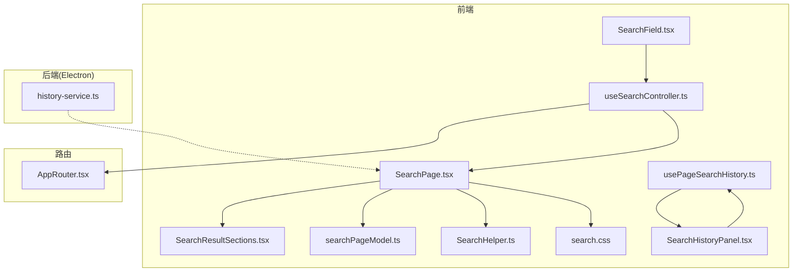
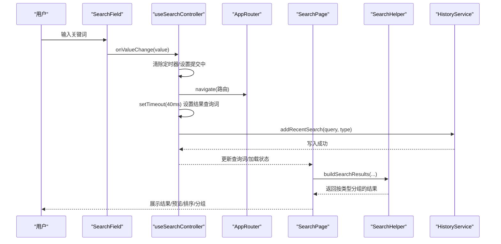
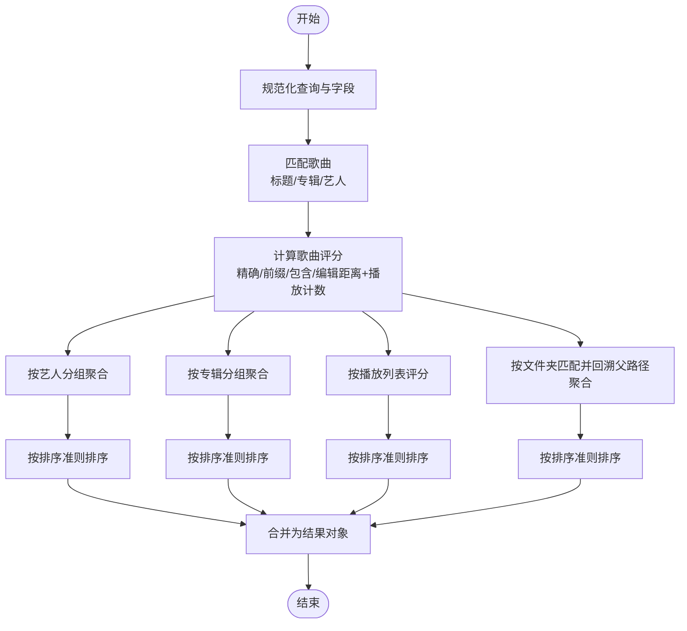
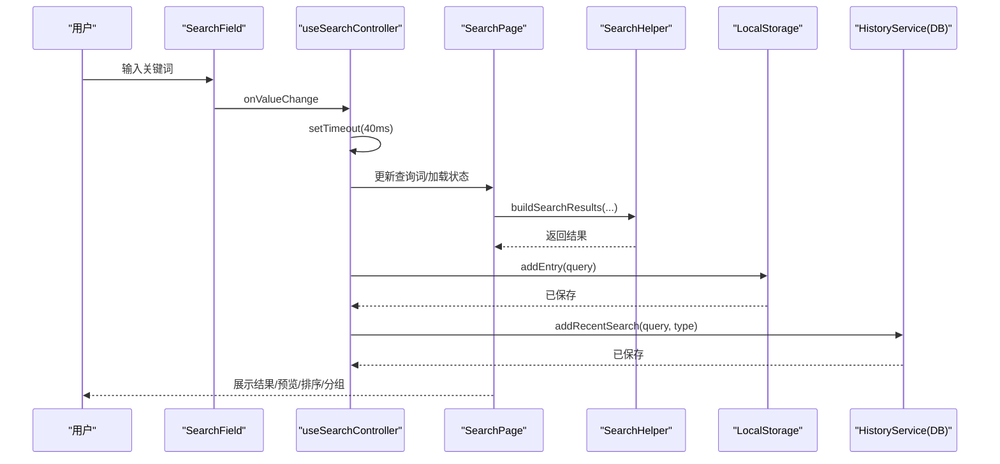
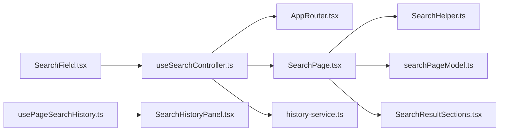

# 搜索页面

<cite>
**本文引用的文件列表**
- [SearchPage.tsx](file://src/pages/SearchPage.tsx)
- [searchPageModel.ts](file://src/pages/searchPageModel.ts)
- [SearchHelper.ts](file://src/shared/SearchHelper.ts)
- [useSearchController.ts](file://src/hooks/useSearchController.ts)
- [SearchField.tsx](file://src/components/SearchField.tsx)
- [SearchResultSections.tsx](file://src/pages/SearchResultSections.tsx)
- [usePageSearchHistory.ts](file://src/hooks/usePageSearchHistory.ts)
- [SearchHistoryPanel.tsx](file://src/components/SearchHistoryPanel.tsx)
- [history-service.ts](file://electron/services/history-service.ts)
- [contracts.ts](file://src/shared/contracts.ts)
- [search.css](file://src/styles/search.css)
- [AppRouter.tsx](file://src/AppRouter.tsx)
</cite>

## 目录
1. [简介](#简介)
2. [项目结构](#项目结构)
3. [核心组件](#核心组件)
4. [架构总览](#架构总览)
5. [详细组件分析](#详细组件分析)
6. [依赖关系分析](#依赖关系分析)
7. [性能考量](#性能考量)
8. [故障排查指南](#故障排查指南)
9. [结论](#结论)
10. [附录](#附录)

## 简介
本文件系统化梳理 SMPlayer 的搜索页面实现，围绕以下目标展开：
- 搜索算法：全文索引机制、模糊匹配、相关性评分与排序
- 界面交互：搜索框实时反馈、搜索历史管理、搜索建议（概念）
- 结果组织：按类型分组展示、高亮与快速跳转
- 性能优化：搜索延迟控制、结果预览与展开、内存使用
- 扩展点：自定义搜索规则、搜索范围选择、结果过滤

## 项目结构
搜索页面由前端 React 组件与共享逻辑、状态钩子、样式以及后端历史服务共同组成。关键模块如下：
- 页面与模型：SearchPage、searchPageModel
- 搜索算法与工具：SearchHelper
- 控制器与路由：useSearchController、AppRouter
- 搜索输入与历史：SearchField、usePageSearchHistory、SearchHistoryPanel
- 历史持久化：history-service（Electron 后端）
- 样式：search.css
- 类型契约：contracts.ts

图表来源
- [SearchPage.tsx:1-901](file://src/pages/SearchPage.tsx#L1-L901)
- [SearchResultSections.tsx:1-648](file://src/pages/SearchResultSections.tsx#L1-L648)
- [SearchField.tsx:1-84](file://src/components/SearchField.tsx#L1-L84)
- [useSearchController.ts:1-91](file://src/hooks/useSearchController.ts#L1-L91)
- [usePageSearchHistory.ts:1-53](file://src/hooks/usePageSearchHistory.ts#L1-L53)
- [SearchHistoryPanel.tsx:1-82](file://src/components/SearchHistoryPanel.tsx#L1-L82)
- [searchPageModel.ts:1-62](file://src/pages/searchPageModel.ts#L1-L62)
- [SearchHelper.ts:1-486](file://src/shared/SearchHelper.ts#L1-L486)
- [history-service.ts:1-316](file://electron/services/history-service.ts#L1-L316)
- [AppRouter.tsx:1-82](file://src/AppRouter.tsx#L1-L82)

章节来源
- [SearchPage.tsx:1-901](file://src/pages/SearchPage.tsx#L1-L901)
- [SearchHelper.ts:1-486](file://src/shared/SearchHelper.ts#L1-L486)
- [useSearchController.ts:1-91](file://src/hooks/useSearchController.ts#L1-L91)
- [AppRouter.tsx:1-82](file://src/AppRouter.tsx#L1-L82)

## 核心组件
- 搜索页面容器：负责构建搜索结果、排序、分组、多选、上下文菜单、专辑封面预览等
- 搜索结果分组：艺术家、专辑、歌曲、播放列表、文件夹卡片网格
- 搜索控制器：统一处理输入变更、提交、延迟、路由跳转与历史记录
- 搜索字段：带清空、提交按钮、可选下拉
- 搜索历史：本地存储与面板展示
- 搜索算法：字符串匹配、编辑距离、评分与排序
- 样式：响应式布局、悬停与选中态、动画

章节来源
- [SearchPage.tsx:105-725](file://src/pages/SearchPage.tsx#L105-L725)
- [SearchResultSections.tsx:19-632](file://src/pages/SearchResultSections.tsx#L19-L632)
- [useSearchController.ts:24-90](file://src/hooks/useSearchController.ts#L24-L90)
- [SearchField.tsx:22-83](file://src/components/SearchField.tsx#L22-L83)
- [usePageSearchHistory.ts:14-52](file://src/hooks/usePageSearchHistory.ts#L14-L52)
- [SearchHelper.ts:127-486](file://src/shared/SearchHelper.ts#L127-L486)
- [search.css:1-603](file://src/styles/search.css#L1-L603)

## 架构总览
搜索页面采用“控制器-视图-算法-历史”的分层架构：
- 控制器层：useSearchController 负责输入、延迟、导航与历史写入
- 视图层：SearchPage 负责渲染与交互；SearchResultSections 负责各类型卡片
- 算法层：SearchHelper 提供评分、匹配、排序与结果聚合
- 历史层：history-service（后端）与 usePageSearchHistory（前端）协同维护搜索历史

图表来源
- [useSearchController.ts:24-90](file://src/hooks/useSearchController.ts#L24-L90)
- [AppRouter.tsx:25-82](file://src/AppRouter.tsx#L25-L82)
- [SearchPage.tsx:155-178](file://src/pages/SearchPage.tsx#L155-L178)
- [SearchHelper.ts:127-189](file://src/shared/SearchHelper.ts#L127-L189)
- [history-service.ts:260-289](file://electron/services/history-service.ts#L260-L289)

## 详细组件分析

### 搜索算法与相关性排序
- 全文索引与匹配
  - 歌曲：标题、专辑、艺人名参与匹配，基于字符串评分与编辑距离
  - 艺人：按艺人名匹配并聚合歌曲
  - 专辑：按专辑名或艺人名匹配并聚合歌曲
  - 播放列表：名称评分，若包含命中歌曲则提升分数
  - 文件夹：按文件夹名或路径匹配，并向上回溯父级路径聚合歌曲
- 字符串评分与模糊匹配
  - 精确相等、大小写不敏感相等、前缀匹配、包含匹配、反向包含
  - 编辑距离（Levenshtein）计算相似度，阈值内加分
- 排序策略
  - 艺人：默认/名称/专辑数/播放次数/时长
  - 专辑：默认/名称/播放次数/时长
  - 歌曲：默认/标题/艺人/专辑/播放次数/时长/添加时间
  - 播放列表：默认/名称/播放次数/时长
  - 文件夹：默认/名称

图表来源
- [SearchHelper.ts:127-486](file://src/shared/SearchHelper.ts#L127-L486)

章节来源
- [SearchHelper.ts:127-486](file://src/shared/SearchHelper.ts#L127-L486)

### 搜索界面交互设计
- 搜索框
  - 实时输入变更，提交时触发导航与延迟加载
  - 支持清空、提交按钮、可选下拉
- 搜索历史
  - 前端：localStorage 存储最近 10 条，去重、区分大小写
  - 后端：SQLite 表 SearchHistory，唯一索引 (Query COLLATE NOCASE, Type)，支持清理
- 搜索建议
  - 当前未在 UI 中实现，但可通过扩展在输入时调用 SearchHelper 的评分函数生成候选
- 结果展示
  - 分类标签页：全部/艺术家/专辑/歌曲/播放列表/文件夹
  - 预览模式：每类仅展示固定数量，支持“展开/收起”
  - 多选：支持歌曲与卡片多选，批量操作（播放、添加到歌单）

图表来源
- [useSearchController.ts:24-90](file://src/hooks/useSearchController.ts#L24-L90)
- [SearchField.tsx:22-83](file://src/components/SearchField.tsx#L22-L83)
- [SearchPage.tsx:155-178](file://src/pages/SearchPage.tsx#L155-L178)
- [usePageSearchHistory.ts:14-52](file://src/hooks/usePageSearchHistory.ts#L14-L52)
- [history-service.ts:260-289](file://electron/services/history-service.ts#L260-L289)

章节来源
- [SearchField.tsx:22-83](file://src/components/SearchField.tsx#L22-L83)
- [useSearchController.ts:24-90](file://src/hooks/useSearchController.ts#L24-L90)
- [usePageSearchHistory.ts:14-52](file://src/hooks/usePageSearchHistory.ts#L14-L52)
- [history-service.ts:260-289](file://electron/services/history-service.ts#L260-L289)

### 搜索结果组织与高亮
- 按类型分组：艺术家、专辑、歌曲、播放列表、文件夹
- 卡片信息：标题、副标题、封面、路径、歌曲数、播放次数、时长、歌曲 ID 列表
- 高亮与快速跳转：卡片点击进入详情页；艺术家卡片支持随机播放；歌曲列表支持播放、下一首、收藏、添加到歌单
- 预览与展开：每类默认只展示部分条目，支持“查看全部/收起”

章节来源
- [SearchResultSections.tsx:73-632](file://src/pages/SearchResultSections.tsx#L73-L632)
- [SearchPage.tsx:407-567](file://src/pages/SearchPage.tsx#L407-L567)

### 搜索性能优化策略
- 搜索延迟控制：输入后 40ms 后才更新结果，避免频繁重算
- 结果预览：每类默认只渲染固定数量，减少 DOM 与渲染压力
- 内存优化：使用 useMemo 缓存可复用数据（如可搜索集合、结果、排序），避免重复计算
- 路由与懒加载：通过 hash 路由切换页面，减少全量刷新

章节来源
- [useSearchController.ts:58-62](file://src/hooks/useSearchController.ts#L58-L62)
- [SearchPage.tsx:157-178](file://src/pages/SearchPage.tsx#L157-L178)
- [AppRouter.tsx:25-82](file://src/AppRouter.tsx#L25-L82)

### 搜索功能扩展点
- 自定义搜索规则：可在 SearchHelper 中调整评分权重与阈值
- 搜索范围选择：通过 URL 参数限定搜索范围（如文件夹范围）
- 结果过滤选项：可增加“仅显示有封面”、“仅显示已收藏”等筛选条件
- 搜索建议：在输入时调用评分函数生成候选，结合本地历史与热门词

章节来源
- [SearchHelper.ts:377-429](file://src/shared/SearchHelper.ts#L377-L429)
- [SearchPage.tsx:157-164](file://src/pages/SearchPage.tsx#L157-L164)

## 依赖关系分析
- SearchPage 依赖 SearchHelper 进行结果构建与排序，依赖 searchPageModel 进行卡片键与专辑标签生成
- useSearchController 依赖 AppRouter 进行导航，依赖 history-service 写入搜索历史
- SearchField 作为输入控件被 useSearchController 管理
- usePageSearchHistory 与 SearchHistoryPanel 提供前端历史展示

图表来源
- [useSearchController.ts:24-90](file://src/hooks/useSearchController.ts#L24-L90)
- [SearchPage.tsx:105-725](file://src/pages/SearchPage.tsx#L105-L725)
- [SearchHelper.ts:127-486](file://src/shared/SearchHelper.ts#L127-L486)
- [searchPageModel.ts:1-62](file://src/pages/searchPageModel.ts#L1-L62)
- [SearchResultSections.tsx:1-648](file://src/pages/SearchResultSections.tsx#L1-L648)
- [history-service.ts:1-316](file://electron/services/history-service.ts#L1-L316)
- [usePageSearchHistory.ts:1-53](file://src/hooks/usePageSearchHistory.ts#L1-L53)
- [SearchHistoryPanel.tsx:1-82](file://src/components/SearchHistoryPanel.tsx#L1-L82)
- [SearchField.tsx:1-84](file://src/components/SearchField.tsx#L1-L84)

章节来源
- [SearchPage.tsx:105-725](file://src/pages/SearchPage.tsx#L105-L725)
- [SearchHelper.ts:127-486](file://src/shared/SearchHelper.ts#L127-L486)
- [useSearchController.ts:24-90](file://src/hooks/useSearchController.ts#L24-L90)

## 性能考量
- 搜索延迟：40ms 定时器避免高频重算
- 预览模式：每类默认只渲染固定数量卡片，展开后再完整渲染
- 计算缓存：useMemo 缓存可复用数据，减少重复构建
- 路由切换：hash 路由减少全量刷新
- 样式优化：CSS 动画与阴影在 hover 时启用，避免在大量元素上同时应用

章节来源
- [useSearchController.ts:58-62](file://src/hooks/useSearchController.ts#L58-L62)
- [SearchPage.tsx:157-178](file://src/pages/SearchPage.tsx#L157-L178)
- [search.css:67-94](file://src/styles/search.css#L67-L94)

## 故障排查指南
- 搜索无结果
  - 检查查询是否为空或仅空白字符
  - 确认搜索范围（文件夹范围）是否正确
  - 查看历史是否被清理或数据库是否异常
- 搜索缓慢
  - 检查是否存在过多输入导致频繁重算
  - 确认是否处于预览模式，展开后渲染量增大
- 历史异常
  - 前端：检查 localStorage 是否被清理或容量限制
  - 后端：确认 SearchHistory 表结构与索引是否正常

章节来源
- [useSearchController.ts:42-64](file://src/hooks/useSearchController.ts#L42-L64)
- [usePageSearchHistory.ts:14-52](file://src/hooks/usePageSearchHistory.ts#L14-L52)
- [history-service.ts:290-299](file://electron/services/history-service.ts#L290-L299)

## 结论
SMPlayer 的搜索页面以清晰的分层架构实现了从输入到结果的完整链路：控制器负责延迟与导航，算法负责评分与排序，视图负责分组与交互，历史服务负责持久化。通过预览模式、缓存与延迟控制，页面在大数据量场景下仍保持良好体验。未来可在搜索建议、范围选择与过滤方面进一步扩展。

## 附录
- 关键类型与常量
  - 搜索排序准则：default/name/title/artist/album/play-count/duration/date-added
  - 搜索历史类型：sidebar/artists/albums/songs/playlists/folders
  - 搜索结果类型：artists/albums/songs/playlists/folders

章节来源
- [contracts.ts:26-35](file://src/shared/contracts.ts#L26-L35)
- [contracts.ts:181-188](file://src/shared/contracts.ts#L181-L188)