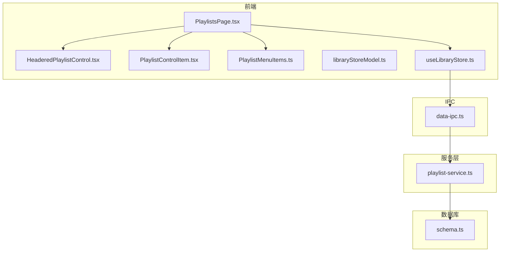
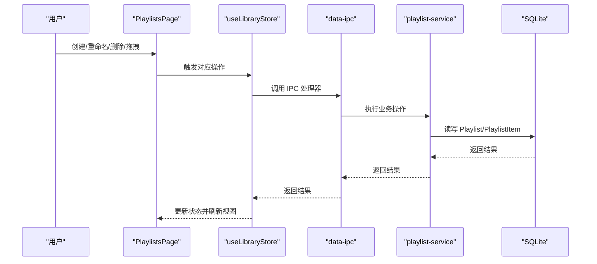
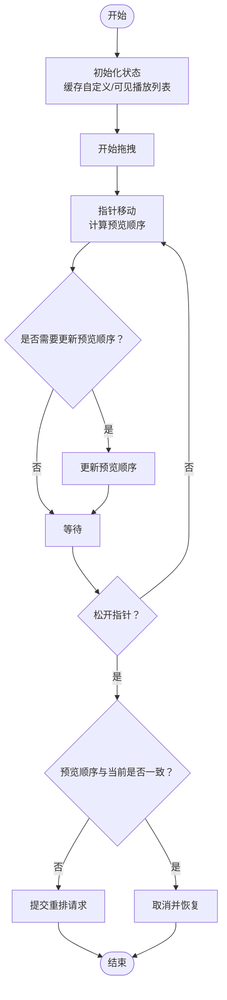
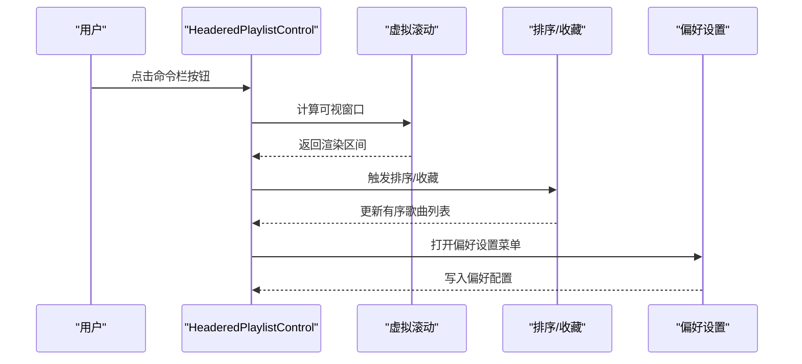
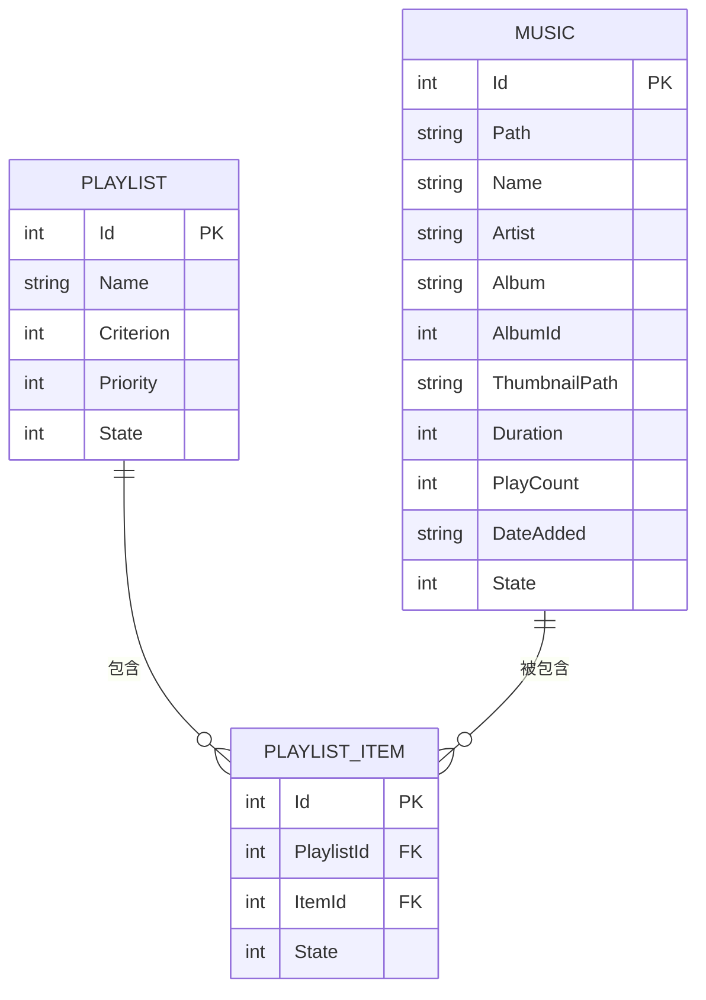
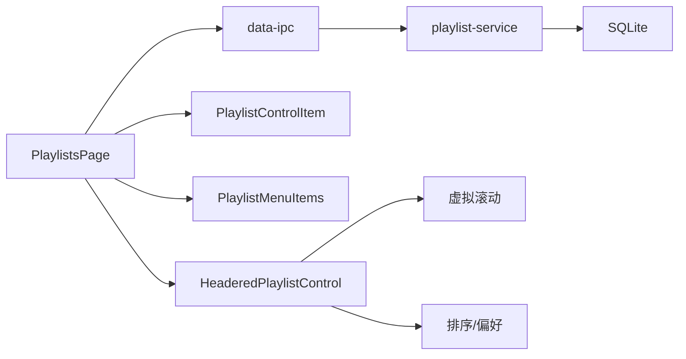

# 播放列表页面

<cite>
**本文档引用的文件**
- [PlaylistsPage.tsx](file://src/pages/PlaylistsPage.tsx)
- [playlist-service.ts](file://electron/services/playlist-service.ts)
- [HeaderedPlaylistControl.tsx](file://src/components/HeaderedPlaylistControl.tsx)
- [headeredPlaylistModel.ts](file://src/components/headeredPlaylistModel.ts)
- [playlistNames.ts](file://src/shared/playlistNames.ts)
- [PlaylistMenuItems.ts](file://src/components/PlaylistMenuItems.ts)
- [PlaylistControlItem.tsx](file://src/components/PlaylistControlItem.tsx)
- [contracts.ts](file://src/shared/contracts.ts)
- [schema.ts](file://electron/services/schema.ts)
- [libraryStoreModel.ts](file://src/state/libraryStoreModel.ts)
- [data-ipc.ts](file://electron/ipc/data-ipc.ts)
- [playlists.css](file://src/styles/playlists.css)
</cite>

## 目录
1. [简介](#简介)
2. [项目结构](#项目结构)
3. [核心组件](#核心组件)
4. [架构总览](#架构总览)
5. [详细组件分析](#详细组件分析)
6. [依赖分析](#依赖分析)
7. [性能考虑](#性能考虑)
8. [故障排除指南](#故障排除指南)
9. [结论](#结论)
10. [附录](#附录)

## 简介
本文件系统性阐述 SMPlayer 的播放列表页面（PlaylistsPage）实现架构，覆盖播放列表的创建与管理、内容展示、编辑功能、数据模型、交互流程、持久化存储、导入导出机制以及性能优化策略。目标是帮助开发者与使用者全面理解播放列表子系统的设计与实现。

## 项目结构
播放列表页面由前端页面组件、UI 控件、状态管理、服务层与数据库层协同完成。关键模块如下：
- 页面层：PlaylistsPage 负责渲染播放列表网格、处理拖拽排序、上下文菜单与创建/重命名/删除等交互。
- UI 控件层：HeaderedPlaylistControl 提供播放列表详情页的沉浸式展示与歌曲列表；PlaylistControlItem 提供单曲目项的交互；PlaylistMenuItems 提供卡片右键菜单。
- 数据模型层：contracts.ts 定义 LibraryPlaylist、LibrarySong 等核心类型；headeredPlaylistModel.ts 提供排序、名称校验等工具。
- 状态管理层：libraryStoreModel.ts 提供播放列表增删改后的快照更新逻辑；useLibraryStore.ts 通过 IPC 调用后端服务。
- 服务层：playlist-service.ts 封装 SQLite 访问，提供播放列表 CRUD、排序、歌曲增删等操作。
- IPC 层：data-ipc.ts 注册前端可调用的 IPC 处理器，桥接前端与服务层。
- 数据库层：schema.ts 定义 Playlist、PlaylistItem 表结构及索引，确保高效查询与一致性。
- 样式层：playlists.css 提供网格布局、拖拽样式与夜间主题支持。

图表来源
- [PlaylistsPage.tsx:1-566](file://src/pages/PlaylistsPage.tsx#L1-L566)
- [HeaderedPlaylistControl.tsx:1-800](file://src/components/HeaderedPlaylistControl.tsx#L1-L800)
- [PlaylistControlItem.tsx:1-457](file://src/components/PlaylistControlItem.tsx#L1-L457)
- [PlaylistMenuItems.ts:1-48](file://src/components/PlaylistMenuItems.ts#L1-L48)
- [libraryStoreModel.ts:1-200](file://src/state/libraryStoreModel.ts#L1-L200)
- [playlist-service.ts:1-508](file://electron/services/playlist-service.ts#L1-L508)
- [data-ipc.ts:1-151](file://electron/ipc/data-ipc.ts#L1-L151)
- [schema.ts:133-146](file://electron/services/schema.ts#L133-L146)

章节来源
- [PlaylistsPage.tsx:1-566](file://src/pages/PlaylistsPage.tsx#L1-L566)
- [playlist-service.ts:1-508](file://electron/services/playlist-service.ts#L1-L508)
- [schema.ts:133-146](file://electron/services/schema.ts#L133-L146)

## 核心组件
- PlaylistsPage：负责播放列表网格视图、搜索过滤、拖拽重排、上下文菜单、创建/重命名/删除对话框、路由跳转到播放列表详情页。
- HeaderedPlaylistControl：播放列表详情页的沉浸式封面、信息摘要、命令栏、歌曲列表（含虚拟滚动）、排序、收藏、删除等。
- PlaylistControlItem：单曲目项的播放、收藏、添加到其他播放列表、下一首播放、滑动移除等交互。
- PlaylistMenuItems：播放列表卡片右键菜单（重命名、复制、删除）。
- playlist-service：SQLite 访问封装，提供播放列表 CRUD、歌曲增删、排序、内置播放列表优先级维护等。
- data-ipc：注册 IPC 处理器，将前端操作转发至服务层。
- contracts：定义 LibraryPlaylist、LibrarySong、PlaylistSortCriterion 等核心类型。
- headeredPlaylistModel：排序选项、名称校验、下一次可用名称生成等工具函数。
- playlists.css：网格布局、拖拽样式、占位提示、夜间主题等样式。

章节来源
- [PlaylistsPage.tsx:71-566](file://src/pages/PlaylistsPage.tsx#L71-L566)
- [HeaderedPlaylistControl.tsx:155-800](file://src/components/HeaderedPlaylistControl.tsx#L155-L800)
- [PlaylistControlItem.tsx:54-457](file://src/components/PlaylistControlItem.tsx#L54-L457)
- [PlaylistMenuItems.ts:6-48](file://src/components/PlaylistMenuItems.ts#L6-L48)
- [playlist-service.ts:9-508](file://electron/services/playlist-service.ts#L9-L508)
- [contracts.ts:83-91](file://src/shared/contracts.ts#L83-L91)
- [headeredPlaylistModel.ts:1-143](file://src/components/headeredPlaylistModel.ts#L1-L143)
- [playlists.css:1-480](file://src/styles/playlists.css#L1-L480)

## 架构总览
播放列表页面采用“前端组件 + 状态管理 + IPC + 服务层 + 数据库”的分层架构：
- 前端组件负责用户交互与视图渲染；
- 状态管理负责应用状态更新与错误处理；
- IPC 负责跨进程调用后端服务；
- 服务层封装数据库访问与业务规则；
- 数据库层提供表结构与索引以支撑高效查询。

图表来源
- [PlaylistsPage.tsx:324-341](file://src/pages/PlaylistsPage.tsx#L324-L341)
- [data-ipc.ts:37-64](file://electron/ipc/data-ipc.ts#L37-L64)
- [playlist-service.ts:171-201](file://electron/services/playlist-service.ts#L171-L201)

章节来源
- [data-ipc.ts:20-151](file://electron/ipc/data-ipc.ts#L20-L151)
- [playlist-service.ts:147-201](file://electron/services/playlist-service.ts#L147-L201)

## 详细组件分析

### PlaylistsPage 组件分析
- 视图与状态
  - 使用 useMemo 缓存自定义播放列表、可见播放列表、选中播放列表歌曲映射，减少重复计算。
  - 支持搜索过滤，忽略大小写匹配播放列表名称。
  - 通过路由参数解析当前选中的播放列表 ID。
- 拖拽重排
  - 使用 requestAnimationFrame 驱动拖拽过程，实时计算插入位置并预览排序结果。
  - 拖拽时创建 Portal 渲染拖拽覆盖层，跟随鼠标移动。
  - 拖拽结束时比较预览顺序与当前顺序，若不同则调用 onReorderPlaylists 提交重排。
- 交互功能
  - 右键菜单：重命名、复制为新播放列表、删除。
  - 创建对话框：生成下一个可用名称，提交后自动跳转到新建播放列表详情页。
  - 删除确认：导航回播放列表列表。
- 子组件集成
  - HeaderedPlaylistControl：用于播放列表详情页展示，支持收藏、排序、删除、清空、设置偏好等。
  - PlaylistControlItem：用于网格卡片中的歌曲项交互。

图表来源
- [PlaylistsPage.tsx:229-322](file://src/pages/PlaylistsPage.tsx#L229-L322)
- [PlaylistsPage.tsx:160-228](file://src/pages/PlaylistsPage.tsx#L160-L228)

章节来源
- [PlaylistsPage.tsx:71-566](file://src/pages/PlaylistsPage.tsx#L71-L566)

### HeaderedPlaylistControl 组件分析
- 功能概览
  - 沉浸式封面与颜色提取，根据封面动态设置主题色。
  - 命令栏：随机播放、多选、排序、重命名、清空、删除、设置偏好等。
  - 歌曲列表：虚拟滚动渲染，支持排序、收藏、下一首播放、添加到其他播放列表、查看专辑/艺人等。
  - 多选与撤销：支持批量操作并提供撤销通知。
- 虚拟滚动
  - 使用 useHeaderedPlaylistVirtualWindow 计算可视窗口范围，仅渲染可视区域内的行，提升大列表性能。
  - 根据容器高度与行高动态计算起止索引与上下间距。
- 排序与偏好
  - inferSortCriterion 推断默认排序依据；commitSort/reverseSort 应用排序并回调上层。
  - 偏好设置菜单支持按播放列表/专辑/歌曲等实体类型配置。

图表来源
- [HeaderedPlaylistControl.tsx:1114-1188](file://src/components/HeaderedPlaylistControl.tsx#L1114-L1188)
- [HeaderedPlaylistControl.tsx:433-447](file://src/components/HeaderedPlaylistControl.tsx#L433-L447)
- [headeredPlaylistModel.ts:53-83](file://src/components/headeredPlaylistModel.ts#L53-L83)

章节来源
- [HeaderedPlaylistControl.tsx:155-800](file://src/components/HeaderedPlaylistControl.tsx#L155-L800)
- [headeredPlaylistModel.ts:1-143](file://src/components/headeredPlaylistModel.ts#L1-143)

### PlaylistControlItem 组件分析
- 交互能力
  - 单击：进入播放队列或暂停/播放当前曲目。
  - 多选：在多选模式下切换选择状态。
  - 收藏：切换歌曲收藏状态，支持撤销。
  - 添加到播放列表：弹出菜单选择目标播放列表。
  - 下一首播放：将歌曲插入到当前播放曲目前。
  - 滑动移除：在触摸设备上向左滑动移除歌曲。
- 触摸手势
  - 区分滑动移除与纵向拖拽重排，避免误触。
  - 使用 CSS 变量控制滑动偏移，提供流畅反馈。

章节来源
- [PlaylistControlItem.tsx:54-457](file://src/components/PlaylistControlItem.tsx#L54-L457)

### 数据模型与持久化
- 类型定义
  - LibraryPlaylist：包含 id、name、priority、songCount、songIds、sortCriterion、isBuiltIn 等字段。
  - LibrarySong：包含 id、path、mediaUrl、artworkUrl、title、artist、album、duration、playCount、dateAdded、favorite 等字段。
- 播放列表数据模型
  - 自定义播放列表：isBuiltIn=false，可重命名、删除、排序。
  - 内置播放列表：如“我的最爱”、“正在播放”，受保护不可删除，但可清空。
- 持久化存储
  - 表结构：Playlist、PlaylistItem 两张核心表，PlaylistItem 作为播放列表与歌曲的多对多关联表。
  - 索引：对 Playlist.Name、PlaylistItem.PlaylistId、PlaylistItem.ItemId 建立索引，保证查询效率。
  - 服务层：playlist-service 提供增删改查、排序、清理无效条目等操作。

图表来源
- [schema.ts:133-146](file://electron/services/schema.ts#L133-L146)
- [playlist-service.ts:77-144](file://electron/services/playlist-service.ts#L77-L144)

章节来源
- [contracts.ts:83-91](file://src/shared/contracts.ts#L83-L91)
- [schema.ts:133-146](file://electron/services/schema.ts#L133-L146)
- [playlist-service.ts:147-201](file://electron/services/playlist-service.ts#L147-L201)

### 交互功能与编辑操作
- 创建播放列表
  - 生成下一个可用名称（避免重名），支持传入初始歌曲集合。
  - 创建成功后自动跳转到详情页并选中该播放列表。
- 重命名播放列表
  - 校验名称合法性（非空、长度限制、不与现有名称冲突、不含特殊字符模板）。
  - 内置播放列表不可重命名。
- 删除播放列表
  - 内置播放列表不可删除；删除时标记 Playlist 与 PlaylistItem 为非激活状态。
- 歌曲增删改查
  - addSongsToPlaylist/removeSongsFromPlaylist：批量增删歌曲，内部去重并维护状态。
  - reorderPlaylistSongs：按指定顺序重排歌曲，支持同时更新排序准则。
- 拖拽重排播放列表
  - 计算可视范围内卡片的相对位置，预览排序结果，最终一次性提交。

章节来源
- [playlist-service.ts:171-201](file://electron/services/playlist-service.ts#L171-L201)
- [playlist-service.ts:338-406](file://electron/services/playlist-service.ts#L338-L406)
- [playlist-service.ts:288-332](file://electron/services/playlist-service.ts#L288-L332)
- [playlistNames.ts:4-16](file://src/shared/playlistNames.ts#L4-L16)
- [headeredPlaylistModel.ts:89-107](file://src/components/headeredPlaylistModel.ts#L89-L107)

### 导入导出与数据同步
- 导入导出
  - 设置页提供导入/导出数据入口，调用 IPC 后端接口执行数据迁移。
  - 导入成功后触发页面刷新以应用变更。
- 数据同步
  - 通过 useLibraryStore 的异步方法与 IPC 通信，确保前端状态与后端数据库一致。
  - 错误统一捕获并显示，支持撤销操作（如移除歌曲后可撤销）。

章节来源
- [data-ipc.ts:541-600](file://src/state/useLibraryStore.ts#L541-L600)
- [data-ipc.ts:553-592](file://src/pages/SettingsPage.tsx#L553-L592)

## 依赖分析
- 组件耦合
  - PlaylistsPage 与 HeaderedPlaylistControl 通过 props 传递回调，形成高层控制与低层展示的解耦。
  - PlaylistControlItem 与 HeaderedPlaylistControl 通过统一的回调接口协作，便于扩展与复用。
- 外部依赖
  - Electron IPC：通过 data-ipc.ts 注册处理器，前端通过 window.smplayer.* 调用。
  - SQLite：playlist-service 使用 node:sqlite 进行事务性操作，保证一致性。
  - 样式：playlists.css 提供网格布局与拖拽视觉反馈。

图表来源
- [PlaylistsPage.tsx:71-566](file://src/pages/PlaylistsPage.tsx#L71-L566)
- [HeaderedPlaylistControl.tsx:1114-1188](file://src/components/HeaderedPlaylistControl.tsx#L1114-L1188)
- [data-ipc.ts:37-64](file://electron/ipc/data-ipc.ts#L37-L64)
- [playlist-service.ts:147-201](file://electron/services/playlist-service.ts#L147-L201)

章节来源
- [PlaylistsPage.tsx:71-566](file://src/pages/PlaylistsPage.tsx#L71-L566)
- [HeaderedPlaylistControl.tsx:1114-1188](file://src/components/HeaderedPlaylistControl.tsx#L1114-L1188)
- [data-ipc.ts:20-151](file://electron/ipc/data-ipc.ts#L20-L151)

## 性能考虑
- 虚拟滚动
  - HeaderedPlaylistControl 使用 useHeaderedPlaylistVirtualWindow 计算可视窗口，仅渲染可见行，显著降低 DOM 节点数量与重排成本。
  - 通过 ResizeObserver、Scroll 事件与 requestAnimationFrame 协同，平滑响应滚动与尺寸变化。
- 拖拽重排
  - PlaylistsPage 使用 requestAnimationFrame 驱动拖拽过程，避免频繁重绘；仅在必要时更新预览顺序。
  - 拖拽覆盖层使用 CSS 变量定位，减少布局抖动。
- 数据访问
  - playlist-service 对批量操作使用 BEGIN/COMMIT 事务，减少磁盘写入次数。
  - 查询使用索引列（Playlist.Name、PlaylistItem.PlaylistId、PlaylistItem.ItemId）提升性能。
- 内存控制
  - useMemo 缓存计算结果，避免重复构建数组与映射。
  - 及时释放事件监听器与动画帧，防止内存泄漏。

章节来源
- [HeaderedPlaylistControl.tsx:1114-1188](file://src/components/HeaderedPlaylistControl.tsx#L1114-L1188)
- [PlaylistsPage.tsx:251-322](file://src/pages/PlaylistsPage.tsx#L251-L322)
- [playlist-service.ts:171-201](file://electron/services/playlist-service.ts#L171-L201)

## 故障排除指南
- 创建播放列表失败
  - 检查名称是否为空或已存在；内置播放列表名称不可用作新名称。
  - 查看 IPC 返回的错误信息，确认数据库事务是否回滚。
- 重命名失败
  - 确认目标播放列表非内置；检查名称校验规则（长度、特殊字符、重名）。
- 删除失败
  - 内置播放列表不可删除；确认权限与状态。
- 拖拽重排未生效
  - 检查预览顺序与当前顺序是否发生变化；确认 onReorderPlaylists 回调正确执行。
- 歌曲排序异常
  - 确认排序准则与当前歌曲集合一致；检查 reorderPlaylistSongs 的参数完整性。

章节来源
- [playlist-service.ts:421-435](file://electron/services/playlist-service.ts#L421-L435)
- [headeredPlaylistModel.ts:89-107](file://src/components/headeredPlaylistModel.ts#L89-L107)
- [PlaylistsPage.tsx:218-228](file://src/pages/PlaylistsPage.tsx#L218-L228)

## 结论
SMPlayer 的播放列表页面通过清晰的分层架构与高效的性能策略，实现了从网格浏览到详情展示、从基础 CRUD 到复杂交互（拖拽重排、虚拟滚动、排序与收藏）的完整能力。数据库层的索引与事务设计保障了大规模数据下的稳定性，而前端的虚拟滚动与事件节流进一步提升了用户体验。建议在后续迭代中持续关注大列表场景的内存占用与滚动性能，并完善导入导出的格式规范与错误恢复机制。

## 附录
- 关键路径参考
  - [PlaylistsPage 主要逻辑:71-566](file://src/pages/PlaylistsPage.tsx#L71-L566)
  - [HeaderedPlaylistControl 虚拟滚动实现:1114-1188](file://src/components/HeaderedPlaylistControl.tsx#L1114-L1188)
  - [playlist-service 数据访问层:147-508](file://electron/services/playlist-service.ts#L147-L508)
  - [数据库表结构与索引:133-260](file://electron/services/schema.ts#L133-L260)
  - [IPC 处理器注册:20-151](file://electron/ipc/data-ipc.ts#L20-L151)
  - [播放列表样式:1-480](file://src/styles/playlists.css#L1-L480)