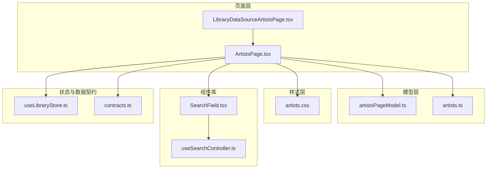
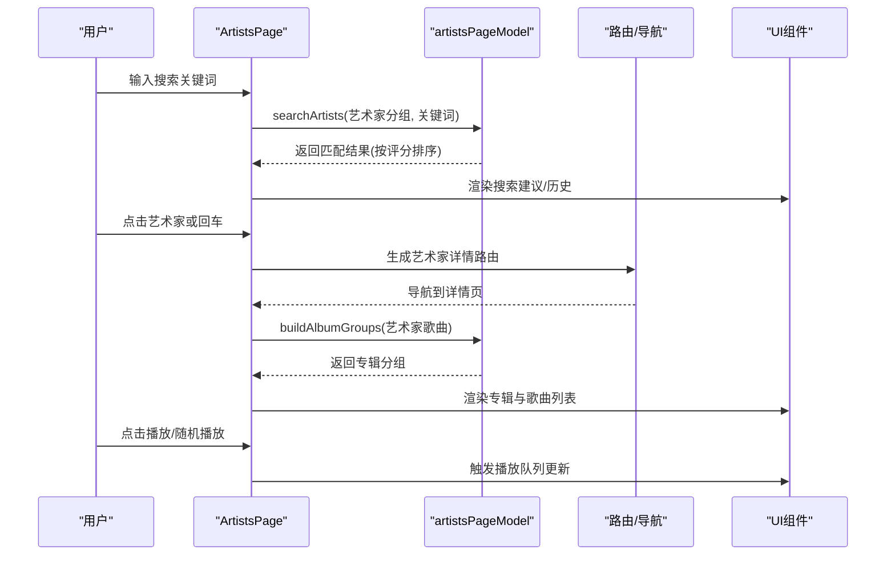
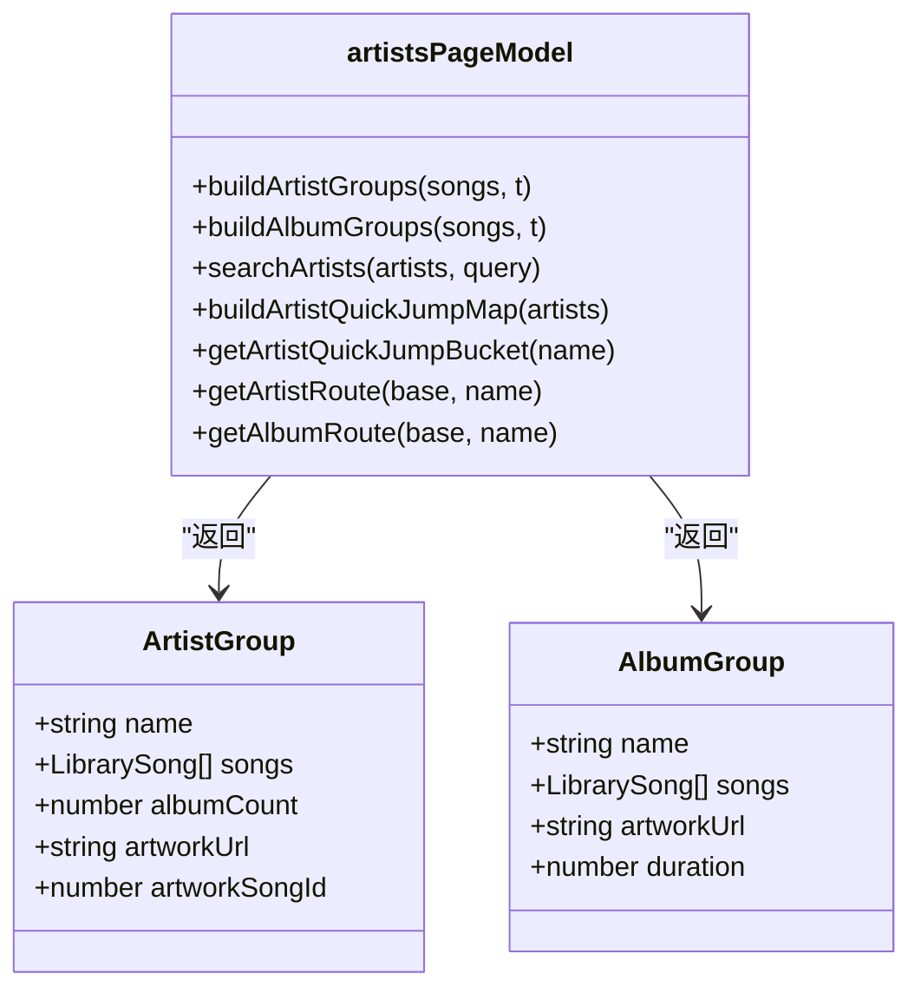
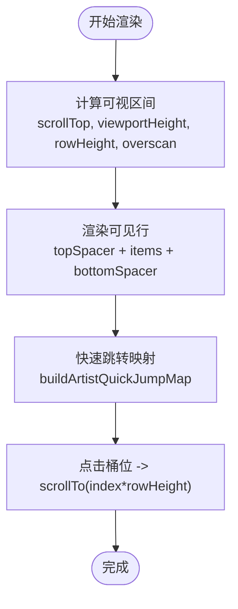
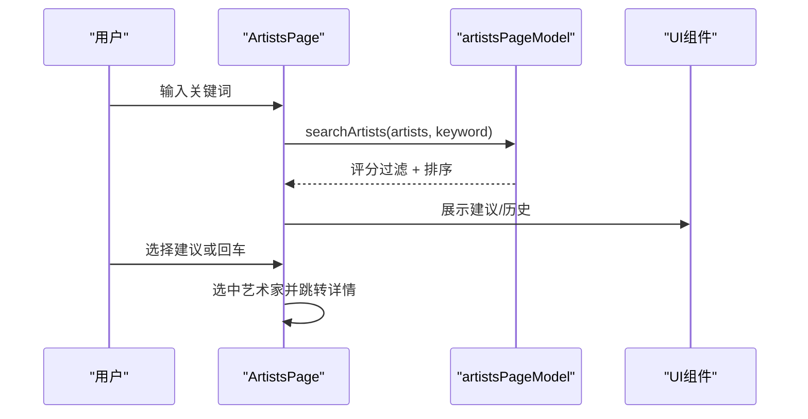
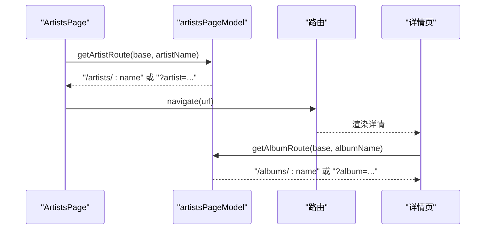
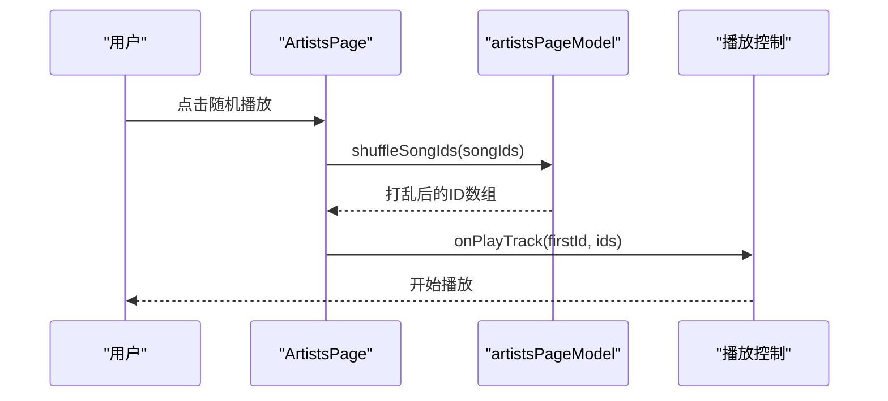
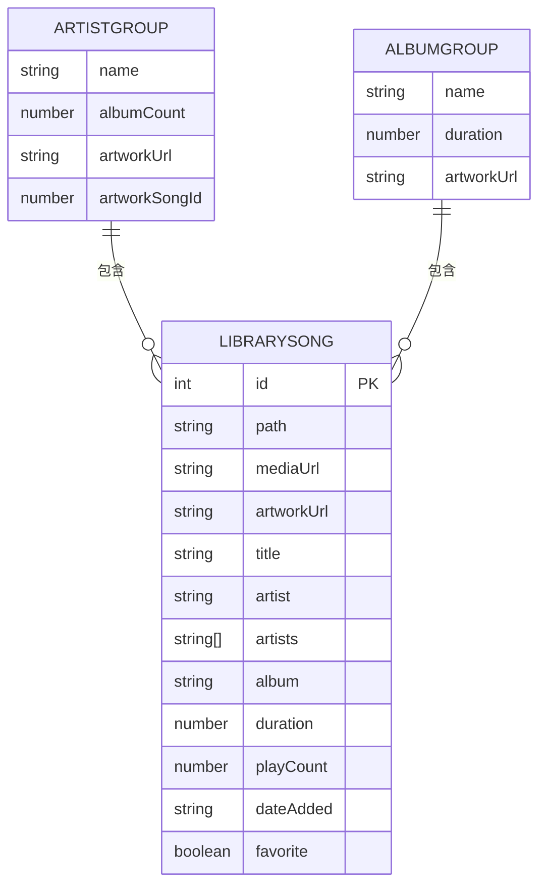
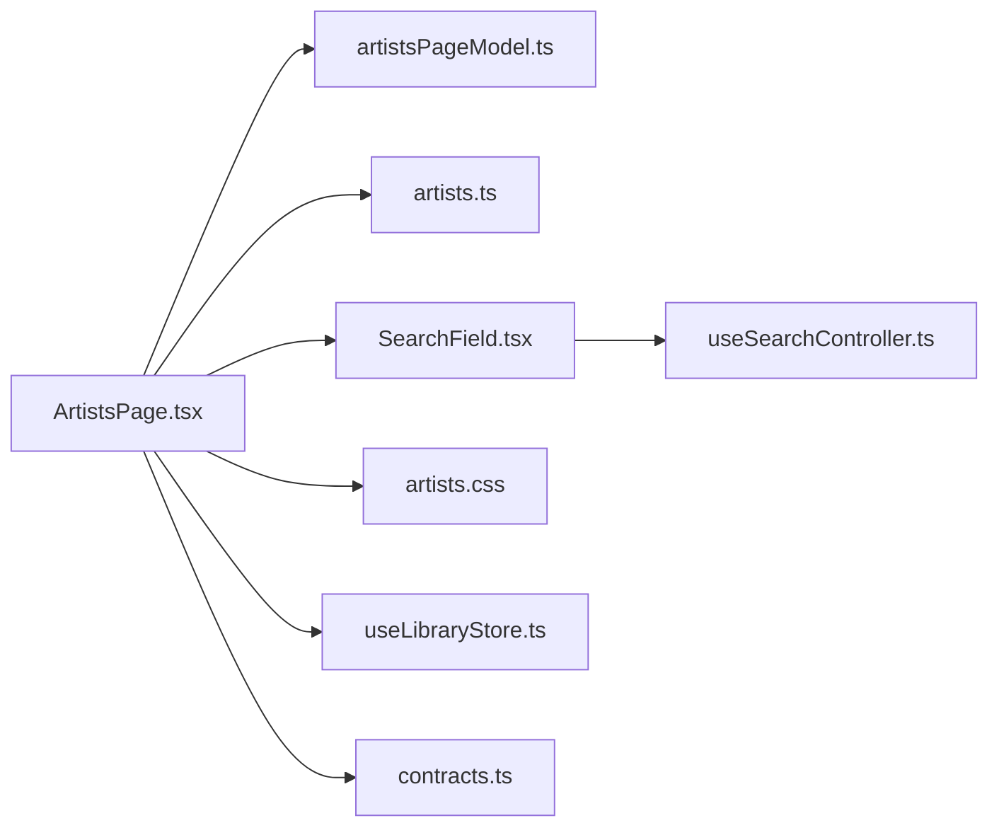

# 艺术家页面

<cite>
**本文档引用的文件**
- [ArtistsPage.tsx](file://src/pages/ArtistsPage.tsx)
- [artistsPageModel.ts](file://src/pages/artistsPageModel.ts)
- [artists.ts](file://src/shared/artists.ts)
- [artists.css](file://src/styles/artists.css)
- [SearchField.tsx](file://src/components/SearchField.tsx)
- [useSearchController.ts](file://src/hooks/useSearchController.ts)
- [LibraryDataSourceArtistsPage.tsx](file://src/pages/LibraryDataSourceArtistsPage.tsx)
- [contracts.ts](file://src/shared/contracts.ts)
- [useLibraryStore.ts](file://src/state/useLibraryStore.ts)
</cite>

## 目录
1. [简介](#简介)
2. [项目结构](#项目结构)
3. [核心组件](#核心组件)
4. [架构总览](#架构总览)
5. [详细组件分析](#详细组件分析)
6. [依赖关系分析](#依赖关系分析)
7. [性能考量](#性能考量)
8. [故障排除指南](#故障排除指南)
9. [结论](#结论)

## 简介
本文件为 SMPlayer 的艺术家页面（ArtistsPage）提供系统化、可操作的技术文档。内容涵盖：
- 艺术家列表展示与虚拟滚动机制
- 艺术家信息组织结构与数据模型
- 相关专辑与歌曲的关联展示与交互
- 数据聚合与排序逻辑（按字母顺序、作品数量、活跃度）
- 页面导航与路由设计（详情跳转、专辑链接、歌曲播放入口）
- 搜索与筛选（模糊匹配、快速定位、搜索历史）
- 数据模型设计（实体结构、关联关系、缓存策略）

## 项目结构
艺术家页面由“容器组件 + 模型层 + 样式 + 组件库”四部分协同构成：
- 容器组件：负责状态管理、事件处理、路由与交互
- 模型层：负责数据聚合、分组、排序、虚拟窗口计算、路由生成
- 样式层：负责响应式布局、主题适配、交互反馈
- 组件库：复用的通用 UI 组件（搜索框、滚动条、菜单等）

**图表来源**
- [ArtistsPage.tsx:1-1201](file://src/pages/ArtistsPage.tsx#L1-L1201)
- [artistsPageModel.ts:1-330](file://src/pages/artistsPageModel.ts#L1-L330)
- [artists.ts:1-53](file://src/shared/artists.ts#L1-L53)
- [artists.css:1-1016](file://src/styles/artists.css#L1-L1016)
- [SearchField.tsx:1-84](file://src/components/SearchField.tsx#L1-L84)
- [useSearchController.ts:1-91](file://src/hooks/useSearchController.ts#L1-L91)
- [LibraryDataSourceArtistsPage.tsx:1-131](file://src/pages/LibraryDataSourceArtistsPage.tsx#L1-L131)
- [useLibraryStore.ts:1-200](file://src/state/useLibraryStore.ts#L1-L200)
- [contracts.ts:1-200](file://src/shared/contracts.ts#L1-L200)

**章节来源**
- [ArtistsPage.tsx:1-1201](file://src/pages/ArtistsPage.tsx#L1-L1201)
- [artistsPageModel.ts:1-330](file://src/pages/artistsPageModel.ts#L1-L330)
- [artists.css:1-1016](file://src/styles/artists.css#L1-L1016)

## 核心组件
- 容器组件 ArtistsPage：负责艺术家列表渲染、详情页切换、搜索与筛选、快捷跳转、虚拟滚动、上下文菜单、路由跳转、播放控制等。
- 模型层 artistsPageModel：提供艺术家与专辑分组、排序、搜索评分、快速跳转映射、虚拟窗口计算、路由生成等纯函数。
- 艺术家工具 artists：提供艺术家规范化、多艺术家连接、显示格式化等辅助方法。
- 样式 artists.css：定义网格布局、搜索框、快速跳转、列表项、详情页卡片、夜间模式等样式。
- 搜索组件与控制器：SearchField 与 useSearchController 提供统一的搜索输入、提交、历史记录管理能力。

**章节来源**
- [ArtistsPage.tsx:80-120](file://src/pages/ArtistsPage.tsx#L80-L120)
- [artistsPageModel.ts:5-47](file://src/pages/artistsPageModel.ts#L5-L47)
- [artists.ts:1-53](file://src/shared/artists.ts#L1-L53)
- [artists.css:1-1016](file://src/styles/artists.css#L1-L1016)
- [SearchField.tsx:1-84](file://src/components/SearchField.tsx#L1-L84)
- [useSearchController.ts:1-91](file://src/hooks/useSearchController.ts#L1-L91)

## 架构总览
艺术家页面采用“容器组件 + 纯函数模型”的分层架构：
- 容器组件负责 UI 呈现、用户交互、路由与状态同步
- 模型层提供稳定的算法与数据结构，便于测试与复用
- 样式层通过 CSS Grid 与媒体查询实现响应式布局
- 组件库提供可复用的搜索、滚动、菜单等基础能力

**图表来源**
- [ArtistsPage.tsx:341-437](file://src/pages/ArtistsPage.tsx#L341-L437)
- [artistsPageModel.ts:83-94](file://src/pages/artistsPageModel.ts#L83-L94)
- [artistsPageModel.ts:250-272](file://src/pages/artistsPageModel.ts#L250-L272)

**章节来源**
- [ArtistsPage.tsx:312-340](file://src/pages/ArtistsPage.tsx#L312-L340)
- [artistsPageModel.ts:321-329](file://src/pages/artistsPageModel.ts#L321-L329)

## 详细组件分析

### 数据模型与聚合
- 艺术家分组（ArtistGroup）
  - 字段：名称、歌曲数组、专辑计数、封面 URL、封面歌曲 ID
  - 聚合逻辑：遍历所有歌曲，按艺术家名聚合；计算专辑去重数量；选择最新或有封面的歌曲作为封面源；按专辑名与标题进行稳定排序
- 专辑分组（AlbumGroup）
  - 字段：名称、歌曲数组、封面 URL、总时长
  - 聚合逻辑：按专辑名聚合歌曲，累加时长，优先保留有封面的歌曲
- 排序与比较
  - 使用带拼音区间的字符归一化比较器，确保中英文混合场景的正确排序
  - 快速跳转桶位计算：支持 A-Z、#（非中日韩字符）、以及基于拼音边界的中文首字母分桶

**图表来源**
- [artistsPageModel.ts:5-18](file://src/pages/artistsPageModel.ts#L5-L18)
- [artistsPageModel.ts:209-248](file://src/pages/artistsPageModel.ts#L209-L248)
- [artistsPageModel.ts:250-272](file://src/pages/artistsPageModel.ts#L250-L272)

**章节来源**
- [artistsPageModel.ts:5-47](file://src/pages/artistsPageModel.ts#L5-L47)
- [artistsPageModel.ts:209-248](file://src/pages/artistsPageModel.ts#L209-L248)
- [artistsPageModel.ts:250-272](file://src/pages/artistsPageModel.ts#L250-L272)

### 列表展示与虚拟滚动
- 虚拟滚动参数
  - 行高：固定行高常量
  - 上下缓冲：可视区域前后额外渲染若干行以避免滚动抖动
  - 计算可见区间：根据滚动位置与视口高度计算起止索引
- 快速跳转
  - 顶部导航按键对应首字母桶位，点击后滚动到该桶位首个艺术家
  - 活跃桶位随滚动实时更新
- 详情页渲染
  - 选中艺术家后，按专辑分组渲染卡片，每张专辑包含歌曲列表
  - 专辑卡片使用虚拟窗口渲染，提升大列表性能

**图表来源**
- [ArtistsPage.tsx:186-201](file://src/pages/ArtistsPage.tsx#L186-L201)
- [artistsPageModel.ts:96-107](file://src/pages/artistsPageModel.ts#L96-L107)
- [artistsPageModel.ts:281-319](file://src/pages/artistsPageModel.ts#L281-L319)

**章节来源**
- [ArtistsPage.tsx:186-201](file://src/pages/ArtistsPage.tsx#L186-L201)
- [artistsPageModel.ts:96-107](file://src/pages/artistsPageModel.ts#L96-L107)
- [artistsPageModel.ts:281-319](file://src/pages/artistsPageModel.ts#L281-L319)

### 搜索与筛选
- 搜索输入
  - 支持页面内搜索与应用栏搜索两种入口
  - 输入框支持清空、回车提交、Esc 关闭应用栏
- 搜索建议与历史
  - 当输入非空时，按评分返回前 N 个匹配艺术家
  - 当输入为空且聚焦时，显示最近搜索历史（仅艺术家类型）
- 搜索评分算法
  - 精确相等最高分，大小写不敏感前缀次之，包含再次之，编辑距离综合评分
  - 使用动态偏移避免同分竞争导致的不稳定排序

**图表来源**
- [ArtistsPage.tsx:144-156](file://src/pages/ArtistsPage.tsx#L144-L156)
- [artistsPageModel.ts:83-94](file://src/pages/artistsPageModel.ts#L83-L94)
- [artistsPageModel.ts:145-184](file://src/pages/artistsPageModel.ts#L145-L184)

**章节来源**
- [ArtistsPage.tsx:341-437](file://src/pages/ArtistsPage.tsx#L341-L437)
- [artistsPageModel.ts:83-94](file://src/pages/artistsPageModel.ts#L83-L94)
- [artistsPageModel.ts:145-184](file://src/pages/artistsPageModel.ts#L145-L184)

### 导航与路由
- 路由生成
  - 艺术家详情路由：支持 base 路径前缀与查询参数两种形式
  - 专辑详情路由：同样支持 base 路径前缀与查询参数
- 跳转机制
  - 列表项点击进入详情页
  - 详情页内专辑卡片点击跳转至专辑详情
  - 歌曲项右键菜单支持“查看艺术家/专辑”
- 响应式细节
  - 小屏模式下详情页嵌入路由，标题栏显示当前艺术家摘要

**图表来源**
- [ArtistsPage.tsx:283-320](file://src/pages/ArtistsPage.tsx#L283-L320)
- [ArtistsPage.tsx:820-826](file://src/pages/ArtistsPage.tsx#L820-L826)
- [artistsPageModel.ts:321-329](file://src/pages/artistsPageModel.ts#L321-L329)

**章节来源**
- [ArtistsPage.tsx:283-320](file://src/pages/ArtistsPage.tsx#L283-L320)
- [ArtistsPage.tsx:820-826](file://src/pages/ArtistsPage.tsx#L820-L826)
- [artistsPageModel.ts:321-329](file://src/pages/artistsPageModel.ts#L321-L329)

### 播放与交互
- 随机播放
  - 艺术家级：打乱该艺术家全部歌曲 ID 后播放
  - 专辑级：打乱该专辑歌曲 ID 后播放
- 多选与批量操作
  - 支持多选歌曲，批量添加到播放队列、收藏、播放列表
- 右键菜单与上下文操作
  - 支持“加入播放队列”“加入歌单”“设为下一首”“收藏”“查看艺术家/专辑”等

**图表来源**
- [ArtistsPage.tsx:256-259](file://src/pages/ArtistsPage.tsx#L256-L259)
- [artistsPageModel.ts:59-70](file://src/pages/artistsPageModel.ts#L59-L70)

**章节来源**
- [ArtistsPage.tsx:256-259](file://src/pages/ArtistsPage.tsx#L256-L259)
- [artistsPageModel.ts:59-70](file://src/pages/artistsPageModel.ts#L59-L70)

### 数据模型设计
- 实体结构
  - 艺术家：名称、歌曲集合、专辑计数、封面信息
  - 专辑：名称、歌曲集合、封面、总时长
  - 歌曲：ID、路径、媒体 URL、封面 URL、标题、艺术家、专辑、时长、播放次数、收藏标记等
- 关联关系
  - 艺术家与歌曲：一对多
  - 专辑与歌曲：一对多
  - 艺术家与专辑：间接一对多（通过歌曲）
- 缓存策略
  - 艺术家封面优先取有封面的歌曲，否则取最新添加的歌曲
  - 专辑封面优先保留已有封面
  - 虚拟滚动缓存：通过虚拟窗口与占位元素减少 DOM 数量

**图表来源**
- [contracts.ts:36-49](file://src/shared/contracts.ts#L36-L49)
- [artistsPageModel.ts:13-18](file://src/pages/artistsPageModel.ts#L13-L18)
- [artistsPageModel.ts:5-11](file://src/pages/artistsPageModel.ts#L5-L11)

**章节来源**
- [contracts.ts:36-49](file://src/shared/contracts.ts#L36-L49)
- [artistsPageModel.ts:13-18](file://src/pages/artistsPageModel.ts#L13-L18)
- [artistsPageModel.ts:5-11](file://src/pages/artistsPageModel.ts#L5-L11)

## 依赖关系分析
- 容器组件依赖模型层函数进行数据处理与路由生成
- 容器组件依赖样式层提供视觉与交互反馈
- 搜索组件与控制器提供统一的搜索体验
- 状态存储与数据契约提供全局状态与类型约束

**图表来源**
- [ArtistsPage.tsx:1-1201](file://src/pages/ArtistsPage.tsx#L1-L1201)
- [artistsPageModel.ts:1-330](file://src/pages/artistsPageModel.ts#L1-L330)
- [artists.ts:1-53](file://src/shared/artists.ts#L1-L53)
- [artists.css:1-1016](file://src/styles/artists.css#L1-L1016)
- [SearchField.tsx:1-84](file://src/components/SearchField.tsx#L1-L84)
- [useSearchController.ts:1-91](file://src/hooks/useSearchController.ts#L1-L91)
- [useLibraryStore.ts:1-200](file://src/state/useLibraryStore.ts#L1-L200)
- [contracts.ts:1-200](file://src/shared/contracts.ts#L1-L200)

**章节来源**
- [ArtistsPage.tsx:1-1201](file://src/pages/ArtistsPage.tsx#L1-L1201)
- [artistsPageModel.ts:1-330](file://src/pages/artistsPageModel.ts#L1-L330)
- [SearchField.tsx:1-84](file://src/components/SearchField.tsx#L1-L84)
- [useSearchController.ts:1-91](file://src/hooks/useSearchController.ts#L1-L91)
- [useLibraryStore.ts:1-200](file://src/state/useLibraryStore.ts#L1-L200)
- [contracts.ts:1-200](file://src/shared/contracts.ts#L1-L200)

## 性能考量
- 虚拟滚动
  - 艺术家列表与专辑详情均采用虚拟窗口渲染，显著降低 DOM 节点数量
  - 通过上/下缓冲与占位元素保证滚动流畅性
- 搜索评分
  - 使用编辑距离与字符串匹配组合评分，避免全量扫描带来的性能问题
  - 结果集限制在合理范围，减少渲染压力
- 响应式布局
  - 使用 CSS Grid 与媒体查询，减少 JS 动态计算
- 资源加载
  - 封面优先取已有资源，减少网络请求
  - 夜间模式样式通过 CSS 变量与媒体查询实现，避免运行时样式计算

[本节为通用性能指导，无需特定文件引用]

## 故障排除指南
- 无法显示艺术家列表
  - 检查数据源是否加载完成（加载状态与错误提示）
  - 确认目标艺术家是否存在，不存在时给出提示并返回列表
- 搜索无结果
  - 确认关键词长度与大小写处理
  - 检查搜索历史是否被清理
- 快速跳转无效
  - 确认快速跳转映射是否已构建
  - 检查首字母桶位是否有效
- 详情页空白
  - 确认选中艺术家存在且歌曲数据已聚合
  - 检查路由是否正确生成与跳转

**章节来源**
- [ArtistsPage.tsx:516-557](file://src/pages/ArtistsPage.tsx#L516-L557)
- [artistsPageModel.ts:96-107](file://src/pages/artistsPageModel.ts#L96-L107)

## 结论
艺术家页面通过清晰的分层架构与高效的虚拟滚动技术，实现了大规模音乐库下的流畅浏览体验。其搜索与筛选机制结合评分算法，兼顾易用性与性能。路由与交互设计完善，支持从艺术家到专辑再到歌曲的完整导航链路。数据模型与缓存策略确保了封面与排序的稳定性与一致性。整体设计易于扩展与维护，适合在复杂音乐库场景中长期演进。