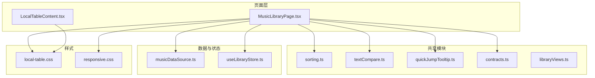
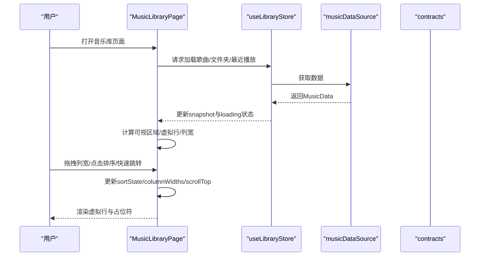
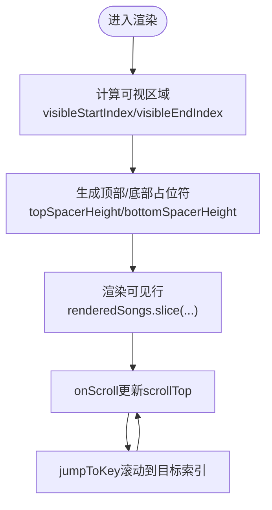
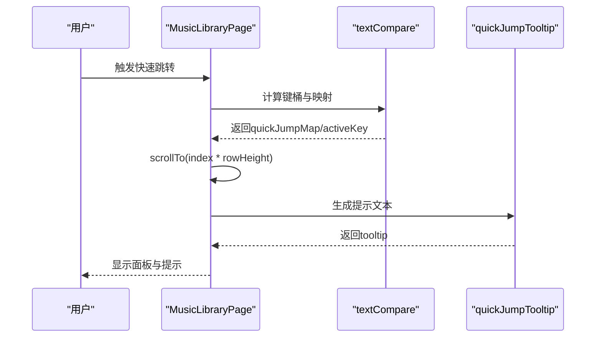
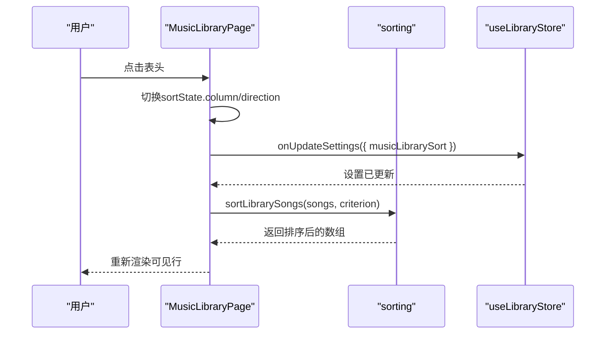
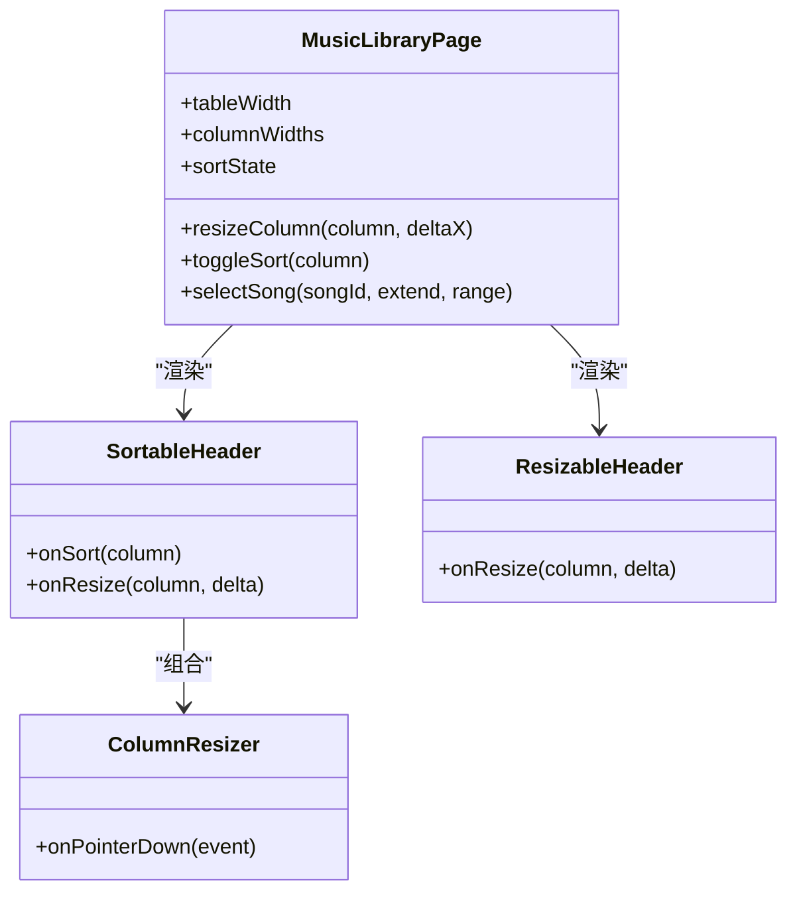
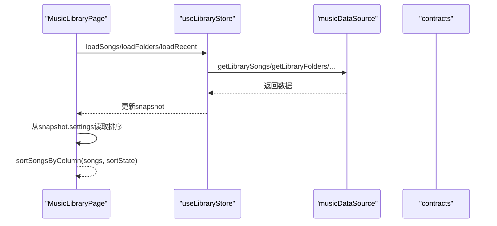
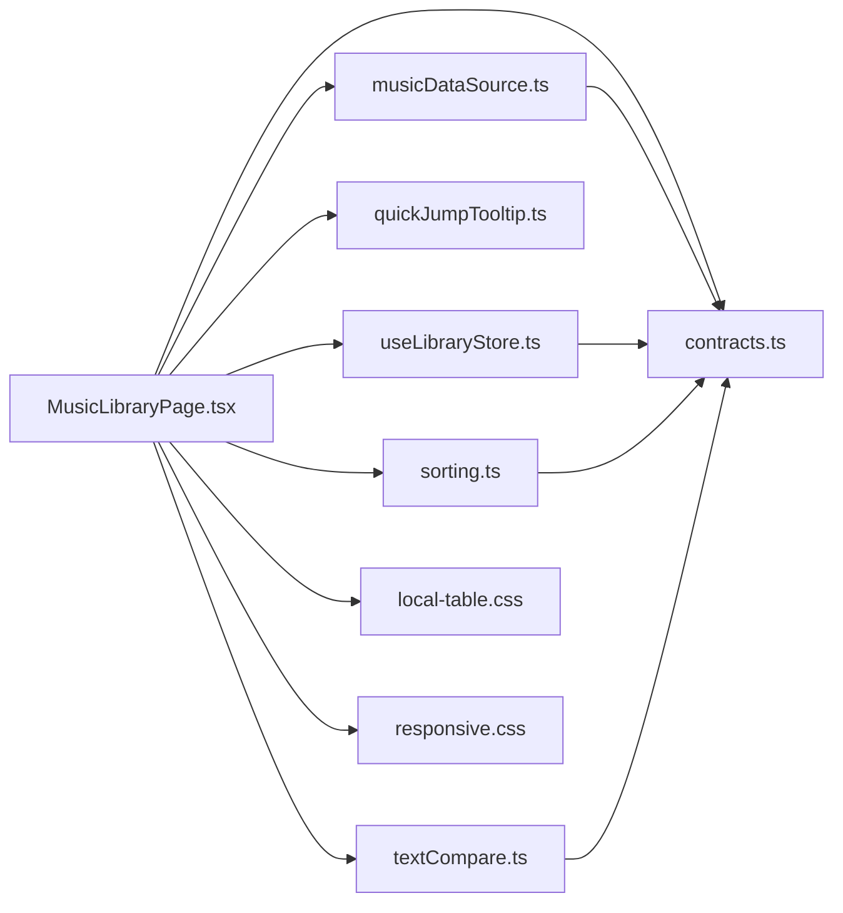

# 音乐库页面

<cite>
**本文档引用的文件**
- [MusicLibraryPage.tsx](file://src/pages/MusicLibraryPage.tsx)
- [LocalTableContent.tsx](file://src/pages/LocalTableContent.tsx)
- [musicDataSource.ts](file://src/data/musicDataSource.ts)
- [libraryViews.ts](file://src/shared/libraryViews.ts)
- [useLibraryStore.ts](file://src/state/useLibraryStore.ts)
- [contracts.ts](file://src/shared/contracts.ts)
- [sorting.ts](file://src/shared/sorting.ts)
- [textCompare.ts](file://src/shared/textCompare.ts)
- [quickJumpTooltip.ts](file://src/shared/quickJumpTooltip.ts)
- [local-table.css](file://src/styles/local-table.css)
- [responsive.css](file://src/styles/responsive.css)
</cite>

## 目录
1. [简介](#简介)
2. [项目结构](#项目结构)
3. [核心组件](#核心组件)
4. [架构总览](#架构总览)
5. [详细组件分析](#详细组件分析)
6. [依赖关系分析](#依赖关系分析)
7. [性能考量](#性能考量)
8. [故障排除指南](#故障排除指南)
9. [结论](#结论)

## 简介
本文件面向SMPlayer的音乐库页面（MusicLibraryPage），系统化阐述其核心功能与实现细节，重点覆盖以下方面：
- 虚拟滚动表格的高性能渲染机制：可视区域计算、占位符行的动态插入、滚动位置的精确控制
- 快速跳转功能：按键映射、索引构建、滚动定位与UI提示
- 多列排序系统：排序状态维护、排序方向切换、排序准则与数据源的联动
- 列宽调整：可调整大小的表头、最小宽度约束、紧凑/宽版布局下的宽度计算
- 表格组件架构：可排序列、可调整大小列、选择性菜单、上下文菜单
- 数据流管理：歌曲数据获取、排序状态维护、选择状态同步
- 响应式设计：紧凑布局与宽版布局的切换逻辑

## 项目结构
音乐库页面位于src/pages目录下，配合共享模块、样式与状态管理共同构成完整的页面实现。

**图表来源**
- [MusicLibraryPage.tsx:1-1001](file://src/pages/MusicLibraryPage.tsx#L1-L1001)
- [LocalTableContent.tsx:1-394](file://src/pages/LocalTableContent.tsx#L1-L394)
- [sorting.ts:1-68](file://src/shared/sorting.ts#L1-L68)
- [textCompare.ts:1-78](file://src/shared/textCompare.ts#L1-L78)
- [quickJumpTooltip.ts:1-18](file://src/shared/quickJumpTooltip.ts#L1-L18)
- [contracts.ts:1-200](file://src/shared/contracts.ts#L1-L200)
- [musicDataSource.ts:1-331](file://src/data/musicDataSource.ts#L1-L331)
- [useLibraryStore.ts:1-800](file://src/state/useLibraryStore.ts#L1-L800)
- [local-table.css:1-800](file://src/styles/local-table.css#L1-L800)
- [responsive.css:1-560](file://src/styles/responsive.css#L1-L560)

**章节来源**
- [MusicLibraryPage.tsx:1-1001](file://src/pages/MusicLibraryPage.tsx#L1-L1001)
- [LocalTableContent.tsx:1-394](file://src/pages/LocalTableContent.tsx#L1-L394)
- [musicDataSource.ts:1-331](file://src/data/musicDataSource.ts#L1-L331)
- [useLibraryStore.ts:1-800](file://src/state/useLibraryStore.ts#L1-L800)

## 核心组件
- MusicLibraryPage：音乐库主页面，负责虚拟滚动、快速跳转、排序、列宽调整、选择与菜单等核心交互
- 可排序表头组件：SortableHeader，支持点击切换排序方向与拖拽调整列宽
- 可调整大小表头组件：ResizableHeader + ColumnResizer，提供列宽拖拽能力
- 本地表格内容组件：LocalTableContent，用于本地文件夹视图中的表格展示（对比参考）
- 数据源与状态：musicDataSource、useLibraryStore，提供数据获取与状态更新
- 排序与文本比较：sorting、textCompare，提供排序算法与快速跳转键桶计算
- 样式与响应式：local-table.css、responsive.css，提供滚动条、紧凑/宽版布局样式

**章节来源**
- [MusicLibraryPage.tsx:436-827](file://src/pages/MusicLibraryPage.tsx#L436-L827)
- [sorting.ts:24-68](file://src/shared/sorting.ts#L24-L68)
- [textCompare.ts:34-77](file://src/shared/textCompare.ts#L34-L77)
- [musicDataSource.ts:43-63](file://src/data/musicDataSource.ts#L43-L63)
- [useLibraryStore.ts:111-319](file://src/state/useLibraryStore.ts#L111-L319)

## 架构总览
音乐库页面采用“页面组件 + 共享工具 + 数据源 + 状态管理”的分层架构：
- 页面组件负责UI与交互逻辑（虚拟滚动、快速跳转、排序、列宽调整）
- 共享模块提供排序与文本处理能力
- 数据源与状态管理负责数据获取与状态同步
- 样式与响应式模块负责布局与滚动条体验

**图表来源**
- [MusicLibraryPage.tsx:107-142](file://src/pages/MusicLibraryPage.tsx#L107-L142)
- [useLibraryStore.ts:145-319](file://src/state/useLibraryStore.ts#L145-L319)
- [musicDataSource.ts:136-179](file://src/data/musicDataSource.ts#L136-L179)
- [contracts.ts:36-49](file://src/shared/contracts.ts#L36-L49)

## 详细组件分析

### 虚拟滚动表格的高性能渲染
- 可视区域计算
  - 基于当前scrollTop与虚拟行高计算可见起止索引，并加上overscan缓冲区，避免滚动时的闪烁
  - topSpacerHeight与bottomSpacerHeight通过占位符行撑起整个列表高度，确保滚动条比例正确
- 滚动位置控制
  - onScroll事件实时更新scrollTop；快速跳转时使用scrollTo(top: index * rowHeight)精确定位
- 行高与布局
  - 宽版布局使用固定行高，紧凑布局根据窗口宽度切换不同行高，保证在小屏设备上的可读性

**图表来源**
- [MusicLibraryPage.tsx:134-141](file://src/pages/MusicLibraryPage.tsx#L134-L141)
- [MusicLibraryPage.tsx:210-220](file://src/pages/MusicLibraryPage.tsx#L210-L220)

**章节来源**
- [MusicLibraryPage.tsx:134-141](file://src/pages/MusicLibraryPage.tsx#L134-L141)
- [MusicLibraryPage.tsx:210-220](file://src/pages/MusicLibraryPage.tsx#L210-L220)

### 快速跳转功能
- 键盘映射与索引构建
  - 使用本地化文本比较函数生成键桶（#A-Z），构建“键 -> 首个匹配项索引”的映射表
  - 支持升序/降序两种方向，按键顺序随方向反转
- 滚动定位与UI提示
  - 点击或键盘触发后，滚动到对应索引位置；同时显示提示气泡说明跳转目标
  - 在紧凑布局下，面板仅在打开时显示，避免遮挡

**图表来源**
- [MusicLibraryPage.tsx:156-162](file://src/pages/MusicLibraryPage.tsx#L156-L162)
- [MusicLibraryPage.tsx:210-225](file://src/pages/MusicLibraryPage.tsx#L210-L225)
- [textCompare.ts:54-77](file://src/shared/textCompare.ts#L54-L77)
- [quickJumpTooltip.ts:3-17](file://src/shared/quickJumpTooltip.ts#L3-L17)

**章节来源**
- [MusicLibraryPage.tsx:156-162](file://src/pages/MusicLibraryPage.tsx#L156-L162)
- [MusicLibraryPage.tsx:210-225](file://src/pages/MusicLibraryPage.tsx#L210-L225)
- [textCompare.ts:54-77](file://src/shared/textCompare.ts#L54-L77)
- [quickJumpTooltip.ts:3-17](file://src/shared/quickJumpTooltip.ts#L3-L17)

### 多列排序系统
- 排序状态与切换
  - 维护当前排序列与方向；点击同一列则在升/降间切换，否则应用新列并重置为升序
  - 将排序准则写入设置以持久化用户偏好
- 排序算法
  - 根据排序准则对歌曲数组进行稳定排序，优先级包含艺术家、专辑、时长、播放次数、添加日期等
  - 文本比较使用本地化规则，确保拼音/字母混合场景的正确排序

**图表来源**
- [MusicLibraryPage.tsx:184-197](file://src/pages/MusicLibraryPage.tsx#L184-L197)
- [MusicLibraryPage.tsx:881-890](file://src/pages/MusicLibraryPage.tsx#L881-L890)
- [sorting.ts:24-44](file://src/shared/sorting.ts#L24-L44)
- [useLibraryStore.ts:107](file://src/state/useLibraryStore.ts#L107)

**章节来源**
- [MusicLibraryPage.tsx:184-197](file://src/pages/MusicLibraryPage.tsx#L184-L197)
- [MusicLibraryPage.tsx:881-890](file://src/pages/MusicLibraryPage.tsx#L881-L890)
- [sorting.ts:24-44](file://src/shared/sorting.ts#L24-L44)
- [useLibraryStore.ts:107](file://src/state/useLibraryStore.ts#L107)

### 列宽调整与表头组件
- 可调整大小的表头
  - ResizableHeader + ColumnResizer提供拖拽调整能力，限制最小宽度，防止列被收拢至不可见
  - 宽版布局下按列宽累加计算表格总宽度，紧凑布局下表格宽度等于容器宽度
- 可排序的列
  - SortableHeader支持点击切换排序方向，并在表头显示当前排序指示器
- 选择性菜单
  - 支持单选、多选、范围选择；右键弹出选择性菜单，提供随机播放、添加到歌单、收藏等操作

**图表来源**
- [MusicLibraryPage.tsx:203-208](file://src/pages/MusicLibraryPage.tsx#L203-L208)
- [MusicLibraryPage.tsx:184-197](file://src/pages/MusicLibraryPage.tsx#L184-L197)
- [MusicLibraryPage.tsx:772-827](file://src/pages/MusicLibraryPage.tsx#L772-L827)
- [MusicLibraryPage.tsx:829-879](file://src/pages/MusicLibraryPage.tsx#L829-L879)

**章节来源**
- [MusicLibraryPage.tsx:203-208](file://src/pages/MusicLibraryPage.tsx#L203-L208)
- [MusicLibraryPage.tsx:772-827](file://src/pages/MusicLibraryPage.tsx#L772-L827)
- [MusicLibraryPage.tsx:829-879](file://src/pages/MusicLibraryPage.tsx#L829-L879)

### 表格组件架构与交互
- 表格结构
  - colgroup + <col>定义各列宽度；thead包含可排序/可调整大小的表头；tbody渲染虚拟行
- 交互行为
  - 单击选择、Ctrl/Cmd多选、Shift范围选择；双击播放；右键弹出上下文菜单或选择性菜单
  - 横向滚动支持Shift+滚轮，避免误触纵向滚动
- 上下文菜单与选择性菜单
  - 支持播放、加入队列、加入歌单、收藏、删除等操作；选择性菜单支持批量操作

**章节来源**
- [MusicLibraryPage.tsx:431-610](file://src/pages/MusicLibraryPage.tsx#L431-L610)
- [MusicLibraryPage.tsx:227-254](file://src/pages/MusicLibraryPage.tsx#L227-L254)
- [MusicLibraryPage.tsx:496-521](file://src/pages/MusicLibraryPage.tsx#L496-L521)

### 数据流管理
- 数据获取
  - 通过useLibraryStore异步加载歌曲、文件夹、最近播放等数据；支持刷新与扫描
- 排序状态维护
  - 排序状态来自snapshot.settings，页面初始化时读取并监听变更
- 选择状态同步
  - selectedSongIds与queueSongIds保持同步，确保选择状态与当前可见队列一致

**图表来源**
- [useLibraryStore.ts:145-319](file://src/state/useLibraryStore.ts#L145-L319)
- [musicDataSource.ts:136-179](file://src/data/musicDataSource.ts#L136-L179)
- [MusicLibraryPage.tsx:114-117](file://src/pages/MusicLibraryPage.tsx#L114-L117)

**章节来源**
- [useLibraryStore.ts:145-319](file://src/state/useLibraryStore.ts#L145-L319)
- [musicDataSource.ts:136-179](file://src/data/musicDataSource.ts#L136-L179)
- [MusicLibraryPage.tsx:114-117](file://src/pages/MusicLibraryPage.tsx#L114-L117)

### 响应式设计
- 布局切换
  - 以断点阈值判断是否进入紧凑布局；紧凑布局下隐藏部分列、显示快速跳转面板
- 滚动条与交互
  - 自定义滚动条样式，支持悬停显示与平滑滚动；紧凑布局下优化按钮与提示显示
- 样式适配
  - responsive.css提供多断点下的网格与控件尺寸调整，确保在小屏设备上可用

**章节来源**
- [MusicLibraryPage.tsx:128-133](file://src/pages/MusicLibraryPage.tsx#L128-L133)
- [MusicLibraryPage.tsx:300-314](file://src/pages/MusicLibraryPage.tsx#L300-L314)
- [local-table.css:1-180](file://src/styles/local-table.css#L1-L180)
- [responsive.css:298-446](file://src/styles/responsive.css#L298-L446)

## 依赖关系分析

**图表来源**
- [MusicLibraryPage.tsx:1-52](file://src/pages/MusicLibraryPage.tsx#L1-L52)
- [sorting.ts:1-4](file://src/shared/sorting.ts#L1-L4)
- [textCompare.ts:1-5](file://src/shared/textCompare.ts#L1-L5)
- [quickJumpTooltip.ts:1-2](file://src/shared/quickJumpTooltip.ts#L1-L2)
- [contracts.ts:1-200](file://src/shared/contracts.ts#L1-L200)
- [musicDataSource.ts:1-20](file://src/data/musicDataSource.ts#L1-L20)
- [useLibraryStore.ts:1-34](file://src/state/useLibraryStore.ts#L1-L34)

**章节来源**
- [MusicLibraryPage.tsx:1-52](file://src/pages/MusicLibraryPage.tsx#L1-L52)
- [contracts.ts:1-200](file://src/shared/contracts.ts#L1-L200)
- [musicDataSource.ts:1-20](file://src/data/musicDataSource.ts#L1-L20)
- [useLibraryStore.ts:1-34](file://src/state/useLibraryStore.ts#L1-L34)

## 性能考量
- 虚拟滚动
  - 通过可视区域裁剪与overscan缓冲减少DOM节点数量，提升滚动流畅度
  - 占位符行确保滚动条比例与真实高度一致，避免滚动异常
- 排序与比较
  - 使用本地化比较器与稳定的排序算法，避免重复排序带来的抖动
- 列宽调整
  - 最小宽度约束与节流式更新，避免频繁重排导致卡顿
- 数据加载
  - 异步加载与缓存策略，结合增量刷新减少IPC与数据库压力

[本节为通用指导，无需特定文件引用]

## 故障排除指南
- 快速跳转无效
  - 检查quickJumpMap是否为空（无匹配项）；确认排序列与方向影响键桶分布
- 排序不生效
  - 确认snapshot.settings中的musicLibrarySort已更新；检查排序准则与数据字段类型
- 滚动条异常
  - 检查tableWidth与scrollTop计算；确认占位符高度是否正确
- 列宽无法调整
  - 确认最小宽度限制与指针事件捕获；检查容器尺寸变化监听

**章节来源**
- [MusicLibraryPage.tsx:156-162](file://src/pages/MusicLibraryPage.tsx#L156-L162)
- [MusicLibraryPage.tsx:184-197](file://src/pages/MusicLibraryPage.tsx#L184-L197)
- [MusicLibraryPage.tsx:203-208](file://src/pages/MusicLibraryPage.tsx#L203-L208)

## 结论
音乐库页面通过虚拟滚动、快速跳转、多列排序与列宽调整等特性，在保证良好用户体验的同时实现了高性能渲染与灵活的交互设计。依托清晰的分层架构与完善的共享工具链，页面在数据获取、状态同步与响应式适配上均具备良好的扩展性与可维护性。