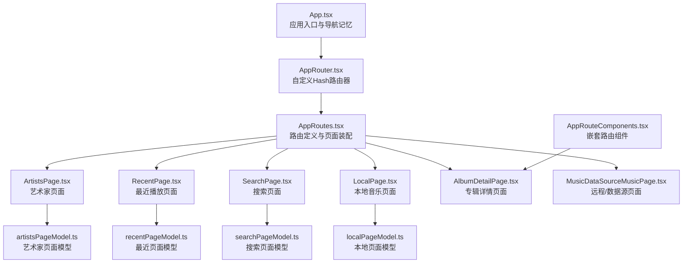
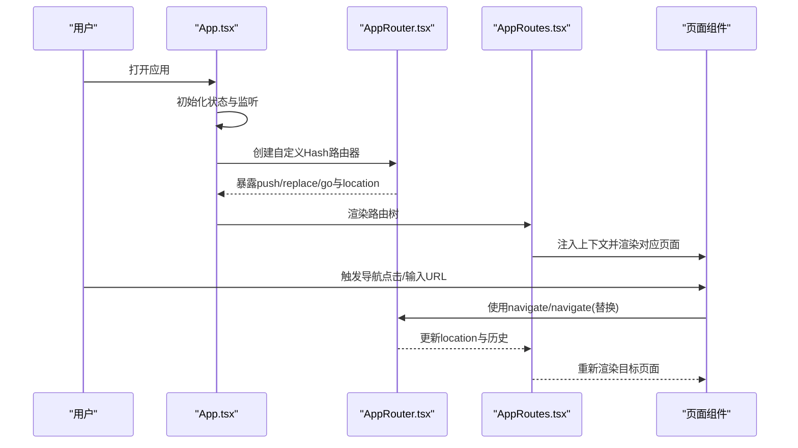
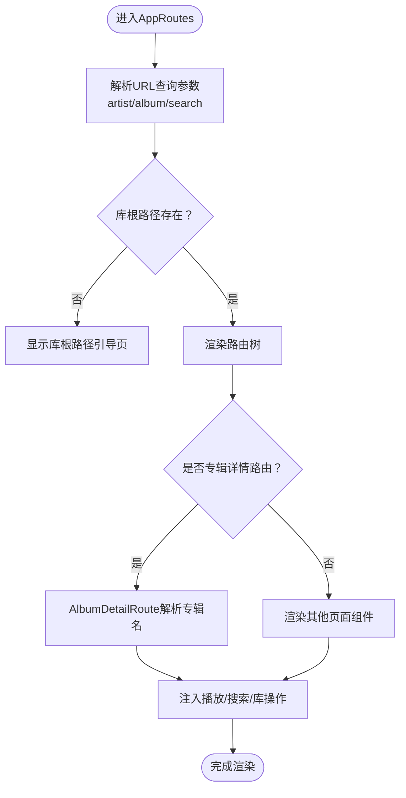
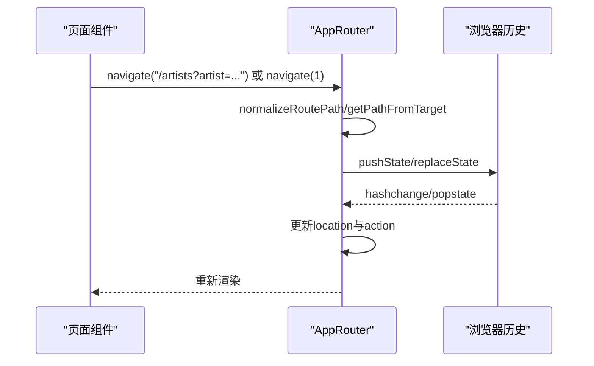
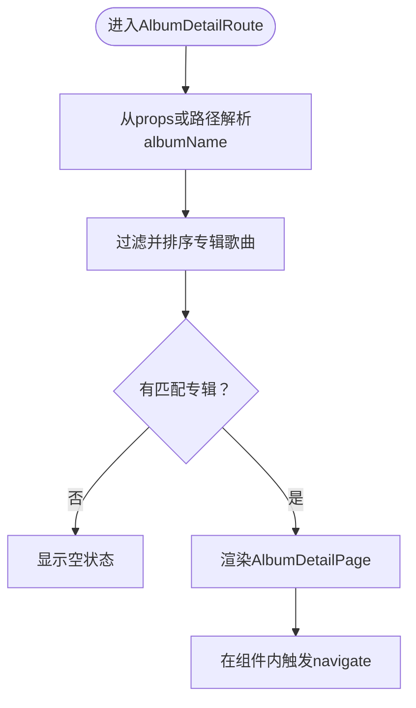
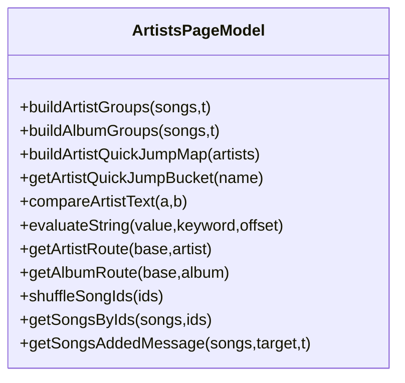
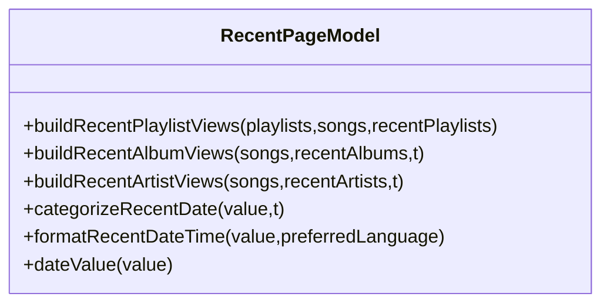
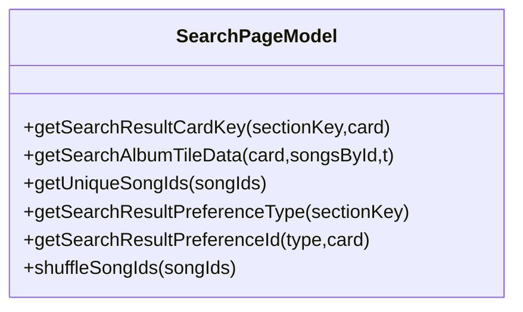
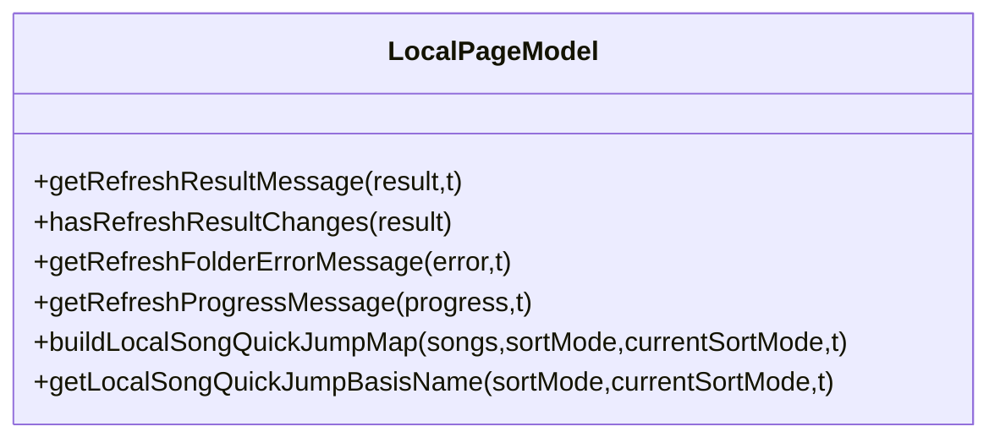
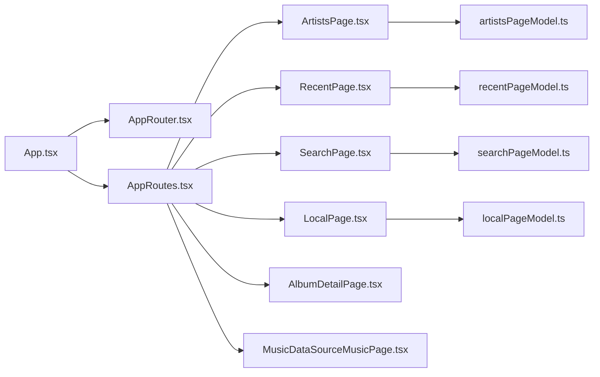

# 导航系统

<cite>
**本文档引用的文件**
- [AppRoutes.tsx](file://src/AppRoutes.tsx)
- [AppRouter.tsx](file://src/AppRouter.tsx)
- [AppRouteComponents.tsx](file://src/AppRouteComponents.tsx)
- [App.tsx](file://src/App.tsx)
- [artistsPageModel.ts](file://src/pages/artistsPageModel.ts)
- [recentPageModel.ts](file://src/pages/recentPageModel.ts)
- [searchPageModel.ts](file://src/pages/searchPageModel.ts)
- [localPageModel.ts](file://src/pages/localPageModel.ts)
- [ArtistsPage.tsx](file://src/pages/ArtistsPage.tsx)
- [RecentPage.tsx](file://src/pages/RecentPage.tsx)
- [SearchPage.tsx](file://src/pages/SearchPage.tsx)
- [LocalPage.tsx](file://src/pages/LocalPage.tsx)
- [AlbumDetailPage.tsx](file://src/pages/AlbumDetailPage.tsx)
- [MusicDataSourceMusicPage.tsx](file://src/pages/LibraryDataSourceMusicPage.tsx)
</cite>

## 目录
1. [简介](#简介)
2. [项目结构](#项目结构)
3. [核心组件](#核心组件)
4. [架构总览](#架构总览)
5. [详细组件分析](#详细组件分析)
6. [依赖关系分析](#依赖关系分析)
7. [性能考虑](#性能考虑)
8. [故障排除指南](#故障排除指南)
9. [结论](#结论)

## 简介
本文件系统性梳理 SMPlayer 的导航系统，覆盖路由配置（AppRoutes）、自定义路由器（AppRouter）、路由组件（AppRouteComponents）与各页面模型（artistsPageModel、recentPageModel、searchPageModel、localPageModel）。重点阐述：
- 路由定义、参数传递与嵌套路由设计
- 自定义 Hash 路由器的实现与导航拦截
- 页面组件包装、状态管理与生命周期
- 各页面模型的数据处理与交互逻辑
- 路由参数解析、查询字符串处理与路由状态同步
- 导航体验优化策略（预加载、缓存、动画）

## 项目结构
导航系统围绕以下关键文件展开：
- 路由声明与页面装配：AppRoutes.tsx
- 自定义路由器：AppRouter.tsx
- 嵌套路由组件：AppRouteComponents.tsx
- 应用入口与导航记忆：App.tsx
- 页面模型与数据处理：artistsPageModel.ts、recentPageModel.ts、searchPageModel.ts、localPageModel.ts
- 页面组件：ArtistsPage.tsx、RecentPage.tsx、SearchPage.tsx、LocalPage.tsx、AlbumDetailPage.tsx、MusicDataSourceMusicPage.tsx

图表来源
- [App.tsx:111-525](file://src/App.tsx#L111-L525)
- [AppRouter.tsx:25-81](file://src/AppRouter.tsx#L25-L81)
- [AppRoutes.tsx:176-1107](file://src/AppRoutes.tsx#L176-L1107)
- [AppRouteComponents.tsx:13-105](file://src/AppRouteComponents.tsx#L13-L105)
- [ArtistsPage.tsx:82-528](file://src/pages/ArtistsPage.tsx#L82-L528)
- [RecentPage.tsx:141-592](file://src/pages/RecentPage.tsx#L141-L592)
- [SearchPage.tsx:105-724](file://src/pages/SearchPage.tsx#L105-L724)
- [LocalPage.tsx:152-800](file://src/pages/LocalPage.tsx#L152-L800)
- [AlbumDetailPage.tsx:32-109](file://src/pages/AlbumDetailPage.tsx#L32-L109)
- [MusicDataSourceMusicPage.tsx:39-142](file://src/pages/LibraryDataSourceMusicPage.tsx#L39-L142)

章节来源
- [AppRoutes.tsx:176-1107](file://src/AppRoutes.tsx#L176-L1107)
- [AppRouter.tsx:25-81](file://src/AppRouter.tsx#L25-L81)
- [AppRouteComponents.tsx:13-105](file://src/AppRouteComponents.tsx#L13-L105)
- [App.tsx:111-525](file://src/App.tsx#L111-L525)

## 核心组件
- AppRoutes：集中声明所有路由，按需注入上下文与数据，支持嵌套路由与条件渲染（如启动重定向、库根路径提示）。
- AppRouter：基于 Hash 的自定义路由器，提供 push/replace/go 与事件同步，适配 Electron 环境。
- AppRouteComponents：封装嵌套路由组件（如专辑详情），负责参数解析与页面切换。
- 页面模型：artistsPageModel、recentPageModel、searchPageModel、localPageModel 提供数据分组、排序、筛选与路由工具函数。

章节来源
- [AppRoutes.tsx:176-1107](file://src/AppRoutes.tsx#L176-L1107)
- [AppRouter.tsx:25-81](file://src/AppRouter.tsx#L25-L81)
- [AppRouteComponents.tsx:13-105](file://src/AppRouteComponents.tsx#L13-L105)
- [artistsPageModel.ts:1-330](file://src/pages/artistsPageModel.ts#L1-L330)
- [recentPageModel.ts:1-190](file://src/pages/recentPageModel.ts#L1-L190)
- [searchPageModel.ts:1-62](file://src/pages/searchPageModel.ts#L1-L62)
- [localPageModel.ts:1-180](file://src/pages/localPageModel.ts#L1-L180)

## 架构总览
SMPlayer 采用 Hash 路由与自定义路由器结合的方式，确保在无后端的桌面应用中稳定运行。路由层负责：
- 定义顶层路由与嵌套路由
- 解析 URL 参数与查询字符串
- 条件渲染（如库根路径缺失时的引导页）
- 将播放控制、搜索、库状态等注入到页面组件

图表来源
- [App.tsx:111-525](file://src/App.tsx#L111-L525)
- [AppRouter.tsx:25-81](file://src/AppRouter.tsx#L25-L81)
- [AppRoutes.tsx:176-1107](file://src/AppRoutes.tsx#L176-L1107)

## 详细组件分析

### AppRoutes 路由配置与参数处理
- 路由定义：包含首页重定向、艺术家、专辑、专辑详情、最近、本地、播放列表、收藏、搜索、设置、远程库等路由。
- 参数解析：从 URL 查询字符串读取 artist、album、search 等参数；通过 useMemo 缓存解析结果。
- 嵌套路由：专辑详情使用 AppRouteComponents.AlbumDetailRoute 处理，支持从路径或查询参数解析专辑名。
- 条件渲染：当库根路径缺失且非设置/远程路由时，显示引导页；启动时根据上次页面进行重定向。
- 数据注入：将播放控制、搜索、库操作、通知等能力注入到各页面组件。

图表来源
- [AppRoutes.tsx:243-295](file://src/AppRoutes.tsx#L243-L295)
- [AppRoutes.tsx:326-1107](file://src/AppRoutes.tsx#L326-L1107)
- [AppRouteComponents.tsx:52-104](file://src/AppRouteComponents.tsx#L52-L104)

章节来源
- [AppRoutes.tsx:176-1107](file://src/AppRoutes.tsx#L176-L1107)
- [AppRouteComponents.tsx:13-105](file://src/AppRouteComponents.tsx#L13-L105)

### AppRouter 自定义路由器
- 设计目标：在 Electron 中使用 Hash 路由，避免后端依赖；提供 push/replace/go 与事件同步。
- 关键点：
  - normalizeRoutePath：统一路径格式
  - getLocationFromHash：从 hash 解析 location
  - navigator：自定义 createHref/go/push/replace
  - 同步：监听 hashchange/popstate 更新内部状态

图表来源
- [AppRouter.tsx:25-81](file://src/AppRouter.tsx#L25-L81)

章节来源
- [AppRouter.tsx:25-81](file://src/AppRouter.tsx#L25-L81)

### AppRouteComponents 嵌套路由组件
- AlbumDetailRoute：从路径或查询参数解析专辑名，过滤歌曲并排序，支持跳转到艺术家/专辑详情。
- 参数解析：优先使用传入 albumName，否则从路径解码获取；若无匹配则显示空状态。
- 导航：在组件内调用 navigate 进行路由跳转。

图表来源
- [AppRouteComponents.tsx:52-104](file://src/AppRouteComponents.tsx#L52-L104)
- [AlbumDetailPage.tsx:32-109](file://src/pages/AlbumDetailPage.tsx#L32-L109)

章节来源
- [AppRouteComponents.tsx:13-105](file://src/AppRouteComponents.tsx#L13-L105)
- [AlbumDetailPage.tsx:32-109](file://src/pages/AlbumDetailPage.tsx#L32-L109)

### 页面模型详解

#### artistsPageModel 艺术家页面模型
- 数据分组：buildArtistGroups、buildAlbumGroups，按艺术家与专辑聚合歌曲。
- 排序与比较：compareArtistText、evaluateString、getEditDistance，支持拼音边界与模糊匹配。
- 快速跳转：buildArtistQuickJumpMap、getArtistQuickJumpBucket，支持首字母快速定位。
- 路由工具：getArtistRoute、getAlbumRoute，生成路由链接。
- 其他：shuffleSongIds、getSongsByIds、getSongsAddedMessage 等辅助函数。

图表来源
- [artistsPageModel.ts:1-330](file://src/pages/artistsPageModel.ts#L1-L330)

章节来源
- [artistsPageModel.ts:1-330](file://src/pages/artistsPageModel.ts#L1-L330)

#### recentPageModel 最近页面模型
- 数据视图：buildRecentPlaylistViews、buildRecentAlbumViews、buildRecentArtistViews，将最近播放数据转换为视图。
- 时间分类：categorizeRecentDate、formatRecentDateTime，按时间维度展示。
- 日期工具：dateValue、sameCalendarDate、resolveDateLocale，处理日期与语言偏好。

图表来源
- [recentPageModel.ts:1-190](file://src/pages/recentPageModel.ts#L1-L190)

章节来源
- [recentPageModel.ts:1-190](file://src/pages/recentPageModel.ts#L1-L190)

#### searchPageModel 搜索页面模型
- 结果卡片：getSearchResultCardKey、getSearchAlbumTileData，构建搜索结果卡片数据。
- 去重与偏好：getUniqueSongIds、getSearchResultPreferenceType、getSearchResultPreferenceId。
- 随机播放：shuffleSongIds。

图表来源
- [searchPageModel.ts:1-62](file://src/pages/searchPageModel.ts#L1-L62)

章节来源
- [searchPageModel.ts:1-62](file://src/pages/searchPageModel.ts#L1-L62)

#### localPageModel 本地页面模型
- 刷新消息：getRefreshResultMessage、hasRefreshResultChanges，汇总扫描结果。
- 错误消息：getRefreshFolderErrorMessage，针对不同错误类型给出友好提示。
- 进度消息：getRefreshProgressMessage，显示扫描进度。
- 快速跳转：buildLocalSongQuickJumpMap、getLocalSongQuickJumpBasisName，支持按不同排序维度快速跳转。

图表来源
- [localPageModel.ts:1-180](file://src/pages/localPageModel.ts#L1-L180)

章节来源
- [localPageModel.ts:1-180](file://src/pages/localPageModel.ts#L1-L180)

### 页面组件与状态管理

#### ArtistsPage 艺术家页面
- 功能要点：艺术家列表、专辑分组、搜索建议、快速跳转、多选命令栏、右键菜单、收藏与播放队列操作。
- 路由集成：compact 模式下通过 getArtistRoute 生成路由，使用 navigate 切换详情页。
- 性能：虚拟化渲染（估算高度、窗口计算），减少 DOM 数量。

章节来源
- [ArtistsPage.tsx:82-528](file://src/pages/ArtistsPage.tsx#L82-L528)
- [artistsPageModel.ts:1-330](file://src/pages/artistsPageModel.ts#L1-L330)

#### RecentPage 最近页面
- 功能要点：最近添加、最近播放（歌曲/专辑/艺术家/播放列表）、最近搜索，支持多选与批量操作。
- 时间轴：categorizeRecentDate/formatRecentDateTime 展示时间标签。
- 导航：跳转到专辑/艺术家/播放列表详情页。

章节来源
- [RecentPage.tsx:141-592](file://src/pages/RecentPage.tsx#L141-L592)
- [recentPageModel.ts:1-190](file://src/pages/recentPageModel.ts#L1-L190)

#### SearchPage 搜索页面
- 功能要点：按艺术家/专辑/歌曲/播放列表/文件夹搜索，支持预览与展开、排序、多选与批量操作。
- 查询参数：从 URL 查询字符串读取 type 参数，动态切换筛选器。
- 导航：跳转到艺术家/专辑/播放列表详情页。

章节来源
- [SearchPage.tsx:105-724](file://src/pages/SearchPage.tsx#L105-L724)
- [searchPageModel.ts:1-62](file://src/pages/searchPageModel.ts#L1-L62)

#### LocalPage 本地页面
- 功能要点：浏览本地音乐库，文件夹与歌曲列表，排序、快速跳转、多选、拖拽移动、刷新与结果对话框。
- 刷新流程：onRefreshFolder 返回 ScanLibraryResult，根据变化决定通知与对话框展示。
- 导航：打开文件夹、隐藏文件夹、删除与撤销。

章节来源
- [LocalPage.tsx:152-800](file://src/pages/LocalPage.tsx#L152-L800)
- [localPageModel.ts:1-180](file://src/pages/localPageModel.ts#L1-L180)

#### AlbumDetailPage 专辑详情页面
- 功能要点：专辑封面、歌曲列表、播放控制、收藏、设为偏好、查看艺术家/专辑详情。
- 交互：onArtistClick/onAlbumClick 回调触发路由跳转。

章节来源
- [AlbumDetailPage.tsx:32-109](file://src/pages/AlbumDetailPage.tsx#L32-L109)

#### MusicDataSourceMusicPage 数据源音乐页面
- 功能要点：从数据源加载音乐数据，支持设置更新与重新加载。
- 适用场景：远程库或外部数据源页面。

章节来源
- [MusicDataSourceMusicPage.tsx:39-142](file://src/pages/LibraryDataSourceMusicPage.tsx#L39-L142)

## 依赖关系分析
- App.tsx 作为入口，依赖 AppRouter 提供的导航能力，并维护滚动位置记忆与页面标题。
- AppRoutes 依赖各页面组件与页面模型，负责参数解析与上下文注入。
- AppRouteComponents 依赖页面模型与翻译器，负责嵌套路由参数解析。
- 页面组件依赖各自模型与状态存储，实现业务逻辑与 UI 交互。

图表来源
- [App.tsx:111-525](file://src/App.tsx#L111-L525)
- [AppRoutes.tsx:176-1107](file://src/AppRoutes.tsx#L176-L1107)
- [ArtistsPage.tsx:82-528](file://src/pages/ArtistsPage.tsx#L82-L528)
- [RecentPage.tsx:141-592](file://src/pages/RecentPage.tsx#L141-L592)
- [SearchPage.tsx:105-724](file://src/pages/SearchPage.tsx#L105-L724)
- [LocalPage.tsx:152-800](file://src/pages/LocalPage.tsx#L152-L800)
- [AlbumDetailPage.tsx:32-109](file://src/pages/AlbumDetailPage.tsx#L32-L109)
- [MusicDataSourceMusicPage.tsx:39-142](file://src/pages/LibraryDataSourceMusicPage.tsx#L39-L142)
- [artistsPageModel.ts:1-330](file://src/pages/artistsPageModel.ts#L1-L330)
- [recentPageModel.ts:1-190](file://src/pages/recentPageModel.ts#L1-L190)
- [searchPageModel.ts:1-62](file://src/pages/searchPageModel.ts#L1-L62)
- [localPageModel.ts:1-180](file://src/pages/localPageModel.ts#L1-L180)

## 性能考虑
- 虚拟化渲染：艺术家页面对专辑与歌曲列表使用虚拟化，减少 DOM 节点数量，提升长列表性能。
- 查询参数缓存：AppRoutes 对 URLSearchParams 使用 useMemo 缓存，避免重复解析。
- 路由状态同步：AppRouter 监听 hashchange/popstate，保证导航状态与 URL 同步，减少不必要的重渲染。
- 数据预处理：页面模型对数据进行分组、排序与索引（如快速跳转映射），降低页面渲染时的计算成本。

## 故障排除指南
- 库根路径缺失：当未选择库根路径时，AppRoutes 显示引导页；可通过 pickLibraryRoot 选择并触发扫描。
- 专辑/艺术家不存在：AlbumDetailRoute 与 ArtistsPage 在解析不到目标时显示空状态或通知。
- 刷新失败：LocalPage.onRefreshFolder 返回错误时，使用 getRefreshFolderErrorMessage 显示友好提示。
- 路由不生效：检查 AppRouter 的 hash 同步与 navigate 调用，确认路径前缀与 normalizeRoutePath 一致。

章节来源
- [AppRoutes.tsx:316-324](file://src/AppRoutes.tsx#L316-L324)
- [AppRouteComponents.tsx:67-76](file://src/AppRouteComponents.tsx#L67-L76)
- [LocalPage.tsx:712-747](file://src/pages/LocalPage.tsx#L712-L747)
- [AppRouter.tsx:56-70](file://src/AppRouter.tsx#L56-L70)

## 结论
SMPlayer 的导航系统以 Hash 路由为核心，结合自定义路由器与路由组件，实现了稳定的页面导航与参数传递。通过页面模型对数据进行结构化处理，配合虚拟化渲染与查询参数缓存，兼顾了性能与可维护性。建议在后续迭代中进一步完善路由守卫与权限控制，并探索基于路由的状态持久化方案以增强用户体验。