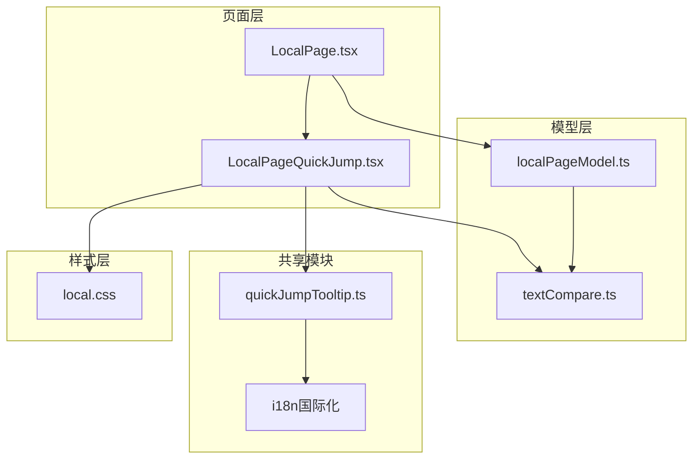
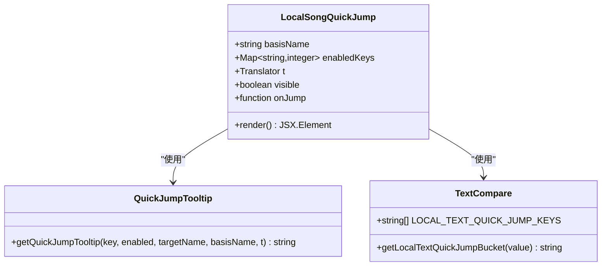
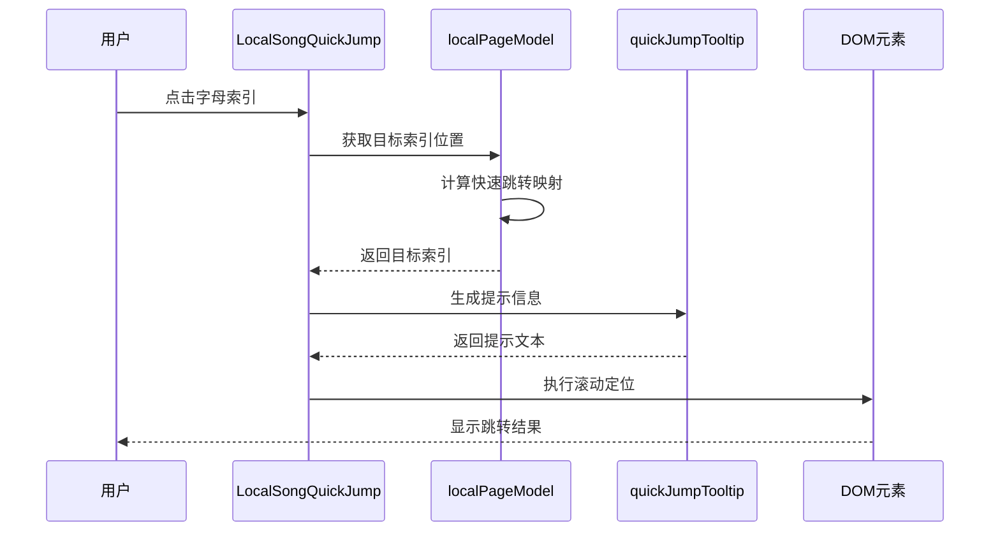
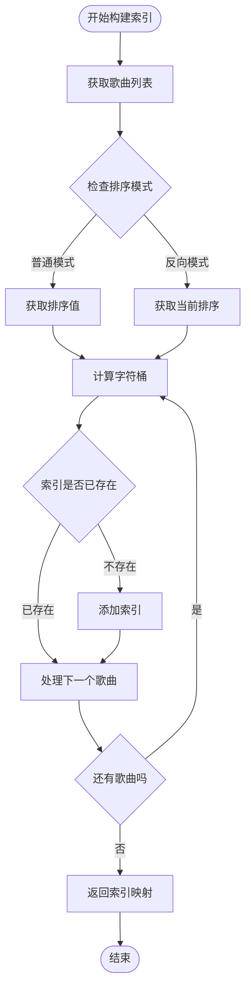
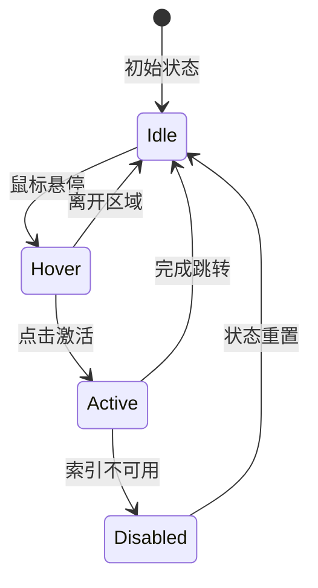
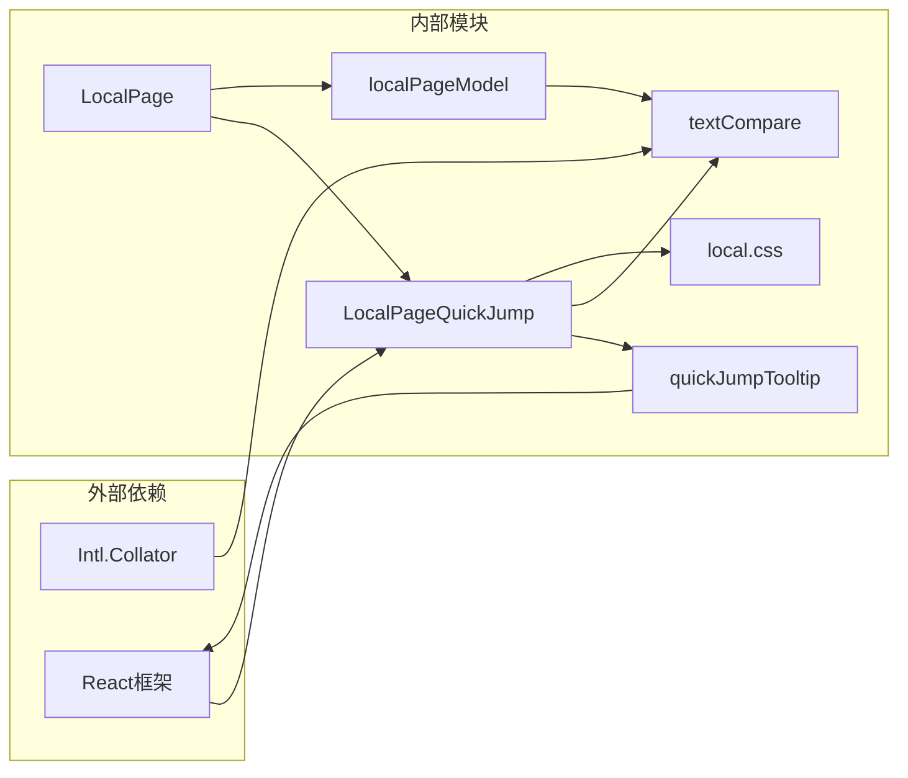

# 快速跳转导航

<cite>
**本文档引用的文件**
- [LocalPageQuickJump.tsx](file://src/pages/LocalPageQuickJump.tsx)
- [quickJumpTooltip.ts](file://src/shared/quickJumpTooltip.ts)
- [localPageModel.ts](file://src/pages/localPageModel.ts)
- [textCompare.ts](file://src/shared/textCompare.ts)
- [LocalPage.tsx](file://src/pages/LocalPage.tsx)
- [local.css](file://src/styles/local.css)
- [en-US.ts](file://src/shared/locales/en-US.ts)
- [zh-CN.ts](file://src/shared/locales/zh-CN.ts)
</cite>

## 目录
1. [简介](#简介)
2. [项目结构](#项目结构)
3. [核心组件](#核心组件)
4. [架构概览](#架构概览)
5. [详细组件分析](#详细组件分析)
6. [依赖关系分析](#依赖关系分析)
7. [性能考虑](#性能考虑)
8. [故障排除指南](#故障排除指南)
9. [结论](#结论)

## 简介

SMPlayer的快速跳转导航功能是一个专为本地音乐库设计的高效导航系统。该功能允许用户通过字母索引快速定位到特定的音乐项目，支持多种排序模式和国际化支持。本文档深入解析LocalPageQuickJump快速跳转组件的实现原理，包括字母索引生成、快速定位算法、触摸友好的交互设计等核心技术。

## 项目结构

快速跳转功能涉及多个关键文件的协作：

**图表来源**
- [LocalPage.tsx:307-312](file://src/pages/LocalPage.tsx#L307-L312)
- [LocalPageQuickJump.tsx:55-93](file://src/pages/LocalPageQuickJump.tsx#L55-L93)
- [localPageModel.ts:136-153](file://src/pages/localPageModel.ts#L136-L153)

**章节来源**
- [LocalPage.tsx:152-800](file://src/pages/LocalPage.tsx#L152-L800)
- [LocalPageQuickJump.tsx:1-94](file://src/pages/LocalPageQuickJump.tsx#L1-L94)

## 核心组件

### LocalSongQuickJump组件

LocalSongQuickJump是快速跳转功能的核心UI组件，负责渲染字母索引按钮并处理用户交互。

**图表来源**
- [LocalPageQuickJump.tsx:55-93](file://src/pages/LocalPageQuickJump.tsx#L55-L93)
- [quickJumpTooltip.ts:3-17](file://src/shared/quickJumpTooltip.ts#L3-L17)
- [textCompare.ts:6](file://src/shared/textCompare.ts#L6)

### 字母索引生成器

系统使用预定义的字母索引集合，支持特殊字符和中文拼音首字母分类：

| 索引类型 | 字符范围 | 描述 |
|---------|---------|------|
| 数字/符号 | `#` | 包含数字、符号或其他非字母字符 |
| 英文字母 | `A-Z` | 标准英文字母索引 |
| 中文字符 | `A-Z` 对应 | 基于拼音首字母的中文字符分类 |

**章节来源**
- [textCompare.ts:6](file://src/shared/textCompare.ts#L6-L77)
- [LocalPageQuickJump.tsx:74-90](file://src/pages/LocalPageQuickJump.tsx#L74-L90)

## 架构概览

快速跳转功能采用分层架构设计，确保代码的可维护性和扩展性：

**图表来源**
- [LocalPage.tsx:463-476](file://src/pages/LocalPage.tsx#L463-L476)
- [localPageModel.ts:136-153](file://src/pages/localPageModel.ts#L136-L153)
- [quickJumpTooltip.ts:3-17](file://src/shared/quickJumpTooltip.ts#L3-L17)

## 详细组件分析

### 快速跳转索引构建算法

快速跳转功能的核心在于高效的索引构建和查找机制：

**图表来源**
- [localPageModel.ts:136-153](file://src/pages/localPageModel.ts#L136-L153)
- [textCompare.ts:54-77](file://src/shared/textCompare.ts#L54-L77)

### 字符分类和国际化支持

系统实现了智能的字符分类机制，支持多语言环境：

| 字符类型 | 分类规则 | 示例 |
|---------|---------|------|
| 英文字母 | `/^[A-Z]$/` | A, B, C, ..., Z |
| 数字/符号 | 其他ASCII字符 | #, @, 1, 2, ! |
| 中文字符 | 使用拼音边界 | 阿, 芭, 擦, ..., 匝 |

**章节来源**
- [textCompare.ts:54-77](file://src/shared/textCompare.ts#L54-L77)
- [en-US.ts:55-59](file://src/shared/locales/en-US.ts#L55-L59)
- [zh-CN.ts:55-58](file://src/shared/locales/zh-CN.ts#L55-L58)

### 视觉反馈和交互设计

快速跳转组件提供了丰富的视觉反馈机制：

**图表来源**
- [local.css:647-661](file://src/styles/local.css#L647-L661)

**章节来源**
- [local.css:620-681](file://src/styles/local.css#L620-L681)

## 依赖关系分析

快速跳转功能的依赖关系清晰明确，遵循单一职责原则：

**图表来源**
- [LocalPage.tsx:152-800](file://src/pages/LocalPage.tsx#L152-L800)
- [LocalPageQuickJump.tsx:55-93](file://src/pages/LocalPageQuickJump.tsx#L55-L93)

**章节来源**
- [localPageModel.ts:1-180](file://src/pages/localPageModel.ts#L1-L180)
- [quickJumpTooltip.ts:1-18](file://src/shared/quickJumpTooltip.ts#L1-L18)

## 性能考虑

### 大列表优化策略

对于包含大量音乐项目的场景，系统采用了多项优化措施：

1. **懒加载索引构建**：仅在需要时计算和缓存索引映射
2. **智能显示条件**：当歌曲数量少于阈值时不显示快速跳转
3. **增量更新机制**：只在数据变化时重新构建索引

### 内存优化

- 使用Map数据结构存储索引映射，提供O(1)的查找性能
- 避免重复计算相同的索引值
- 及时清理不再使用的索引引用

### 渲染性能

- CSS Grid布局提供硬件加速的滚动性能
- 按需渲染字母索引按钮
- 使用CSS伪类减少JavaScript计算

## 故障排除指南

### 常见问题及解决方案

| 问题类型 | 症状 | 可能原因 | 解决方案 |
|---------|------|---------|---------|
| 索引不显示 | 字母索引按钮不可见 | 歌曲数量不足阈值 | 增加歌曲数量或调整显示条件 |
| 跳转无效 | 点击索引无响应 | 索引映射计算错误 | 检查排序模式和索引构建逻辑 |
| 提示信息错误 | 工具提示显示不正确 | 国际化资源缺失 | 确保翻译文件完整加载 |
| 样式异常 | 界面显示错乱 | CSS类名冲突 | 检查样式覆盖和优先级 |

**章节来源**
- [LocalPage.tsx:463-476](file://src/pages/LocalPage.tsx#L463-L476)
- [localPageModel.ts:136-153](file://src/pages/localPageModel.ts#L136-L153)

## 结论

SMPlayer的快速跳转导航功能通过精心设计的架构和算法，为用户提供了高效、直观的音乐库导航体验。该功能的主要优势包括：

1. **智能化索引生成**：支持多语言字符分类和动态索引构建
2. **高性能实现**：采用优化的数据结构和算法确保流畅的用户体验
3. **良好的可扩展性**：模块化的架构设计便于功能扩展和维护
4. **完整的国际化支持**：多语言环境下的本地化适配

通过本文档的详细分析，开发者可以深入理解快速跳转功能的实现原理，并在此基础上进行进一步的功能扩展和技术优化。