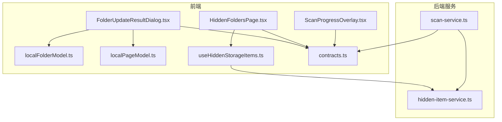
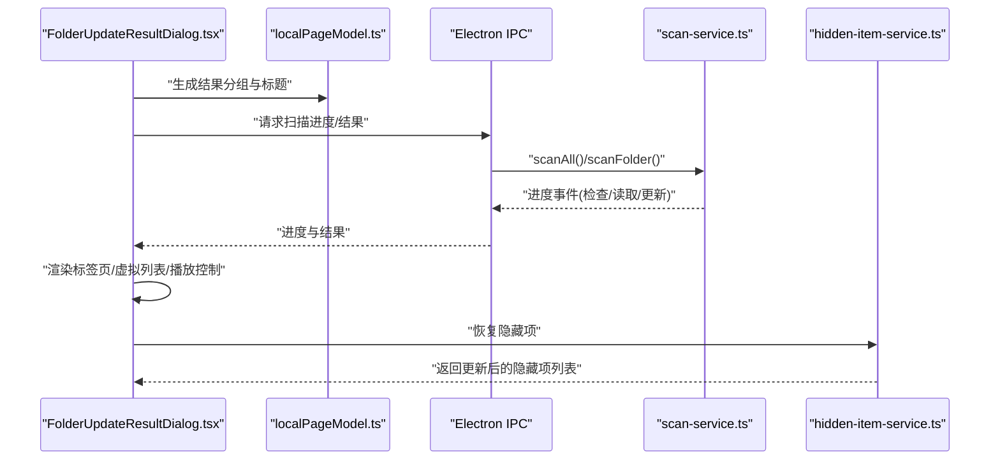
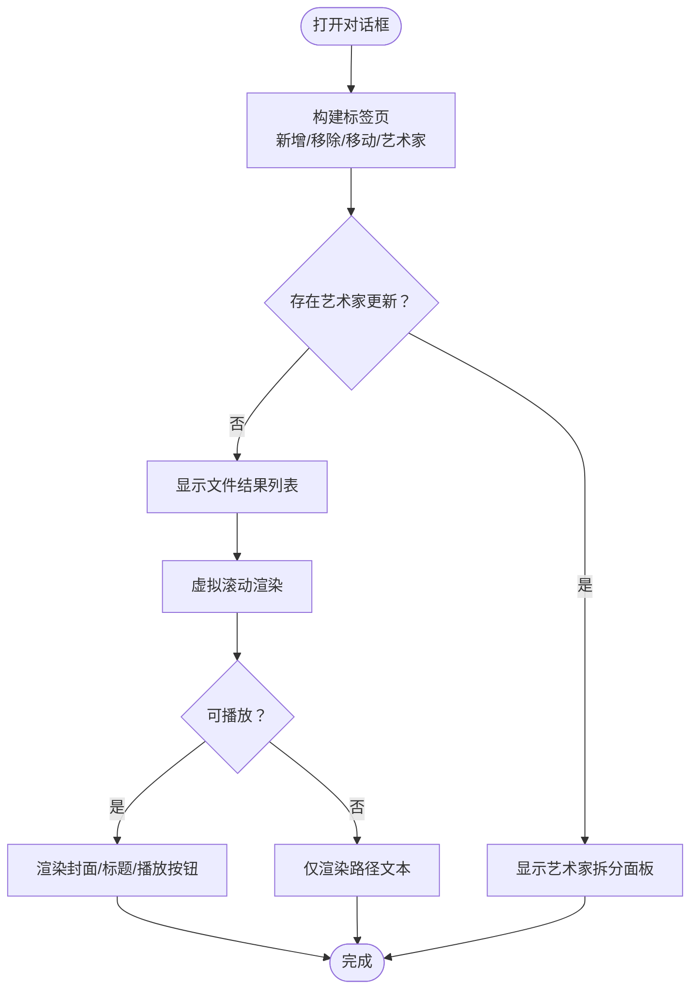
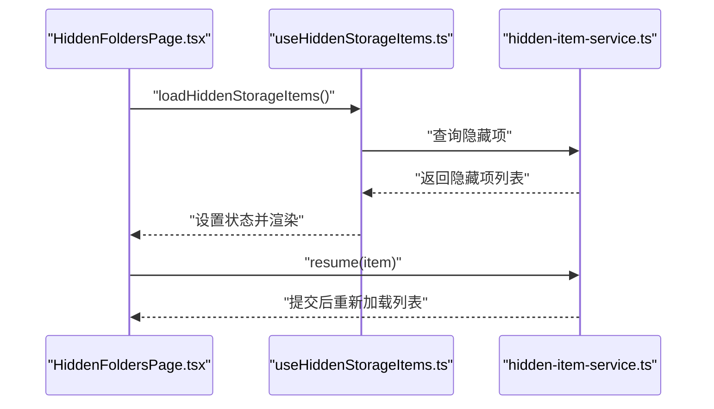
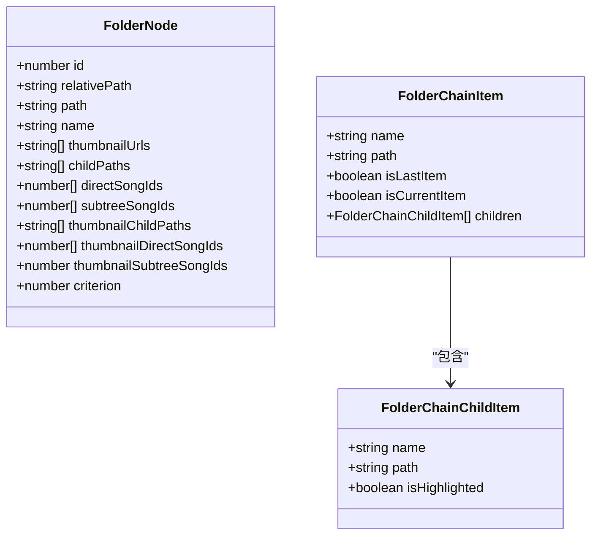
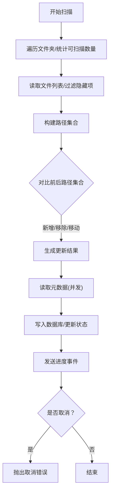
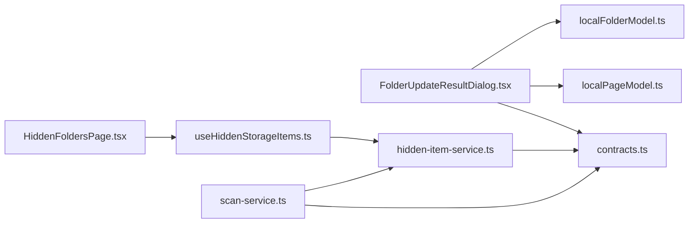

# 文件夹管理

<cite>
**本文引用的文件**
- [FolderUpdateResultDialog.tsx](file://src/pages/FolderUpdateResultDialog.tsx)
- [HiddenFoldersPage.tsx](file://src/pages/HiddenFoldersPage.tsx)
- [localFolderModel.ts](file://src/pages/localFolderModel.ts)
- [localPageModel.ts](file://src/pages/localPageModel.ts)
- [useHiddenStorageItems.ts](file://src/hooks/useHiddenStorageItems.ts)
- [scan-service.ts](file://electron/services/scan-service.ts)
- [hidden-item-service.ts](file://electron/services/hidden-item-service.ts)
- [ScanProgressOverlay.tsx](file://src/components/ScanProgressOverlay.tsx)
- [contracts.ts](file://src/shared/contracts.ts)
</cite>

## 目录
1. [简介](#简介)
2. [项目结构](#项目结构)
3. [核心组件](#核心组件)
4. [架构总览](#架构总览)
5. [详细组件分析](#详细组件分析)
6. [依赖关系分析](#依赖关系分析)
7. [性能考量](#性能考量)
8. [故障排除指南](#故障排除指南)
9. [结论](#结论)
10. [附录](#附录)

## 简介
本文件围绕 SMPlayer 的“文件夹管理”能力，系统梳理以下方面：
- FolderUpdateResultDialog：文件夹更新结果对话框的界面与交互，包括更新进度显示、结果分组与反馈、艺术家拆分建议的审阅与应用。
- HiddenFoldersPage：隐藏文件夹页面的设计与功能，包括隐藏项列表展示、恢复操作、加载与空态处理。
- localFolderModel：文件夹模型的状态管理与数据结构，涵盖路径归一化、父子关系构建、歌曲索引与排序、缩略图候选分组等。
- 扫描与更新机制：从增量扫描到冲突处理、错误映射、进度上报与取消控制。
- 最佳实践：文件夹组织建议、扫描策略配置、故障排除与性能优化。

## 项目结构
与“文件夹管理”直接相关的前端与后端模块分布如下：
- 前端页面与模型
  - 页面：FolderUpdateResultDialog.tsx、HiddenFoldersPage.tsx
  - 模型：localFolderModel.ts、localPageModel.ts
  - 钩子：useHiddenStorageItems.ts
  - 进度覆盖层：ScanProgressOverlay.tsx
  - 类型契约：contracts.ts
- 后端服务
  - 扫描服务：scan-service.ts（扫描、进度、冲突与艺术家拆分）
  - 隐藏项服务：hidden-item-service.ts（隐藏/恢复逻辑）

图表来源
- [FolderUpdateResultDialog.tsx:1-303](file://src/pages/FolderUpdateResultDialog.tsx#L1-L303)
- [HiddenFoldersPage.tsx:1-64](file://src/pages/HiddenFoldersPage.tsx#L1-L64)
- [localFolderModel.ts:1-383](file://src/pages/localFolderModel.ts#L1-L383)
- [localPageModel.ts:1-180](file://src/pages/localPageModel.ts#L1-L180)
- [useHiddenStorageItems.ts:1-25](file://src/hooks/useHiddenStorageItems.ts#L1-L25)
- [scan-service.ts:1-200](file://electron/services/scan-service.ts#L1-L200)
- [hidden-item-service.ts:1-200](file://electron/services/hidden-item-service.ts#L1-L200)
- [ScanProgressOverlay.tsx:1-127](file://src/components/ScanProgressOverlay.tsx#L1-L127)
- [contracts.ts:1-200](file://src/shared/contracts.ts#L1-L200)

章节来源
- [FolderUpdateResultDialog.tsx:1-303](file://src/pages/FolderUpdateResultDialog.tsx#L1-L303)
- [HiddenFoldersPage.tsx:1-64](file://src/pages/HiddenFoldersPage.tsx#L1-L64)
- [localFolderModel.ts:1-383](file://src/pages/localFolderModel.ts#L1-L383)
- [localPageModel.ts:1-180](file://src/pages/localPageModel.ts#L1-L180)
- [useHiddenStorageItems.ts:1-25](file://src/hooks/useHiddenStorageItems.ts#L1-L25)
- [scan-service.ts:1-200](file://electron/services/scan-service.ts#L1-L200)
- [hidden-item-service.ts:1-200](file://electron/services/hidden-item-service.ts#L1-L200)
- [ScanProgressOverlay.tsx:1-127](file://src/components/ScanProgressOverlay.tsx#L1-L127)
- [contracts.ts:1-200](file://src/shared/contracts.ts#L1-L200)

## 核心组件
- FolderUpdateResultDialog：以标签页形式展示新增、移除、移动的曲目，并在存在艺术家拆分建议时提供统一审阅面板；支持虚拟滚动、播放控制与右键菜单集成。
- HiddenFoldersPage：展示被隐藏的文件夹与文件，提供“恢复”按钮并自动刷新列表；在激活时按需加载隐藏项。
- localFolderModel：定义 FolderNode 结构与路径工具函数，负责构建文件夹树、计算父子关系、生成缩略图候选分组、排序与快速跳转索引。
- localPageModel：提供扫描结果消息拼接、路径标题生成、错误消息映射、进度文案生成等辅助方法。
- scan-service：执行全库或单文件夹扫描，统计文件、读取元数据、构建更新结果、发出进度事件、处理取消与异常。
- hidden-item-service：维护 HiddenStorageItem 表，支持隐藏/恢复文件夹与文件，同步数据库状态。
- ScanProgressOverlay：扫描过程中的进度覆盖层，显示阶段、百分比、统计计数与停止确认。

章节来源
- [FolderUpdateResultDialog.tsx:21-137](file://src/pages/FolderUpdateResultDialog.tsx#L21-L137)
- [HiddenFoldersPage.tsx:16-63](file://src/pages/HiddenFoldersPage.tsx#L16-L63)
- [localFolderModel.ts:6-101](file://src/pages/localFolderModel.ts#L6-L101)
- [localPageModel.ts:80-94](file://src/pages/localPageModel.ts#L80-L94)
- [scan-service.ts:131-200](file://electron/services/scan-service.ts#L131-L200)
- [hidden-item-service.ts:6-70](file://electron/services/hidden-item-service.ts#L6-L70)
- [ScanProgressOverlay.tsx:8-90](file://src/components/ScanProgressOverlay.tsx#L8-L90)

## 架构总览
下图展示了从前端对话框到后端扫描服务与隐藏项服务的整体流程，以及关键数据结构与接口契约。

图表来源
- [FolderUpdateResultDialog.tsx:21-137](file://src/pages/FolderUpdateResultDialog.tsx#L21-L137)
- [localPageModel.ts:46-66](file://src/pages/localPageModel.ts#L46-L66)
- [scan-service.ts:131-200](file://electron/services/scan-service.ts#L131-L200)
- [hidden-item-service.ts:105-160](file://electron/services/hidden-item-service.ts#L105-L160)

## 详细组件分析

### FolderUpdateResultDialog 组件分析
- 功能要点
  - 将扫描结果按“新增/移除/移动”三类分组，必要时显示“艺术家更新”标签页。
  - 使用虚拟滚动渲染结果列表，支持播放控制与右键菜单。
  - 通过本地歌曲映射与当前播放状态高亮当前曲目。
- 关键流程
  - 计算分组与标签页数量，根据是否存在艺术家更新动态切换活动标签。
  - 虚拟滚动通过 scrollTop 与行高估算可见区间，减少 DOM 渲染压力。
  - 对于可播放条目，渲染封面、标题与播放按钮；对于不可播放条目，仅显示路径文本。
- 错误处理与国际化
  - 通过本地化消息映射错误类型（如“目录不存在/访问被拒绝”）。
  - 支持艺术家拆分建议的审阅与批量应用。

图表来源
- [FolderUpdateResultDialog.tsx:47-137](file://src/pages/FolderUpdateResultDialog.tsx#L47-L137)
- [FolderUpdateResultDialog.tsx:139-247](file://src/pages/FolderUpdateResultDialog.tsx#L139-L247)
- [FolderUpdateResultDialog.tsx:249-303](file://src/pages/FolderUpdateResultDialog.tsx#L249-L303)

章节来源
- [FolderUpdateResultDialog.tsx:21-137](file://src/pages/FolderUpdateResultDialog.tsx#L21-L137)
- [localPageModel.ts:80-94](file://src/pages/localPageModel.ts#L80-L94)
- [contracts.ts:36-49](file://src/shared/contracts.ts#L36-L49)

### HiddenFoldersPage 组件分析
- 功能要点
  - 在页面激活时加载隐藏项列表，支持“恢复”单个隐藏项并重新加载。
  - 展示隐藏文件夹与文件，图标区分类型，空态提示。
- 数据流
  - 通过自定义 Hook useHiddenStorageItems 获取隐藏项与加载状态。
  - 调用后端隐藏项服务进行恢复，随后刷新列表。

图表来源
- [HiddenFoldersPage.tsx:16-63](file://src/pages/HiddenFoldersPage.tsx#L16-L63)
- [useHiddenStorageItems.ts:9-24](file://src/hooks/useHiddenStorageItems.ts#L9-L24)
- [hidden-item-service.ts:29-69](file://electron/services/hidden-item-service.ts#L29-L69)

章节来源
- [HiddenFoldersPage.tsx:16-63](file://src/pages/HiddenFoldersPage.tsx#L16-L63)
- [useHiddenStorageItems.ts:5-24](file://src/hooks/useHiddenStorageItems.ts#L5-L24)
- [hidden-item-service.ts:105-160](file://electron/services/hidden-item-service.ts#L105-L160)

### localFolderModel 文件夹模型分析
- 数据结构
  - FolderNode：包含相对路径、绝对路径、名称、缩略图候选、直接/子树歌曲 ID 列表、排序准则等。
  - FolderChainItem：用于面包屑导航链路。
- 核心算法
  - 路径归一化与相对/绝对路径转换。
  - 构建文件夹索引：遍历歌曲与文件夹，建立父子关系与祖先链，填充 direct/subtree 歌曲 ID。
  - 排序与快速跳转：按多准则排序，生成快速跳转索引。
  - 缩略图候选分组：按专辑分组，合并子节点候选，用于封面生成。
- 复杂度与优化
  - 构建索引时间复杂度近似 O(N+M)，其中 N 为文件夹数，M 为歌曲数；通过预排序与扁平化减少重复计算。

图表来源
- [localFolderModel.ts:6-33](file://src/pages/localFolderModel.ts#L6-L33)
- [localFolderModel.ts:86-101](file://src/pages/localFolderModel.ts#L86-L101)

章节来源
- [localFolderModel.ts:49-51](file://src/pages/localFolderModel.ts#L49-L51)
- [localFolderModel.ts:197-289](file://src/pages/localFolderModel.ts#L197-L289)
- [localFolderModel.ts:303-334](file://src/pages/localFolderModel.ts#L303-L334)
- [localFolderModel.ts:340-356](file://src/pages/localFolderModel.ts#L340-L356)

### 扫描与更新机制
- 增量扫描与冲突处理
  - 统计前后两次扫描的歌曲路径集合，识别新增、移除与可能的“移动”（同名文件一一对应）。
  - 对于文件移动，结合文件名与路径比较进行判定。
- 错误处理与国际化
  - 对目录不存在与访问被拒等错误进行标准化消息映射，便于用户理解。
- 进度上报与取消
  - 分阶段上报（检查/读取/更新），包含已处理数量、总数、新增/更新/缺失计数。
  - 支持取消操作，抛出统一取消错误。
- 性能优化
  - 并发读取音频元数据，限制并发度以平衡吞吐与资源占用。
  - 虚拟滚动与预排序减少前端渲染成本。

图表来源
- [scan-service.ts:131-200](file://electron/services/scan-service.ts#L131-L200)
- [scan-service.ts:883-898](file://electron/services/scan-service.ts#L883-L898)
- [scan-service.ts:1281-1341](file://electron/services/scan-service.ts#L1281-L1341)
- [scan-service.ts:1343-1362](file://electron/services/scan-service.ts#L1343-L1362)

章节来源
- [scan-service.ts:131-200](file://electron/services/scan-service.ts#L131-L200)
- [scan-service.ts:883-898](file://electron/services/scan-service.ts#L883-L898)
- [scan-service.ts:1281-1341](file://electron/services/scan-service.ts#L1281-L1341)
- [localPageModel.ts:105-134](file://src/pages/localPageModel.ts#L105-L134)

### 进度覆盖层与结果反馈
- ScanProgressOverlay 提供可视化的扫描进度，包含阶段文字、百分比、当前文件夹、已处理/总数、新增/更新/缺失计数，并支持取消。
- FolderUpdateResultDialog 提供更细粒度的结果反馈，按标签页分类展示文件变化，并在存在艺术家拆分建议时提供审阅面板。

章节来源
- [ScanProgressOverlay.tsx:8-90](file://src/components/ScanProgressOverlay.tsx#L8-L90)
- [FolderUpdateResultDialog.tsx:47-137](file://src/pages/FolderUpdateResultDialog.tsx#L47-L137)

## 依赖关系分析
- 前端页面依赖本地模型与契约类型，确保路径处理与结果展示一致。
- 扫描服务依赖隐藏项服务与设置服务，保证扫描范围与状态一致性。
- 隐藏项服务维护 HiddenStorageItem 表，与数据库中 Folder/File 状态双向同步。

图表来源
- [FolderUpdateResultDialog.tsx:11-15](file://src/pages/FolderUpdateResultDialog.tsx#L11-L15)
- [HiddenFoldersPage.tsx:5-7](file://src/pages/HiddenFoldersPage.tsx#L5-L7)
- [useHiddenStorageItems.ts:12-12](file://src/hooks/useHiddenStorageItems.ts#L12-L12)
- [scan-service.ts:65-90](file://electron/services/scan-service.ts#L65-L90)
- [hidden-item-service.ts:6-11](file://electron/services/hidden-item-service.ts#L6-L11)
- [contracts.ts:36-49](file://src/shared/contracts.ts#L36-L49)

章节来源
- [FolderUpdateResultDialog.tsx:11-15](file://src/pages/FolderUpdateResultDialog.tsx#L11-L15)
- [HiddenFoldersPage.tsx:5-7](file://src/pages/HiddenFoldersPage.tsx#L5-L7)
- [useHiddenStorageItems.ts:12-12](file://src/hooks/useHiddenStorageItems.ts#L12-L12)
- [scan-service.ts:65-90](file://electron/services/scan-service.ts#L65-L90)
- [hidden-item-service.ts:6-11](file://electron/services/hidden-item-service.ts#L6-L11)
- [contracts.ts:36-49](file://src/shared/contracts.ts#L36-L49)

## 性能考量
- 前端
  - 虚拟滚动：通过固定行高与可视区估算，显著降低长列表渲染开销。
  - 预排序与扁平化：在构建索引时完成排序与子树展开，避免运行时重复计算。
- 后端
  - 并发读取元数据：限制并发度以平衡吞吐与资源占用。
  - 进度分阶段上报：让用户感知扫描阶段与剩余工作量。
- 存储
  - ON CONFLICT UPSERT：减少重复写入与查询次数。
  - 双向同步隐藏状态：确保 UI 与数据库一致，避免重复扫描。

[本节为通用性能讨论，不直接分析具体文件，故无章节来源]

## 故障排除指南
- 常见错误与提示
  - “目录不存在/无法访问”：扫描服务对底层错误进行标准化，映射为用户可理解的消息。
  - “扫描被取消”：当用户点击停止时触发统一取消错误，确保资源释放。
- 操作建议
  - 若出现权限问题，检查目标文件夹的访问权限与只读属性。
  - 若扫描长时间卡在某阶段，查看进度覆盖层的当前文件夹与计数，确认是否存在大文件或网络盘延迟。
  - 恢复隐藏项后，等待后台同步完成再刷新页面，避免状态不一致。

章节来源
- [scan-service.ts:1281-1341](file://electron/services/scan-service.ts#L1281-L1341)
- [localPageModel.ts:105-116](file://src/pages/localPageModel.ts#L105-L116)
- [ScanProgressOverlay.tsx:62-90](file://src/components/ScanProgressOverlay.tsx#L62-L90)

## 结论
SMPlayer 的文件夹管理通过清晰的前端对话框与页面、稳健的后端扫描与隐藏项服务，实现了高效、可感知的文件夹更新体验。前端采用虚拟滚动与多准则排序提升交互性能，后端通过并发读取与进度上报保障可观测性与可控性。配合隐藏项的双向同步与恢复机制，用户可以灵活地组织与管理音乐库。

[本节为总结性内容，不直接分析具体文件，故无章节来源]

## 附录
- 最佳实践建议
  - 文件夹组织：保持层级扁平且语义明确，避免过深嵌套导致扫描成本上升。
  - 扫描策略：优先使用增量扫描，定期全量扫描校正；合理设置隐藏项，减少无效目录扫描。
  - 故障排除：遇到权限问题优先检查磁盘与共享权限；网络盘建议缓存至本地或使用只读挂载。
  - 性能优化：控制并发读取数量，避免同时大量写入；利用虚拟滚动与预排序减少前端负担。

[本节为通用建议，不直接分析具体文件，故无章节来源]