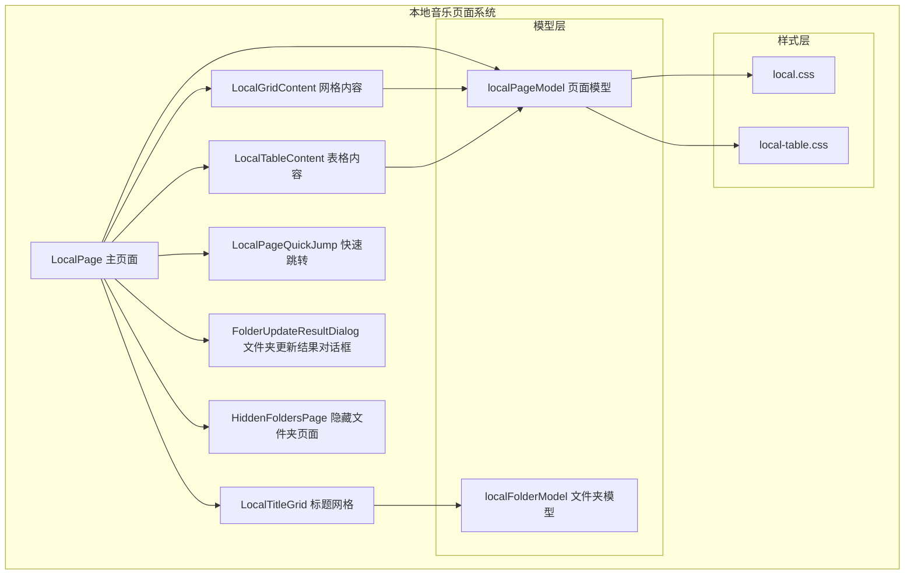
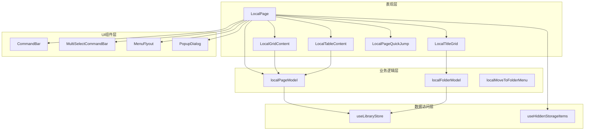
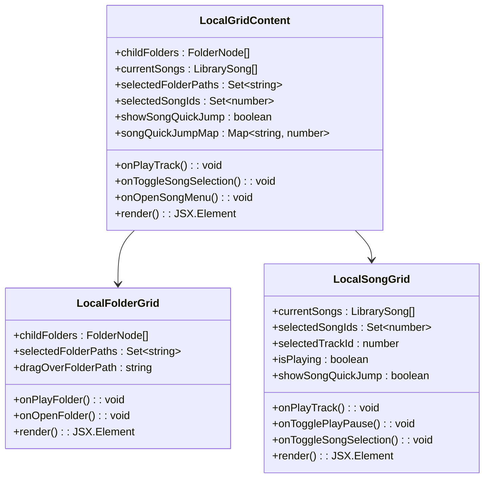
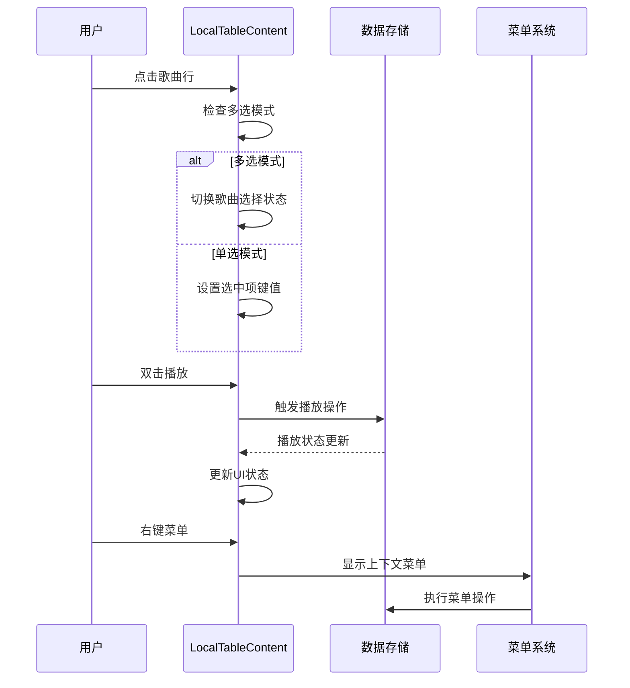
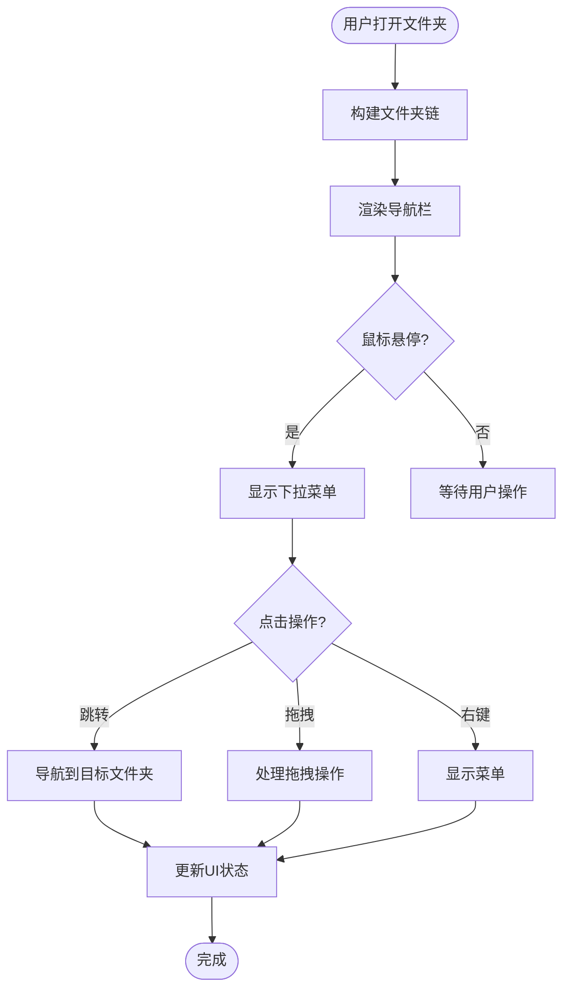
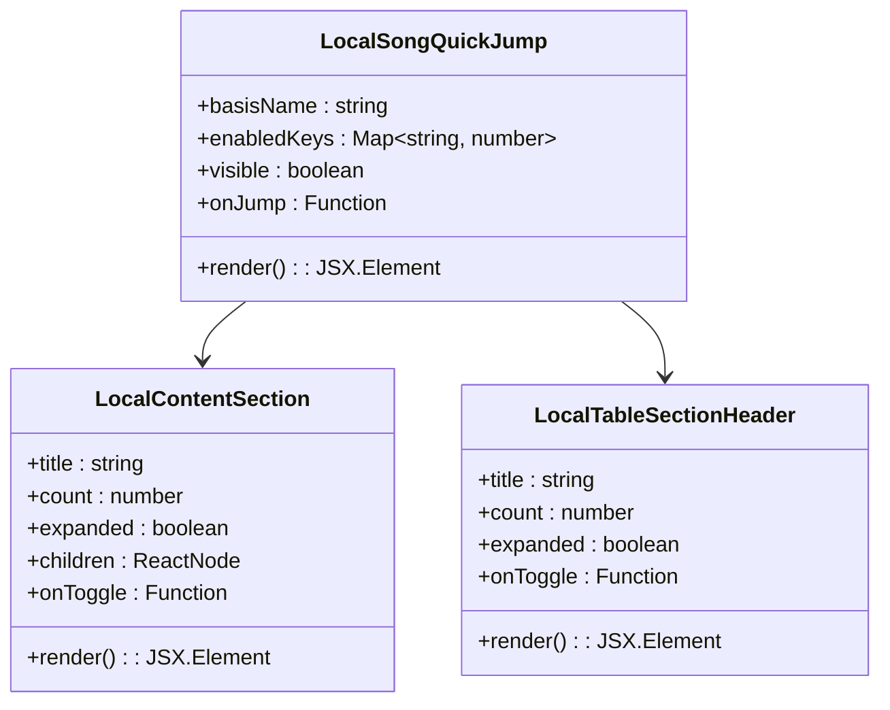
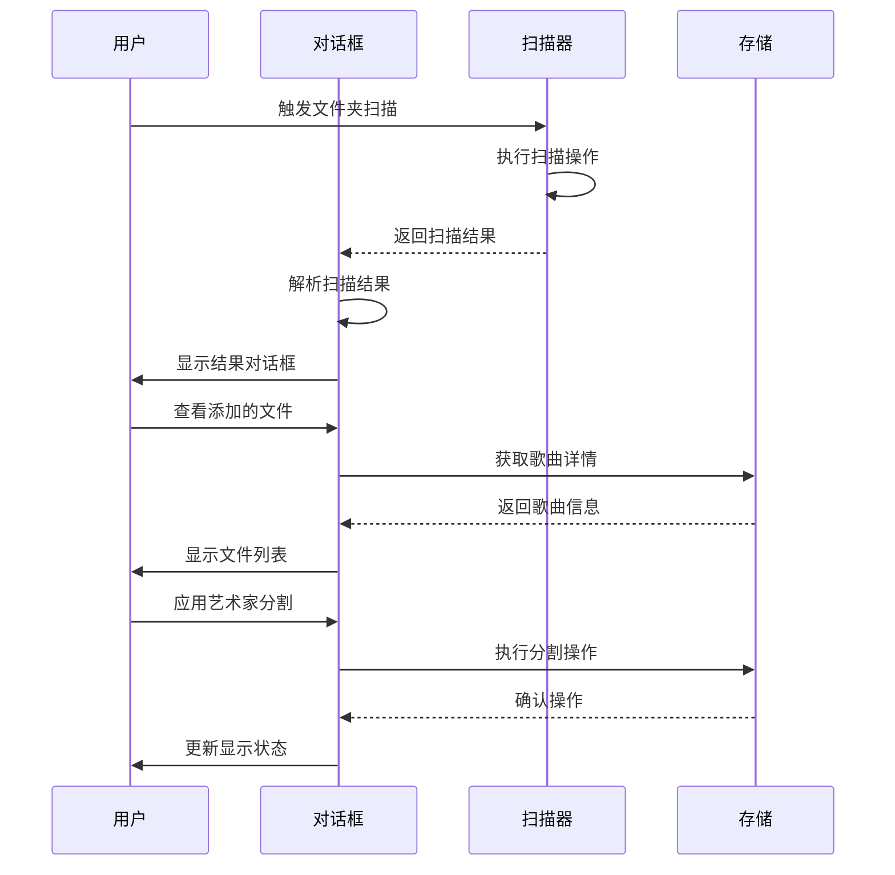
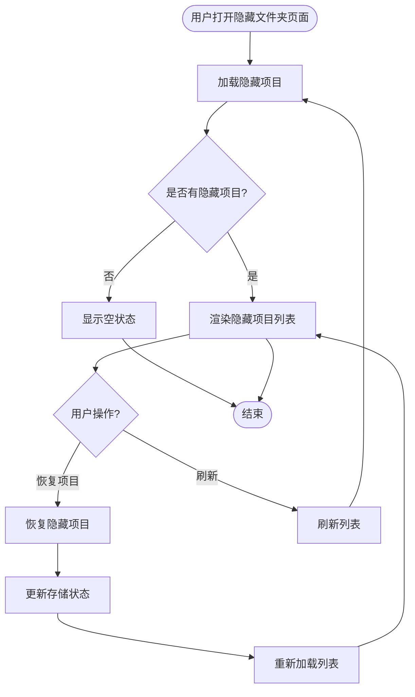
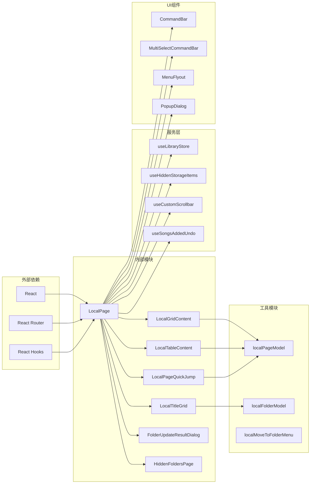

# 本地音乐页面

<cite>
**本文档引用的文件**
- [LocalPage.tsx](file://src/pages/LocalPage.tsx)
- [LocalGridContent.tsx](file://src/pages/LocalGridContent.tsx)
- [LocalTableContent.tsx](file://src/pages/LocalTableContent.tsx)
- [LocalTitleGrid.tsx](file://src/pages/LocalTitleGrid.tsx)
- [LocalPageQuickJump.tsx](file://src/pages/LocalPageQuickJump.tsx)
- [FolderUpdateResultDialog.tsx](file://src/pages/FolderUpdateResultDialog.tsx)
- [HiddenFoldersPage.tsx](file://src/pages/HiddenFoldersPage.tsx)
- [localPageModel.ts](file://src/pages/localPageModel.ts)
- [localFolderModel.ts](file://src/pages/localFolderModel.ts)
- [local.css](file://src/styles/local.css)
- [local-table.css](file://src/styles/local-table.css)
</cite>

## 目录
1. [简介](#简介)
2. [项目结构](#项目结构)
3. [核心组件](#核心组件)
4. [架构概览](#架构概览)
5. [详细组件分析](#详细组件分析)
6. [依赖关系分析](#依赖关系分析)
7. [性能考虑](#性能考虑)
8. [故障排除指南](#故障排除指南)
9. [结论](#结论)

## 简介

SMPlayer的本地音乐页面系统是一个功能完整的音乐库管理界面，提供了多种视图模式和丰富的交互功能。该系统支持网格视图和表格视图的无缝切换，具备强大的文件夹浏览能力，以及完善的音乐文件管理功能。

本地音乐页面的核心目标是为用户提供直观、高效的音乐文件组织和播放体验，支持从简单的文件夹浏览到复杂的音乐库管理操作。

## 项目结构

本地音乐页面系统采用模块化架构设计，主要包含以下核心组件：

**图表来源**
- [LocalPage.tsx:152-1566](file://src/pages/LocalPage.tsx#L152-L1566)
- [LocalGridContent.tsx:11-431](file://src/pages/LocalGridContent.tsx#L11-L431)
- [LocalTableContent.tsx:17-394](file://src/pages/LocalTableContent.tsx#L17-L394)

**章节来源**
- [LocalPage.tsx:152-1566](file://src/pages/LocalPage.tsx#L152-L1566)
- [localPageModel.ts:1-180](file://src/pages/localPageModel.ts#L1-L180)
- [localFolderModel.ts:1-383](file://src/pages/localFolderModel.ts#L1-L383)

## 核心组件

### LocalPage 主页面组件

LocalPage是本地音乐页面的核心组件，负责协调所有子组件的工作。它实现了以下关键功能：

- **视图模式管理**：支持网格视图和表格视图的动态切换
- **状态管理**：维护选择状态、拖拽状态、菜单状态等
- **数据处理**：处理音乐文件和文件夹的数据过滤、排序和搜索
- **用户交互**：提供完整的用户操作接口，包括播放控制、文件管理等

### LocalGridContent 网格内容组件

LocalGridContent专门负责网格视图的渲染，具有以下特点：

- **双列布局**：同时显示文件夹网格和歌曲网格
- **响应式设计**：根据屏幕尺寸自动调整布局
- **快速跳转**：集成字母索引功能，支持快速定位
- **拖拽支持**：完整的拖拽操作支持

### LocalTableContent 表格内容组件

LocalTableContent提供表格视图的完整实现：

- **三列布局**：名称、艺术家、专辑列
- **行内操作**：每行都提供完整的操作按钮
- **虚拟滚动**：优化大量数据的渲染性能
- **上下文菜单**：右键菜单提供丰富的操作选项

### LocalTitleGrid 标题网格组件

LocalTitleGrid实现路径导航功能：

- **文件夹链**：显示当前路径的所有父级文件夹
- **下拉菜单**：支持快速跳转到任意层级
- **拖拽支持**：支持文件夹间的拖拽操作
- **菜单集成**：与主页面菜单系统深度集成

**章节来源**
- [LocalPage.tsx:152-1566](file://src/pages/LocalPage.tsx#L152-L1566)
- [LocalGridContent.tsx:11-431](file://src/pages/LocalGridContent.tsx#L11-L431)
- [LocalTableContent.tsx:17-394](file://src/pages/LocalTableContent.tsx#L17-L394)
- [LocalTitleGrid.tsx:314-488](file://src/pages/LocalTitleGrid.tsx#L314-L488)

## 架构概览

本地音乐页面系统采用分层架构设计，确保了良好的可维护性和扩展性：

**图表来源**
- [LocalPage.tsx:152-1566](file://src/pages/LocalPage.tsx#L152-L1566)
- [localPageModel.ts:1-180](file://src/pages/localPageModel.ts#L1-L180)
- [localFolderModel.ts:1-383](file://src/pages/localFolderModel.ts#L1-L383)

系统架构的关键特点：

1. **清晰的职责分离**：每个组件都有明确的职责范围
2. **数据流单向**：采用自上而下的数据传递模式
3. **事件驱动**：通过回调函数处理用户交互
4. **状态集中管理**：使用React状态钩子管理组件状态

## 详细组件分析

### LocalGridContent 组件分析

LocalGridContent实现了复杂的网格布局系统：

**图表来源**
- [LocalGridContent.tsx:11-431](file://src/pages/LocalGridContent.tsx#L11-L431)

#### 网格布局特性

- **自适应网格**：使用CSS Grid实现自适应布局
- **响应式断点**：支持不同屏幕尺寸的布局调整
- **快速跳转集成**：在网格中嵌入字母索引功能
- **多选支持**：支持文件夹和歌曲的多选操作

#### 缩略图显示机制

LocalGridContent通过LocalFolderCard组件实现缩略图显示：

- **专辑封面**：优先显示专辑封面作为缩略图
- **占位符**：当没有封面时显示默认占位符
- **加载优化**：实现图片懒加载和错误处理
- **尺寸适配**：根据视图模式调整缩略图尺寸

**章节来源**
- [LocalGridContent.tsx:11-431](file://src/pages/LocalGridContent.tsx#L11-L431)

### LocalTableContent 组件分析

LocalTableContent提供了完整的表格视图实现：

**图表来源**
- [LocalTableContent.tsx:272-383](file://src/pages/LocalTableContent.tsx#L272-L383)

#### 表格视图特性

- **固定列宽**：名称列、艺术家列、专辑列具有固定宽度
- **行内操作**：鼠标悬停时显示操作按钮
- **虚拟滚动**：使用虚拟滚动技术优化大数据集性能
- **键盘导航**：支持键盘快捷键操作

#### 排序和筛选功能

LocalTableContent集成了完整的排序和筛选机制：

- **多字段排序**：支持按标题、艺术家、专辑排序
- **实时筛选**：支持按关键词实时筛选歌曲
- **状态保持**：排序和筛选状态在页面间保持

**章节来源**
- [LocalTableContent.tsx:17-394](file://src/pages/LocalTableContent.tsx#L17-L394)

### LocalTitleGrid 组件分析

LocalTitleGrid实现了智能的路径导航系统：

**图表来源**
- [LocalTitleGrid.tsx:314-488](file://src/pages/LocalTitleGrid.tsx#L314-L488)

#### 标题链接功能

- **路径显示**：显示从根目录到当前文件夹的完整路径
- **层级导航**：支持逐级返回上级文件夹
- **快速跳转**：下拉菜单提供快速跳转功能
- **拖拽支持**：支持文件夹间的拖拽操作

#### 快速导航实现

LocalTitleGrid通过FolderChainListView组件实现快速导航：

- **滚动导航**：支持横向滚动查看所有路径段
- **下拉菜单**：显示当前文件夹的所有子文件夹
- **高亮显示**：当前文件夹在下拉菜单中高亮显示
- **拖拽目标**：支持将文件拖拽到任意子文件夹

**章节来源**
- [LocalTitleGrid.tsx:314-488](file://src/pages/LocalTitleGrid.tsx#L314-L488)

### LocalPageQuickJump 组件分析

LocalPageQuickJump实现了高效的字母索引功能：

**图表来源**
- [LocalPageQuickJump.tsx:55-94](file://src/pages/LocalPageQuickJump.tsx#L55-L94)

#### 快速跳转算法

LocalPageQuickJump使用智能的字母索引算法：

- **索引构建**：基于歌曲标题首字母构建索引映射
- **动态启用**：只对有足够歌曲的字母启用跳转功能
- **位置计算**：计算每个字母对应的歌曲索引位置
- **响应式更新**：根据排序模式动态更新索引

#### 性能优化

- **虚拟化**：只渲染可见的字母索引按钮
- **缓存机制**：缓存索引映射以提高性能
- **条件渲染**：只有在满足条件时才显示跳转功能

**章节来源**
- [LocalPageQuickJump.tsx:55-94](file://src/pages/LocalPageQuickJump.tsx#L55-L94)
- [localPageModel.ts:136-180](file://src/pages/localPageModel.ts#L136-L180)

### FolderUpdateResultDialog 组件分析

FolderUpdateResultDialog提供了详细的文件夹更新结果反馈：

**图表来源**
- [FolderUpdateResultDialog.tsx:21-137](file://src/pages/FolderUpdateResultDialog.tsx#L21-L137)

#### 结果分类显示

FolderUpdateResultDialog将扫描结果分为三个主要类别：

- **新增文件**：显示新发现的音乐文件
- **删除文件**：显示已删除或移动的文件
- **移动文件**：显示重命名或移动的文件

#### 艺术家更新处理

对话框还处理艺术家信息的更新：

- **分割建议**：建议将相似艺术家名分割
- **合并建议**：建议将相似艺术家名合并
- **应用操作**：允许用户确认或拒绝更新

**章节来源**
- [FolderUpdateResultDialog.tsx:21-137](file://src/pages/FolderUpdateResultDialog.tsx#L21-L137)

### HiddenFoldersPage 组件分析

HiddenFoldersPage专门管理隐藏的文件夹：

**图表来源**
- [HiddenFoldersPage.tsx:16-64](file://src/pages/HiddenFoldersPage.tsx#L16-L64)

#### 隐藏项目管理

HiddenFoldersPage提供了完整的隐藏项目管理功能：

- **项目列表**：显示所有隐藏的文件夹和歌曲
- **状态指示**：区分文件夹和歌曲类型
- **批量操作**：支持批量恢复操作
- **实时更新**：恢复后自动刷新列表

#### 用户体验优化

- **加载状态**：显示加载进度指示器
- **空状态处理**：无隐藏项目时显示友好提示
- **响应式设计**：适配不同屏幕尺寸

**章节来源**
- [HiddenFoldersPage.tsx:16-64](file://src/pages/HiddenFoldersPage.tsx#L16-L64)

## 依赖关系分析

本地音乐页面系统的依赖关系体现了清晰的分层架构：

**图表来源**
- [LocalPage.tsx:152-1566](file://src/pages/LocalPage.tsx#L152-L1566)
- [localPageModel.ts:1-180](file://src/pages/localPageModel.ts#L1-L180)
- [localFolderModel.ts:1-383](file://src/pages/localFolderModel.ts#L1-L383)

### 关键依赖关系

1. **状态管理依赖**：所有组件都依赖于全局状态管理
2. **数据模型依赖**：组件之间通过数据模型进行解耦
3. **UI组件依赖**：共享基础UI组件库
4. **服务层依赖**：通过服务层抽象底层操作

### 循环依赖避免

系统通过以下方式避免循环依赖：

- **单向数据流**：数据从上往下传递
- **接口抽象**：使用接口定义组件契约
- **模块化设计**：每个模块职责单一
- **事件驱动**：通过回调函数处理交互

**章节来源**
- [LocalPage.tsx:152-1566](file://src/pages/LocalPage.tsx#L152-L1566)
- [localPageModel.ts:1-180](file://src/pages/localPageModel.ts#L1-L180)
- [localFolderModel.ts:1-383](file://src/pages/localFolderModel.ts#L1-L383)

## 性能考虑

本地音乐页面系统在多个层面进行了性能优化：

### 渲染性能优化

1. **虚拟滚动**：LargeTableContent使用虚拟滚动技术，只渲染可见区域的行
2. **条件渲染**：根据视图模式和数据量动态决定渲染策略
3. **记忆化**：使用useMemo和useCallback避免不必要的重新渲染
4. **懒加载**：图片和组件采用懒加载策略

### 内存管理

1. **对象池**：复用DOM元素和组件实例
2. **垃圾回收**：及时清理不再使用的引用
3. **状态压缩**：最小化状态存储空间

### 网络和磁盘I/O优化

1. **批量操作**：支持批量文件夹扫描和更新
2. **缓存机制**：缓存扫描结果和元数据
3. **异步处理**：后台执行耗时操作不阻塞UI

## 故障排除指南

### 常见问题及解决方案

#### 视图切换问题

**问题**：网格视图和表格视图切换异常
**解决方案**：
1. 检查视图模式状态是否正确更新
2. 确认容器元素的CSS类名正确
3. 验证响应式断点设置

#### 拖拽操作问题

**问题**：文件夹拖拽到网格区域无效
**解决方案**：
1. 检查拖拽事件处理器是否正确绑定
2. 验证拖拽数据格式和类型
3. 确认目标区域的拖拽接受状态

#### 性能问题

**问题**：大量音乐文件时页面响应缓慢
**解决方案**：
1. 启用虚拟滚动优化
2. 实施数据分页加载
3. 减少不必要的重新渲染

#### 数据同步问题

**问题**：文件夹更新后UI未及时反映
**解决方案**：
1. 检查状态更新逻辑
2. 验证数据监听器是否正常工作
3. 确认UI更新触发机制

**章节来源**
- [LocalPage.tsx:152-1566](file://src/pages/LocalPage.tsx#L152-L1566)
- [LocalGridContent.tsx:11-431](file://src/pages/LocalGridContent.tsx#L11-L431)
- [LocalTableContent.tsx:17-394](file://src/pages/LocalTableContent.tsx#L17-L394)

## 结论

SMPlayer的本地音乐页面系统展现了现代前端开发的最佳实践。通过精心设计的架构和丰富的功能实现，该系统为用户提供了高效、直观的音乐文件管理体验。

系统的主要优势包括：

1. **模块化设计**：清晰的组件职责分离，便于维护和扩展
2. **性能优化**：多层性能优化策略确保流畅的用户体验
3. **用户体验**：丰富的交互功能和友好的界面设计
4. **可扩展性**：灵活的架构支持未来功能扩展

该系统为类似音乐管理应用的开发提供了优秀的参考模板，展示了如何在保持代码质量的同时实现复杂的功能需求。