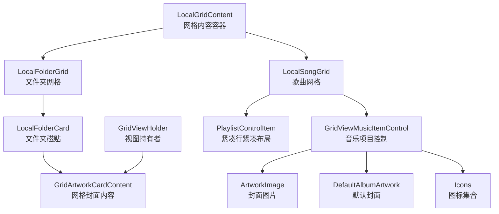
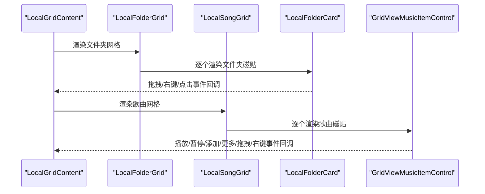
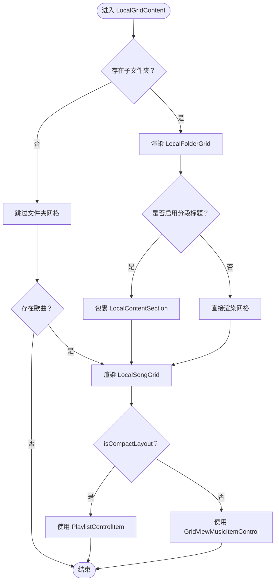
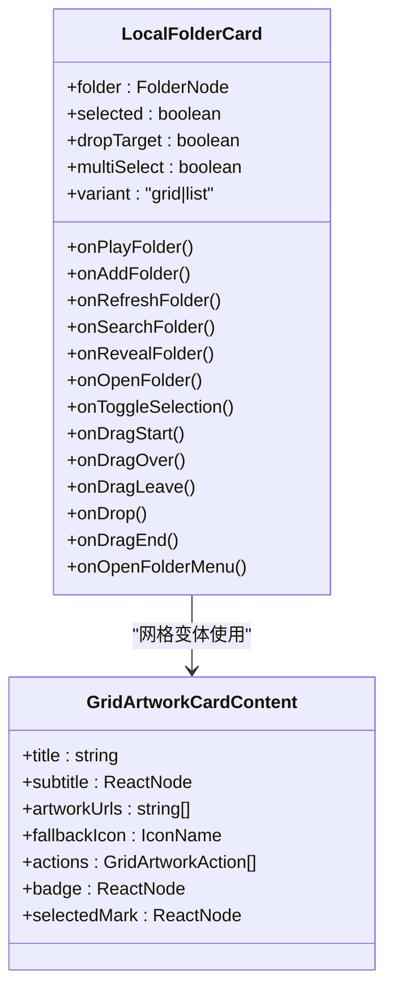
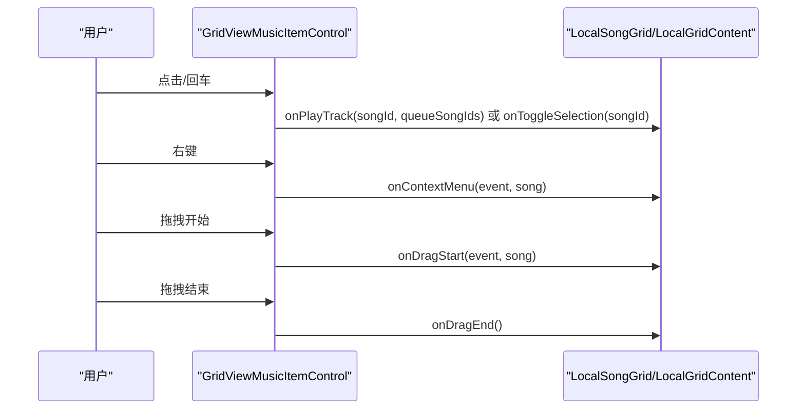
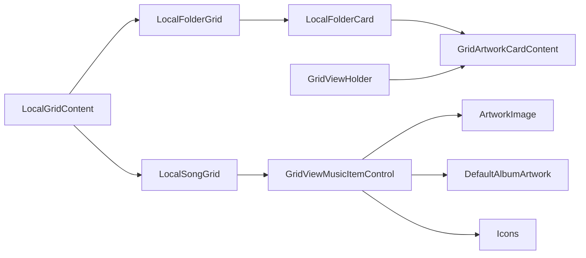

# 网格视图内容

<cite>
**本文档引用的文件**
- [LocalGridContent.tsx](file://src/pages/LocalGridContent.tsx)
- [AlbumTile.tsx](file://src/components/AlbumTile.tsx)
- [GridViewHolder.tsx](file://src/components/GridViewHolder.tsx)
- [GridViewMusicItemControl.tsx](file://src/components/GridViewMusicItemControl.tsx)
- [LocalFolderCard.tsx](file://src/components/LocalFolderCard.tsx)
- [GridArtworkCardContent.tsx](file://src/components/GridArtworkCardContent.tsx)
- [local.css](file://src/styles/local.css)
- [album-tile.css](file://src/styles/album-tile.css)
- [responsive.css](file://src/styles/responsive.css)
- [contracts.ts](file://src/shared/contracts.ts)
</cite>

## 目录
1. [简介](#简介)
2. [项目结构](#项目结构)
3. [核心组件](#核心组件)
4. [架构总览](#架构总览)
5. [详细组件分析](#详细组件分析)
6. [依赖关系分析](#依赖关系分析)
7. [性能考量](#性能考量)
8. [故障排查指南](#故障排查指南)
9. [结论](#结论)
10. [附录](#附录)

## 简介
本文件面向 SMPlayer 的“本地网格视图内容”系统，围绕 LocalGridContent 网格内容组件、AlbumTile 专辑磁贴组件、GridViewHolder 视图持有者、GridViewMusicItemControl 音乐项目控制组件进行深入解析。重点涵盖：
- 网格布局算法与响应式设计
- 缩略图显示、悬停效果、点击交互
- 视图持有者的作用与实现（容器管理、状态保持）
- 音乐项目控制组件的交互能力（选择、右键菜单、拖拽）
- 自定义选项与扩展方法（主题定制、布局调整）

## 项目结构
网格视图内容由页面级组件 LocalGridContent 负责组织，内部包含“文件夹网格”和“歌曲网格”。每个网格项由对应的子组件渲染：LocalFolderCard（文件夹）或 GridViewMusicItemControl（歌曲）。AlbumTile 用于专辑视图，GridViewHolder 用于播放列表视图卡片。

图表来源
- [LocalGridContent.tsx:11-431](file://src/pages/LocalGridContent.tsx#L11-L431)
- [LocalFolderCard.tsx:92-365](file://src/components/LocalFolderCard.tsx#L92-L365)
- [GridViewMusicItemControl.tsx:11-263](file://src/components/GridViewMusicItemControl.tsx#L11-L263)
- [GridArtworkCardContent.tsx:18-109](file://src/components/GridArtworkCardContent.tsx#L18-L109)

章节来源
- [LocalGridContent.tsx:11-431](file://src/pages/LocalGridContent.tsx#L11-L431)
- [local.css:575-620](file://src/styles/local.css#L575-L620)

## 核心组件
- LocalGridContent：负责渲染本地文件夹网格与歌曲网格，支持分段标题、快速跳转、紧凑布局切换。
- LocalFolderCard：文件夹磁贴，支持拖放、多选、右键菜单、列表/网格两种变体。
- GridViewMusicItemControl：歌曲磁贴，支持播放/暂停、添加到播放列表、更多按钮、拖拽、右键菜单、多选标记。
- GridArtworkCardContent：网格封面内容通用组件，支持单图、拼图、徽章、动作按钮。
- GridViewHolder：播放列表视图持有者（用于其他页面），支持拖拽句柄、选择态、上下文菜单。
- AlbumTile：专辑磁贴，支持悬停动作、选择标记、右键菜单。

章节来源
- [LocalGridContent.tsx:11-431](file://src/pages/LocalGridContent.tsx#L11-L431)
- [LocalFolderCard.tsx:92-365](file://src/components/LocalFolderCard.tsx#L92-L365)
- [GridViewMusicItemControl.tsx:11-263](file://src/components/GridViewMusicItemControl.tsx#L11-L263)
- [GridArtworkCardContent.tsx:18-109](file://src/components/GridArtworkCardContent.tsx#L18-L109)
- [GridViewHolder.tsx:9-116](file://src/components/GridViewHolder.tsx#L9-L116)
- [AlbumTile.tsx:8-96](file://src/components/AlbumTile.tsx#L8-L96)

## 架构总览
网格视图采用“容器-子组件”模式：
- 容器层：LocalGridContent 组织网格区域，根据 isCompactLayout 切换紧凑行或网格列。
- 子组件层：LocalFolderCard/GridViewMusicItemControl 渲染具体条目，封装交互逻辑。
- 布局层：CSS Grid 实现自动填充与响应式列数；配合媒体查询在窄屏下调整列宽与行高。
- 数据契约：contracts.ts 中的 LibrarySong/LibraryPlaylist 等接口定义数据结构。

图表来源
- [LocalGridContent.tsx:226-431](file://src/pages/LocalGridContent.tsx#L226-L431)
- [LocalFolderCard.tsx:92-365](file://src/components/LocalFolderCard.tsx#L92-L365)
- [GridViewMusicItemControl.tsx:34-263](file://src/components/GridViewMusicItemControl.tsx#L34-L263)

## 详细组件分析

### LocalGridContent 网格内容组件
- 功能职责
  - 渲染“文件夹网格”和“歌曲网格”，支持分段标题与快速跳转。
  - 根据 isCompactLayout 切换紧凑行（PlaylistControlItem）或网格列（GridViewMusicItemControl）。
  - 提供拖拽、播放、刷新、搜索、打开、右键菜单等回调。
- 关键点
  - 文件夹网格：通过 LocalFolderGrid 渲染 LocalFolderCard，支持拖放目标态与多选。
  - 歌曲网格：通过 LocalSongGrid 渲染 GridViewMusicItemControl 或 PlaylistControlItem，支持当前播放态、播放中态、选择态。
  - 快速跳转：当 showSongQuickJump 为真时，叠加 LocalSongQuickJump 并调整网格布局。

图表来源
- [LocalGridContent.tsx:11-224](file://src/pages/LocalGridContent.tsx#L11-L224)
- [LocalGridContent.tsx:226-431](file://src/pages/LocalGridContent.tsx#L226-L431)

章节来源
- [LocalGridContent.tsx:11-431](file://src/pages/LocalGridContent.tsx#L11-L431)

### LocalFolderCard 文件夹磁贴
- 功能职责
  - 支持网格/列表两种变体，网格变体使用 GridArtworkCardContent 展示封面与动作。
  - 多选模式下显示选择标记；拖放目标态高亮。
  - 支持播放文件夹、添加到播放列表、刷新、搜索、打开、右键菜单等。
- 性能与交互
  - 使用缓存签名与缓存映射避免重复计算缩略图 URL。
  - 异步解析候选组的封面快照，优先非 shell/none 来源，最多取 4 张。
  - 键盘回车/空格触发打开文件夹。

图表来源
- [LocalFolderCard.tsx:92-365](file://src/components/LocalFolderCard.tsx#L92-L365)
- [GridArtworkCardContent.tsx:18-109](file://src/components/GridArtworkCardContent.tsx#L18-L109)

章节来源
- [LocalFolderCard.tsx:13-82](file://src/components/LocalFolderCard.tsx#L13-L82)
- [LocalFolderCard.tsx:92-365](file://src/components/LocalFolderCard.tsx#L92-L365)

### GridViewMusicItemControl 音乐项目控制
- 功能职责
  - 渲染歌曲磁贴，支持播放/暂停、添加到播放列表、更多按钮、拖拽、右键菜单。
  - 多选模式下显示选择标记；当前播放/播放中态有视觉反馈。
  - 支持键盘回车/空格触发打开（切换选择或播放）。
- 交互细节
  - 右键菜单阻止默认行为并定位弹出位置。
  - 悬停动作按钮在非多选模式下可见，支持播放/添加。
  - 拖拽事件通过 onDragStart/onDragEnd 传递给上层处理。

图表来源
- [GridViewMusicItemControl.tsx:34-263](file://src/components/GridViewMusicItemControl.tsx#L34-L263)
- [LocalGridContent.tsx:305-431](file://src/pages/LocalGridContent.tsx#L305-L431)

章节来源
- [GridViewMusicItemControl.tsx:11-263](file://src/components/GridViewMusicItemControl.tsx#L11-L263)

### GridArtworkCardContent 网格封面内容
- 功能职责
  - 根据 artworkUrls 数量决定渲染策略：无图时使用 fallback 图标；1张时直接展示；2张以上拼图最多4张。
  - 支持徽章、选择标记、动作按钮（播放/添加等）。
- 性能与可访问性
  - 使用 renderFallback 回退到默认封面或文件夹图标。
  - 通过 aria-hidden 与 aria-label 提升可访问性。

章节来源
- [GridArtworkCardContent.tsx:18-109](file://src/components/GridArtworkCardContent.tsx#L18-L109)

### GridViewHolder 视图持有者
- 功能职责
  - 作为播放列表视图的卡片容器，支持选择态、拖拽句柄、上下文菜单、键盘打开。
  - 使用 GridArtworkCardContent 展示封面与动作。
- 交互细节
  - 拖拽仅在非动作按钮区域生效，左键触发拖拽。
  - 键盘 Enter/Space 打开详情。

章节来源
- [GridViewHolder.tsx:9-116](file://src/components/GridViewHolder.tsx#L9-L116)

### AlbumTile 专辑磁贴
- 功能职责
  - 专辑磁贴，支持悬停动作（播放/添加）、选择标记、右键菜单。
  - 标题与副标题支持自定义节点或字符串。
- 视觉与交互
  - 悬停时动作按钮淡入；多选模式下隐藏动作按钮。
  - 选择态使用勾选标记。

章节来源
- [AlbumTile.tsx:8-96](file://src/components/AlbumTile.tsx#L8-L96)

## 依赖关系分析
- 组件依赖
  - LocalGridContent 依赖 LocalFolderGrid/LocalSongGrid。
  - LocalFolderCard 依赖 GridArtworkCardContent。
  - GridViewMusicItemControl 依赖 ArtworkImage/DefaultAlbumArtwork/Icons。
  - GridViewHolder 依赖 GridArtworkCardContent。
- 样式依赖
  - local.css 提供网格布局、快速跳转、选择态、动作按钮等样式。
  - album-tile.css 提供专辑磁贴的悬停与选择态样式。
  - responsive.css 提供响应式断点下的网格列数与行高调整。
- 数据契约
  - contracts.ts 定义 LibrarySong/LibraryPlaylist 等数据结构，被各组件消费。

图表来源
- [LocalGridContent.tsx:11-431](file://src/pages/LocalGridContent.tsx#L11-L431)
- [LocalFolderCard.tsx:92-365](file://src/components/LocalFolderCard.tsx#L92-L365)
- [GridViewMusicItemControl.tsx:11-263](file://src/components/GridViewMusicItemControl.tsx#L11-L263)
- [GridViewHolder.tsx:9-116](file://src/components/GridViewHolder.tsx#L9-L116)

章节来源
- [local.css:575-620](file://src/styles/local.css#L575-L620)
- [album-tile.css:1-335](file://src/styles/album-tile.css#L1-L335)
- [responsive.css:1-560](file://src/styles/responsive.css#L1-L560)
- [contracts.ts:36-91](file://src/shared/contracts.ts#L36-L91)

## 性能考量
- 网格布局算法
  - 使用 CSS Grid 的 repeat(auto-fill, fixed-size) 实现自动列数填充，gap 控制间距。
  - 在窄屏下通过媒体查询减少列数，保证可读性与性能。
- 缓存与异步加载
  - LocalFolderCard 对文件夹缩略图 URL 进行签名缓存，避免重复解析。
  - 异步解析候选组封面快照，优先非 shell/none 来源，最多取 4 张，提升首屏渲染效率。
- 事件与交互
  - 右键菜单统一阻止默认行为并定位，避免全局事件干扰。
  - 键盘交互（Enter/Space）与鼠标交互一致，提升可访问性。
- 视觉反馈
  - 通过过渡动画与阴影变化提供即时反馈，但应避免过度复杂动画影响滚动性能。

章节来源
- [local.css:575-620](file://src/styles/local.css#L575-L620)
- [responsive.css:1-560](file://src/styles/responsive.css#L1-L560)
- [LocalFolderCard.tsx:13-82](file://src/components/LocalFolderCard.tsx#L13-L82)

## 故障排查指南
- 网格不换行或列数异常
  - 检查 CSS Grid 的固定宽度与 gap 设置，确保最小列宽与间距合理。
  - 确认媒体查询断点是否正确应用。
- 缩略图未显示或显示错误
  - 检查封面 URL 解析逻辑与缓存签名生成。
  - 确认候选组封面快照来源过滤条件（排除 shell/none）。
- 拖拽无效
  - 确认拖拽句柄区域与动作按钮区域的事件拦截逻辑。
  - 检查 onDragStart/onDragEnd 回调是否正确传递到父容器。
- 右键菜单不出现
  - 确认阻止了默认右键行为，并正确计算弹出位置。
- 选择态与多选冲突
  - 确保多选模式下隐藏动作按钮，避免误触。
  - 检查选择标记的显示条件与样式覆盖。

章节来源
- [local.css:575-620](file://src/styles/local.css#L575-L620)
- [LocalFolderCard.tsx:13-82](file://src/components/LocalFolderCard.tsx#L13-L82)
- [GridViewMusicItemControl.tsx:34-263](file://src/components/GridViewMusicItemControl.tsx#L34-L263)

## 结论
SMPlayer 的网格视图内容系统以 LocalGridContent 为核心容器，结合 LocalFolderCard 与 GridViewMusicItemControl 实现了灵活的本地内容展示。通过 CSS Grid 响应式布局、组件化的封面内容渲染与完善的交互事件处理，系统在功能与性能之间取得了良好平衡。AlbumTile 与 GridViewHolder 分别服务于专辑与播放列表场景，形成统一的网格卡片体系。

## 附录

### 自定义选项与扩展方法
- 主题定制
  - 通过 CSS 变量（如 --text-strong/--surface-card）统一调整文字与背景色。
  - night-mode 下的样式覆盖，确保深色主题一致性。
- 布局调整
  - 修改 CSS Grid 的列宽与间距，适配不同屏幕尺寸。
  - 使用媒体查询在窄屏下减少列数或调整行高。
- 组件扩展
  - 新增动作按钮：在 GridArtworkCardContent 的 actions 中添加新按钮。
  - 新增交互：在 GridViewMusicItemControl/LocalFolderCard 中新增回调并传递到父容器。
  - 新增变体：在 LocalFolderCard/GridViewMusicItemControl 中增加 variant 分支，扩展不同展示形态。

章节来源
- [local.css:1-800](file://src/styles/local.css#L1-L800)
- [album-tile.css:1-335](file://src/styles/album-tile.css#L1-L335)
- [responsive.css:1-560](file://src/styles/responsive.css#L1-L560)
- [GridArtworkCardContent.tsx:18-109](file://src/components/GridArtworkCardContent.tsx#L18-L109)
- [GridViewMusicItemControl.tsx:11-263](file://src/components/GridViewMusicItemControl.tsx#L11-L263)
- [LocalFolderCard.tsx:92-365](file://src/components/LocalFolderCard.tsx#L92-L365)