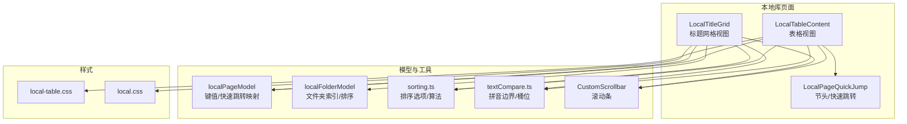
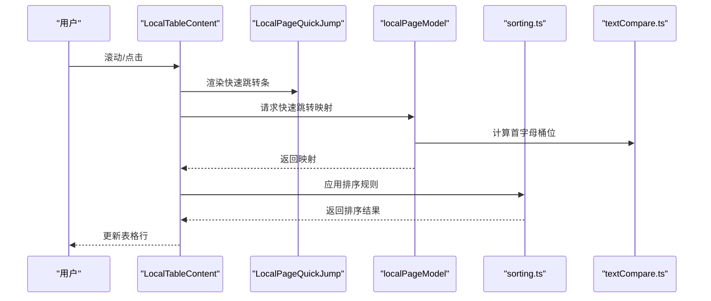
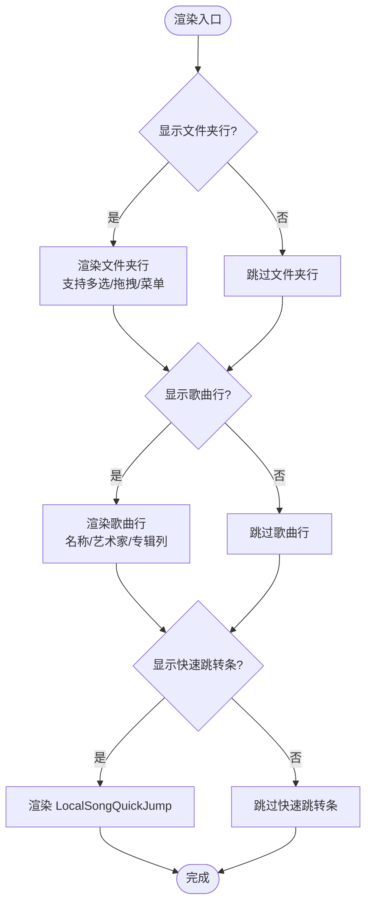
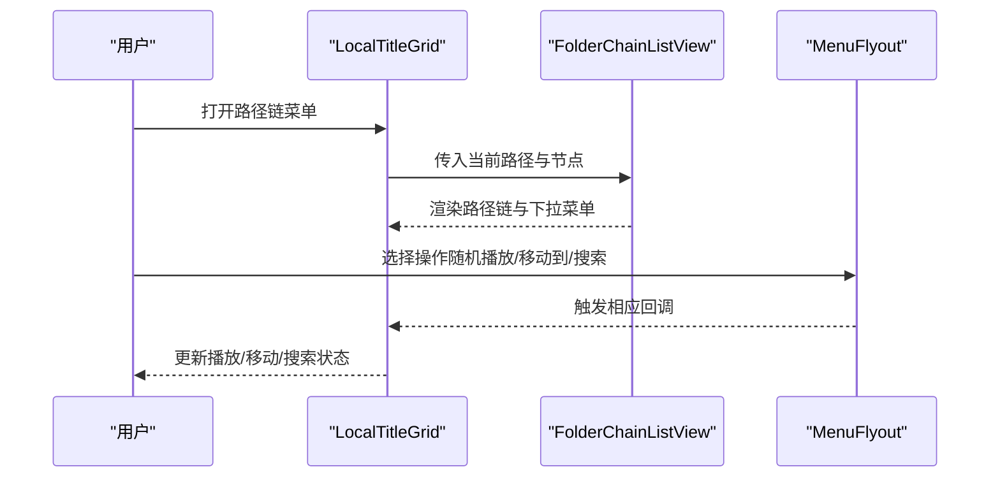
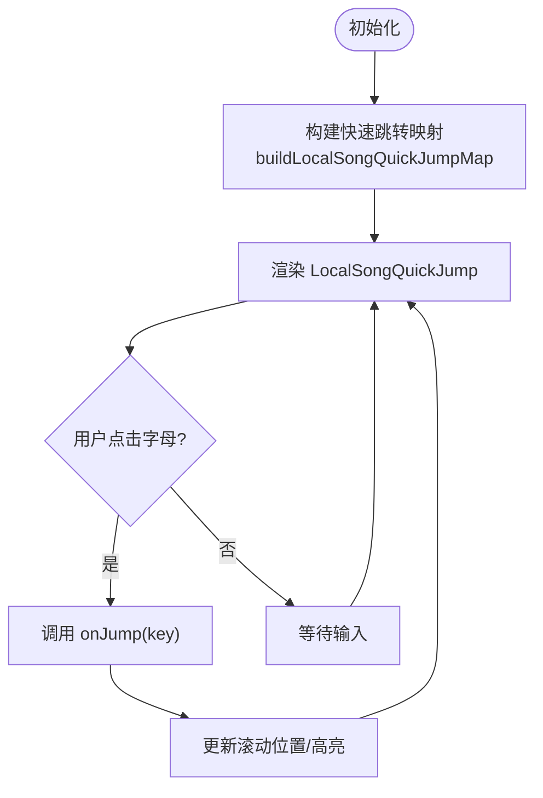
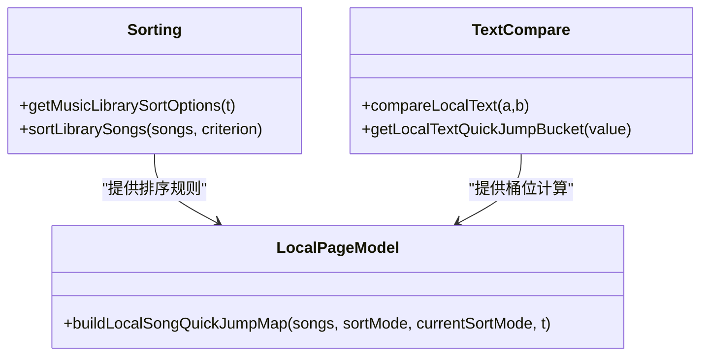
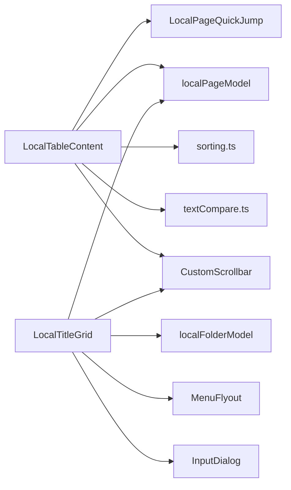

# 表格视图内容

<cite>
**本文引用的文件**
- [LocalTableContent.tsx](file://src/pages/LocalTableContent.tsx)
- [LocalTitleGrid.tsx](file://src/pages/LocalTitleGrid.tsx)
- [LocalPageQuickJump.tsx](file://src/pages/LocalPageQuickJump.tsx)
- [localPageModel.ts](file://src/pages/localPageModel.ts)
- [localFolderModel.ts](file://src/pages/localFolderModel.ts)
- [CustomScrollbar.tsx](file://src/components/CustomScrollbar.tsx)
- [local-table.css](file://src/styles/local-table.css)
- [local.css](file://src/styles/local.css)
- [sorting.ts](file://src/shared/sorting.ts)
- [textCompare.ts](file://src/shared/textCompare.ts)
- [libraryViews.ts](file://src/shared/libraryViews.ts)
</cite>

## 目录
1. [简介](#简介)
2. [项目结构](#项目结构)
3. [核心组件](#核心组件)
4. [架构总览](#架构总览)
5. [详细组件分析](#详细组件分析)
6. [依赖关系分析](#依赖关系分析)
7. [性能考量](#性能考量)
8. [故障排查指南](#故障排查指南)
9. [结论](#结论)
10. [附录](#附录)

## 简介
本文件聚焦 SMPlayer 的“本地库”页面中两种核心内容视图：表格视图（LocalTableContent）与标题网格视图（LocalTitleGrid）。我们将从数据绑定、列定义、排序与筛选机制、标题链接与快速导航、表格与网格的差异与适用场景、性能优化策略（含大数据集与虚拟滚动思路）、以及自定义选项（列显示控制、排序规则设置、视图偏好保存）等方面进行系统化说明，并提供使用示例与最佳实践建议。

## 项目结构
- LocalTableContent 负责渲染本地库的表格视图，支持文件夹分组、歌曲列表、可折叠节头、快速跳转条等。
- LocalTitleGrid 提供路径链式导航（FolderChainListView）与上下文菜单，辅助在目录树中快速定位与执行操作。
- LocalPageQuickJump 提供表格节头与歌曲快速跳转条，提升长列表浏览效率。
- localPageModel/localFolderModel 提供键值生成、快速跳转映射构建、文件夹索引与排序等基础能力。
- sorting.ts 与 textCompare.ts 提供排序选项与文本比较/拼音边界逻辑，支撑排序与快速跳转桶位计算。
- CustomScrollbar 为表格与网格提供统一的自定义滚动条交互。
- 样式文件 local-table.css 与 local.css 定义了表格与网格的视觉与交互细节。

图表来源
- [LocalTableContent.tsx:17-394](file://src/pages/LocalTableContent.tsx#L17-L394)
- [LocalTitleGrid.tsx:314-487](file://src/pages/LocalTitleGrid.tsx#L314-L487)
- [LocalPageQuickJump.tsx:31-93](file://src/pages/LocalPageQuickJump.tsx#L31-L93)
- [localPageModel.ts:136-180](file://src/pages/localPageModel.ts#L136-L180)
- [localFolderModel.ts:197-200](file://src/pages/localFolderModel.ts#L197-L200)
- [sorting.ts:5-68](file://src/shared/sorting.ts#L5-L68)
- [textCompare.ts:1-78](file://src/shared/textCompare.ts#L1-L78)
- [CustomScrollbar.tsx:1-16](file://src/components/CustomScrollbar.tsx#L1-L16)
- [local-table.css:1-1200](file://src/styles/local-table.css#L1-L1200)
- [local.css:42-77](file://src/styles/local.css#L42-L77)

章节来源
- [LocalTableContent.tsx:17-394](file://src/pages/LocalTableContent.tsx#L17-L394)
- [LocalTitleGrid.tsx:314-487](file://src/pages/LocalTitleGrid.tsx#L314-L487)
- [LocalPageQuickJump.tsx:31-93](file://src/pages/LocalPageQuickJump.tsx#L31-L93)
- [localPageModel.ts:136-180](file://src/pages/localPageModel.ts#L136-L180)
- [localFolderModel.ts:197-200](file://src/pages/localFolderModel.ts#L197-L200)
- [sorting.ts:5-68](file://src/shared/sorting.ts#L5-L68)
- [textCompare.ts:1-78](file://src/shared/textCompare.ts#L1-L78)
- [CustomScrollbar.tsx:1-16](file://src/components/CustomScrollbar.tsx#L1-L16)
- [local-table.css:1-1200](file://src/styles/local-table.css#L1-L1200)
- [local.css:42-77](file://src/styles/local.css#L42-L77)

## 核心组件
- LocalTableContent
  - 数据绑定：接收当前文件夹子节点、当前目录歌曲、选择状态、拖拽状态、播放队列等 props，按需渲染文件夹行与歌曲行。
  - 列定义：名称、艺术家、专辑三列；名称列包含图标、主文本与操作按钮；艺术家与专辑列以链接形式跳转到对应详情页。
  - 排序与筛选：通过外部传入的排序模式与快速跳转映射，结合本地文本比较与拼音边界，实现字母索引与快速跳转。
  - 快速导航：在歌曲区上方渲染 LocalSongQuickJump，支持首字母快速定位。
  - 拖拽与菜单：支持文件夹与歌曲的拖拽事件回调，右键打开上下文菜单。
- LocalTitleGrid
  - 标题链接：基于 buildFolderIndex 与 buildFolderChain 构建路径链，支持点击跳转与下拉子项展开。
  - 快速导航：路径链支持滚轮横向滚动、拖拽切换位置、下拉菜单展示子目录。
  - 上下文菜单：提供随机播放、添加到歌单、移动到文件夹、偏好设置、在资源管理器中打开、搜索目录等操作。
- LocalPageQuickJump
  - LocalTableSectionHeader：表格节头，支持展开/折叠与计数显示。
  - LocalSongQuickJump：字母索引条，根据 enabledKeys 控制可用性，触发 onJump 回调。
- localPageModel/localFolderModel
  - 键值生成：getFolderListItemKey/getSongListItemKey 统一列表项 key。
  - 快速跳转映射：buildLocalSongQuickJumpMap 基于排序模式与拼音边界生成首字母索引映射。
  - 文件夹索引：buildFolderIndex/buildFolderChain 构建目录树索引与当前路径链。
- sorting.ts/textCompare.ts
  - 排序选项：标题、艺术家、专辑、时长、播放次数、添加日期等。
  - 文本比较：Intl.Collator 支持数字排序与大小写不敏感；拼音边界用于中文首字母桶位。
- CustomScrollbar
  - 自定义滚动条容器，暴露 onThumbPointerDown 以实现统一滚动交互。

章节来源
- [LocalTableContent.tsx:17-394](file://src/pages/LocalTableContent.tsx#L17-L394)
- [LocalTitleGrid.tsx:314-487](file://src/pages/LocalTitleGrid.tsx#L314-L487)
- [LocalPageQuickJump.tsx:31-93](file://src/pages/LocalPageQuickJump.tsx#L31-L93)
- [localPageModel.ts:9-180](file://src/pages/localPageModel.ts#L9-L180)
- [localFolderModel.ts:6-101](file://src/pages/localFolderModel.ts#L6-L101)
- [sorting.ts:5-68](file://src/shared/sorting.ts#L5-L68)
- [textCompare.ts:1-78](file://src/shared/textCompare.ts#L1-L78)
- [CustomScrollbar.tsx:1-16](file://src/components/CustomScrollbar.tsx#L1-L16)

## 架构总览
表格视图与网格视图共享同一套数据源与排序/跳转逻辑，但呈现方式不同：
- 表格视图适合需要对齐列信息（标题、艺术家、专辑）的场景，便于批量操作与快捷键导航。
- 标题网格视图适合需要快速定位目录层级与执行上下文操作的场景，路径链直观且可交互。

图表来源
- [LocalTableContent.tsx:259-271](file://src/pages/LocalTableContent.tsx#L259-L271)
- [LocalPageQuickJump.tsx:55-93](file://src/pages/LocalPageQuickJump.tsx#L55-L93)
- [localPageModel.ts:136-180](file://src/pages/localPageModel.ts#L136-L180)
- [sorting.ts:24-68](file://src/shared/sorting.ts#L24-L68)
- [textCompare.ts:54-78](file://src/shared/textCompare.ts#L54-L78)

## 详细组件分析

### LocalTableContent 表格视图
- 数据绑定与渲染
  - 文件夹行：支持多选/单选、拖拽、双击进入、右键菜单；显示文件夹图标、名称与歌曲数量摘要。
  - 歌曲行：支持多选/单选、拖拽、双击播放；名称列包含当前播放指示与操作按钮（播放/加入队列/下一首）。
  - 可折叠节头：根据 showLocalSectionHeaders 控制是否显示“文件夹/全部歌曲”节头。
  - 快速跳转条：在歌曲区上方渲染 LocalSongQuickJump，启用首字母索引。
- 列定义与交互
  - 名称列：包含类型图标、主文本与动作按钮；艺术家与专辑列以链接跳转至详情页。
  - 操作按钮：鼠标悬停或聚焦时显示，避免拥挤。
- 排序与筛选
  - 外部传入排序模式与快速跳转映射，内部通过 compareLocalText 与拼音边界计算首字母桶位。
- 性能与可访问性
  - 使用自定义滚动条，提升滚动体验。
  - 通过类名控制选中态与拖拽目标态，保证可访问性。

图表来源
- [LocalTableContent.tsx:132-383](file://src/pages/LocalTableContent.tsx#L132-L383)
- [LocalPageQuickJump.tsx:55-93](file://src/pages/LocalPageQuickJump.tsx#L55-L93)

章节来源
- [LocalTableContent.tsx:17-394](file://src/pages/LocalTableContent.tsx#L17-L394)
- [local-table.css:1-1200](file://src/styles/local-table.css#L1-L1200)

### LocalTitleGrid 标题网格视图
- 路径链（FolderChainListView）
  - 基于 buildFolderIndex 与 buildFolderChain 构建当前路径链，支持点击跳转、滚轮横向滚动、拖拽切换位置、右键菜单。
  - 下拉菜单展示子目录，支持拖放目标高亮与 drop 回调。
- 上下文菜单（FolderChainMenu）
  - 随机播放、添加到歌单、移动到文件夹、偏好设置、在资源管理器中打开、搜索目录等。
- 交互细节
  - 使用 useLayoutEffect 与 ResizeObserver 保持路径链始终滚动到末尾，确保当前目录可见。
  - 自定义滚动条用于下拉菜单内部滚动。

图表来源
- [LocalTitleGrid.tsx:399-487](file://src/pages/LocalTitleGrid.tsx#L399-L487)
- [localFolderModel.ts:197-200](file://src/pages/localFolderModel.ts#L197-L200)

章节来源
- [LocalTitleGrid.tsx:314-487](file://src/pages/LocalTitleGrid.tsx#L314-L487)
- [localFolderModel.ts:197-200](file://src/pages/localFolderModel.ts#L197-L200)

### LocalPageQuickJump 快速跳转
- LocalTableSectionHeader：表格节头，支持展开/折叠与计数显示。
- LocalSongQuickJump：根据 enabledKeys 生成首字母索引条，点击触发 onJump 回调，结合 getQuickJumpTooltip 提示信息。

图表来源
- [LocalPageQuickJump.tsx:55-93](file://src/pages/LocalPageQuickJump.tsx#L55-L93)
- [localPageModel.ts:136-180](file://src/pages/localPageModel.ts#L136-L180)
- [textCompare.ts:54-78](file://src/shared/textCompare.ts#L54-L78)

章节来源
- [LocalPageQuickJump.tsx:31-93](file://src/pages/LocalPageQuickJump.tsx#L31-L93)
- [localPageModel.ts:136-180](file://src/pages/localPageModel.ts#L136-L180)
- [textCompare.ts:54-78](file://src/shared/textCompare.ts#L54-L78)

### 排序与筛选机制
- 排序选项
  - 标题、艺术家、专辑、时长、播放次数、添加日期。
  - sortLibrarySongs 实现多字段排序，优先级与回退规则明确。
- 文本比较与拼音边界
  - compareLocalText 使用 Intl.Collator，支持数字与大小写不敏感排序。
  - getLocalTextQuickJumpBucket 将首字符归入 # 或 A-Z 桶位，中文按拼音边界映射。
- 快速跳转映射
  - buildLocalSongQuickJumpMap 基于当前排序模式与拼音边界生成首字母索引，仅记录每个桶位的第一个索引。

图表来源
- [sorting.ts:5-68](file://src/shared/sorting.ts#L5-L68)
- [textCompare.ts:43-78](file://src/shared/textCompare.ts#L43-L78)
- [localPageModel.ts:136-180](file://src/pages/localPageModel.ts#L136-L180)

章节来源
- [sorting.ts:5-68](file://src/shared/sorting.ts#L5-L68)
- [textCompare.ts:43-78](file://src/shared/textCompare.ts#L43-L78)
- [localPageModel.ts:136-180](file://src/pages/localPageModel.ts#L136-L180)

## 依赖关系分析
- 组件耦合
  - LocalTableContent 依赖 LocalPageQuickJump、localPageModel、sorting、textCompare、CustomScrollbar。
  - LocalTitleGrid 依赖 localFolderModel、localPageModel、CustomScrollbar、MenuFlyout、InputDialog。
- 外部依赖
  - Intl.Collator 用于本地化文本比较与拼音边界。
  - React Hooks（useMemo/useLayoutEffect/useEffect）用于性能优化与 DOM 同步。

图表来源
- [LocalTableContent.tsx:17-394](file://src/pages/LocalTableContent.tsx#L17-L394)
- [LocalTitleGrid.tsx:314-487](file://src/pages/LocalTitleGrid.tsx#L314-L487)
- [localPageModel.ts:136-180](file://src/pages/localPageModel.ts#L136-L180)
- [localFolderModel.ts:197-200](file://src/pages/localFolderModel.ts#L197-L200)
- [sorting.ts:5-68](file://src/shared/sorting.ts#L5-L68)
- [textCompare.ts:1-78](file://src/shared/textCompare.ts#L1-L78)
- [CustomScrollbar.tsx:1-16](file://src/components/CustomScrollbar.tsx#L1-L16)

章节来源
- [LocalTableContent.tsx:17-394](file://src/pages/LocalTableContent.tsx#L17-L394)
- [LocalTitleGrid.tsx:314-487](file://src/pages/LocalTitleGrid.tsx#L314-L487)
- [localPageModel.ts:136-180](file://src/pages/localPageModel.ts#L136-L180)
- [localFolderModel.ts:197-200](file://src/pages/localFolderModel.ts#L197-L200)
- [sorting.ts:5-68](file://src/shared/sorting.ts#L5-L68)
- [textCompare.ts:1-78](file://src/shared/textCompare.ts#L1-L78)
- [CustomScrollbar.tsx:1-16](file://src/components/CustomScrollbar.tsx#L1-L16)

## 性能考量
- 大数据集处理
  - LocalTableContent 当前未采用虚拟滚动，建议在歌曲量较大时引入虚拟滚动（如固定行高 + 顶部/底部占位），仅渲染可视区域内的行，减少 DOM 节点数量。
  - 可参考 MusicLibraryPage 中的虚拟滚动实现思路（行高固定、顶部/底部占位、可视区域计算与重绘调度）。
- 滚动条性能
  - CustomScrollbar 使用 requestAnimationFrame 与 ResizeObserver 优化滚动条尺寸与位置更新，降低主线程压力。
- 排序与映射缓存
  - buildLocalSongQuickJumpMap 与 buildFolderIndex 使用 useMemo 缓存计算结果，避免重复遍历与排序。
- 文本比较
  - Intl.Collator 在首次创建时可能有开销，建议在应用启动阶段预热或复用实例。

章节来源
- [LocalTableContent.tsx:272-383](file://src/pages/LocalTableContent.tsx#L272-L383)
- [MusicLibraryPage.tsx:600-619](file://src/pages/MusicLibraryPage.tsx#L600-L619)
- [CustomScrollbar.tsx:1-16](file://src/components/CustomScrollbar.tsx#L1-L16)
- [localPageModel.ts:136-180](file://src/pages/localPageModel.ts#L136-L180)
- [localFolderModel.ts:197-200](file://src/pages/localFolderModel.ts#L197-L200)

## 故障排查指南
- 快速跳转无效
  - 检查 enabledKeys 是否为空或未正确构建；确认 getLocalTextQuickJumpBucket 的首字符提取逻辑。
- 排序异常
  - 确认排序 criterion 与 sortLibrarySongs 的分支匹配；检查 compareDate 对非法日期的处理。
- 路径链不显示或无法点击
  - 检查 buildFolderIndex 与 buildFolderChain 的返回值；确认 currentRelativePath 与 rootPath 的规范化。
- 滚动条不响应
  - 确认 onThumbPointerDown 的传递与 CustomScrollbar 的 ref 绑定；检查 useLayoutEffect 的副作用清理。

章节来源
- [LocalPageQuickJump.tsx:55-93](file://src/pages/LocalPageQuickJump.tsx#L55-L93)
- [localPageModel.ts:136-180](file://src/pages/localPageModel.ts#L136-L180)
- [sorting.ts:24-68](file://src/shared/sorting.ts#L24-L68)
- [localFolderModel.ts:197-200](file://src/pages/localFolderModel.ts#L197-L200)
- [CustomScrollbar.tsx:1-16](file://src/components/CustomScrollbar.tsx#L1-L16)

## 结论
LocalTableContent 与 LocalTitleGrid 分别针对“数据对齐与批量操作”的表格视图与“路径导航与上下文操作”的网格视图提供了完整实现。通过排序与快速跳转机制，用户可在大型本地库中高效浏览与操作。建议在大规模数据场景下引入虚拟滚动与更精细的缓存策略，以进一步提升性能与用户体验。

## 附录
- 使用示例与最佳实践
  - 表格视图
    - 在父组件中维护排序模式与快速跳转映射，通过 props 传入 LocalTableContent。
    - 使用 getSongArtists 与链接跳转到艺术家/专辑详情页，增强导航体验。
    - 为歌曲行提供操作按钮（播放/加入队列/下一首），并在 hover/focus 时显示。
  - 标题网格视图
    - 使用 FolderChainListView 展示路径链，支持滚轮横向滚动与拖拽切换。
    - 为每个路径段提供右键菜单，包含随机播放、移动到文件夹、搜索目录等常用操作。
  - 自定义选项
    - 列显示控制：通过 showFolderItems/showSongItems 控制是否渲染文件夹/歌曲行。
    - 排序规则设置：通过 MusicLibrarySortCriterion 与 sortLibrarySongs 设置排序。
    - 视图偏好保存：将排序模式、展开状态、快速跳转开关等持久化到偏好存储中。

章节来源
- [LocalTableContent.tsx:17-394](file://src/pages/LocalTableContent.tsx#L17-L394)
- [LocalTitleGrid.tsx:314-487](file://src/pages/LocalTitleGrid.tsx#L314-L487)
- [sorting.ts:5-22](file://src/shared/sorting.ts#L5-L22)
- [libraryViews.ts:110-279](file://src/shared/libraryViews.ts#L110-L279)