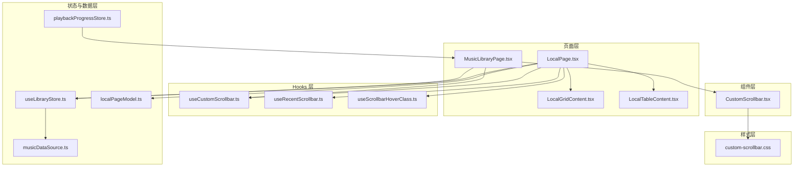
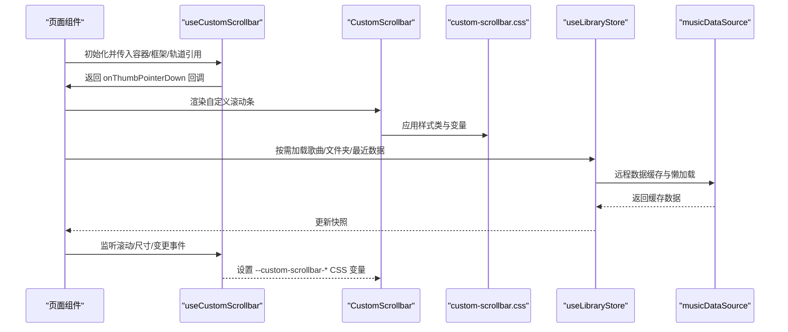
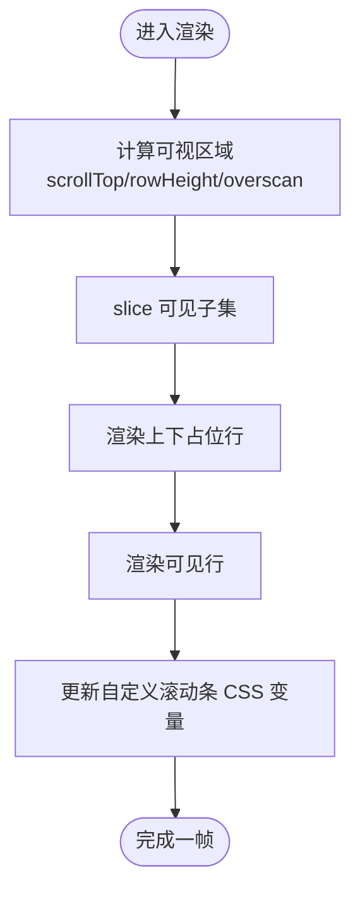
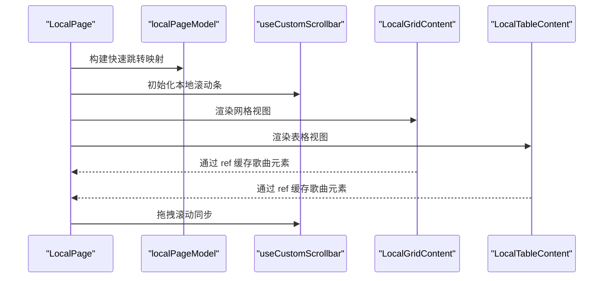
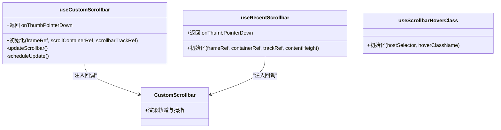
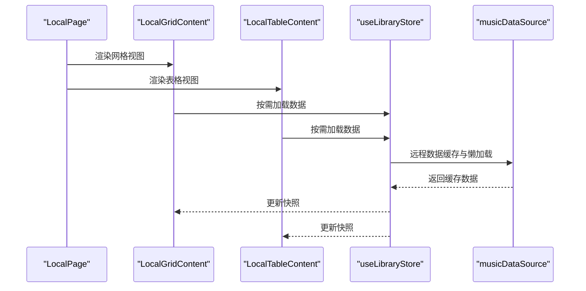
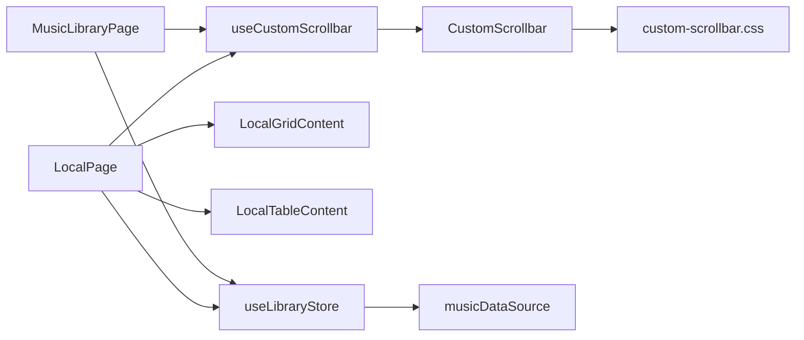

# 页面性能优化

<cite>
**本文引用的文件**
- [MusicLibraryPage.tsx](file://src/pages/MusicLibraryPage.tsx)
- [LocalPage.tsx](file://src/pages/LocalPage.tsx)
- [useCustomScrollbar.ts](file://src/hooks/useCustomScrollbar.ts)
- [useRecentScrollbar.ts](file://src/hooks/useRecentScrollbar.ts)
- [useScrollbarHoverClass.ts](file://src/hooks/useScrollbarHoverClass.ts)
- [CustomScrollbar.tsx](file://src/components/CustomScrollbar.tsx)
- [custom-scrollbar.css](file://src/styles/custom-scrollbar.css)
- [localPageModel.ts](file://src/pages/localPageModel.ts)
- [LocalGridContent.tsx](file://src/pages/LocalGridContent.tsx)
- [LocalTableContent.tsx](file://src/pages/LocalTableContent.tsx)
- [useLibraryStore.ts](file://src/state/useLibraryStore.ts)
- [musicDataSource.ts](file://src/data/musicDataSource.ts)
- [playbackProgressStore.ts](file://src/state/playbackProgressStore.ts)
</cite>

## 目录
1. [简介](#简介)
2. [项目结构](#项目结构)
3. [核心组件](#核心组件)
4. [架构总览](#架构总览)
5. [详细组件分析](#详细组件分析)
6. [依赖关系分析](#依赖关系分析)
7. [性能考量](#性能考量)
8. [故障排查指南](#故障排查指南)
9. [结论](#结论)
10. [附录](#附录)

## 简介
本文件聚焦于 SMPlayer 的页面性能优化实践，围绕以下主题展开：
- MusicLibraryPage 虚拟滚动实现：可视区域计算、行高管理、滚动性能优化
- LocalPage 性能优化策略：大文件列表处理、内存管理、渲染优化
- 自定义滚动条 Hook 设计与优化效果：useCustomScrollbar、useRecentScrollbar、useScrollbarHoverClass
- 页面懒加载策略：组件延迟加载、图片懒加载、数据分页
- 页面缓存策略：数据缓存、组件缓存、状态持久化
- 性能监控与调试方法：指标采集、瓶颈定位、优化建议

## 项目结构
本节从性能角度梳理与页面渲染、滚动、数据加载相关的模块组织方式。

图表来源
- [MusicLibraryPage.tsx:1-1001](file://src/pages/MusicLibraryPage.tsx#L1-L1001)
- [LocalPage.tsx:1-1566](file://src/pages/LocalPage.tsx#L1-L1566)
- [useCustomScrollbar.ts:1-96](file://src/hooks/useCustomScrollbar.ts#L1-L96)
- [useRecentScrollbar.ts:1-78](file://src/hooks/useRecentScrollbar.ts#L1-L78)
- [useScrollbarHoverClass.ts:1-56](file://src/hooks/useScrollbarHoverClass.ts#L1-L56)
- [CustomScrollbar.tsx:1-16](file://src/components/CustomScrollbar.tsx#L1-L16)
- [custom-scrollbar.css:1-63](file://src/styles/custom-scrollbar.css#L1-L63)
- [localPageModel.ts:1-180](file://src/pages/localPageModel.ts#L1-L180)
- [useLibraryStore.ts:1-200](file://src/state/useLibraryStore.ts#L1-L200)
- [musicDataSource.ts:211-251](file://src/data/musicDataSource.ts#L211-L251)
- [playbackProgressStore.ts:1-51](file://src/state/playbackProgressStore.ts#L1-L51)

章节来源
- [MusicLibraryPage.tsx:1-1001](file://src/pages/MusicLibraryPage.tsx#L1-L1001)
- [LocalPage.tsx:1-1566](file://src/pages/LocalPage.tsx#L1-L1566)
- [useCustomScrollbar.ts:1-96](file://src/hooks/useCustomScrollbar.ts#L1-L96)
- [useRecentScrollbar.ts:1-78](file://src/hooks/useRecentScrollbar.ts#L1-L78)
- [useScrollbarHoverClass.ts:1-56](file://src/hooks/useScrollbarHoverClass.ts#L1-L56)
- [CustomScrollbar.tsx:1-16](file://src/components/CustomScrollbar.tsx#L1-L16)
- [custom-scrollbar.css:1-63](file://src/styles/custom-scrollbar.css#L1-L63)
- [localPageModel.ts:1-180](file://src/pages/localPageModel.ts#L1-L180)
- [useLibraryStore.ts:1-200](file://src/state/useLibraryStore.ts#L1-L200)
- [musicDataSource.ts:211-251](file://src/data/musicDataSource.ts#L211-L251)
- [playbackProgressStore.ts:1-51](file://src/state/playbackProgressStore.ts#L1-L51)

## 核心组件
- MusicLibraryPage：实现音乐库表格的虚拟滚动、列宽与排序、快速跳转、自定义滚动条集成
- LocalPage：本地库页面，包含网格/表格视图、多选、拖拽、快速跳转、自定义滚动条
- 自定义滚动条体系：CustomScrollbar 组件 + useCustomScrollbar/useRecentScrollbar/useScrollbarHoverClass Hooks
- LocalPage 模型：构建快速跳转映射、比较函数、集合相等性判断等工具
- 数据与状态：useLibraryStore 提供懒加载与增量更新；musicDataSource 提供远程数据缓存；playbackProgressStore 提供播放进度外部状态订阅

章节来源
- [MusicLibraryPage.tsx:82-690](file://src/pages/MusicLibraryPage.tsx#L82-L690)
- [LocalPage.tsx:152-800](file://src/pages/LocalPage.tsx#L152-L800)
- [CustomScrollbar.tsx:9-15](file://src/components/CustomScrollbar.tsx#L9-L15)
- [useCustomScrollbar.ts:11-95](file://src/hooks/useCustomScrollbar.ts#L11-L95)
- [useRecentScrollbar.ts:3-77](file://src/hooks/useRecentScrollbar.ts#L3-L77)
- [useScrollbarHoverClass.ts:3-55](file://src/hooks/useScrollbarHoverClass.ts#L3-L55)
- [localPageModel.ts:136-180](file://src/pages/localPageModel.ts#L136-L180)
- [useLibraryStore.ts:111-200](file://src/state/useLibraryStore.ts#L111-L200)
- [musicDataSource.ts:211-251](file://src/data/musicDataSource.ts#L211-L251)
- [playbackProgressStore.ts:45-51](file://src/state/playbackProgressStore.ts#L45-L51)

## 架构总览
下图展示页面渲染、滚动与数据流的关键交互：

图表来源
- [MusicLibraryPage.tsx:315-320](file://src/pages/MusicLibraryPage.tsx#L315-L320)
- [LocalPage.tsx:385-396](file://src/pages/LocalPage.tsx#L385-L396)
- [useCustomScrollbar.ts:18-62](file://src/hooks/useCustomScrollbar.ts#L18-L62)
- [CustomScrollbar.tsx:9-15](file://src/components/CustomScrollbar.tsx#L9-L15)
- [custom-scrollbar.css:16-63](file://src/styles/custom-scrollbar.css#L16-L63)
- [useLibraryStore.ts:145-200](file://src/state/useLibraryStore.ts#L145-L200)
- [musicDataSource.ts:211-251](file://src/data/musicDataSource.ts#L211-L251)

## 详细组件分析

### MusicLibraryPage 虚拟滚动实现
- 可视区域计算
  - 基于 scrollTop、容器高度与行高计算可见起止索引，并增加 overscan 行数以减少滚动边界闪烁
  - 使用 slice 渲染可见子集，顶部/底部使用固定高度占位行撑开真实内容高度
- 行高管理
  - 根据布局模式选择不同行高常量，支持紧凑/宽版布局切换
- 滚动性能优化
  - 使用 useMemo 缓存排序结果与队列 ID 列表，避免重复计算
  - 使用 ResizeObserver/MutationObserver/scroll 事件监听配合 requestAnimationFrame 节流更新
  - 自定义滚动条通过 CSS 变量驱动，避免强制重排
- 快速跳转
  - 基于当前列的快速桶映射，结合方向与键值进行跳转
- 集成自定义滚动条
  - 将 onThumbPointerDown 回调绑定到自定义滚动条，实现平滑拖拽滚动

图表来源
- [MusicLibraryPage.tsx:114-142](file://src/pages/MusicLibraryPage.tsx#L114-L142)
- [MusicLibraryPage.tsx:464-610](file://src/pages/MusicLibraryPage.tsx#L464-L610)
- [useCustomScrollbar.ts:18-62](file://src/hooks/useCustomScrollbar.ts#L18-L62)

章节来源
- [MusicLibraryPage.tsx:114-142](file://src/pages/MusicLibraryPage.tsx#L114-L142)
- [MusicLibraryPage.tsx:464-610](file://src/pages/MusicLibraryPage.tsx#L464-L610)
- [useCustomScrollbar.ts:18-62](file://src/hooks/useCustomScrollbar.ts#L18-L62)

### LocalPage 性能优化策略
- 大文件列表处理
  - 通过 useMemo 对当前目录歌曲与文件夹进行排序与过滤，避免每次渲染重复计算
  - 使用快速跳转映射（buildLocalSongQuickJumpMap）在长列表中快速定位
- 内存管理
  - 通过 useLayoutEffect 在路径切换时重置滚动位置，减少滚动状态残留
  - 选择性地清理无效选择项与菜单状态，避免集合膨胀
- 渲染优化
  - 采用网格/表格双视图，按需渲染分组标题与展开状态
  - 使用 ref 数组缓存歌曲元素，支持快速跳转滚动定位
- 自定义滚动条
  - 同时为本地滚动与表格滚动配置独立的自定义滚动条，提升交互一致性

图表来源
- [LocalPage.tsx:244-247](file://src/pages/LocalPage.tsx#L244-L247)
- [LocalPage.tsx:307-312](file://src/pages/LocalPage.tsx#L307-L312)
- [LocalPage.tsx:371-374](file://src/pages/LocalPage.tsx#L371-L374)
- [LocalPage.tsx:385-396](file://src/pages/LocalPage.tsx#L385-L396)
- [LocalGridContent.tsx:101-200](file://src/pages/LocalGridContent.tsx#L101-L200)
- [LocalTableContent.tsx:120-200](file://src/pages/LocalTableContent.tsx#L120-L200)
- [localPageModel.ts:136-153](file://src/pages/localPageModel.ts#L136-L153)

章节来源
- [LocalPage.tsx:244-247](file://src/pages/LocalPage.tsx#L244-L247)
- [LocalPage.tsx:307-312](file://src/pages/LocalPage.tsx#L307-L312)
- [LocalPage.tsx:371-374](file://src/pages/LocalPage.tsx#L371-L374)
- [LocalPage.tsx:385-396](file://src/pages/LocalPage.tsx#L385-L396)
- [LocalGridContent.tsx:101-200](file://src/pages/LocalGridContent.tsx#L101-L200)
- [LocalTableContent.tsx:120-200](file://src/pages/LocalTableContent.tsx#L120-L200)
- [localPageModel.ts:136-153](file://src/pages/localPageModel.ts#L136-L153)

### 自定义滚动条实现与优化
- useCustomScrollbar
  - 计算滚动条 thumb 高度与位置，设置 CSS 变量
  - 使用 ResizeObserver/MutationObserver/scroll 事件监听，配合 requestAnimationFrame 节流
  - 提供 onThumbPointerDown 回调，实现拖拽滚动
- useRecentScrollbar
  - 与 useCustomScrollbar 类似，但针对“最近”页面场景，使用不同的 CSS 变量前缀
- useScrollbarHoverClass
  - 基于指针位置检测是否悬停在滚动条上，动态添加/移除宿主类名，改善交互反馈
- CustomScrollbar 组件
  - 仅负责渲染滚动条轨道与拇指，逻辑由 Hook 注入
- 样式
  - 通过 CSS 变量驱动滚动条尺寸与位置，隐藏原生滚动条，提供一致的视觉体验

图表来源
- [useCustomScrollbar.ts:11-95](file://src/hooks/useCustomScrollbar.ts#L11-L95)
- [useRecentScrollbar.ts:3-77](file://src/hooks/useRecentScrollbar.ts#L3-L77)
- [useScrollbarHoverClass.ts:3-55](file://src/hooks/useScrollbarHoverClass.ts#L3-L55)
- [CustomScrollbar.tsx:9-15](file://src/components/CustomScrollbar.tsx#L9-L15)

章节来源
- [useCustomScrollbar.ts:11-95](file://src/hooks/useCustomScrollbar.ts#L11-L95)
- [useRecentScrollbar.ts:3-77](file://src/hooks/useRecentScrollbar.ts#L3-L77)
- [useScrollbarHoverClass.ts:3-55](file://src/hooks/useScrollbarHoverClass.ts#L3-L55)
- [CustomScrollbar.tsx:9-15](file://src/components/CustomScrollbar.tsx#L9-L15)
- [custom-scrollbar.css:16-63](file://src/styles/custom-scrollbar.css#L16-L63)

### 页面懒加载与数据分页
- 组件延迟加载
  - LocalPage 将网格/表格视图拆分为独立组件，按需渲染，降低首屏压力
- 图片懒加载
  - MusicLibraryPage 中的专辑封面通过 ArtworkImage 组件加载，支持错误回退与刷新回调
- 数据分页
  - useLibraryStore 提供按需加载歌曲/文件夹/最近数据的能力，避免一次性加载全部数据
  - musicDataSource 支持远程数据缓存与懒加载，首次加载后复用缓存

图表来源
- [LocalGridContent.tsx:11-101](file://src/pages/LocalGridContent.tsx#L11-L101)
- [LocalTableContent.tsx:17-119](file://src/pages/LocalTableContent.tsx#L17-L119)
- [useLibraryStore.ts:145-200](file://src/state/useLibraryStore.ts#L145-L200)
- [musicDataSource.ts:211-251](file://src/data/musicDataSource.ts#L211-L251)

章节来源
- [LocalGridContent.tsx:11-101](file://src/pages/LocalGridContent.tsx#L11-L101)
- [LocalTableContent.tsx:17-119](file://src/pages/LocalTableContent.tsx#L17-L119)
- [useLibraryStore.ts:145-200](file://src/state/useLibraryStore.ts#L145-L200)
- [musicDataSource.ts:211-251](file://src/data/musicDataSource.ts#L211-L251)

### 页面缓存策略
- 数据缓存
  - musicDataSource 对远程数据进行缓存，首次加载后复用，减少网络与解析开销
- 组件缓存
  - LocalPage 将网格/表格视图拆分为独立组件，按需渲染，避免不必要的重绘
- 状态持久化
  - useLibraryStore 维护应用状态快照，支持设置更新、视图状态保存等，保证页面切换后的状态一致性

章节来源
- [musicDataSource.ts:211-251](file://src/data/musicDataSource.ts#L211-L251)
- [LocalPage.tsx:152-800](file://src/pages/LocalPage.tsx#L152-L800)
- [useLibraryStore.ts:111-200](file://src/state/useLibraryStore.ts#L111-L200)

## 依赖关系分析
- 组件耦合
  - MusicLibraryPage 与 LocalPage 分别依赖 useCustomScrollbar，减少重复逻辑
  - LocalPage 依赖 LocalGridContent/LocalTableContent，实现视图解耦
- 外部依赖
  - 自定义滚动条依赖 ResizeObserver/MutationObserver/scroll 事件，确保滚动状态与 DOM 变更同步
  - 数据层依赖 useLibraryStore 与 musicDataSource，实现懒加载与缓存

图表来源
- [MusicLibraryPage.tsx:315-320](file://src/pages/MusicLibraryPage.tsx#L315-L320)
- [LocalPage.tsx:385-396](file://src/pages/LocalPage.tsx#L385-L396)
- [useCustomScrollbar.ts:11-95](file://src/hooks/useCustomScrollbar.ts#L11-L95)
- [CustomScrollbar.tsx:9-15](file://src/components/CustomScrollbar.tsx#L9-L15)
- [custom-scrollbar.css:16-63](file://src/styles/custom-scrollbar.css#L16-L63)
- [useLibraryStore.ts:111-200](file://src/state/useLibraryStore.ts#L111-L200)
- [musicDataSource.ts:211-251](file://src/data/musicDataSource.ts#L211-L251)

章节来源
- [MusicLibraryPage.tsx:315-320](file://src/pages/MusicLibraryPage.tsx#L315-L320)
- [LocalPage.tsx:385-396](file://src/pages/LocalPage.tsx#L385-L396)
- [useCustomScrollbar.ts:11-95](file://src/hooks/useCustomScrollbar.ts#L11-L95)
- [CustomScrollbar.tsx:9-15](file://src/components/CustomScrollbar.tsx#L9-L15)
- [custom-scrollbar.css:16-63](file://src/styles/custom-scrollbar.css#L16-L63)
- [useLibraryStore.ts:111-200](file://src/state/useLibraryStore.ts#L111-L200)
- [musicDataSource.ts:211-251](file://src/data/musicDataSource.ts#L211-L251)

## 性能考量
- 虚拟滚动
  - 通过可视区域裁剪与 overscan 减少 DOM 节点数量，显著降低渲染成本
  - 使用 CSS 变量驱动滚动条，避免频繁计算与重排
- 懒加载与缓存
  - 组件按需渲染，数据按需加载并缓存，减少初始负载
- 事件节流
  - 使用 requestAnimationFrame 与被动监听器，降低滚动与尺寸变化的开销
- 内存管理
  - 清理无效选择与菜单状态，避免集合无限增长
- 交互优化
  - useScrollbarHoverClass 提升滚动条可发现性，改善用户体验

## 故障排查指南
- 滚动条不显示或异常
  - 检查容器滚动高度与 clientHeight 的关系，确认 CSS 变量是否正确设置
  - 确认自定义滚动条的 track 容器与 thumb 元素存在且未被覆盖
- 滚动卡顿
  - 检查是否有过多同步 DOM 查询，尽量使用 requestAnimationFrame 包裹更新
  - 确认 ResizeObserver/MutationObserver 是否频繁触发，必要时增加去抖
- 快速跳转失效
  - 确认快速跳转映射是否基于当前排序列生成，且键值存在
  - 检查方向与映射顺序是否匹配
- 数据未更新
  - 确认 useLibraryStore 的加载状态与缓存策略，避免重复请求
  - 检查 musicDataSource 的缓存命中情况

章节来源
- [useCustomScrollbar.ts:18-62](file://src/hooks/useCustomScrollbar.ts#L18-L62)
- [custom-scrollbar.css:16-63](file://src/styles/custom-scrollbar.css#L16-L63)
- [localPageModel.ts:136-153](file://src/pages/localPageModel.ts#L136-L153)
- [useLibraryStore.ts:145-200](file://src/state/useLibraryStore.ts#L145-L200)
- [musicDataSource.ts:211-251](file://src/data/musicDataSource.ts#L211-L251)

## 结论
SMPlayer 在页面性能方面采用了系统化的优化策略：通过虚拟滚动与自定义滚动条降低渲染与交互成本；通过组件与数据的懒加载与缓存提升首屏与切换性能；通过事件节流与内存管理保障长时间使用的稳定性。这些措施共同实现了在大型音乐库场景下的流畅体验。

## 附录
- 相关实现路径
  - 虚拟滚动与快速跳转：[MusicLibraryPage.tsx:114-142](file://src/pages/MusicLibraryPage.tsx#L114-L142)
  - 自定义滚动条 Hook：[useCustomScrollbar.ts:11-95](file://src/hooks/useCustomScrollbar.ts#L11-L95)
  - 最近滚动条 Hook：[useRecentScrollbar.ts:3-77](file://src/hooks/useRecentScrollbar.ts#L3-L77)
  - 滚动条悬停类名 Hook：[useScrollbarHoverClass.ts:3-55](file://src/hooks/useScrollbarHoverClass.ts#L3-L55)
  - 自定义滚动条组件：[CustomScrollbar.tsx:9-15](file://src/components/CustomScrollbar.tsx#L9-L15)
  - 滚动条样式：[custom-scrollbar.css:16-63](file://src/styles/custom-scrollbar.css#L16-L63)
  - LocalPage 视图与模型：[LocalPage.tsx:152-800](file://src/pages/LocalPage.tsx#L152-L800)、[localPageModel.ts:136-153](file://src/pages/localPageModel.ts#L136-L153)
  - 数据与状态：[useLibraryStore.ts:111-200](file://src/state/useLibraryStore.ts#L111-L200)、[musicDataSource.ts:211-251](file://src/data/musicDataSource.ts#L211-L251)
  - 播放进度状态：[playbackProgressStore.ts:45-51](file://src/state/playbackProgressStore.ts#L45-L51)